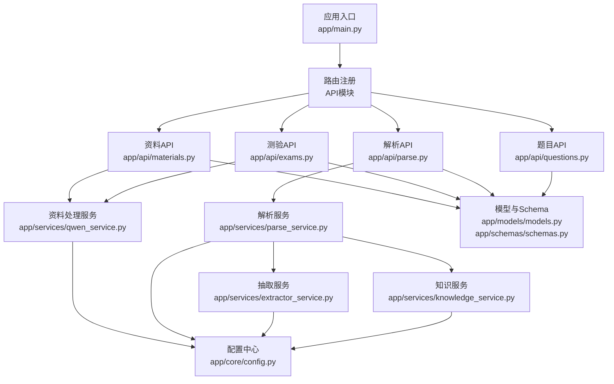
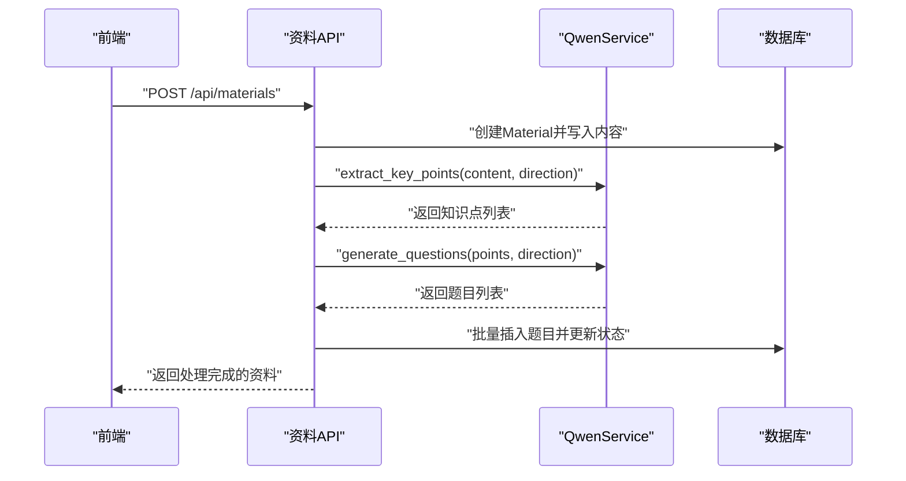
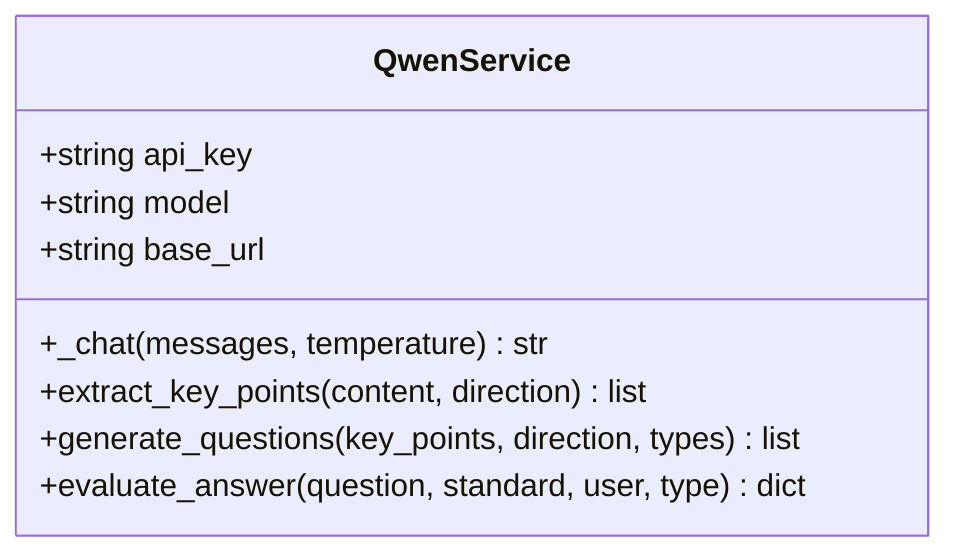
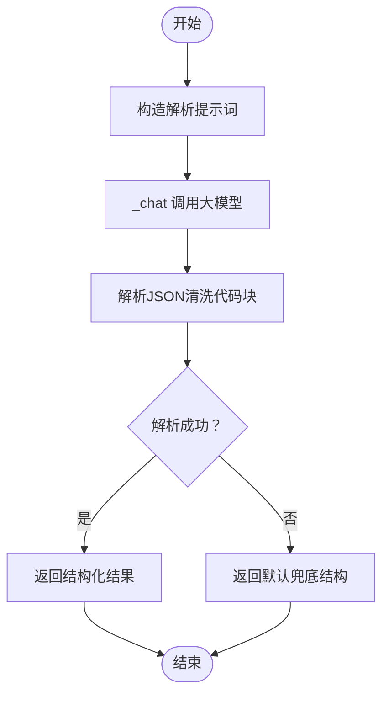
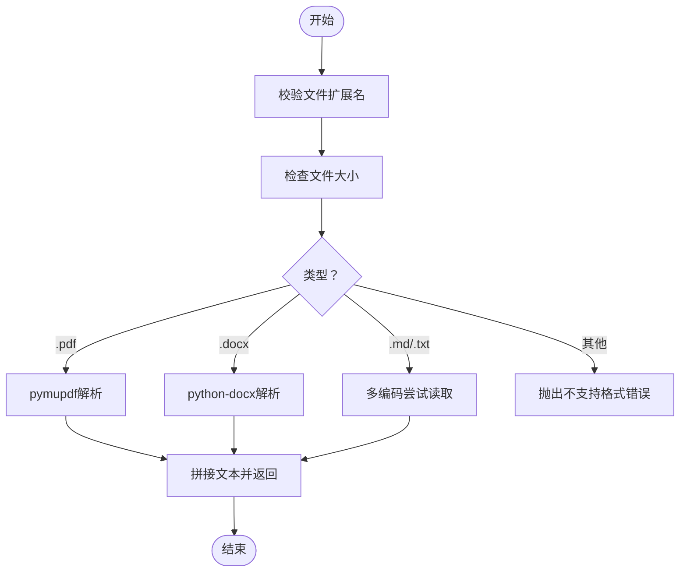
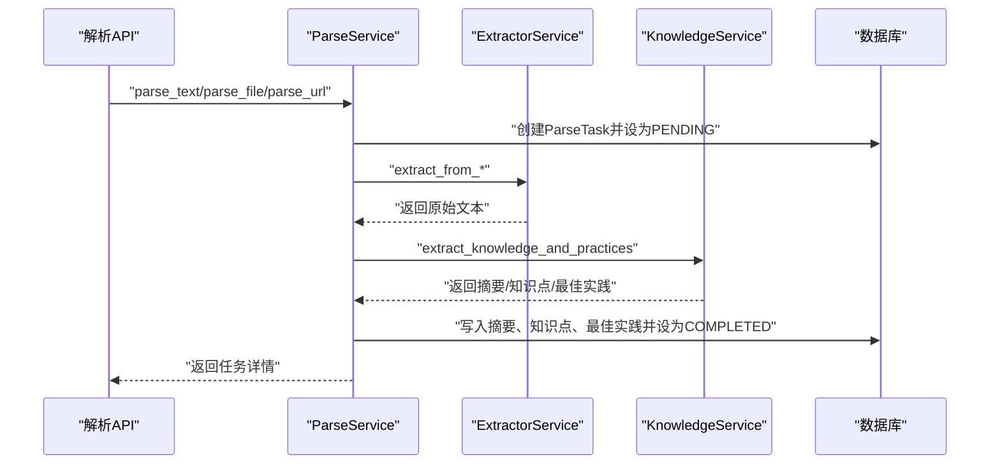
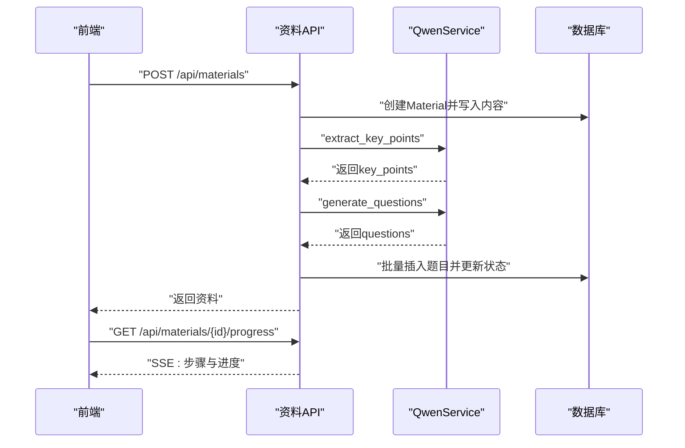
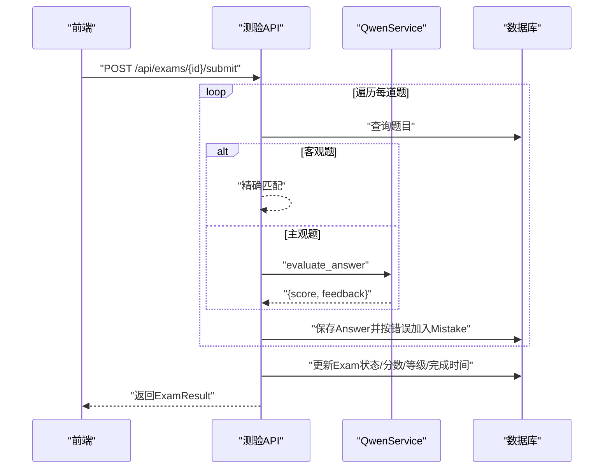
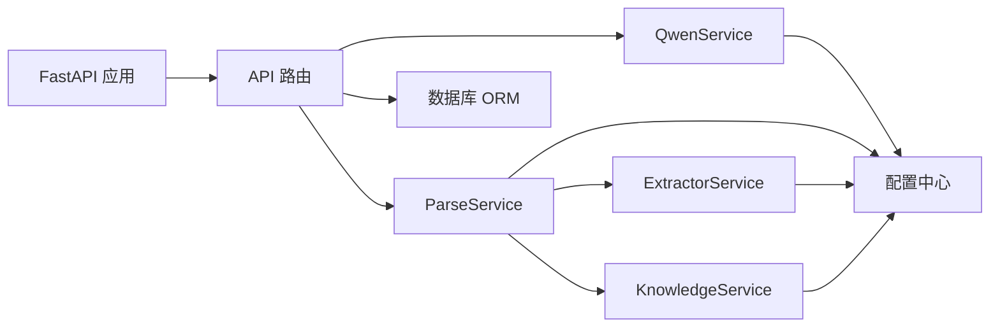
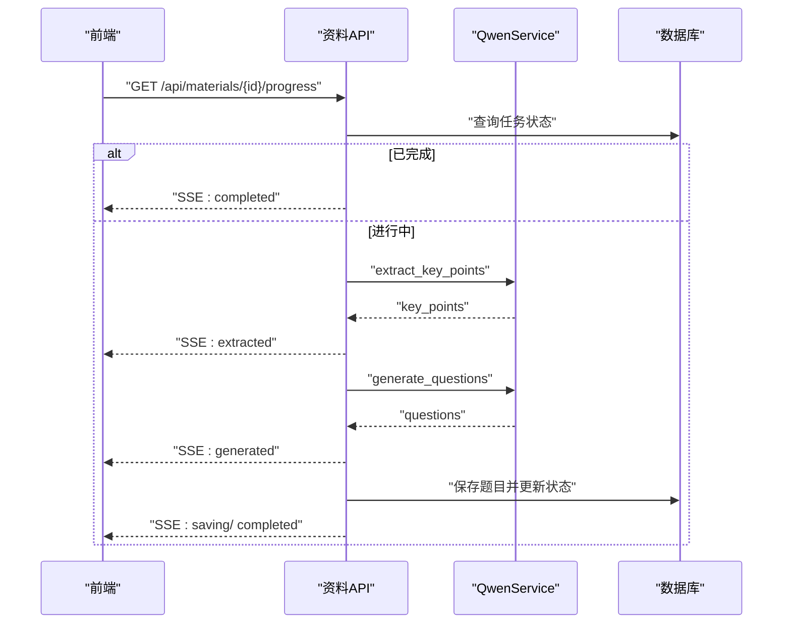

# AI服务集成

<cite>
**本文引用的文件**
- [backend/app/main.py](file://backend/app/main.py)
- [backend/app/core/config.py](file://backend/app/core/config.py)
- [backend/.env.example](file://backend/.env.example)
- [backend/pyproject.toml](file://backend/pyproject.toml)
- [backend/app/services/qwen_service.py](file://backend/app/services/qwen_service.py)
- [backend/app/services/knowledge_service.py](file://backend/app/services/knowledge_service.py)
- [backend/app/services/extractor_service.py](file://backend/app/services/extractor_service.py)
- [backend/app/services/parse_service.py](file://backend/app/services/parse_service.py)
- [backend/app/api/materials.py](file://backend/app/api/materials.py)
- [backend/app/api/exams.py](file://backend/app/api/exams.py)
- [backend/app/api/parse.py](file://backend/app/api/parse.py)
- [backend/app/api/questions.py](file://backend/app/api/questions.py)
- [backend/app/models/models.py](file://backend/app/models/models.py)
- [backend/app/schemas/schemas.py](file://backend/app/schemas/schemas.py)
</cite>

## 目录
1. [简介](#简介)
2. [项目结构](#项目结构)
3. [核心组件](#核心组件)
4. [架构总览](#架构总览)
5. [详细组件分析](#详细组件分析)
6. [依赖关系分析](#依赖关系分析)
7. [性能与成本优化](#性能与成本优化)
8. [异步与流式响应](#异步与流式响应)
9. [监控、日志与调试](#监控日志与调试)
10. [故障排查指南](#故障排查指南)
11. [结论](#结论)
12. [附录](#附录)

## 简介
本项目围绕通义千问（DashScope）API构建了一套“AI服务集成”的完整方案，覆盖资料解析、知识点提取、题目生成、主观题智能评分、测验流程与错题管理等能力。系统采用FastAPI提供REST接口，结合SQLAlchemy进行持久化，支持多源输入（文本、文件、URL），并通过SSE实现流式进度反馈。

## 项目结构
后端采用分层架构：
- 应用入口与路由注册：app/main.py
- 配置中心：app/core/config.py，配合.env示例
- 服务层：抽取、知识解析、通义千问封装
- API层：资料、题目、测验、解析任务等路由
- 模型与Schema：ORM模型与Pydantic数据模式
- 依赖声明：pyproject.toml

图表来源
- [backend/app/main.py](file://backend/app/main.py#L1-L66)
- [backend/app/api/materials.py](file://backend/app/api/materials.py#L1-L203)
- [backend/app/api/exams.py](file://backend/app/api/exams.py#L1-L240)
- [backend/app/api/parse.py](file://backend/app/api/parse.py#L1-L77)
- [backend/app/api/questions.py](file://backend/app/api/questions.py#L1-L90)
- [backend/app/services/qwen_service.py](file://backend/app/services/qwen_service.py#L1-L156)
- [backend/app/services/parse_service.py](file://backend/app/services/parse_service.py#L1-L163)
- [backend/app/services/extractor_service.py](file://backend/app/services/extractor_service.py#L1-L123)
- [backend/app/services/knowledge_service.py](file://backend/app/services/knowledge_service.py#L1-L114)
- [backend/app/core/config.py](file://backend/app/core/config.py#L1-L34)
- [backend/app/models/models.py](file://backend/app/models/models.py#L1-L223)
- [backend/app/schemas/schemas.py](file://backend/app/schemas/schemas.py#L1-L265)

章节来源
- [backend/app/main.py](file://backend/app/main.py#L1-L66)
- [backend/app/core/config.py](file://backend/app/core/config.py#L1-L34)
- [backend/pyproject.toml](file://backend/pyproject.toml#L1-L29)

## 核心组件
- 通义千问服务封装：统一调用dashscope兼容接口，封装知识点提取、题目生成、主观题评分等能力，并内置JSON解析容错。
- 知识解析服务：面向“纯文本/文件/URL”三类输入，统一调用抽取服务与大模型服务，产出摘要、知识点与最佳实践。
- 抽取服务：支持PDF、DOCX、MD、TXT等格式解析；支持URL抓取正文并清洗。
- 解析服务：编排抽取与大模型分析，持久化任务与结果。
- API层：提供资料、题目、测验、解析任务的REST接口，支持SSE流式进度反馈。
- 模型与Schema：定义学习方向、资料、题目、测验、答题、错题、解析任务等实体及枚举。

章节来源
- [backend/app/services/qwen_service.py](file://backend/app/services/qwen_service.py#L1-L156)
- [backend/app/services/knowledge_service.py](file://backend/app/services/knowledge_service.py#L1-L114)
- [backend/app/services/extractor_service.py](file://backend/app/services/extractor_service.py#L1-L123)
- [backend/app/services/parse_service.py](file://backend/app/services/parse_service.py#L1-L163)
- [backend/app/models/models.py](file://backend/app/models/models.py#L1-L223)
- [backend/app/schemas/schemas.py](file://backend/app/schemas/schemas.py#L1-L265)

## 架构总览
系统以“抽取—解析—生成—持久化—接口暴露”为主线，形成闭环的数据处理链路。资料API可同步或流式处理；解析API异步执行并落库；测验API调用AI评分主观题；前端通过SSE实时感知进度。

图表来源
- [backend/app/api/materials.py](file://backend/app/api/materials.py#L82-L161)
- [backend/app/services/qwen_service.py](file://backend/app/services/qwen_service.py#L37-L114)
- [backend/app/models/models.py](file://backend/app/models/models.py#L78-L114)

## 详细组件分析

### 通义千问服务封装（QwenService）
- 统一配置来源：从配置中心读取API密钥、模型与基础URL。
- 核心能力：
  - 提取知识点：面向学习资料，返回结构化知识点集合。
  - 生成题目：基于知识点生成多种题型的题目集合。
  - 评估答案：对主观题进行评分与反馈。
- 错误处理：对大模型返回的JSON进行容错解析，失败时返回兜底结构。
- 温度参数：不同任务采用不同温度以平衡创造性与稳定性。

图表来源
- [backend/app/services/qwen_service.py](file://backend/app/services/qwen_service.py#L10-L156)

章节来源
- [backend/app/services/qwen_service.py](file://backend/app/services/qwen_service.py#L1-L156)

### 知识解析服务（KnowledgeService）
- 输入：原始文本。
- 输出：摘要、知识点列表、最佳实践列表。
- 容错：对大模型返回的JSON进行清洗与解析，失败时返回默认结构。
- 超时：相较通用调用，解析任务采用更长超时时间以应对复杂内容。

图表来源
- [backend/app/services/knowledge_service.py](file://backend/app/services/knowledge_service.py#L51-L109)

章节来源
- [backend/app/services/knowledge_service.py](file://backend/app/services/knowledge_service.py#L1-L114)

### 抽取服务（ExtractorService）
- 文件抽取：支持PDF、DOCX、MD、TXT，自动识别编码与结构化文本。
- URL抽取：使用BeautifulSoup抓取正文并移除无关标签。
- 校验与限制：扩展名白名单、文件大小限制、空内容检测。
- 异常：针对不支持格式、编码失败、内容为空等情况抛出明确错误。

图表来源
- [backend/app/services/extractor_service.py](file://backend/app/services/extractor_service.py#L30-L118)

章节来源
- [backend/app/services/extractor_service.py](file://backend/app/services/extractor_service.py#L1-L123)

### 解析服务（ParseService）
- 编排：接收文本/文件/URL，调用抽取服务与知识服务，持久化摘要、知识点、最佳实践。
- 状态机：PENDING → PROCESSING → COMPLETED/FAILED，失败时记录错误信息。
- 查询：提供任务列表、详情、删除等操作。

图表来源
- [backend/app/services/parse_service.py](file://backend/app/services/parse_service.py#L15-L162)
- [backend/app/api/parse.py](file://backend/app/api/parse.py#L17-L76)

章节来源
- [backend/app/services/parse_service.py](file://backend/app/services/parse_service.py#L1-L163)
- [backend/app/api/parse.py](file://backend/app/api/parse.py#L1-L77)

### 资料API（资料上传与流式处理）
- 同步处理：创建资料后立即调用QwenService进行知识点提取与题目生成，并持久化。
- 流式处理：SSE返回三阶段进度（提取、生成、保存），失败时更新状态并返回错误。
- 安全与健壮性：前置校验方向存在、API密钥配置、异常捕获与状态回滚。

图表来源
- [backend/app/api/materials.py](file://backend/app/api/materials.py#L82-L161)
- [backend/app/api/materials.py](file://backend/app/api/materials.py#L164-L185)
- [backend/app/services/qwen_service.py](file://backend/app/services/qwen_service.py#L37-L114)

章节来源
- [backend/app/api/materials.py](file://backend/app/api/materials.py#L1-L203)

### 测验API（主观题AI评分与结果统计）
- 题型评分：客观题精确匹配，主观题调用QwenService进行评分与反馈。
- 结果汇总：计算总分、等级、正确数，并持久化答题记录与错题。
- 状态管理：完成时更新测验状态与完成时间。

图表来源
- [backend/app/api/exams.py](file://backend/app/api/exams.py#L127-L216)
- [backend/app/services/qwen_service.py](file://backend/app/services/qwen_service.py#L115-L151)

章节来源
- [backend/app/api/exams.py](file://backend/app/api/exams.py#L1-L240)

### 题目API与错题管理
- 题目API：提供列表、详情、更新、评价、删除等操作。
- 错题管理：主观题评分错误时自动记录至错题表，支持后续复习。

章节来源
- [backend/app/api/questions.py](file://backend/app/api/questions.py#L1-L90)
- [backend/app/models/models.py](file://backend/app/models/models.py#L136-L169)

## 依赖关系分析
- 运行时依赖：FastAPI、SQLAlchemy、httpx、BeautifulSoup、PyMuPDF、python-docx等。
- 配置依赖：dotenv加载.env，pydantic-settings校验与缓存Settings。
- 组件耦合：API层依赖服务层；服务层依赖配置中心；服务层之间通过职责分离降低耦合。

图表来源
- [backend/pyproject.toml](file://backend/pyproject.toml#L7-L22)
- [backend/app/main.py](file://backend/app/main.py#L7-L42)
- [backend/app/core/config.py](file://backend/app/core/config.py#L6-L33)

章节来源
- [backend/pyproject.toml](file://backend/pyproject.toml#L1-L29)
- [backend/app/core/config.py](file://backend/app/core/config.py#L1-L34)

## 性能与成本优化
- 温度参数：知识点提取与主观题评分采用较低温度以提升稳定性；题目生成适度提高温度以增加多样性。
- 超时控制：不同场景设置不同超时（通用60s、知识解析120s、URL抓取30s），避免长时间阻塞。
- 文件大小限制：防止过大文件导致内存与网络压力。
- JSON解析容错：对大模型返回的代码块进行清洗，减少解析失败率。
- 并发与限流：建议在网关或反向代理层做限流与熔断，避免突发流量冲击DashScope。
- 成本控制：合理选择模型（如qwen-plus）、控制请求频率与上下文长度、启用缓存热点数据（如常用知识点模板）。

章节来源
- [backend/app/services/qwen_service.py](file://backend/app/services/qwen_service.py#L18-L35)
- [backend/app/services/knowledge_service.py](file://backend/app/services/knowledge_service.py#L19-L36)
- [backend/app/services/extractor_service.py](file://backend/app/services/extractor_service.py#L99-L101)
- [backend/app/core/config.py](file://backend/app/core/config.py#L22-L23)

## 异步与流式响应
- 资料处理（SSE）：资料API提供进度流，分阶段推送“提取中/已提取/生成中/已生成/保存中/完成/错误”等事件，前端可实时展示。
- 测验提交：采用异步评分（主观题），完成后一次性返回结果。
- 抽取服务：文件读取与PDF解析为同步IO，但通过异步框架调度，避免阻塞主线程。

图表来源
- [backend/app/api/materials.py](file://backend/app/api/materials.py#L27-L80)
- [backend/app/api/materials.py](file://backend/app/api/materials.py#L164-L185)

章节来源
- [backend/app/api/materials.py](file://backend/app/api/materials.py#L27-L80)
- [backend/app/api/materials.py](file://backend/app/api/materials.py#L164-L185)

## 监控、日志与调试
- 日志：知识解析服务在JSON解析失败时记录原始片段；资料API在异常时记录堆栈并更新状态。
- 健康检查：根路径与/health用于快速验证服务可用性。
- 调试建议：
  - 使用FastAPI自动生成的OpenAPI文档与Swagger/ReDoc进行接口调试。
  - 在.env中开启DEBUG，观察详细异常信息。
  - 对DashScope调用增加重试与指数退避，避免瞬时抖动影响体验。

章节来源
- [backend/app/services/knowledge_service.py](file://backend/app/services/knowledge_service.py#L48-L49)
- [backend/app/api/materials.py](file://backend/app/api/materials.py#L146-L159)
- [backend/app/main.py](file://backend/app/main.py#L62-L65)

## 故障排查指南
- API密钥未配置：资料创建时报错提示，请检查.env中的QWEN_API_KEY。
- 不支持的文件格式：确保扩展名为.pdf/.docx/.md/.txt之一。
- 文件过大：超出max_file_size限制会报错，请压缩或拆分文件。
- URL抓取失败：检查网络连通性与目标站点robots协议，必要时调整UA或延时。
- 大模型返回非JSON：服务内置清洗逻辑，若仍失败，检查提示词与上下文长度。
- 测验提交异常：确认题目存在且题型匹配，主观题评分依赖AI，失败时返回兜底分数与提示。

章节来源
- [backend/app/api/materials.py](file://backend/app/api/materials.py#L94-L96)
- [backend/app/services/extractor_service.py](file://backend/app/services/extractor_service.py#L23-L28)
- [backend/app/services/extractor_service.py](file://backend/app/services/extractor_service.py#L35-L36)
- [backend/app/services/extractor_service.py](file://backend/app/services/extractor_service.py#L112-L118)
- [backend/app/services/knowledge_service.py](file://backend/app/services/knowledge_service.py#L48-L49)
- [backend/app/api/exams.py](file://backend/app/api/exams.py#L155-L169)

## 结论
本项目以通义千问为核心，构建了从“资料抽取—知识解析—题目生成—智能评分—错题管理”的完整AI服务链路。通过清晰的分层设计、完善的错误处理与流式进度反馈，既保证了易用性，也为后续扩展与优化提供了良好基础。

## 附录

### Prompt工程最佳实践与模板设计
- 知识点提取：明确角色定位（教师）、限定输出结构（JSON数组）、约束数量与重要度范围，避免冗余与漂移。
- 题目生成：给出知识点清单、题型范围、难度分布、选项数量等约束，确保输出可解析与可入库。
- 主观题评分：提供题目、标准答案要点、学生答案，要求返回评分与反馈，便于教学改进。
- 容错策略：在提示词中强调仅返回JSON，服务侧再进行代码块清洗与解析。

章节来源
- [backend/app/services/qwen_service.py](file://backend/app/services/qwen_service.py#L37-L151)

### 配置管理与API密钥管理
- 配置项：应用名、数据库URL、DashScope API密钥、模型、基础URL、上传目录与文件大小限制。
- 环境变量：参考.env.example，区分开发与生产数据库连接。
- 密钥安全：建议使用平台密钥管理服务或加密存储，避免硬编码与泄露。

章节来源
- [backend/app/core/config.py](file://backend/app/core/config.py#L6-L27)
- [backend/.env.example](file://backend/.env.example#L1-L14)