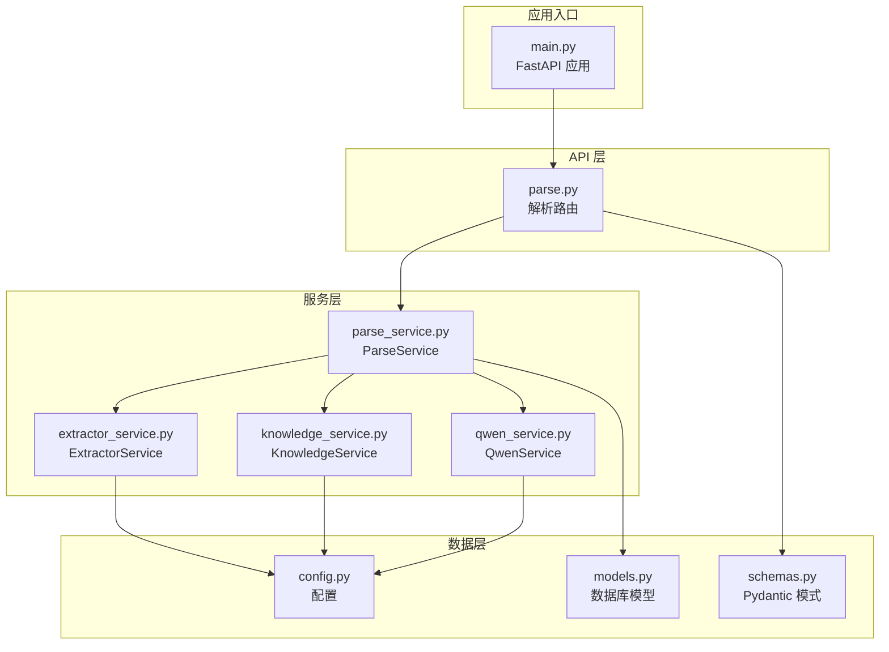
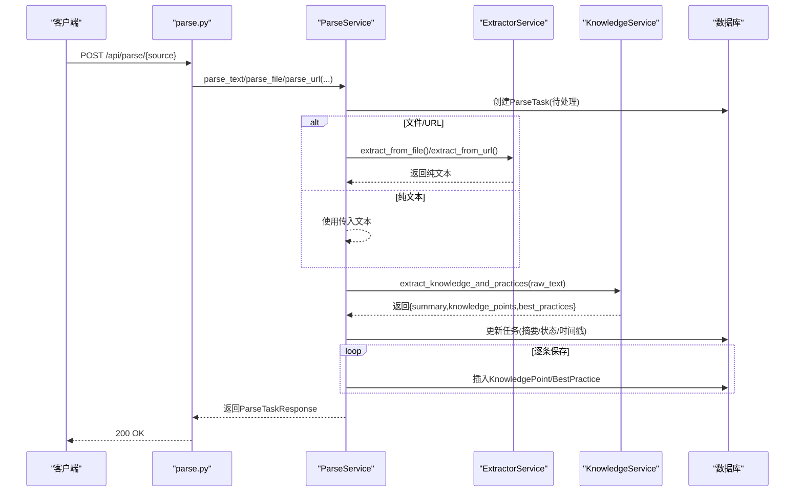
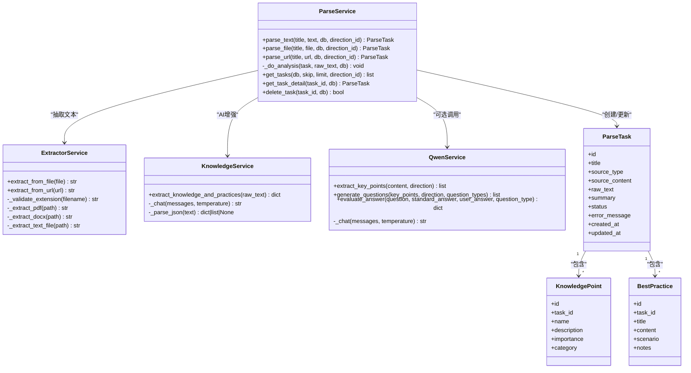
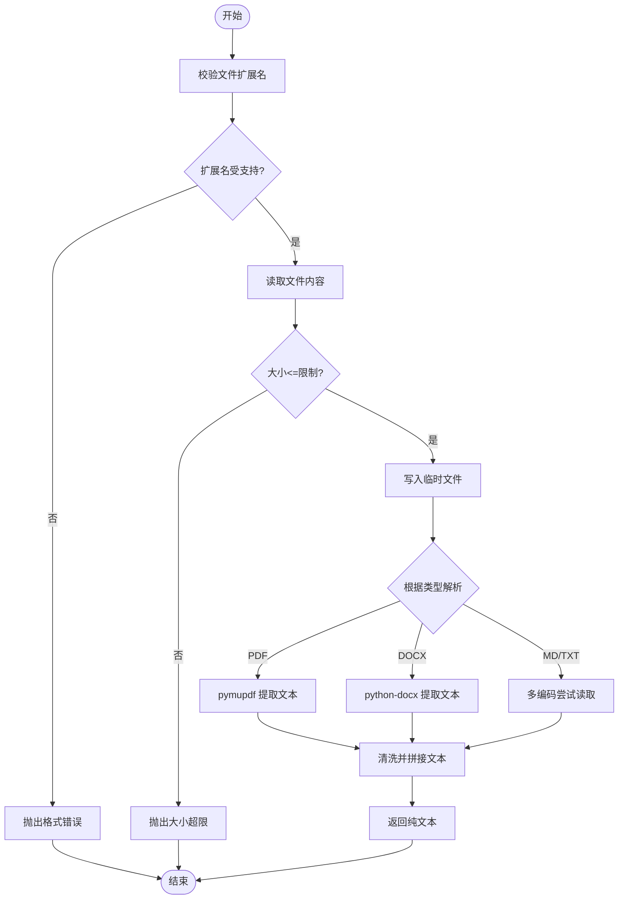
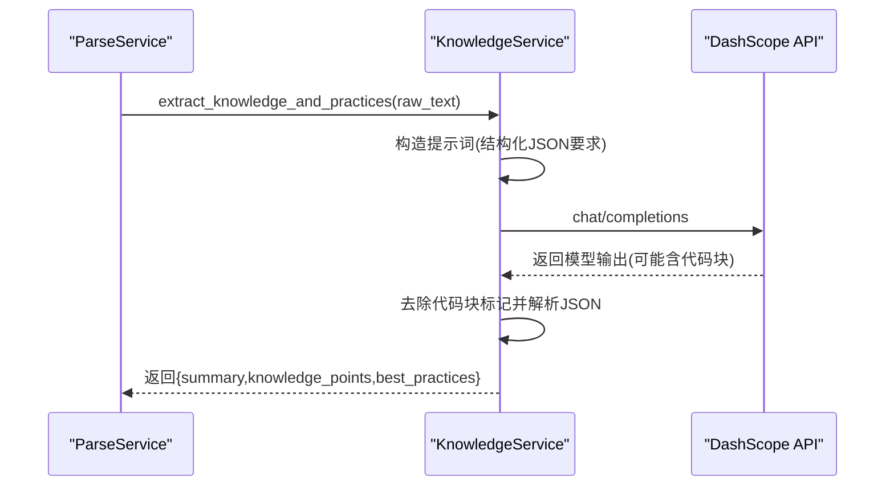
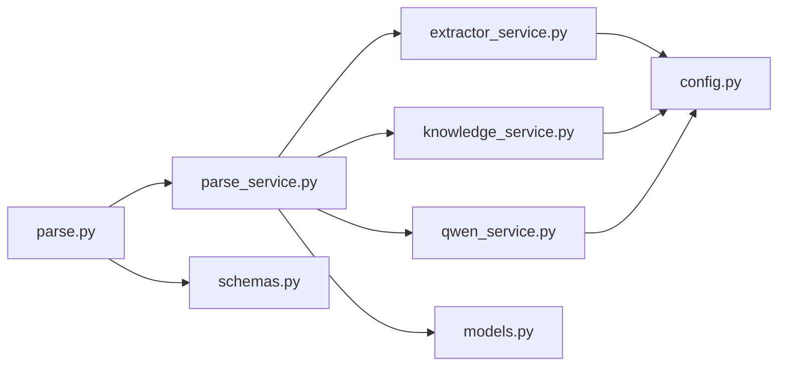

# 内容解析服务

<cite>
**本文引用的文件**
- [parse_service.py](file://backend/app/services/parse_service.py)
- [qwen_service.py](file://backend/app/services/qwen_service.py)
- [knowledge_service.py](file://backend/app/services/knowledge_service.py)
- [extractor_service.py](file://backend/app/services/extractor_service.py)
- [parse.py](file://backend/app/api/parse.py)
- [models.py](file://backend/app/models/models.py)
- [schemas.py](file://backend/app/schemas/schemas.py)
- [config.py](file://backend/app/core/config.py)
- [main.py](file://backend/app/main.py)
- [pyproject.toml](file://backend/pyproject.toml)
</cite>

## 目录
1. [简介](#简介)
2. [项目结构](#项目结构)
3. [核心组件](#核心组件)
4. [架构总览](#架构总览)
5. [详细组件分析](#详细组件分析)
6. [依赖关系分析](#依赖关系分析)
7. [性能考量](#性能考量)
8. [故障排查指南](#故障排查指南)
9. [结论](#结论)
10. [附录](#附录)

## 简介
本文件面向“内容解析服务”，聚焦 parse_service 模块的职责与实现，系统阐述其如何对学习材料进行深度解析与结构化处理，并与 QwenService/KnowledgeService 的集成方式、解析策略、质量评估、性能优化与错误处理机制。文档同时给出可操作的最佳实践，帮助开发者与使用者理解并高效使用该能力。

## 项目结构
后端采用 FastAPI + SQLAlchemy 架构，解析服务位于 app/services 目录下，API 路由位于 app/api，数据模型与序列化模式位于 app/models 与 app/schemas，配置位于 app/core。解析服务通过 ExtractorService 从文件/URL抽取纯文本，再交由 KnowledgeService/QwenService 进行 AI 增强，最终持久化到数据库。

图表来源
- [parse.py](file://backend/app/api/parse.py#L1-L77)
- [parse_service.py](file://backend/app/services/parse_service.py#L1-L163)
- [extractor_service.py](file://backend/app/services/extractor_service.py#L1-L123)
- [knowledge_service.py](file://backend/app/services/knowledge_service.py#L1-L114)
- [qwen_service.py](file://backend/app/services/qwen_service.py#L1-L156)
- [models.py](file://backend/app/models/models.py#L1-L223)
- [schemas.py](file://backend/app/schemas/schemas.py#L1-L265)
- [config.py](file://backend/app/core/config.py#L1-L34)
- [main.py](file://backend/app/main.py#L1-L66)

章节来源
- [main.py](file://backend/app/main.py#L1-L66)
- [pyproject.toml](file://backend/pyproject.toml#L1-L29)

## 核心组件
- ParseService：协调文本提取与 AI 分析，驱动解析任务生命周期，负责任务状态流转与持久化。
- ExtractorService：从上传文件（PDF/DOCX/MARKDOWN/TXT）与 URL 中提取纯文本，包含格式校验、编码处理、超时与大小限制。
- KnowledgeService：封装通义千问 API，负责从原始文本中抽取“知识点”“最佳实践”“摘要”，并具备 JSON 容错解析。
- QwenService：提供更通用的问答/出题/评分能力，供上层业务按需调用。
- API 路由：提供文本、文件、URL 三种解析入口，以及任务查询、详情、删除等管理接口。
- 数据模型与序列化：定义解析任务、知识点、最佳实践等实体及响应模式。

章节来源
- [parse_service.py](file://backend/app/services/parse_service.py#L15-L163)
- [extractor_service.py](file://backend/app/services/extractor_service.py#L20-L123)
- [knowledge_service.py](file://backend/app/services/knowledge_service.py#L11-L114)
- [qwen_service.py](file://backend/app/services/qwen_service.py#L10-L156)
- [parse.py](file://backend/app/api/parse.py#L1-L77)
- [models.py](file://backend/app/models/models.py#L171-L223)
- [schemas.py](file://backend/app/schemas/schemas.py#L192-L265)

## 架构总览
解析服务的整体流程如下：
- 接收输入（文本/文件/URL），创建解析任务并置为待处理。
- 使用 ExtractorService 抽取纯文本；若失败则回退至错误状态。
- 调用 KnowledgeService/QwenService 执行 AI 增强，产出摘要、知识点与最佳实践。
- 将结果写入数据库，更新任务状态为完成；异常时记录错误并置为失败。

图表来源
- [parse.py](file://backend/app/api/parse.py#L17-L46)
- [parse_service.py](file://backend/app/services/parse_service.py#L57-L132)
- [extractor_service.py](file://backend/app/services/extractor_service.py#L30-L118)
- [knowledge_service.py](file://backend/app/services/knowledge_service.py#L51-L109)
- [models.py](file://backend/app/models/models.py#L171-L223)

## 详细组件分析

### ParseService 组件
- 职责
  - 统一调度解析流程：创建任务、抽取文本、AI 分析、持久化、状态更新。
  - 支持三种输入源：纯文本、上传文件、URL。
  - 提供任务列表、详情查询、删除等管理接口。
- 关键流程
  - 任务创建与状态初始化（待处理）。
  - 文本抽取与错误捕获（文件大小、格式、编码、网络异常）。
  - AI 增强（摘要、知识点、最佳实践）。
  - 结果入库（摘要、知识点、最佳实践）。
  - 失败回退（设置失败状态与错误信息）。
- 数据模型映射
  - ParseTask：任务元数据、来源类型、状态、摘要、错误信息。
  - KnowledgePoint：知识点名称、描述、重要性、分类。
  - BestPractice：实践标题、内容、适用场景、注意事项。

图表来源
- [parse_service.py](file://backend/app/services/parse_service.py#L15-L163)
- [extractor_service.py](file://backend/app/services/extractor_service.py#L20-L123)
- [knowledge_service.py](file://backend/app/services/knowledge_service.py#L11-L114)
- [qwen_service.py](file://backend/app/services/qwen_service.py#L10-L156)
- [models.py](file://backend/app/models/models.py#L171-L223)

章节来源
- [parse_service.py](file://backend/app/services/parse_service.py#L15-L163)
- [models.py](file://backend/app/models/models.py#L171-L223)

### ExtractorService 组件
- 功能
  - 文件提取：PDF（pymupdf）、DOCX（python-docx）、MARKDOWN/TXT（多编码尝试）。
  - URL 抓取：HTTPX 异步抓取，BeautifulSoup 清洗正文，移除脚本/样式/导航等无关内容。
  - 校验与限制：扩展名白名单、文件大小上限、编码容错。
- 错误处理
  - 不支持格式抛出异常。
  - 超过大小限制抛出异常。
  - 抽取空内容或无法解码时抛出异常。
- 性能特性
  - 异步 HTTPX 抓取，超时控制。
  - 临时文件写入与清理，避免内存峰值。

图表来源
- [extractor_service.py](file://backend/app/services/extractor_service.py#L30-L118)
- [config.py](file://backend/app/core/config.py#L22-L23)

章节来源
- [extractor_service.py](file://backend/app/services/extractor_service.py#L20-L123)
- [config.py](file://backend/app/core/config.py#L22-L23)

### KnowledgeService/QwenService 组件
- KnowledgeService
  - 通过通义千问 API 提取“摘要”“知识点”“最佳实践”，并进行 JSON 容错解析。
  - 默认温度较低，提升结构化输出稳定性。
- QwenService
  - 提供更通用的问答/出题/评分能力，便于上层业务组合使用。
  - 包含 JSON 容错处理，自动去除代码块标记并解析。
- 集成方式
  - ParseService 在完成文本抽取后，直接调用 KnowledgeService 的抽取方法，获得结构化结果后入库。

图表来源
- [knowledge_service.py](file://backend/app/services/knowledge_service.py#L51-L109)
- [qwen_service.py](file://backend/app/services/qwen_service.py#L18-L35)

章节来源
- [knowledge_service.py](file://backend/app/services/knowledge_service.py#L11-L114)
- [qwen_service.py](file://backend/app/services/qwen_service.py#L10-L156)

### API 路由与序列化
- 路由
  - POST /api/parse/text：解析纯文本。
  - POST /api/parse/file：解析上传文件（支持 PDF/DOCX/MD/TXT）。
  - POST /api/parse/url：解析 URL。
  - GET /api/parse/tasks：任务列表。
  - GET /api/parse/tasks/{task_id}：任务详情（含知识点与最佳实践）。
  - DELETE /api/parse/tasks/{task_id}：删除任务。
- 序列化
  - ParseTextRequest/ParseUrlRequest：请求体。
  - ParseTaskResponse：任务详情（含摘要、知识点、最佳实践）。
  - TaskListResponse：任务列表。

章节来源
- [parse.py](file://backend/app/api/parse.py#L1-L77)
- [schemas.py](file://backend/app/schemas/schemas.py#L192-L265)

## 依赖关系分析
- 组件耦合
  - ParseService 依赖 ExtractorService（抽取）、KnowledgeService（AI 增强）。
  - API 层仅依赖 ParseService 与序列化模式。
  - 数据模型与服务层解耦，通过 ORM 映射。
- 外部依赖
  - DashScope 通义千问 API（知识抽取与问答）。
  - PDF/DOCX 文本提取库（pymupdf、python-docx）。
  - HTTPX 异步 HTTP 客户端。
  - BeautifulSoup/LXML HTML 解析。
- 可能的循环依赖
  - 当前模块间无循环导入，保持清晰的单向依赖。

图表来源
- [parse.py](file://backend/app/api/parse.py#L1-L77)
- [parse_service.py](file://backend/app/services/parse_service.py#L1-L163)
- [extractor_service.py](file://backend/app/services/extractor_service.py#L1-L123)
- [knowledge_service.py](file://backend/app/services/knowledge_service.py#L1-L114)
- [qwen_service.py](file://backend/app/services/qwen_service.py#L1-L156)
- [models.py](file://backend/app/models/models.py#L1-L223)
- [schemas.py](file://backend/app/schemas/schemas.py#L1-L265)
- [config.py](file://backend/app/core/config.py#L1-L34)

章节来源
- [pyproject.toml](file://backend/pyproject.toml#L7-L22)

## 性能考量
- 异步 I/O
  - HTTPX 异步抓取网页与调用 DashScope API，减少阻塞。
- 内存与磁盘
  - 文件解析先写入临时文件，避免一次性加载大文件到内存；解析完成后清理临时文件。
- 超时与限制
  - 抓取超时、DashScope 调用超时、文件大小限制，防止资源耗尽。
- JSON 容错
  - 大模型输出可能包含代码块标记，服务层统一去除并解析，降低失败率。
- 并发与队列
  - 当前实现为同步调用，建议在高并发场景引入消息队列与异步 worker，将解析任务放入队列，后台消费以提升吞吐量。

章节来源
- [extractor_service.py](file://backend/app/services/extractor_service.py#L30-L55)
- [knowledge_service.py](file://backend/app/services/knowledge_service.py#L19-L36)
- [qwen_service.py](file://backend/app/services/qwen_service.py#L18-L35)
- [config.py](file://backend/app/core/config.py#L22-L23)

## 故障排查指南
- 常见错误与定位
  - 文件格式不支持：检查扩展名是否在白名单内。
  - 文件过大：确认 max_file_size 配置与实际上传大小。
  - 编码问题：TXT/MD 多编码尝试仍失败，检查文件编码。
  - 网络异常：URL 抓取超时或返回非 2xx，检查网络与目标站点。
  - DashScope API 失败：检查 API Key、模型名与 Base URL 配置。
  - JSON 解析失败：模型输出包含代码块标记或格式不规范，服务层已做容错，但建议记录日志以便复现。
- 日志与状态
  - ParseService 记录解析失败日志并设置任务状态为失败，同时保留错误信息，便于前端展示与追踪。
- 回退机制
  - 文本抽取失败：直接进入失败状态。
  - AI 增强失败：返回默认结构（摘要提示重试，空知识点与最佳实践）。
- 建议
  - 前端显示任务详情时，优先展示 summary 与 error_message。
  - 对于失败任务，提供“重新解析”入口（可复用原任务 ID 或新建任务）。

章节来源
- [extractor_service.py](file://backend/app/services/extractor_service.py#L23-L36)
- [extractor_service.py](file://backend/app/services/extractor_service.py#L93-L118)
- [knowledge_service.py](file://backend/app/services/knowledge_service.py#L38-L49)
- [parse_service.py](file://backend/app/services/parse_service.py#L70-L79)
- [parse_service.py](file://backend/app/services/parse_service.py#L95-L105)
- [parse_service.py](file://backend/app/services/parse_service.py#L121-L131)

## 结论
内容解析服务通过“抽取 + AI 增强 + 结构化存储”的闭环，实现了对学习材料的深度解析与知识沉淀。其设计强调可扩展性与鲁棒性：ExtractorService 负责稳健的文本抽取，KnowledgeService/QwenService 提供结构化输出与容错解析，ParseService 统一编排任务生命周期并持久化结果。结合异步 I/O、临时文件与超时限制，系统在性能与稳定性之间取得平衡。未来可在高并发场景引入消息队列与异步 worker，进一步提升吞吐与可维护性。

## 附录

### 支持的解析策略与能力
- 文本抽取策略
  - PDF：按页提取文本，拼接后返回。
  - DOCX：读取段落文本，过滤空白段落。
  - MARKDOWN/TXT：多编码尝试（UTF-8/GBK/GB2312/Latin-1），失败则报编码不支持。
  - URL：移除脚本/样式/导航等无关标签，优先提取 article/main/body。
- AI 增强策略
  - 结构化提示词：限定输出 JSON 字段与格式，降低歧义。
  - JSON 容错：自动去除代码块标记并解析，失败时返回默认结构。
  - 温度控制：抽取阶段温度较低，保证结构化输出稳定性。
- 上下文关联
  - 通过“摘要”“知识点”“最佳实践”三者协同，形成从概览到细节再到实践的完整知识图谱。

章节来源
- [extractor_service.py](file://backend/app/services/extractor_service.py#L57-L118)
- [knowledge_service.py](file://backend/app/services/knowledge_service.py#L51-L95)
- [qwen_service.py](file://backend/app/services/qwen_service.py#L37-L114)

### 解析质量评估机制
- 准确性检查
  - JSON 容错解析：若模型输出包含代码块标记，自动剥离并解析；失败时记录日志并降级。
  - 字段完整性：要求返回 summary、knowledge_points、best_practices 三个字段。
- 完整性验证
  - 知识点与最佳实践数量：分别限定范围（5-10 个知识点、3-8 条实践），超出或不足时提示人工复核。
  - 摘要长度：建议在 100-200 字之间，便于前端展示与检索。
- 一致性处理
  - 重要性与分类：重要性为 1-5，分类为可选标签，保持统一格式。
  - 场景与注意事项：最佳实践的场景与注意事项字段用于上下文关联，便于后续题目生成与复习策略制定。

章节来源
- [knowledge_service.py](file://backend/app/services/knowledge_service.py#L51-L95)
- [knowledge_service.py](file://backend/app/services/knowledge_service.py#L38-L49)

### 大文件与高并发处理建议
- 大文件处理
  - 临时文件写入 + 按页/段落读取，避免一次性加载到内存。
  - 设置合理 max_file_size，防止内存溢出。
- 高并发
  - 引入消息队列（如 Redis/RabbitMQ）与异步 worker，将解析任务入队，后台消费。
  - 对 DashScope API 调用增加重试与熔断策略，避免雪崩效应。
  - 前端轮询改为长连接或 WebSocket 推送，减少无效请求。

章节来源
- [extractor_service.py](file://backend/app/services/extractor_service.py#L38-L55)
- [config.py](file://backend/app/core/config.py#L22-L23)