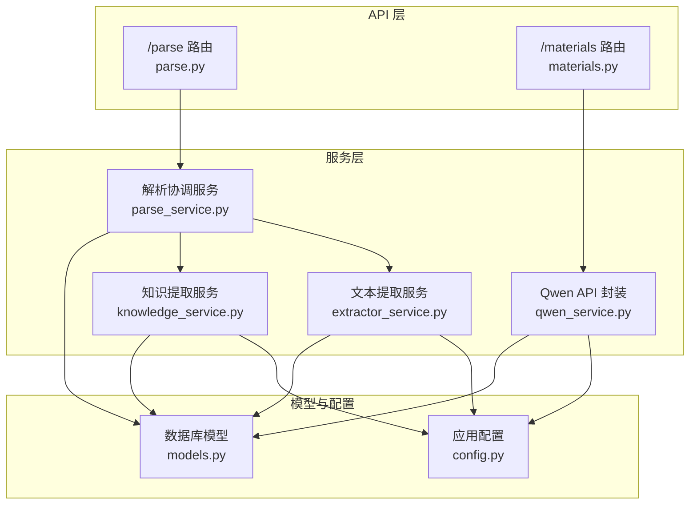
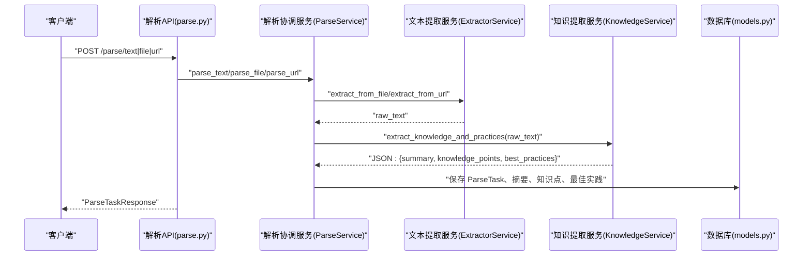
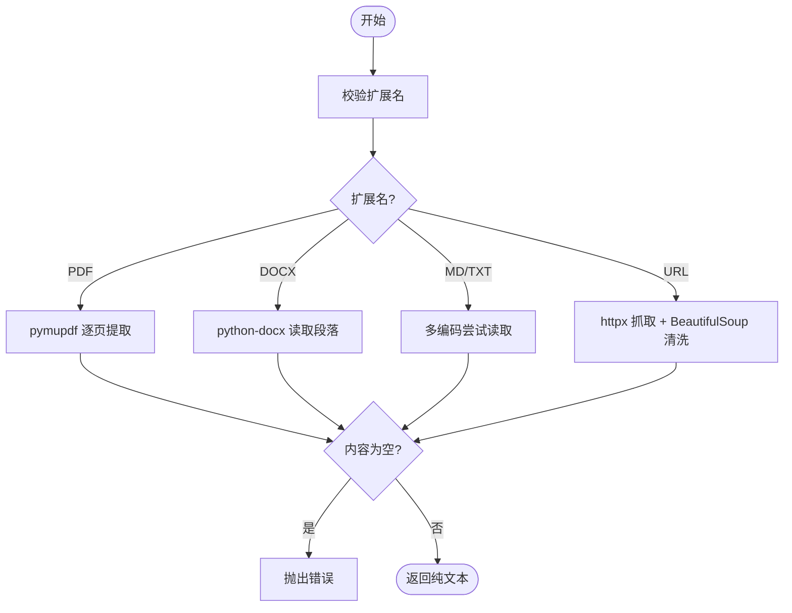
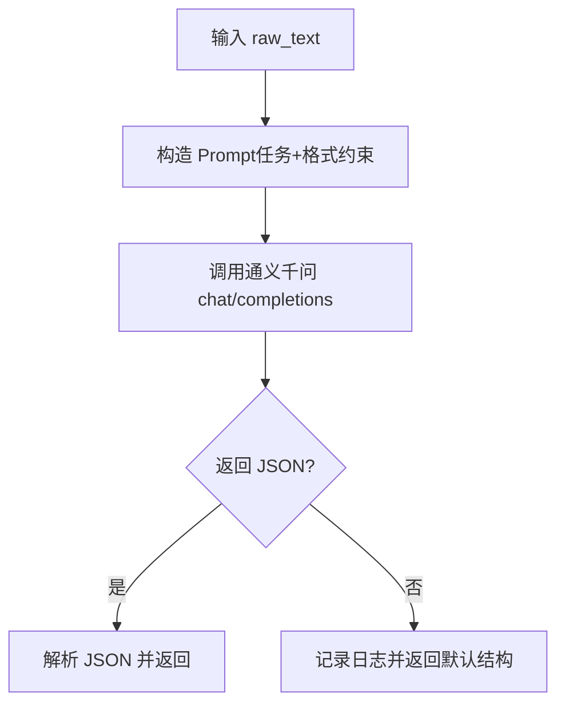
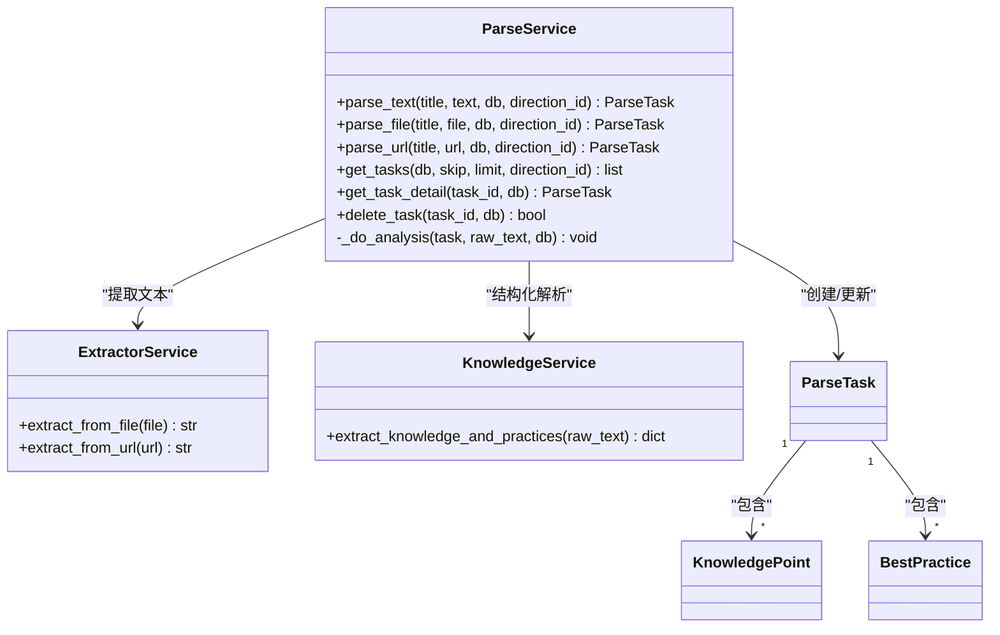
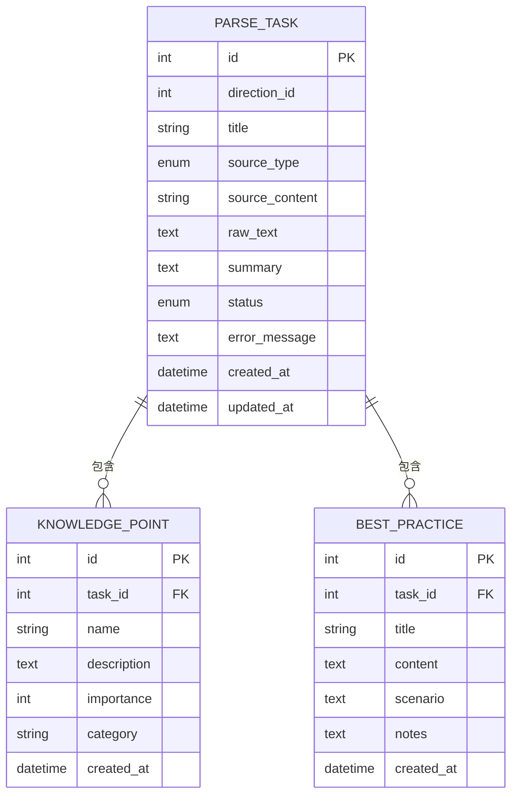
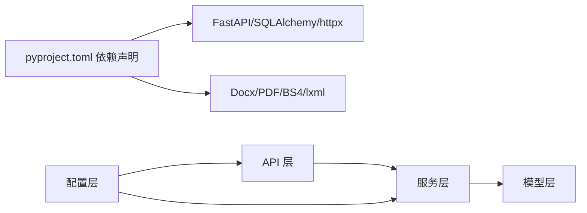

# 知识点提取服务

<cite>
**本文引用的文件**
- [extractor_service.py](file://backend/app/services/extractor_service.py)
- [knowledge_service.py](file://backend/app/services/knowledge_service.py)
- [parse_service.py](file://backend/app/services/parse_service.py)
- [qwen_service.py](file://backend/app/services/qwen_service.py)
- [models.py](file://backend/app/models/models.py)
- [config.py](file://backend/app/core/config.py)
- [materials.py](file://backend/app/api/materials.py)
- [parse.py](file://backend/app/api/parse.py)
- [schemas.py](file://backend/app/schemas/schemas.py)
- [pyproject.toml](file://backend/pyproject.toml)
- [test_full_flow.py](file://backend/test_full_flow.py)
- [test_qwen.py](file://backend/test_qwen.py)
</cite>

## 目录
1. [简介](#简介)
2. [项目结构](#项目结构)
3. [核心组件](#核心组件)
4. [架构总览](#架构总览)
5. [详细组件分析](#详细组件分析)
6. [依赖关系分析](#依赖关系分析)
7. [性能与可扩展性](#性能与可扩展性)
8. [故障排查指南](#故障排查指南)
9. [结论](#结论)
10. [附录](#附录)

## 简介
本文件面向“知识点提取服务”的设计与实现，聚焦 extractor_service 模块在文件解析、内容预处理与知识点抽取流程中的职责与协作关系。文档涵盖：
- 支持的文件格式（PDF、Word、文本/Markdown）的处理机制与流程
- Prompt 设计与 JSON 输出约束、质量控制
- 知识点结构化存储方案（重要程度、去重、关联关系）
- 性能优化策略（批量、缓存、并发）
- 错误恢复、异常处理与调试技巧

## 项目结构
后端采用 FastAPI + SQLAlchemy 架构，按功能域划分服务层与 API 层，模型定义集中于 models，配置统一通过 pydantic-settings 的 Settings 类管理。

图表来源
- [parse.py](file://backend/app/api/parse.py#L1-L77)
- [materials.py](file://backend/app/api/materials.py#L1-L203)
- [parse_service.py](file://backend/app/services/parse_service.py#L1-L163)
- [extractor_service.py](file://backend/app/services/extractor_service.py#L1-L123)
- [knowledge_service.py](file://backend/app/services/knowledge_service.py#L1-L114)
- [qwen_service.py](file://backend/app/services/qwen_service.py#L1-L156)
- [models.py](file://backend/app/models/models.py#L1-L223)
- [config.py](file://backend/app/core/config.py#L1-L34)

章节来源
- [pyproject.toml](file://backend/pyproject.toml#L1-L29)
- [config.py](file://backend/app/core/config.py#L1-L34)

## 核心组件
- 文本提取服务（ExtractorService）：负责从上传文件与 URL 中提取纯文本，支持 PDF、DOCX、MD、TXT，并进行格式校验、大小限制与编码容错。
- 知识提取服务（KnowledgeService）：封装通义千问 API，构造领域特定的 Prompt，限定 JSON 输出结构，解析并容错处理返回结果。
- 解析协调服务（ParseService）：编排“提取 → 大模型分析 → 结果持久化”的完整流程，维护 ParseTask 及其关联的知识点、最佳实践。
- 数据模型（models.py）：定义学习方向、资料、题目、测验、答题、错题、解析任务、知识点、最佳实践等实体及枚举。
- API 层：对外暴露解析与资料处理接口，支持纯文本、文件、URL 三种输入方式；资料处理支持同步与流式进度。

章节来源
- [extractor_service.py](file://backend/app/services/extractor_service.py#L20-L123)
- [knowledge_service.py](file://backend/app/services/knowledge_service.py#L11-L114)
- [parse_service.py](file://backend/app/services/parse_service.py#L15-L163)
- [models.py](file://backend/app/models/models.py#L48-L223)
- [parse.py](file://backend/app/api/parse.py#L1-L77)
- [materials.py](file://backend/app/api/materials.py#L1-L203)

## 架构总览
知识点提取服务的整体流程如下：
- 输入入口：API 接收文本、文件或 URL
- 文本提取：ExtractorService 将不同格式标准化为纯文本
- 大模型分析：KnowledgeService 使用定制 Prompt 产出结构化 JSON
- 结果持久化：ParseService 将摘要、知识点、最佳实践写入数据库
- 查询与展示：通过 API 获取任务详情、列表与进度

图表来源
- [parse.py](file://backend/app/api/parse.py#L17-L46)
- [parse_service.py](file://backend/app/services/parse_service.py#L57-L132)
- [extractor_service.py](file://backend/app/services/extractor_service.py#L30-L118)
- [knowledge_service.py](file://backend/app/services/knowledge_service.py#L51-L109)
- [models.py](file://backend/app/models/models.py#L171-L223)

## 详细组件分析

### 文本提取服务（ExtractorService）
- 功能职责
  - 校验文件扩展名，限制最大文件大小
  - 临时文件落盘后解析：PDF 使用 pymupdf，DOCX 使用 python-docx，MD/TXT 采用多编码尝试读取
  - 从 URL 抓取网页正文，移除脚本、样式等无关标签，优先提取 article/main/body
- 错误处理
  - 不支持格式、空内容、解码失败、网络异常均抛出明确错误
- 性能考虑
  - 临时文件在 finally 中清理，避免磁盘泄漏
  - 编码尝试顺序优化常见编码，减少失败重试

图表来源
- [extractor_service.py](file://backend/app/services/extractor_service.py#L23-L118)

章节来源
- [extractor_service.py](file://backend/app/services/extractor_service.py#L16-L123)

### 知识提取服务（KnowledgeService）
- Prompt 设计
  - 明确任务：从给定内容提炼 5-10 个核心知识点、3-8 条最佳实践、100-200 字摘要
  - 输出格式约束：严格 JSON，包含 summary、knowledge_points、best_practices 三部分
  - 质量控制：temperature=0.3，提升确定性；对返回内容进行 JSON 包裹识别与容错解析
- 返回结构
  - knowledge_points：name/description/importance/category
  - best_practices：title/content/scenario/notes
- 异常处理
  - JSON 解析失败时返回默认结构，保证下游可用性

图表来源
- [knowledge_service.py](file://backend/app/services/knowledge_service.py#L51-L109)

章节来源
- [knowledge_service.py](file://backend/app/services/knowledge_service.py#L11-L114)

### 解析协调服务（ParseService）
- 协调流程
  - 创建 ParseTask，状态从 PENDING → PROCESSING → COMPLETED/FALIED
  - 调用 ExtractorService 获取 raw_text，再调用 KnowledgeService 获取结构化结果
  - 将摘要、知识点、最佳实践持久化到数据库
- 错误处理
  - 捕获异常并回滚状态与错误信息
- 查询与管理
  - 支持任务列表、详情查询、删除（级联删除）

图表来源
- [parse_service.py](file://backend/app/services/parse_service.py#L15-L163)
- [extractor_service.py](file://backend/app/services/extractor_service.py#L20-L123)
- [knowledge_service.py](file://backend/app/services/knowledge_service.py#L11-L114)
- [models.py](file://backend/app/models/models.py#L171-L223)

章节来源
- [parse_service.py](file://backend/app/services/parse_service.py#L15-L163)
- [models.py](file://backend/app/models/models.py#L171-L223)

### 数据模型与存储方案
- 实体与关系
  - ParseTask：任务元数据、来源类型、状态、摘要、错误信息
  - KnowledgePoint：name/description/importance/category
  - BestPractice：title/content/scenario/notes
  - 关系：ParseTask 一对多关联 KnowledgePoint、BestPractice（级联删除）
- 结构化存储策略
  - 重要程度：importance 为 1-5 整数，便于排序与筛选
  - 去重处理：当前未见显式去重逻辑，可在业务层基于 name/description 去重
  - 关联关系：通过 task_id 建立强关联，支持任务删除时级联清理

图表来源
- [models.py](file://backend/app/models/models.py#L171-L223)

章节来源
- [models.py](file://backend/app/models/models.py#L48-L223)

### API 与工作流
- 知识解析 API
  - 支持文本、文件、URL 三种输入
  - 返回 ParseTaskResponse，包含摘要、知识点、最佳实践
- 资料处理 API
  - materials.py 提供同步处理与 SSE 进度流
  - 同步流程：先提取知识点，再生成题目，最后保存题目并更新状态

章节来源
- [parse.py](file://backend/app/api/parse.py#L1-L77)
- [materials.py](file://backend/app/api/materials.py#L1-L203)
- [schemas.py](file://backend/app/schemas/schemas.py#L192-L265)

## 依赖关系分析
- 外部依赖
  - FastAPI、SQLAlchemy、httpx、BeautifulSoup4、lxml、pymupdf、python-docx
- 内部依赖
  - services 之间通过单例共享配置与模型
  - API 层依赖服务层，服务层依赖模型层

图表来源
- [pyproject.toml](file://backend/pyproject.toml#L7-L22)
- [parse.py](file://backend/app/api/parse.py#L1-L77)
- [materials.py](file://backend/app/api/materials.py#L1-L203)
- [config.py](file://backend/app/core/config.py#L1-L34)

章节来源
- [pyproject.toml](file://backend/pyproject.toml#L1-L29)
- [config.py](file://backend/app/core/config.py#L1-L34)

## 性能与可扩展性
- 批量处理
  - 当前解析流程为单任务串行；可引入队列（如 Celery/RQ）与后台任务，实现异步批处理
- 缓存机制
  - 对频繁访问的 Prompt 或中间结果进行本地缓存（如 Redis），降低重复计算
- 并发控制
  - 限制同时进行的解析任务数量，避免资源争用
- I/O 优化
  - PDF/DOCX 解析时尽量复用连接池与会话，避免重复初始化
- 数据库优化
  - 为 ParseTask、KnowledgePoint、BestPractice 建立索引（如 status、task_id、created_at）
- 超时与重试
  - 为外部 API（通义千问）设置合理超时与指数退避重试策略

[本节为通用性能建议，无需具体文件来源]

## 故障排查指南
- 常见问题与定位
  - 文件格式不支持：检查扩展名白名单与大小限制
  - PDF/DOCX 解析失败：确认安装对应依赖并检查页面/段落数量
  - 文本编码错误：确认文件编码，必要时手动指定或转换
  - URL 抓取失败：检查网络连通性、User-Agent、重定向策略
  - 通义千问返回非 JSON：检查 Prompt 是否严格要求 JSON，启用容错解析
  - 数据库写入失败：检查外键约束、事务提交与回滚
- 日志与调试
  - 使用服务层 logger 记录关键路径与异常堆栈
  - 在 API 层捕获异常并返回明确错误信息
  - 使用测试脚本验证端到端流程（如 test_full_flow.py、test_qwen.py）

章节来源
- [extractor_service.py](file://backend/app/services/extractor_service.py#L23-L118)
- [knowledge_service.py](file://backend/app/services/knowledge_service.py#L38-L109)
- [parse_service.py](file://backend/app/services/parse_service.py#L72-L131)
- [test_full_flow.py](file://backend/test_full_flow.py#L1-L56)
- [test_qwen.py](file://backend/test_qwen.py#L1-L23)

## 结论
知识点提取服务通过清晰的分层设计实现了从多源输入到结构化知识的完整闭环。ExtractorService 提供稳健的文本提取能力，KnowledgeService 以严格的 Prompt 与 JSON 约束保障输出质量，ParseService 则将流程与持久化解耦，便于扩展与维护。未来可在并发、缓存与批处理方面进一步优化，以支撑更大规模的业务场景。

[本节为总结性内容，无需具体文件来源]

## 附录
- 配置项参考
  - qwen_api_key、qwen_model、qwen_base_url：通义千问接入参数
  - upload_dir、max_file_size：文件上传目录与大小限制
- 测试参考
  - test_full_flow.py：端到端流程测试
  - test_qwen.py：题目生成测试

章节来源
- [config.py](file://backend/app/core/config.py#L16-L24)
- [test_full_flow.py](file://backend/test_full_flow.py#L1-L56)
- [test_qwen.py](file://backend/test_qwen.py#L1-L23)