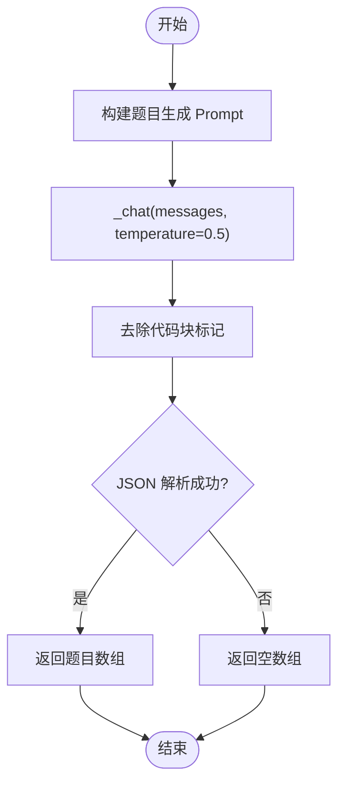

# 通义千问服务封装

<cite>
**本文引用的文件**
- [qwen_service.py](file://backend/app/services/qwen_service.py)
- [config.py](file://backend/app/core/config.py)
- [.env.example](file://backend/.env.example)
- [test_qwen.py](file://backend/test_qwen.py)
- [exams.py](file://backend/app/api/exams.py)
- [questions.py](file://backend/app/api/questions.py)
- [models.py](file://backend/app/models/models.py)
- [pyproject.toml](file://backend/pyproject.toml)
- [knowledge_service.py](file://backend/app/services/knowledge_service.py)
</cite>

## 目录
1. [简介](#简介)
2. [项目结构](#项目结构)
3. [核心组件](#核心组件)
4. [架构总览](#架构总览)
5. [详细组件分析](#详细组件分析)
6. [依赖关系分析](#依赖关系分析)
7. [性能与优化建议](#性能与优化建议)
8. [故障排查指南](#故障排查指南)
9. [结论](#结论)
10. [附录](#附录)

## 简介
本文件面向“通义千问服务封装”的实现与使用，重点围绕 QwenService 类的设计与实现，涵盖：
- API 初始化与配置管理
- 异步调用机制与 HTTP 客户端配置
- 三大核心 AI 功能：知识点提取、题目生成、答案评估
- Prompt 工程最佳实践与参数调优
- 错误处理策略（JSON 解析异常、网络超时、API 响应错误）
- 配置管理、API 密钥安全与性能优化建议

## 项目结构
后端采用 FastAPI + SQLAlchemy 架构，QwenService 作为独立服务模块被 API 层调用，用于生成题目与评分主观题。


图表来源
- [exams.py](file://backend/app/api/exams.py#L12-L166)
- [questions.py](file://backend/app/api/questions.py#L1-L90)
- [qwen_service.py](file://backend/app/services/qwen_service.py#L10-L156)
- [knowledge_service.py](file://backend/app/services/knowledge_service.py#L11-L114)
- [config.py](file://backend/app/core/config.py#L6-L34)
- [models.py](file://backend/app/models/models.py#L95-L168)

章节来源
- [pyproject.toml](file://backend/pyproject.toml#L1-L29)
- [config.py](file://backend/app/core/config.py#L6-L34)

## 核心组件
- QwenService：封装通义千问 API 的异步调用，提供三个核心方法：
  - extract_key_points：从学习资料中提取核心知识点
  - generate_questions：基于知识点生成题目
  - evaluate_answer：对主观题进行评分与反馈
- 配置模块 Settings：集中管理 API 密钥、模型名、基础地址等
- API 路由 exams.py：在提交测验时调用 evaluate_answer 进行主观题评分
- 模型 models.py：定义测验、题目、答题记录、错题等数据模型

章节来源
- [qwen_service.py](file://backend/app/services/qwen_service.py#L10-L156)
- [config.py](file://backend/app/core/config.py#L6-L34)
- [exams.py](file://backend/app/api/exams.py#L127-L166)
- [models.py](file://backend/app/models/models.py#L95-L168)

## 架构总览
QwenService 通过 httpx.AsyncClient 发起异步请求，统一在 _chat 方法中完成认证头、消息体与温度参数的组装，并解析返回的 JSON 字段。三大业务方法分别构造不同领域的 Prompt 并调用 _chat，再对返回内容进行 JSON 解析与容错处理。


图表来源
- [qwen_service.py](file://backend/app/services/qwen_service.py#L18-L35)
- [qwen_service.py](file://backend/app/services/qwen_service.py#L37-L64)
- [qwen_service.py](file://backend/app/services/qwen_service.py#L66-L113)
- [qwen_service.py](file://backend/app/services/qwen_service.py#L115-L151)

## 详细组件分析

### QwenService 类设计与实现
- 设计要点
  - 单例模式：通过模块级实例 qwen_service 提供全局访问
  - 配置注入：在构造函数中读取 Settings 中的 qwen_api_key、qwen_model、qwen_base_url
  - 异步调用：使用 httpx.AsyncClient，支持超时控制与并发
  - 统一入口：_chat 方法封装 HTTP 请求与响应解析，其他方法仅负责 Prompt 构造与结果容错
- 关键属性
  - api_key：从环境配置读取
  - model：模型名，默认 qwen-plus
  - base_url：DashScope 兼容模式基础地址
- 关键方法
  - _chat：发送 POST 请求，校验状态码，解析 choices[0].message.content
  - extract_key_points：构造知识点提取 Prompt，温度较低以提升确定性
  - generate_questions：构造题目生成 Prompt，温度适中以平衡创造性
  - evaluate_answer：构造主观题评分 Prompt，温度较低以保持稳定评分


图表来源
- [qwen_service.py](file://backend/app/services/qwen_service.py#L10-L156)

章节来源
- [qwen_service.py](file://backend/app/services/qwen_service.py#L10-L156)
- [config.py](file://backend/app/core/config.py#L16-L19)

### _chat 方法实现原理
- HTTP 客户端配置
  - 使用 httpx.AsyncClient，超时 60 秒
  - 请求路径：base_url/chat/completions
  - 请求头：Authorization: Bearer {api_key}，Content-Type: application/json
  - 请求体：model、messages、temperature
- 响应处理
  - 调用 response.raise_for_status() 抛出 HTTP 错误
  - 解析 JSON，取 choices[0].message.content 作为回答文本
- 错误处理
  - 未显式捕获网络异常；建议在上层路由或调用处增加 try/catch

章节来源
- [qwen_service.py](file://backend/app/services/qwen_service.py#L18-L35)

### extract_key_points（知识点提取）
- 输入：学习资料内容、学科方向
- Prompt 设计要点
  - 明确角色（教师）与任务（提取5-10个核心知识点）
  - 约束输出格式（JSON 数组），字段包括：point、description、importance
  - 限制输出长度与范围，避免冗余
- 温度参数：0.3，强调确定性与一致性
- 结果解析与容错
  - 支持去除 Markdown 代码块标记（```json...```）
  - JSON 解析失败时返回兜底结构，保证流程不中断


图表来源
- [qwen_service.py](file://backend/app/services/qwen_service.py#L37-L64)

章节来源
- [qwen_service.py](file://backend/app/services/qwen_service.py#L37-L64)

### generate_questions（题目生成）
- 输入：知识点列表、学科方向、可选题型集合
- Prompt 设计要点
  - 明确角色（出题教师）与任务（为每个知识点生成1-2道题）
  - 约束题型、难度分布、选择题选项数量
  - 输出格式约束（JSON 数组），字段包括：type、difficulty、content、options、answer、explanation、knowledge_point
- 温度参数：0.5，适度提升创造性
- 结果解析与容错
  - 支持去除 Markdown 代码块标记
  - JSON 解析失败时返回空数组，避免阻断流程



图表来源
- [qwen_service.py](file://backend/app/services/qwen_service.py#L66-L113)

章节来源
- [qwen_service.py](file://backend/app/services/qwen_service.py#L66-L113)

### evaluate_answer（答案评估）
- 输入：题目内容、标准答案要点、用户答案、题型
- Prompt 设计要点
  - 明确角色（阅卷教师）与任务（评估主观题）
  - 输出格式约束（JSON 对象），字段包括：score、feedback、key_points_hit、key_points_missed
- 温度参数：0.3，强调稳定评分
- 结果解析与容错
  - 支持去除 Markdown 代码块标记
  - JSON 解析失败时返回兜底结构（score=0，提示重试）


图表来源
- [qwen_service.py](file://backend/app/services/qwen_service.py#L115-L151)

章节来源
- [qwen_service.py](file://backend/app/services/qwen_service.py#L115-L151)

### 在 API 中的应用
- 提交测验时，API 路由 exams.py 调用 evaluate_answer 对主观题进行评分，并将结果写入数据库 Answer 表
- 题目列表与详情由 questions.py 提供，支持按材料、方向、题型过滤


图表来源
- [exams.py](file://backend/app/api/exams.py#L127-L216)
- [qwen_service.py](file://backend/app/services/qwen_service.py#L115-L151)
- [models.py](file://backend/app/models/models.py#L136-L152)

章节来源
- [exams.py](file://backend/app/api/exams.py#L127-L216)
- [models.py](file://backend/app/models/models.py#L136-L152)

## 依赖关系分析
- 外部依赖
  - httpx：异步 HTTP 客户端
  - pydantic-settings：配置加载与类型校验
  - fastapi/sqlalchemy：API 与 ORM
- 内部依赖
  - QwenService 依赖 Settings（通过 get_settings）
  - API 路由依赖 QwenService 单例
  - 数据模型定义用于持久化测验与答题记录


图表来源
- [qwen_service.py](file://backend/app/services/qwen_service.py#L5-L7)
- [config.py](file://backend/app/core/config.py#L30-L33)
- [exams.py](file://backend/app/api/exams.py#L12-L12)
- [knowledge_service.py](file://backend/app/services/knowledge_service.py#L5-L8)

章节来源
- [pyproject.toml](file://backend/pyproject.toml#L7-L22)
- [config.py](file://backend/app/core/config.py#L30-L33)

## 性能与优化建议
- 超时与并发
  - 当前 _chat 使用 60 秒超时；若 API 响应较慢，可考虑在调用侧增加重试与超时上限
  - 由于 QwenService 为单例且方法均为异步，可在高并发场景下复用同一实例
- 温度参数调优
  - 知识点提取与答案评估使用较低温度（0.3），确保稳定性
  - 题目生成使用中等温度（0.5），在创造性与一致性之间平衡
- Prompt 工程
  - 明确输出格式约束（JSON），并在 Prompt 中强调只返回 JSON，减少解析歧义
  - 使用分步骤提示（如先摘要、再要点、再实践）可提升复杂任务的稳定性
- 缓存与去重
  - 对重复的 Prompt 或相同输入可考虑缓存结果（需注意隐私与时效性）
- 日志与监控
  - 建议在 _chat 外层增加网络异常捕获与日志记录，便于定位问题

[本节为通用建议，不直接分析具体文件]

## 故障排查指南
- JSON 解析异常
  - 现象：返回内容包含代码块标记或非标准 JSON
  - 处理：去除 ```json...``` 包裹后尝试解析；解析失败时返回兜底结构
  - 建议：在上层 API 中捕获异常并记录原始响应，辅助调试
- 网络超时与连接错误
  - 现象：httpx.AsyncClient 超时或连接失败
  - 处理：在调用侧增加 try/catch，设置重试与退避策略
- API 响应错误
  - 现象：response.raise_for_status() 抛出 HTTP 错误
  - 处理：在调用侧捕获异常，记录状态码与响应体，必要时降级处理
- 配置问题
  - 现象：无法获取 API 密钥或模型名为空
  - 处理：检查 .env 文件与环境变量是否正确加载；确认 Settings 的 env_file 路径

章节来源
- [qwen_service.py](file://backend/app/services/qwen_service.py#L55-L64)
- [qwen_service.py](file://backend/app/services/qwen_service.py#L104-L113)
- [qwen_service.py](file://backend/app/services/qwen_service.py#L142-L151)
- [config.py](file://backend/app/core/config.py#L25-L27)

## 结论
QwenService 以简洁的异步封装实现了三类核心 AI 能力，配合明确的 Prompt 约束与 JSON 解析容错，能够在实际业务中稳定运行。建议在上层 API 中补充完善的异常处理与日志记录，并结合温度参数与 Prompt 工程持续优化输出质量与稳定性。

[本节为总结性内容，不直接分析具体文件]

## 附录

### Prompt 工程最佳实践
- 设计原则
  - 角色明确：限定模型扮演的角色（教师/阅卷教师/知识管理专家）
  - 任务清晰：分步骤给出任务目标与约束条件
  - 输出格式：严格约束 JSON 字段与结构，强调“只返回 JSON”
  - 示例引导：在复杂任务中加入少量示例可提升稳定性
- 温度参数调优
  - 稳定性优先：知识点提取与答案评估使用低温度（0.3）
  - 创造性优先：题目生成使用中等温度（0.5）
- JSON 格式约束
  - 在 Prompt 中明确字段与取值范围，避免模型自由发挥
  - 若模型返回 Markdown 代码块包裹，应在解析前剥离

章节来源
- [qwen_service.py](file://backend/app/services/qwen_service.py#L37-L64)
- [qwen_service.py](file://backend/app/services/qwen_service.py#L66-L113)
- [qwen_service.py](file://backend/app/services/qwen_service.py#L115-L151)

### 配置管理与 API 密钥安全
- 配置来源
  - Settings 通过 .env 文件加载，支持 UTF-8 编码
  - 建议在部署时使用环境变量覆盖 .env 中的敏感信息
- 密钥安全
  - 不在代码仓库中提交真实密钥
  - 使用只读权限的环境变量，避免在日志中打印密钥
  - 建议在生产环境使用密钥轮换与访问审计

章节来源
- [config.py](file://backend/app/core/config.py#L25-L27)
- [.env.example](file://backend/.env.example#L1-L14)

### 快速测试
- 使用 test_qwen.py 可快速验证 generate_questions 是否正常工作
- 建议在本地先配置 .env，再运行测试脚本

章节来源
- [test_qwen.py](file://backend/test_qwen.py#L1-L23)