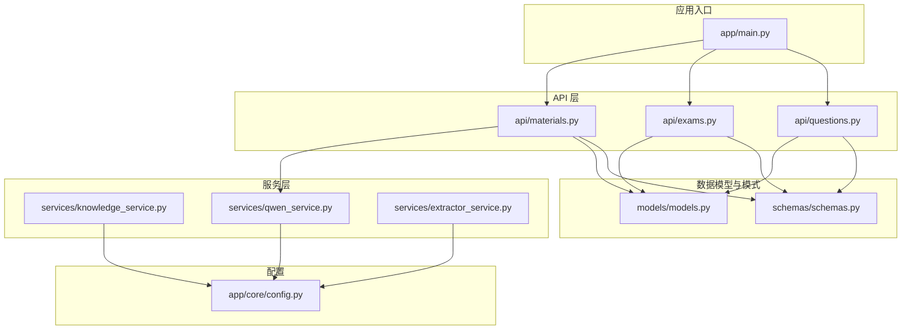
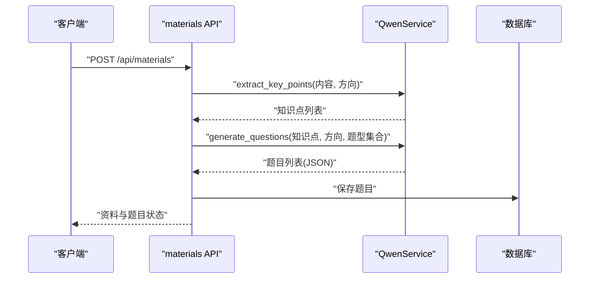
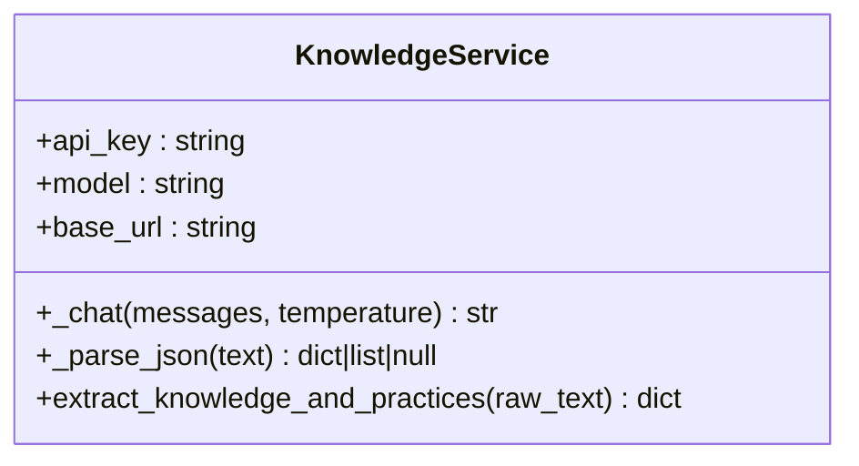
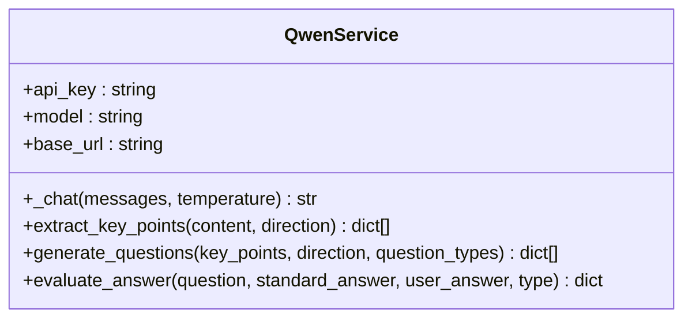
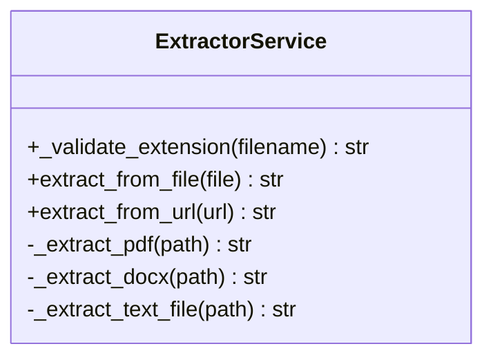
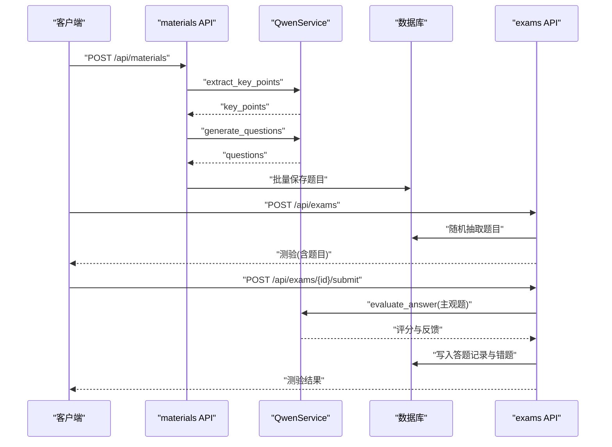
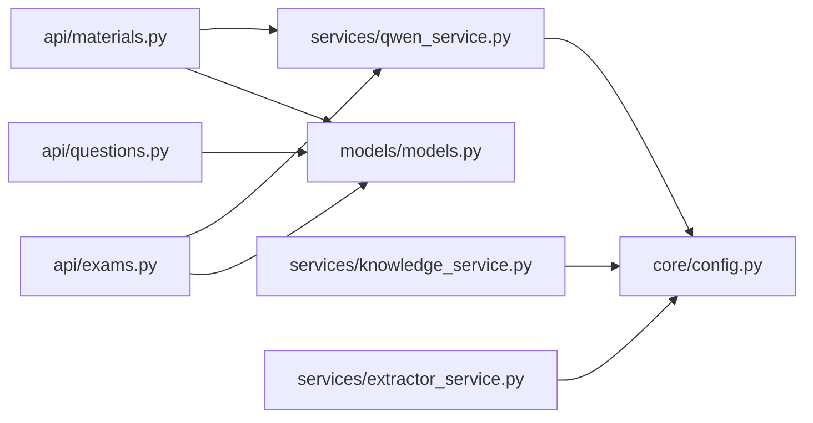

# 题目生成服务

<cite>
**本文引用的文件**
- [backend/app/services/knowledge_service.py](file://backend/app/services/knowledge_service.py)
- [backend/app/services/qwen_service.py](file://backend/app/services/qwen_service.py)
- [backend/app/services/extractor_service.py](file://backend/app/services/extractor_service.py)
- [backend/app/models/models.py](file://backend/app/models/models.py)
- [backend/app/schemas/schemas.py](file://backend/app/schemas/schemas.py)
- [backend/app/api/materials.py](file://backend/app/api/materials.py)
- [backend/app/api/exams.py](file://backend/app/api/exams.py)
- [backend/app/api/questions.py](file://backend/app/api/questions.py)
- [backend/app/core/config.py](file://backend/app/core/config.py)
- [backend/app/main.py](file://backend/app/main.py)
- [backend/test_api.py](file://backend/test_api.py)
</cite>

## 目录
1. [简介](#简介)
2. [项目结构](#项目结构)
3. [核心组件](#核心组件)
4. [架构总览](#架构总览)
5. [详细组件分析](#详细组件分析)
6. [依赖关系分析](#依赖关系分析)
7. [性能考量](#性能考量)
8. [故障排查指南](#故障排查指南)
9. [结论](#结论)
10. [附录](#附录)

## 简介
本文件围绕“题目生成服务”的设计与实现展开，重点阐述基于知识点的智能题目生成机制、题型体系（单选、多选、判断、简答）、Prompt 工程策略（难度分布、知识点匹配、题型多样性）、题目质量控制（逻辑一致性、答案唯一性、表述清晰度）、个性化定制（难度调节、题型偏好、学习目标适配）、题目存储与元数据管理、版本控制策略，以及与测验系统的集成与实时生成机制。

## 项目结构
后端采用 FastAPI + SQLAlchemy 架构，服务层负责与大模型交互（通义千问），API 层提供资料上传、题目管理、测验创建与评分、错题管理等能力；模型与模式定义统一在 models 与 schemas 中；配置集中于 core/config。

图表来源
- [backend/app/main.py](file://backend/app/main.py#L1-L66)
- [backend/app/core/config.py](file://backend/app/core/config.py#L1-L34)
- [backend/app/services/qwen_service.py](file://backend/app/services/qwen_service.py#L1-L156)
- [backend/app/services/knowledge_service.py](file://backend/app/services/knowledge_service.py#L1-L114)
- [backend/app/services/extractor_service.py](file://backend/app/services/extractor_service.py#L1-L123)
- [backend/app/api/materials.py](file://backend/app/api/materials.py#L1-L203)
- [backend/app/api/exams.py](file://backend/app/api/exams.py#L1-L240)
- [backend/app/api/questions.py](file://backend/app/api/questions.py#L1-L90)
- [backend/app/models/models.py](file://backend/app/models/models.py#L1-L223)
- [backend/app/schemas/schemas.py](file://backend/app/schemas/schemas.py#L1-L265)

章节来源
- [backend/app/main.py](file://backend/app/main.py#L1-L66)
- [backend/app/core/config.py](file://backend/app/core/config.py#L1-L34)

## 核心组件
- 知识服务（KnowledgeService）：封装通义千问接口，负责从原始内容中提炼知识点、最佳实践与摘要，并具备 JSON 容错解析能力。
- 通义千问服务（QwenService）：封装通义千问接口，提供知识点抽取、题目生成、主观题评分三大能力；内置 Prompt 工程与 JSON 容错解析。
- 文本提取服务（ExtractorService）：支持 PDF、DOCX、MD、TXT 等文件与 URL 的文本提取，保障输入质量。
- 数据模型（Models）：定义学习方向、资料、题目、测验、答题、错题等实体及枚举类型。
- 数据模式（Schemas）：定义 API 输入输出的数据结构，确保前后端一致。
- API 层：
  - materials：资料上传、知识点提炼、题目生成、进度流式返回。
  - exams：测验创建、提交、评分、结果查询。
  - questions：题目查询、更新、评价、删除。
- 配置（Config）：集中管理应用配置、数据库连接、通义千问 API 参数等。

章节来源
- [backend/app/services/knowledge_service.py](file://backend/app/services/knowledge_service.py#L1-L114)
- [backend/app/services/qwen_service.py](file://backend/app/services/qwen_service.py#L1-L156)
- [backend/app/services/extractor_service.py](file://backend/app/services/extractor_service.py#L1-L123)
- [backend/app/models/models.py](file://backend/app/models/models.py#L1-L223)
- [backend/app/schemas/schemas.py](file://backend/app/schemas/schemas.py#L1-L265)
- [backend/app/api/materials.py](file://backend/app/api/materials.py#L1-L203)
- [backend/app/api/exams.py](file://backend/app/api/exams.py#L1-L240)
- [backend/app/api/questions.py](file://backend/app/api/questions.py#L1-L90)
- [backend/app/core/config.py](file://backend/app/core/config.py#L1-L34)

## 架构总览
系统围绕“资料 → 知识点 → 题目 → 测验”的主流程构建，资料经由文本提取服务清洗后，交由通义千问服务进行知识点提炼与题目生成，随后持久化至数据库；测验阶段依据题型差异采用客观题精确匹配或主观题 AI 评分。

图表来源
- [backend/app/api/materials.py](file://backend/app/api/materials.py#L82-L161)
- [backend/app/services/qwen_service.py](file://backend/app/services/qwen_service.py#L37-L114)
- [backend/app/models/models.py](file://backend/app/models/models.py#L95-L114)

## 详细组件分析

### 知识服务（KnowledgeService）
- 设计理念：作为“知识抽取”入口，提供稳定可靠的 JSON 输出与容错解析，确保后续题目生成环节的输入质量。
- 关键能力：
  - 调用通义千问 chat/completions 接口。
  - 统一 JSON 容错解析，兼容模型输出包裹代码块与前缀。
  - 提供“知识点、最佳实践、摘要”的结构化输出。
- 错误处理：解析失败时返回默认结构，避免中断流程。

图表来源
- [backend/app/services/knowledge_service.py](file://backend/app/services/knowledge_service.py#L11-L114)

章节来源
- [backend/app/services/knowledge_service.py](file://backend/app/services/knowledge_service.py#L1-L114)

### 通义千问服务（QwenService）
- 设计理念：围绕 Prompt 工程与 JSON 容错解析，提供三类核心能力，支撑“知识点抽取 → 题目生成 → 主观题评分”的闭环。
- 关键能力：
  - extract_key_points：从资料中抽取 5-10 个知识点，包含名称、描述、重要度。
  - generate_questions：基于知识点生成题目，支持难度分布与题型多样性控制，返回标准化 JSON。
  - evaluate_answer：对简答题进行评分与反馈，输出得分、评语与要点命中情况。
- Prompt 工程要点：
  - 明确角色定位（学科教师/出题教师/阅卷教师）。
  - 强约束（题型、难度范围、选项数量、输出 JSON 结构）。
  - 容错解析（去除代码块标记与前缀，安全解析 JSON）。
- 温度参数：
  - 知识点抽取：较低温度，提升确定性。
  - 题目生成：中等温度，平衡创造性与稳定性。
  - 主观题评分：较低温度，减少主观偏差。

图表来源
- [backend/app/services/qwen_service.py](file://backend/app/services/qwen_service.py#L10-L156)

章节来源
- [backend/app/services/qwen_service.py](file://backend/app/services/qwen_service.py#L1-L156)

### 文本提取服务（ExtractorService）
- 设计理念：统一处理多种来源（文件、URL）的文本提取，保障上游输入质量，降低后续模型处理风险。
- 支持格式：PDF、DOCX、MD、TXT。
- 关键能力：
  - 文件扩展名校验与大小限制。
  - 多种格式解析（PDF 使用 pymupdf，DOCX 使用 python-docx，文本文件按编码尝试读取）。
  - URL 抓取与 HTML 正文提取（移除脚本、样式等无关标签）。
- 错误处理：对空内容、不支持格式、超限等情况抛出明确异常。

图表来源
- [backend/app/services/extractor_service.py](file://backend/app/services/extractor_service.py#L20-L123)

章节来源
- [backend/app/services/extractor_service.py](file://backend/app/services/extractor_service.py#L1-L123)

### 题目生成与测验流程（API 层）
- 资料处理流程（materials）：
  - 同步处理：创建资料后立即调用 QwenService 进行知识点抽取与题目生成，并持久化题目。
  - 流式进度：提供 SSE 流返回处理进度（提炼、生成、保存）。
- 测验流程（exams）：
  - 创建：按方向随机抽取固定数量题目组成测验。
  - 提交：客观题精确匹配，主观题调用 QwenService 评分；自动记录错题。
  - 结果：统计正确率、计算等级（若启用）。

图表来源
- [backend/app/api/materials.py](file://backend/app/api/materials.py#L82-L161)
- [backend/app/api/exams.py](file://backend/app/api/exams.py#L47-L217)
- [backend/app/services/qwen_service.py](file://backend/app/services/qwen_service.py#L115-L151)
- [backend/app/models/models.py](file://backend/app/models/models.py#L95-L153)

章节来源
- [backend/app/api/materials.py](file://backend/app/api/materials.py#L1-L203)
- [backend/app/api/exams.py](file://backend/app/api/exams.py#L1-L240)

### 题型体系与实现细节
- 支持题型：
  - 单选题：4 个选项，精确匹配答案。
  - 多选题：4 个选项，精确匹配答案集合。
  - 判断题：选项为“正确/错误”，精确匹配。
  - 简答题：非客观题，采用 AI 评分。
- 数据模型映射：
  - 题目类型枚举与数据库字段一一对应。
  - 选项、答案、解析等字段按题型存储。
- 评分策略：
  - 客观题：去空白精确匹配。
  - 简答题：AI 评分，输出得分与反馈，命中要点与遗漏要点辅助分析。

章节来源
- [backend/app/models/models.py](file://backend/app/models/models.py#L16-L22)
- [backend/app/api/exams.py](file://backend/app/api/exams.py#L154-L170)
- [backend/app/services/qwen_service.py](file://backend/app/services/qwen_service.py#L115-L151)

### Prompt 工程：难度分布、知识点匹配与题型多样性
- 难度分布控制：在生成题目 Prompt 中明确要求“难度分布均匀（1-5）”，确保题目覆盖不同认知层次。
- 知识点匹配：将“知识点名称与描述”拼接传入生成器，保证题目与具体知识点强关联。
- 题型多样性：在 Prompt 中指定题型集合（单选、多选、判断、简答），并约束每题型的输出字段与示例。
- 输出结构化：要求返回 JSON 数组，包含 type、difficulty、content、options、answer、explanation、knowledge_point 等字段，便于后续解析与入库。

章节来源
- [backend/app/services/qwen_service.py](file://backend/app/services/qwen_service.py#L66-L99)

### 题目质量控制机制
- 逻辑一致性检查：通过“精确匹配（客观题）+ AI 评分（主观题）”双轨校验，减少答案歧义。
- 答案唯一性：客观题强制唯一答案；多选题以集合形式存储与比较；简答题通过要点命中与遗漏分析辅助判断。
- 表述清晰度验证：Prompt 中强调“简洁明了”的题干与选项，结合 JSON 结构化输出，降低歧义风险。
- 容错解析：对模型输出的 JSON 进行容错处理（去除代码块标记与前缀），提升鲁棒性。

章节来源
- [backend/app/services/qwen_service.py](file://backend/app/services/qwen_service.py#L115-L151)
- [backend/app/api/exams.py](file://backend/app/api/exams.py#L154-L170)

### 个性化定制功能
- 难度调节：生成 Prompt 中包含“难度分布均匀（1-5）”，可结合用户历史表现动态调整难度区间。
- 题型偏好：通过 question_types 参数控制生成的题型集合，满足不同训练目标。
- 学习目标适配：方向名称（direction）作为角色设定注入 Prompt，使题目更贴合学科特点与教学目标。

章节来源
- [backend/app/services/qwen_service.py](file://backend/app/services/qwen_service.py#L66-L99)

### 题目存储结构、元数据管理与版本控制
- 存储结构：
  - 题目表包含类型、难度、内容、选项、标准答案、解析、评价、创建时间等字段。
  - 与资料表建立外键关联，便于按方向筛选与溯源。
- 元数据管理：
  - 资料表包含 key_points 字段，用于缓存知识点，加速后续题目生成。
  - 题目表包含 rating 字段，支持用户评价（好/坏）。
- 版本控制策略：
  - 当前未实现显式的版本号字段；可通过“资料 → 题目”链路的创建时间与关联关系实现软版本管理。
  - 建议在资料表新增版本号字段与变更日志，以便追踪题目生成的来源与迭代。

章节来源
- [backend/app/models/models.py](file://backend/app/models/models.py#L78-L114)
- [backend/app/schemas/schemas.py](file://backend/app/schemas/schemas.py#L60-L100)

### 与测验系统的集成与实时生成机制
- 集成方式：
  - 测验创建：按方向随机抽取题目，保证题源来自同一知识域。
  - 提交评分：客观题即时评分，主观题异步调用 AI 评分并回写反馈。
  - 错题管理：自动记录错题，支持后续复习。
- 实时生成机制：
  - 资料上传后立即同步生成题目，同时提供 SSE 流式进度，增强用户体验。
  - 测验详情：若尚未答题，按方向随机取少量题目；若已答题，则返回原题以保持一致性。

章节来源
- [backend/app/api/materials.py](file://backend/app/api/materials.py#L164-L185)
- [backend/app/api/exams.py](file://backend/app/api/exams.py#L47-L124)

## 依赖关系分析
- 组件耦合：
  - API 层依赖服务层与数据库模型；服务层依赖配置模块。
  - QwenService 与 KnowledgeService 共享配置，均通过通义千问接口进行外部依赖。
- 外部依赖：
  - 通义千问 API（dashscope），需配置 API Key、模型与基础 URL。
  - 文件解析依赖第三方库（pymupdf、python-docx）。
- 潜在循环依赖：
  - 未发现直接循环导入；各模块职责清晰，通过依赖注入与单例模式降低耦合。

图表来源
- [backend/app/api/materials.py](file://backend/app/api/materials.py#L1-L203)
- [backend/app/api/exams.py](file://backend/app/api/exams.py#L1-L240)
- [backend/app/api/questions.py](file://backend/app/api/questions.py#L1-L90)
- [backend/app/services/qwen_service.py](file://backend/app/services/qwen_service.py#L1-L156)
- [backend/app/services/knowledge_service.py](file://backend/app/services/knowledge_service.py#L1-L114)
- [backend/app/services/extractor_service.py](file://backend/app/services/extractor_service.py#L1-L123)
- [backend/app/core/config.py](file://backend/app/core/config.py#L1-L34)
- [backend/app/models/models.py](file://backend/app/models/models.py#L1-L223)

章节来源
- [backend/app/api/materials.py](file://backend/app/api/materials.py#L1-L203)
- [backend/app/api/exams.py](file://backend/app/api/exams.py#L1-L240)
- [backend/app/api/questions.py](file://backend/app/api/questions.py#L1-L90)
- [backend/app/services/qwen_service.py](file://backend/app/services/qwen_service.py#L1-L156)
- [backend/app/services/knowledge_service.py](file://backend/app/services/knowledge_service.py#L1-L114)
- [backend/app/services/extractor_service.py](file://backend/app/services/extractor_service.py#L1-L123)
- [backend/app/core/config.py](file://backend/app/core/config.py#L1-L34)
- [backend/app/models/models.py](file://backend/app/models/models.py#L1-L223)

## 性能考量
- I/O 密集：文件解析与网络请求（通义千问）为主要瓶颈，建议：
  - 并发调用：对多个资料并发处理时，合理控制并发度，避免触发限流。
  - 缓存策略：对高频知识点与生成结果进行缓存，减少重复调用。
  - 超时与重试：为外部接口设置合理超时与指数退避重试。
- 数据库压力：批量插入题目时建议使用事务与批量提交，降低锁竞争。
- Prompt 规模：当知识点较多时，注意 Prompt 长度限制，必要时分批处理或截断。

## 故障排查指南
- 通义千问 API 失败：
  - 检查 API Key、模型与基础 URL 是否正确配置。
  - 查看返回状态码与错误信息，确认网络连通性。
- JSON 解析失败：
  - 检查模型输出是否被代码块包裹，确认容错解析逻辑是否生效。
- 文件解析异常：
  - 确认文件格式与大小限制；检查第三方库安装情况。
- 测验评分异常：
  - 核对题型与答案格式；对于简答题，关注 AI 评分返回的要点命中情况。

章节来源
- [backend/app/core/config.py](file://backend/app/core/config.py#L16-L23)
- [backend/app/services/qwen_service.py](file://backend/app/services/qwen_service.py#L37-L65)
- [backend/app/services/extractor_service.py](file://backend/app/services/extractor_service.py#L35-L56)
- [backend/app/api/exams.py](file://backend/app/api/exams.py#L160-L170)

## 结论
本题目生成服务以“知识点驱动”的方式，结合通义千问的 Prompt 工程与 JSON 容错解析，实现了从资料到题目的自动化流水线，并与测验系统无缝集成。通过客观题精确匹配与主观题 AI 评分相结合的质量控制机制，保障了题目的准确性与教学价值。未来可在版本控制、个性化推荐、缓存与并发优化等方面进一步增强。

## 附录
- 快速测试：可运行测试脚本验证知识点抽取与题目生成流程。

章节来源
- [backend/test_api.py](file://backend/test_api.py#L1-L30)