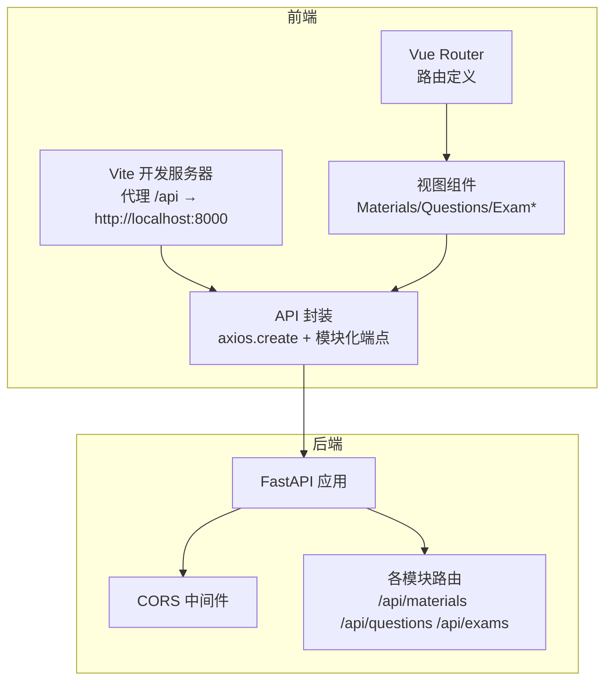
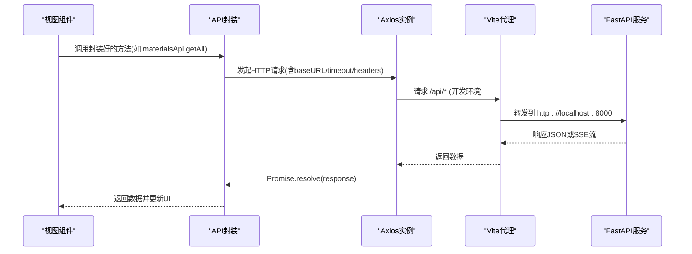
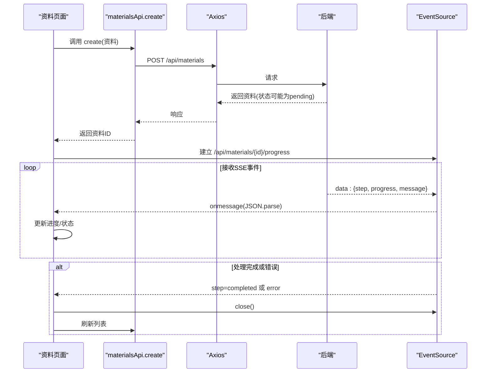
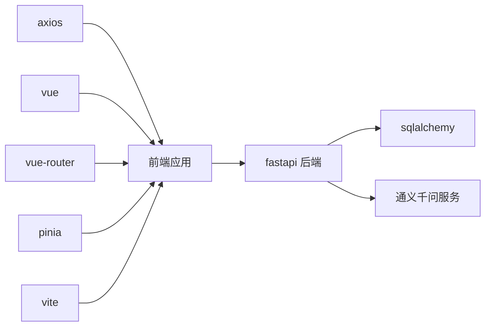

# API客户端

<cite>
**本文档引用的文件**
- [frontend/src/api/index.js](file://frontend/src/api/index.js)
- [frontend/src/main.js](file://frontend/src/main.js)
- [frontend/src/router/index.js](file://frontend/src/router/index.js)
- [frontend/vite.config.js](file://frontend/vite.config.js)
- [backend/app/main.py](file://backend/app/main.py)
- [backend/app/core/config.py](file://backend/app/core/config.py)
- [backend/app/api/materials.py](file://backend/app/api/materials.py)
- [backend/app/api/questions.py](file://backend/app/api/questions.py)
- [backend/app/api/exams.py](file://backend/app/api/exams.py)
- [frontend/src/views/MaterialsView.vue](file://frontend/src/views/MaterialsView.vue)
- [frontend/src/views/QuestionsView.vue](file://frontend/src/views/QuestionsView.vue)
- [frontend/src/views/ExamStartView.vue](file://frontend/src/views/ExamStartView.vue)
- [frontend/src/views/ExamTakingView.vue](file://frontend/src/views/ExamTakingView.vue)
</cite>

## 目录
1. [简介](#简介)
2. [项目结构](#项目结构)
3. [核心组件](#核心组件)
4. [架构总览](#架构总览)
5. [详细组件分析](#详细组件分析)
6. [依赖关系分析](#依赖关系分析)
7. [性能考量](#性能考量)
8. [故障排查指南](#故障排查指南)
9. [结论](#结论)
10. [附录](#附录)

## 简介
本文件面向“API客户端”的设计与实现，系统性阐述前后端数据交互方案，覆盖以下主题：
- Axios配置与拦截器（请求拦截、响应处理、错误统一处理）
- API端点定义与封装（HTTP方法、URL模式、参数传递）
- 异步数据获取策略（loading状态、错误处理、重试机制）
- 文件上传实现（进度监控、SSE流式处理）
- 数据缓存、请求去重与性能优化
- 认证令牌管理、CORS处理与安全考虑
- 实际代码示例路径与最佳实践

## 项目结构
前端采用Vite + Vue 3 + Pinia + Vue Router，Axios作为HTTP客户端；后端采用FastAPI，提供REST接口与SSE流。

图表来源
- [frontend/vite.config.js](file://frontend/vite.config.js#L12-L20)
- [frontend/src/router/index.js](file://frontend/src/router/index.js#L3-L39)
- [frontend/src/api/index.js](file://frontend/src/api/index.js#L1-L9)
- [backend/app/main.py](file://backend/app/main.py#L27-L42)

章节来源
- [frontend/src/main.js](file://frontend/src/main.js#L1-L12)
- [frontend/src/router/index.js](file://frontend/src/router/index.js#L1-L47)
- [frontend/vite.config.js](file://frontend/vite.config.js#L1-L22)
- [backend/app/main.py](file://backend/app/main.py#L1-L66)

## 核心组件
- Axios实例与端点封装：在前端集中创建Axios实例，并按业务模块导出API对象，统一处理基础URL、超时与头部。
- 视图组件：通过调用API封装函数发起请求，管理loading、错误提示与SSE进度流。
- 后端路由：FastAPI注册各模块路由，提供REST接口与SSE流，启用CORS中间件。

章节来源
- [frontend/src/api/index.js](file://frontend/src/api/index.js#L1-L52)
- [frontend/src/views/MaterialsView.vue](file://frontend/src/views/MaterialsView.vue#L160-L401)
- [backend/app/main.py](file://backend/app/main.py#L27-L42)

## 架构总览
从前端到后端的数据流如下：

图表来源
- [frontend/src/api/index.js](file://frontend/src/api/index.js#L3-L9)
- [frontend/vite.config.js](file://frontend/vite.config.js#L14-L19)
- [backend/app/main.py](file://backend/app/main.py#L37-L42)

## 详细组件分析

### Axios配置与拦截器
- 基础配置
  - baseURL: 使用相对路径“/api”，由Vite代理转发至后端
  - timeout: 3分钟，适配AI处理较长耗时
  - Content-Type: application/json
- 拦截器
  - 当前实现未显式添加请求/响应拦截器与统一错误处理逻辑
  - 建议新增请求拦截器用于注入认证令牌、请求去重；响应拦截器用于统一错误处理与重试

章节来源
- [frontend/src/api/index.js](file://frontend/src/api/index.js#L3-L9)

### API端点定义与封装
- 学习方向
  - GET /api/directions
  - POST /api/directions
  - DELETE /api/directions/{id}
- 资料
  - GET /api/materials?direction_id=...
  - POST /api/materials
  - GET /api/materials/{id}
  - DELETE /api/materials/{id}
  - GET /api/materials/{id}/progress (SSE)
- 题目
  - GET /api/questions?material_id=&direction_id=&question_type=
  - GET /api/questions/{id}
  - PATCH /api/questions/{id}
  - DELETE /api/questions/{id}
  - PATCH /api/questions/{id}/rate
- 测验
  - GET /api/exams?direction_id=&status=
  - POST /api/exams
  - GET /api/exams/{id}
  - POST /api/exams/{id}/submit
  - GET /api/exams/{id}/result

章节来源
- [frontend/src/api/index.js](file://frontend/src/api/index.js#L11-L49)
- [backend/app/api/materials.py](file://backend/app/api/materials.py#L15-L161)
- [backend/app/api/questions.py](file://backend/app/api/questions.py#L11-L89)
- [backend/app/api/exams.py](file://backend/app/api/exams.py#L29-L239)

### 异步数据获取策略
- 加载状态
  - 在组件内使用loading标志控制UI显示
- 错误处理
  - 组件内捕获异常，区分HTTP状态码并提示用户
- 重试机制
  - 当前未实现自动重试；建议基于幂等请求与错误码实现指数退避重试

章节来源
- [frontend/src/views/MaterialsView.vue](file://frontend/src/views/MaterialsView.vue#L282-L299)
- [frontend/src/views/QuestionsView.vue](file://frontend/src/views/QuestionsView.vue#L222-L237)
- [frontend/src/views/ExamStartView.vue](file://frontend/src/views/ExamStartView.vue#L140-L151)

### 文件上传与SSE进度监控
- 文件上传
  - 支持文本输入与Markdown文件上传两种方式
  - 上传后立即触发后端处理流程（同步执行），并在状态为“pending”时建立SSE连接
- SSE流式处理
  - 后端通过StreamingResponse返回SSE事件流，包含步骤、进度与消息
  - 前端使用EventSource接收消息，更新进度条与状态，完成后关闭连接并刷新列表

图表来源
- [frontend/src/views/MaterialsView.vue](file://frontend/src/views/MaterialsView.vue#L301-L376)
- [backend/app/api/materials.py](file://backend/app/api/materials.py#L164-L185)

章节来源
- [frontend/src/views/MaterialsView.vue](file://frontend/src/views/MaterialsView.vue#L341-L376)
- [backend/app/api/materials.py](file://backend/app/api/materials.py#L27-L80)
- [backend/app/api/materials.py](file://backend/app/api/materials.py#L164-L185)

### 认证令牌管理、CORS处理与安全
- 认证令牌
  - 当前未实现令牌注入与刷新；建议在请求拦截器中从存储读取并附加到Authorization头
- CORS
  - 后端已启用CORS中间件，开发环境允许任意来源
- 安全
  - 建议：对敏感接口增加鉴权校验、参数校验与速率限制；生产环境收紧CORS白名单

章节来源
- [backend/app/main.py](file://backend/app/main.py#L27-L34)
- [frontend/src/api/index.js](file://frontend/src/api/index.js#L3-L9)

### 数据缓存、请求去重与性能优化
- 缓存
  - 可在Pinia中为常用列表维护本地缓存，减少重复请求
- 去重
  - 对相同请求参数的并发请求进行去重，避免重复发送
- 性能
  - 合理设置超时与分页；对长列表使用虚拟滚动；对SSE连接做生命周期管理

章节来源
- [frontend/src/views/QuestionsView.vue](file://frontend/src/views/QuestionsView.vue#L222-L237)
- [frontend/src/views/MaterialsView.vue](file://frontend/src/views/MaterialsView.vue#L341-L376)

## 依赖关系分析
- 前端依赖
  - axios：HTTP客户端
  - vue、vue-router、pinia：框架与状态管理
  - vite：开发服务器与代理
- 后端依赖
  - fastapi：Web框架
  - sqlalchemy：ORM
  - dashscope/qwen：外部模型服务

图表来源
- [frontend/package.json](file://frontend/package.json#L11-L16)
- [backend/app/main.py](file://backend/app/main.py#L1-L66)

章节来源
- [frontend/package.json](file://frontend/package.json#L1-L23)
- [backend/app/core/config.py](file://backend/app/core/config.py#L6-L24)

## 性能考量
- 超时与并发
  - Axios设置较长超时以适配AI处理；建议对长任务拆分并提供进度反馈
- 请求去重
  - 对高频查询（如题目列表）实施去重，降低网络与数据库压力
- SSE连接
  - 组件卸载时关闭EventSource，避免内存泄漏
- 分页与懒加载
  - 列表数据分页或虚拟滚动，减少首屏渲染压力

章节来源
- [frontend/src/api/index.js](file://frontend/src/api/index.js#L5-L5)
- [frontend/src/views/MaterialsView.vue](file://frontend/src/views/MaterialsView.vue#L395-L400)

## 故障排查指南
- 常见问题
  - CORS错误：确认后端CORS配置与代理目标地址一致
  - 404/400：核对URL路径与查询参数
  - 500（API密钥未配置）：检查后端环境变量
- 建议
  - 在请求拦截器中统一记录请求日志与错误
  - 对SSE连接增加重连与错误恢复逻辑

章节来源
- [frontend/src/views/MaterialsView.vue](file://frontend/src/views/MaterialsView.vue#L287-L296)
- [backend/app/api/materials.py](file://backend/app/api/materials.py#L94-L96)

## 结论
本项目在前后端分离架构下，通过Axios封装与FastAPI路由实现了清晰的数据交互层。当前实现具备SSE进度流与基础错误提示，建议进一步完善拦截器、认证令牌、CORS安全策略与性能优化措施，以提升稳定性与用户体验。

## 附录
- 代码示例路径
  - Axios实例与端点封装：[frontend/src/api/index.js](file://frontend/src/api/index.js#L1-L52)
  - 资料上传与SSE：[frontend/src/views/MaterialsView.vue](file://frontend/src/views/MaterialsView.vue#L301-L376), [backend/app/api/materials.py](file://backend/app/api/materials.py#L164-L185)
  - 题目列表与筛选：[frontend/src/views/QuestionsView.vue](file://frontend/src/views/QuestionsView.vue#L222-L237)
  - 测验创建与提交：[frontend/src/views/ExamStartView.vue](file://frontend/src/views/ExamStartView.vue#L140-L151), [frontend/src/views/ExamTakingView.vue](file://frontend/src/views/ExamTakingView.vue#L208-L235)
  - 代理与路由：[frontend/vite.config.js](file://frontend/vite.config.js#L12-L20), [frontend/src/router/index.js](file://frontend/src/router/index.js#L1-L47)
  - CORS与路由注册：[backend/app/main.py](file://backend/app/main.py#L27-L42)
  - 配置项（含API密钥）：[backend/app/core/config.py](file://backend/app/core/config.py#L6-L24)