# Vue应用结构

<cite>
**本文档引用的文件**
- [main.js](file://frontend/src/main.js)
- [App.vue](file://frontend/src/App.vue)
- [router/index.js](file://frontend/src/router/index.js)
- [style.css](file://frontend/src/style.css)
- [package.json](file://frontend/package.json)
- [vite.config.js](file://frontend/vite.config.js)
- [index.html](file://frontend/index.html)
- [api/index.js](file://frontend/src/api/index.js)
- [views/HomeView.vue](file://frontend/src/views/HomeView.vue)
- [views/MaterialsView.vue](file://frontend/src/views/MaterialsView.vue)
- [views/QuestionsView.vue](file://frontend/src/views/QuestionsView.vue)
</cite>

## 目录
1. [简介](#简介)
2. [项目结构](#项目结构)
3. [核心组件](#核心组件)
4. [架构总览](#架构总览)
5. [详细组件分析](#详细组件分析)
6. [依赖关系分析](#依赖关系分析)
7. [性能考虑](#性能考虑)
8. [故障排除指南](#故障排除指南)
9. [结论](#结论)

## 简介
本项目是一个基于Vue 3的个人学习管理系统前端应用，采用Composition API与setup语法糖，结合Vite构建工具，实现现代化的单页应用架构。应用围绕学习方向、资料管理、题目生成、测验测评和错题本等核心功能模块，通过响应式设计和丰富的动画效果提供良好的用户体验。

## 项目结构
前端项目采用标准的Vue 3单页应用结构，主要目录包括：
- `src/`：源代码目录，包含应用的核心逻辑
- `src/views/`：页面级组件，每个路由对应一个视图组件
- `src/router/`：路由配置，定义应用的页面导航结构
- `src/api/`：API接口封装，统一管理后端服务调用
- `src/style.css`：全局样式定义，使用CSS变量实现主题化
- `public/`：静态资源目录

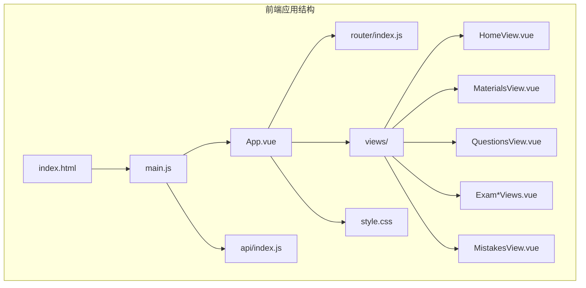

**图表来源**
- [index.html](file://frontend/index.html#L1-L14)
- [main.js](file://frontend/src/main.js#L1-L12)
- [App.vue](file://frontend/src/App.vue#L1-L202)

**章节来源**
- [index.html](file://frontend/index.html#L1-L14)
- [package.json](file://frontend/package.json#L1-L23)

## 核心组件
应用的核心组件包括应用入口、根组件和路由系统，它们共同构成了应用的基础架构。

### 应用入口点 main.js
应用入口点负责创建Vue实例、注册插件和初始化全局配置。该文件体现了现代Vue 3应用的标准配置模式。

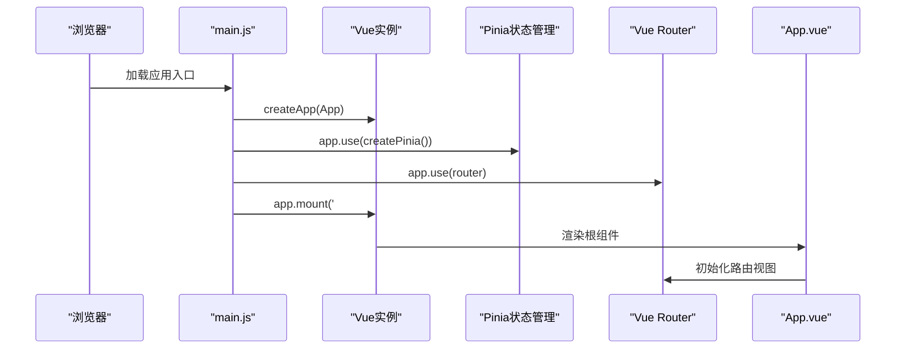

**图表来源**
- [main.js](file://frontend/src/main.js#L1-L12)

### 根组件 App.vue
App.vue作为应用的根组件，采用setup语法糖定义组件逻辑，实现了完整的导航结构和路由视图容器。组件设计遵循响应式布局原则，使用CSS变量实现主题化样式。

**章节来源**
- [main.js](file://frontend/src/main.js#L1-L12)
- [App.vue](file://frontend/src/App.vue#L1-L202)

## 架构总览
应用采用典型的Vue 3单页应用架构，结合现代前端开发最佳实践：

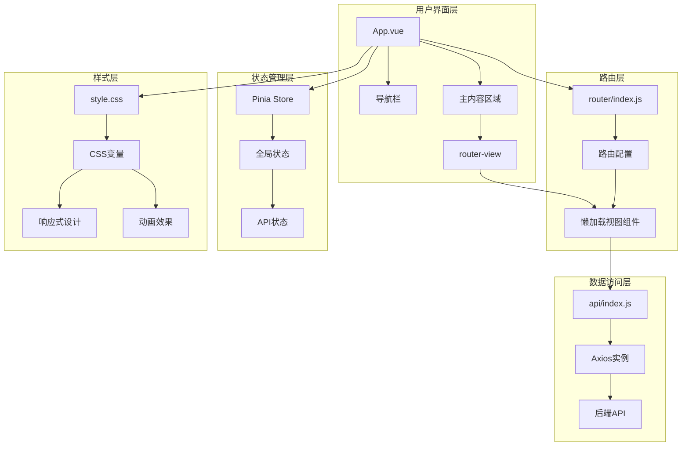

**图表来源**
- [App.vue](file://frontend/src/App.vue#L1-L202)
- [router/index.js](file://frontend/src/router/index.js#L1-L47)
- [style.css](file://frontend/src/style.css#L1-L404)

## 详细组件分析

### 路由系统分析
应用的路由系统采用Vue Router 4，实现了完整的页面导航结构，支持懒加载和参数传递。

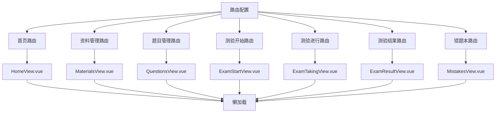

**图表来源**
- [router/index.js](file://frontend/src/router/index.js#L1-L47)

### 视图组件层次结构
应用采用模块化的视图组件设计，每个功能模块都有独立的组件文件：

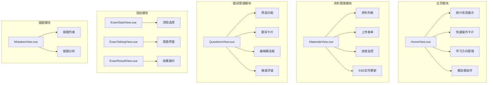

**图表来源**
- [HomeView.vue](file://frontend/src/views/HomeView.vue#L1-L720)
- [MaterialsView.vue](file://frontend/src/views/MaterialsView.vue#L1-L881)
- [QuestionsView.vue](file://frontend/src/views/QuestionsView.vue#L1-L554)

### Composition API使用模式
应用广泛采用Composition API和setup语法糖，实现了清晰的逻辑分离和状态管理。

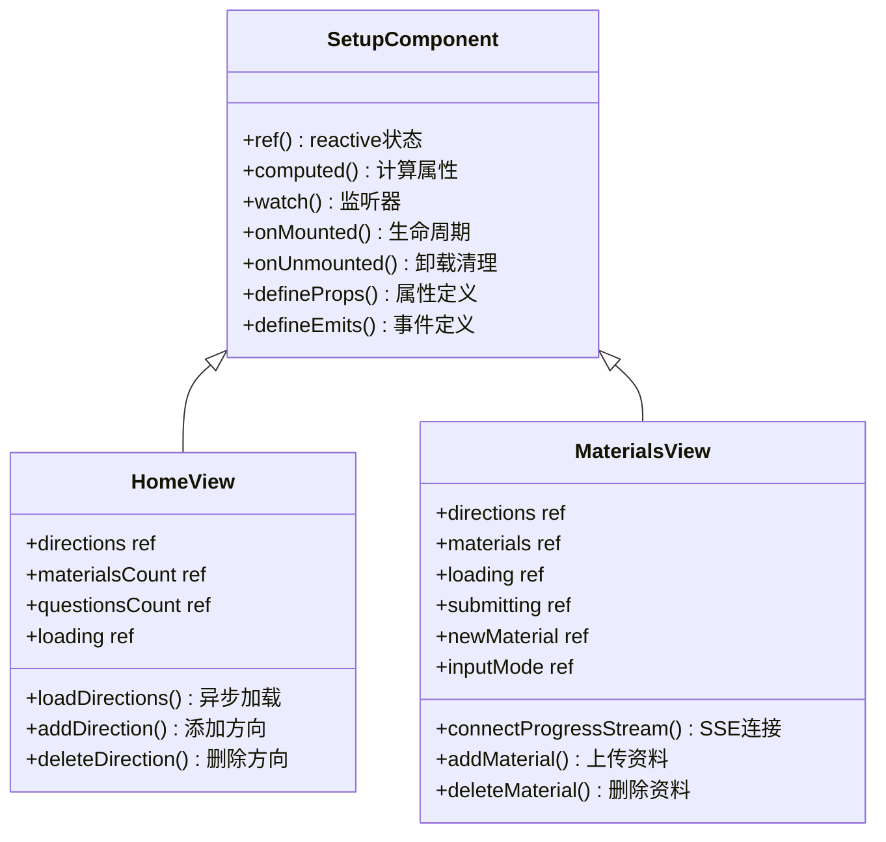

**图表来源**
- [HomeView.vue](file://frontend/src/views/HomeView.vue#L143-L212)
- [MaterialsView.vue](file://frontend/src/views/MaterialsView.vue#L160-L401)

**章节来源**
- [HomeView.vue](file://frontend/src/views/HomeView.vue#L143-L212)
- [MaterialsView.vue](file://frontend/src/views/MaterialsView.vue#L160-L401)

### 响应式设计原则
应用采用CSS变量驱动的主题系统，实现了完整的响应式布局和动画效果。

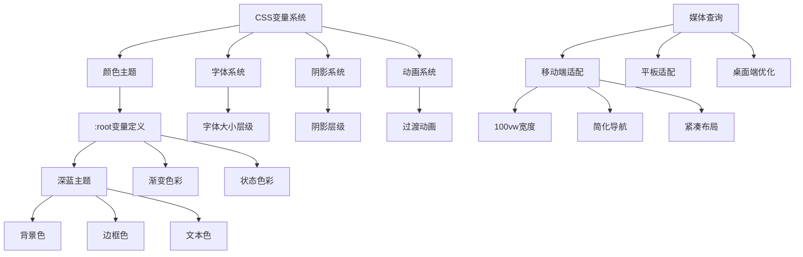

**图表来源**
- [style.css](file://frontend/src/style.css#L1-L404)
- [App.vue](file://frontend/src/App.vue#L158-L184)

**章节来源**
- [style.css](file://frontend/src/style.css#L1-L404)
- [App.vue](file://frontend/src/App.vue#L24-L201)

## 依赖关系分析

### 技术栈依赖
应用采用现代化的前端技术栈，各依赖项之间存在明确的层次关系：

```mermaid
graph TB
subgraph "运行时依赖"
A[vue@^3.5.0] --> B[核心框架]
C[axios@^1.7.0] --> D[HTTP客户端]
E[marked@^17.0.1] --> F[Markdown渲染]
G[pinia@^2.2.0] --> H[状态管理]
I[vue-router@^4.4.0] --> J[路由管理]
end
subgraph "开发时依赖"
K[@vitejs/plugin-vue@^5.1.0] --> L[Vite Vue插件]
M[vite@^5.4.0] --> N[构建工具]
end
subgraph "构建配置"
O[vite.config.js] --> P[别名配置]
O --> Q[代理配置]
O --> R[插件配置]
end
subgraph "应用入口"
S[main.js] --> T[应用初始化]
S --> U[插件注册]
S --> V[全局样式导入]
end
A --> S
G --> S
I --> S
O --> S
```

**图表来源**
- [package.json](file://frontend/package.json#L11-L21)
- [vite.config.js](file://frontend/vite.config.js#L1-L22)

### API层设计
应用的API层采用模块化设计，提供了清晰的数据访问接口：

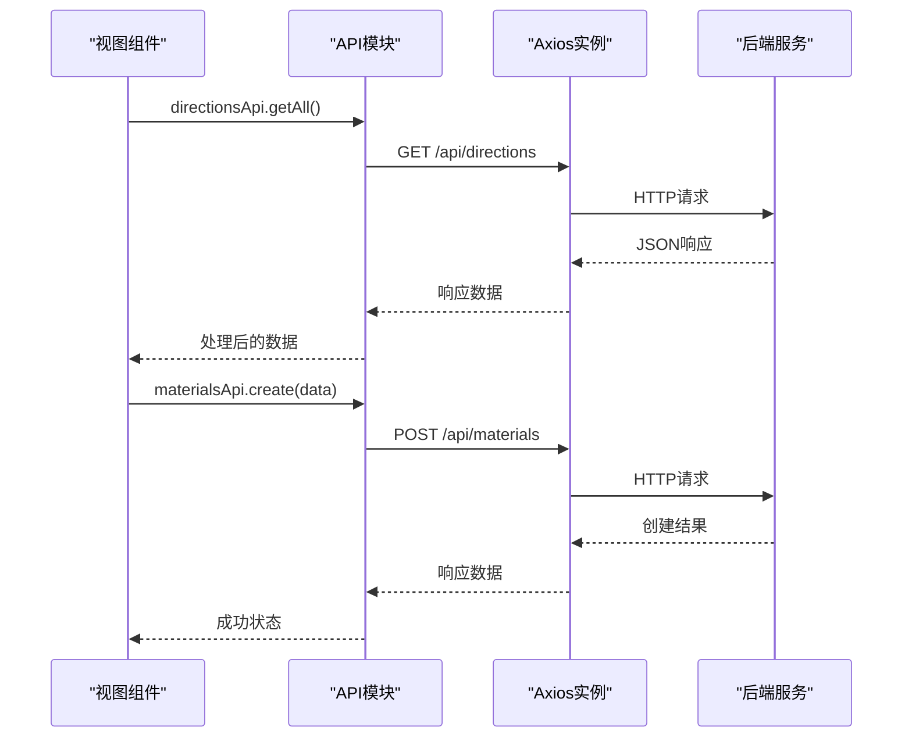

**图表来源**
- [api/index.js](file://frontend/src/api/index.js#L1-L52)

**章节来源**
- [package.json](file://frontend/package.json#L11-L21)
- [api/index.js](file://frontend/src/api/index.js#L1-L52)

## 性能考虑
应用在多个层面实现了性能优化策略：

### 代码分割与懒加载
应用采用动态导入实现路由级别的代码分割，确保首屏加载性能：

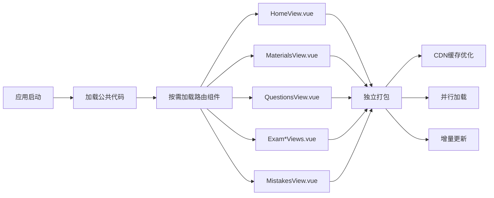

### 状态管理优化
Pinia状态管理提供了高效的响应式状态更新机制：

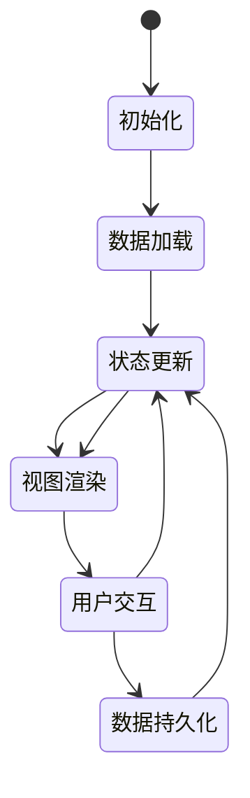

### 构建优化策略
Vite构建工具提供了多种优化选项：

| 优化类型 | 实现方式 | 性能收益 |
|---------|---------|---------|
| Tree Shaking | 按需导入模块 | 减少包体积 |
| 代码分割 | 动态导入组件 | 提升加载速度 |
| 缓存策略 | CDN缓存配置 | 加速重复访问 |
| 压缩优化 | 生产环境压缩 | 减小传输体积 |

## 故障排除指南

### 常见问题诊断
应用可能遇到的问题及解决方案：

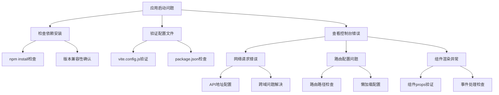

### 开发环境调试
建议的调试流程：

1. **网络请求调试**：检查API请求是否正常，验证响应格式
2. **状态管理调试**：使用Vue DevTools检查Pinia状态变化
3. **路由调试**：验证路由守卫和参数传递
4. **组件调试**：检查组件生命周期钩子执行情况

**章节来源**
- [vite.config.js](file://frontend/vite.config.js#L12-L21)
- [api/index.js](file://frontend/src/api/index.js#L3-L9)

## 结论
本Vue 3应用展现了现代前端开发的最佳实践，通过合理的架构设计、清晰的组件划分和完善的性能优化策略，构建了一个功能完整、用户体验优秀的学习管理系统。应用采用的技术栈成熟稳定，代码结构清晰易维护，为类似项目的开发提供了良好的参考模板。

应用的主要优势包括：
- **现代化架构**：采用Vue 3 Composition API和setup语法糖
- **响应式设计**：完整的移动端适配和动画效果
- **性能优化**：代码分割、懒加载和构建优化
- **可维护性**：模块化设计和清晰的依赖关系
- **开发体验**：Vite构建工具和热重载支持

通过持续的迭代优化，该应用能够满足个人学习管理的多样化需求，并为未来的功能扩展奠定了坚实的基础。