# 前端应用架构

<cite>
**本文档引用的文件**
- [main.js](file://frontend/src/main.js)
- [App.vue](file://frontend/src/App.vue)
- [router/index.js](file://frontend/src/router/index.js)
- [api/index.js](file://frontend/src/api/index.js)
- [views/HomeView.vue](file://frontend/src/views/HomeView.vue)
- [views/MaterialsView.vue](file://frontend/src/views/MaterialsView.vue)
- [views/QuestionsView.vue](file://frontend/src/views/QuestionsView.vue)
- [views/ExamStartView.vue](file://frontend/src/views/ExamStartView.vue)
- [views/ExamTakingView.vue](file://frontend/src/views/ExamTakingView.vue)
- [views/ExamResultView.vue](file://frontend/src/views/ExamResultView.vue)
- [views/MistakesView.vue](file://frontend/src/views/MistakesView.vue)
- [style.css](file://frontend/src/style.css)
- [vite.config.js](file://frontend/vite.config.js)
- [package.json](file://frontend/package.json)
- [index.html](file://frontend/index.html)
</cite>

## 目录
1. [引言](#引言)
2. [项目结构](#项目结构)
3. [核心组件](#核心组件)
4. [架构总览](#架构总览)
5. [详细组件分析](#详细组件分析)
6. [依赖关系分析](#依赖关系分析)
7. [性能考虑](#性能考虑)
8. [故障排除指南](#故障排除指南)
9. [结论](#结论)
10. [附录](#附录)

## 引言
本项目是一个基于 Vue 3 的个人学习管理系统前端应用，采用 Composition API、路由懒加载、状态管理与响应式设计，结合后端提供的学习方向、资料、题目、测验与错题等业务模块，构建从“资料上传—题目生成—测验练习—结果反馈—错题沉淀”的完整学习闭环。本文档将系统性阐述应用的架构设计、组件结构、路由与状态管理策略、API 客户端实现、数据获取策略、组件间通信机制、响应式与用户体验优化，以及性能优化与代码分割实践。

## 项目结构
前端项目采用典型的 Vue 3 单页应用结构，核心入口在 main.js 中初始化应用、挂载 Pinia 状态管理与 Vue Router；全局样式通过 style.css 提供深色主题与通用组件样式；视图组件位于 views 目录下，按功能划分页面；API 客户端封装于 api 目录，统一管理后端接口；Vite 作为构建工具与开发服务器，配置了路径别名与代理。

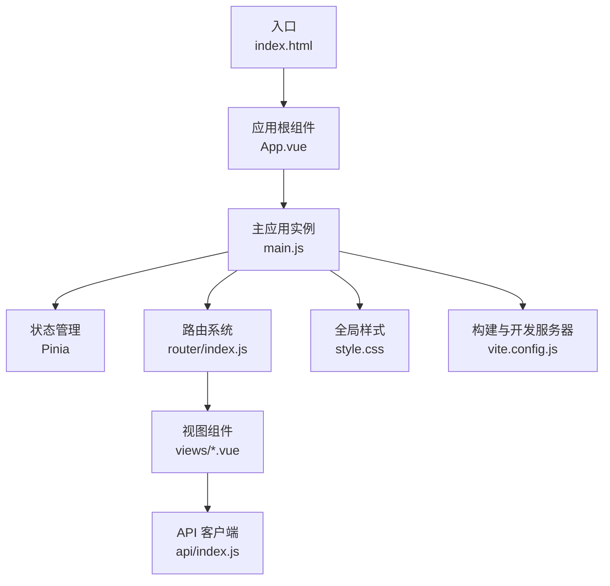

**图表来源**
- [index.html](file://frontend/index.html#L1-L14)
- [main.js](file://frontend/src/main.js#L1-L12)
- [App.vue](file://frontend/src/App.vue#L1-L202)
- [router/index.js](file://frontend/src/router/index.js#L1-L47)
- [style.css](file://frontend/src/style.css#L1-L404)
- [api/index.js](file://frontend/src/api/index.js#L1-L52)
- [vite.config.js](file://frontend/vite.config.js#L1-L22)

**章节来源**
- [main.js](file://frontend/src/main.js#L1-L12)
- [App.vue](file://frontend/src/App.vue#L1-L202)
- [router/index.js](file://frontend/src/router/index.js#L1-L47)
- [style.css](file://frontend/src/style.css#L1-L404)
- [api/index.js](file://frontend/src/api/index.js#L1-L52)
- [vite.config.js](file://frontend/vite.config.js#L1-L22)
- [index.html](file://frontend/index.html#L1-L14)

## 核心组件
- 应用根组件 App.vue：定义全局导航栏、主内容区与路由视图插槽，负责页面级布局与主题样式。
- 路由系统 router/index.js：定义页面路由与懒加载策略，支持首页、资料管理、题目管理、测验系统、错题本等页面。
- API 客户端 api/index.js：封装 axios 实例，按领域拆分模块化 API 方法，统一处理超时与请求头。
- 视图组件：HomeView（主页）、MaterialsView（资料管理）、QuestionsView（题目管理）、ExamStartView（测验开始）、ExamTakingView（测验答题）、ExamResultView（测验结果）、MistakesView（错题本）。
- 全局样式 style.css：定义深色主题变量、渐变与阴影、通用组件样式与动画类。

**章节来源**
- [App.vue](file://frontend/src/App.vue#L1-L202)
- [router/index.js](file://frontend/src/router/index.js#L1-L47)
- [api/index.js](file://frontend/src/api/index.js#L1-L52)
- [style.css](file://frontend/src/style.css#L1-L404)

## 架构总览
应用采用“视图层 + 路由 + API 客户端 + 全局样式”的分层架构。视图组件通过 Composition API 管理本地状态与生命周期，通过 API 客户端与后端交互；路由负责页面切换与参数传递；全局样式提供一致的主题与交互体验；构建工具 Vite 提供开发与生产环境支持。

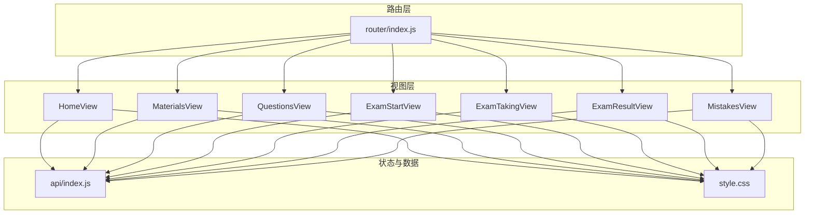

**图表来源**
- [router/index.js](file://frontend/src/router/index.js#L1-L47)
- [api/index.js](file://frontend/src/api/index.js#L1-L52)
- [style.css](file://frontend/src/style.css#L1-L404)
- [views/HomeView.vue](file://frontend/src/views/HomeView.vue#L1-L720)
- [views/MaterialsView.vue](file://frontend/src/views/MaterialsView.vue#L1-L881)
- [views/QuestionsView.vue](file://frontend/src/views/QuestionsView.vue#L1-L554)
- [views/ExamStartView.vue](file://frontend/src/views/ExamStartView.vue#L1-L395)
- [views/ExamTakingView.vue](file://frontend/src/views/ExamTakingView.vue#L1-L516)
- [views/ExamResultView.vue](file://frontend/src/views/ExamResultView.vue#L1-L442)
- [views/MistakesView.vue](file://frontend/src/views/MistakesView.vue#L1-L409)

## 详细组件分析

### 应用根组件与全局布局
- 导航栏：包含品牌标识与页面导航链接，使用 router-link 实现无刷新跳转。
- 主内容区：router-view 插槽承载当前路由对应的视图组件。
- 全局样式：深色主题变量、渐变背景、阴影与动画类，提供统一视觉风格与过渡效果。

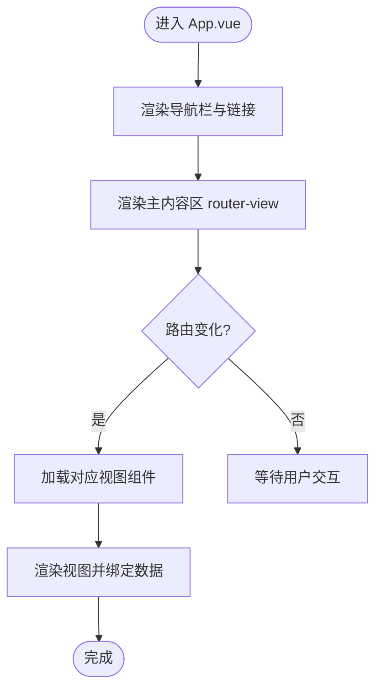

**图表来源**
- [App.vue](file://frontend/src/App.vue#L1-L202)

**章节来源**
- [App.vue](file://frontend/src/App.vue#L1-L202)

### 路由设计与懒加载
- 路由表定义了首页、资料管理、题目管理、测验开始、测验答题、测验结果、错题本等页面。
- 所有视图组件均采用动态导入实现懒加载，减少首屏体积与加载时间。
- 支持嵌套路由参数（如测验 ID 与结果路径），保证页面间数据传递与状态一致性。

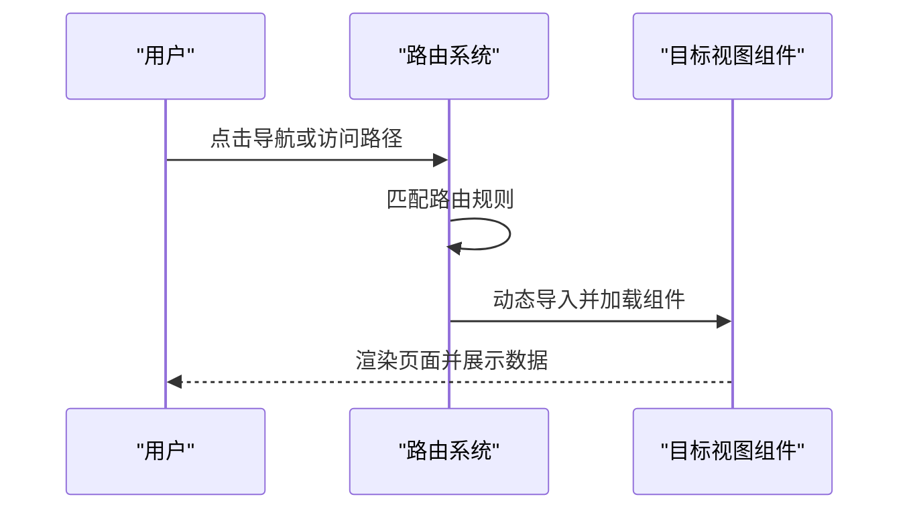

**图表来源**
- [router/index.js](file://frontend/src/router/index.js#L1-L47)

**章节来源**
- [router/index.js](file://frontend/src/router/index.js#L1-L47)

### API 客户端与数据获取策略
- axios 实例：统一设置 baseURL、超时时间与请求头，适配后端服务。
- 模块化 API：按领域拆分 directions、materials、questions、exams、mistakes，每个模块暴露 CRUD 与特定业务方法。
- 并发加载：在主页同时拉取学习方向与统计信息，提升首屏体验。
- SSE 进度监听：资料上传后根据状态开启 SSE 流，实时更新处理进度。
- 参数化查询：题目管理与错题本支持多维过滤（方向、资料、类型、状态）。

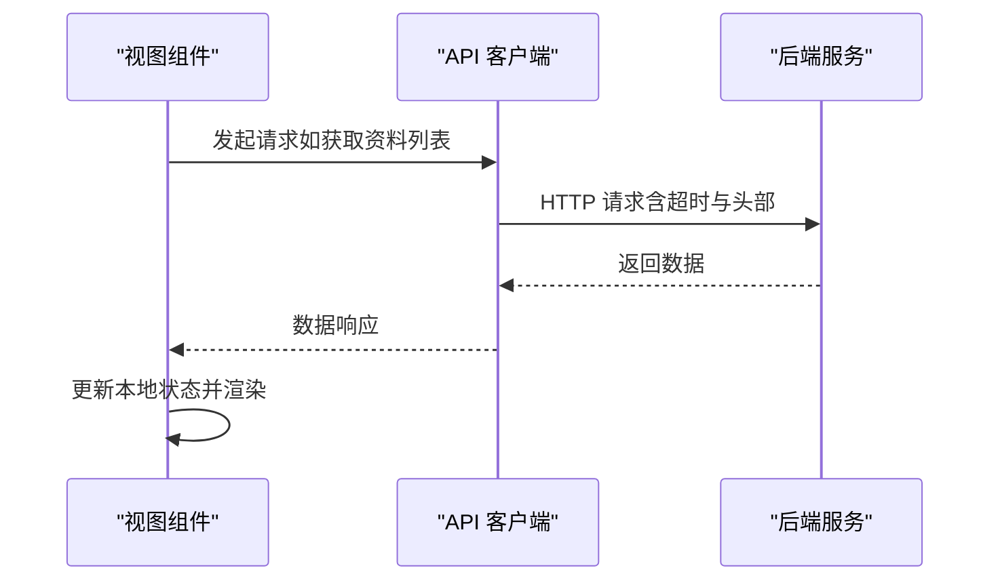

**图表来源**
- [api/index.js](file://frontend/src/api/index.js#L1-L52)

**章节来源**
- [api/index.js](file://frontend/src/api/index.js#L1-L52)

### 主页（HomeView）
- 功能概览：展示学习方向、资料与题目统计，提供快速入口卡片。
- 交互逻辑：支持添加学习方向、删除方向；加载与统计信息并发执行；方向卡片内联跳转至资料列表。
- 响应式设计：在小屏设备上调整网格与间距，保持良好可读性。

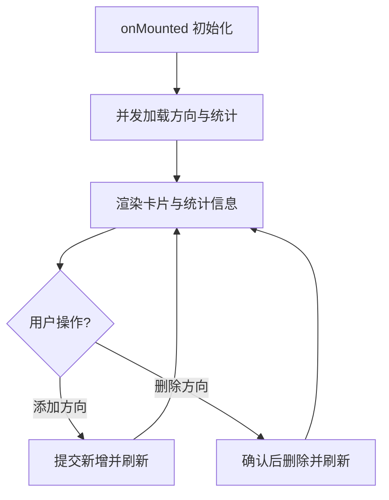

**图表来源**
- [views/HomeView.vue](file://frontend/src/views/HomeView.vue#L143-L212)

**章节来源**
- [views/HomeView.vue](file://frontend/src/views/HomeView.vue#L1-L720)

### 资料管理（MaterialsView）
- 功能特性：支持按方向筛选、上传资料（文本输入与 MD 文件拖拽上传）、实时进度展示、核心知识点标签、删除资料。
- 数据流程：加载方向与资料列表；上传后根据状态决定是否开启 SSE；滚动定位到新上传资料；错误分类提示（API 密钥缺失、资源不存在等）。
- 文件处理：支持 .md 文件读取与预览，格式化文件大小与时间显示。

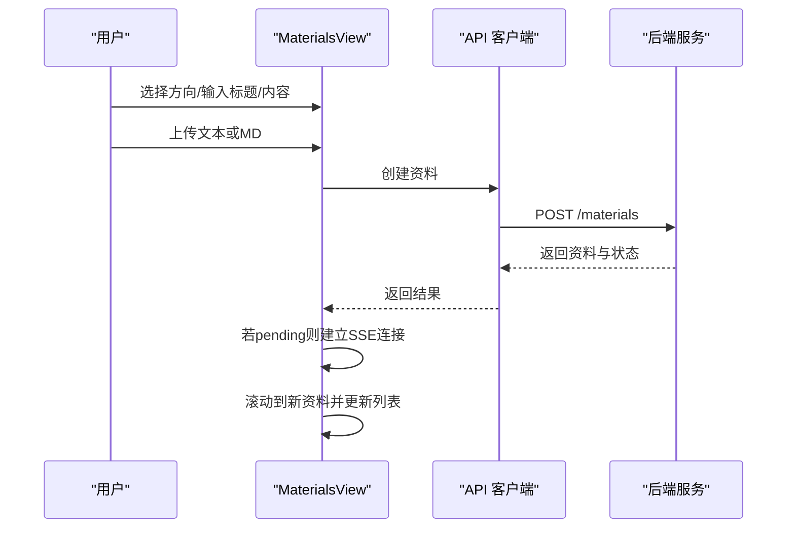

**图表来源**
- [views/MaterialsView.vue](file://frontend/src/views/MaterialsView.vue#L301-L339)
- [api/index.js](file://frontend/src/api/index.js#L18-L24)

**章节来源**
- [views/MaterialsView.vue](file://frontend/src/views/MaterialsView.vue#L1-L881)
- [api/index.js](file://frontend/src/api/index.js#L18-L24)

### 题目管理（QuestionsView）
- 功能特性：按方向、类型、资料筛选题目；查看题目内容、选项、答案与解析；编辑题目（内容、选项、答案、解析、难度）；对题目进行“好题/待优化”评价；删除题目。
- 交互细节：编辑弹窗深拷贝避免污染原始数据；难度评分范围限制；多选答案以逗号分隔存储。
- 响应式布局：在窄屏设备上调整卡片与按钮排列，保证可用性。

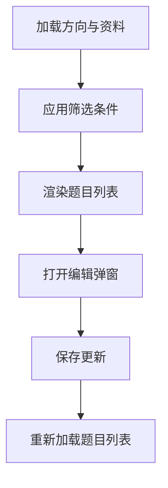

**图表来源**
- [views/QuestionsView.vue](file://frontend/src/views/QuestionsView.vue#L222-L287)

**章节来源**
- [views/QuestionsView.vue](file://frontend/src/views/QuestionsView.vue#L1-L554)

### 测验系统
- 开始测验（ExamStartView）：选择方向、测验模式（不限时/限时）、评分方式（百分制/等级制）、题目数量；创建测验并跳转至答题页；展示历史测验与状态。
- 答题测验（ExamTakingView）：限时倒计时（如有）、题目导航、进度条、答案收集与提交；提交前提示未答题数量。
- 测验结果（ExamResultView）：展示得分/等级、正确/错误统计、逐题对比与 AI 评语、解析；提供再次测验、查看错题本、返回首页。

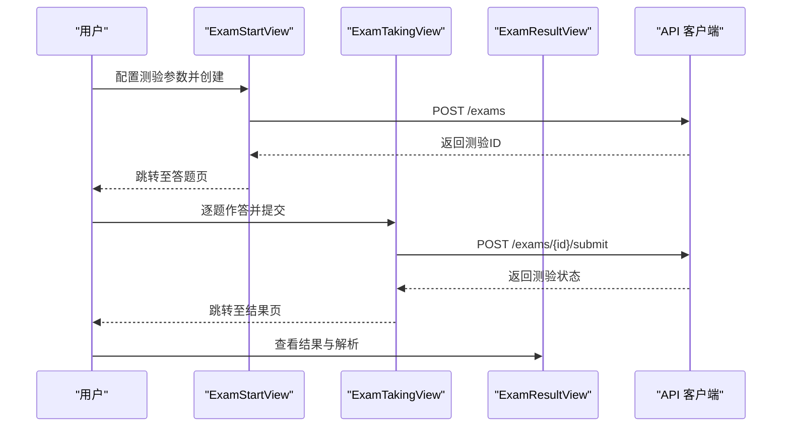

**图表来源**
- [views/ExamStartView.vue](file://frontend/src/views/ExamStartView.vue#L140-L151)
- [views/ExamTakingView.vue](file://frontend/src/views/ExamTakingView.vue#L208-L235)
- [views/ExamResultView.vue](file://frontend/src/views/ExamResultView.vue#L89-L110)
- [api/index.js](file://frontend/src/api/index.js#L35-L42)

**章节来源**
- [views/ExamStartView.vue](file://frontend/src/views/ExamStartView.vue#L1-L395)
- [views/ExamTakingView.vue](file://frontend/src/views/ExamTakingView.vue#L1-L516)
- [views/ExamResultView.vue](file://frontend/src/views/ExamResultView.vue#L1-L442)
- [api/index.js](file://frontend/src/api/index.js#L35-L42)

### 错题管理（MistakesView）
- 功能特性：按方向与掌握状态筛选错题；展开查看正确答案与解析；标记已掌握/未掌握；记录复习次数。
- 数据流程：加载方向与错题列表；根据筛选条件动态查询；更新错题状态并刷新列表。
- 用户体验：空状态提示与图标增强可读性；移动端布局优化。

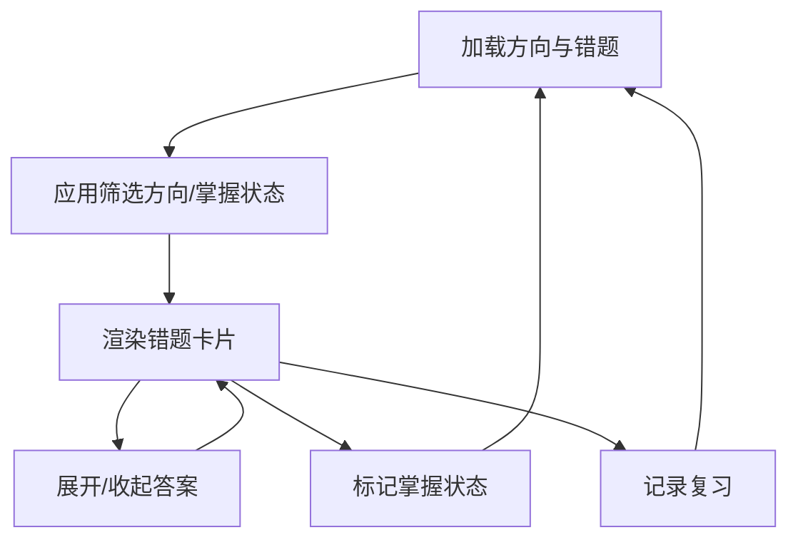

**图表来源**
- [views/MistakesView.vue](file://frontend/src/views/MistakesView.vue#L108-L149)

**章节来源**
- [views/MistakesView.vue](file://frontend/src/views/MistakesView.vue#L1-L409)

### 组件间通信机制
- 路由参数传递：测验 ID 通过路由参数在答题与结果页之间传递，保证数据一致性。
- 本地状态共享：各视图组件通过 Composition API 的 ref/computed/reactive 管理自身状态，避免跨组件耦合。
- 全局样式与主题：通过 CSS 变量集中管理颜色、阴影、圆角与动画，确保组件风格一致。

**章节来源**
- [router/index.js](file://frontend/src/router/index.js#L24-L38)
- [views/ExamTakingView.vue](file://frontend/src/views/ExamTakingView.vue#L107-L124)
- [style.css](file://frontend/src/style.css#L1-L63)

### 响应式设计与用户体验优化
- 布局适配：在小屏设备上调整网格列数、卡片间距与按钮宽度，保证可读性与可触达性。
- 动画与过渡：页面切换、卡片出现、按钮悬停等使用 CSS 动画与过渡，提升交互流畅度。
- 状态反馈：加载中、空状态、错误提示与成功提示统一风格，增强用户信心。
- 可访问性：使用语义化标签与清晰的视觉层次，配合键盘导航与焦点可见性。

**章节来源**
- [style.css](file://frontend/src/style.css#L294-L404)
- [App.vue](file://frontend/src/App.vue#L158-L184)
- [views/MaterialsView.vue](file://frontend/src/views/MaterialsView.vue#L529-L552)
- [views/ExamResultView.vue](file://frontend/src/views/ExamResultView.vue#L403-L440)

## 依赖关系分析
- 运行时依赖：Vue 3、Vue Router、Pinia、Axios、Marked。
- 构建依赖：Vite、@vitejs/plugin-vue。
- 项目通过 Vite 的路径别名 @ 指向 src 目录，简化导入路径；开发服务器代理 /api 到后端地址，解决跨域问题。

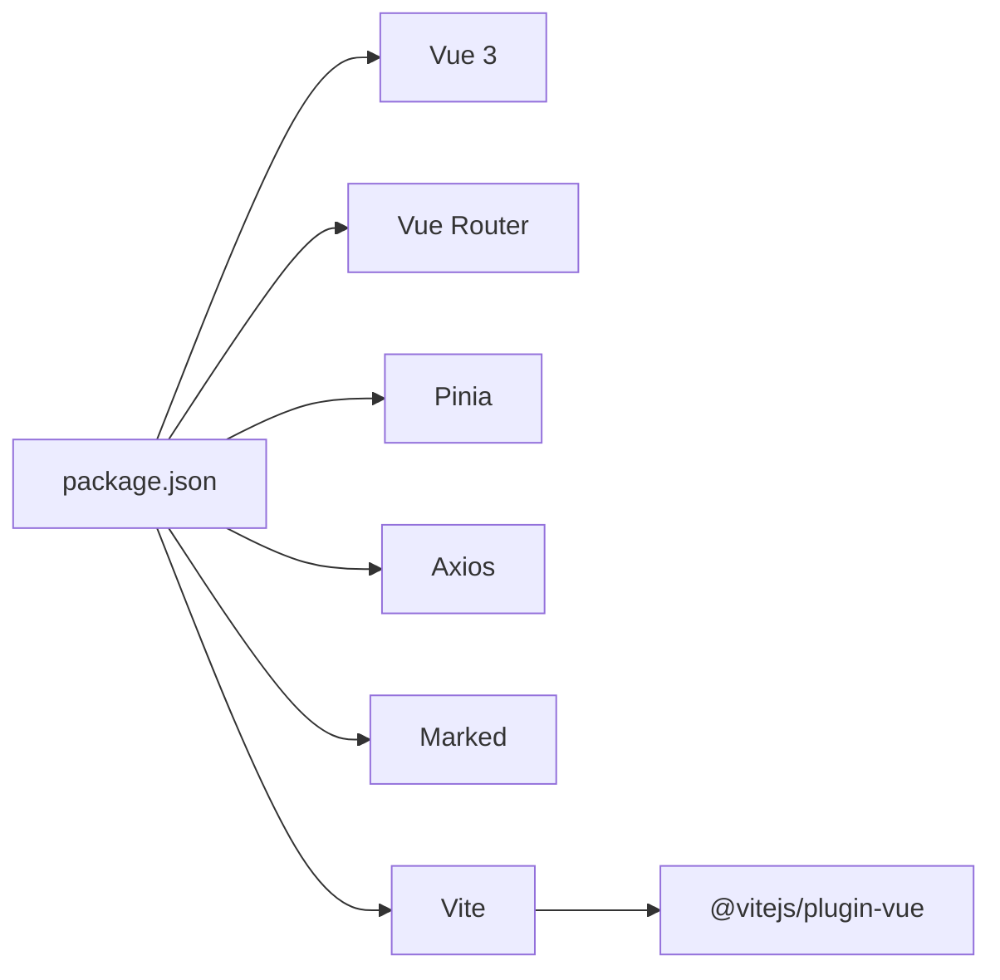

**图表来源**
- [package.json](file://frontend/package.json#L1-L23)
- [vite.config.js](file://frontend/vite.config.js#L1-L22)

**章节来源**
- [package.json](file://frontend/package.json#L1-L23)
- [vite.config.js](file://frontend/vite.config.js#L1-L22)

## 性能考虑
- 代码分割与懒加载：路由视图组件采用动态导入，减少首屏 JavaScript 体积，提升初始加载速度。
- 并发请求：主页同时加载学习方向与统计信息，缩短等待时间。
- SSE 优化：仅在资料处理中开启进度流，组件卸载时及时关闭连接，避免内存泄漏。
- 样式与动画：统一使用 CSS 变量与过渡，避免重复计算与闪烁；卡片悬停与按钮光晕使用硬件加速友好的属性。
- 构建优化：Vite 默认启用压缩与模块预打包，生产构建自动去除开发相关代码。

**章节来源**
- [router/index.js](file://frontend/src/router/index.js#L7-L37)
- [views/HomeView.vue](file://frontend/src/views/HomeView.vue#L166-L177)
- [views/MaterialsView.vue](file://frontend/src/views/MaterialsView.vue#L341-L376)
- [vite.config.js](file://frontend/vite.config.js#L1-L22)

## 故障排除指南
- API 密钥缺失：资料上传时若后端返回密钥相关错误，页面显示警告提示，引导联系管理员配置密钥。
- 资源不存在：上传或删除资料时若返回 404，提示找不到指定资源。
- 服务器内部错误：上传失败时捕获 500 错误并提示服务器异常，建议稍后重试或检查后端日志。
- SSE 连接错误：SSE 出错时自动关闭并刷新页面，确保最终状态一致。
- 路由与代理：开发时确保 /api 代理指向后端地址，避免跨域导致的请求失败。

**章节来源**
- [views/MaterialsView.vue](file://frontend/src/views/MaterialsView.vue#L287-L295)
- [views/MaterialsView.vue](file://frontend/src/views/MaterialsView.vue#L367-L372)
- [vite.config.js](file://frontend/vite.config.js#L12-L20)

## 结论
该前端应用以 Vue 3 为核心，结合 Composition API、路由懒加载与模块化 API 客户端，构建了清晰的分层架构与良好的用户体验。通过统一的主题变量与响应式设计，实现了跨设备的一致体验；通过并发请求与 SSE 实时进度，提升了交互效率。未来可在全局状态管理（Pinia）中进一步抽取共享逻辑、完善错误边界与缓存策略，并持续优化首屏性能与可访问性。

## 附录
- 主题定制：通过修改 style.css 中的 CSS 变量即可实现主题切换与品牌定制。
- 组件复用：将通用卡片、模态框、进度条等抽象为可复用组件，减少重复代码。
- 样式管理：遵循 BEM 或组件作用域样式命名规范，避免样式冲突。
- 性能监控：在生产环境中集成性能指标采集，关注首屏时间、交互延迟与内存占用。