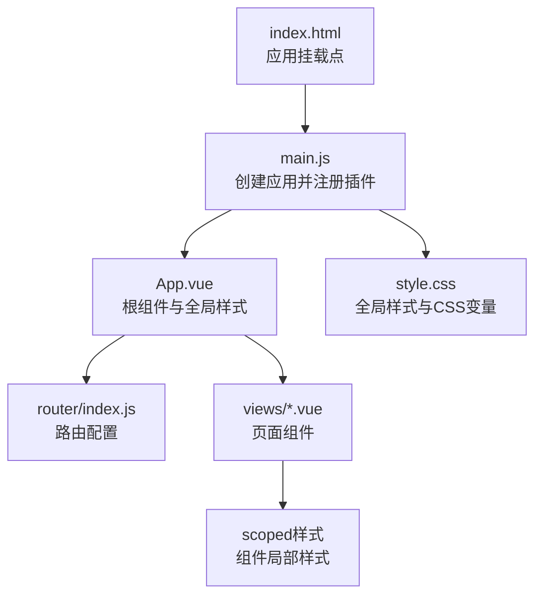
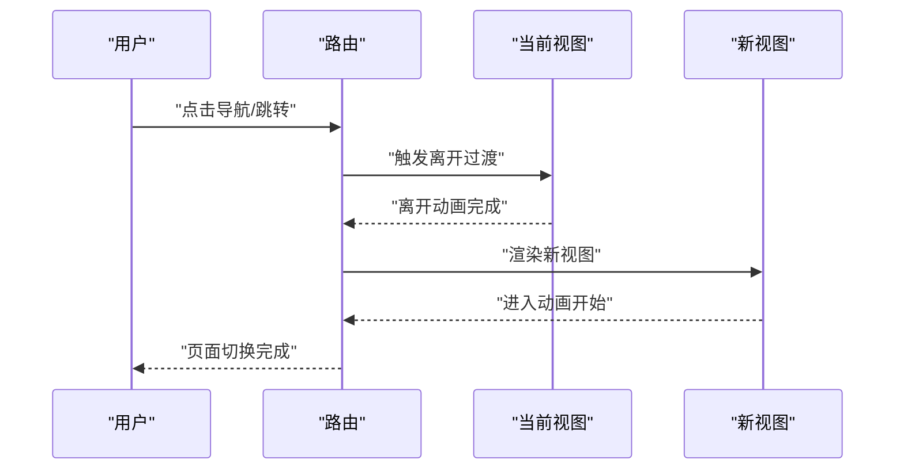
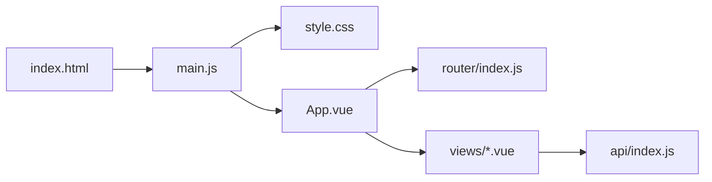

# 样式与主题

<cite>
**本文档引用的文件**
- [style.css](file://frontend/src/style.css)
- [main.js](file://frontend/src/main.js)
- [index.html](file://frontend/index.html)
- [package.json](file://frontend/package.json)
- [vite.config.js](file://frontend/vite.config.js)
- [App.vue](file://frontend/src/App.vue)
- [HomeView.vue](file://frontend/src/views/HomeView.vue)
- [ExamStartView.vue](file://frontend/src/views/ExamStartView.vue)
- [ExamTakingView.vue](file://frontend/src/views/ExamTakingView.vue)
- [ExamResultView.vue](file://frontend/src/views/ExamResultView.vue)
- [index.js](file://frontend/src/router/index.js)
- [index.js](file://frontend/src/api/index.js)
</cite>

## 目录
1. [简介](#简介)
2. [项目结构](#项目结构)
3. [核心组件](#核心组件)
4. [架构总览](#架构总览)
5. [详细组件分析](#详细组件分析)
6. [依赖关系分析](#依赖关系分析)
7. [性能考量](#性能考量)
8. [故障排查指南](#故障排查指南)
9. [结论](#结论)
10. [附录](#附录)

## 简介
本文件系统性梳理前端样式与主题体系，围绕以下目标展开：
- CSS 变量与主题系统：颜色方案、字体与字号、圆角与阴影、动画时序
- 响应式设计：断点、弹性布局与移动端适配
- 动画与过渡：导航入场、页面切换、交互反馈
- 组件样式组织与模块化策略：全局样式与组件级样式的边界
- 主题定制与品牌规范：如何安全地扩展或替换现有变量
- 兼容性、性能与可访问性建议
- 实际示例与最佳实践

## 项目结构
前端采用 Vue 3 + Vite 架构，样式通过全局 CSS 文件集中定义，并在各组件内使用 scoped 样式局部化。入口文件引入全局样式，组件通过类名复用通用样式系统。



图表来源
- [index.html](file://frontend/index.html#L1-L14)
- [main.js](file://frontend/src/main.js#L1-L12)
- [App.vue](file://frontend/src/App.vue#L1-L202)
- [index.js](file://frontend/src/router/index.js#L1-L47)
- [style.css](file://frontend/src/style.css#L1-L404)

章节来源
- [index.html](file://frontend/index.html#L1-L14)
- [main.js](file://frontend/src/main.js#L1-L12)
- [style.css](file://frontend/src/style.css#L1-L404)
- [App.vue](file://frontend/src/App.vue#L1-L202)
- [index.js](file://frontend/src/router/index.js#L1-L47)

## 核心组件
- 全局样式与主题变量：集中于全局 CSS 文件，定义颜色、渐变、阴影、圆角、字体与动画参数，供全站组件共享。
- 根组件与导航：根组件负责全局布局、滚动行为、背景与导航栏样式；导航栏包含入场动画与悬停效果。
- 页面组件：首页、测验开始、答题、结果等页面均使用统一卡片、按钮、表单与标签样式，配合 scoped 样式实现局部化。

章节来源
- [style.css](file://frontend/src/style.css#L1-L404)
- [App.vue](file://frontend/src/App.vue#L1-L202)
- [HomeView.vue](file://frontend/src/views/HomeView.vue#L1-L720)
- [ExamStartView.vue](file://frontend/src/views/ExamStartView.vue#L1-L395)
- [ExamTakingView.vue](file://frontend/src/views/ExamTakingView.vue#L1-L395)
- [ExamResultView.vue](file://frontend/src/views/ExamResultView.vue#L1-L395)

## 架构总览
样式系统采用“全局变量 + 通用类 + 组件局部样式”的三层结构：
- 全局变量层：在根节点定义主题变量，覆盖颜色、字体、圆角、阴影、动画时序等。
- 通用类层：在全局样式中定义容器、卡片、按钮、表单、网格、标签、动画类等，组件直接复用。
- 组件层：在每个页面组件中使用 scoped 样式，叠加通用类，形成一致且可控的视觉风格。

```mermaid
classDiagram
class GlobalVars {
"+颜色变量<br/>+渐变变量<br/>+阴影变量<br/>+圆角变量<br/>+字体变量<br/>+动画变量"
}
class BaseClasses {
".container<br/>.card<br/>.btn<br/>.form-control<br/>.grid<br/>.tag<br/>.fade/slide"
}
class ScopedStyles {
"App.vue scoped<br/>HomeView.vue scoped<br/>ExamStartView.vue scoped<br/>..."
}
GlobalVars --> BaseClasses : "提供变量"
BaseClasses --> ScopedStyles : "组件复用"
```

图表来源
- [style.css](file://frontend/src/style.css#L1-L404)
- [App.vue](file://frontend/src/App.vue#L24-L202)
- [HomeView.vue](file://frontend/src/views/HomeView.vue#L214-L720)
- [ExamStartView.vue](file://frontend/src/views/ExamStartView.vue#L159-L395)

## 详细组件分析

### 全局样式与主题变量（style.css）
- 颜色体系：主背景、次级背景、卡片背景、强调色（主/辅/发光/青）、状态色（成功/警告/错误/信息）、文本色（主/次/三级）、边框色（常态/悬停）。
- 渐变与阴影：主渐变、卡片渐变、发光渐变；多级阴影（小/中/大/发光）。
- 动画与缓动：快/基础/慢三档过渡时长，统一使用相同的贝塞尔曲线。
- 圆角与字体：四档圆角与七档字号，满足从微小到标题的排版需求。
- 通用类：容器、卡片、按钮、表单控件、网格、标签、加载与空态、淡入淡出与滑入动画类。
- 响应式：在通用类中针对栅格网格设置移动端断点，使两列/三列网格在窄屏下自动变为单列。

章节来源
- [style.css](file://frontend/src/style.css#L1-L404)

### 根组件与导航（App.vue）
- 导航栏：使用渐变背景、模糊滤镜、粘性定位与阴影，顶部固定；品牌文字使用文本渐变与裁剪，悬停下划线动态扩展。
- 导航链接：支持激活态高亮与渐变覆盖，悬停时上浮并带遮罩渐显。
- 主内容区：使用伪元素背景光晕，增强视觉层次。
- 路由视图：为路由切换提供滑入/滑出过渡动画，提升页面切换体验。
- 响应式：在窄屏下导航栏换行、链接缩小、主内容区内边距减少。

章节来源
- [App.vue](file://frontend/src/App.vue#L1-L202)

### 首页（HomeView.vue）
- 英雄区：卡片化背景、模糊滤镜、双渐变背景与旋转动画，标题与统计数字使用主渐变文本。
- 快速操作：三列网格卡片，悬停上浮与发光阴影，图标背景随悬停放大。
- 学习方向：网格展示，逐项动画延迟，卡片悬停高亮与动作区按钮。
- 模态框：遮罩背景与缩放入场动画，表单控件继承全局样式。
- 响应式：窄屏下英雄区垂直堆叠、统计项居中、形状尺寸缩小。

章节来源
- [HomeView.vue](file://frontend/src/views/HomeView.vue#L1-L720)

### 测验开始（ExamStartView.vue）
- 表单：卡片化容器、输入/选择控件继承全局表单样式；单选组悬停高亮与选中态强调色。
- 按钮：主按钮宽占满，悬停上浮与阴影增强；禁用态半透明与不可点击。
- 历史记录：卡片化展示，状态标签按完成/进行中使用不同颜色；操作区按钮自适应宽度。
- 响应式：窄屏下单选组换行、卡片垂直排列与按钮铺满。

章节来源
- [ExamStartView.vue](file://frontend/src/views/ExamStartView.vue#L1-L395)

### 答题与结果（ExamTakingView.vue、ExamResultView.vue）
- 答题：进度条使用主渐变与发光阴影；题目卡片最小高度与淡入动画；选项项悬停高亮与边框强调。
- 结果：摘要卡片使用旋转背景与滑入动画；分数与等级使用主渐变与强调色，统计项水平居中展示。

章节来源
- [ExamTakingView.vue](file://frontend/src/views/ExamTakingView.vue#L1-L395)
- [ExamResultView.vue](file://frontend/src/views/ExamResultView.vue#L1-L395)

### 页面切换与路由过渡（App.vue + 路由）
- 路由视图过渡：进入/离开分别使用滑入与滑出动画，结合统一的过渡时长，保证页面切换的连贯性。
- 导航栏动画：品牌文字与导航项的入场与悬停效果，提升首屏与交互体验。

章节来源
- [App.vue](file://frontend/src/App.vue#L186-L201)
- [index.js](file://frontend/src/router/index.js#L1-L47)

### 动画与过渡流程（路由切换）


图表来源
- [App.vue](file://frontend/src/App.vue#L186-L201)
- [index.js](file://frontend/src/router/index.js#L1-L47)

## 依赖关系分析
- 入口依赖：HTML 引入 JS，JS 创建应用并挂载；JS 引入全局样式文件。
- 组件依赖：根组件依赖路由与 Pinia；页面组件依赖 API 模块与通用样式类。
- 样式依赖：组件样式依赖全局变量与通用类；导航与页面组件共同依赖路由过渡。



图表来源
- [index.html](file://frontend/index.html#L1-L14)
- [main.js](file://frontend/src/main.js#L1-L12)
- [style.css](file://frontend/src/style.css#L1-L404)
- [App.vue](file://frontend/src/App.vue#L1-L202)
- [index.js](file://frontend/src/router/index.js#L1-L47)
- [index.js](file://frontend/src/api/index.js#L1-L52)

章节来源
- [index.html](file://frontend/index.html#L1-L14)
- [main.js](file://frontend/src/main.js#L1-L12)
- [App.vue](file://frontend/src/App.vue#L1-L202)
- [index.js](file://frontend/src/router/index.js#L1-L47)
- [index.js](file://frontend/src/api/index.js#L1-L52)

## 性能考量
- CSS 变量复用：通过变量统一管理颜色、圆角、阴影与动画时序，避免重复定义，降低维护成本与体积。
- 模糊与渐变：卡片背景与导航栏使用模糊与渐变，注意在低端设备上的性能影响，可通过媒体查询或降级策略控制。
- 动画与过渡：统一的缓动函数与过渡时长，确保动画流畅；避免在大量元素上同时触发复杂动画。
- 响应式断点：在通用类中设置断点，减少组件内部重复判断，提高渲染效率。
- 资源加载：全局样式在入口处一次性引入，避免按需拆分导致的重复请求。

[本节为通用建议，不直接分析具体文件]

## 故障排查指南
- 样式未生效
  - 检查是否正确引入全局样式文件。
  - 确认组件使用了 scoped 样式且类名与全局类一致。
- 动画异常
  - 检查过渡类名是否与路由/组件动画一致。
  - 确认动画时长与缓动函数是否符合预期。
- 移动端显示问题
  - 检查断点设置与网格布局是否在窄屏下正确回退。
  - 确认导航栏在窄屏下的换行与间距调整。
- 颜色与主题不一致
  - 检查是否直接硬编码颜色而非使用变量。
  - 确认新增变量是否在根节点定义并被组件引用。

章节来源
- [style.css](file://frontend/src/style.css#L1-L404)
- [App.vue](file://frontend/src/App.vue#L1-L202)
- [HomeView.vue](file://frontend/src/views/HomeView.vue#L1-L720)
- [ExamStartView.vue](file://frontend/src/views/ExamStartView.vue#L1-L395)

## 结论
该样式与主题系统以 CSS 变量为核心，结合通用类与组件 scoped 样式，实现了统一、可扩展且具有良好响应性的视觉体系。通过路由过渡与组件动画，提升了交互体验。建议在后续迭代中：
- 明确主题变量命名规范与作用域，避免跨组件误用。
- 在组件中优先使用通用类，减少重复样式。
- 对性能敏感区域（如模糊、渐变、动画）进行设备能力检测与降级策略。
- 将品牌规范与可访问性要求纳入设计系统文档，确保一致性与包容性。

[本节为总结性内容，不直接分析具体文件]

## 附录

### 设计系统最佳实践清单
- 使用语义化类名与清晰的层级结构
- 优先使用 CSS 变量，避免硬编码颜色与尺寸
- 统一动画时长与缓动函数，保持交互节奏一致
- 在组件内仅使用必要的 scoped 样式，避免过度局部化
- 为关键交互提供可访问性提示（如焦点可见性、键盘导航）

[本节为通用建议，不直接分析具体文件]