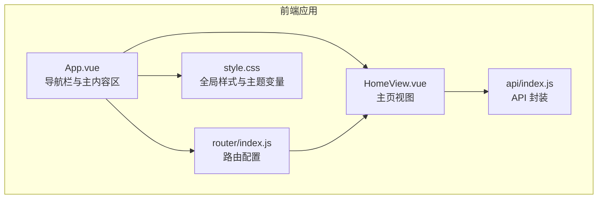
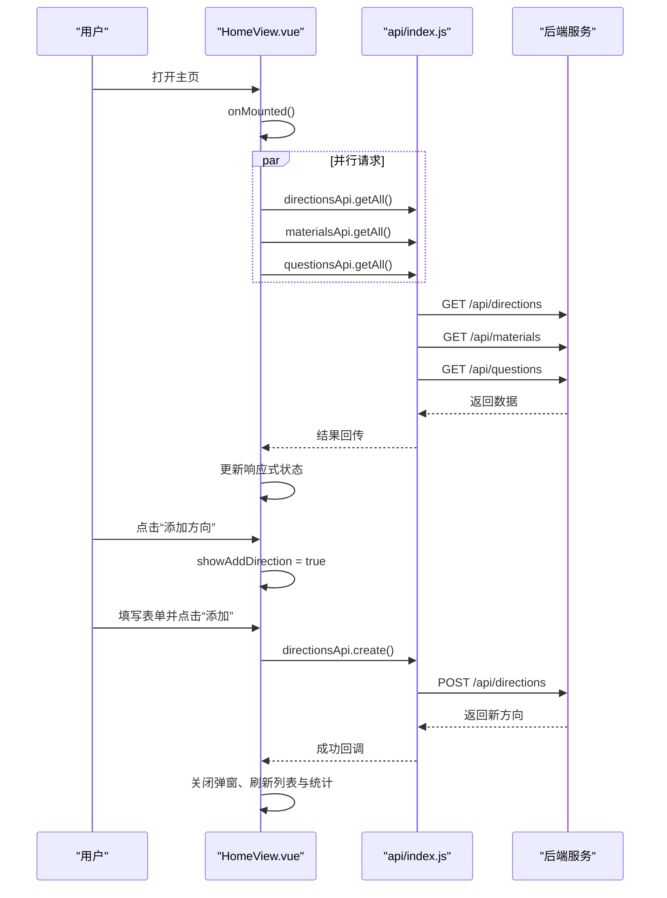
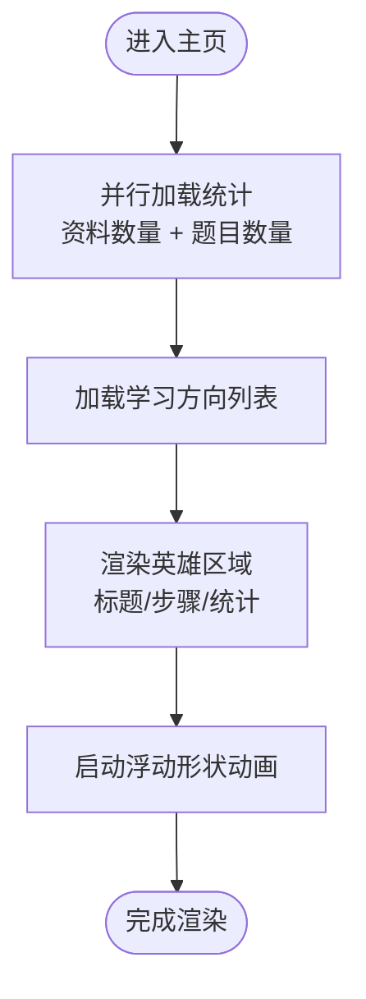
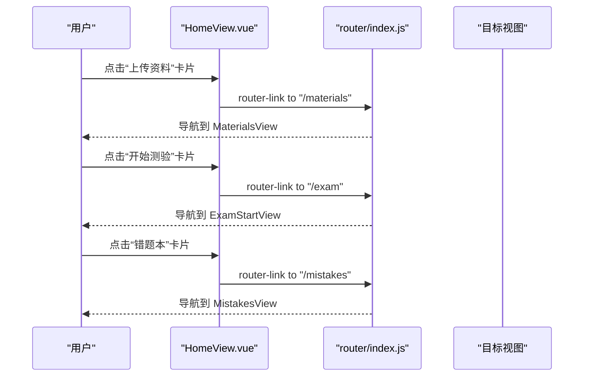
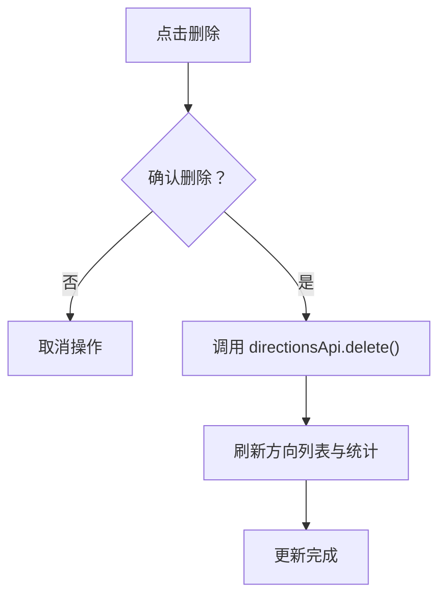
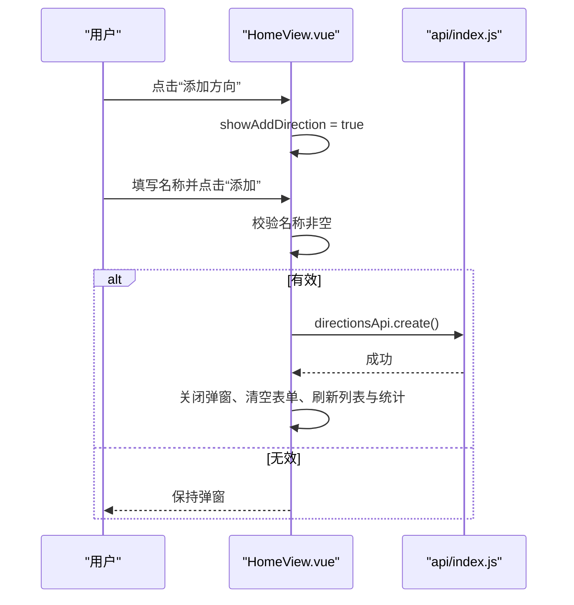
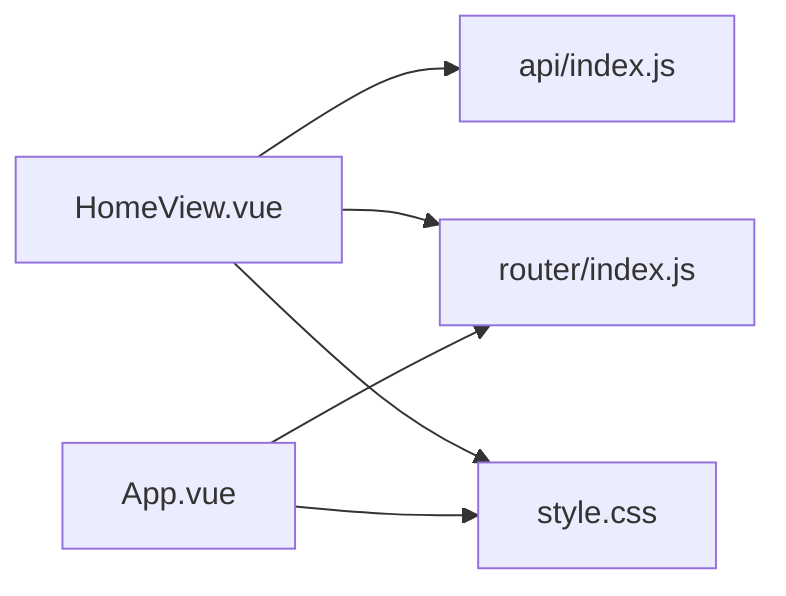

# 主页组件

<cite>
**本文档引用的文件**
- [frontend/src/views/HomeView.vue](file://frontend/src/views/HomeView.vue)
- [frontend/src/App.vue](file://frontend/src/App.vue)
- [frontend/src/main.js](file://frontend/src/main.js)
- [frontend/src/router/index.js](file://frontend/src/router/index.js)
- [frontend/src/style.css](file://frontend/src/style.css)
- [frontend/src/api/index.js](file://frontend/src/api/index.js)
- [frontend/src/views/MaterialsView.vue](file://frontend/src/views/MaterialsView.vue)
- [frontend/src/views/MistakesView.vue](file://frontend/src/views/MistakesView.vue)
</cite>

## 目录
1. [简介](#简介)
2. [项目结构](#项目结构)
3. [核心组件](#核心组件)
4. [架构总览](#架构总览)
5. [详细组件分析](#详细组件分析)
6. [依赖关系分析](#依赖关系分析)
7. [性能考虑](#性能考虑)
8. [故障排除指南](#故障排除指南)
9. [结论](#结论)
10. [附录](#附录)

## 简介
本文件面向“主页组件”的完整技术文档，围绕前端主页视图进行深入剖析，涵盖整体布局与设计、英雄区域的视觉与动画、快速开始卡片的导航与用户引导、学习方向卡片的渲染与交互、模态框组件的表单与状态管理、响应式设计与动画效果、API 调用模式与错误处理、性能优化策略，以及组件复用与状态管理的最佳实践。

## 项目结构
- 前端采用 Vue 3 单页应用，使用组合式 API（script setup）组织页面逻辑。
- 主页位于 views/HomeView.vue，作为应用的入口视图之一，负责展示学习路径概览、统计数据、学习方向卡片与新增弹窗等。
- 全局样式集中于 style.css，定义主题变量、渐变、阴影、动画与网格布局等。
- 导航由 App.vue 的导航栏与路由配置共同构成，路由在 router/index.js 中定义，按需懒加载各视图组件。
- API 层封装于 api/index.js，统一前缀与超时配置，并暴露方向、资料、题目、测验、错题等模块化接口。

图表来源
- [frontend/src/App.vue](file://frontend/src/App.vue#L1-L202)
- [frontend/src/views/HomeView.vue](file://frontend/src/views/HomeView.vue#L1-L720)
- [frontend/src/router/index.js](file://frontend/src/router/index.js#L1-L47)
- [frontend/src/style.css](file://frontend/src/style.css#L1-L404)
- [frontend/src/api/index.js](file://frontend/src/api/index.js#L1-L52)

章节来源
- [frontend/src/views/HomeView.vue](file://frontend/src/views/HomeView.vue#L1-L720)
- [frontend/src/App.vue](file://frontend/src/App.vue#L1-L202)
- [frontend/src/router/index.js](file://frontend/src/router/index.js#L1-L47)
- [frontend/src/style.css](file://frontend/src/style.css#L1-L404)
- [frontend/src/api/index.js](file://frontend/src/api/index.js#L1-L52)

## 核心组件
- 英雄区域（Hero Section）
  - 渐变背景与动态背景圆环：通过伪元素与旋转动画实现。
  - 浮动形状动画：三个圆形形状以不同延迟与幅度浮动旋转。
  - 统计信息展示：学习方向数量、学习资料数量、生成题目数量。
- 快速开始卡片（Quick Actions）
  - 三卡片布局，分别链接至资料上传、开始测验、错题本。
  - 卡片悬停效果、图标放大、箭头滑入等动画。
- 学习方向卡片（Directions Section）
  - 列表渲染，带入场动画；支持删除与查看详情。
  - 新增方向弹窗，包含表单校验与提交。
- 模态框组件（Modal）
  - 基于 Vue 过渡系统的弹窗，包含遮罩层、缩放动画与表单控件。
- 响应式设计
  - 在移动端调整布局、字体大小与卡片尺寸，保证可用性。

章节来源
- [frontend/src/views/HomeView.vue](file://frontend/src/views/HomeView.vue#L1-L720)
- [frontend/src/style.css](file://frontend/src/style.css#L214-L720)

## 架构总览
主页组件的控制流从挂载阶段开始，同时拉取学习方向与统计数据，随后根据用户交互触发新增方向或删除方向等操作。API 请求通过统一封装的 axios 实例完成，错误通过 alert 或控制台输出提示。

图表来源
- [frontend/src/views/HomeView.vue](file://frontend/src/views/HomeView.vue#L143-L212)
- [frontend/src/api/index.js](file://frontend/src/api/index.js#L11-L33)

章节来源
- [frontend/src/views/HomeView.vue](file://frontend/src/views/HomeView.vue#L143-L212)
- [frontend/src/api/index.js](file://frontend/src/api/index.js#L1-L52)

## 详细组件分析

### 英雄区域（Hero Section）
- 设计要点
  - 渐变背景：使用 CSS 变量与径向渐变，营造科技感与层次感。
  - 动态背景圆环：伪元素实现大范围旋转背景，增强动感。
  - 内容区：标题、步骤说明与统计信息分列，配合动画入场。
  - 视觉元素：右侧浮动形状，三个圆形以不同延迟与幅度浮动旋转。
- 数据与状态
  - 统计数据来自资料与题目的数量，通过 Promise.all 并行加载。
  - 学习方向数量直接来自方向列表长度。
- 动画与交互
  - 英雄区域与卡片均使用淡入上移动画，提升加载体验。
  - 步骤项在 hover 时有缩放与背景加深效果。

图表来源
- [frontend/src/views/HomeView.vue](file://frontend/src/views/HomeView.vue#L154-L211)
- [frontend/src/style.css](file://frontend/src/style.css#L220-L394)

章节来源
- [frontend/src/views/HomeView.vue](file://frontend/src/views/HomeView.vue#L1-L720)
- [frontend/src/style.css](file://frontend/src/style.css#L214-L394)

### 快速开始卡片（Quick Actions）
- 导航逻辑
  - 使用 router-link 直接跳转至对应视图：资料管理、测验入口、错题本。
- 用户引导
  - 卡片图标与箭头在 hover 时突出，帮助用户识别可交互元素。
- 布局与动画
  - 三列网格在桌面端展示，移动端自动改为单列。
  - 卡片逐个延迟入场，增强层次感。

图表来源
- [frontend/src/views/HomeView.vue](file://frontend/src/views/HomeView.vue#L41-L75)
- [frontend/src/router/index.js](file://frontend/src/router/index.js#L1-L47)

章节来源
- [frontend/src/views/HomeView.vue](file://frontend/src/views/HomeView.vue#L41-L75)
- [frontend/src/router/index.js](file://frontend/src/router/index.js#L1-L47)

### 学习方向卡片（Directions Section）
- 渲染机制
  - 使用 v-for 遍历方向列表，每个卡片设置入场动画延迟，形成瀑布式出现。
  - 卡片头部包含名称与资料数量徽标，支持查看资料与删除方向。
- 数据绑定与交互
  - 删除操作前确认提示，避免误删。
  - 资料数量显示当前为占位文案，实际可扩展为按方向统计。
- API 调用
  - 新增与删除通过 directionsApi 完成，成功后刷新列表与统计。

图表来源
- [frontend/src/views/HomeView.vue](file://frontend/src/views/HomeView.vue#L192-L201)
- [frontend/src/api/index.js](file://frontend/src/api/index.js#L12-L16)

章节来源
- [frontend/src/views/HomeView.vue](file://frontend/src/views/HomeView.vue#L77-L113)
- [frontend/src/api/index.js](file://frontend/src/api/index.js#L12-L16)

### 模态框组件（Modal）
- 实现细节
  - 使用 Vue 过渡系统实现淡入淡出与缩放动画。
  - 遮罩层支持点击外部关闭，内部表单包含名称必填校验。
  - 提交按钮禁用条件基于表单有效性，防止空名称提交。
- 表单验证与状态管理
  - 表单双向绑定至响应式对象，提交后清空并关闭弹窗。
  - 错误处理通过 alert 展示后端返回的错误详情或消息。
- 用户反馈
  - 提交过程中可扩展为加载状态与禁用按钮，提升可用性。

图表来源
- [frontend/src/views/HomeView.vue](file://frontend/src/views/HomeView.vue#L115-L139)
- [frontend/src/api/index.js](file://frontend/src/api/index.js#L12-L16)

章节来源
- [frontend/src/views/HomeView.vue](file://frontend/src/views/HomeView.vue#L115-L139)
- [frontend/src/api/index.js](file://frontend/src/api/index.js#L12-L16)

### 响应式设计与动画效果
- 响应式断点
  - 移动端调整英雄区域为纵向堆叠、居中对齐，统计区与可视化区域缩小。
  - 方向卡片网格在小屏下变为单列，确保阅读与交互体验。
- 动画体系
  - 全局定义了多种动画曲线与过渡时长，统一用于页面元素的进入、悬停与过渡。
  - 卡片与模态框使用缩放与透明度变化，配合阴影与渐变增强层次感。

章节来源
- [frontend/src/views/HomeView.vue](file://frontend/src/views/HomeView.vue#L673-L718)
- [frontend/src/style.css](file://frontend/src/style.css#L294-L404)

## 依赖关系分析
- 组件耦合
  - HomeView 依赖路由与 API 模块，通过组合式 API 管理状态与生命周期。
  - 样式高度模块化，通过 CSS 变量与动画类实现跨组件一致性。
- 外部依赖
  - axios 作为 HTTP 客户端，统一配置基础 URL、超时与请求头。
  - 路由器按需加载视图，减少首屏体积。
- 潜在循环依赖
  - 当前结构清晰，未发现组件间循环依赖。

图表来源
- [frontend/src/views/HomeView.vue](file://frontend/src/views/HomeView.vue#L143-L145)
- [frontend/src/api/index.js](file://frontend/src/api/index.js#L1-L9)
- [frontend/src/router/index.js](file://frontend/src/router/index.js#L1-L47)
- [frontend/src/App.vue](file://frontend/src/App.vue#L1-L202)

章节来源
- [frontend/src/views/HomeView.vue](file://frontend/src/views/HomeView.vue#L143-L145)
- [frontend/src/api/index.js](file://frontend/src/api/index.js#L1-L9)
- [frontend/src/router/index.js](file://frontend/src/router/index.js#L1-L47)
- [frontend/src/App.vue](file://frontend/src/App.vue#L1-L202)

## 性能考虑
- 并发加载
  - 使用 Promise.all 同时获取方向与统计数据，缩短首屏等待时间。
- 懒加载与按需路由
  - 路由器对视图组件使用动态导入，降低初始包体积。
- 动画与渲染
  - 控制动画复杂度与数量，避免在低端设备上造成掉帧。
- 网络超时
  - axios 超时设为较长时长，适配 AI 处理耗时场景，必要时可增加重试与进度提示。
- 最佳实践
  - 对高频更新的状态使用浅层响应式，避免深层嵌套导致的性能问题。
  - 在移动端优先使用 transform 与 opacity 动画，减少重排重绘。

章节来源
- [frontend/src/views/HomeView.vue](file://frontend/src/views/HomeView.vue#L166-L177)
- [frontend/src/api/index.js](file://frontend/src/api/index.js#L3-L9)
- [frontend/src/router/index.js](file://frontend/src/router/index.js#L1-L47)

## 故障排除指南
- 加载失败
  - 现象：统计或方向列表为空或报错。
  - 排查：检查网络请求与后端接口状态，确认 axios 配置与路由正确。
- 新增失败
  - 现象：弹窗提交后无反应或弹出错误提示。
  - 排查：确认必填字段、后端返回的错误信息，检查 directionsApi.create 的调用链。
- 删除失败
  - 现象：删除确认后仍存在或提示失败。
  - 排查：确认确认对话框逻辑与 directionsApi.delete 的调用，检查后端权限与数据约束。
- 动画异常
  - 现象：卡片入场或模态框动画不生效。
  - 排查：检查 CSS 变量与动画类是否正确引入，确认浏览器兼容性。

章节来源
- [frontend/src/views/HomeView.vue](file://frontend/src/views/HomeView.vue#L154-L201)
- [frontend/src/api/index.js](file://frontend/src/api/index.js#L12-L16)

## 结论
主页组件通过清晰的布局与丰富的动画，构建了良好的首屏体验。其核心亮点在于：
- 英雄区域的视觉与动效结合，强化品牌与功能认知；
- 快速开始卡片提供明确的用户引导路径；
- 学习方向卡片具备完整的 CRUD 闭环；
- 模态框组件实现了简洁而可靠的表单交互；
- 响应式设计与动画体系提升了跨设备体验。

建议后续在以下方面持续优化：
- 将学习方向卡片的资料数量从占位替换为真实统计；
- 在新增/删除方向时增加加载状态与错误提示；
- 对移动端交互进行更细致的微交互优化；
- 在 API 层引入统一的错误拦截与用户提示组件。

## 附录
- 相关视图参考
  - 资料管理视图展示了资料上传与处理流程，可作为主页“上传资料”入口的上下文参考。
  - 错题本视图展示了错题的筛选与状态管理，可作为主页“错题本”入口的上下文参考。

章节来源
- [frontend/src/views/MaterialsView.vue](file://frontend/src/views/MaterialsView.vue#L1-L200)
- [frontend/src/views/MistakesView.vue](file://frontend/src/views/MistakesView.vue#L1-L200)