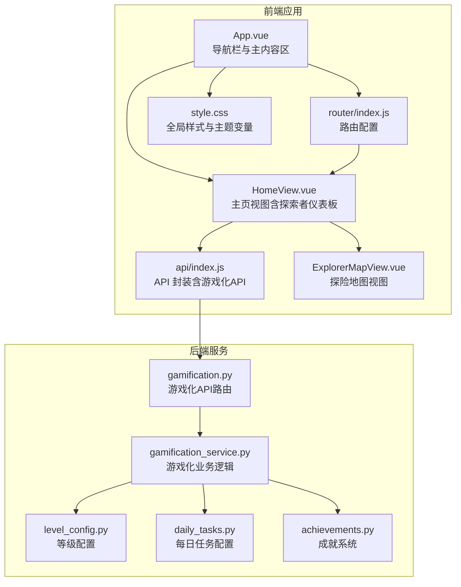
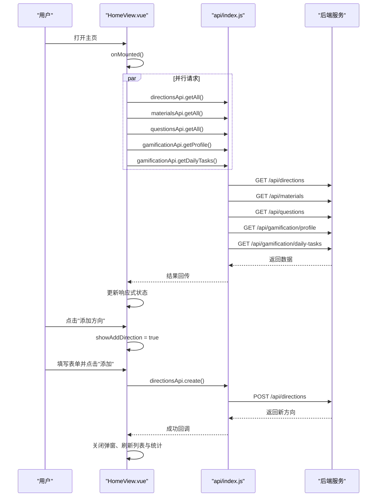
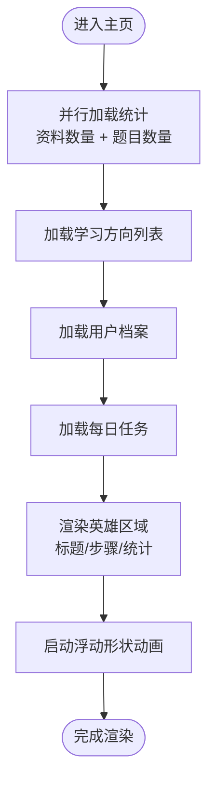
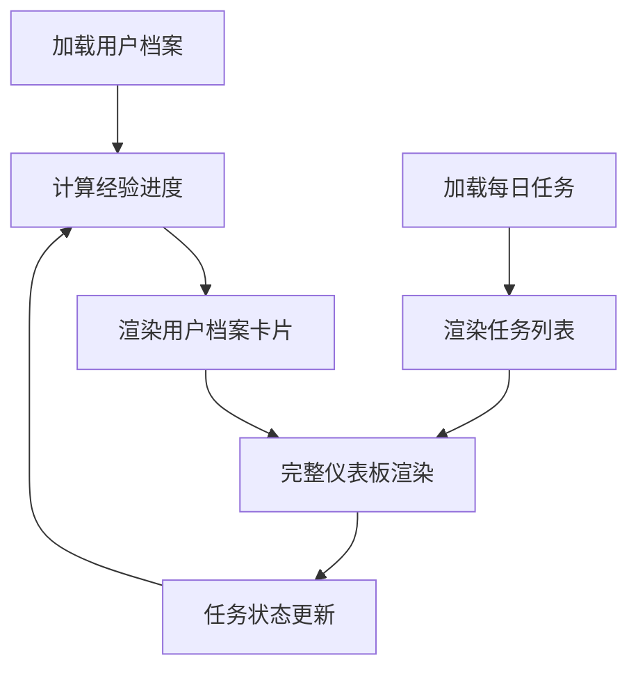
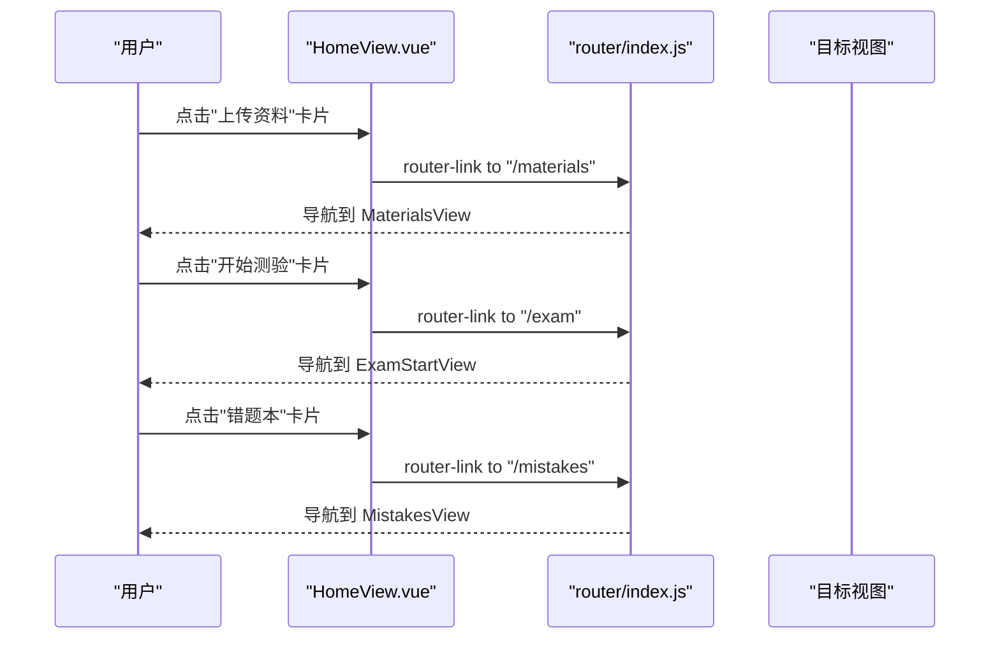
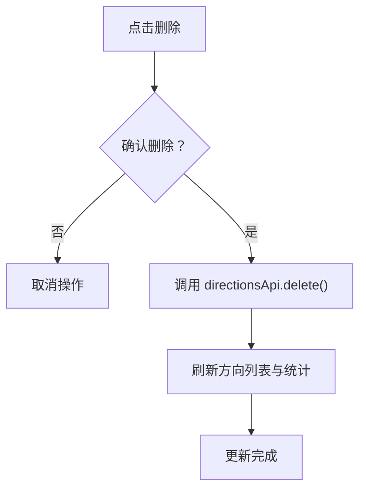
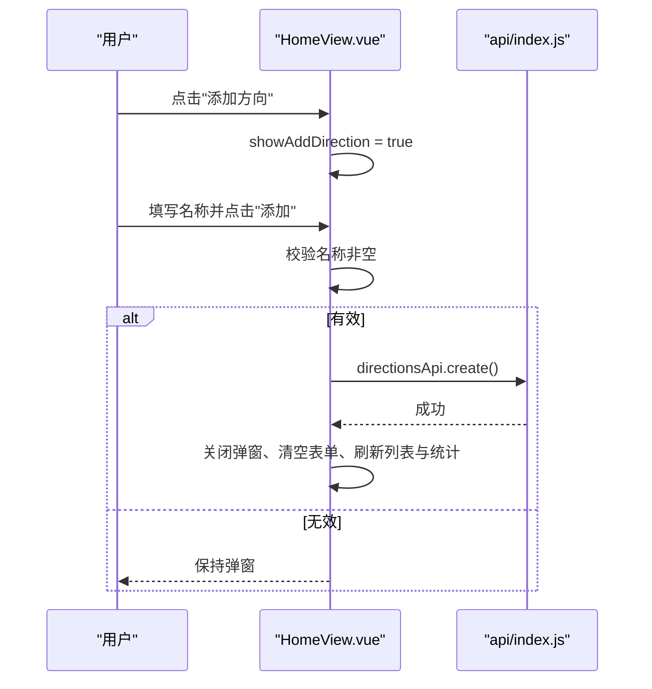
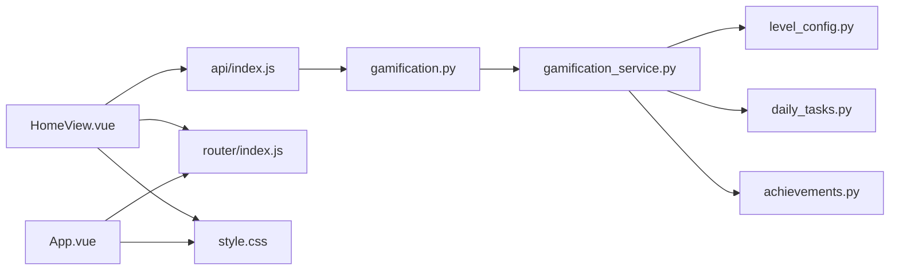

# 主页组件

<cite>
**本文档引用的文件**
- [frontend/src/views/HomeView.vue](file://frontend/src/views/HomeView.vue)
- [frontend/src/App.vue](file://frontend/src/App.vue)
- [frontend/src/main.js](file://frontend/src/main.js)
- [frontend/src/router/index.js](file://frontend/src/router/index.js)
- [frontend/src/style.css](file://frontend/src/style.css)
- [frontend/src/api/index.js](file://frontend/src/api/index.js)
- [frontend/src/views/MaterialsView.vue](file://frontend/src/views/MaterialsView.vue)
- [frontend/src/views/MistakesView.vue](file://frontend/src/views/MistakesView.vue)
- [frontend/src/views/ExplorerMapView.vue](file://frontend/src/views/ExplorerMapView.vue)
- [backend/app/api/gamification.py](file://backend/app/api/gamification.py)
- [backend/app/services/gamification_service.py](file://backend/app/services/gamification_service.py)
</cite>

## 目录
1. [简介](#简介)
2. [项目结构](#项目结构)
3. [核心组件](#核心组件)
4. [架构总览](#架构总览)
5. [详细组件分析](#详细组件分析)
6. [依赖关系分析](#依赖关系分析)
7. [性能考虑](#性能考虑)
8. [故障排除指南](#故障排除指南)
9. [结论](#结论)
10. [附录](#附录)

## 简介
本文件面向"主页组件"的完整技术文档，围绕前端主页视图进行深入剖析，涵盖整体布局与设计、英雄区域的视觉与动画、快速开始卡片的导航与用户引导、学习方向卡片的渲染与交互、模态框组件的表单与状态管理、响应式设计与动画效果、API 调用模式与错误处理、性能优化策略，以及组件复用与状态管理的最佳实践。

**更新** 本次更新重点反映了新增的探索者仪表板功能，包括用户档案、经验进度条和每日任务列表的集成，以及相关的后端游戏化服务支持。

## 项目结构
- 前端采用 Vue 3 单页应用，使用组合式 API（script setup）组织页面逻辑。
- 主页位于 views/HomeView.vue，作为应用的入口视图之一，负责展示学习路径概览、统计数据、学习方向卡片、新增弹窗，以及新增的探索者仪表板（用户档案、经验进度条、每日任务列表）。
- 全局样式集中于 style.css，定义主题变量、渐变、阴影、动画与网格布局等。
- 导航由 App.vue 的导航栏与路由配置共同构成，路由在 router/index.js 中定义，按需懒加载各视图组件。
- API 层封装于 api/index.js，统一前缀与超时配置，并暴露方向、资料、题目、测验、错题、**游戏化**等模块化接口。
- 后端游戏化服务位于 backend/app/services/gamification_service.py，提供经验值系统、成就系统、每日任务等功能。

```mermaid
graph TB
subgraph "前端应用"
A["App.vue<br/>导航栏与主内容区"]
B["HomeView.vue<br/>主页视图含探索者仪表板"]
C["router/index.js<br/>路由配置"]
D["style.css<br/>全局样式与主题变量"]
E["api/index.js<br/>API 封装含游戏化API"]
F["ExplorerMapView.vue<br/>探险地图视图"]
end
subgraph "后端服务"
G["gamification.py<br/>游戏化API路由"]
H["gamification_service.py<br/>游戏化业务逻辑"]
I["level_config.py<br/>等级配置"]
J["daily_tasks.py<br/>每日任务配置"]
K["achievements.py<br/>成就系统"]
end
A --> C
A --> B
B --> E
C --> B
A --> D
B --> F
E --> G
G --> H
H --> I
H --> J
H --> K
```

**图表来源**
- [frontend/src/App.vue](file://frontend/src/App.vue#L1-L202)
- [frontend/src/views/HomeView.vue](file://frontend/src/views/HomeView.vue#L1-L1111)
- [frontend/src/router/index.js](file://frontend/src/router/index.js#L1-L47)
- [frontend/src/style.css](file://frontend/src/style.css#L1-L404)
- [frontend/src/api/index.js](file://frontend/src/api/index.js#L1-L84)
- [frontend/src/views/ExplorerMapView.vue](file://frontend/src/views/ExplorerMapView.vue#L1-L200)
- [backend/app/api/gamification.py](file://backend/app/api/gamification.py#L1-L129)
- [backend/app/services/gamification_service.py](file://backend/app/services/gamification_service.py#L1-L482)

**章节来源**
- [frontend/src/views/HomeView.vue](file://frontend/src/views/HomeView.vue#L1-L1111)
- [frontend/src/App.vue](file://frontend/src/App.vue#L1-L202)
- [frontend/src/router/index.js](file://frontend/src/router/index.js#L1-L47)
- [frontend/src/style.css](file://frontend/src/style.css#L1-L404)
- [frontend/src/api/index.js](file://frontend/src/api/index.js#L1-L84)
- [backend/app/api/gamification.py](file://backend/app/api/gamification.py#L1-L129)
- [backend/app/services/gamification_service.py](file://backend/app/services/gamification_service.py#L1-L482)

## 核心组件
- 英雄区域（Hero Section）
  - 渐变背景与动态背景圆环：通过伪元素与旋转动画实现。
  - 浮动形状动画：三个圆形形状以不同延迟与幅度浮动旋转。
  - 统计信息展示：学习方向数量、学习资料数量、生成题目数量。
- **探索者仪表板（Explorer Dashboard）**
  - **用户档案卡片**：显示用户名、等级、经验、称号、连续天数等个人信息。
  - **经验进度条**：实时显示当前经验到下一级的经验进度，包含百分比计算和动画效果。
  - **每日任务列表**：展示今日任务，包含任务名称、描述、进度条、奖励经验和完成状态。
- 快速开始卡片（Quick Actions）
  - 三卡片布局，分别链接至资料上传、开始测验、错题本。
  - 卡片悬停效果、图标放大、箭头滑入等动画。
- 学习方向卡片（Directions Section）
  - 列表渲染，带入场动画；支持删除与查看详情。
  - 新增方向弹窗，包含表单校验与提交。
- 模态框组件（Modal）
  - 基于 Vue 过渡系统的弹窗，包含遮罩层、缩放动画与表单控件。
- 响应式设计
  - 在移动端调整布局、字体大小与卡片尺寸，保证可用性。

**章节来源**
- [frontend/src/views/HomeView.vue](file://frontend/src/views/HomeView.vue#L41-L116)
- [frontend/src/views/HomeView.vue](file://frontend/src/views/HomeView.vue#L314-L334)
- [frontend/src/style.css](file://frontend/src/style.css#L847-L1110)
- [frontend/src/api/index.js](file://frontend/src/api/index.js#L72-L81)

## 架构总览
主页组件的控制流从挂载阶段开始，同时拉取学习方向、统计数据、**用户档案**和**每日任务**，随后根据用户交互触发新增方向或删除方向等操作。API 请求通过统一封装的 axios 实例完成，错误通过 alert 或控制台输出提示。

**更新** 新增了游戏化数据的加载和处理流程，包括用户档案和每日任务的并行加载。

```mermaid
sequenceDiagram
participant U as "用户"
participant V as "HomeView.vue"
participant A as "api/index.js"
participant S as "后端服务"
U->>V : 打开主页
V->>V : onMounted()
par 并行请求
V->>A : directionsApi.getAll()
V->>A : materialsApi.getAll()
V->>A : questionsApi.getAll()
V->>A : gamificationApi.getProfile()
V->>A : gamificationApi.getDailyTasks()
end
A->>S : GET /api/directions
A->>S : GET /api/materials
A->>S : GET /api/questions
A->>S : GET /api/gamification/profile
A->>S : GET /api/gamification/daily-tasks
S-->>A : 返回数据
A-->>V : 结果回传
V->>V : 更新响应式状态
U->>V : 点击"添加方向"
V->>V : showAddDirection = true
U->>V : 填写表单并点击"添加"
V->>A : directionsApi.create()
A->>S : POST /api/directions
S-->>A : 返回新方向
A-->>V : 成功回调
V->>V : 关闭弹窗、刷新列表与统计
```

**图表来源**
- [frontend/src/views/HomeView.vue](file://frontend/src/views/HomeView.vue#L332-L334)
- [frontend/src/api/index.js](file://frontend/src/api/index.js#L11-L33)
- [frontend/src/api/index.js](file://frontend/src/api/index.js#L72-L81)

**章节来源**
- [frontend/src/views/HomeView.vue](file://frontend/src/views/HomeView.vue#L332-L334)
- [frontend/src/api/index.js](file://frontend/src/api/index.js#L1-L84)

## 详细组件分析

### 英雄区域（Hero Section）
- 设计要点
  - 渐变背景：使用 CSS 变量与径向渐变，营造科技感与层次感。
  - 动态背景圆环：伪元素实现大范围旋转背景，增强动感。
  - 内容区：标题、步骤说明与统计信息分列，配合动画入场。
  - 视觉元素：右侧浮动形状，三个圆形以不同延迟与幅度浮动旋转。
- 数据与状态
  - 统计数据来自资料与题目的数量，通过 Promise.all 并行加载。
  - 学习方向数量直接来自方向列表长度。
- 动画与交互
  - 英雄区域与卡片均使用淡入上移动画，提升加载体验。
  - 步骤项在 hover 时有缩放与背景加深效果。

```mermaid
flowchart TD
Start(["进入主页"]) --> LoadStats["并行加载统计<br/>资料数量 + 题目数量"]
LoadStats --> LoadDirs["加载学习方向列表"]
LoadDirs --> LoadProfile["加载用户档案"]
LoadProfile --> LoadDailyTasks["加载每日任务"]
LoadDailyTasks --> RenderHero["渲染英雄区域<br/>标题/步骤/统计"]
RenderHero --> FloatingShapes["启动浮动形状动画"]
FloatingShapes --> Done(["完成渲染"])
```

**图表来源**
- [frontend/src/views/HomeView.vue](file://frontend/src/views/HomeView.vue#L272-L283)
- [frontend/src/views/HomeView.vue](file://frontend/src/views/HomeView.vue#L314-L334)
- [frontend/src/style.css](file://frontend/src/style.css#L371-L517)

**章节来源**
- [frontend/src/views/HomeView.vue](file://frontend/src/views/HomeView.vue#L1-L218)
- [frontend/src/style.css](file://frontend/src/style.css#L343-L517)

### 探索者仪表板（Explorer Dashboard）

**更新** 新增探索者仪表板功能，包含用户档案、经验进度条和每日任务列表。

#### 用户档案卡片（Explorer Profile）
- 设计要点
  - **等级徽章**：显示当前等级，使用渐变背景和阴影效果。
  - **个人信息**：用户名和称号显示，体现角色成长。
  - **连续天数**：火焰图标显示连续学习天数，使用橙色强调。
  - **统计信息**：总经验、等级、连续天数的数值显示。
- 数据绑定与状态管理
  - 通过 gamificationApi.getProfile() 获取用户档案数据。
  - 包含用户名、等级、总经验、下一级所需经验、称号、连续天数等字段。
  - 支持跳转到探险地图视图的功能。
- 交互效果
  - 卡片使用渐变背景和模糊滤镜，增强视觉层次。
  - 按钮采用块级显示，提供统一的导航入口。

#### 经验进度条（Experience Progress Bar）
- 计算逻辑
  - **百分比计算**：通过 expPercentCalc 计算当前等级的经验进度百分比。
  - **区间计算**：基于当前经验、下一级所需经验和当前等级起始经验计算。
  - **边界处理**：当达到最高等级时显示100%进度。
- 视觉效果
  - **渐变填充**：使用渐变色填充进度条，增强视觉吸引力。
  - **动画过渡**：进度变化时使用缓动函数，提供流畅的视觉体验。
  - **阴影效果**：进度条具有发光阴影，提升立体感。
- 文本显示
  - 显示当前经验/下一级所需经验的格式化文本。
  - 字体使用渐变色，突出重要信息。

#### 每日任务列表（Daily Tasks）
- 渲染机制
  - 使用 v-for 遍历任务数组，支持任务完成状态的视觉区分。
  - **空状态**：当任务列表为空时显示加载提示。
  - **完成状态**：已完成任务使用绿色主题和勾选图标。
- 任务信息
  - **任务名称**：显示任务标题和描述。
  - **进度条**：显示任务完成进度，支持实时更新。
  - **奖励经验**：显示完成任务获得的经验奖励。
- 交互设计
  - 任务项采用卡片式设计，带有边框和背景色。
  - 完成状态的任务具有特殊的绿色主题样式。
  - 进度条使用渐变色填充，提供直观的完成度指示。

```mermaid
flowchart TD
LoadProfile["加载用户档案"] --> CalcExp["计算经验进度"]
CalcExp --> RenderProfile["渲染用户档案卡片"]
LoadDailyTasks["加载每日任务"] --> RenderTasks["渲染任务列表"]
RenderProfile --> RenderDashboard["完整仪表板渲染"]
RenderTasks --> RenderDashboard
RenderDashboard --> UpdateTasks["任务状态更新"]
UpdateTasks --> CalcExp
```

**图表来源**
- [frontend/src/views/HomeView.vue](file://frontend/src/views/HomeView.vue#L314-L334)
- [frontend/src/views/HomeView.vue](file://frontend/src/views/HomeView.vue#L235-L256)
- [frontend/src/views/HomeView.vue](file://frontend/src/views/HomeView.vue#L978-L1110)

**章节来源**
- [frontend/src/views/HomeView.vue](file://frontend/src/views/HomeView.vue#L41-L116)
- [frontend/src/views/HomeView.vue](file://frontend/src/views/HomeView.vue#L235-L256)
- [frontend/src/views/HomeView.vue](file://frontend/src/views/HomeView.vue#L314-L334)
- [frontend/src/api/index.js](file://frontend/src/api/index.js#L72-L81)

### 快速开始卡片（Quick Actions）
- 导航逻辑
  - 使用 router-link 直接跳转至对应视图：资料管理、测验入口、错题本。
- 用户引导
  - 卡片图标与箭头在 hover 时突出，帮助用户识别可交互元素。
- 布局与动画
  - 三列网格在桌面端展示，移动端自动改为单列。
  - 卡片逐个延迟入场，增强层次感。

```mermaid
sequenceDiagram
participant U as "用户"
participant H as "HomeView.vue"
participant R as "router/index.js"
participant M as "目标视图"
U->>H : 点击"上传资料"卡片
H->>R : router-link to "/materials"
R-->>U : 导航到 MaterialsView
U->>H : 点击"开始测验"卡片
H->>R : router-link to "/exam"
R-->>U : 导航到 ExamStartView
U->>H : 点击"错题本"卡片
H->>R : router-link to "/mistakes"
R-->>U : 导航到 MistakesView
```

**图表来源**
- [frontend/src/views/HomeView.vue](file://frontend/src/views/HomeView.vue#L123-L151)
- [frontend/src/router/index.js](file://frontend/src/router/index.js#L1-L47)

**章节来源**
- [frontend/src/views/HomeView.vue](file://frontend/src/views/HomeView.vue#L123-L151)
- [frontend/src/router/index.js](file://frontend/src/router/index.js#L1-L47)

### 学习方向卡片（Directions Section）
- 渲染机制
  - 使用 v-for 遍历方向列表，每个卡片设置入场动画延迟，形成瀑布式出现。
  - 卡片头部包含名称与资料数量徽标，支持查看资料与删除方向。
- 数据绑定与交互
  - 删除操作前确认提示，避免误删。
  - 资料数量显示当前为占位文案，实际可扩展为按方向统计。
- API 调用
  - 新增与删除通过 directionsApi 完成，成功后刷新列表与统计。

```mermaid
flowchart TD
ClickDelete["点击删除"] --> Confirm{"确认删除？"}
Confirm --> |否| Exit["取消操作"]
Confirm --> |是| CallAPI["调用 directionsApi.delete()"]
CallAPI --> Refresh["刷新方向列表与统计"]
Refresh --> Done["更新完成"]
```

**图表来源**
- [frontend/src/views/HomeView.vue](file://frontend/src/views/HomeView.vue#L298-L307)
- [frontend/src/api/index.js](file://frontend/src/api/index.js#L12-L16)

**章节来源**
- [frontend/src/views/HomeView.vue](file://frontend/src/views/HomeView.vue#L154-L190)
- [frontend/src/api/index.js](file://frontend/src/api/index.js#L12-L16)

### 模态框组件（Modal）
- 实现细节
  - 使用 Vue 过渡系统实现淡入淡出与缩放动画。
  - 遮罩层支持点击外部关闭，内部表单包含名称必填校验。
  - 提交按钮禁用条件基于表单有效性，防止空名称提交。
- 表单验证与状态管理
  - 表单双向绑定至响应式对象，提交后清空并关闭弹窗。
  - 错误处理通过 alert 展示后端返回的错误详情或消息。
- 用户反馈
  - 提交过程中可扩展为加载状态与禁用按钮，提升可用性。

```mermaid
sequenceDiagram
participant U as "用户"
participant H as "HomeView.vue"
participant A as "api/index.js"
U->>H : 点击"添加方向"
H->>H : showAddDirection = true
U->>H : 填写名称并点击"添加"
H->>H : 校验名称非空
alt 有效
H->>A : directionsApi.create()
A-->>H : 成功
H->>H : 关闭弹窗、清空表单、刷新列表与统计
else 无效
H-->>U : 保持弹窗
end
```

**图表来源**
- [frontend/src/views/HomeView.vue](file://frontend/src/views/HomeView.vue#L285-L296)
- [frontend/src/api/index.js](file://frontend/src/api/index.js#L12-L16)

**章节来源**
- [frontend/src/views/HomeView.vue](file://frontend/src/views/HomeView.vue#L192-L216)
- [frontend/src/api/index.js](file://frontend/src/api/index.js#L12-L16)

### 响应式设计与动画效果
- 响应式断点
  - 移动端调整英雄区域为纵向堆叠、居中对齐，统计区与可视化区域缩小。
  - 方向卡片网格在小屏下变为单列，确保阅读与交互体验。
  - **探索者仪表板**：在小屏设备上将两列布局调整为单列，保证内容可读性。
- 动画体系
  - 全局定义了多种动画曲线与过渡时长，统一用于页面元素的进入、悬停与过渡。
  - 卡片与模态框使用缩放与透明度变化，配合阴影与渐变增强层次感。
  - **经验进度条**：使用缓动函数提供流畅的进度变化动画。

**章节来源**
- [frontend/src/views/HomeView.vue](file://frontend/src/views/HomeView.vue#L796-L845)
- [frontend/src/views/HomeView.vue](file://frontend/src/views/HomeView.vue#L847-L854)
- [frontend/src/style.css](file://frontend/src/style.css#L847-L1110)

## 依赖关系分析
- 组件耦合
  - HomeView 依赖路由与 API 模块，通过组合式 API 管理状态与生命周期。
  - 样式高度模块化，通过 CSS 变量与动画类实现跨组件一致性。
  - **新增游戏化依赖**：主页现在依赖游戏化 API 和服务，提供用户档案和任务数据。
- 外部依赖
  - axios 作为 HTTP 客户端，统一配置基础 URL、超时与请求头。
  - 路由器按需加载视图，减少首屏体积。
  - **后端服务**：游戏化服务提供经验值、成就、每日任务等核心功能。
- 潜在循环依赖
  - 当前结构清晰，未发现组件间循环依赖。

```mermaid
graph LR
Home["HomeView.vue"] --> API["api/index.js"]
Home --> Router["router/index.js"]
Home --> Style["style.css"]
App["App.vue"] --> Router
App --> Style
API --> GamificationAPI["gamification.py"]
GamificationAPI --> GamificationService["gamification_service.py"]
GamificationService --> LevelConfig["level_config.py"]
GamificationService --> DailyTasks["daily_tasks.py"]
GamificationService --> Achievements["achievements.py"]
```

**图表来源**
- [frontend/src/views/HomeView.vue](file://frontend/src/views/HomeView.vue#L222-L222)
- [frontend/src/api/index.js](file://frontend/src/api/index.js#L1-L9)
- [frontend/src/router/index.js](file://frontend/src/router/index.js#L1-L47)
- [frontend/src/App.vue](file://frontend/src/App.vue#L1-L202)
- [backend/app/api/gamification.py](file://backend/app/api/gamification.py#L1-L21)
- [backend/app/services/gamification_service.py](file://backend/app/services/gamification_service.py#L1-L17)

**章节来源**
- [frontend/src/views/HomeView.vue](file://frontend/src/views/HomeView.vue#L222-L222)
- [frontend/src/api/index.js](file://frontend/src/api/index.js#L1-L9)
- [frontend/src/router/index.js](file://frontend/src/router/index.js#L1-L47)
- [frontend/src/App.vue](file://frontend/src/App.vue#L1-L202)
- [backend/app/api/gamification.py](file://backend/app/api/gamification.py#L1-L21)
- [backend/app/services/gamification_service.py](file://backend/app/services/gamification_service.py#L1-L17)

## 性能考虑
- 并发加载
  - 使用 Promise.all 同时获取方向、统计数据、**用户档案**和**每日任务**，缩短首屏等待时间。
  - **优化**：探索者仪表板的数据加载与主数据并行执行，提升整体响应速度。
- 懒加载与按需路由
  - 路由器对视图组件使用动态导入，降低初始包体积。
- 动画与渲染
  - 控制动画复杂度与数量，避免在低端设备上造成掉帧。
  - **经验进度条**：使用缓动函数和合理的动画时长，平衡视觉效果与性能。
- 网络超时
  - axios 超时设为较长时长，适配 AI 处理耗时场景，必要时可增加重试与进度提示。
- 最佳实践
  - 对高频更新的状态使用浅层响应式，避免深层嵌套导致的性能问题。
  - 在移动端优先使用 transform 与 opacity 动画，减少重排重绘。
  - **探索者仪表板**：经验进度计算使用计算属性缓存，避免重复计算。

**章节来源**
- [frontend/src/views/HomeView.vue](file://frontend/src/views/HomeView.vue#L272-L283)
- [frontend/src/views/HomeView.vue](file://frontend/src/views/HomeView.vue#L332-L334)
- [frontend/src/views/HomeView.vue](file://frontend/src/views/HomeView.vue#L246-L256)
- [frontend/src/api/index.js](file://frontend/src/api/index.js#L3-L9)
- [frontend/src/router/index.js](file://frontend/src/router/index.js#L1-L47)

## 故障排除指南
- 加载失败
  - 现象：统计或方向列表为空或报错。
  - 排查：检查网络请求与后端接口状态，确认 axios 配置与路由正确。
  - **探索者仪表板**：检查 gamification API 是否正常工作，确认用户档案和每日任务接口。
- 新增失败
  - 现象：弹窗提交后无反应或弹出错误提示。
  - 排查：确认必填字段、后端返回的错误信息，检查 directionsApi.create 的调用链。
- 删除失败
  - 现象：删除确认后仍存在或提示失败。
  - 排查：确认确认对话框逻辑与 directionsApi.delete 的调用，检查后端权限与数据约束。
- 动画异常
  - 现象：卡片入场或模态框动画不生效。
  - 排查：检查 CSS 变量与动画类是否正确引入，确认浏览器兼容性。
  - **经验进度条**：检查 expPercentCalc 计算逻辑，确认数据格式正确。
- **探索者仪表板特定问题**
  - **进度条不更新**：检查 expPercentCalc 计算逻辑，确认 profile 数据完整性。
  - **任务列表为空**：确认 gamificationApi.getDailyTasks 是否正确返回数据。
  - **用户档案显示异常**：检查 gamificationApi.getProfile 的数据结构和字段映射。

**章节来源**
- [frontend/src/views/HomeView.vue](file://frontend/src/views/HomeView.vue#L260-L307)
- [frontend/src/views/HomeView.vue](file://frontend/src/views/HomeView.vue#L314-L334)
- [frontend/src/api/index.js](file://frontend/src/api/index.js#L12-L16)
- [frontend/src/api/index.js](file://frontend/src/api/index.js#L72-L81)

## 结论
主页组件通过清晰的布局与丰富的动画，构建了良好的首屏体验。其核心亮点在于：
- 英雄区域的视觉与动效结合，强化品牌与功能认知；
- 快速开始卡片提供明确的用户引导路径；
- 学习方向卡片具备完整的 CRUD 闭环；
- 模态框组件实现了简洁而可靠的表单交互；
- **新增探索者仪表板**：集成用户档案、经验进度条和每日任务，提供完整的游戏化体验；
- **响应式设计与动画体系**：提升了跨设备体验，特别是移动端的仪表板布局。

**更新建议** 后续在以下方面持续优化：
- 将学习方向卡片的资料数量从占位替换为真实统计；
- 在新增/删除方向时增加加载状态与错误提示；
- 对移动端交互进行更细致的微交互优化；
- 在 API 层引入统一的错误拦截与用户提示组件；
- **探索者仪表板**：增加任务完成的实时反馈和经验奖励提示；
- **游戏化系统**：完善成就系统的可视化展示和解锁通知。

## 附录
- 相关视图参考
  - 资料管理视图展示了资料上传与处理流程，可作为主页"上传资料"入口的上下文参考。
  - 错题本视图展示了错题的筛选与状态管理，可作为主页"错题本"入口的上下文参考。
  - **探险地图视图**：展示了方向探索进度的可视化界面，与主页的用户档案功能形成完整的探索体验。

**章节来源**
- [frontend/src/views/MaterialsView.vue](file://frontend/src/views/MaterialsView.vue#L1-L200)
- [frontend/src/views/MistakesView.vue](file://frontend/src/views/MistakesView.vue#L1-L200)
- [frontend/src/views/ExplorerMapView.vue](file://frontend/src/views/ExplorerMapView.vue#L1-L200)
- [backend/app/api/gamification.py](file://backend/app/api/gamification.py#L24-L46)
- [backend/app/api/gamification.py](file://backend/app/api/gamification.py#L85-L103)