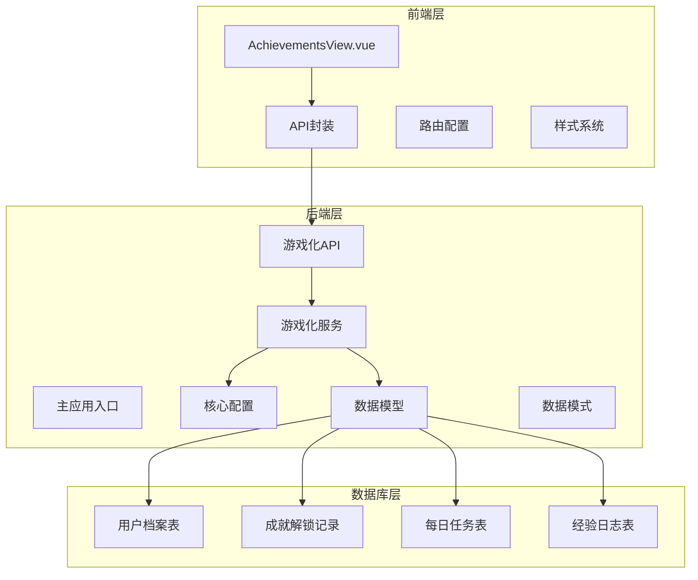
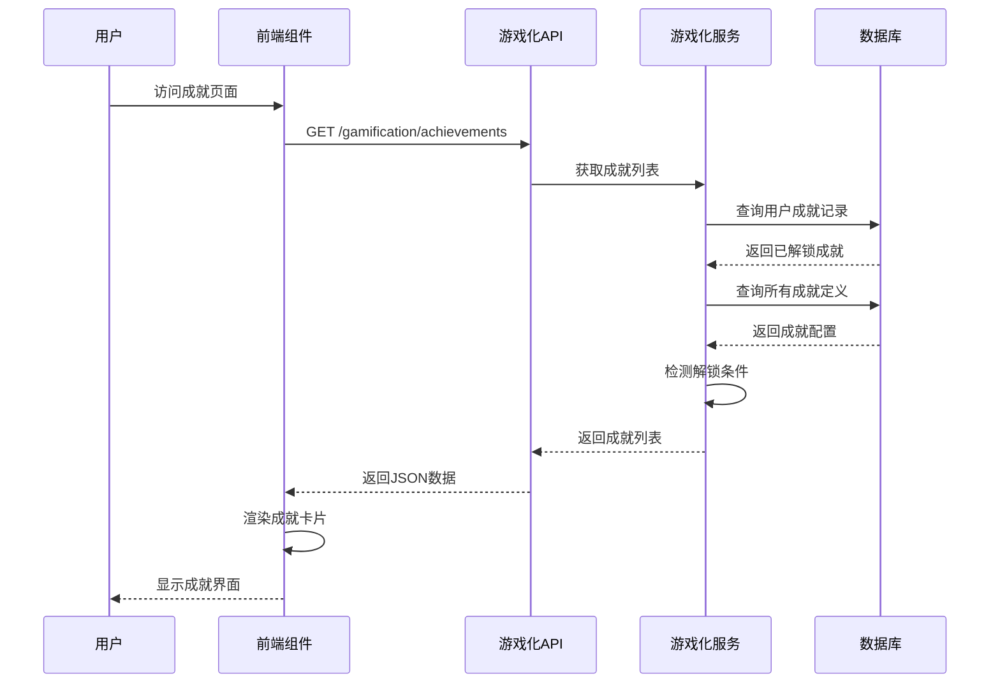
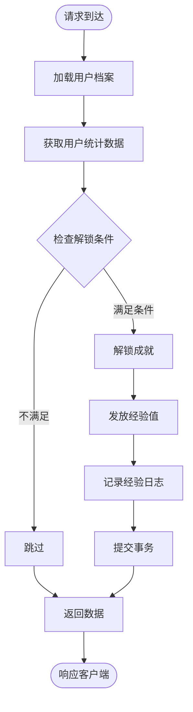
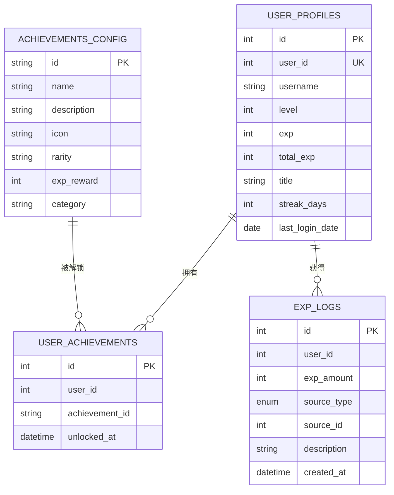
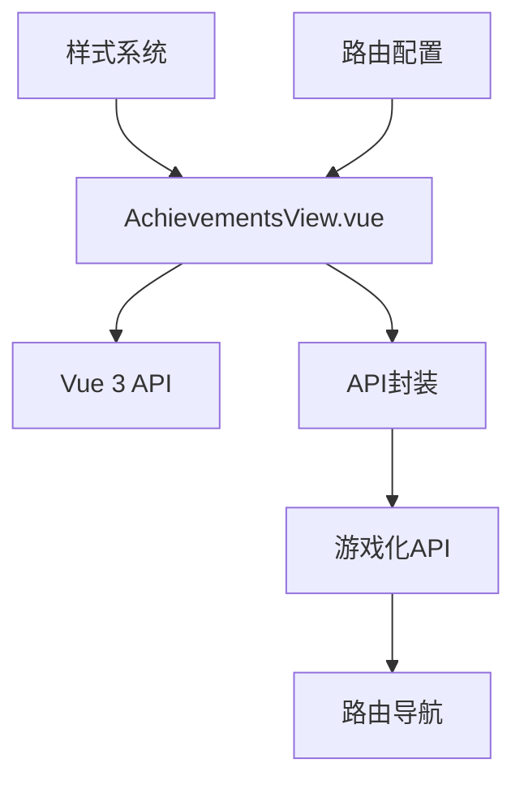
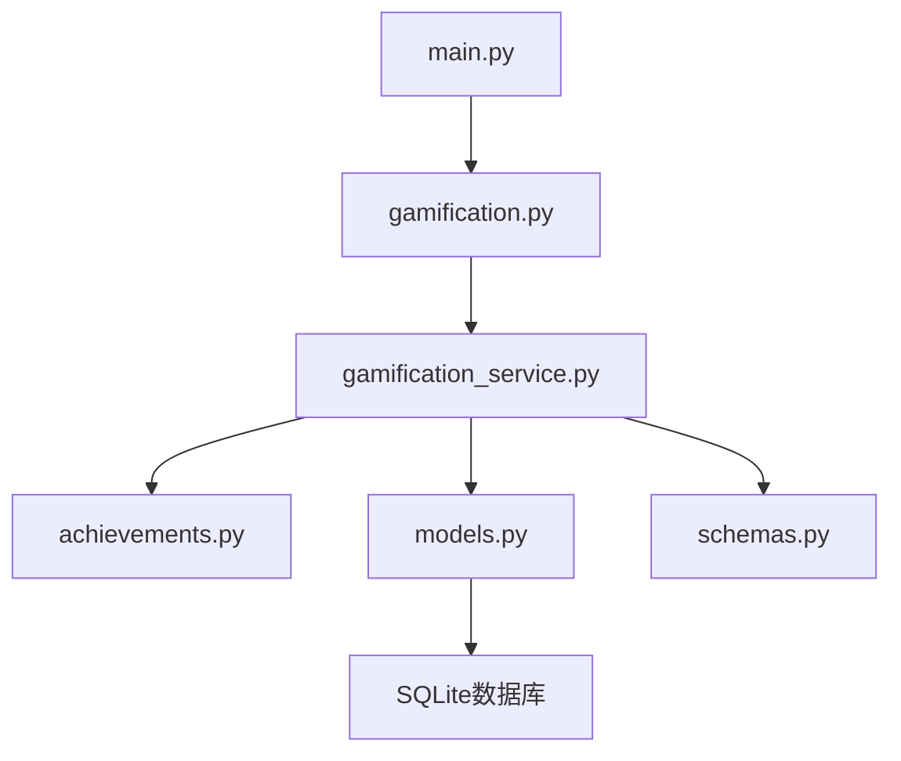
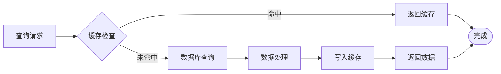

# 成就视图组件

<cite>
**本文档引用的文件**
- [AchievementsView.vue](file://frontend/src/views/AchievementsView.vue)
- [gamification.py](file://backend/app/api/gamification.py)
- [achievements.py](file://backend/app/core/achievements.py)
- [gamification_service.py](file://backend/app/services/gamification_service.py)
- [models.py](file://backend/app/models/models.py)
- [schemas.py](file://backend/app/schemas/schemas.py)
- [index.js](file://frontend/src/api/index.js)
- [main.py](file://backend/app/main.py)
- [index.js](file://frontend/src/router/index.js)
- [style.css](file://frontend/src/style.css)
</cite>

## 目录
1. [简介](#简介)
2. [项目结构](#项目结构)
3. [核心组件](#核心组件)
4. [架构概览](#架构概览)
5. [详细组件分析](#详细组件分析)
6. [依赖关系分析](#依赖关系分析)
7. [性能考虑](#性能考虑)
8. [故障排除指南](#故障排除指南)
9. [结论](#结论)

## 简介

成就视图组件是"知识探险家"个人学习管理系统中的核心功能模块，负责展示用户的成就解锁情况。该组件实现了完整的成就系统，包括成就定义、解锁条件检测、视觉展示和用户体验优化。

系统采用前后端分离架构，前端使用Vue.js构建响应式界面，后端基于FastAPI提供RESTful API服务。成就系统支持多种成就类型，包括测验成就、错题成就、资料成就、探索成就和连续学习成就，并提供丰富的视觉反馈和动画效果。

## 项目结构

成就视图组件位于项目的完整技术栈中，采用模块化设计：



**图表来源**
- [AchievementsView.vue](file://frontend/src/views/AchievementsView.vue#L1-L382)
- [gamification.py](file://backend/app/api/gamification.py#L1-L129)
- [main.py](file://backend/app/main.py#L1-L68)

**章节来源**
- [AchievementsView.vue](file://frontend/src/views/AchievementsView.vue#L1-L382)
- [main.py](file://backend/app/main.py#L1-L68)

## 核心组件

### 前端成就视图组件

成就视图组件是Vue.js单文件组件，提供了完整的成就展示功能：

- **响应式布局**：支持桌面、平板和移动端的自适应网格布局
- **成就分类展示**：将成就分为已解锁和待解锁两个区域
- **视觉层次设计**：通过稀有度颜色区分不同品质的成就
- **动画效果**：包含淡入、滑动等流畅的过渡动画
- **国际化支持**：中文本地化标签和描述

### 后端API接口

游戏化API提供了成就相关的RESTful接口：

- **成就列表获取**：统一获取所有成就的已解锁和待解锁状态
- **用户档案集成**：与用户游戏化档案数据关联
- **实时状态同步**：确保前端显示的成就状态与后端一致

### 数据模型设计

数据库模型支持完整的成就系统：

- **用户档案表**：存储用户的游戏化数据
- **成就解锁记录**：跟踪用户已解锁的成就
- **经验日志表**：记录成就解锁获得的经验值
- **每日任务表**：支持成就触发的每日任务系统

**章节来源**
- [AchievementsView.vue](file://frontend/src/views/AchievementsView.vue#L73-L130)
- [gamification.py](file://backend/app/api/gamification.py#L49-L82)
- [models.py](file://backend/app/models/models.py#L255-L266)

## 架构概览

成就系统的整体架构采用分层设计，确保各组件职责清晰：



**图表来源**
- [AchievementsView.vue](file://frontend/src/views/AchievementsView.vue#L117-L127)
- [gamification.py](file://backend/app/api/gamification.py#L49-L82)
- [gamification_service.py](file://backend/app/services/gamification_service.py#L182-L206)

### 技术栈特性

- **前端技术**：Vue.js 3 Composition API、CSS3动画、响应式设计
- **后端技术**：FastAPI、SQLAlchemy ORM、Python 3.9+
- **数据库**：SQLite（开发环境）、可扩展至其他数据库
- **部署**：支持单机部署和容器化部署

**章节来源**
- [AchievementsView.vue](file://frontend/src/views/AchievementsView.vue#L1-L382)
- [gamification.py](file://backend/app/api/gamification.py#L1-L129)

## 详细组件分析

### 前端成就视图组件架构

```mermaid
classDiagram
class AchievementsView {
+ref achievements
+ref loading
+computed unlockedCount
+computed totalCount
+map iconMap
+map rarityLabel
+map categoryLabel
+function formatDate()
+function loadAchievements()
+onMounted loadAchievements()
}
class AchievementCard {
+string achievement_id
+string name
+string description
+string icon
+string rarity
+string category
+datetime unlocked_at
+string className
}
class APIInterface {
+function getAchievements()
}
AchievementsView --> AchievementCard : "渲染"
AchievementsView --> APIInterface : "调用"
AchievementCard --> "rarity" : "稀有度样式"
AchievementCard --> "category" : "分类标签"
```

**图表来源**
- [AchievementsView.vue](file://frontend/src/views/AchievementsView.vue#L73-L130)
- [index.js](file://frontend/src/api/index.js#L72-L81)

#### 数据流分析

成就视图的数据流遵循标准的MVVM模式：

1. **初始化阶段**：组件挂载时自动加载成就数据
2. **数据获取**：通过API接口获取成就列表
3. **状态管理**：使用Vue响应式系统管理数据状态
4. **渲染逻辑**：根据成就状态动态渲染不同UI元素

#### 视觉设计系统

组件采用了完整的视觉设计系统：

- **稀有度色彩体系**：普通(灰色)、稀有(蓝色)、史诗(紫色)、传说(金色)
- **响应式网格布局**：桌面3列、平板2列、手机1列
- **动画效果**：渐入动画、悬停效果、边框发光
- **图标系统**：Unicode字符图标，支持扩展

**章节来源**
- [AchievementsView.vue](file://frontend/src/views/AchievementsView.vue#L205-L382)
- [style.css](file://frontend/src/style.css#L1-L404)

### 后端成就服务架构



**图表来源**
- [gamification_service.py](file://backend/app/services/gamification_service.py#L182-L206)
- [gamification_service.py](file://backend/app/services/gamification_service.py#L210-L224)

#### 成就检测算法

成就检测采用条件判断算法：

1. **统计数据聚合**：查询用户在各个维度的学习数据
2. **条件评估**：逐个检查成就的解锁条件
3. **批量处理**：一次性检测所有成就，避免重复查询
4. **原子操作**：使用数据库事务确保数据一致性

#### 数据模型关系



**图表来源**
- [models.py](file://backend/app/models/models.py#L238-L298)
- [achievements.py](file://backend/app/core/achievements.py#L3-L112)

**章节来源**
- [gamification_service.py](file://backend/app/services/gamification_service.py#L142-L179)
- [models.py](file://backend/app/models/models.py#L225-L321)

### API接口设计

游戏化API提供了标准化的接口规范：

| 接口 | 方法 | 描述 | 响应格式 |
|------|------|------|----------|
| `/gamification/profile` | GET | 获取用户游戏化档案 | UserProfileResponse |
| `/gamification/achievements` | GET | 获取成就列表 | AchievementsListResponse |
| `/gamification/daily-tasks` | GET | 获取每日任务 | List[DailyTaskResponse] |
| `/gamification/exp-logs` | GET | 获取经验日志 | List[ExpLogResponse] |

每个接口都遵循RESTful设计原则，提供清晰的HTTP状态码和错误处理机制。

**章节来源**
- [gamification.py](file://backend/app/api/gamification.py#L24-L129)
- [schemas.py](file://backend/app/schemas/schemas.py#L268-L371)

## 依赖关系分析

### 前端依赖关系



**图表来源**
- [AchievementsView.vue](file://frontend/src/views/AchievementsView.vue#L73-L76)
- [index.js](file://frontend/src/api/index.js#L72-L81)
- [index.js](file://frontend/src/router/index.js#L45-L48)

### 后端依赖关系



**图表来源**
- [main.py](file://backend/app/main.py#L7-L44)
- [gamification.py](file://backend/app/api/gamification.py#L1-L21)
- [gamification_service.py](file://backend/app/services/gamification_service.py#L1-L17)

### 外部依赖

系统使用的关键外部库：

- **前端**：Vue.js 3.4+、Axios、Vue Router
- **后端**：FastAPI 0.100+、SQLAlchemy 2.0+、Python 3.9+
- **数据库**：SQLite（开发）、可扩展支持MySQL/PostgreSQL
- **构建工具**：Vite、Poetry

**章节来源**
- [main.py](file://backend/app/main.py#L1-L68)
- [AchievementsView.vue](file://frontend/src/views/AchievementsView.vue#L1-L382)

## 性能考虑

### 前端性能优化

1. **懒加载策略**：成就视图组件按需加载，减少初始包大小
2. **虚拟滚动**：对于大量成就时可考虑实现虚拟滚动
3. **缓存机制**：利用浏览器缓存和组件缓存减少重复渲染
4. **响应式设计**：自适应布局避免不必要的重排重绘

### 后端性能优化

1. **数据库索引**：为常用查询字段建立索引
2. **查询优化**：使用JOIN查询减少数据库往返
3. **连接池**：配置合适的数据库连接池参数
4. **缓存策略**：对静态成就配置进行缓存

### 数据库性能



**图表来源**
- [gamification_service.py](file://backend/app/services/gamification_service.py#L142-L179)

## 故障排除指南

### 常见问题及解决方案

#### 前端问题

1. **成就数据加载失败**
   - 检查网络连接和API可达性
   - 验证CORS配置
   - 查看浏览器开发者工具的网络面板

2. **样式显示异常**
   - 确认CSS变量定义正确
   - 检查响应式断点设置
   - 验证主题配置

#### 后端问题

1. **数据库连接问题**
   - 检查数据库文件权限
   - 验证数据库连接字符串
   - 确认数据库迁移完成

2. **API响应异常**
   - 查看服务器日志
   - 验证请求参数格式
   - 检查异常处理逻辑

### 调试技巧

1. **前端调试**：使用Vue DevTools检查组件状态
2. **后端调试**：启用详细日志输出
3. **数据库调试**：使用SQLite命令行工具验证数据
4. **网络调试**：使用curl或Postman测试API接口

**章节来源**
- [AchievementsView.vue](file://frontend/src/views/AchievementsView.vue#L117-L127)
- [gamification.py](file://backend/app/api/gamification.py#L49-L82)

## 结论

成就视图组件是"知识探险家"系统的重要组成部分，成功实现了以下目标：

### 技术成就

1. **完整的功能实现**：涵盖了成就定义、检测、解锁和展示的全流程
2. **优秀的用户体验**：提供了直观、美观且响应迅速的界面
3. **良好的架构设计**：前后端分离，模块化程度高，易于维护和扩展
4. **完善的错误处理**：具备健壮的异常处理和降级机制

### 设计亮点

1. **视觉设计**：采用深色主题配色方案，符合学习应用的定位
2. **交互体验**：丰富的动画效果和响应式设计
3. **数据驱动**：基于用户实际行为的成就解锁机制
4. **可扩展性**：模块化的架构支持未来功能扩展

### 改进建议

1. **性能优化**：可以考虑实现成就数据的分页加载
2. **功能增强**：添加成就分享和社交功能
3. **个性化**：支持用户自定义成就显示偏好
4. **数据分析**：提供成就完成趋势分析

该组件为整个学习管理系统奠定了坚实的基础，为用户提供持续的学习动力和成就感。