# 探索者地图视图

<cite>
**本文档引用的文件**
- [ExplorerMapView.vue](file://frontend/src/views/ExplorerMapView.vue)
- [index.js](file://frontend/src/api/index.js)
- [index.js](file://frontend/src/router/index.js)
- [gamification.py](file://backend/app/api/gamification.py)
- [gamification_service.py](file://backend/app/services/gamification_service.py)
- [models.py](file://backend/app/models/models.py)
- [schemas.py](file://backend/app/schemas/schemas.py)
- [config.py](file://backend/app/core/config.py)
- [database.py](file://backend/app/core/database.py)
- [main.py](file://backend/app/main.py)
</cite>

## 目录
1. [简介](#简介)
2. [项目结构](#项目结构)
3. [核心组件](#核心组件)
4. [架构概览](#架构概览)
5. [详细组件分析](#详细组件分析)
6. [依赖关系分析](#依赖关系分析)
7. [性能考虑](#性能考虑)
8. [故障排除指南](#故障排除指南)
9. [结论](#结论)

## 简介

"探索者地图视图"是个人学习管理系统中的核心功能模块，为用户提供可视化的学习进度追踪界面。该视图将复杂的学习数据转化为直观的进度卡片，帮助用户了解各个学习方向的探索进度、答题统计和掌握情况。

系统采用前后端分离架构，前端使用Vue.js构建响应式用户界面，后端基于FastAPI提供RESTful API服务。通过游戏化机制，系统能够激励用户持续学习，提升学习效果和参与度。

## 项目结构

该项目采用清晰的分层架构设计，前后端分离，模块职责明确：

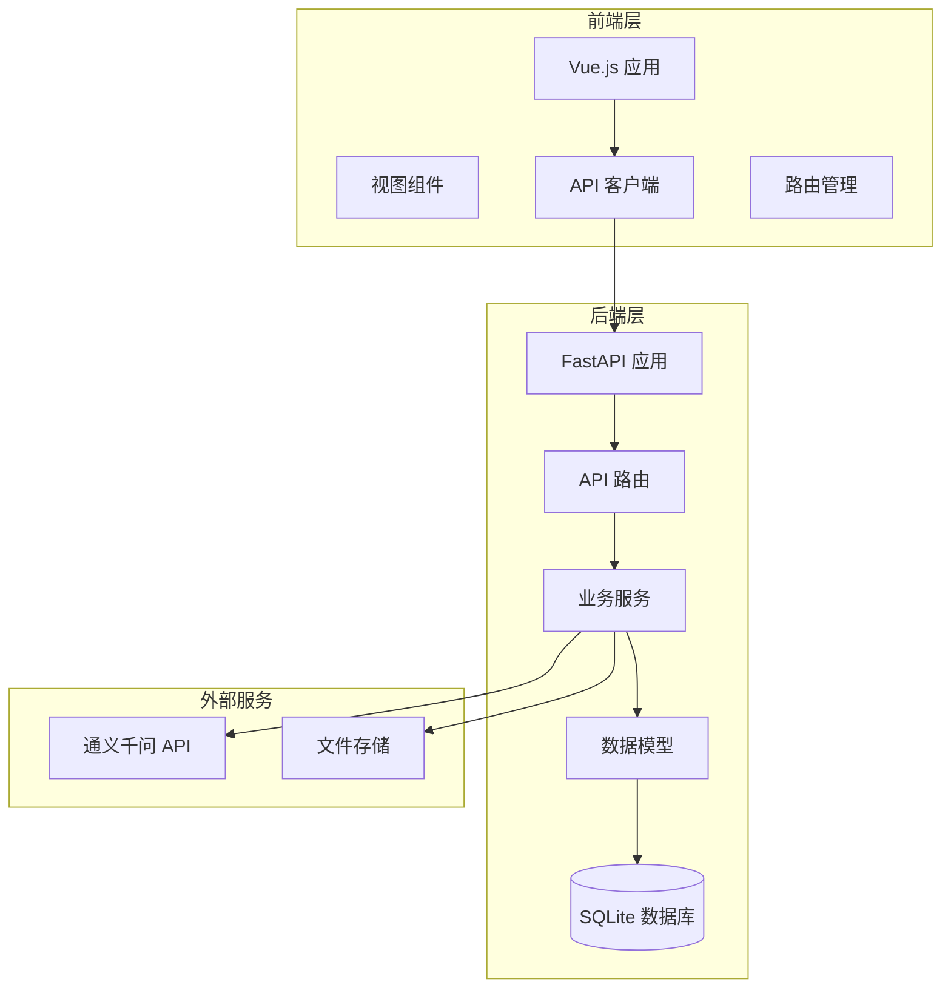

**图表来源**
- [main.py](file://backend/app/main.py#L1-L68)
- [ExplorerMapView.vue](file://frontend/src/views/ExplorerMapView.vue#L1-L425)

**章节来源**
- [main.py](file://backend/app/main.py#L1-L68)
- [config.py](file://backend/app/core/config.py#L1-L34)
- [database.py](file://backend/app/core/database.py#L1-L38)

## 核心组件

探索者地图视图由多个核心组件协同工作，形成完整的功能体系：

### 前端组件架构

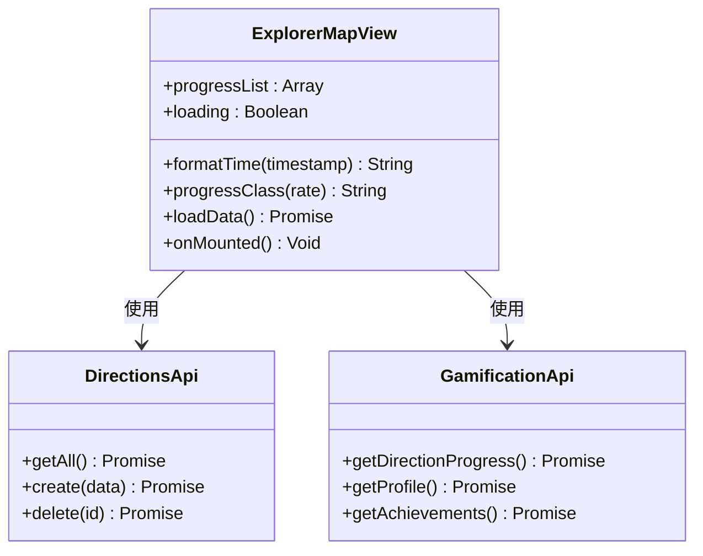

**图表来源**
- [ExplorerMapView.vue](file://frontend/src/views/ExplorerMapView.vue#L77-L141)
- [index.js](file://frontend/src/api/index.js#L11-L81)

### 后端服务架构

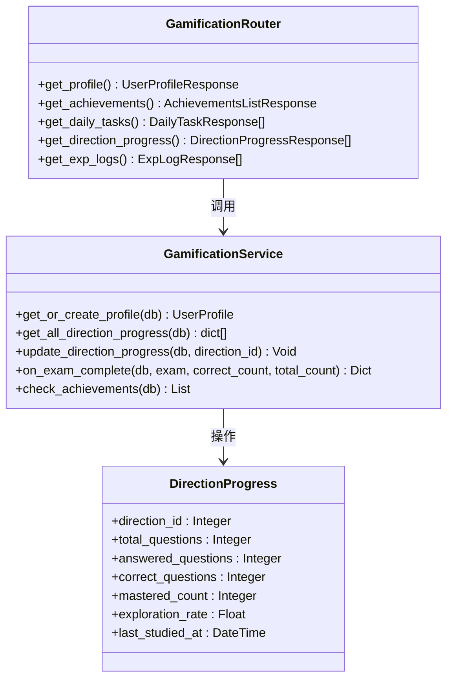

**图表来源**
- [gamification.py](file://backend/app/api/gamification.py#L1-L129)
- [gamification_service.py](file://backend/app/services/gamification_service.py#L1-L482)
- [models.py](file://backend/app/models/models.py#L300-L321)

**章节来源**
- [ExplorerMapView.vue](file://frontend/src/views/ExplorerMapView.vue#L1-L425)
- [gamification.py](file://backend/app/api/gamification.py#L1-L129)
- [gamification_service.py](file://backend/app/services/gamification_service.py#L1-L482)

## 架构概览

系统采用现代化的全栈架构，实现了高度解耦的设计模式：

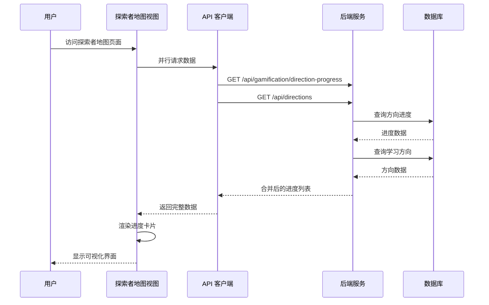

**图表来源**
- [ExplorerMapView.vue](file://frontend/src/views/ExplorerMapView.vue#L102-L140)
- [index.js](file://frontend/src/api/index.js#L72-L81)
- [gamification.py](file://backend/app/api/gamification.py#L106-L115)

### 数据流处理

系统的数据流经过精心设计，确保高效和可靠的数据传输：

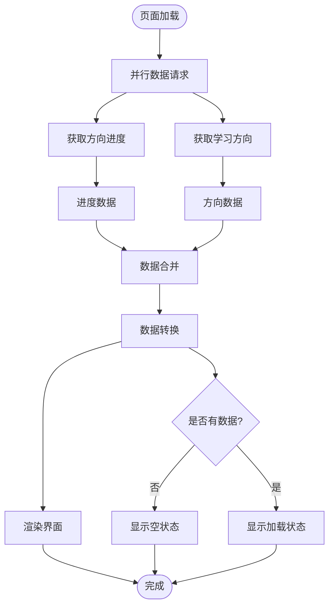

**图表来源**
- [ExplorerMapView.vue](file://frontend/src/views/ExplorerMapView.vue#L102-L138)

**章节来源**
- [ExplorerMapView.vue](file://frontend/src/views/ExplorerMapView.vue#L102-L140)
- [index.js](file://frontend/src/api/index.js#L72-L81)

## 详细组件分析

### 探索者地图视图组件

探索者地图视图是整个系统的核心UI组件，负责展示用户的学习进度和统计数据：

#### 视图结构设计

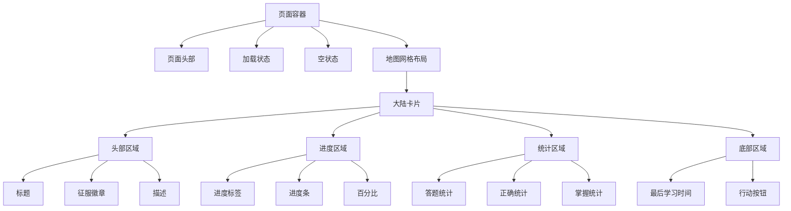

**图表来源**
- [ExplorerMapView.vue](file://frontend/src/views/ExplorerMapView.vue#L1-L75)

#### 数据绑定与状态管理

组件使用Vue 3的Composition API实现响应式数据绑定：

| 数据属性 | 类型 | 描述 | 默认值 |
|---------|------|------|--------|
| progressList | Array | 学习进度列表 | [] |
| loading | Boolean | 加载状态标志 | false |
| formatTime | Function | 时间格式化函数 | 内置函数 |
| progressClass | Function | 进度条样式分类 | 内置函数 |

#### 进度条样式系统

系统实现了动态进度条样式，根据探索进度提供视觉反馈：

| 进度范围 | 样式类 | 颜色主题 | 描述 |
|---------|--------|----------|------|
| 0-39% | fill-low | 蓝紫色渐变 | 初学者阶段 |
| 40-69% | fill-mid | 橙黄色渐变 | 中级阶段 |
| 70-99% | fill-high | 紫色渐变 | 高级阶段 |
| 100% | fill-complete | 绿色渐变 | 完成状态 |

**章节来源**
- [ExplorerMapView.vue](file://frontend/src/views/ExplorerMapView.vue#L77-L141)

### API集成层

前端通过统一的API客户端管理所有后端通信：

#### API客户端架构

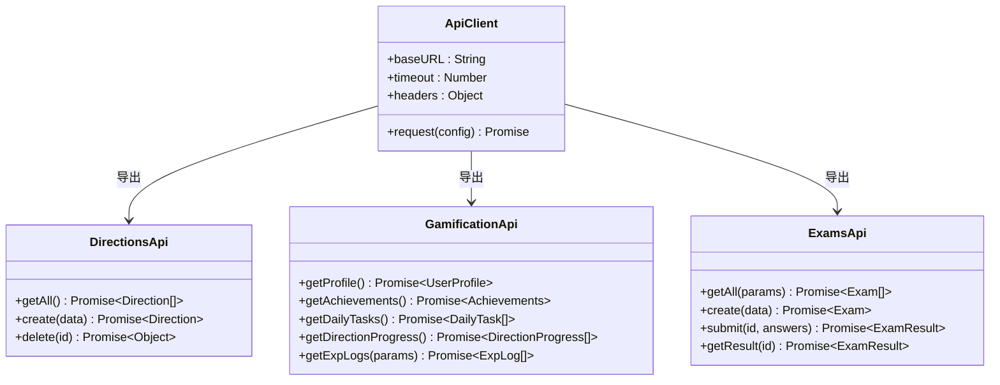

**图表来源**
- [index.js](file://frontend/src/api/index.js#L1-L84)

#### 并行数据加载策略

组件采用Promise.all实现并行数据加载，提升用户体验：

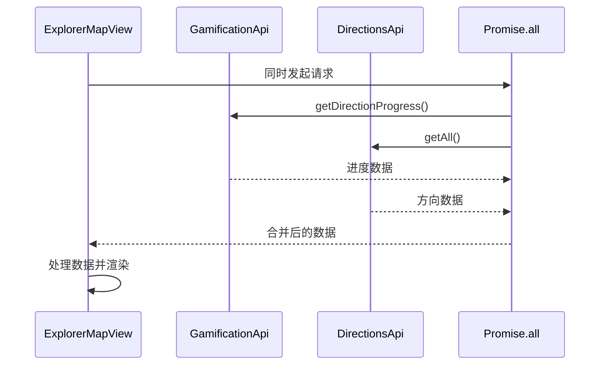

**图表来源**
- [ExplorerMapView.vue](file://frontend/src/views/ExplorerMapView.vue#L105-L108)

**章节来源**
- [index.js](file://frontend/src/api/index.js#L72-L81)
- [ExplorerMapView.vue](file://frontend/src/views/ExplorerMapView.vue#L102-L138)

### 后端服务层

后端服务层提供了完整的游戏化功能实现：

#### 游戏化服务架构

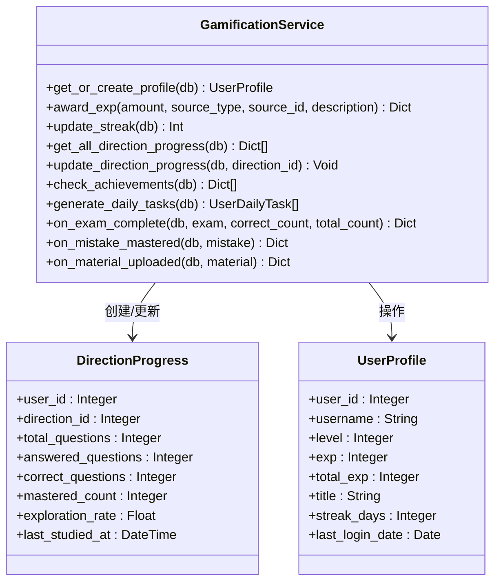

**图表来源**
- [gamification_service.py](file://backend/app/services/gamification_service.py#L1-L482)
- [models.py](file://backend/app/models/models.py#L238-L321)

#### 探索进度计算逻辑

系统实现了复杂的进度计算算法：

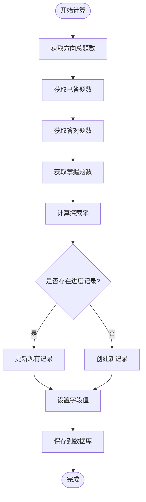

**图表来源**
- [gamification_service.py](file://backend/app/services/gamification_service.py#L296-L343)

**章节来源**
- [gamification_service.py](file://backend/app/services/gamification_service.py#L294-L384)
- [gamification.py](file://backend/app/api/gamification.py#L106-L115)

### 数据模型层

系统使用SQLAlchemy ORM实现数据持久化：

#### 核心数据模型

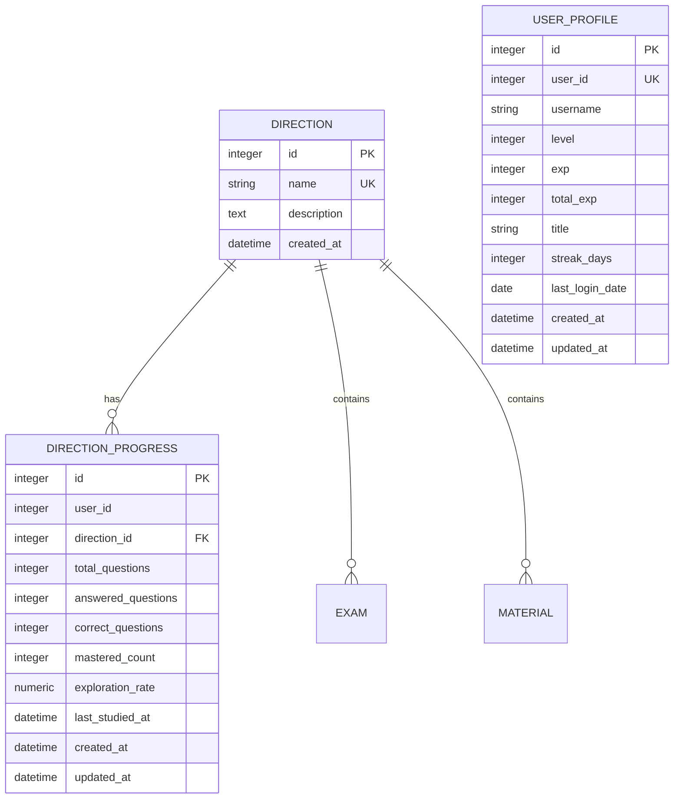

**图表来源**
- [models.py](file://backend/app/models/models.py#L63-L76)
- [models.py](file://backend/app/models/models.py#L300-L321)
- [models.py](file://backend/app/models/models.py#L238-L253)

**章节来源**
- [models.py](file://backend/app/models/models.py#L63-L321)
- [schemas.py](file://backend/app/schemas/schemas.py#L338-L350)

## 依赖关系分析

系统各组件之间的依赖关系清晰明确，遵循单一职责原则：

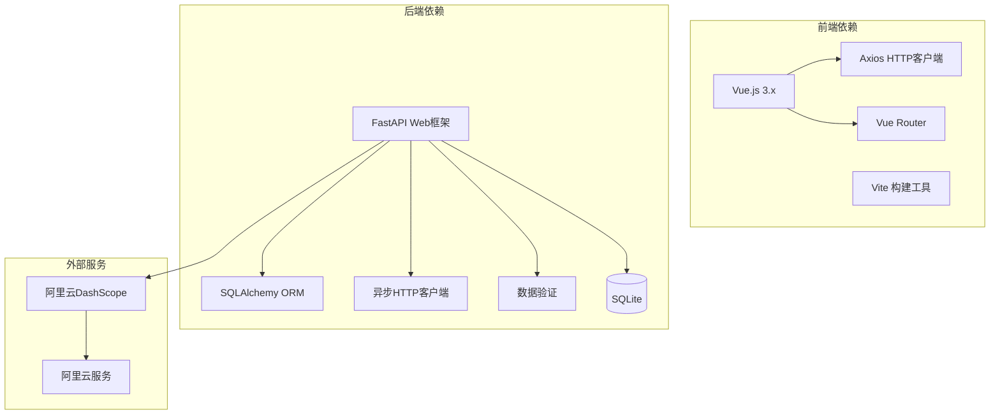

**图表来源**
- [main.py](file://backend/app/main.py#L1-L68)
- [config.py](file://backend/app/core/config.py#L16-L23)

### 外部API集成

系统集成了多个外部服务，增强功能完整性：

| 服务名称 | 用途 | 配置项 | 状态 |
|---------|------|--------|------|
| 通义千问 | AI知识提取 | qwen_api_key, qwen_model | 可选 |
| 阿里云DashScope | 通义千问API | qwen_base_url | 可选 |
| SQLite | 本地数据库 | database_url | 必需 |
| 文件存储 | 学习资料存储 | upload_dir | 必需 |

**章节来源**
- [config.py](file://backend/app/core/config.py#L16-L23)
- [database.py](file://backend/app/core/database.py#L1-L38)

## 性能考虑

系统在设计时充分考虑了性能优化：

### 前端性能优化

1. **懒加载策略**：使用Vue的动态导入实现组件懒加载
2. **并行请求**：使用Promise.all减少总等待时间
3. **虚拟滚动**：对于大量数据时可考虑实现虚拟滚动
4. **缓存机制**：合理利用浏览器缓存和组件缓存

### 后端性能优化

1. **数据库索引**：为常用查询字段建立索引
2. **查询优化**：使用JOIN和DISTINCT优化复杂查询
3. **连接池**：配置合适的数据库连接池参数
4. **异步处理**：AI处理等耗时操作使用异步模式

### 缓存策略

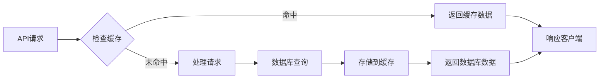

## 故障排除指南

### 常见问题及解决方案

#### 前端问题

1. **页面空白或加载失败**
   - 检查网络连接和API服务状态
   - 查看浏览器控制台错误信息
   - 确认CORS配置正确

2. **进度数据不显示**
   - 验证后端API是否正常运行
   - 检查数据库连接状态
   - 确认用户数据存在

#### 后端问题

1. **API响应超时**
   - 检查数据库性能和索引
   - 优化复杂查询语句
   - 调整超时配置

2. **AI服务调用失败**
   - 验证API密钥配置
   - 检查网络连接
   - 确认服务可用性

**章节来源**
- [ExplorerMapView.vue](file://frontend/src/views/ExplorerMapView.vue#L102-L138)
- [gamification_service.py](file://backend/app/services/gamification_service.py#L19-L38)

## 结论

探索者地图视图作为个人学习管理系统的核心功能，成功地将复杂的学习数据转化为直观的可视化界面。系统采用现代化的技术栈和架构设计，实现了良好的用户体验和可维护性。

### 主要优势

1. **直观的可视化设计**：通过进度卡片和颜色编码提供清晰的学习状态反馈
2. **响应式布局**：适配不同屏幕尺寸，提供一致的用户体验
3. **实时数据更新**：通过游戏化机制激励用户持续学习
4. **模块化架构**：前后端分离，职责明确，便于维护和扩展

### 技术亮点

- 使用Vue 3 Composition API实现响应式数据绑定
- 采用FastAPI提供高性能的RESTful API服务
- 实现了完整的游戏化系统，包括经验值、成就和每日任务
- 通过并行数据加载提升用户体验

### 未来改进方向

1. **移动端优化**：针对移动设备进行专门的UI优化
2. **离线支持**：实现部分功能的离线使用能力
3. **个性化推荐**：基于学习历史提供个性化的学习路径推荐
4. **多语言支持**：扩展国际化功能

该系统为个人学习管理提供了一个功能完整、用户体验优秀的解决方案，为后续的功能扩展奠定了坚实的基础。