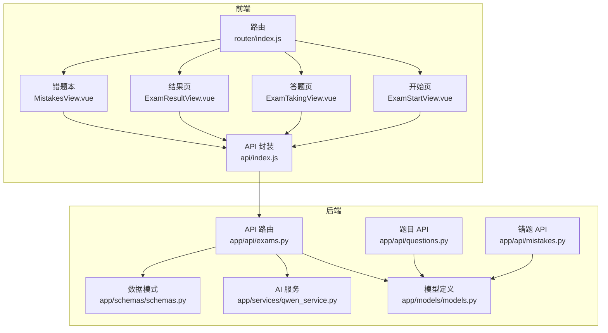
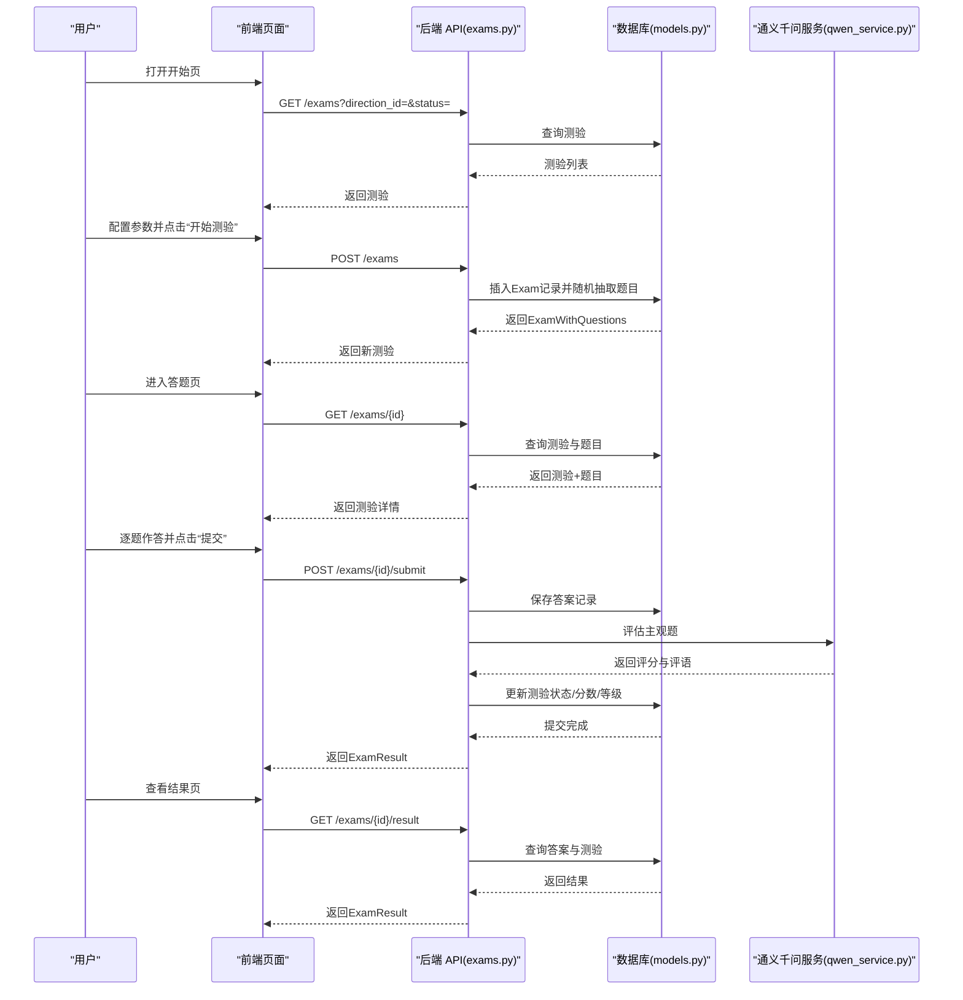
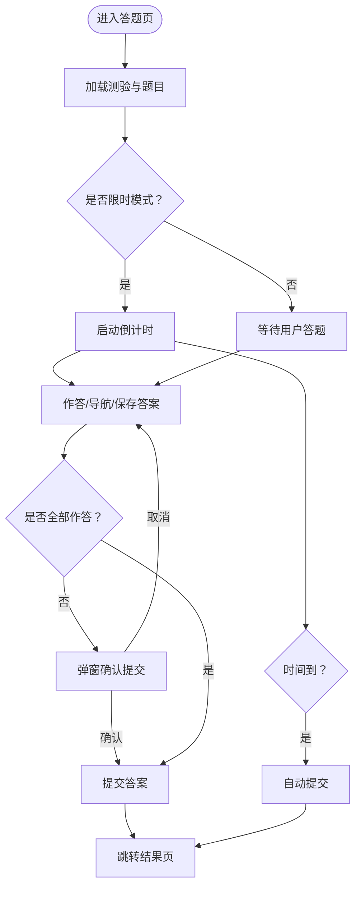
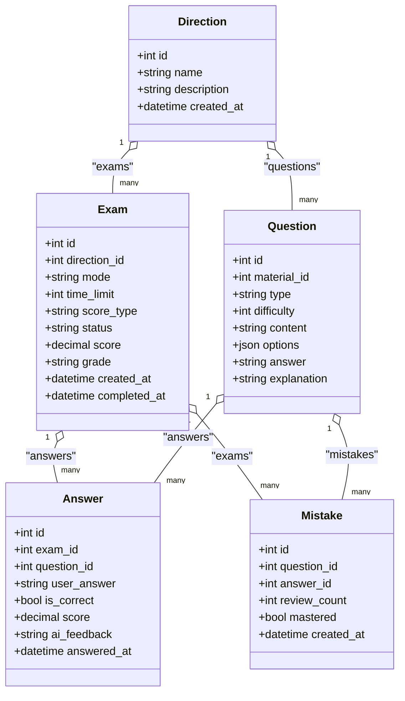
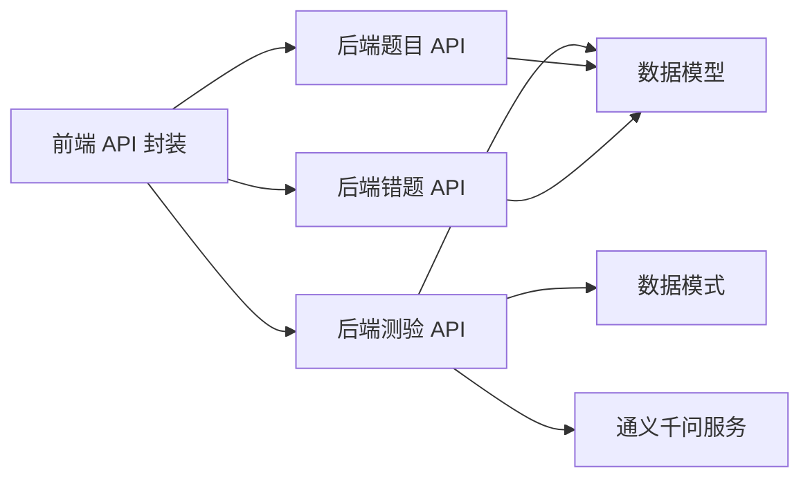

# 测验系统组件

<cite>
**本文引用的文件**
- [ExamStartView.vue](file://frontend/src/views/ExamStartView.vue)
- [ExamTakingView.vue](file://frontend/src/views/ExamTakingView.vue)
- [ExamResultView.vue](file://frontend/src/views/ExamResultView.vue)
- [MistakesView.vue](file://frontend/src/views/MistakesView.vue)
- [exams.py](file://backend/app/api/exams.py)
- [models.py](file://backend/app/models/models.py)
- [schemas.py](file://backend/app/schemas/schemas.py)
- [qwen_service.py](file://backend/app/services/qwen_service.py)
- [index.js](file://frontend/src/api/index.js)
- [index.js](file://frontend/src/router/index.js)
- [questions.py](file://backend/app/api/questions.py)
- [mistakes.py](file://backend/app/api/mistakes.py)
</cite>

## 目录
1. [简介](#简介)
2. [项目结构](#项目结构)
3. [核心组件](#核心组件)
4. [架构总览](#架构总览)
5. [详细组件分析](#详细组件分析)
6. [依赖关系分析](#依赖关系分析)
7. [性能与体验优化](#性能与体验优化)
8. [故障排查指南](#故障排查指南)
9. [结论](#结论)
10. [附录](#附录)

## 简介
本文件面向“测验系统组件”的完整使用与开发文档，覆盖从测验创建、答题到结果展示的全流程，重点说明：
- 开始页面的配置项：学习方向、测验模式（不限时/限时）、评分方式（百分制/等级制）、题目数量等
- 答题页面的实时交互：倒计时显示、题目导航、答案保存与提交
- 结果页面的数据呈现：得分统计、错题分析、AI评语与解析
- 测验状态管理：开始、进行中、完成状态切换
- 实时答题的性能优化与用户体验设计
- 测验历史记录、重复练习与错题本联动

## 项目结构
前端采用 Vue 3 + Vite，后端采用 FastAPI + SQLAlchemy；路由在前端统一管理，API 在后端按模块划分。

图表来源
- [index.js](file://frontend/src/router/index.js#L1-L47)
- [index.js](file://frontend/src/api/index.js#L1-L52)
- [exams.py](file://backend/app/api/exams.py#L1-L240)
- [models.py](file://backend/app/models/models.py#L1-L223)
- [schemas.py](file://backend/app/schemas/schemas.py#L1-L265)
- [qwen_service.py](file://backend/app/services/qwen_service.py#L1-L156)
- [questions.py](file://backend/app/api/questions.py#L1-L90)
- [mistakes.py](file://backend/app/api/mistakes.py#L1-L90)

章节来源
- [index.js](file://frontend/src/router/index.js#L1-L47)
- [index.js](file://frontend/src/api/index.js#L1-L52)

## 核心组件
- 开始页面（ExamStartView.vue）
  - 提供学习方向选择、测验模式（不限时/限时）、评分方式（百分制/等级制）、题目数量等配置
  - 支持历史测验展示与跳转
- 答题页面（ExamTakingView.vue）
  - 实时倒计时（限时模式）、进度条、题目导航、答案保存与提交
  - 支持单选/多选/判断/简答四种题型
- 结果页面（ExamResultView.vue）
  - 展示总分、等级、正确/错误数量、逐题对比与 AI 评语、解析
- 错题本（MistakesView.vue）
  - 过滤与标记“已掌握/未掌握”，查看答案与解析，记录复习次数

章节来源
- [ExamStartView.vue](file://frontend/src/views/ExamStartView.vue#L1-L395)
- [ExamTakingView.vue](file://frontend/src/views/ExamTakingView.vue#L1-L516)
- [ExamResultView.vue](file://frontend/src/views/ExamResultView.vue#L1-L442)
- [MistakesView.vue](file://frontend/src/views/MistakesView.vue#L1-L409)

## 架构总览
后端通过 FastAPI 提供测验生命周期的 REST 接口，前端通过 axios 封装的 API 发起请求，数据库模型由 SQLAlchemy 定义，主观题评分通过通义千问服务异步完成。

图表来源
- [exams.py](file://backend/app/api/exams.py#L29-L240)
- [models.py](file://backend/app/models/models.py#L116-L153)
- [qwen_service.py](file://backend/app/services/qwen_service.py#L115-L152)
- [index.js](file://frontend/src/api/index.js#L36-L42)

## 详细组件分析

### 开始页面（ExamStartView.vue）
- 配置项
  - 学习方向：从后端获取方向列表并绑定
  - 测验模式：不限时/限时（限时需设置时间限制）
  - 评分方式：百分制/等级制（A/B/C/D）
  - 题目数量：范围 5-50，默认 10
- 行为
  - 创建测验：向后端提交配置，成功后跳转至答题页
  - 历史测验：展示最近测验，支持继续答题或查看结果
- 交互细节
  - 仅当选择了方向时启用“开始测验”按钮
  - 加载失败时弹出提示

章节来源
- [ExamStartView.vue](file://frontend/src/views/ExamStartView.vue#L1-L156)
- [index.js](file://frontend/src/api/index.js#L36-L42)

### 答题页面（ExamTakingView.vue）
- 实时交互
  - 倒计时：限时模式下启动定时器，剩余时间小于等于 0 自动提交
  - 进度条：根据已答题数量动态计算百分比
  - 导航：底部圆点可快速跳转到任意题目
  - 答案保存：使用响应式对象 answers 按题目 ID 保存当前答案
- 题型支持
  - 单选/多选/判断：使用单选/复选框
  - 简答题：使用多行文本输入
- 提交逻辑
  - 若存在未答题，弹窗确认后才允许提交
  - 将答案序列化为后端期望格式并提交
  - 提交完成后跳转至结果页

图表来源
- [ExamTakingView.vue](file://frontend/src/views/ExamTakingView.vue#L160-L235)

章节来源
- [ExamTakingView.vue](file://frontend/src/views/ExamTakingView.vue#L1-L242)

### 结果页面（ExamResultView.vue）
- 数据展示
  - 总分/等级、总题数、正确/错误数量
  - 逐题对比：你的答案 vs 正确答案、AI 评语、解析
- 操作入口
  - 再来一次（回到开始页）、查看错题本、返回首页

章节来源
- [ExamResultView.vue](file://frontend/src/views/ExamResultView.vue#L1-L111)

### 错题本（MistakesView.vue）
- 功能
  - 过滤：按学习方向、掌握状态筛选
  - 操作：查看答案/解析、标记已掌握/未掌握、记录复习
- 数据来源
  - 通过后端错题 API 获取，并与题目详情关联

章节来源
- [MistakesView.vue](file://frontend/src/views/MistakesView.vue#L1-L150)
- [mistakes.py](file://backend/app/api/mistakes.py#L11-L31)

### 后端 API 与数据模型
- API 能力
  - 列表/详情/创建/提交/结果查询
  - 主观题评分通过通义千问服务异步完成
- 数据模型
  - Exam/Answer/Mistake/Question/Direction 等模型定义
  - 测验状态枚举：进行中/已完成
  - 评分方式枚举：百分制/等级制
  - 题型枚举：单选/多选/判断/简答

图表来源
- [models.py](file://backend/app/models/models.py#L116-L169)

章节来源
- [exams.py](file://backend/app/api/exams.py#L29-L240)
- [models.py](file://backend/app/models/models.py#L1-L223)
- [schemas.py](file://backend/app/schemas/schemas.py#L101-L169)

## 依赖关系分析
- 前端依赖
  - 路由：统一管理开始/答题/结果/错题本页面
  - API：封装 /exams、/questions、/mistakes 等接口
- 后端依赖
  - 数据模型：Exam/Answer/Mistake/Question/Direction
  - 评分服务：通义千问服务用于主观题评分
  - 数据模式：Pydantic 模型约束请求/响应结构

图表来源
- [index.js](file://frontend/src/api/index.js#L36-L49)
- [exams.py](file://backend/app/api/exams.py#L1-L240)
- [models.py](file://backend/app/models/models.py#L1-L223)
- [schemas.py](file://backend/app/schemas/schemas.py#L1-L265)
- [qwen_service.py](file://backend/app/services/qwen_service.py#L1-L156)
- [questions.py](file://backend/app/api/questions.py#L1-L90)
- [mistakes.py](file://backend/app/api/mistakes.py#L1-L90)

章节来源
- [index.js](file://frontend/src/api/index.js#L1-L52)
- [exams.py](file://backend/app/api/exams.py#L1-L240)

## 性能与体验优化
- 前端
  - 答题页使用响应式对象保存答案，避免频繁重渲染
  - 限时模式下使用定时器，时间到自动提交，减少用户误操作
  - 结果页按需加载题目详情，避免一次性请求过多数据
- 后端
  - 主观题评分通过异步服务完成，避免阻塞主线程
  - 题目抽取使用随机排序并限制数量，保证测验多样性
- 用户体验
  - 渐进式动画与高亮样式提升交互感知
  - 移动端适配良好，导航与按钮尺寸合理

章节来源
- [ExamTakingView.vue](file://frontend/src/views/ExamTakingView.vue#L184-L194)
- [ExamResultView.vue](file://frontend/src/views/ExamResultView.vue#L89-L110)
- [exams.py](file://backend/app/api/exams.py#L47-L87)
- [qwen_service.py](file://backend/app/services/qwen_service.py#L115-L152)

## 故障排查指南
- 开始页无法创建测验
  - 检查是否选择了学习方向
  - 查看网络请求返回的错误信息
- 答题页无法加载或提交失败
  - 确认测验 ID 是否有效
  - 检查后端日志与数据库连接
- 结果页为空或报“测验尚未完成”
  - 确认测验状态是否为已完成
  - 检查提交接口是否成功写入答案与评分
- 错题本无数据
  - 确认测验中是否有错误答案被记录
  - 使用过滤条件缩小范围定位问题

章节来源
- [ExamStartView.vue](file://frontend/src/views/ExamStartView.vue#L140-L151)
- [ExamTakingView.vue](file://frontend/src/views/ExamTakingView.vue#L160-L182)
- [exams.py](file://backend/app/api/exams.py#L127-L240)

## 结论
本测验系统以清晰的前后端职责划分实现了完整的测验生命周期：从配置与创建、实时答题、AI 评分与结果展示，到错题本与重复练习闭环。通过合理的状态管理、异步评分与前端性能优化，系统在易用性与扩展性上均具备良好基础。后续可在移动端体验、错题本智能推荐与学习建议等方面进一步增强。

## 附录
- API 一览（路径与用途）
  - GET /exams：获取测验列表（支持按方向/状态过滤）
  - POST /exams：创建测验（传入方向、模式、时间限制、评分方式、题目数量）
  - GET /exams/{id}：获取测验详情（含题目）
  - POST /exams/{id}/submit：提交答案并评分
  - GET /exams/{id}/result：获取测验结果
  - GET /questions：获取题目列表（支持按方向/类型过滤）
  - GET /mistakes：获取错题列表（支持按方向/掌握状态过滤）

章节来源
- [index.js](file://frontend/src/api/index.js#L36-L49)
- [exams.py](file://backend/app/api/exams.py#L29-L240)
- [questions.py](file://backend/app/api/questions.py#L11-L31)
- [mistakes.py](file://backend/app/api/mistakes.py#L11-L31)