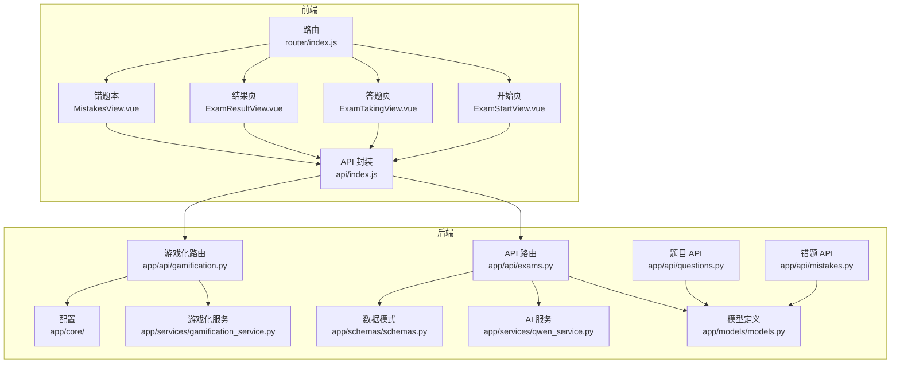
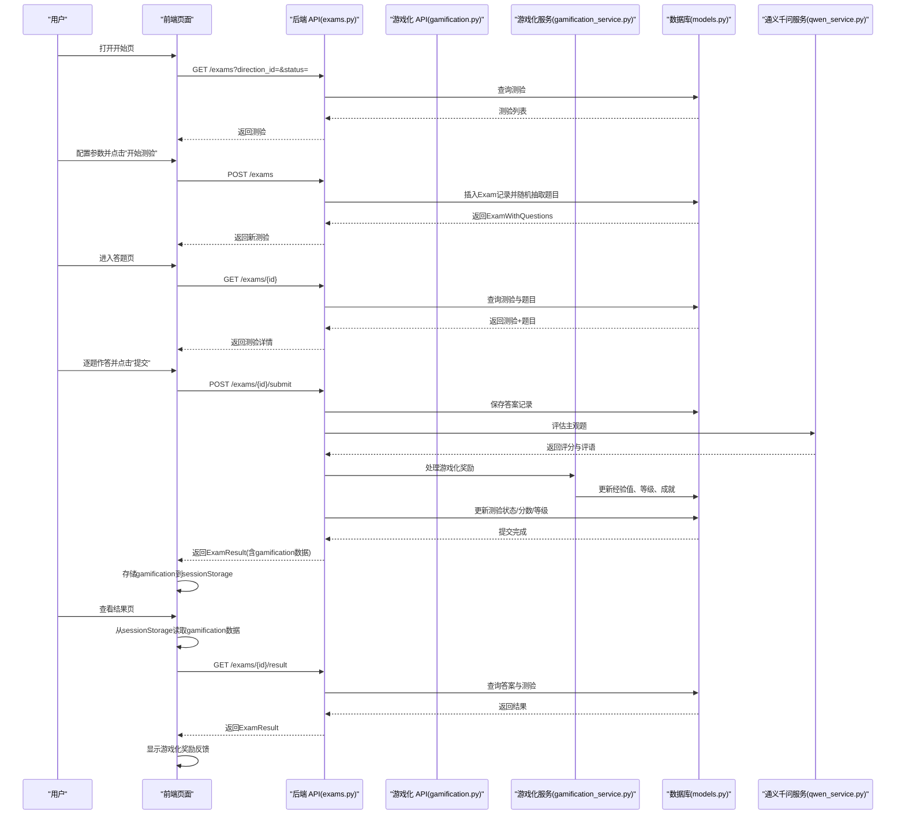
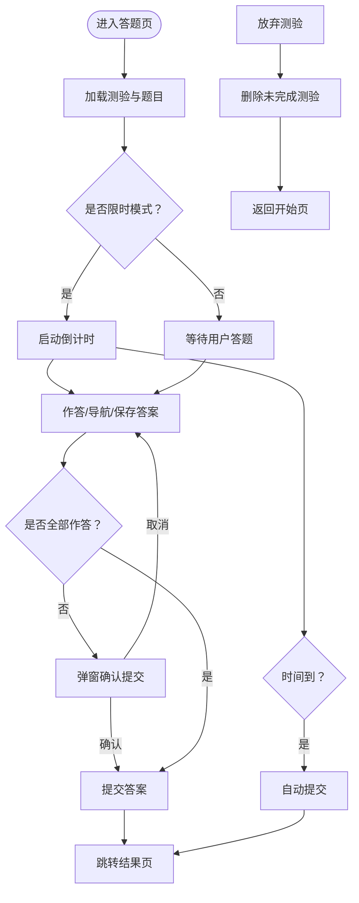
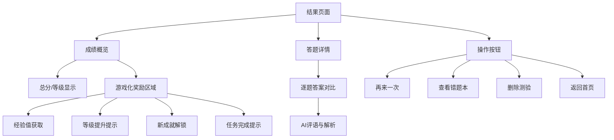
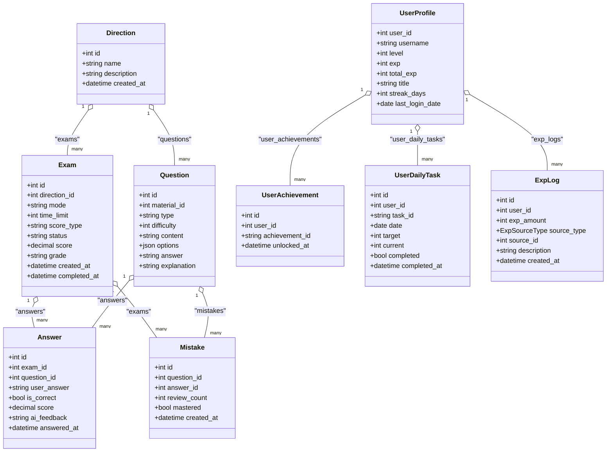
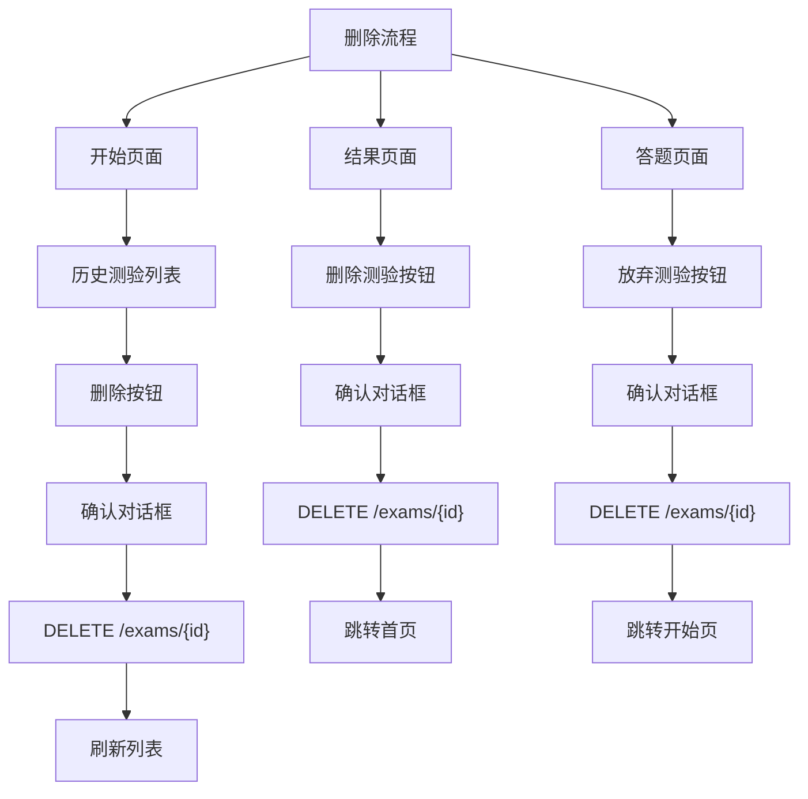
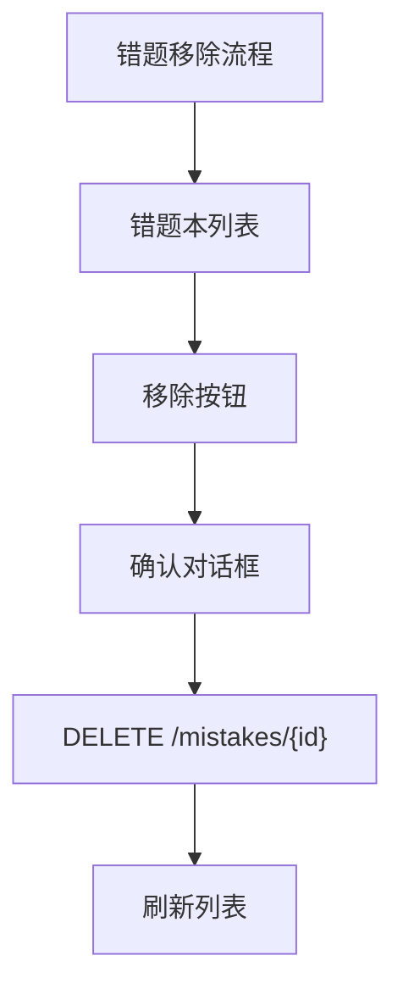
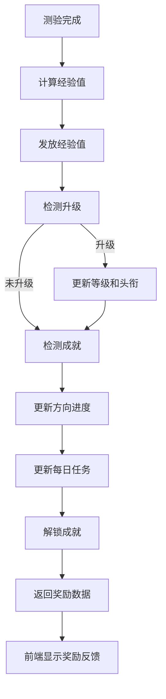
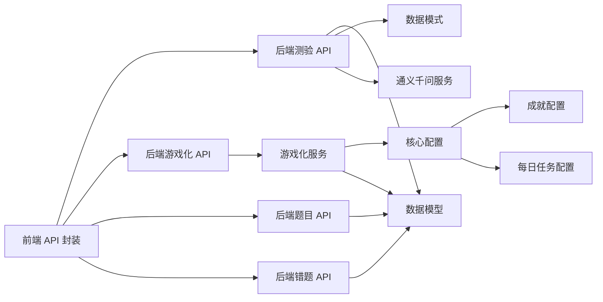

# 测验系统组件

<cite>
**本文引用的文件**
- [ExamStartView.vue](file://frontend/src/views/ExamStartView.vue)
- [ExamTakingView.vue](file://frontend/src/views/ExamTakingView.vue)
- [ExamResultView.vue](file://frontend/src/views/ExamResultView.vue)
- [MistakesView.vue](file://frontend/src/views/MistakesView.vue)
- [exams.py](file://backend/app/api/exams.py)
- [gamification.py](file://backend/app/api/gamification.py)
- [gamification_service.py](file://backend/app/services/gamification_service.py)
- [models.py](file://backend/app/models/models.py)
- [schemas.py](file://backend/app/schemas/schemas.py)
- [qwen_service.py](file://backend/app/services/qwen_service.py)
- [index.js](file://frontend/src/api/index.js)
- [index.js](file://frontend/src/router/index.js)
- [questions.py](file://backend/app/api/questions.py)
- [mistakes.py](file://backend/app/api/mistakes.py)
- [achievements.py](file://backend/app/core/achievements.py)
- [daily_tasks.py](file://backend/app/core/daily_tasks.py)
- [main.py](file://backend/app/main.py)
</cite>

## 更新摘要
**所做更改**
- 新增删除功能章节，详细说明测验删除、放弃测验和错题移除的完整流程
- 更新测验结果页面文档，增加删除测验按钮和相关功能实现
- 更新测验开始页面文档，增加历史测验删除功能
- 更新测验答题页面文档，增加放弃测验功能
- 更新错题本页面文档，增加移除错题功能
- 新增游戏化反馈功能章节，详细说明经验值获取、等级提升、成就解锁和任务完成机制
- 更新测验结果页面文档，增加gamification数据展示和奖励系统说明
- 新增成就殿堂页面功能介绍，包括成就分类、稀有度和解锁状态
- 更新后端API文档，增加游戏化相关接口说明
- 新增游戏化服务层架构图，展示测验完成后的奖励处理流程

## 目录
1. [简介](#简介)
2. [项目结构](#项目结构)
3. [核心组件](#核心组件)
4. [架构总览](#架构总览)
5. [详细组件分析](#详细组件分析)
6. [删除功能](#删除功能)
7. [游戏化反馈系统](#游戏化反馈系统)
8. [依赖关系分析](#依赖关系分析)
9. [性能与体验优化](#性能与体验优化)
10. [故障排查指南](#故障排查指南)
11. [结论](#结论)
12. [附录](#附录)

## 简介
本文件面向"测验系统组件"的完整使用与开发文档，覆盖从测验创建、答题到结果展示的全流程，重点说明：
- 开始页面的配置项：学习方向、测验模式（不限时/限时）、评分方式（百分制/等级制）、题目数量等
- 答题页面的实时交互：倒计时显示、题目导航、答案保存与提交
- 结果页面的数据呈现：得分统计、错题分析、AI评语与解析，以及新增的游戏化奖励反馈
- 删除功能：测验删除、放弃测验、错题移除的完整流程
- 测验状态管理：开始、进行中、完成状态切换
- 实时答题的性能优化与用户体验设计
- 测验历史记录、重复练习与错题本联动
- **新增**：游戏化反馈系统，包括经验值获取、等级提升、成就解锁和每日任务完成提示

## 项目结构
前端采用 Vue 3 + Vite，后端采用 FastAPI + SQLAlchemy；路由在前端统一管理，API 在后端按模块划分。新增游戏化系统通过独立的API路由提供经验值、成就和任务管理功能。

```mermaid
graph TB
subgraph "前端"
FE_Router["路由<br/>router/index.js"]
FE_API["API 封装<br/>api/index.js"]
FE_Start["开始页<br/>ExamStartView.vue"]
FE_Taking["答题页<br/>ExamTakingView.vue"]
FE_Result["结果页<br/>ExamResultView.vue"]
FE_Mistakes["错题本<br/>MistakesView.vue"]
end
subgraph "后端"
BE_Router["API 路由<br/>app/api/exams.py"]
BE_GamiRouter["游戏化路由<br/>app/api/gamification.py"]
BE_Qwen["AI 服务<br/>app/services/qwen_service.py"]
BE_DB["模型定义<br/>app/models/models.py"]
BE_Schema["数据模式<br/>app/schemas/schemas.py"]
BE_GamiService["游戏化服务<br/>app/services/gamification_service.py"]
BE_QAPI["题目 API<br/>app/api/questions.py"]
BE_MAPI["错题 API<br/>app/api/mistakes.py"]
BE_Core["配置<br/>app/core/"]
end
FE_Router --> FE_Start
FE_Router --> FE_Taking
FE_Router --> FE_Result
FE_Router --> FE_Mistakes
FE_Start --> FE_API
FE_Taking --> FE_API
FE_Result --> FE_API
FE_Mistakes --> FE_API
FE_API --> BE_Router
FE_API --> BE_GamiRouter
BE_Router --> BE_DB
BE_Router --> BE_Qwen
BE_Router --> BE_Schema
BE_GamiRouter --> BE_GamiService
BE_GamiRouter --> BE_Core
BE_QAPI --> BE_DB
BE_MAPI --> BE_DB
```

**图表来源**
- [index.js](file://frontend/src/router/index.js#L1-L47)
- [index.js](file://frontend/src/api/index.js#L1-L97)
- [exams.py](file://backend/app/api/exams.py#L1-L405)
- [gamification.py](file://backend/app/api/gamification.py#L1-L129)
- [gamification_service.py](file://backend/app/services/gamification_service.py#L1-L482)
- [main.py](file://backend/app/main.py#L10-L44)

**章节来源**
- [index.js](file://frontend/src/router/index.js#L1-L47)
- [index.js](file://frontend/src/api/index.js#L1-L97)
- [main.py](file://backend/app/main.py#L10-L44)

## 核心组件
- 开始页面（ExamStartView.vue）
  - 提供学习方向选择、测验模式（不限时/限时）、评分方式（百分制/等级制）、题目数量等配置
  - 支持历史测验展示与跳转，**新增**：支持删除历史测验记录
- 答题页面（ExamTakingView.vue）
  - 实时倒计时（限时模式）、进度条、题目导航、答案保存与提交
  - 支持单选/多选/判断/简答四种题型
  - **新增**：提供"放弃测验"功能，删除未完成的测验记录
- 结果页面（ExamResultView.vue）
  - 展示总分、等级、正确/错误数量、逐题对比与 AI 评语、解析
  - **新增**：提供"删除测验"功能，清理已完成的测验记录
  - **新增**：游戏化奖励反馈，包括经验值获取、等级提升提示、新成就解锁徽章和任务完成标签
- 错题本（MistakesView.vue）
  - 过滤与标记"已掌握/未掌握"，查看答案与解析，记录复习次数
  - **新增**：提供"移除"功能，从错题本中删除题目记录

**章节来源**
- [ExamStartView.vue](file://frontend/src/views/ExamStartView.vue#L1-L509)
- [ExamTakingView.vue](file://frontend/src/views/ExamTakingView.vue#L1-L528)
- [ExamResultView.vue](file://frontend/src/views/ExamResultView.vue#L1-L574)
- [MistakesView.vue](file://frontend/src/views/MistakesView.vue#L1-L460)

## 架构总览
后端通过 FastAPI 提供测验生命周期的 REST 接口，前端通过 axios 封装的 API 发起请求，数据库模型由 SQLAlchemy 定义，主观题评分通过通义千问服务异步完成。新增游戏化系统在测验完成后自动触发奖励处理，通过会话存储传递奖励数据到结果页面。

```mermaid
sequenceDiagram
participant U as "用户"
participant FE as "前端页面"
participant API as "后端 API(exams.py)"
participant GAPI as "游戏化 API(gamification.py)"
participant GS as "游戏化服务(gamification_service.py)"
participant DB as "数据库(models.py)"
participant QW as "通义千问服务(qwen_service.py)"
U->>FE : 打开开始页
FE->>API : GET /exams?direction_id=&status=
API->>DB : 查询测验
DB-->>API : 测验列表
API-->>FE : 返回测验
U->>FE : 配置参数并点击"开始测验"
FE->>API : POST /exams
API->>DB : 插入Exam记录并随机抽取题目
DB-->>API : 返回ExamWithQuestions
API-->>FE : 返回新测验
U->>FE : 进入答题页
FE->>API : GET /exams/{id}
API->>DB : 查询测验与题目
DB-->>API : 返回测验+题目
API-->>FE : 返回测验详情
U->>FE : 逐题作答并点击"提交"
FE->>API : POST /exams/{id}/submit
API->>DB : 保存答案记录
API->>QW : 评估主观题
QW-->>API : 返回评分与评语
API->>GS : 处理游戏化奖励
GS->>DB : 更新经验值、等级、成就
API->>DB : 更新测验状态/分数/等级
DB-->>API : 提交完成
API-->>FE : 返回ExamResult(含gamification数据)
FE->>FE : 存储gamification到sessionStorage
U->>FE : 查看结果页
FE->>FE : 从sessionStorage读取gamification数据
FE->>API : GET /exams/{id}/result
API->>DB : 查询答案与测验
DB-->>API : 返回结果
API-->>FE : 返回ExamResult
FE->>FE : 显示游戏化奖励反馈
```

**图表来源**
- [exams.py](file://backend/app/api/exams.py#L254-L273)
- [gamification_service.py](file://backend/app/services/gamification_service.py#L387-L428)
- [ExamResultView.vue](file://frontend/src/views/ExamResultView.vue#L116-L122)

**章节来源**
- [exams.py](file://backend/app/api/exams.py#L200-L405)
- [gamification_service.py](file://backend/app/services/gamification_service.py#L387-L482)
- [ExamResultView.vue](file://frontend/src/views/ExamResultView.vue#L100-L140)

## 详细组件分析

### 开始页面（ExamStartView.vue）
- 配置项
  - 学习方向：从后端获取方向列表并绑定
  - 测验模式：不限时/限时（限时需设置时间限制）
  - 评分方式：百分制/等级制（A/B/C/D）
  - 题目数量：范围 5-50，默认 10
- 行为
  - 创建测验：向后端提交配置，成功后跳转至答题页
  - 历史测验：展示最近测验，支持继续答题或查看结果
  - **新增**：删除历史测验记录，删除后刷新列表
- 交互细节
  - 仅当选择了方向时启用"开始测验"按钮
  - 加载失败时弹出提示

**章节来源**
- [ExamStartView.vue](file://frontend/src/views/ExamStartView.vue#L1-L211)
- [index.js](file://frontend/src/api/index.js#L48-L56)

### 答题页面（ExamTakingView.vue）
- 实时交互
  - 倒计时：限时模式下启动定时器，剩余时间小于等于 0 自动提交
  - 进度条：根据已答题数量动态计算百分比
  - 导航：底部圆点可快速跳转到任意题目
  - 答案保存：使用响应式对象 answers 按题目 ID 保存当前答案
- 题型支持
  - 单选/多选/判断：使用单选/复选框
  - 简答题：使用多行文本输入
- 提交逻辑
  - 若存在未答题，弹窗确认后才允许提交
  - 将答案序列化为后端期望格式并提交
  - 提交完成后跳转至结果页
- **新增**：放弃测验功能
  - 点击"放弃测验"按钮，弹窗确认后删除未完成的测验记录并返回开始页

```mermaid
flowchart TD
Start(["进入答题页"]) --> Load["加载测验与题目"]
Load --> Mode{"是否限时模式？"}
Mode --> |是| Timer["启动倒计时"]
Mode --> |否| Wait["等待用户答题"]
Timer --> Answer["作答/导航/保存答案"]
Wait --> Answer
Answer --> SubmitCheck{"是否全部作答？"}
SubmitCheck --> |否| Confirm["弹窗确认提交"]
Confirm --> |取消| Answer
Confirm --> |确认| Submit["提交答案"]
SubmitCheck --> |是| Submit
Submit --> Redirect["跳转结果页"]
Timer --> Timeout{"时间到？"}
Timeout --> |是| AutoSubmit["自动提交"]
AutoSubmit --> Redirect
Abandon["放弃测验"] --> Delete["删除未完成测验"]
Delete --> Back["返回开始页"]
```

**图表来源**
- [ExamTakingView.vue](file://frontend/src/views/ExamTakingView.vue#L244-L253)

**章节来源**
- [ExamTakingView.vue](file://frontend/src/views/ExamTakingView.vue#L1-L254)

### 结果页面（ExamResultView.vue）
- 数据展示
  - 总分/等级、总题数、正确/错误数量
  - 逐题对比：你的答案 vs 正确答案、AI 评语、解析
- **新增**：删除测验功能
  - 点击"删除测验"按钮，弹窗确认后删除已完成的测验记录并返回首页
- **新增**：游戏化奖励反馈
  - 经验值获取：显示本次测验获得的经验值数量
  - 等级提升：如果升级，显示从旧等级到新等级的变更和新头衔
  - 成就解锁：显示新解锁的成就徽章和名称
  - 任务完成：显示已完成的每日任务名称
- 操作入口
  - 再来一次（回到开始页）、查看错题本、返回首页

```mermaid
flowchart TD
ResultPage["结果页面"] --> Summary["成绩概览"]
Summary --> Score["总分/等级显示"]
Summary --> Gamification["游戏化奖励区域"]
Gamification --> EXP["经验值获取"]
Gamification --> LevelUp["等级提升提示"]
Gamification --> Achievements["新成就解锁"]
Gamification --> Tasks["任务完成提示"]
ResultPage --> Details["答题详情"]
Details --> Answers["逐题答案对比"]
Answers --> Feedback["AI评语与解析"]
ResultPage --> Actions["操作按钮"]
Actions --> Again["再来一次"]
Actions --> Mistakes["查看错题本"]
Actions --> Delete["删除测验"]
Actions --> Home["返回首页"]
```

**图表来源**
- [ExamResultView.vue](file://frontend/src/views/ExamResultView.vue#L94-L96)

**章节来源**
- [ExamResultView.vue](file://frontend/src/views/ExamResultView.vue#L1-L151)

### 错题本（MistakesView.vue）
- 功能
  - 过滤：按学习方向、掌握状态筛选
  - 操作：查看答案/解析、标记已掌握/未掌握、记录复习
  - **新增**：移除错题，从错题本中删除题目记录
- 数据来源
  - 通过后端错题 API 获取，并与题目详情关联

**章节来源**
- [MistakesView.vue](file://frontend/src/views/MistakesView.vue#L1-L177)
- [mistakes.py](file://backend/app/api/mistakes.py#L11-L110)

### 后端 API 与数据模型
- API 能力
  - 列表/详情/创建/提交/结果查询
  - **新增**：删除接口，支持删除测验记录和错题记录
  - 主观题评分通过通义千问服务异步完成
  - **新增**：游戏化API提供用户档案、成就列表、每日任务、方向进度和经验日志查询
- 数据模型
  - Exam/Answer/Mistake/Question/Direction 等模型定义
  - 测验状态枚举：进行中/已完成
  - 评分方式枚举：百分制/等级制
  - 题型枚举：单选/多选/判断/简答
  - **新增**：用户档案、成就、每日任务、经验日志等相关模型

```mermaid
classDiagram
class Exam {
+int id
+int direction_id
+string mode
+int time_limit
+string score_type
+string status
+decimal score
+string grade
+datetime created_at
+datetime completed_at
}
class Answer {
+int id
+int exam_id
+int question_id
+string user_answer
+bool is_correct
+decimal score
+string ai_feedback
+datetime answered_at
}
class Mistake {
+int id
+int question_id
+int answer_id
+int review_count
+bool mastered
+datetime created_at
}
class Question {
+int id
+int material_id
+string type
+int difficulty
+string content
+json options
+string answer
+string explanation
}
class Direction {
+int id
+string name
+string description
+datetime created_at
}
class UserProfile {
+int user_id
+string username
+int level
+int exp
+int total_exp
+string title
+int streak_days
+date last_login_date
}
class UserAchievement {
+int id
+int user_id
+string achievement_id
+datetime unlocked_at
}
class UserDailyTask {
+int id
+int user_id
+string task_id
+date date
+int target
+int current
+bool completed
+datetime completed_at
}
class ExpLog {
+int id
+int user_id
+int exp_amount
+ExpSourceType source_type
+int source_id
+string description
+datetime created_at
}
Exam "1" o-- "many" Answer : "answers"
Exam "1" o-- "many" Mistake : "exams"
Question "1" o-- "many" Answer : "answers"
Question "1" o-- "many" Mistake : "mistakes"
Direction "1" o-- "many" Exam : "exams"
Direction "1" o-- "many" Question : "questions"
UserProfile "1" o-- "many" UserAchievement : "user_achievements"
UserProfile "1" o-- "many" UserDailyTask : "user_daily_tasks"
UserProfile "1" o-- "many" ExpLog : "exp_logs"
```

**图表来源**
- [models.py](file://backend/app/models/models.py#L116-L169)
- [gamification_service.py](file://backend/app/services/gamification_service.py#L7-L11)

**章节来源**
- [exams.py](file://backend/app/api/exams.py#L29-L405)
- [gamification.py](file://backend/app/api/gamification.py#L1-L129)
- [models.py](file://backend/app/models/models.py#L1-L223)
- [schemas.py](file://backend/app/schemas/schemas.py#L101-L169)

## 删除功能

### 删除测验流程
- **开始页面删除历史测验**
  - 在历史测验列表中，每个测验卡片右侧提供"删除"按钮
  - 点击后弹出确认对话框，确认后调用 DELETE /exams/{id} 接口
  - 删除成功后自动刷新测验列表
- **结果页面删除已完成测验**
  - 在结果页面底部提供"删除测验"按钮
  - 点击后弹出确认对话框，确认后调用 DELETE /exams/{id} 接口
  - 删除成功后跳转到首页
- **答题页面放弃测验**
  - 在答题页面顶部提供"放弃测验"按钮
  - 点击后弹出确认对话框，确认后调用 DELETE /exams/{id} 接口
  - 删除成功后跳转到开始页

```mermaid
flowchart TD
DeleteFlow["删除流程"] --> StartPage["开始页面"]
StartPage --> History["历史测验列表"]
History --> DeleteBtn["删除按钮"]
DeleteBtn --> Confirm1["确认对话框"]
Confirm1 --> DeleteAPI1["DELETE /exams/{id}"]
DeleteAPI1 --> Refresh1["刷新列表"]
DeleteFlow --> ResultPage["结果页面"]
ResultPage --> DeleteBtn2["删除测验按钮"]
DeleteBtn2 --> Confirm2["确认对话框"]
Confirm2 --> DeleteAPI2["DELETE /exams/{id}"]
DeleteAPI2 --> Home["跳转首页"]
DeleteFlow --> TakingPage["答题页面"]
TakingPage --> AbandonBtn["放弃测验按钮"]
AbandonBtn --> Confirm3["确认对话框"]
Confirm3 --> DeleteAPI3["DELETE /exams/{id}"]
DeleteAPI3 --> Start["跳转开始页"]
```

**图表来源**
- [ExamStartView.vue](file://frontend/src/views/ExamStartView.vue#L198-L206)
- [ExamResultView.vue](file://frontend/src/views/ExamResultView.vue#L143-L151)
- [ExamTakingView.vue](file://frontend/src/views/ExamTakingView.vue#L244-L253)

### 删除错题流程
- **错题本移除功能**
  - 在错题本列表中，每个错题卡片右侧提供"移除"按钮
  - 点击后弹出确认对话框，确认后调用 DELETE /mistakes/{id} 接口
  - 删除成功后自动刷新错题列表

```mermaid
flowchart TD
MistakeDelete["错题移除流程"] --> MistakesList["错题本列表"]
MistakesList --> RemoveBtn["移除按钮"]
RemoveBtn --> Confirm["确认对话框"]
Confirm --> DeleteAPI["DELETE /mistakes/{id}"]
DeleteAPI --> Refresh["刷新列表"]
```

**图表来源**
- [MistakesView.vue](file://frontend/src/views/MistakesView.vue#L164-L172)

### 后端删除实现
- **测验删除**
  - DELETE /exams/{id} 接口会先删除关联的答题记录，再删除测验本身
  - 确保数据完整性，防止孤儿记录
- **错题删除**
  - DELETE /mistakes/{id} 接口直接删除错题记录
  - 不涉及其他关联数据的删除

**章节来源**
- [exams.py](file://backend/app/api/exams.py#L393-L405)
- [mistakes.py](file://backend/app/api/mistakes.py#L100-L110)

## 游戏化反馈系统

### 经验值系统
- **经验值计算规则**
  - 基础经验值：50分
  - 分数加成：根据测验分数计算，每1分获得0.5分经验值
  - 连续登录加成：根据连续学习天数计算，3天20分、7天50分、14天100分、30天200分
- **经验值用途**
  - 等级提升：累积经验值达到升级阈值时自动升级
  - 成就解锁：部分成就解锁时获得额外经验值奖励
  - 任务完成：每日任务完成后获得经验值奖励

### 等级与头衔系统
- **等级阈值**
  - 通过`LEVEL_THRESHOLDS`配置，每个等级需要累积的经验值阈值不同
  - 最大等级：`MAX_LEVEL`限制最高等级
- **头衔系统**
  - 根据等级自动分配头衔，如"见习探险家"、"初级学者"、"高级专家"等
  - 升级时显示从旧头衔到新头衔的变更

### 成就系统
- **成就分类**
  - 测验类：首次测验、测验大师、满分学霸等
  - 错题类：知错能改、错题猎人等
  - 资料类：知识收集者等
  - 探索类：多面手、全知之眼等
  - 连续学习类：七日修行、坚持不懈等
- **稀有度系统**
  - 普通（50经验）、稀有（100经验）、史诗（200经验）、传说（200经验）
- **解锁条件**
  - 基于用户统计数据自动检测，如测验次数、正确率、掌握错题数等

### 每日任务系统
- **任务池**
  - 包含多种任务类型：每日挑战、追求完美、错题复习、知识积累、题海战术
- **任务生成**
  - 每日从任务池中随机抽取固定数量的任务
  - 任务目标和经验值奖励各不相同
- **任务进度**
  - 自动跟踪用户完成进度，完成后自动发放经验值奖励

### 测验完成后的奖励处理
- **奖励流程**
  1. 计算经验值（基础+分数+连续登录加成）
  2. 检测是否升级，更新用户等级和头衔
  3. 更新方向探索进度
  4. 更新每日任务进度
  5. 检测成就解锁条件
  6. 返回奖励数据给前端
- **奖励数据结构**
  - `exp_gained`: 获得的经验值
  - `level_up`: 是否升级
  - `old_level/new_level`: 旧等级和新等级
  - `new_title`: 新头衔
  - `achievements_unlocked`: 新解锁成就列表
  - `tasks_completed`: 已完成任务列表

```mermaid
flowchart TD
ExamComplete["测验完成"] --> CalcEXP["计算经验值"]
CalcEXP --> AwardEXP["发放经验值"]
AwardEXP --> CheckLevel["检测升级"]
CheckLevel --> |升级| UpdateLevel["更新等级和头衔"]
CheckLevel --> |未升级| CheckAchieve["检测成就"]
UpdateLevel --> CheckAchieve
CheckAchieve --> UpdateProgress["更新方向进度"]
UpdateProgress --> UpdateDaily["更新每日任务"]
UpdateDaily --> UnlockAchieve["解锁成就"]
UnlockAchieve --> ReturnData["返回奖励数据"]
ReturnData --> Frontend["前端显示奖励反馈"]
```

**图表来源**
- [gamification_service.py](file://backend/app/services/gamification_service.py#L387-L428)
- [exams.py](file://backend/app/api/exams.py#L254-L273)

**章节来源**
- [gamification_service.py](file://backend/app/services/gamification_service.py#L40-L106)
- [gamification_service.py](file://backend/app/services/gamification_service.py#L182-L225)
- [gamification_service.py](file://backend/app/services/gamification_service.py#L229-L292)
- [gamification_service.py](file://backend/app/services/gamification_service.py#L387-L482)
- [exams.py](file://backend/app/api/exams.py#L254-L273)

## 依赖关系分析
- 前端依赖
  - 路由：统一管理开始/答题/结果/成就殿堂/错题本页面
  - API：封装 /exams、/questions、/mistakes、/gamification 等接口
  - **新增**：删除功能通过统一的API接口实现
- 后端依赖
  - 数据模型：Exam/Answer/Mistake/Question/Direction/UserProfile等
  - 评分服务：通义千问服务用于主观题评分
  - 数据模式：Pydantic 模型约束请求/响应结构
  - **新增**：游戏化服务层，提供经验值、等级、成就、每日任务管理
- **新增**：游戏化API依赖
  - 成就配置：ACHIEVEMENTS常量定义
  - 每日任务配置：DAILY_TASKS常量定义
  - 等级配置：level_config模块提供等级阈值和头衔映射

```mermaid
graph LR
FE_API["前端 API 封装"] --> BE_EXAMS["后端测验 API"]
FE_API --> BE_GAMIFICATION["后端游戏化 API"]
FE_API --> BE_QUESTIONS["后端题目 API"]
FE_API --> BE_MISTAKES["后端错题 API"]
BE_EXAMS --> BE_MODELS["数据模型"]
BE_EXAMS --> BE_SCHEMA["数据模式"]
BE_EXAMS --> BE_QWEN["通义千问服务"]
BE_GAMIFICATION --> BE_GAMISERVICE["游戏化服务"]
BE_GAMISERVICE --> BE_CORE["核心配置"]
BE_GAMISERVICE --> BE_MODELS
BE_QUESTIONS --> BE_MODELS
BE_MISTAKES --> BE_MODELS
BE_CORE --> BE_ACHIEVEMENTS["成就配置"]
BE_CORE --> BE_DAILYTASKS["每日任务配置"]
```

**图表来源**
- [index.js](file://frontend/src/api/index.js#L48-L97)
- [exams.py](file://backend/app/api/exams.py#L1-L405)
- [gamification.py](file://backend/app/api/gamification.py#L1-L129)
- [gamification_service.py](file://backend/app/services/gamification_service.py#L1-L482)
- [achievements.py](file://backend/app/core/achievements.py#L1-L121)
- [daily_tasks.py](file://backend/app/core/daily_tasks.py#L1-L53)

**章节来源**
- [index.js](file://frontend/src/api/index.js#L1-L97)
- [exams.py](file://backend/app/api/exams.py#L1-L405)
- [gamification.py](file://backend/app/api/gamification.py#L1-L129)

## 性能与体验优化
- 前端
  - 答题页使用响应式对象保存答案，避免频繁重渲染
  - 限时模式下使用定时器，时间到自动提交，减少用户误操作
  - 结果页按需加载题目详情，避免一次性请求过多数据
  - **新增**：游戏化数据通过sessionStorage传递，避免重复网络请求
  - **新增**：删除功能采用确认对话框，防止误操作
- 后端
  - 主观题评分通过异步服务完成，避免阻塞主线程
  - 题目抽取使用随机排序并限制数量，保证测验多样性
  - **新增**：删除操作采用级联删除，确保数据一致性
  - **新增**：游戏化处理异常不影响主流程，确保测验结果正常返回
- 用户体验
  - 渐进式动画与高亮样式提升交互感知
  - 移动端适配良好，导航与按钮尺寸合理
  - **新增**：删除功能提供明确的确认提示，增强用户控制感
  - **新增**：游戏化奖励反馈提供即时成就感，增强学习动力

**章节来源**
- [ExamTakingView.vue](file://frontend/src/views/ExamTakingView.vue#L244-L253)
- [ExamResultView.vue](file://frontend/src/views/ExamResultView.vue#L143-L151)
- [exams.py](file://backend/app/api/exams.py#L393-L405)
- [gamification_service.py](file://backend/app/services/gamification_service.py#L387-L428)

## 故障排查指南
- 开始页无法创建测验
  - 检查是否选择了学习方向
  - 查看网络请求返回的错误信息
- 答题页无法加载或提交失败
  - 确认测验 ID 是否有效
  - 检查后端日志与数据库连接
- 结果页为空或报"测验尚未完成"
  - 确认测验状态是否为已完成
  - 检查提交接口是否成功写入答案与评分
  - **新增**：检查sessionStorage中是否存在gamification数据
- **新增**：删除功能相关问题
  - 确认删除按钮是否正确绑定事件
  - 检查确认对话框是否正常显示
  - 验证后端DELETE接口是否正常工作
  - 查看浏览器控制台是否有JavaScript错误
- **新增**：游戏化功能相关问题
  - 检查游戏化API是否正常工作
  - 确认用户档案是否存在且正常
  - 验证成就解锁条件是否满足
  - 查看游戏化服务层的日志输出
- 错题本无数据
  - 确认测验中是否有错误答案被记录
  - 使用过滤条件缩小范围定位问题
  - **新增**：检查删除错题功能是否正常工作

**章节来源**
- [ExamStartView.vue](file://frontend/src/views/ExamStartView.vue#L198-L206)
- [ExamTakingView.vue](file://frontend/src/views/ExamTakingView.vue#L244-L253)
- [ExamResultView.vue](file://frontend/src/views/ExamResultView.vue#L143-L151)
- [exams.py](file://backend/app/api/exams.py#L393-L405)

## 结论
本测验系统以清晰的前后端职责划分实现了完整的测验生命周期：从配置与创建、实时答题、AI 评分与结果展示，到错题本与重复练习闭环。**新增的删除功能**进一步完善了系统的数据管理能力，包括测验删除、放弃测验和错题移除，为用户提供更好的学习体验。**新增的游戏化反馈系统**进一步增强了用户体验，通过经验值获取、等级提升、成就解锁和每日任务完成等机制，为学习过程提供持续的正向激励。系统在易用性与扩展性上均具备良好基础，后续可在移动端体验、错题本智能推荐与学习建议等方面进一步增强。

## 附录
- API 一览（路径与用途）
  - GET /exams：获取测验列表（支持按方向/状态过滤）
  - POST /exams：创建测验（传入方向、模式、时间限制、评分方式、题目数量）
  - GET /exams/{id}：获取测验详情（含题目）
  - POST /exams/{id}/submit：提交答案并评分
  - GET /exams/{id}/result：获取测验结果
  - **新增**：DELETE /exams/{id}：删除测验及其关联记录
  - GET /questions：获取题目列表（支持按方向/类型过滤）
  - GET /mistakes：获取错题列表（支持按方向/掌握状态过滤）
  - **新增**：DELETE /mistakes/{id}：删除错题记录
  - **新增**：GET /gamification/profile：获取用户游戏化档案
  - **新增**：GET /gamification/achievements：获取成就列表（已解锁+未解锁）
  - **新增**：GET /gamification/daily-tasks：获取今日任务列表
  - **新增**：GET /gamification/direction-progress：获取方向探索进度
  - **新增**：GET /gamification/exp-logs：获取经验获取日志

**章节来源**
- [index.js](file://frontend/src/api/index.js#L48-L97)
- [exams.py](file://backend/app/api/exams.py#L29-L405)
- [gamification.py](file://backend/app/api/gamification.py#L24-L129)
- [questions.py](file://backend/app/api/questions.py#L11-L31)
- [mistakes.py](file://backend/app/api/mistakes.py#L11-L110)