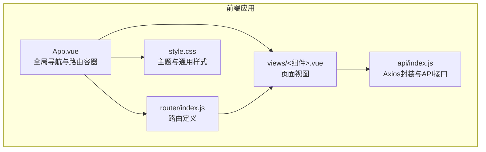
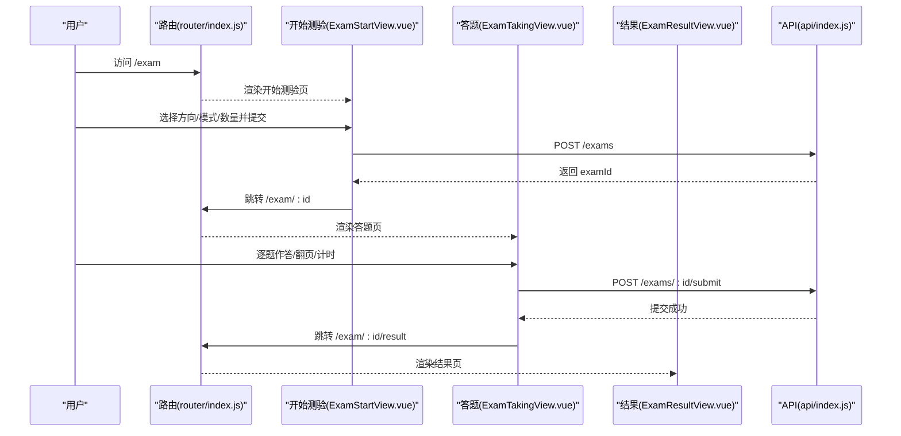
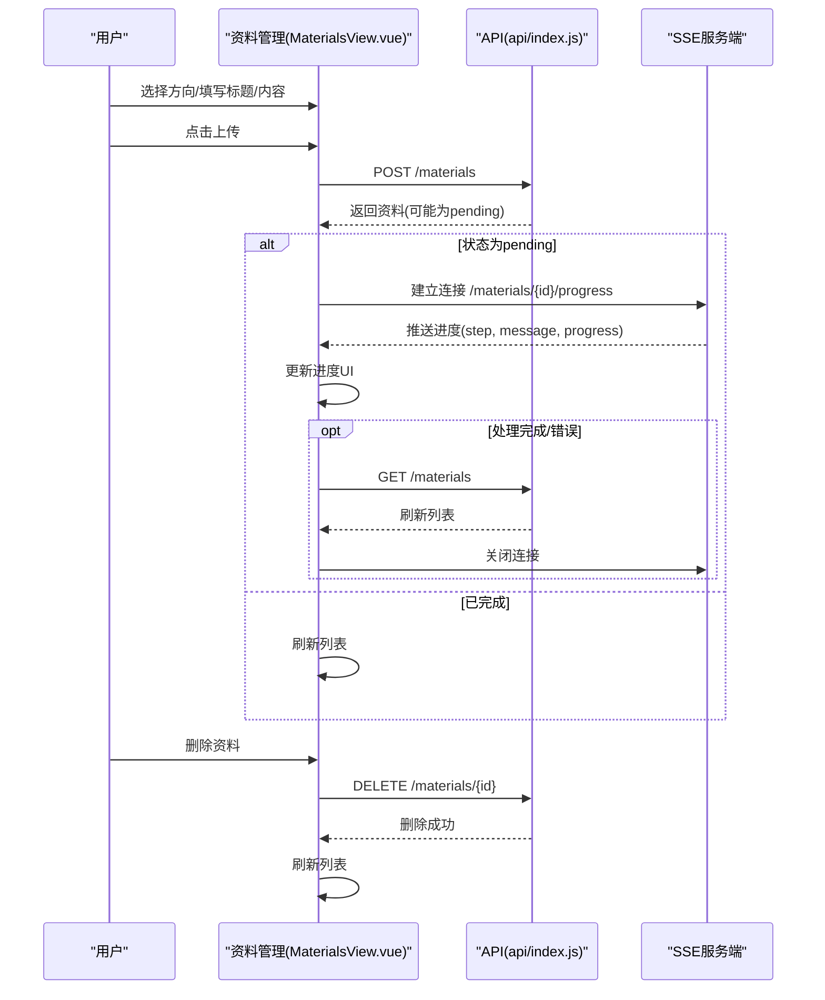
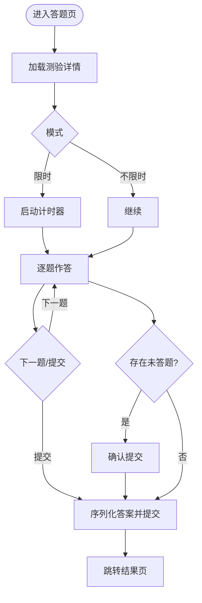
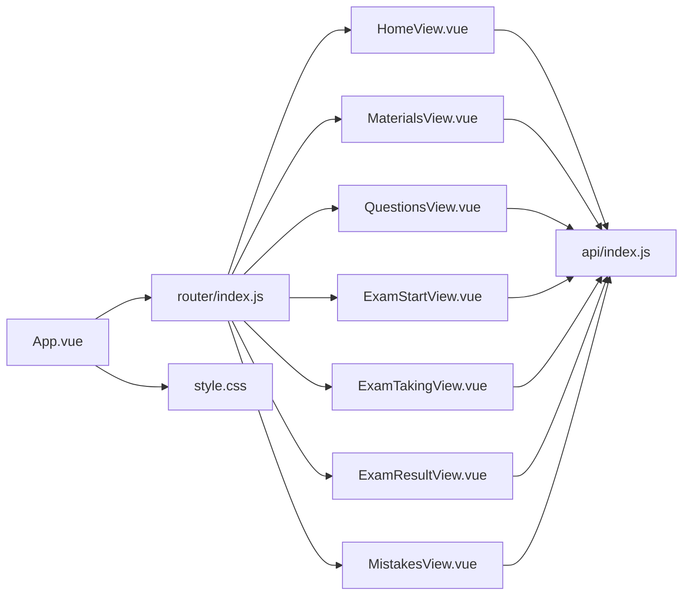

# 视图组件

<cite>
**本文档引用的文件**
- [App.vue](file://frontend/src/App.vue)
- [router/index.js](file://frontend/src/router/index.js)
- [api/index.js](file://frontend/src/api/index.js)
- [HomeView.vue](file://frontend/src/views/HomeView.vue)
- [MaterialsView.vue](file://frontend/src/views/MaterialsView.vue)
- [QuestionsView.vue](file://frontend/src/views/QuestionsView.vue)
- [ExamStartView.vue](file://frontend/src/views/ExamStartView.vue)
- [ExamTakingView.vue](file://frontend/src/views/ExamTakingView.vue)
- [ExamResultView.vue](file://frontend/src/views/ExamResultView.vue)
- [MistakesView.vue](file://frontend/src/views/MistakesView.vue)
- [style.css](file://frontend/src/style.css)
</cite>

## 目录
1. [简介](#简介)
2. [项目结构](#项目结构)
3. [核心组件](#核心组件)
4. [架构总览](#架构总览)
5. [详细组件分析](#详细组件分析)
6. [依赖关系分析](#依赖关系分析)
7. [性能考虑](#性能考虑)
8. [故障排查指南](#故障排查指南)
9. [结论](#结论)
10. [附录](#附录)

## 简介
本文件面向“个人学习管理系统”的前端视图组件，系统性梳理主页、资料管理、题目练习、测验系统（开始测验、答题界面、结果展示）、错题管理等页面组件的功能职责、数据流与交互逻辑。文档同时覆盖组件间的数据传递、事件通信与状态同步策略，并给出组件复用、错误处理与用户体验优化建议，帮助开发者与使用者快速理解与高效使用该系统。

## 项目结构
前端采用 Vue 3 单页应用架构，通过 Vue Router 实现页面级路由，通过 Axios 封装的 API 客户端与后端交互。组件按页面维度组织于 views 目录，公共样式集中于 style.css，全局导航与路由定义位于 App.vue 与 router/index.js。

图表来源
- [App.vue](file://frontend/src/App.vue#L1-L202)
- [router/index.js](file://frontend/src/router/index.js#L1-L47)
- [style.css](file://frontend/src/style.css#L1-L404)
- [api/index.js](file://frontend/src/api/index.js#L1-L52)

章节来源
- [App.vue](file://frontend/src/App.vue#L1-L202)
- [router/index.js](file://frontend/src/router/index.js#L1-L47)
- [style.css](file://frontend/src/style.css#L1-L404)
- [api/index.js](file://frontend/src/api/index.js#L1-L52)

## 核心组件
- 主页组件：负责学习方向概览、统计信息展示、快速入口与方向管理。
- 资料管理组件：支持资料上传（文本/文件）、实时处理进度、状态展示与删除。
- 题目管理组件：提供题目筛选、内容渲染、答案与解析展示、编辑与评价。
- 测验系统：开始测验（配置）、答题界面（交互与计时）、结果展示（得分与解析）。
- 错题管理组件：错题筛选、状态标记、答案与解析查看、复习记录。

章节来源
- [HomeView.vue](file://frontend/src/views/HomeView.vue#L1-L720)
- [MaterialsView.vue](file://frontend/src/views/MaterialsView.vue#L1-L881)
- [QuestionsView.vue](file://frontend/src/views/QuestionsView.vue#L1-L554)
- [ExamStartView.vue](file://frontend/src/views/ExamStartView.vue#L1-L395)
- [ExamTakingView.vue](file://frontend/src/views/ExamTakingView.vue#L1-L516)
- [ExamResultView.vue](file://frontend/src/views/ExamResultView.vue#L1-L442)
- [MistakesView.vue](file://frontend/src/views/MistakesView.vue#L1-L409)

## 架构总览
组件间通过以下方式进行数据与控制流协作：
- 路由驱动：通过路由参数在测验组件之间传递 examId。
- API 客户端：统一的 Axios 实例封装，提供方向、资料、题目、测验、错题等接口。
- 状态管理：组件内使用响应式 ref/computed/local state 管理本地状态；路由与全局样式提供跨页面体验一致性。

图表来源
- [router/index.js](file://frontend/src/router/index.js#L1-L47)
- [ExamStartView.vue](file://frontend/src/views/ExamStartView.vue#L1-L395)
- [ExamTakingView.vue](file://frontend/src/views/ExamTakingView.vue#L1-L516)
- [ExamResultView.vue](file://frontend/src/views/ExamResultView.vue#L1-L442)
- [api/index.js](file://frontend/src/api/index.js#L36-L42)

## 详细组件分析

### 主页组件（HomeView.vue）
- 布局设计
  - 英雄区：渐变背景、浮动几何图形、步骤引导与统计卡片。
  - 快速入口：三宫格卡片，直达资料上传、开始测验、错题本。
  - 学习方向：网格卡片展示方向列表，支持添加/删除，带资料数量占位。
- 数据展示逻辑
  - 加载学习方向列表与统计（资料数、题目数），并发请求提升体验。
  - 添加/删除方向：表单校验、确认对话、错误提示。
- 用户交互
  - 导航卡片悬停动画、模态框入场/出场过渡。
- 复用与优化
  - 使用过渡动画与骨架屏思路（加载状态）提升感知速度。
  - 统一的卡片样式与渐变主题，保证视觉一致性。

章节来源
- [HomeView.vue](file://frontend/src/views/HomeView.vue#L1-L720)
- [style.css](file://frontend/src/style.css#L113-L141)

### 资料管理组件（MaterialsView.vue）
- 功能要点
  - 方向筛选、资料列表、状态标签、核心知识点展示。
  - 上传资料：文本输入与 .md 文件上传两种模式，拖拽区域与预览。
  - 实时进度：SSE 连接监听处理进度，滚动定位到对应卡片。
  - 删除资料：二次确认与错误提示。
- 数据流与状态
  - 本地状态：方向列表、资料列表、输入表单、文件选择、SSE事件源集合。
  - 远程状态：通过 API 获取/创建/删除资料，根据状态决定是否开启进度监听。
- 用户体验
  - 文件大小格式化、预览渲染、禁用提交条件校验、API密钥缺失提示。
  - 进度条与消息提示，及时反馈处理阶段。
- 错误处理
  - 加载失败、上传失败、SSE异常均进行日志记录与用户提示。
  - 组件卸载时主动关闭 SSE 连接，避免内存泄漏。

图表来源
- [MaterialsView.vue](file://frontend/src/views/MaterialsView.vue#L301-L376)
- [api/index.js](file://frontend/src/api/index.js#L18-L24)

章节来源
- [MaterialsView.vue](file://frontend/src/views/MaterialsView.vue#L1-L881)
- [api/index.js](file://frontend/src/api/index.js#L18-L24)

### 题目管理组件（QuestionsView.vue）
- 功能要点
  - 多维筛选：方向、题型、资料。
  - 题目卡片：类型标签、难度、答案与解析展示。
  - 编辑弹窗：内容、选项、答案、解析、难度的批量编辑。
  - 评价：好题/待优化标记。
- 数据流与状态
  - 本地状态：方向列表、资料列表、筛选条件、编辑模型、加载状态。
  - 远程状态：通过 API 获取/更新/删除题目，评价接口单独调用。
- 用户交互
  - 响应式布局、卡片悬停高亮、标签颜色区分题型。
  - 编辑弹窗与表单校验，保存后刷新列表。
- 错误处理
  - 统一错误提示，避免阻断用户操作。

章节来源
- [QuestionsView.vue](file://frontend/src/views/QuestionsView.vue#L1-L554)
- [api/index.js](file://frontend/src/api/index.js#L26-L33)

### 测验系统
测验系统由三个组件协同完成：开始测验、答题界面、结果展示。

#### 开始测验（ExamStartView.vue）
- 功能要点
  - 选择学习方向、测验模式（不限时/限时）、评分方式（百分制/等级制）、题目数量。
  - 历史测验列表：状态（进行中/已完成）、分数/等级、跳转入口。
- 数据流与状态
  - 本地状态：方向列表、测验配置、历史测验列表。
  - 远程状态：创建测验返回 examId，跳转至答题页。
- 用户交互
  - 表单校验、禁用提交按钮、历史卡片悬停效果。
- 错误处理
  - 创建失败提示，保持页面可用。

章节来源
- [ExamStartView.vue](file://frontend/src/views/ExamStartView.vue#L1-L395)
- [api/index.js](file://frontend/src/api/index.js#L36-L42)

#### 答题界面（ExamTakingView.vue）
- 功能要点
  - 题目渲染：题型、难度、内容、选项（单选/多选/判断/简答）。
  - 交互：选项选择、简答输入、题目导航、进度条、计时器。
  - 提交：未答题提醒、答案序列化提交、路由跳转结果页。
- 数据流与状态
  - 本地状态：当前索引、答案映射、剩余时间、计时器、加载状态。
  - 远程状态：获取测验详情，提交答案。
- 用户体验
  - 计时器警示、导航圆点指示、进度可视化、移动端适配。
- 错误处理
  - 加载失败提示、倒计时自动提交、提交失败提示。

图表来源
- [ExamTakingView.vue](file://frontend/src/views/ExamTakingView.vue#L160-L235)

章节来源
- [ExamTakingView.vue](file://frontend/src/views/ExamTakingView.vue#L1-L516)
- [api/index.js](file://frontend/src/api/index.js#L36-L42)

#### 结果展示（ExamResultView.vue）
- 功能要点
  - 成绩概览：分数/等级、总题数、正确/错误统计。
  - 答题详情：每题对比、AI评语、解析。
  - 操作按钮：再来一次、查看错题本、返回首页。
- 数据流与状态
  - 本地状态：结果对象、题目映射、加载状态。
  - 远程状态：获取结果，拉取题目详情用于展示。
- 用户体验
  - 成绩卡片动画、答题详情卡片、响应式布局与图标增强可读性。

章节来源
- [ExamResultView.vue](file://frontend/src/views/ExamResultView.vue#L1-L442)
- [api/index.js](file://frontend/src/api/index.js#L36-L42)

### 错题管理组件（MistakesView.vue）
- 功能要点
  - 筛选：方向、掌握状态（未掌握/已掌握）。
  - 列表：错题卡片、复习次数、题型与难度、题目内容与选项。
  - 操作：查看答案/隐藏答案、标记掌握/未掌握、记录复习。
- 数据流与状态
  - 本地状态：方向列表、筛选条件、答案可见性映射、加载状态。
  - 远程状态：获取错题列表，更新掌握状态与复习记录。
- 用户体验
  - 答案展开动画、状态标签颜色、移动端操作按钮堆叠。
- 错误处理
  - 统一错误提示，避免影响列表浏览。

章节来源
- [MistakesView.vue](file://frontend/src/views/MistakesView.vue#L1-L409)
- [api/index.js](file://frontend/src/api/index.js#L44-L49)

## 依赖关系分析
- 组件与路由
  - App.vue 提供全局导航与路由容器，router/index.js 定义页面路由，各视图组件作为路由组件被动态导入。
- 组件与 API
  - 所有视图组件通过 api/index.js 的命名空间方法访问后端接口，统一错误处理与超时配置。
- 组件间通信
  - 路由参数：测验组件通过路由参数传递 examId，实现跨组件状态共享。
  - 全局样式：style.css 提供统一主题变量与通用组件样式，确保视觉一致性。

图表来源
- [App.vue](file://frontend/src/App.vue#L1-L202)
- [router/index.js](file://frontend/src/router/index.js#L1-L47)
- [api/index.js](file://frontend/src/api/index.js#L1-L52)
- [style.css](file://frontend/src/style.css#L1-L404)

章节来源
- [App.vue](file://frontend/src/App.vue#L1-L202)
- [router/index.js](file://frontend/src/router/index.js#L1-L47)
- [api/index.js](file://frontend/src/api/index.js#L1-L52)
- [style.css](file://frontend/src/style.css#L1-L404)

## 性能考虑
- 并发加载：主页并发获取方向与统计，减少首屏等待。
- 虚拟化与懒加载：长列表（资料/题目/错题）可通过虚拟滚动进一步优化（当前为简单列表渲染）。
- SSE 管理：组件卸载时关闭事件源，避免内存泄漏与重复连接。
- 图片与渲染：Markdown 预览与内容截断减少 DOM 负担。
- 路由过渡：全局路由切换动画提升感知流畅度。

## 故障排查指南
- 资料上传无进度
  - 检查后端 SSE 端点是否可达，确认资料状态为 pending。
  - 查看浏览器网络面板与控制台错误。
- API 密钥缺失
  - 资料管理组件检测到特定错误时显示警告，需配置后端环境变量。
- 测验提交失败
  - 确认答案序列化格式正确（多选题以逗号拼接），检查网络与后端接口状态。
- 错题状态不更新
  - 确认更新接口返回成功，刷新列表后观察状态变化。
- 页面空白或样式异常
  - 检查全局样式变量与主题色是否正确加载。

章节来源
- [MaterialsView.vue](file://frontend/src/views/MaterialsView.vue#L282-L299)
- [ExamTakingView.vue](file://frontend/src/views/ExamTakingView.vue#L208-L235)
- [MistakesView.vue](file://frontend/src/views/MistakesView.vue#L128-L144)

## 结论
该视图组件体系围绕“资料—题目—测验—错题”的学习闭环构建，通过清晰的路由与 API 抽象，实现了从资料上传到测验结果的完整链路。组件内部状态管理与外部 API 调用边界明确，配合统一的主题与交互规范，提供了良好的用户体验。建议后续在长列表场景引入虚拟滚动、完善离线缓存与错误重试策略，以进一步提升性能与稳定性。

## 附录
- 组件复用建议
  - 将卡片、表单、模态框、进度条等通用 UI 抽象为可复用组件，减少重复代码。
- 错误处理与提示
  - 统一的错误拦截层与用户提示组件，避免分散的 alert。
- 用户体验优化
  - 增加骨架屏、空状态插图、加载动画与无障碍支持。