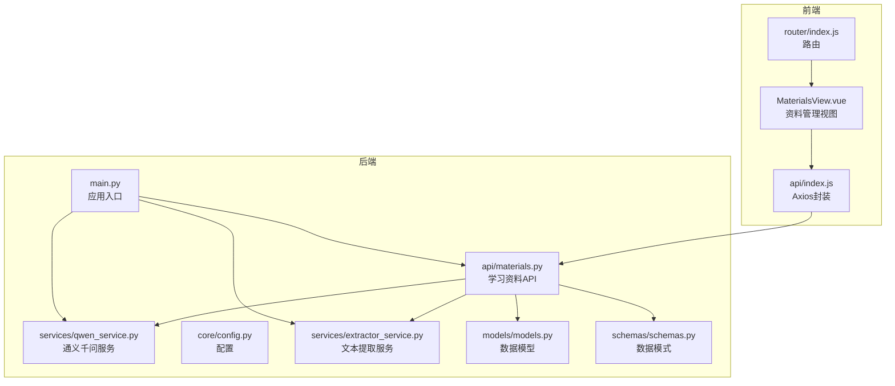
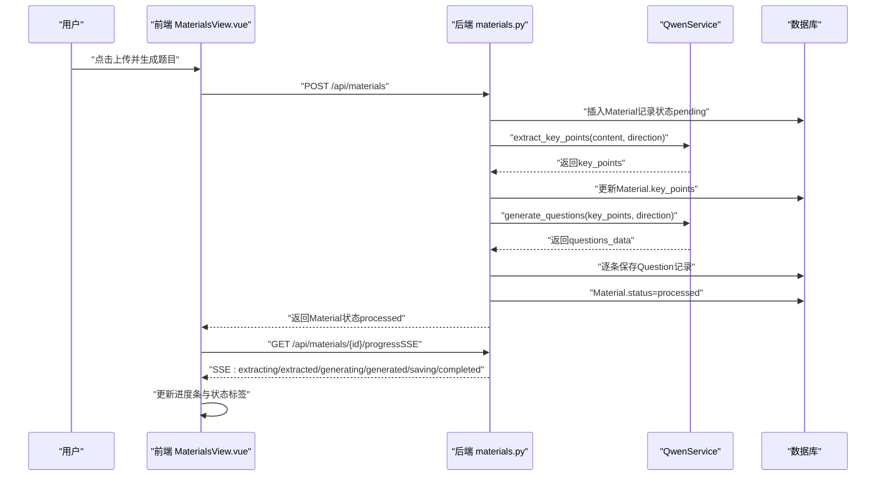
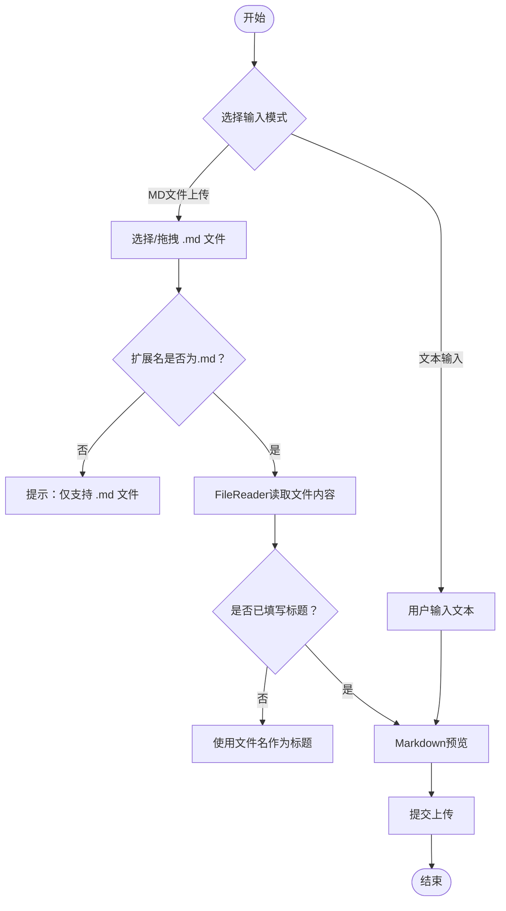
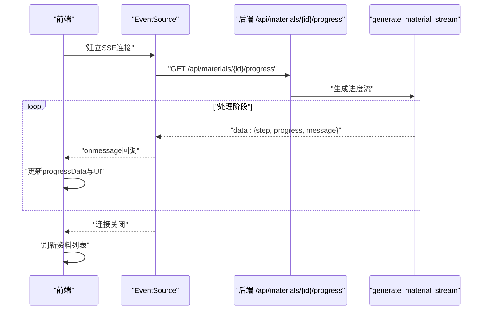
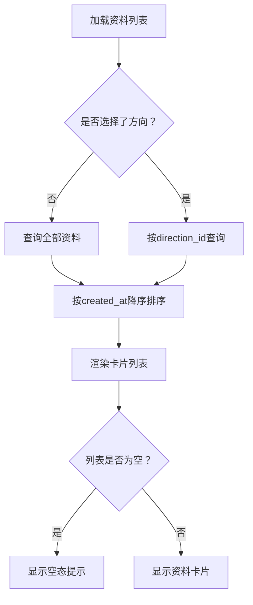
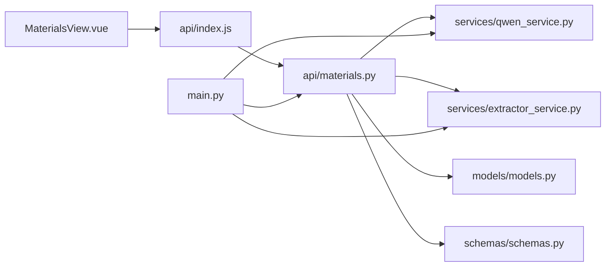

# 资料管理组件

<cite>
**本文档引用的文件**
- [frontend/src/views/MaterialsView.vue](file://frontend/src/views/MaterialsView.vue)
- [backend/app/api/materials.py](file://backend/app/api/materials.py)
- [backend/app/schemas/schemas.py](file://backend/app/schemas/schemas.py)
- [backend/app/models/models.py](file://backend/app/models/models.py)
- [frontend/src/api/index.js](file://frontend/src/api/index.js)
- [backend/app/services/qwen_service.py](file://backend/app/services/qwen_service.py)
- [backend/app/core/config.py](file://backend/app/core/config.py)
- [backend/app/services/extractor_service.py](file://backend/app/services/extractor_service.py)
- [backend/app/api/parse.py](file://backend/app/api/parse.py)
- [backend/app/services/parse_service.py](file://backend/app/services/parse_service.py)
- [backend/app/main.py](file://backend/app/main.py)
- [frontend/src/router/index.js](file://frontend/src/router/index.js)
</cite>

## 目录
1. [简介](#简介)
2. [项目结构](#项目结构)
3. [核心组件](#核心组件)
4. [架构总览](#架构总览)
5. [详细组件分析](#详细组件分析)
6. [依赖关系分析](#依赖关系分析)
7. [性能考虑](#性能考虑)
8. [故障排除指南](#故障排除指南)
9. [结论](#结论)

## 简介
本文件档详细说明“资料管理组件”的实现与使用，涵盖学习资料的上传、处理与管理全流程。重点包括：
- 文件上传组件：拖拽上传、文件类型验证、进度显示
- 资料处理状态的实时更新机制与SSE流式处理
- 资料列表渲染、数据过滤与排序
- 资料详情展示与操作按钮交互
- 资料删除与批量操作机制
- 文件格式支持、大小限制与安全验证
- 错误处理、重试机制与用户体验优化

## 项目结构
前端采用Vue 3 + Vite，后端采用FastAPI + SQLAlchemy；资料管理功能位于前端的“资料管理”视图与后端的“学习资料”API之间通过Axios进行通信。

图表来源
- [frontend/src/views/MaterialsView.vue](file://frontend/src/views/MaterialsView.vue#L1-L881)
- [frontend/src/api/index.js](file://frontend/src/api/index.js#L1-L52)
- [frontend/src/router/index.js](file://frontend/src/router/index.js#L1-L47)
- [backend/app/main.py](file://backend/app/main.py#L1-L66)
- [backend/app/api/materials.py](file://backend/app/api/materials.py#L1-L203)
- [backend/app/services/qwen_service.py](file://backend/app/services/qwen_service.py#L1-L156)
- [backend/app/core/config.py](file://backend/app/core/config.py#L1-L34)
- [backend/app/services/extractor_service.py](file://backend/app/services/extractor_service.py#L1-L123)
- [backend/app/models/models.py](file://backend/app/models/models.py#L1-L223)
- [backend/app/schemas/schemas.py](file://backend/app/schemas/schemas.py#L1-L265)

章节来源
- [frontend/src/views/MaterialsView.vue](file://frontend/src/views/MaterialsView.vue#L1-L881)
- [backend/app/api/materials.py](file://backend/app/api/materials.py#L1-L203)

## 核心组件
- 前端资料管理视图：负责UI渲染、用户交互、文件上传、SSE进度监听与错误提示。
- 后端学习资料API：提供资料列表查询、创建、删除与SSE进度流。
- 通义千问服务：负责知识点提炼与题目生成。
- 文本提取服务：负责从多种文件格式中提取纯文本内容。
- 数据模型与模式：定义资料、题目、方向等实体及序列化结构。
- Axios封装：统一的HTTP客户端，设置超时与基础路径。

章节来源
- [frontend/src/views/MaterialsView.vue](file://frontend/src/views/MaterialsView.vue#L160-L401)
- [backend/app/api/materials.py](file://backend/app/api/materials.py#L15-L203)
- [backend/app/services/qwen_service.py](file://backend/app/services/qwen_service.py#L1-L156)
- [backend/app/services/extractor_service.py](file://backend/app/services/extractor_service.py#L1-L123)
- [backend/app/models/models.py](file://backend/app/models/models.py#L78-L114)
- [backend/app/schemas/schemas.py](file://backend/app/schemas/schemas.py#L36-L58)
- [frontend/src/api/index.js](file://frontend/src/api/index.js#L1-L52)

## 架构总览
资料管理的端到端流程如下：
- 用户在前端界面选择学习方向、输入标题与内容，或拖拽上传.md文件
- 前端调用后端创建资料接口，后端立即开始处理（同步流程）
- 处理过程分为“提炼知识点”、“生成题目”、“保存题目”三个阶段，期间通过SSE流返回进度
- 前端接收SSE消息，实时更新进度条与状态标签
- 处理完成后，前端刷新列表并关闭SSE连接

图表来源
- [frontend/src/views/MaterialsView.vue](file://frontend/src/views/MaterialsView.vue#L301-L376)
- [backend/app/api/materials.py](file://backend/app/api/materials.py#L82-L161)
- [backend/app/services/qwen_service.py](file://backend/app/services/qwen_service.py#L37-L114)
- [backend/app/models/models.py](file://backend/app/models/models.py#L78-L114)

## 详细组件分析

### 文件上传组件与拖拽上传
- 输入方式：支持“文本输入”和“上传MD文件”两种模式，通过标签页切换
- MD文件上传：提供拖拽区域，支持拖拽与点击选择文件
- 文件类型验证：仅接受.md扩展名，读取失败时给出提示
- 文件大小限制：通过前端读取文件大小进行简单校验
- 内容预览：使用Markdown解析器将内容转为HTML进行预览
- 自动标题填充：当未填写标题时，自动使用文件名（去除.md后缀）

图表来源
- [frontend/src/views/MaterialsView.vue](file://frontend/src/views/MaterialsView.vue#L109-L154)
- [frontend/src/views/MaterialsView.vue](file://frontend/src/views/MaterialsView.vue#L235-L270)
- [frontend/src/views/MaterialsView.vue](file://frontend/src/views/MaterialsView.vue#L189-L192)

章节来源
- [frontend/src/views/MaterialsView.vue](file://frontend/src/views/MaterialsView.vue#L109-L154)
- [frontend/src/views/MaterialsView.vue](file://frontend/src/views/MaterialsView.vue#L235-L270)

### 资料处理状态与SSE流式处理
- 后端处理流程：提炼知识点（10%）、生成题目（50%）、保存题目（80%），最终完成（100%）
- SSE流：前端通过EventSource连接后端进度接口，接收JSON格式的进度消息
- 进度更新：前端解析消息，更新对应资料的进度条与状态标签
- 错误处理：若处理失败，状态标记为失败，前端关闭连接并刷新列表

图表来源
- [frontend/src/views/MaterialsView.vue](file://frontend/src/views/MaterialsView.vue#L342-L376)
- [backend/app/api/materials.py](file://backend/app/api/materials.py#L164-L185)
- [backend/app/api/materials.py](file://backend/app/api/materials.py#L27-L80)

章节来源
- [frontend/src/views/MaterialsView.vue](file://frontend/src/views/MaterialsView.vue#L342-L376)
- [backend/app/api/materials.py](file://backend/app/api/materials.py#L164-L185)

### 资料列表渲染、过滤与排序
- 列表渲染：卡片式布局，展示标题、状态标签、内容预览、核心知识点、创建时间与删除按钮
- 状态映射：pending/processed/failed分别映射为不同颜色标签
- 过滤：通过学习方向下拉框按方向过滤资料
- 排序：按创建时间降序排列
- 加载与空态：加载中显示加载动画，空列表显示提示文案

图表来源
- [frontend/src/views/MaterialsView.vue](file://frontend/src/views/MaterialsView.vue#L22-L69)
- [frontend/src/views/MaterialsView.vue](file://frontend/src/views/MaterialsView.vue#L282-L299)
- [backend/app/api/materials.py](file://backend/app/api/materials.py#L15-L24)

章节来源
- [frontend/src/views/MaterialsView.vue](file://frontend/src/views/MaterialsView.vue#L22-L69)
- [frontend/src/views/MaterialsView.vue](file://frontend/src/views/MaterialsView.vue#L282-L299)
- [backend/app/api/materials.py](file://backend/app/api/materials.py#L15-L24)

### 资料详情展示与操作按钮交互
- 详情展示：标题、状态标签、内容预览（截断并Markdown渲染）、核心知识点标签云、创建时间
- 操作按钮：删除按钮，点击确认后调用删除接口并刷新列表
- 交互优化：滚动到新增资料位置，平滑过渡动画

章节来源
- [frontend/src/views/MaterialsView.vue](file://frontend/src/views/MaterialsView.vue#L34-L68)
- [frontend/src/views/MaterialsView.vue](file://frontend/src/views/MaterialsView.vue#L378-L388)

### 资料删除与批量操作
- 单个删除：调用删除接口，级联删除相关题目，成功后刷新列表
- 批量操作：当前实现为单选删除，可扩展为多选复选框与批量删除按钮
- 安全提示：删除前弹出确认对话框

章节来源
- [frontend/src/views/MaterialsView.vue](file://frontend/src/views/MaterialsView.vue#L378-L388)
- [backend/app/api/materials.py](file://backend/app/api/materials.py#L188-L203)

### 文件格式支持、大小限制与安全验证
- 支持格式：.md（当前资料上传）、.pdf、.docx、.txt（用于知识解析）
- 大小限制：默认10MB，超出时报错
- 安全验证：后端校验扩展名与文件大小，前端读取文件大小进行提示
- 编码兼容：文本提取服务尝试多种编码读取文件内容

章节来源
- [frontend/src/views/MaterialsView.vue](file://frontend/src/views/MaterialsView.vue#L121)
- [backend/app/services/extractor_service.py](file://backend/app/services/extractor_service.py#L16-L55)
- [backend/app/core/config.py](file://backend/app/core/config.py#L22-L23)

### 错误处理、重试机制与用户体验优化
- 前端错误处理：加载失败、上传失败、删除失败均弹出提示；API密钥缺失时显示警告
- SSE错误处理：连接错误时关闭连接并延迟刷新列表
- 重试机制：SSE连接断开后自动刷新，确保最终状态一致
- 用户体验：加载动画、空态提示、进度条、平滑滚动、Markdown预览、拖拽高亮

章节来源
- [frontend/src/views/MaterialsView.vue](file://frontend/src/views/MaterialsView.vue#L282-L299)
- [frontend/src/views/MaterialsView.vue](file://frontend/src/views/MaterialsView.vue#L326-L339)
- [frontend/src/views/MaterialsView.vue](file://frontend/src/views/MaterialsView.vue#L367-L372)

## 依赖关系分析

图表来源
- [frontend/src/views/MaterialsView.vue](file://frontend/src/views/MaterialsView.vue#L160-L164)
- [frontend/src/api/index.js](file://frontend/src/api/index.js#L18-L24)
- [backend/app/api/materials.py](file://backend/app/api/materials.py#L1-L12)
- [backend/app/services/qwen_service.py](file://backend/app/services/qwen_service.py#L1-L10)
- [backend/app/services/extractor_service.py](file://backend/app/services/extractor_service.py#L1-L14)
- [backend/app/models/models.py](file://backend/app/models/models.py#L1-L6)
- [backend/app/schemas/schemas.py](file://backend/app/schemas/schemas.py#L1-L12)
- [backend/app/main.py](file://backend/app/main.py#L7-L42)

章节来源
- [frontend/src/views/MaterialsView.vue](file://frontend/src/views/MaterialsView.vue#L160-L164)
- [backend/app/api/materials.py](file://backend/app/api/materials.py#L1-L12)

## 性能考虑
- SSE流式传输：避免一次性长耗时请求，提升交互流畅性
- 前端懒加载：资料卡片使用渐显动画，减少首屏压力
- 数据库查询：按方向过滤与按时间倒序，保证列表加载效率
- AI处理时间：后端接口超时设置为3分钟，适配大模型调用

## 故障排除指南
- API密钥未配置：后端返回500错误，前端检测到包含“API密钥”关键词时显示警告
- 文件格式不支持：前端限制.md，后端对上传文件扩展名进行二次校验
- 文件过大：前端读取文件大小，后端对字节数进行校验
- SSE连接失败：前端捕获错误并关闭连接，随后刷新列表
- 删除失败：确认资料存在且无权限问题，查看后端日志定位异常

章节来源
- [frontend/src/views/MaterialsView.vue](file://frontend/src/views/MaterialsView.vue#L287-L294)
- [frontend/src/views/MaterialsView.vue](file://frontend/src/views/MaterialsView.vue#L367-L372)
- [backend/app/api/materials.py](file://backend/app/api/materials.py#L94-L96)
- [backend/app/services/extractor_service.py](file://backend/app/services/extractor_service.py#L35-L36)

## 结论
资料管理组件通过前后端协同，实现了从文件上传、AI处理到进度展示与资料管理的完整闭环。前端提供直观的拖拽上传与SSE进度反馈，后端以模块化服务支撑知识点提炼与题目生成。建议后续增强批量操作、分页加载与更细粒度的错误提示，进一步提升用户体验与系统稳定性。