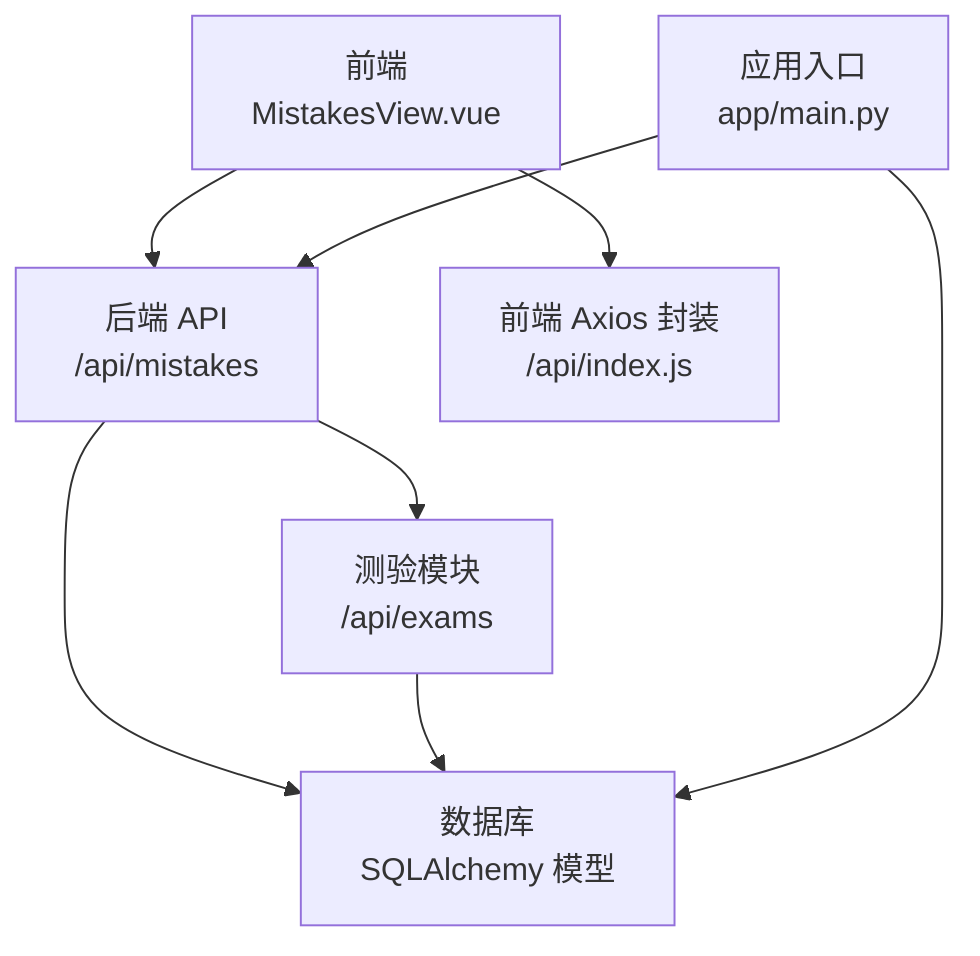
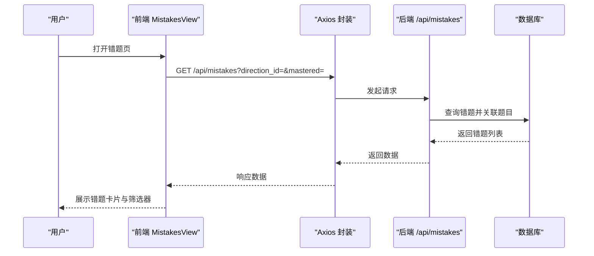
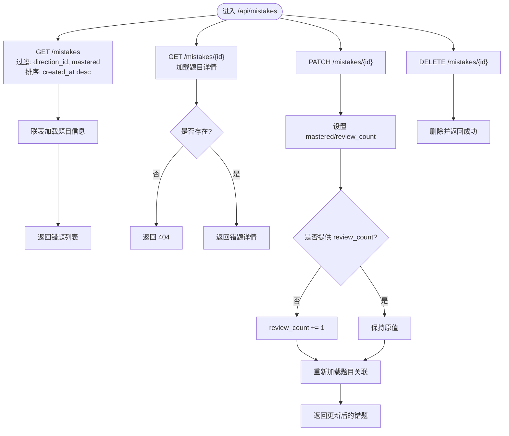
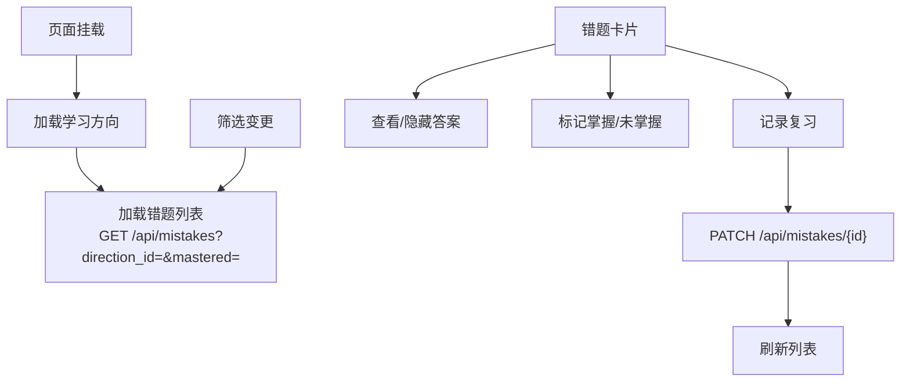
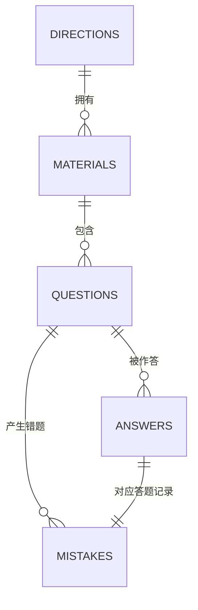
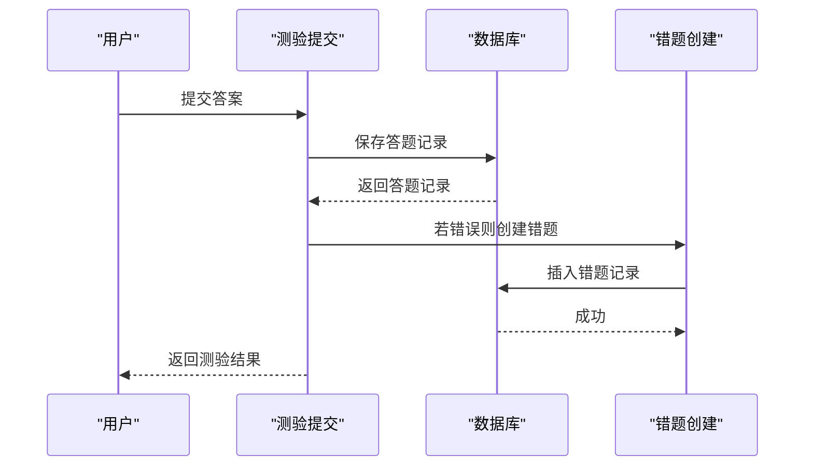
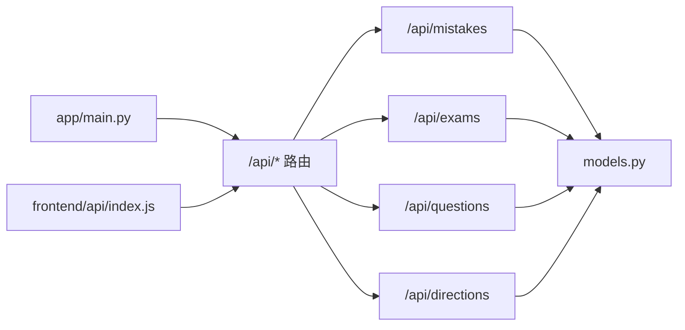

# 错题管理组件

<cite>
**本文引用的文件**
- [backend/app/api/mistakes.py](file://backend/app/api/mistakes.py)
- [frontend/src/views/MistakesView.vue](file://frontend/src/views/MistakesView.vue)
- [backend/app/models/models.py](file://backend/app/models/models.py)
- [backend/app/schemas/schemas.py](file://backend/app/schemas/schemas.py)
- [backend/app/api/exams.py](file://backend/app/api/exams.py)
- [backend/app/api/questions.py](file://backend/app/api/questions.py)
- [backend/app/api/directions.py](file://backend/app/api/directions.py)
- [frontend/src/api/index.js](file://frontend/src/api/index.js)
- [backend/app/main.py](file://backend/app/main.py)
- [backend/app/core/database.py](file://backend/app/core/database.py)
</cite>

## 目录
1. [简介](#简介)
2. [项目结构](#项目结构)
3. [核心组件](#核心组件)
4. [架构总览](#架构总览)
5. [详细组件分析](#详细组件分析)
6. [依赖关系分析](#依赖关系分析)
7. [性能考量](#性能考量)
8. [故障排查指南](#故障排查指南)
9. [结论](#结论)
10. [附录](#附录)

## 简介
本文件面向“错题管理组件”，系统性阐述其在系统中的定位与职责：负责错题的采集、分类、展示、复习与统计分析。后端通过 API 提供错题列表、详情、更新与删除；前端提供筛选、排序、答案查看、标记掌握与复习记录等功能；测验模块在客观题答错时自动收录为错题；数据库模型定义了错题与其关联的题目、答题记录之间的关系。

## 项目结构
- 后端采用 FastAPI + SQLAlchemy 架构，路由集中在 app/api 下，模型与模式定义在 app/models 与 app/schemas，入口在 app/main.py。
- 前端使用 Vue 3 组件化开发，错题页面位于 frontend/src/views/MistakesView.vue，统一通过 frontend/src/api/index.js 调用后端 /api 前缀接口。

图表来源
- [backend/app/main.py](file://backend/app/main.py#L37-L43)
- [frontend/src/views/MistakesView.vue](file://frontend/src/views/MistakesView.vue#L1-L150)
- [frontend/src/api/index.js](file://frontend/src/api/index.js#L44-L49)

章节来源
- [backend/app/main.py](file://backend/app/main.py#L1-L66)
- [frontend/src/views/MistakesView.vue](file://frontend/src/views/MistakesView.vue#L1-L150)
- [frontend/src/api/index.js](file://frontend/src/api/index.js#L1-L52)

## 核心组件
- 错题 API：提供错题列表、详情、更新（含复习次数自动递增）、删除。
- 错题视图：提供筛选（按方向、掌握状态）、答案查看、标记掌握、记录复习。
- 错题模型：与题目、答题记录建立外键关联，支持按方向过滤与按创建时间倒序。
- 测验集成：主观题由 AI 评分，客观题精确匹配，错误即自动创建错题记录。
- 数据库与模式：定义错题、题目、答题记录、学习方向等实体及枚举类型。

章节来源
- [backend/app/api/mistakes.py](file://backend/app/api/mistakes.py#L11-L90)
- [frontend/src/views/MistakesView.vue](file://frontend/src/views/MistakesView.vue#L1-L150)
- [backend/app/models/models.py](file://backend/app/models/models.py#L155-L168)
- [backend/app/api/exams.py](file://backend/app/api/exams.py#L127-L217)
- [backend/app/schemas/schemas.py](file://backend/app/schemas/schemas.py#L171-L191)

## 架构总览
错题管理贯穿“测验—错题—复习—统计”的闭环流程。测验提交时根据题型评分，错误自动写入错题表；前端错题页支持筛选与排序，用户可标记掌握、记录复习次数；后端提供错题 CRUD 接口与详情加载。

图表来源
- [frontend/src/views/MistakesView.vue](file://frontend/src/views/MistakesView.vue#L108-L122)
- [frontend/src/api/index.js](file://frontend/src/api/index.js#L44-L49)
- [backend/app/api/mistakes.py](file://backend/app/api/mistakes.py#L11-L31)

## 详细组件分析

### 后端 API：错题管理
- 列表接口：支持按方向与掌握状态过滤，按创建时间倒序；内部通过联表加载题目信息，便于前端渲染。
- 详情接口：按 ID 查询错题并加载题目详情，未找到返回 404。
- 更新接口：支持显式设置掌握状态与复习次数；若未提供复习次数，则自动加一；更新后重新加载关联题目。
- 删除接口：按 ID 删除错题并返回成功消息。

图表来源
- [backend/app/api/mistakes.py](file://backend/app/api/mistakes.py#L11-L90)

章节来源
- [backend/app/api/mistakes.py](file://backend/app/api/mistakes.py#L11-L90)

### 前端视图：错题列表与交互
- 筛选器：按学习方向与掌握状态筛选；筛选变更触发列表刷新。
- 展示逻辑：每条错题卡片显示题目类型、难度星级、题目内容与选项；支持点击查看/隐藏正确答案与解析；展示复习次数与掌握标签。
- 操作按钮：查看答案、标记掌握/未掌握、记录复习（调用后端 PATCH 接口）。
- 加载与空态：加载中提示、空列表提示与引导文案。

图表来源
- [frontend/src/views/MistakesView.vue](file://frontend/src/views/MistakesView.vue#L75-L149)
- [frontend/src/api/index.js](file://frontend/src/api/index.js#L44-L49)

章节来源
- [frontend/src/views/MistakesView.vue](file://frontend/src/views/MistakesView.vue#L1-L150)
- [frontend/src/api/index.js](file://frontend/src/api/index.js#L44-L49)

### 数据模型与关系
- 错题模型包含题目 ID、答题记录 ID、复习次数、掌握状态与创建时间；与题目、答题记录建立一对多/一对一关系。
- 题目模型包含类型、难度、内容、选项、标准答案、解析等；与答题记录、错题建立一对多关系。
- 学习方向模型用于资料与测验的分类，错题可通过联表按方向过滤。

图表来源
- [backend/app/models/models.py](file://backend/app/models/models.py#L63-L168)

章节来源
- [backend/app/models/models.py](file://backend/app/models/models.py#L63-L168)

### 与测验模块的集成
- 主观题由 AI 评分，客观题精确匹配；当答题不正确时，自动创建错题记录，关联当前题目与答题记录。
- 测验结果接口可获取总题数、正确数、得分与各题答案详情，用于后续统计分析。

图表来源
- [backend/app/api/exams.py](file://backend/app/api/exams.py#L127-L217)
- [backend/app/models/models.py](file://backend/app/models/models.py#L136-L168)

章节来源
- [backend/app/api/exams.py](file://backend/app/api/exams.py#L127-L217)
- [backend/app/models/models.py](file://backend/app/models/models.py#L136-L168)

### 筛选与排序机制
- 筛选维度：按学习方向（通过题目-资料-方向链路）、按掌握状态（布尔值）。
- 排序规则：按创建时间倒序，优先展示最新错题。
- 前端实现：通过查询参数传递筛选条件，后端联表过滤并排序。

章节来源
- [backend/app/api/mistakes.py](file://backend/app/api/mistakes.py#L11-L31)
- [frontend/src/views/MistakesView.vue](file://frontend/src/views/MistakesView.vue#L108-L122)

### 错题详情与展示
- 错题详情接口加载题目完整信息（类型、难度、内容、选项、标准答案、解析），便于在卡片中展开查看。
- 前端展示要点：题目类型与难度、内容与选项、正确答案与解析；通过开关控制答案区域显示。

章节来源
- [backend/app/api/mistakes.py](file://backend/app/api/mistakes.py#L33-L44)
- [frontend/src/views/MistakesView.vue](file://frontend/src/views/MistakesView.vue#L32-L54)

### 复习计划与进度跟踪
- 复习次数：后端在未显式提供时自动递增，前端通过“记录复习”按钮触发 PATCH 请求。
- 掌握状态：支持手动标记“已掌握/未掌握”，前端以标签颜色区分状态。
- 进度跟踪：结合复习次数与掌握状态，形成“重复复习—逐步掌握”的闭环。

章节来源
- [backend/app/api/mistakes.py](file://backend/app/api/mistakes.py#L47-L77)
- [frontend/src/views/MistakesView.vue](file://frontend/src/views/MistakesView.vue#L128-L144)

### 统计分析与薄弱环节识别
- 当前实现：后端提供测验结果聚合（总题数、正确数、得分、等级），可用于计算错误率与生成统计报表。
- 建议扩展：在后端新增错题统计接口，按方向、题型、难度、时间周期统计错误率与高频错题，辅助识别薄弱环节。

章节来源
- [backend/app/api/exams.py](file://backend/app/api/exams.py#L219-L240)

### 导出、清空与批量操作
- 已有能力：后端提供删除单条错题接口；前端提供删除按钮。
- 扩展建议：新增批量删除（传入 ID 列表）、导出为 CSV/Excel（按筛选条件导出）、清空全部错题（管理员权限）。

章节来源
- [backend/app/api/mistakes.py](file://backend/app/api/mistakes.py#L80-L89)

### 个性化学习建议与知识点巩固
- 知识点关联：当前错题与题目、答题记录关联，但未直接关联“知识点”。可在模型层引入“知识点—错题”关联，或通过题目与知识点的间接关联实现。
- 建议：基于错题高频知识点生成巩固练习与推荐题目，结合难度与重要程度给出复习优先级。

章节来源
- [backend/app/models/models.py](file://backend/app/models/models.py#L95-L114)
- [backend/app/models/models.py](file://backend/app/models/models.py#L193-L223)

## 依赖关系分析
- 应用入口注册路由与数据库初始化，确保启动时创建表结构。
- 错题 API 依赖数据库会话与模型；前端通过 Axios 封装统一访问 /api 前缀。
- 错题与题目、答题记录存在外键约束，保证数据一致性。

图表来源
- [backend/app/main.py](file://backend/app/main.py#L37-L43)
- [frontend/src/api/index.js](file://frontend/src/api/index.js#L1-L52)
- [backend/app/models/models.py](file://backend/app/models/models.py#L155-L168)

章节来源
- [backend/app/main.py](file://backend/app/main.py#L1-L66)
- [backend/app/core/database.py](file://backend/app/core/database.py#L1-L38)
- [frontend/src/api/index.js](file://frontend/src/api/index.js#L1-L52)

## 性能考量
- 查询优化：错题列表使用联表加载题目，建议在高频查询上为方向 ID、掌握状态、创建时间建立索引。
- 排序与分页：当前按创建时间倒序返回全量列表，建议在列表接口增加分页参数，降低前端渲染压力。
- 前端渲染：卡片列表较多时，建议启用虚拟滚动或分页加载，提升交互流畅度。

## 故障排查指南
- 错题不存在：更新或删除接口在未找到错题时返回 404，需确认 ID 是否正确。
- 答案查看异常：前端通过本地状态控制答案区域显示，若出现闪烁，检查响应数据是否包含题目详情。
- 筛选无效：确认前端传参是否正确（方向 ID、掌握状态布尔值），后端按条件联表过滤。

章节来源
- [backend/app/api/mistakes.py](file://backend/app/api/mistakes.py#L42-L44)
- [backend/app/api/mistakes.py](file://backend/app/api/mistakes.py#L83-L85)
- [frontend/src/views/MistakesView.vue](file://frontend/src/views/MistakesView.vue#L108-L122)

## 结论
错题管理组件已具备完整的采集、展示与基本复习功能，与测验模块无缝衔接，实现了“错误即收录”的自动化流程。建议后续增强统计分析、批量操作、导出与知识点关联，以进一步完善个性化学习路径与复习策略。

## 附录
- API 一览（后端）
  - GET /api/mistakes
  - GET /api/mistakes/{id}
  - PATCH /api/mistakes/{id}
  - DELETE /api/mistakes/{id}
- 前端调用（Axios 封装）
  - mistakesApi.getAll(params)
  - mistakesApi.update(id, data)
  - mistakesApi.delete(id)

章节来源
- [backend/app/api/mistakes.py](file://backend/app/api/mistakes.py#L11-L90)
- [frontend/src/api/index.js](file://frontend/src/api/index.js#L44-L49)