# 题目练习组件

<cite>
**本文档引用的文件**
- [QuestionsView.vue](file://frontend/src/views/QuestionsView.vue)
- [ExamTakingView.vue](file://frontend/src/views/ExamTakingView.vue)
- [MistakesView.vue](file://frontend/src/views/MistakesView.vue)
- [index.js](file://frontend/src/api/index.js)
- [index.js](file://frontend/src/router/index.js)
- [style.css](file://frontend/src/style.css)
- [questions.py](file://backend/app/api/questions.py)
- [exams.py](file://backend/app/api/exams.py)
- [mistakes.py](file://backend/app/api/mistakes.py)
- [models.py](file://backend/app/models/models.py)
- [schemas.py](file://backend/app/schemas/schemas.py)
- [materials.py](file://backend/app/api/materials.py)
- [directions.py](file://backend/app/api/directions.py)
</cite>

## 目录
1. [简介](#简介)
2. [项目结构](#项目结构)
3. [核心组件](#核心组件)
4. [架构概览](#架构概览)
5. [详细组件分析](#详细组件分析)
6. [依赖关系分析](#依赖关系分析)
7. [性能考虑](#性能考虑)
8. [故障排除指南](#故障排除指南)
9. [结论](#结论)

## 简介

题目练习组件是个人学习管理系统中的核心功能模块，提供了完整的题目管理和练习体验。该组件支持多种题型（单选、多选、判断、简答），具备智能筛选、实时评分、错题管理等高级功能，为学习者提供沉浸式的在线练习环境。

系统采用前后端分离架构，前端使用Vue 3 + Vite构建现代化界面，后端基于FastAPI提供RESTful API服务，支持AI驱动的题目生成和智能评分功能。

## 项目结构

整个系统采用清晰的分层架构，主要分为前端视图层、API接口层、业务逻辑层和数据持久层：

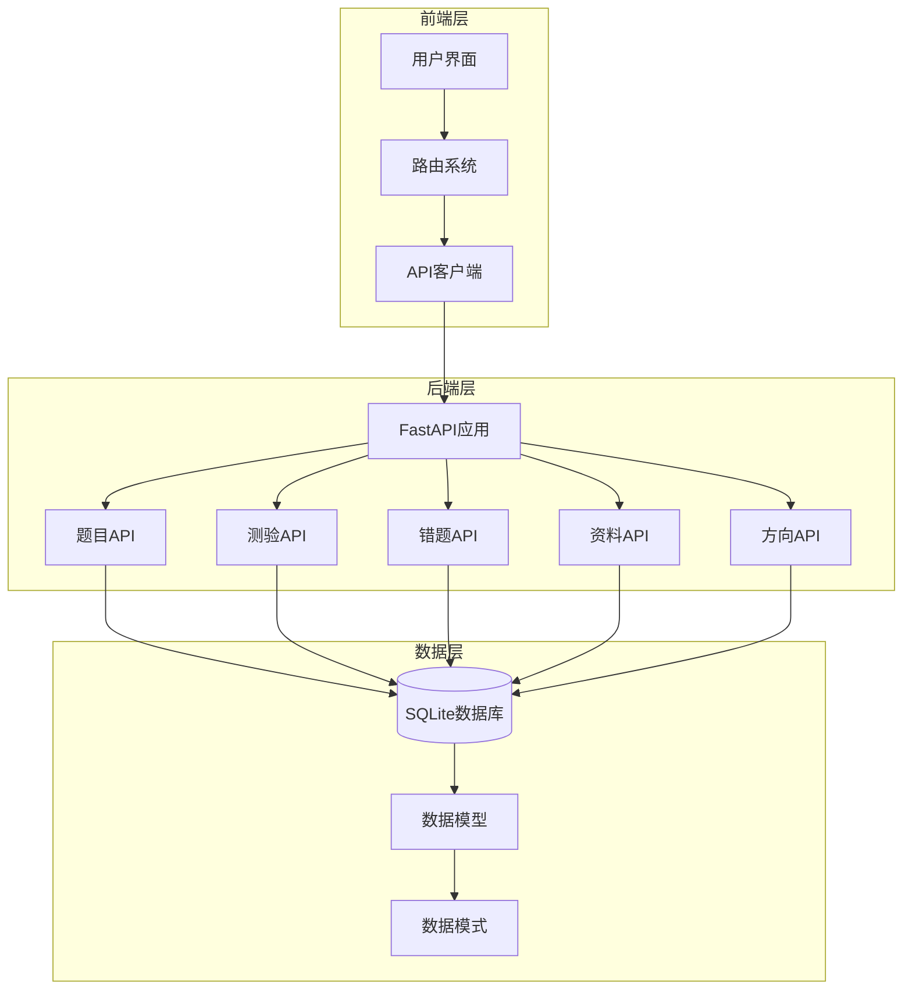

**图表来源**
- [QuestionsView.vue](file://frontend/src/views/QuestionsView.vue#L1-L554)
- [index.js](file://frontend/src/api/index.js#L1-L52)
- [questions.py](file://backend/app/api/questions.py#L1-L90)
- [models.py](file://backend/app/models/models.py#L1-L223)

**章节来源**
- [QuestionsView.vue](file://frontend/src/views/QuestionsView.vue#L1-L554)
- [index.js](file://frontend/src/router/index.js#L1-L47)

## 核心组件

### 题目管理组件

题目管理组件是系统的核心界面，提供完整的题目列表展示和管理功能：

- **筛选功能**：支持按学习方向、题目类型、资料来源进行多维度过滤
- **题目渲染**：智能识别题型，动态渲染不同类型的题目内容
- **编辑功能**：提供内联编辑和模态框编辑两种方式
- **评价系统**：支持用户对题目质量进行评价

### 在线练习组件

在线练习组件提供沉浸式的答题体验：

- **题型适配**：针对不同题型提供相应的交互控件
- **进度跟踪**：实时显示答题进度和完成状态
- **计时功能**：支持限时和非限时两种模式
- **导航控制**：提供便捷的题目跳转和状态查看

### 错题管理组件

错题管理组件专注于学习效果追踪：

- **状态管理**：区分已掌握和未掌握两种学习状态
- **复习记录**：记录每次复习的时间和次数
- **智能提醒**：基于遗忘曲线提供复习建议
- **统计分析**：提供错题分布和学习进度统计

**章节来源**
- [QuestionsView.vue](file://frontend/src/views/QuestionsView.vue#L1-L554)
- [ExamTakingView.vue](file://frontend/src/views/ExamTakingView.vue#L1-L516)
- [MistakesView.vue](file://frontend/src/views/MistakesView.vue#L1-L409)

## 架构概览

系统采用现代全栈架构，前后端完全分离，通过RESTful API进行通信：

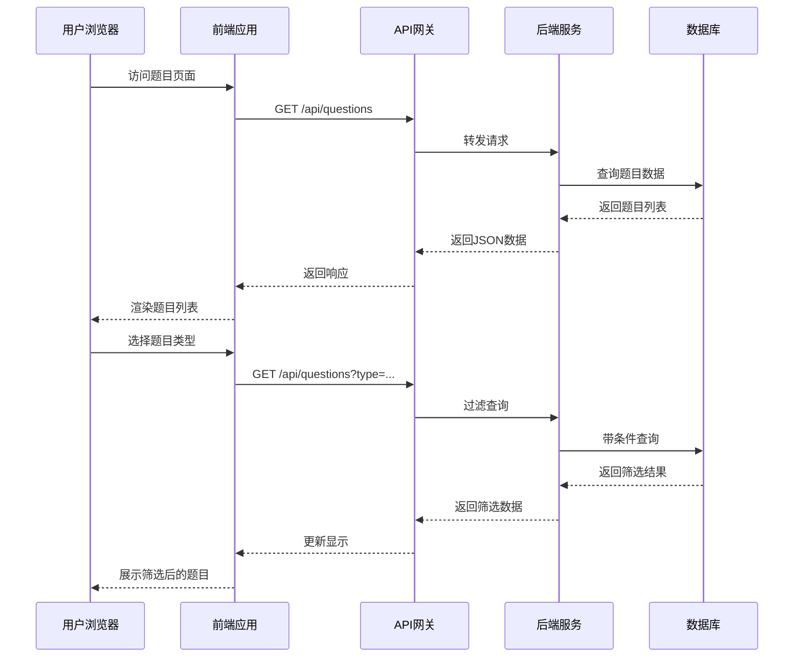

**图表来源**
- [index.js](file://frontend/src/api/index.js#L26-L33)
- [questions.py](file://backend/app/api/questions.py#L11-L30)

### 数据流架构

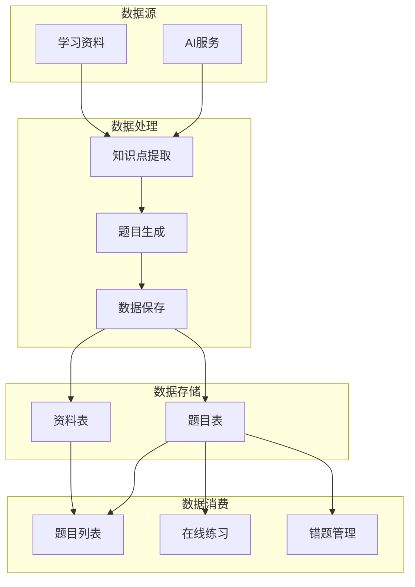

**图表来源**
- [materials.py](file://backend/app/api/materials.py#L27-L80)
- [models.py](file://backend/app/models/models.py#L95-L114)

**章节来源**
- [models.py](file://backend/app/models/models.py#L1-L223)
- [schemas.py](file://backend/app/schemas/schemas.py#L1-L265)

## 详细组件分析

### 题目列表组件

题目列表组件是用户与系统交互的主要界面，具备以下核心功能：

#### 题型识别与渲染机制

系统支持四种题型，每种题型都有独特的渲染策略：

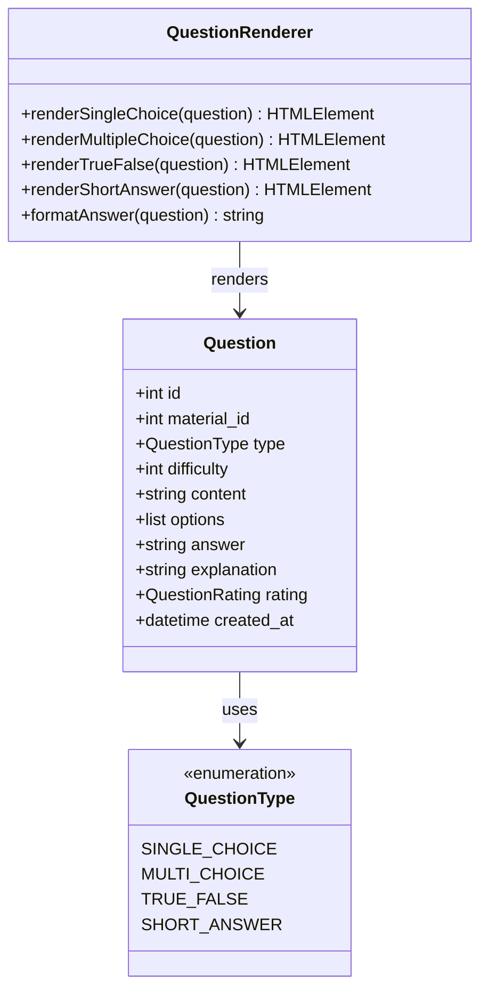

**图表来源**
- [models.py](file://backend/app/models/models.py#L16-L22)
- [QuestionsView.vue](file://frontend/src/views/QuestionsView.vue#L173-L202)

#### 选项随机化机制

对于选择题，系统提供灵活的选项展示机制：

- **单选题**：使用单选按钮，确保用户只能选择一个答案
- **多选题**：使用复选框，允许用户选择多个正确答案
- **判断题**：提供二元选择，简化答题流程
- **简答题**：使用文本域，支持自由回答

#### 样式定制系统

系统采用CSS变量和渐变色彩方案，提供丰富的视觉层次：

- **主题色彩**：深蓝色系为主色调，营造专业学习氛围
- **状态标识**：不同题型使用不同的颜色标签
- **难度可视化**：使用星号图标直观显示题目难度
- **响应式设计**：适配各种屏幕尺寸

**章节来源**
- [QuestionsView.vue](file://frontend/src/views/QuestionsView.vue#L34-L79)
- [style.css](file://frontend/src/style.css#L1-L404)

### 题目筛选与搜索功能

题目筛选功能提供多维度的数据过滤能力：

#### 筛选条件实现

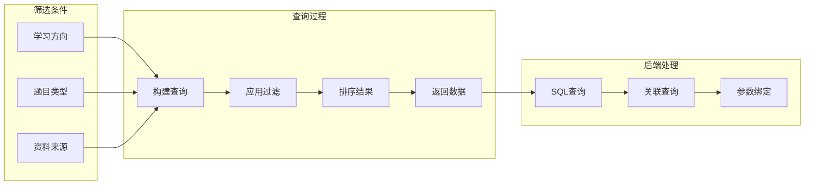

**图表来源**
- [questions.py](file://backend/app/api/questions.py#L11-L30)
- [QuestionsView.vue](file://frontend/src/views/QuestionsView.vue#L167-L171)

#### 关键词匹配机制

系统支持基于关键词的智能搜索：

- **内容匹配**：在题目内容中进行模糊匹配
- **类型过滤**：根据题型进行精确过滤
- **难度筛选**：支持难度范围的区间查询
- **状态关联**：结合资料处理状态进行筛选

**章节来源**
- [questions.py](file://backend/app/api/questions.py#L11-L30)
- [QuestionsView.vue](file://frontend/src/views/QuestionsView.vue#L8-L26)

### 题目详情与展开机制

题目详情展示提供了完整的题目信息呈现：

#### 知识点展示系统

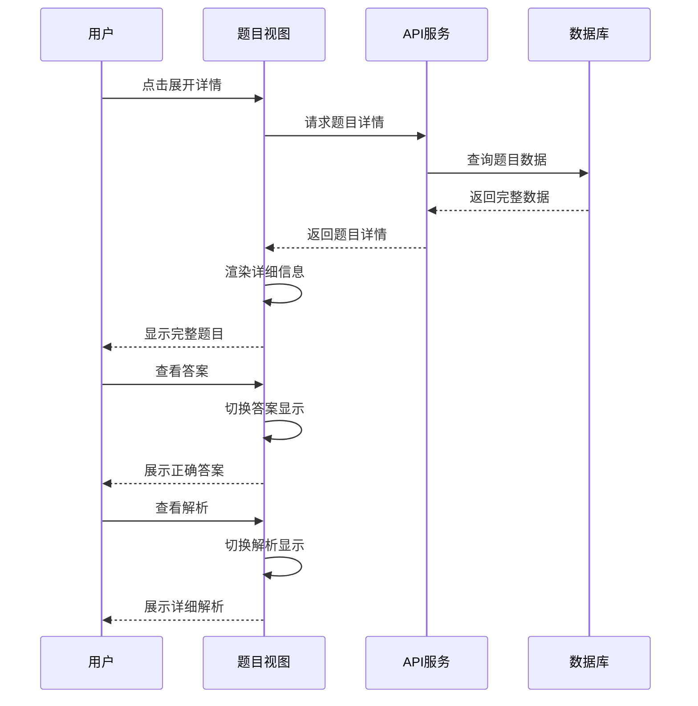

**图表来源**
- [QuestionsView.vue](file://frontend/src/views/QuestionsView.vue#L60-L70)
- [exams.py](file://backend/app/api/exams.py#L127-L216)

#### 展开收起动画效果

系统使用CSS动画提供流畅的展开收起体验：

- **滑动动画**：使用slideUp动画效果
- **渐变过渡**：平滑的颜色和透明度变化
- **延迟加载**：仅在需要时加载详细内容
- **内存优化**：避免不必要的DOM操作

**章节来源**
- [QuestionsView.vue](file://frontend/src/views/QuestionsView.vue#L28-L80)
- [style.css](file://frontend/src/style.css#L333-L342)

### 用户答题交互逻辑

在线练习组件提供了完整的答题交互体验：

#### 选项选择机制

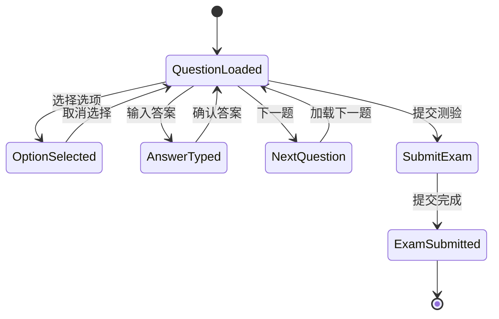

**图表来源**
- [ExamTakingView.vue](file://frontend/src/views/ExamTakingView.vue#L121-L128)
- [ExamTakingView.vue](file://frontend/src/views/ExamTakingView.vue#L196-L206)

#### 状态标记系统

系统实现了完整的答题状态跟踪：

- **当前状态**：实时显示当前题目的答题状态
- **完成标记**：自动标记已完成的题目
- **进度指示**：提供可视化的答题进度
- **导航索引**：支持快速跳转到任意题目

#### 进度指示器

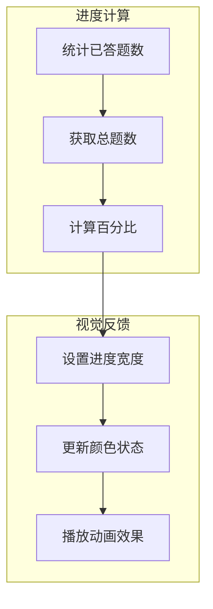

**图表来源**
- [ExamTakingView.vue](file://frontend/src/views/ExamTakingView.vue#L130-L136)

**章节来源**
- [ExamTakingView.vue](file://frontend/src/views/ExamTakingView.vue#L1-L516)

### 收藏与错题标记功能

系统提供了完善的题目管理和学习追踪功能：

#### 错题管理机制

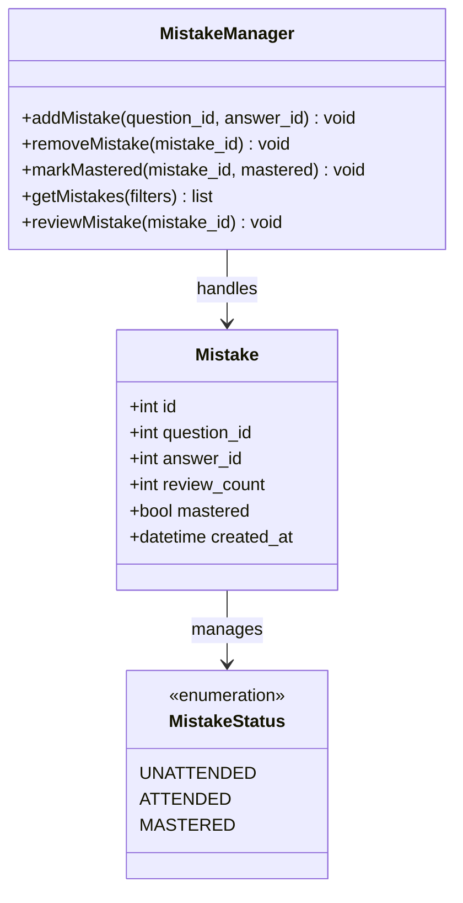

**图表来源**
- [models.py](file://backend/app/models/models.py#L155-L168)
- [mistakes.py](file://backend/app/api/mistakes.py#L11-L30)

#### 学习状态追踪

系统支持多种学习状态的精细化管理：

- **掌握状态**：标记已掌握的题目
- **复习记录**：记录每次复习的时间和次数
- **遗忘曲线**：基于艾宾浩斯遗忘曲线的复习建议
- **统计分析**：提供学习进度和薄弱环节分析

**章节来源**
- [MistakesView.vue](file://frontend/src/views/MistakesView.vue#L1-L409)
- [mistakes.py](file://backend/app/api/mistakes.py#L1-L90)

### 难度标识与统计信息

系统提供了完整的难度标识和统计分析功能：

#### 难度可视化

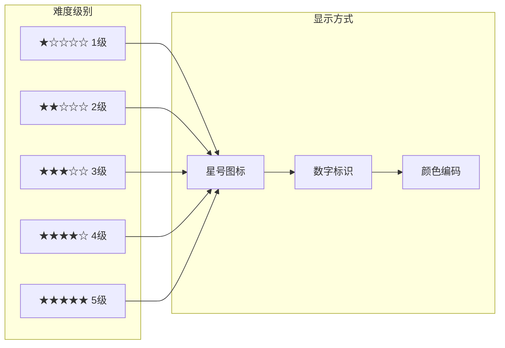

**图表来源**
- [QuestionsView.vue](file://frontend/src/views/QuestionsView.vue#L38-L38)
- [ExamTakingView.vue](file://frontend/src/views/ExamTakingView.vue#L23-L23)

#### 统计信息展示

系统提供多层次的统计信息：

- **题目统计**：总题数、已做题数、正确率
- **难度分布**：各难度级别的题目数量
- **题型分析**：不同题型的掌握情况
- **学习进度**：整体学习完成度和趋势

**章节来源**
- [QuestionsView.vue](file://frontend/src/views/QuestionsView.vue#L38-L38)
- [ExamTakingView.vue](file://frontend/src/views/ExamTakingView.vue#L130-L136)

## 依赖关系分析

系统的依赖关系体现了清晰的分层架构：

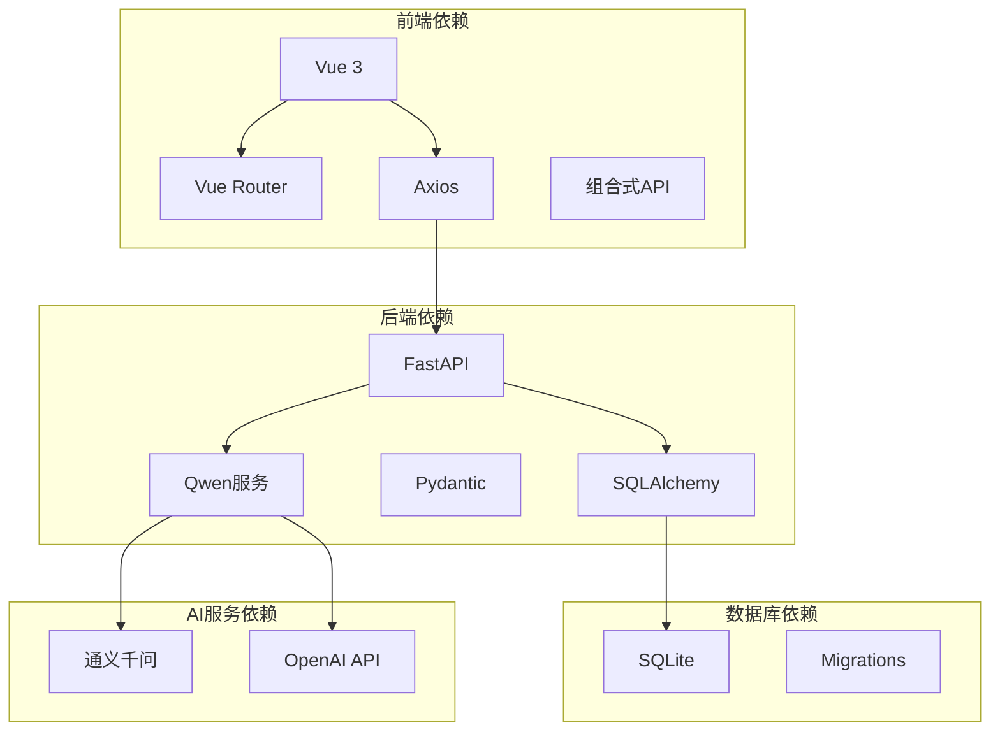

**图表来源**
- [index.js](file://frontend/src/api/index.js#L1-L52)
- [models.py](file://backend/app/models/models.py#L1-L223)

### 外部服务集成

系统集成了多个外部服务以增强功能：

- **AI内容生成**：使用通义千问API进行知识点提取和题目生成
- **实时通信**：支持SSE流式传输资料处理进度
- **文件处理**：支持多种格式的学习资料导入
- **用户认证**：基于JWT的用户身份验证

**章节来源**
- [materials.py](file://backend/app/api/materials.py#L27-L80)
- [exams.py](file://backend/app/api/exams.py#L127-L216)

## 性能考虑

系统在设计时充分考虑了性能优化：

### 前端性能优化

- **虚拟滚动**：大量题目的情况下使用虚拟滚动技术
- **懒加载**：图片和详细内容按需加载
- **缓存策略**：合理使用浏览器缓存和组件缓存
- **代码分割**：按路由进行代码分割，减少初始加载时间

### 后端性能优化

- **数据库索引**：为常用查询字段建立索引
- **查询优化**：使用JOIN减少查询次数
- **连接池**：使用连接池管理数据库连接
- **异步处理**：长耗时操作使用异步处理

### 缓存策略

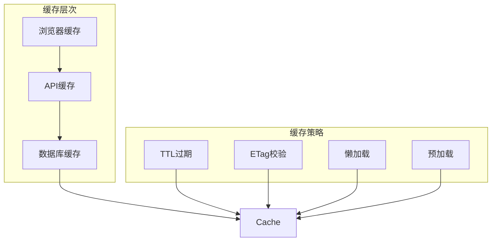

## 故障排除指南

### 常见问题及解决方案

#### 题目加载失败

**症状**：题目列表显示为空或加载失败

**可能原因**：
- API服务器未启动
- 网络连接问题
- 数据库连接失败

**解决步骤**：
1. 检查后端服务状态
2. 验证API端点可用性
3. 查看数据库连接日志
4. 检查网络防火墙设置

#### 题目筛选无效

**症状**：筛选条件不生效或返回错误结果

**可能原因**：
- 参数传递错误
- 数据库查询条件不匹配
- 权限不足

**解决步骤**：
1. 检查筛选参数格式
2. 验证数据库字段映射
3. 确认用户权限
4. 查看API响应日志

#### 答题功能异常

**症状**：无法正常答题或答案提交失败

**可能原因**：
- 会话过期
- 答题状态冲突
- 网络中断

**解决步骤**：
1. 重新登录系统
2. 检查浏览器控制台错误
3. 验证网络连接稳定性
4. 清除浏览器缓存

**章节来源**
- [questions.py](file://backend/app/api/questions.py#L37-L38)
- [exams.py](file://backend/app/api/exams.py#L134-L139)

### 开发调试技巧

#### 前端调试

- 使用Vue DevTools检查组件状态
- 利用浏览器开发者工具监控网络请求
- 检查控制台错误信息
- 使用断点调试JavaScript代码

#### 后端调试

- 查看FastAPI的调试日志
- 使用SQLAlchemy的查询日志
- 检查AI服务的API调用日志
- 监控数据库性能指标

## 结论

题目练习组件是一个功能完整、架构清晰的学习管理系统核心模块。它不仅提供了基本的题目管理和练习功能，更重要的是集成了AI驱动的内容生成和智能评分能力，为学习者提供了个性化的学习体验。

系统的主要优势包括：

- **完整的功能覆盖**：从题目生成到学习追踪的全流程支持
- **优秀的用户体验**：响应式设计和流畅的交互体验
- **强大的扩展性**：模块化的架构便于功能扩展和维护
- **智能化特性**：AI驱动的内容生成和学习分析

未来可以考虑的功能改进方向：
- 增加更多的题型支持
- 实现更精细的学习路径规划
- 添加社交学习功能
- 优化移动端体验