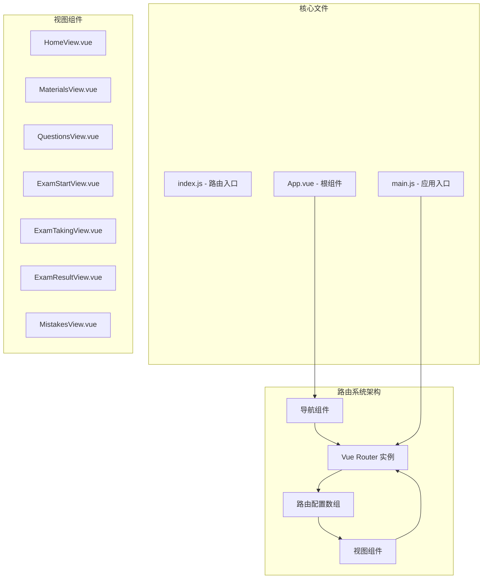
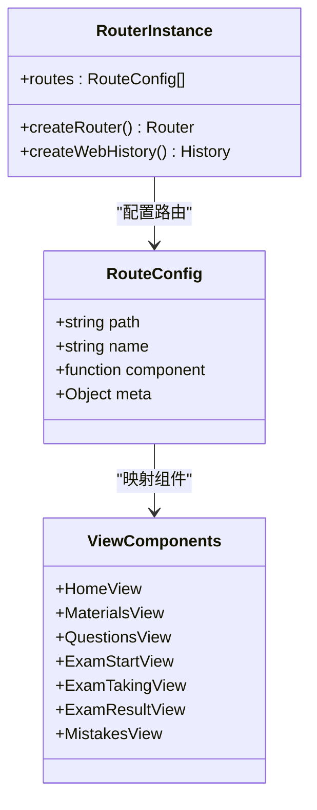
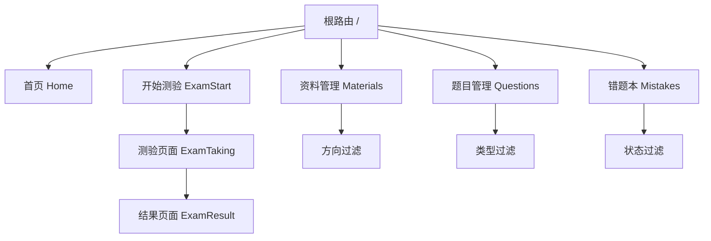
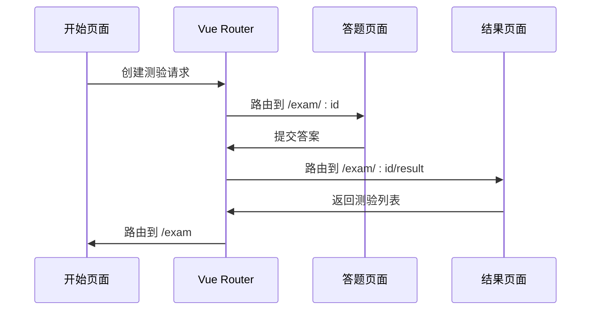
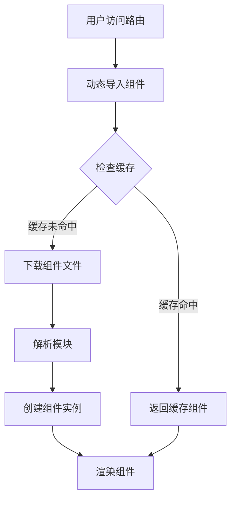
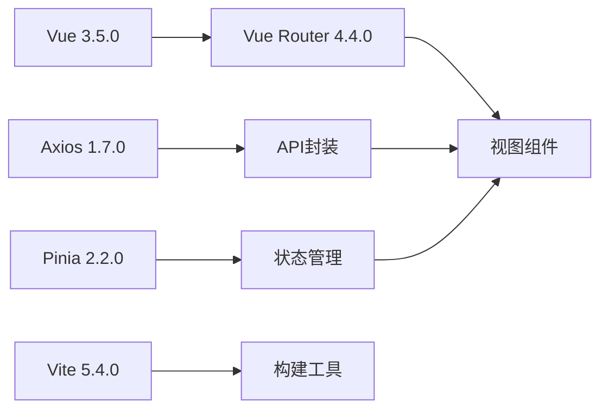
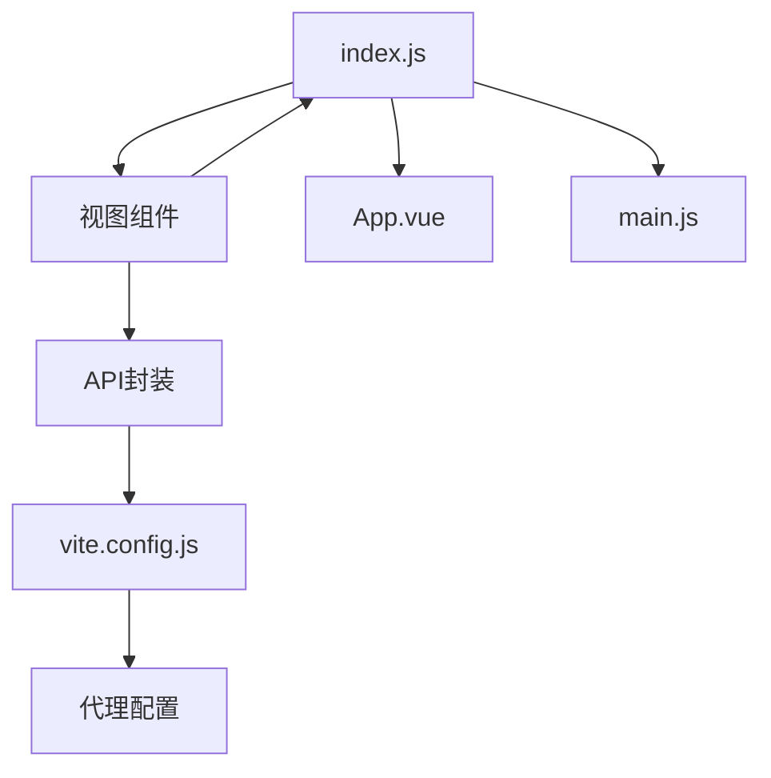

# 路由系统

<cite>
**本文档引用的文件**
- [frontend/src/router/index.js](file://frontend/src/router/index.js)
- [frontend/src/main.js](file://frontend/src/main.js)
- [frontend/src/App.vue](file://frontend/src/App.vue)
- [frontend/src/views/HomeView.vue](file://frontend/src/views/HomeView.vue)
- [frontend/src/views/ExamStartView.vue](file://frontend/src/views/ExamStartView.vue)
- [frontend/src/views/ExamTakingView.vue](file://frontend/src/views/ExamTakingView.vue)
- [frontend/src/views/ExamResultView.vue](file://frontend/src/views/ExamResultView.vue)
- [frontend/src/views/MaterialsView.vue](file://frontend/src/views/MaterialsView.vue)
- [frontend/src/views/QuestionsView.vue](file://frontend/src/views/QuestionsView.vue)
- [frontend/src/views/MistakesView.vue](file://frontend/src/views/MistakesView.vue)
- [frontend/src/api/index.js](file://frontend/src/api/index.js)
- [frontend/vite.config.js](file://frontend/vite.config.js)
- [frontend/package.json](file://frontend/package.json)
</cite>

## 目录
1. [简介](#简介)
2. [项目结构](#项目结构)
3. [核心组件](#核心组件)
4. [架构概览](#架构概览)
5. [详细组件分析](#详细组件分析)
6. [依赖关系分析](#依赖关系分析)
7. [性能考虑](#性能考虑)
8. [故障排除指南](#故障排除指南)
9. [结论](#结论)

## 简介

本项目采用Vue Router作为前端路由管理系统，实现了完整的单页应用(SPA)路由功能。路由系统涵盖了学习管理应用的核心业务流程，包括资料管理、题目生成、在线测验和错题本等功能模块。

系统采用现代化的Vue 3 Composition API和Vue Router 4.x，实现了代码分割、懒加载和响应式导航等高级特性。路由配置简洁明了，支持动态参数传递和嵌套路由设计。

## 项目结构

前端路由系统主要由以下核心文件组成：

**图表来源**
- [frontend/src/router/index.js](file://frontend/src/router/index.js#L1-L47)
- [frontend/src/main.js](file://frontend/src/main.js#L1-L12)
- [frontend/src/App.vue](file://frontend/src/App.vue#L1-L202)

**章节来源**
- [frontend/src/router/index.js](file://frontend/src/router/index.js#L1-L47)
- [frontend/src/main.js](file://frontend/src/main.js#L1-L12)
- [frontend/src/App.vue](file://frontend/src/App.vue#L1-L202)

## 核心组件

### 路由配置系统

路由系统采用集中式配置方式，所有路由规则统一管理在路由配置数组中。每个路由对象包含路径、名称、组件和可选的元信息。

**图表来源**
- [frontend/src/router/index.js](file://frontend/src/router/index.js#L3-L39)

### 应用初始化流程

应用程序通过Vue Router插件集成到Vue应用中，实现了全局路由管理和导航控制。

**章节来源**
- [frontend/src/router/index.js](file://frontend/src/router/index.js#L41-L47)
- [frontend/src/main.js](file://frontend/src/main.js#L1-L12)

## 架构概览

### 路由层次结构

系统采用扁平化的路由设计，所有路由都位于根级别，没有复杂的嵌套层级。这种设计简化了路由管理，适合中小型应用的导航需求。

**图表来源**
- [frontend/src/router/index.js](file://frontend/src/router/index.js#L3-L39)

### 导航架构

应用采用顶部导航栏和侧边内容区域的布局设计，`<router-view>`组件负责渲染当前激活的路由组件。

**章节来源**
- [frontend/src/App.vue](file://frontend/src/App.vue#L15-L17)

## 详细组件分析

### 路由表定义

路由表采用数组形式定义，每个路由对象包含必要的配置项：

| 路由属性 | 描述 | 示例值 |
|---------|------|--------|
| `path` | 路由路径 | `'/'`, `'/materials'` |
| `name` | 路由名称 | `'Home'`, `'Materials'` |
| `component` | 组件函数 | `() => import('@/views/HomeView.vue')` |
| `meta` | 元信息 | 可选的页面标题、权限等 |

**章节来源**
- [frontend/src/router/index.js](file://frontend/src/router/index.js#L3-L39)

### 动态路由参数

测验系统使用动态路由参数实现测验ID传递，支持从开始页面到答题页面再到结果页面的完整流程。

**图表来源**
- [frontend/src/views/ExamStartView.vue](file://frontend/src/views/ExamStartView.vue#L140-L151)
- [frontend/src/views/ExamTakingView.vue](file://frontend/src/views/ExamTakingView.vue#L160-L182)
- [frontend/src/views/ExamResultView.vue](file://frontend/src/views/ExamResultView.vue#L89-L110)

**章节来源**
- [frontend/src/router/index.js](file://frontend/src/router/index.js#L24-L33)
- [frontend/src/views/ExamStartView.vue](file://frontend/src/views/ExamStartView.vue#L140-L151)
- [frontend/src/views/ExamTakingView.vue](file://frontend/src/views/ExamTakingView.vue#L160-L182)

### 路由懒加载实现

系统采用动态导入实现路由懒加载，每个视图组件都通过`import()`函数进行异步加载，实现代码分割和按需加载。

**图表来源**
- [frontend/src/router/index.js](file://frontend/src/router/index.js#L7-L37)

**章节来源**
- [frontend/src/router/index.js](file://frontend/src/router/index.js#L7-L37)

### 导航组件使用

应用中的导航通过`<router-link>`组件实现，支持激活状态样式和动画效果。

**章节来源**
- [frontend/src/App.vue](file://frontend/src/App.vue#L7-L13)
- [frontend/src/views/HomeView.vue](file://frontend/src/views/HomeView.vue#L106-L108)

## 依赖关系分析

### 外部依赖

路由系统依赖于以下关键包：

**图表来源**
- [frontend/package.json](file://frontend/package.json#L11-L21)

### 内部依赖关系

**图表来源**
- [frontend/src/router/index.js](file://frontend/src/router/index.js#L1-L47)
- [frontend/src/api/index.js](file://frontend/src/api/index.js#L1-L52)
- [frontend/vite.config.js](file://frontend/vite.config.js#L14-L19)

**章节来源**
- [frontend/package.json](file://frontend/package.json#L11-L21)
- [frontend/src/api/index.js](file://frontend/src/api/index.js#L1-L52)

## 性能考虑

### 代码分割策略

系统采用按需加载策略，每个路由组件都是独立的代码块，只有在访问对应路由时才加载相应组件。

### 构建优化

Vite构建工具提供了快速的开发体验和高效的生产构建，支持Tree Shaking和模块热替换。

### 缓存策略

- **组件缓存**：Vue Router默认缓存已访问过的路由组件
- **静态资源缓存**：通过Vite的构建优化实现静态资源的长期缓存
- **API响应缓存**：后端API层实现响应数据缓存

## 故障排除指南

### 常见问题

1. **路由不生效**
   - 检查路由配置中的路径和组件导入
   - 确认Vue Router插件已正确安装

2. **动态参数获取失败**
   - 使用`useRoute()`组合式函数获取路由参数
   - 检查路由定义中的参数占位符

3. **导航链接失效**
   - 确认`<router-link>`的`to`属性格式正确
   - 检查路由名称是否匹配

**章节来源**
- [frontend/src/views/ExamTakingView.vue](file://frontend/src/views/ExamTakingView.vue#L107-L108)
- [frontend/src/views/ExamResultView.vue](file://frontend/src/views/ExamResultView.vue#L84-L85)

## 结论

本路由系统设计简洁高效，完美适配学习管理应用的业务需求。通过合理的路由配置、动态组件加载和清晰的导航结构，实现了良好的用户体验和开发维护性。

系统的主要优势包括：
- **简洁的路由结构**：扁平化设计降低了复杂度
- **高效的代码分割**：按需加载提升了应用性能
- **完善的导航体验**：响应式设计和动画效果
- **易于扩展**：模块化的架构便于功能扩展

未来可以考虑的功能增强：
- 添加路由守卫实现权限控制
- 实现路由元信息驱动的面包屑导航
- 集成路由预加载策略提升用户体验