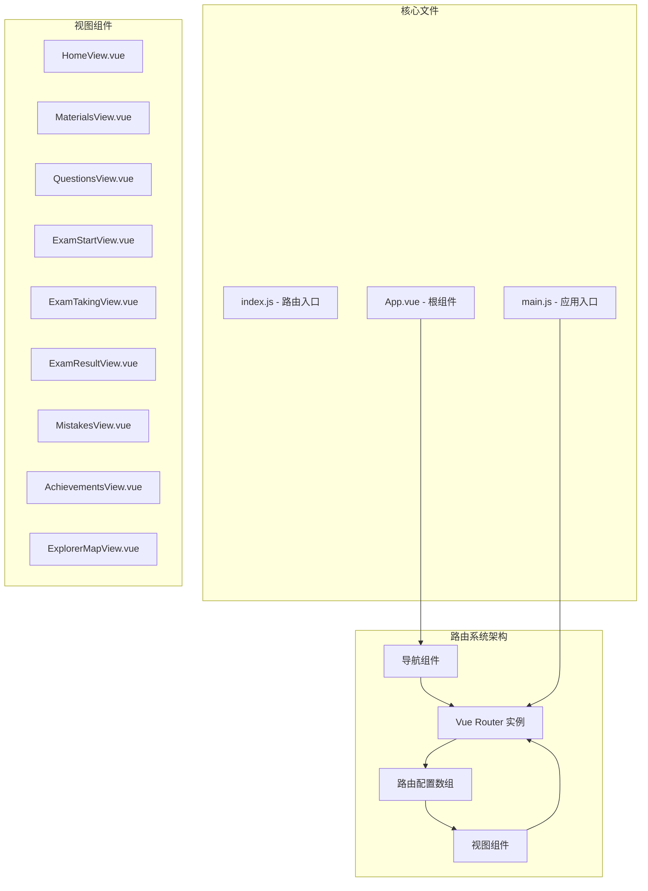
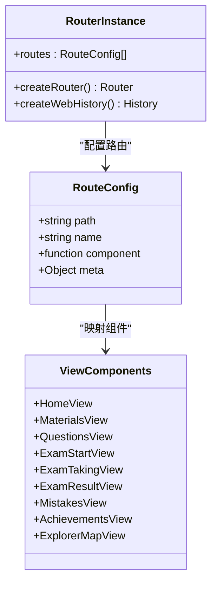
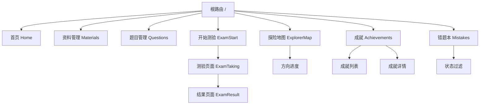
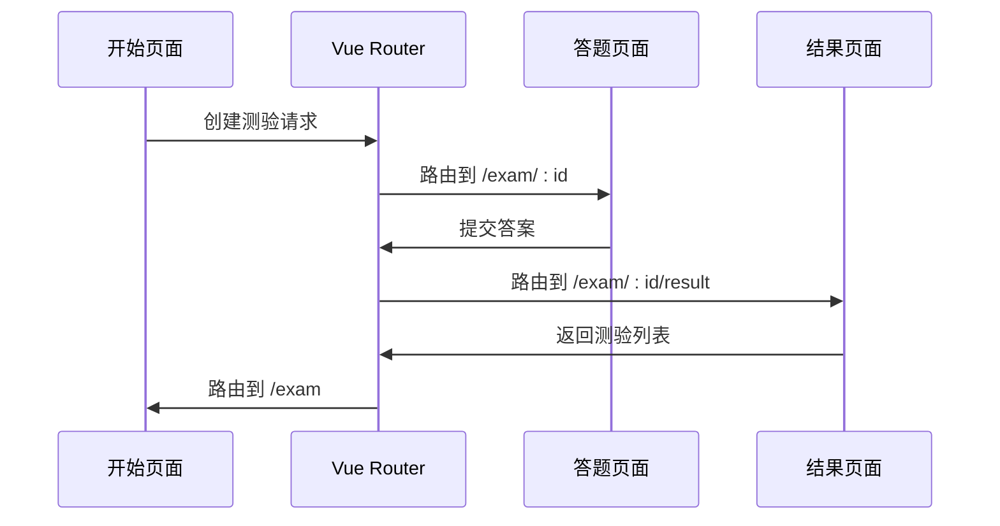
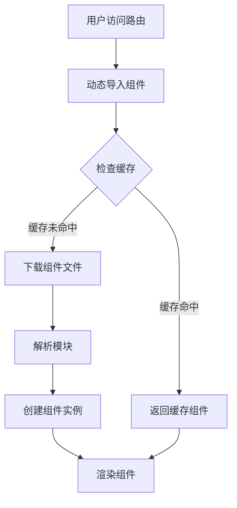
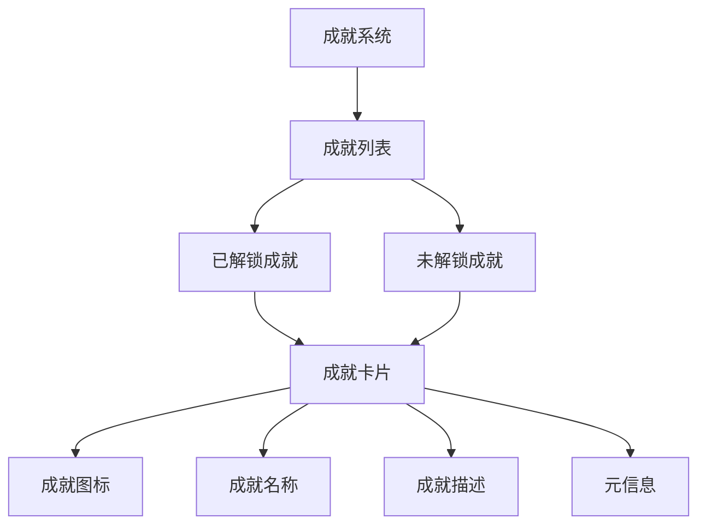
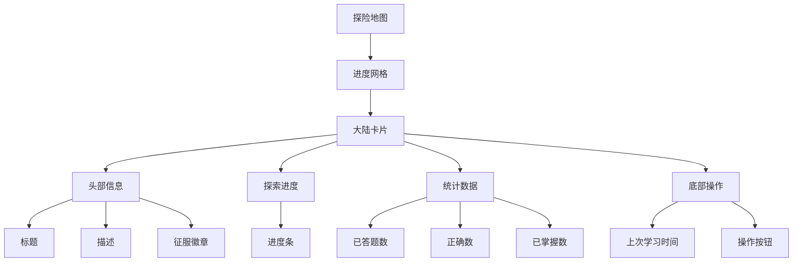
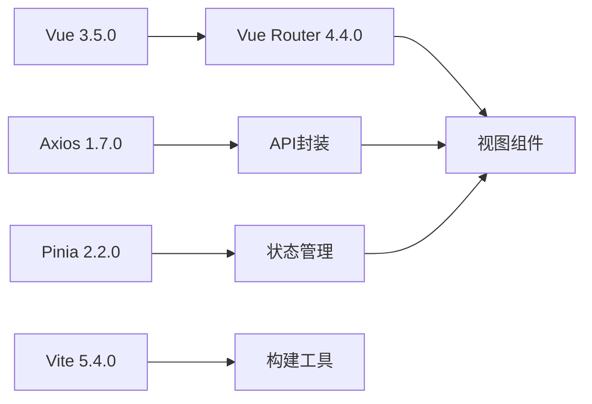
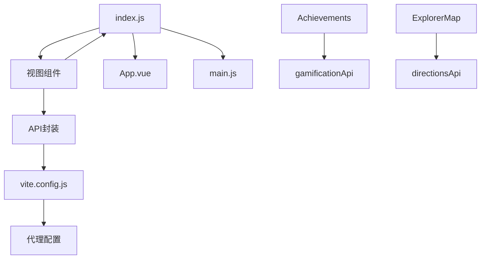

# 路由系统

<cite>
**本文档引用的文件**
- [frontend/src/router/index.js](file://frontend/src/router/index.js)
- [frontend/src/main.js](file://frontend/src/main.js)
- [frontend/src/App.vue](file://frontend/src/App.vue)
- [frontend/src/views/HomeView.vue](file://frontend/src/views/HomeView.vue)
- [frontend/src/views/ExamStartView.vue](file://frontend/src/views/ExamStartView.vue)
- [frontend/src/views/ExamTakingView.vue](file://frontend/src/views/ExamTakingView.vue)
- [frontend/src/views/ExamResultView.vue](file://frontend/src/views/ExamResultView.vue)
- [frontend/src/views/MaterialsView.vue](file://frontend/src/views/MaterialsView.vue)
- [frontend/src/views/QuestionsView.vue](file://frontend/src/views/QuestionsView.vue)
- [frontend/src/views/MistakesView.vue](file://frontend/src/views/MistakesView.vue)
- [frontend/src/views/AchievementsView.vue](file://frontend/src/views/AchievementsView.vue)
- [frontend/src/views/ExplorerMapView.vue](file://frontend/src/views/ExplorerMapView.vue)
- [frontend/src/api/index.js](file://frontend/src/api/index.js)
- [frontend/vite.config.js](file://frontend/vite.config.js)
- [frontend/package.json](file://frontend/package.json)
</cite>

## 更新摘要
**变更内容**
- 新增成就系统路由配置和视图组件
- 新增探险者地图路由配置和视图组件
- 更新导航栏以包含新路由链接
- 扩展路由表以支持完整的学习管理功能

## 目录
1. [简介](#简介)
2. [项目结构](#项目结构)
3. [核心组件](#核心组件)
4. [架构概览](#架构概览)
5. [详细组件分析](#详细组件分析)
6. [依赖关系分析](#依赖关系分析)
7. [性能考虑](#性能考虑)
8. [故障排除指南](#故障排除指南)
9. [结论](#结论)

## 简介

本项目采用Vue Router作为前端路由管理系统，实现了完整的单页应用(SPA)路由功能。路由系统涵盖了学习管理应用的核心业务流程，包括资料管理、题目生成、在线测验、错题本、成就系统和探险地图等功能模块。

系统采用现代化的Vue 3 Composition API和Vue Router 4.x，实现了代码分割、懒加载和响应式导航等高级特性。路由配置简洁明了，支持动态参数传递和嵌套路由设计。

**更新** 新增成就系统和探险者地图两个核心功能模块，完善了学习管理应用的游戏化体验。

## 项目结构

前端路由系统主要由以下核心文件组成：

```mermaid
graph TB
subgraph "路由系统架构"
Router[Vue Router 实例]
Routes[路由配置数组]
Components[视图组件]
Navigation[导航组件]
end
subgraph "核心文件"
Index[index.js - 路由入口]
Main[main.js - 应用入口]
App[App.vue - 根组件]
end
subgraph "视图组件"
Home[HomeView.vue]
Materials[MaterialsView.vue]
Questions[QuestionsView.vue]
ExamStart[ExamStartView.vue]
ExamTaking[ExamTakingView.vue]
ExamResult[ExamResultView.vue]
Mistakes[MistakesView.vue]
Achievements[AchievementsView.vue]
ExplorerMap[ExplorerMapView.vue]
end
Router --> Routes
Routes --> Components
Navigation --> Router
Main --> Router
App --> Navigation
Components --> Router
```

**图表来源**
- [frontend/src/router/index.js](file://frontend/src/router/index.js#L1-L57)
- [frontend/src/main.js](file://frontend/src/main.js#L1-L12)
- [frontend/src/App.vue](file://frontend/src/App.vue#L1-L204)

**章节来源**
- [frontend/src/router/index.js](file://frontend/src/router/index.js#L1-L57)
- [frontend/src/main.js](file://frontend/src/main.js#L1-L12)
- [frontend/src/App.vue](file://frontend/src/App.vue#L1-L204)

## 核心组件

### 路由配置系统

路由系统采用集中式配置方式，所有路由规则统一管理在路由配置数组中。每个路由对象包含路径、名称、组件和可选的元信息。

```mermaid
classDiagram
class RouteConfig {
+string path
+string name
+function component
+Object meta
}
class RouterInstance {
+createRouter() Router
+createWebHistory() History
+routes : RouteConfig[]
}
class ViewComponents {
+HomeView
+MaterialsView
+QuestionsView
+ExamStartView
+ExamTakingView
+ExamResultView
+MistakesView
+AchievementsView
+ExplorerMapView
}
RouterInstance --> RouteConfig : "配置路由"
RouteConfig --> ViewComponents : "映射组件"
```

**图表来源**
- [frontend/src/router/index.js](file://frontend/src/router/index.js#L3-L48)

### 应用初始化流程

应用程序通过Vue Router插件集成到Vue应用中，实现了全局路由管理和导航控制。

**章节来源**
- [frontend/src/router/index.js](file://frontend/src/router/index.js#L51-L57)
- [frontend/src/main.js](file://frontend/src/main.js#L1-L12)

## 架构概览

### 路由层次结构

系统采用扁平化的路由设计，所有路由都位于根级别，没有复杂的嵌套层级。这种设计简化了路由管理，适合中小型应用的导航需求。

```mermaid
graph TD
Root[根路由 /] --> Home[首页 Home]
Root --> Materials[资料管理 Materials]
Root --> Questions[题目管理 Questions]
Root --> ExamStart[开始测验 ExamStart]
Root --> Mistakes[错题本 Mistakes]
Root --> ExplorerMap[探险地图 ExplorerMap]
Root --> Achievements[成就 Achievements]
ExamStart --> ExamTaking[测验页面 ExamTaking]
ExamTaking --> ExamResult[结果页面 ExamResult]
ExplorerMap --> DirectionProgress[方向进度]
Achievements --> AchievementList[成就列表]
Achievements --> AchievementDetails[成就详情]
Mistakes --> StatusFilter[状态过滤]
```

**图表来源**
- [frontend/src/router/index.js](file://frontend/src/router/index.js#L3-L48)

### 导航架构

应用采用顶部导航栏和侧边内容区域的布局设计，`<router-view>`组件负责渲染当前激活的路由组件。导航栏包含所有主要功能模块的快捷访问入口。

**章节来源**
- [frontend/src/App.vue](file://frontend/src/App.vue#L3-L16)

## 详细组件分析

### 路由表定义

路由表采用数组形式定义，每个路由对象包含必要的配置项：

| 路由属性 | 描述 | 示例值 |
|---------|------|--------|
| `path` | 路由路径 | `'/'`, `'/materials'`, `'/map'`, `'/achievements'` |
| `name` | 路由名称 | `'Home'`, `'Materials'`, `'ExplorerMap'`, `'Achievements'` |
| `component` | 组件函数 | `() => import('@/views/HomeView.vue')` |
| `meta` | 元信息 | 可选的页面标题、权限等 |

**更新** 新增两个路由配置：
- `/map` - 探险者地图路由，用于展示学习进度和探索状态
- `/achievements` - 成就系统路由，用于展示用户获得的成就

**章节来源**
- [frontend/src/router/index.js](file://frontend/src/router/index.js#L3-L48)

### 动态路由参数

测验系统使用动态路由参数实现测验ID传递，支持从开始页面到答题页面再到结果页面的完整流程。

```mermaid
sequenceDiagram
participant Start as 开始页面
participant Router as Vue Router
participant Taking as 答题页面
participant Result as 结果页面
Start->>Router : 创建测验请求
Router->>Taking : 路由到 /exam/ : id
Taking->>Router : 提交答案
Router->>Result : 路由到 /exam/ : id/result
Result->>Router : 返回测验列表
Router->>Start : 路由到 /exam
```

**图表来源**
- [frontend/src/views/ExamStartView.vue](file://frontend/src/views/ExamStartView.vue#L140-L151)
- [frontend/src/views/ExamTakingView.vue](file://frontend/src/views/ExamTakingView.vue#L160-L182)
- [frontend/src/views/ExamResultView.vue](file://frontend/src/views/ExamResultView.vue#L89-L110)

**章节来源**
- [frontend/src/router/index.js](file://frontend/src/router/index.js#L24-L33)
- [frontend/src/views/ExamStartView.vue](file://frontend/src/views/ExamStartView.vue#L140-L151)
- [frontend/src/views/ExamTakingView.vue](file://frontend/src/views/ExamTakingView.vue#L160-L182)

### 路由懒加载实现

系统采用动态导入实现路由懒加载，每个视图组件都通过`import()`函数进行异步加载，实现代码分割和按需加载。

```mermaid
flowchart TD
Request[用户访问路由] --> LazyLoad[动态导入组件]
LazyLoad --> CheckCache{检查缓存}
CheckCache --> |缓存命中| ReturnComponent[返回缓存组件]
CheckCache --> |缓存未命中| Download[下载组件文件]
Download --> ParseModule[解析模块]
ParseModule --> CreateComponent[创建组件实例]
CreateComponent --> Render[渲染组件]
ReturnComponent --> Render
```

**图表来源**
- [frontend/src/router/index.js](file://frontend/src/router/index.js#L7-L48)

**章节来源**
- [frontend/src/router/index.js](file://frontend/src/router/index.js#L7-L48)

### 导航组件使用

应用中的导航通过`<router-link>`组件实现，支持激活状态样式和动画效果。导航栏包含所有主要功能模块的快捷访问入口。

**更新** 导航栏新增两个功能链接：
- `/map` - 探险地图导航链接
- `/achievements` - 成就导航链接

**章节来源**
- [frontend/src/App.vue](file://frontend/src/App.vue#L7-L16)
- [frontend/src/views/HomeView.vue](file://frontend/src/views/HomeView.vue#L106-L108)

### 成就系统路由

新增的成就系统路由提供完整的游戏化学习体验，包括成就解锁、等级提升和进度追踪功能。

```mermaid
graph TD
Achievements[成就系统] --> AchievementList[成就列表]
AchievementList --> Unlocked[已解锁成就]
AchievementList --> Locked[未解锁成就]
Unlocked --> AchievementCard[成就卡片]
Locked --> AchievementCard
AchievementCard --> Icon[成就图标]
AchievementCard --> Name[成就名称]
AchievementCard --> Description[成就描述]
AchievementCard --> Meta[元信息]
```

**图表来源**
- [frontend/src/views/AchievementsView.vue](file://frontend/src/views/AchievementsView.vue#L1-L382)

**章节来源**
- [frontend/src/router/index.js](file://frontend/src/router/index.js#L44-L48)
- [frontend/src/views/AchievementsView.vue](file://frontend/src/views/AchievementsView.vue#L1-L382)

### 探险者地图路由

探险者地图路由提供学习进度可视化界面，展示各个学习方向的探索进度和统计数据。

```mermaid
graph TD
ExplorerMap[探险地图] --> ProgressGrid[进度网格]
ProgressGrid --> ContinentCard[大陆卡片]
ContinentCard --> Header[头部信息]
ContinentCard --> Progress[探索进度]
ContinentCard --> Stats[统计数据]
ContinentCard --> Footer[底部操作]
Header --> Title[标题]
Header --> Description[描述]
Header --> Badge[征服徽章]
Progress --> ProgressBar[进度条]
Stats --> Answered[已答题数]
Stats --> Correct[正确数]
Stats --> Mastered[已掌握数]
Footer --> LastStudied[上次学习时间]
Footer --> ActionButton[操作按钮]
```

**图表来源**
- [frontend/src/views/ExplorerMapView.vue](file://frontend/src/views/ExplorerMapView.vue#L1-L425)

**章节来源**
- [frontend/src/router/index.js](file://frontend/src/router/index.js#L39-L43)
- [frontend/src/views/ExplorerMapView.vue](file://frontend/src/views/ExplorerMapView.vue#L1-L425)

## 依赖关系分析

### 外部依赖

路由系统依赖于以下关键包：

```mermaid
graph LR
Vue[Vue 3.5.0] --> Router[Vue Router 4.4.0]
Axios[Axios 1.7.0] --> Api[API封装]
Pinia[Pinia 2.2.0] --> Store[状态管理]
Vite[Vite 5.4.0] --> Build[构建工具]
Router --> Components[视图组件]
Api --> Components
Store --> Components
```

**图表来源**
- [frontend/package.json](file://frontend/package.json#L11-L21)

### 内部依赖关系

```mermaid
graph TD
Router[index.js] --> Views[视图组件]
Router --> App[App.vue]
Router --> Main[main.js]
Views --> Api[API封装]
Views --> Router
Api --> Config[vite.config.js]
Config --> Proxy[代理配置]
Achievements --> GamificationApi[gamificationApi]
ExplorerMap --> DirectionsApi[directionsApi]
```

**图表来源**
- [frontend/src/router/index.js](file://frontend/src/router/index.js#L1-L57)
- [frontend/src/api/index.js](file://frontend/src/api/index.js#L1-L84)
- [frontend/vite.config.js](file://frontend/vite.config.js#L14-L19)

**章节来源**
- [frontend/package.json](file://frontend/package.json#L11-L21)
- [frontend/src/api/index.js](file://frontend/src/api/index.js#L1-L84)

## 性能考虑

### 代码分割策略

系统采用按需加载策略，每个路由组件都是独立的代码块，只有在访问对应路由时才加载相应组件。

### 构建优化

Vite构建工具提供了快速的开发体验和高效的生产构建，支持Tree Shaking和模块热替换。

### 缓存策略

- **组件缓存**：Vue Router默认缓存已访问过的路由组件
- **静态资源缓存**：通过Vite的构建优化实现静态资源的长期缓存
- **API响应缓存**：后端API层实现响应数据缓存

## 故障排除指南

### 常见问题

1. **路由不生效**
   - 检查路由配置中的路径和组件导入
   - 确认Vue Router插件已正确安装

2. **动态参数获取失败**
   - 使用`useRoute()`组合式函数获取路由参数
   - 检查路由定义中的参数占位符

3. **导航链接失效**
   - 确认`<router-link>`的`to`属性格式正确
   - 检查路由名称是否匹配

4. **新路由组件加载失败**
   - 确认视图组件文件存在且路径正确
   - 检查组件的默认导出语法

**章节来源**
- [frontend/src/views/ExamTakingView.vue](file://frontend/src/views/ExamTakingView.vue#L107-L108)
- [frontend/src/views/ExamResultView.vue](file://frontend/src/views/ExamResultView.vue#L84-L85)

## 结论

本路由系统设计简洁高效，完美适配学习管理应用的业务需求。通过合理的路由配置、动态组件加载和清晰的导航结构，实现了良好的用户体验和开发维护性。

系统的主要优势包括：
- **简洁的路由结构**：扁平化设计降低了复杂度
- **高效的代码分割**：按需加载提升了应用性能
- **完善的导航体验**：响应式设计和动画效果
- **易于扩展**：模块化的架构便于功能扩展
- **完整的功能覆盖**：从基础学习到游戏化体验的全栈支持

**更新** 新增的成就系统和探险者地图功能进一步丰富了应用的学习体验，通过游戏化元素激励用户持续学习和探索。

未来可以考虑的功能增强：
- 添加路由守卫实现权限控制
- 实现路由元信息驱动的面包屑导航
- 集成路由预加载策略提升用户体验
- 添加路由缓存策略优化频繁切换的性能