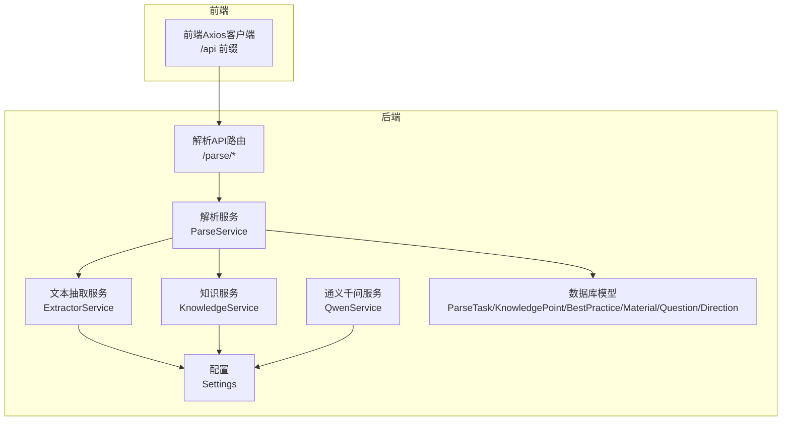
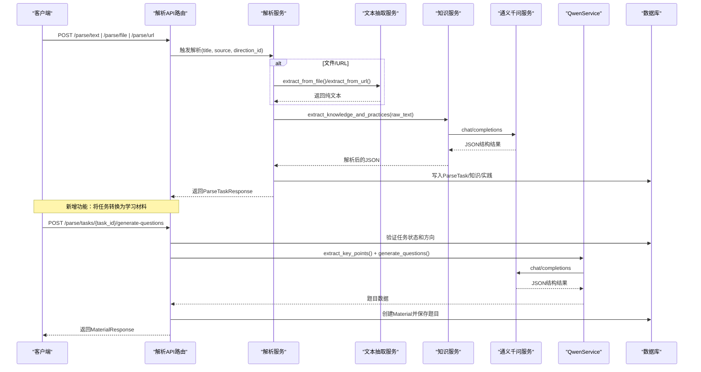
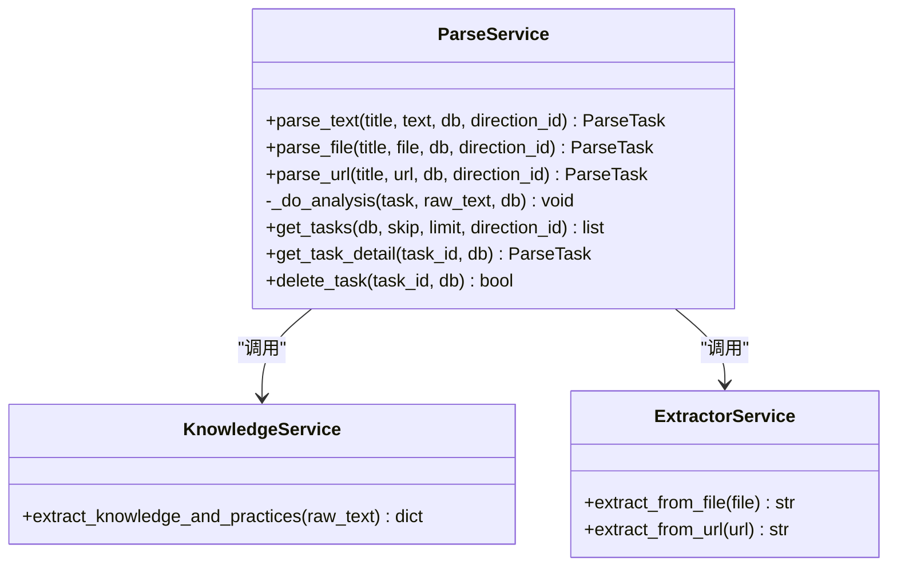
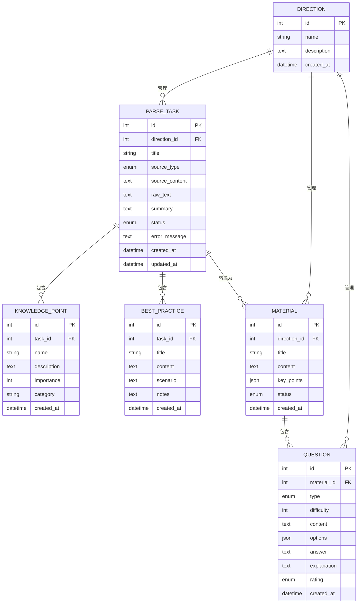
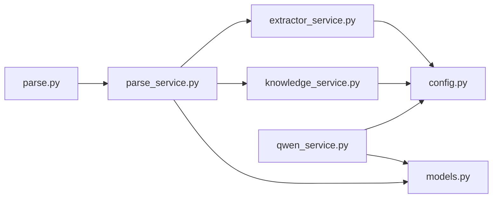

# 内容解析API

<cite>
**本文引用的文件**
- [backend/app/api/parse.py](file://backend/app/api/parse.py)
- [backend/app/services/parse_service.py](file://backend/app/services/parse_service.py)
- [backend/app/services/extractor_service.py](file://backend/app/services/extractor_service.py)
- [backend/app/services/knowledge_service.py](file://backend/app/services/knowledge_service.py)
- [backend/app/services/qwen_service.py](file://backend/app/services/qwen_service.py)
- [backend/app/models/models.py](file://backend/app/models/models.py)
- [backend/app/schemas/schemas.py](file://backend/app/schemas/schemas.py)
- [backend/app/core/config.py](file://backend/app/core/config.py)
- [frontend/src/api/index.js](file://frontend/src/api/index.js)
- [backend/test_full_flow.py](file://backend/test_full_flow.py)
</cite>

## 更新摘要
**变更内容**
- 新增任务方向管理功能：支持更新解析任务的学习方向
- 新增自动化题目生成功能：支持将解析任务转换为学习材料并自动生成题目
- 新增QwenService服务：专门处理知识点提取和题目生成
- 扩展数据模型：新增Material、Question、Direction等模型支持学习材料管理
- 增强AI服务集成：QwenService提供更专业的学习材料处理能力

## 目录
1. [简介](#简介)
2. [项目结构](#项目结构)
3. [核心组件](#核心组件)
4. [架构总览](#架构总览)
5. [详细组件分析](#详细组件分析)
6. [依赖关系分析](#依赖关系分析)
7. [性能考虑](#性能考虑)
8. [故障排查指南](#故障排查指南)
9. [结论](#结论)
10. [附录](#附录)

## 简介
本文件为"内容解析API"的权威文档，覆盖文本内容解析、知识点提取与最佳实践总结的完整接口与实现细节。内容包括：
- 支持的输入格式（纯文本、Markdown、HTML等）与输出结构
- 解析进度报告与实时状态更新机制
- 请求示例与不同内容类型的解析流程
- 与AI服务的集成方式与Prompt设计策略
- 解析质量评估与结果验证机制
- 性能优化建议与大文件处理最佳实践
- 错误处理与重试机制说明

**更新** 本版本新增了任务方向管理功能和自动化题目生成功能，支持将解析任务转换为学习材料，为个人学习管理系统提供完整的知识管理闭环。

## 项目结构
后端采用FastAPI + SQLAlchemy架构，解析API位于路由层，核心解析逻辑由服务层协调，底层依赖AI服务与文本抽取服务。

```mermaid
graph TB
subgraph "前端"
FE["前端Axios客户端<br/>/api 前缀"]
end
subgraph "后端"
API["解析API路由<br/>/parse/*"]
PS["解析服务<br/>ParseService"]
ES["文本抽取服务<br/>ExtractorService"]
KS["知识服务<br/>KnowledgeService"]
QW["通义千问服务<br/>QwenService"]
DB["数据库模型<br/>ParseTask/KnowledgePoint/BestPractice/Material/Question/Direction"]
CFG["配置<br/>Settings"]
end
FE --> API
API --> PS
PS --> ES
PS --> KS
PS --> DB
ES --> CFG
KS --> CFG
QW --> CFG
```

**图表来源**
- [backend/app/api/parse.py](file://backend/app/api/parse.py#L1-L177)
- [backend/app/services/parse_service.py](file://backend/app/services/parse_service.py#L1-L163)
- [backend/app/services/extractor_service.py](file://backend/app/services/extractor_service.py#L1-L123)
- [backend/app/services/knowledge_service.py](file://backend/app/services/knowledge_service.py#L1-L114)
- [backend/app/services/qwen_service.py](file://backend/app/services/qwen_service.py#L1-L156)
- [backend/app/models/models.py](file://backend/app/models/models.py#L1-L223)
- [backend/app/core/config.py](file://backend/app/core/config.py#L1-L34)

## 核心组件
- 解析API路由：提供文本、文件、URL三种输入入口，以及任务列表查询、详情查询、删除和方向管理能力。
- 解析服务：协调文本抽取与AI分析，维护任务状态与持久化。
- 文本抽取服务：支持PDF、DOCX、MD、TXT等文件与网页URL的正文提取。
- 知识服务：封装通义千问调用，负责Prompt构建、JSON解析与容错。
- QwenService：专门处理学习材料的知识点提取和题目生成，提供更专业的学习内容处理能力。
- 数据模型：定义解析任务、知识点、最佳实践、学习材料、题目、学习方向等实体及枚举。
- 请求/响应模式：定义输入输出结构，确保前后端契约一致。

**更新** 新增QwenService服务和学习材料相关模型，支持完整的学习材料管理功能。

**章节来源**
- [backend/app/api/parse.py](file://backend/app/api/parse.py#L17-L177)
- [backend/app/services/parse_service.py](file://backend/app/services/parse_service.py#L15-L163)
- [backend/app/services/extractor_service.py](file://backend/app/services/extractor_service.py#L20-L123)
- [backend/app/services/knowledge_service.py](file://backend/app/services/knowledge_service.py#L11-L114)
- [backend/app/services/qwen_service.py](file://backend/app/services/qwen_service.py#L10-L156)
- [backend/app/models/models.py](file://backend/app/models/models.py#L63-L223)
- [backend/app/schemas/schemas.py](file://backend/app/schemas/schemas.py#L192-L265)

## 架构总览
解析流程从API入口开始，根据输入类型调用对应抽取器，随后进入AI分析阶段，最后将结果持久化到数据库。新增的QwenService专门处理学习材料的知识点提取和题目生成。

```mermaid
sequenceDiagram
participant C as "客户端"
participant R as "解析API路由"
participant S as "解析服务"
participant E as "文本抽取服务"
participant K as "知识服务"
participant Q as "通义千问服务"
participant M as "QwenService"
participant D as "数据库"
C->>R : POST /parse/text | /parse/file | /parse/url
R->>S : 触发解析(title, source, direction_id)
alt 文件/URL
S->>E : extract_from_file()/extract_from_url()
E-->>S : 返回纯文本
end
S->>K : extract_knowledge_and_practices(raw_text)
K->>Q : chat/completions
Q-->>K : JSON结构结果
K-->>S : 解析后的JSON
S->>D : 写入ParseTask/知识/实践
S-->>R : 返回ParseTaskResponse
Note over C,R : 新增功能：将任务转换为学习材料
C->>R : POST /parse/tasks/{task_id}/generate-questions
R->>D : 验证任务状态和方向
R->>M : extract_key_points() + generate_questions()
M->>Q : chat/completions
Q-->>M : JSON结构结果
M-->>R : 题目数据
R->>D : 创建Material并保存题目
R-->>C : 返回MaterialResponse
```

**图表来源**
- [backend/app/api/parse.py](file://backend/app/api/parse.py#L106-L176)
- [backend/app/services/parse_service.py](file://backend/app/services/parse_service.py#L57-L132)
- [backend/app/services/extractor_service.py](file://backend/app/services/extractor_service.py#L30-L118)
- [backend/app/services/knowledge_service.py](file://backend/app/services/knowledge_service.py#L51-L109)
- [backend/app/services/qwen_service.py](file://backend/app/services/qwen_service.py#L37-L114)

## 详细组件分析

### API接口定义与行为
- 文本解析：POST /parse/text，接收标题、文本与可选方向ID，返回解析任务详情。
- 文件解析：POST /parse/file，接收表单字段title、direction_id与UploadFile，返回解析任务详情。
- URL解析：POST /parse/url，接收标题、URL与可选方向ID，返回解析任务详情。
- 任务列表：GET /parse/tasks，支持分页与方向过滤。
- 任务详情：GET /parse/tasks/{task_id}，返回任务及关联的知识点与最佳实践。
- 任务删除：DELETE /parse/tasks/{task_id}。
- 更新任务方向：PATCH /parse/tasks/{task_id}，更新解析任务的学习方向。
- 生成题目：POST /parse/tasks/{task_id}/generate-questions，将解析任务转换为学习材料并生成题目。

**更新** 新增任务方向管理和自动化题目生成功能，提供完整的学习材料转换能力。

**章节来源**
- [backend/app/api/parse.py](file://backend/app/api/parse.py#L25-L176)
- [backend/app/schemas/schemas.py](file://backend/app/schemas/schemas.py#L194-L265)

### 解析服务（ParseService）
- 统一调度：parse_text/parse_file/parse_url均先创建任务并置为PENDING，再异步执行分析。
- AI分析：调用知识服务提取摘要、知识点与最佳实践，并持久化。
- 状态管理：PROCESSING/COMPLETED/FAILED，失败时记录错误信息。
- 查询与删除：提供任务列表、详情与级联删除。

```mermaid
classDiagram
class ParseService {
+parse_text(title, text, db, direction_id) ParseTask
+parse_file(title, file, db, direction_id) ParseTask
+parse_url(title, url, db, direction_id) ParseTask
-_do_analysis(task, raw_text, db) void
+get_tasks(db, skip, limit, direction_id) list
+get_task_detail(task_id, db) ParseTask
+delete_task(task_id, db) bool
}
class KnowledgeService {
+extract_knowledge_and_practices(raw_text) dict
}
class ExtractorService {
+extract_from_file(file) str
+extract_from_url(url) str
}
ParseService --> KnowledgeService : "调用"
ParseService --> ExtractorService : "调用"
```

**图表来源**
- [backend/app/services/parse_service.py](file://backend/app/services/parse_service.py#L15-L163)
- [backend/app/services/knowledge_service.py](file://backend/app/services/knowledge_service.py#L11-L114)
- [backend/app/services/extractor_service.py](file://backend/app/services/extractor_service.py#L20-L123)

**章节来源**
- [backend/app/services/parse_service.py](file://backend/app/services/parse_service.py#L15-L163)

### 文本抽取服务（ExtractorService）
- 文件支持：PDF、DOCX、MD、TXT；校验扩展名与大小限制；临时文件解析后清理。
- 编码兼容：尝试utf-8/gbk/gb2312/latin-1；失败则报错。
- URL抓取：使用BeautifulSoup解析HTML，移除脚本、样式等无关标签，提取正文。
- 异常处理：空内容、不支持格式、超限等均抛出明确错误。

**章节来源**
- [backend/app/services/extractor_service.py](file://backend/app/services/extractor_service.py#L20-L123)
- [backend/app/core/config.py](file://backend/app/core/config.py#L21-L24)

### 知识服务（KnowledgeService）
- Prompt设计：要求输出JSON，包含摘要、知识点与最佳实践三部分。
- 温度参数：推理稳定性控制；JSON解析失败时返回默认结构。
- 容错处理：去除代码块标记后尝试解析，失败记录日志并降级。

**章节来源**
- [backend/app/services/knowledge_service.py](file://backend/app/services/knowledge_service.py#L11-L114)

### QwenService（新增）
- 知识点提取：专门针对学习材料的领域化知识点提取，支持指定学习方向。
- 题目生成：基于知识点生成多类型题目，支持单选、多选、判断、简答等题型。
- 评分评估：提供主观题答案的智能评分和反馈。
- Prompt优化：针对教育场景的专用Prompt设计，确保输出质量。

**更新** 新增QwenService服务，专门处理学习材料的知识点提取和题目生成。

**章节来源**
- [backend/app/services/qwen_service.py](file://backend/app/services/qwen_service.py#L10-L156)

### 数据模型与响应结构
- 解析任务：包含来源类型、原始文本、摘要、状态、错误信息等。
- 知识点：名称、描述、重要度、分类。
- 最佳实践：标题、内容、适用场景、注意事项。
- 学习材料：包含方向ID、标题、内容、核心知识点、状态等。
- 题目：包含类型、难度、内容、选项、答案、解析等。
- 学习方向：包含名称、描述等基本信息。
- 任务列表与详情：分别对应列表与详情响应模式。

```mermaid
erDiagram
PARSE_TASK {
int id PK
int direction_id FK
string title
enum source_type
text source_content
text raw_text
text summary
enum status
text error_message
datetime created_at
datetime updated_at
}
KNOWLEDGE_POINT {
int id PK
int task_id FK
string name
text description
int importance
string category
datetime created_at
}
BEST_PRACTICE {
int id PK
int task_id FK
string title
text content
text scenario
text notes
datetime created_at
}
MATERIAL {
int id PK
int direction_id FK
string title
text content
json key_points
enum status
datetime created_at
}
QUESTION {
int id PK
int material_id FK
enum type
int difficulty
text content
json options
text answer
text explanation
enum rating
datetime created_at
}
DIRECTION {
int id PK
string name
text description
datetime created_at
}
PARSE_TASK ||--o{ KNOWLEDGE_POINT : "包含"
PARSE_TASK ||--o{ BEST_PRACTICE : "包含"
PARSE_TASK ||--o{ MATERIAL : "转换为"
MATERIAL ||--o{ QUESTION : "包含"
DIRECTION ||--o{ PARSE_TASK : "管理"
DIRECTION ||--o{ MATERIAL : "管理"
DIRECTION ||--o{ QUESTION : "管理"
```

**图表来源**
- [backend/app/models/models.py](file://backend/app/models/models.py#L63-L223)

**章节来源**
- [backend/app/models/models.py](file://backend/app/models/models.py#L63-L223)
- [backend/app/schemas/schemas.py](file://backend/app/schemas/schemas.py#L234-L265)

### 与AI服务的集成与Prompt策略
- 通义千问封装：统一请求头、超时与模型参数；提供JSON解析容错。
- Prompt设计：明确三段式输出（摘要、知识点、最佳实践），约束字段与格式。
- QwenService专用Prompt：针对学习材料的领域化处理，确保知识点提取和题目生成的专业性。
- 与资料处理的差异：资料API使用QwenService进行流式进度上报，解析API直接返回最终结果。

**更新** 新增QwenService的专用Prompt设计，专门处理学习材料的知识点提取和题目生成。

**章节来源**
- [backend/app/services/knowledge_service.py](file://backend/app/services/knowledge_service.py#L51-L109)
- [backend/app/services/qwen_service.py](file://backend/app/services/qwen_service.py#L37-L114)

### 输入格式与输出结构
- 支持的输入格式
  - 纯文本：POST /parse/text
  - 文件：PDF、DOCX、MD、TXT；POST /parse/file
  - URL：POST /parse/url
- 输出结构
  - 任务详情包含：任务ID、标题、来源类型、摘要、状态、错误信息、知识点列表、最佳实践列表等。
  - 知识点与最佳实践包含：名称/标题、描述/内容、重要度/分类/适用场景/注意事项等。
  - 学习材料包含：材料ID、方向ID、标题、内容、核心知识点、状态等。
  - 题目包含：题目ID、材料ID、类型、难度、内容、选项、答案、解析、评价等。

**更新** 新增学习材料和题目的输出结构，支持完整的学习材料管理。

**章节来源**
- [backend/app/services/extractor_service.py](file://backend/app/services/extractor_service.py#L16-L17)
- [backend/app/schemas/schemas.py](file://backend/app/schemas/schemas.py#L194-L265)
- [backend/app/schemas/schemas.py](file://backend/app/schemas/schemas.py#L38-L100)

### 进度报告与实时状态更新
- 解析API当前实现：一次性返回最终结果，不提供SSE流式进度。
- 参考实现：资料API提供SSE流式进度（知识点提取、题目生成、保存等阶段），可作为解析API进度上报的参考模板。
- QwenService：提供异步调用能力，适合长时间运行的AI处理任务。

**更新** 新增QwenService的异步处理能力，支持长时间运行的学习材料处理任务。

**章节来源**
- [backend/app/api/parse.py](file://backend/app/api/parse.py#L106-L176)
- [backend/app/services/qwen_service.py](file://backend/app/services/qwen_service.py#L18-L35)

### 请求示例与流程
- 纯文本解析
  - 方法：POST /parse/text
  - 参数：title、text、direction_id（可选）
  - 结果：返回ParseTaskResponse，包含摘要、知识点与最佳实践
- 文件解析
  - 方法：POST /parse/file（multipart/form-data）
  - 字段：title、direction_id（可选）、file（UploadFile）
  - 结果：返回ParseTaskResponse
- URL解析
  - 方法：POST /parse/url
  - 参数：title、url、direction_id（可选）
  - 结果：返回ParseTaskResponse
- 任务管理
  - 列表：GET /parse/tasks?skip=&limit=&direction_id=
  - 详情：GET /parse/tasks/{task_id}
  - 删除：DELETE /parse/tasks/{task_id}
  - 更新方向：PATCH /parse/tasks/{task_id}，参数：direction_id
- 自动化题目生成
  - 方法：POST /parse/tasks/{task_id}/generate-questions
  - 参数：无
  - 结果：返回MaterialResponse，包含学习材料和生成的题目

**更新** 新增任务方向管理和自动化题目生成功能的完整请求示例。

**章节来源**
- [backend/app/api/parse.py](file://backend/app/api/parse.py#L25-L176)
- [frontend/src/api/index.js](file://frontend/src/api/index.js#L51-L70)
- [backend/app/schemas/schemas.py](file://backend/app/schemas/schemas.py#L194-L265)

### 解析质量评估与结果验证
- Prompt约束：要求严格的JSON结构，便于自动化解析与校验。
- 容错策略：去除代码块标记后解析，失败返回默认结构并记录日志。
- QwenService质量保证：提供领域化的Prompt设计，确保知识点提取和题目生成的专业性。
- 建议：前端可对摘要长度、知识点数量范围、最佳实践条数进行二次校验；后端可增加字段完整性检查。

**更新** 新增QwenService的质量保证机制，专门针对学习材料处理的优化。

**章节来源**
- [backend/app/services/knowledge_service.py](file://backend/app/services/knowledge_service.py#L38-L109)
- [backend/app/services/qwen_service.py](file://backend/app/services/qwen_service.py#L37-L114)

## 依赖关系分析
- API路由依赖解析服务；解析服务依赖抽取服务与知识服务；知识服务依赖QwenService与配置；模型与模式定义贯穿各层。
- 配置项：通义千问API密钥、模型、基础URL、上传目录、文件大小限制等。

```mermaid
graph LR
API["parse.py"] --> PS["parse_service.py"]
PS --> ES["extractor_service.py"]
PS --> KS["knowledge_service.py"]
PS --> DB["models.py"]
ES --> CFG["config.py"]
KS --> CFG
QW["qwen_service.py"] --> CFG
QW --> DB
```

**图表来源**
- [backend/app/api/parse.py](file://backend/app/api/parse.py#L1-L14)
- [backend/app/services/parse_service.py](file://backend/app/services/parse_service.py#L1-L12)
- [backend/app/services/extractor_service.py](file://backend/app/services/extractor_service.py#L1-L14)
- [backend/app/services/knowledge_service.py](file://backend/app/services/knowledge_service.py#L1-L8)
- [backend/app/services/qwen_service.py](file://backend/app/services/qwen_service.py#L1-L8)
- [backend/app/models/models.py](file://backend/app/models/models.py#L1-L6)
- [backend/app/core/config.py](file://backend/app/core/config.py#L1-L34)

**章节来源**
- [backend/app/api/parse.py](file://backend/app/api/parse.py#L1-L14)
- [backend/app/services/parse_service.py](file://backend/app/services/parse_service.py#L1-L12)
- [backend/app/services/extractor_service.py](file://backend/app/services/extractor_service.py#L1-L14)
- [backend/app/services/knowledge_service.py](file://backend/app/services/knowledge_service.py#L1-L8)
- [backend/app/services/qwen_service.py](file://backend/app/services/qwen_service.py#L1-L8)
- [backend/app/models/models.py](file://backend/app/models/models.py#L1-L6)
- [backend/app/core/config.py](file://backend/app/core/config.py#L1-L34)

## 性能考虑
- 文件大小限制：默认30MB，避免过大文件导致内存压力与超时。
- 异步调用：抽取与AI调用均为异步，提升并发能力。
- 临时文件清理：解析完成后及时删除临时文件，避免磁盘占用。
- Prompt优化：控制输入长度与JSON约束，减少模型输出冗余。
- QwenService缓存：利用LRU缓存机制，减少重复配置加载开销。
- 建议：对长文档可分段处理并聚合结果；对高并发场景引入队列与异步任务。

**更新** 新增QwenService的性能优化考虑，包括缓存机制和异步处理。

**章节来源**
- [backend/app/core/config.py](file://backend/app/core/config.py#L21-L24)
- [backend/app/services/extractor_service.py](file://backend/app/services/extractor_service.py#L35-L55)
- [backend/app/services/knowledge_service.py](file://backend/app/services/knowledge_service.py#L19-L36)
- [backend/app/services/qwen_service.py](file://backend/app/services/qwen_service.py#L13-L17)

## 故障排查指南
- 常见错误
  - 文件格式不支持：检查扩展名是否在允许列表内。
  - 文件过大：调整max_file_size或拆分文件。
  - URL抓取失败：确认网络可达、HTML结构与正文提取逻辑。
  - AI解析失败：检查API密钥、模型与基础URL配置；查看日志定位JSON解析问题。
  - API密钥未配置：检查QWEN_API_KEY环境变量设置。
  - 任务状态异常：确保解析任务已完成且有原始文本内容。
- 日志与状态
  - 解析服务在失败时写入FAILED状态与错误信息，便于前端提示与重试。
  - QwenService提供详细的错误日志和回退机制。
- 重试机制
  - 建议：对网络异常与AI超时进行指数退避重试；对格式错误不建议自动重试，需人工修正。

**更新** 新增QwenService相关的故障排查指南，包括API密钥配置和任务状态验证。

**章节来源**
- [backend/app/services/extractor_service.py](file://backend/app/services/extractor_service.py#L23-L28)
- [backend/app/services/parse_service.py](file://backend/app/services/parse_service.py#L72-L78)
- [backend/app/services/knowledge_service.py](file://backend/app/services/knowledge_service.py#L48-L49)
- [backend/app/api/parse.py](file://backend/app/api/parse.py#L122-L124)

## 结论
内容解析API提供了从文本、文件与URL中抽取知识与最佳实践的能力，具备清晰的输入输出契约与完善的错误处理。结合AI服务的Prompt设计与容错策略，能够稳定产出结构化结果。新增的任务方向管理和自动化题目生成功能，使得API能够将解析任务转换为完整的学习材料，为个人学习管理系统提供端到端的知识管理解决方案。未来可在解析API中引入SSE进度上报与异步队列，进一步提升用户体验与系统吞吐量。

**更新** 新增的QwenService和学习材料管理功能，为API提供了更强大的学习内容处理能力，支持完整的知识到学习材料的转换流程。

## 附录

### 接口清单与示例路径
- 文本解析：POST /parse/text
  - 请求示例路径：[backend/app/api/parse.py](file://backend/app/api/parse.py#L25-L31)
  - 响应结构：[backend/app/schemas/schemas.py](file://backend/app/schemas/schemas.py#L248-L265)
- 文件解析：POST /parse/file
  - 请求示例路径：[backend/app/api/parse.py](file://backend/app/api/parse.py#L34-L45)
  - 文件支持：[backend/app/services/extractor_service.py](file://backend/app/services/extractor_service.py#L16-L17)
- URL解析：POST /parse/url
  - 请求示例路径：[backend/app/api/parse.py](file://backend/app/api/parse.py#L48-L54)
- 任务管理：GET/DELETE/PATCH /parse/tasks/*
  - 列表与详情：[backend/app/api/parse.py](file://backend/app/api/parse.py#L57-L84)
  - 更新方向：[backend/app/api/parse.py](file://backend/app/api/parse.py#L87-L103)
- 自动化题目生成：POST /parse/tasks/{task_id}/generate-questions
  - 请求示例路径：[backend/app/api/parse.py](file://backend/app/api/parse.py#L106-L176)
  - 响应结构：[backend/app/schemas/schemas.py](file://backend/app/schemas/schemas.py#L49-L58)

**更新** 新增任务方向管理和自动化题目生成功能的完整接口清单。

### 前端调用参考
- 基础URL与超时：[frontend/src/api/index.js](file://frontend/src/api/index.js#L3-L9)
- 知识解析API调用：[frontend/src/api/index.js](file://frontend/src/api/index.js#L52-L70)

**更新** 新增任务方向管理和自动化题目生成功能的前端调用示例。

### 测试与验证
- 完整流程测试：[backend/test_full_flow.py](file://backend/test_full_flow.py#L1-L56)

**更新** 新增QwenService的完整流程测试，验证知识点提取和题目生成的端到端功能。

### 配置说明
- 通义千问配置：API密钥、模型、基础URL
- 文件处理配置：上传目录、最大文件大小
- QwenService配置：超时设置、温度参数

**更新** 新增QwenService的配置说明，包括超时设置和温度参数控制。

**章节来源**
- [backend/app/core/config.py](file://backend/app/core/config.py#L16-L24)
- [backend/app/services/qwen_service.py](file://backend/app/services/qwen_service.py#L13-L17)
- [backend/test_full_flow.py](file://backend/test_full_flow.py#L1-L56)