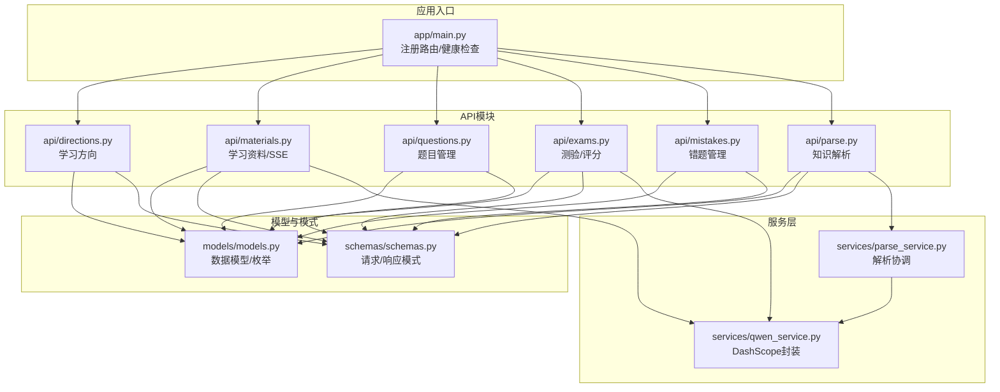
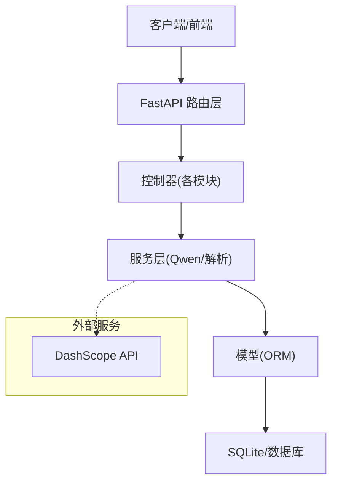
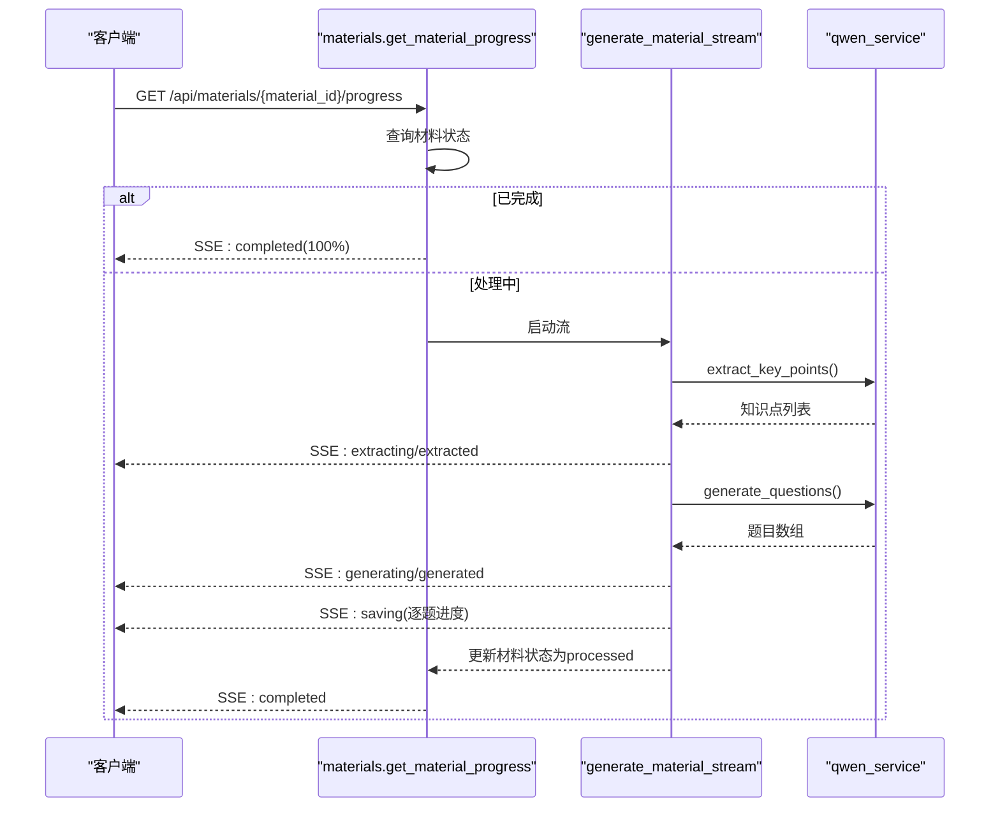
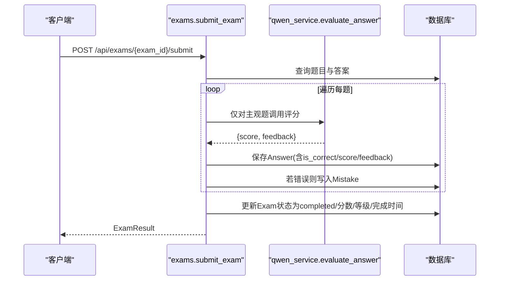
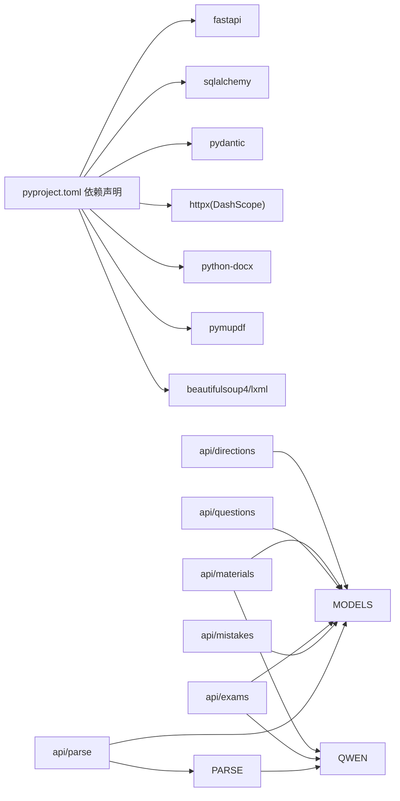
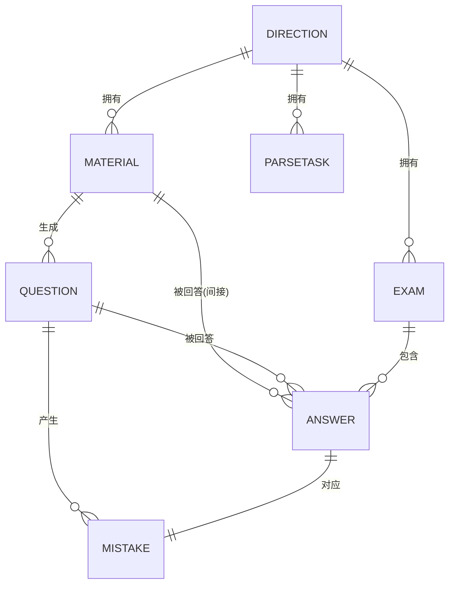

# 后端API文档

<cite>
**本文引用的文件**
- [backend/app/main.py](file://backend/app/main.py)
- [backend/app/api/directions.py](file://backend/app/api/directions.py)
- [backend/app/api/materials.py](file://backend/app/api/materials.py)
- [backend/app/api/questions.py](file://backend/app/api/questions.py)
- [backend/app/api/exams.py](file://backend/app/api/exams.py)
- [backend/app/api/mistakes.py](file://backend/app/api/mistakes.py)
- [backend/app/api/parse.py](file://backend/app/api/parse.py)
- [backend/app/models/models.py](file://backend/app/models/models.py)
- [backend/app/schemas/schemas.py](file://backend/app/schemas/schemas.py)
- [backend/app/core/config.py](file://backend/app/core/config.py)
- [backend/app/services/qwen_service.py](file://backend/app/services/qwen_service.py)
- [backend/app/services/parse_service.py](file://backend/app/services/parse_service.py)
- [backend/pyproject.toml](file://backend/pyproject.toml)
- [backend/test_api.py](file://backend/test_api.py)
- [backend/test_full_flow.py](file://backend/test_full_flow.py)
</cite>

## 目录
1. [简介](#简介)
2. [项目结构](#项目结构)
3. [核心组件](#核心组件)
4. [架构总览](#架构总览)
5. [详细组件分析](#详细组件分析)
6. [依赖关系分析](#依赖关系分析)
7. [性能考虑](#性能考虑)
8. [故障排查指南](#故障排查指南)
9. [结论](#结论)
10. [附录](#附录)

## 简介
本项目为个人学习管理系统的后端API，采用FastAPI框架构建，提供学习方向管理、学习资料与内容解析、题目生成与管理、测验系统、错题管理等核心能力。系统通过SSE（Server-Sent Events）实现资料处理进度的流式推送，并集成通义千问（DashScope）进行知识点提炼、题目生成与主观题评分。

- 版本：0.1.0
- 文档路径：/docs、/redoc
- 健康检查：/health
- 根信息：/

## 项目结构
后端采用按功能模块划分的API路由组织方式，核心模块如下：
- 路由注册：在应用启动时注册各模块路由，统一前缀为/api
- 数据模型：基于SQLAlchemy定义实体及枚举类型
- 数据模式：基于Pydantic定义请求/响应结构
- 服务层：封装外部API调用（通义千问）、解析服务（文本/文件/URL）
- 配置：集中管理应用配置（数据库、DashScope、上传目录等）

图表来源
- [backend/app/main.py](file://backend/app/main.py#L1-L66)
- [backend/app/api/directions.py](file://backend/app/api/directions.py#L1-L51)
- [backend/app/api/materials.py](file://backend/app/api/materials.py#L1-L203)
- [backend/app/api/questions.py](file://backend/app/api/questions.py#L1-L90)
- [backend/app/api/exams.py](file://backend/app/api/exams.py#L1-L240)
- [backend/app/api/mistakes.py](file://backend/app/api/mistakes.py#L1-L90)
- [backend/app/api/parse.py](file://backend/app/api/parse.py#L1-L77)
- [backend/app/models/models.py](file://backend/app/models/models.py#L1-L223)
- [backend/app/schemas/schemas.py](file://backend/app/schemas/schemas.py#L1-L265)
- [backend/app/services/qwen_service.py](file://backend/app/services/qwen_service.py#L1-L156)
- [backend/app/services/parse_service.py](file://backend/app/services/parse_service.py#L1-L163)

章节来源
- [backend/app/main.py](file://backend/app/main.py#L1-L66)
- [backend/pyproject.toml](file://backend/pyproject.toml#L1-L29)

## 核心组件
- 应用入口与路由注册：统一前缀/api，CORS允许跨域，启动时创建数据库表与上传目录
- 数据模型：学习方向、学习资料、题目、测验、答题记录、错题、解析任务、知识点、最佳实践等
- 数据模式：定义请求/响应结构，支持from_attributes映射
- 服务层：
  - DashScope封装：知识点提炼、题目生成、主观题评分
  - 解析服务：协调文本抽取与大模型分析，保存摘要、知识点与最佳实践
- 配置中心：应用名、数据库URL、DashScope密钥/模型/基础地址、上传目录与文件大小限制

章节来源
- [backend/app/main.py](file://backend/app/main.py#L1-L66)
- [backend/app/models/models.py](file://backend/app/models/models.py#L1-L223)
- [backend/app/schemas/schemas.py](file://backend/app/schemas/schemas.py#L1-L265)
- [backend/app/services/qwen_service.py](file://backend/app/services/qwen_service.py#L1-L156)
- [backend/app/services/parse_service.py](file://backend/app/services/parse_service.py#L1-L163)
- [backend/app/core/config.py](file://backend/app/core/config.py#L1-L34)

## 架构总览
系统采用分层架构：
- 表现层：FastAPI路由与响应模型
- 业务层：各模块API控制器
- 服务层：外部API与内部解析协调
- 数据访问层：SQLAlchemy模型与数据库

图表来源
- [backend/app/main.py](file://backend/app/main.py#L1-L66)
- [backend/app/api/materials.py](file://backend/app/api/materials.py#L1-L203)
- [backend/app/api/exams.py](file://backend/app/api/exams.py#L1-L240)
- [backend/app/services/qwen_service.py](file://backend/app/services/qwen_service.py#L1-L156)
- [backend/app/models/models.py](file://backend/app/models/models.py#L1-L223)

## 详细组件分析

### 学习方向管理
- 功能：增删改查学习方向
- 认证与权限：无显式鉴权装饰器
- 错误处理：重复名称、不存在时返回400/404
- SSE：无

接口定义
- GET /api/directions
  - 响应：学习方向数组
- POST /api/directions
  - 请求体：DirectionCreate
  - 响应：DirectionResponse
- GET /api/directions/{direction_id}
  - 响应：DirectionResponse
- DELETE /api/directions/{direction_id}
  - 响应：{"message": "删除成功"}

章节来源
- [backend/app/api/directions.py](file://backend/app/api/directions.py#L1-L51)
- [backend/app/schemas/schemas.py](file://backend/app/schemas/schemas.py#L17-L34)
- [backend/app/models/models.py](file://backend/app/models/models.py#L63-L76)

### 学习资料与题目生成（含SSE）
- 功能：上传资料并同步处理（提炼知识点、生成题目、保存），支持SSE进度流
- 认证与权限：无显式鉴权装饰器
- 错误处理：方向不存在、API密钥未配置、处理异常回滚状态
- SSE：/api/materials/{material_id}/progress

接口定义
- GET /api/materials
  - 查询参数：direction_id(int, 可选)
  - 响应：MaterialResponse数组
- POST /api/materials
  - 请求体：MaterialCreate
  - 响应：MaterialResponse
  - 说明：同步处理，完成后状态为processed
- GET /api/materials/{material_id}/progress
  - 响应：text/event-stream
  - 事件：extracting/extracted/generating/generated/saving/completed/error
- DELETE /api/materials/{material_id}
  - 响应：{"message": "删除成功"}

SSE事件结构
- step: 步骤标识
- progress: 进度百分比
- message: 描述
- data/material_id: 额外数据（如知识点数量、题目数量、材料ID）

章节来源
- [backend/app/api/materials.py](file://backend/app/api/materials.py#L1-L203)
- [backend/app/schemas/schemas.py](file://backend/app/schemas/schemas.py#L38-L58)
- [backend/app/models/models.py](file://backend/app/models/models.py#L78-L93)
- [backend/app/services/qwen_service.py](file://backend/app/services/qwen_service.py#L1-L156)

SSE处理序列图

图表来源
- [backend/app/api/materials.py](file://backend/app/api/materials.py#L164-L185)
- [backend/app/api/materials.py](file://backend/app/api/materials.py#L27-L80)
- [backend/app/services/qwen_service.py](file://backend/app/services/qwen_service.py#L37-L114)

### 题目管理
- 功能：按条件筛选、详情、更新、评价、删除
- 认证与权限：无显式鉴权装饰器
- 错误处理：不存在返回404

接口定义
- GET /api/questions
  - 查询参数：material_id(int, 可选)、direction_id(int, 可选)、question_type(str, 可选)
  - 响应：QuestionResponse数组
- GET /api/questions/{question_id}
  - 响应：QuestionResponse
- PATCH /api/questions/{question_id}
  - 请求体：QuestionUpdate
  - 响应：QuestionResponse
- PATCH /api/questions/{question_id}/rate
  - 请求体：QuestionRateRequest
  - 响应：QuestionResponse
- DELETE /api/questions/{question_id}
  - 响应：{"message": "删除成功"}

章节来源
- [backend/app/api/questions.py](file://backend/app/api/questions.py#L1-L90)
- [backend/app/schemas/schemas.py](file://backend/app/schemas/schemas.py#L62-L100)
- [backend/app/models/models.py](file://backend/app/models/models.py#L95-L114)

### 测验系统
- 功能：创建测验（随机抽题）、获取测验详情、提交并评分（客观题精确匹配、主观题AI评分）、查看结果
- 认证与权限：无显式鉴权装饰器
- 错误处理：方向无题、不存在、已完成再次提交、未完成就取结果

接口定义
- GET /api/exams
  - 查询参数：direction_id(int, 可选)、status(str, 可选)
  - 响应：ExamResponse数组
- POST /api/exams
  - 请求体：ExamCreate
  - 响应：ExamWithQuestions
- GET /api/exams/{exam_id}
  - 响应：ExamWithQuestions
- POST /api/exams/{exam_id}/submit
  - 请求体：ExamSubmit
  - 响应：ExamResult
- GET /api/exams/{exam_id}/result
  - 响应：ExamResult

评分规则
- 客观题：答案去空白后完全一致得满分
- 主观题：调用DashScope评分，≥60视为正确

章节来源
- [backend/app/api/exams.py](file://backend/app/api/exams.py#L1-L240)
- [backend/app/schemas/schemas.py](file://backend/app/schemas/schemas.py#L103-L169)
- [backend/app/models/models.py](file://backend/app/models/models.py#L116-L153)
- [backend/app/services/qwen_service.py](file://backend/app/services/qwen_service.py#L115-L151)

测验提交序列图

图表来源
- [backend/app/api/exams.py](file://backend/app/api/exams.py#L127-L217)
- [backend/app/services/qwen_service.py](file://backend/app/services/qwen_service.py#L115-L151)
- [backend/app/models/models.py](file://backend/app/models/models.py#L136-L169)

### 错题管理
- 功能：按方向与掌握状态筛选、详情、更新（掌握状态/复习次数自增）、删除
- 认证与权限：无显式鉴权装饰器
- 错误处理：不存在返回404

接口定义
- GET /api/mistakes
  - 查询参数：direction_id(int, 可选)、mastered(bool, 可选)
  - 响应：MistakeResponse数组（包含question关联）
- GET /api/mistakes/{mistake_id}
  - 响应：MistakeResponse（包含question关联）
- PATCH /api/mistakes/{mistake_id}
  - 请求体：MistakeUpdate
  - 响应：MistakeResponse
- DELETE /api/mistakes/{mistake_id}
  - 响应：{"message": "删除成功"}

章节来源
- [backend/app/api/mistakes.py](file://backend/app/api/mistakes.py#L1-L90)
- [backend/app/schemas/schemas.py](file://backend/app/schemas/schemas.py#L173-L191)
- [backend/app/models/models.py](file://backend/app/models/models.py#L155-L169)

### 知识解析（文本/文件/URL）
- 功能：解析纯文本、上传文件、解析URL，支持任务列表、详情、删除；内部调用解析服务与DashScope
- 认证与权限：无显式鉴权装饰器
- 错误处理：空输入、不存在返回400/404

接口定义
- POST /api/parse/text
  - 请求体：ParseTextRequest
  - 响应：ParseTaskResponse
- POST /api/parse/file
  - 表单：title、direction_id、file
  - 响应：ParseTaskResponse
- POST /api/parse/url
  - 请求体：ParseUrlRequest
  - 响应：ParseTaskResponse
- GET /api/parse/tasks
  - 查询参数：skip(int)、limit(int)、direction_id(int, 可选)
  - 响应：TaskListResponse数组
- GET /api/parse/tasks/{task_id}
  - 响应：ParseTaskResponse
- DELETE /api/parse/tasks/{task_id}
  - 响应：{"message": "删除成功"}

章节来源
- [backend/app/api/parse.py](file://backend/app/api/parse.py#L1-L77)
- [backend/app/schemas/schemas.py](file://backend/app/schemas/schemas.py#L194-L265)
- [backend/app/services/parse_service.py](file://backend/app/services/parse_service.py#L1-L163)

## 依赖关系分析
- 外部依赖：FastAPI、SQLAlchemy、Pydantic、DashScope(httpx)、文件解析库(pymupdf/docx/beautifulsoup/lxml)
- 内部耦合：API层依赖模型与模式；服务层依赖配置；资料与测验模块依赖DashScope；解析模块依赖抽取与知识服务

图表来源
- [backend/pyproject.toml](file://backend/pyproject.toml#L1-L29)
- [backend/app/api/directions.py](file://backend/app/api/directions.py#L1-L51)
- [backend/app/api/materials.py](file://backend/app/api/materials.py#L1-L203)
- [backend/app/api/questions.py](file://backend/app/api/questions.py#L1-L90)
- [backend/app/api/exams.py](file://backend/app/api/exams.py#L1-L240)
- [backend/app/api/mistakes.py](file://backend/app/api/mistakes.py#L1-L90)
- [backend/app/api/parse.py](file://backend/app/api/parse.py#L1-L77)
- [backend/app/services/qwen_service.py](file://backend/app/services/qwen_service.py#L1-L156)
- [backend/app/services/parse_service.py](file://backend/app/services/parse_service.py#L1-L163)

章节来源
- [backend/pyproject.toml](file://backend/pyproject.toml#L1-L29)

## 性能考虑
- 异步与并发
  - 资料处理与测验评分使用异步调用DashScope，避免阻塞
  - SSE流式返回处理进度，降低长耗时请求的等待成本
- 数据库优化
  - 使用joinedload加载关联（错题详情），减少N+1查询
  - 条件查询时尽量使用索引列（如direction_id、material_id）
- 外部服务
  - DashScope调用设置合理超时，避免长时间挂起
  - 对返回结果做健壮解析，失败时降级为默认值
- 文件解析
  - 限制上传文件大小，避免过大文件导致内存压力
- 缓存与复用
  - 配置中心使用LRU缓存获取Settings实例
- 最佳实践
  - 在生产环境开启CORS白名单，避免“*”
  - 对敏感操作（如删除）建议增加鉴权中间件
  - 对高频接口增加限流策略

[本节为通用性能建议，不直接分析具体文件]

## 故障排查指南
- 常见错误码
  - 400：参数非法（如空文本、空URL、方向无题）
  - 404：资源不存在（方向/资料/题目/测验/错题/任务）
  - 500：服务器内部错误（如DashScope密钥未配置、处理异常）
- DashScope相关
  - 检查QWEN_API_KEY是否配置
  - 确认QWEN_MODEL与QWEN_BASE_URL正确
  - 观察SSE流是否正常返回error事件
- 资料处理
  - 若状态长期为pending，检查SSE流是否被消费
  - 处理失败会回滚状态为failed，可查看错误信息
- 测验评分
  - 主观题评分失败会返回默认结果，建议重试或检查输入格式
- 日志
  - 解析服务与资料处理均有日志记录，便于定位问题

章节来源
- [backend/app/api/materials.py](file://backend/app/api/materials.py#L88-L160)
- [backend/app/api/exams.py](file://backend/app/api/exams.py#L134-L140)
- [backend/app/services/parse_service.py](file://backend/app/services/parse_service.py#L72-L78)
- [backend/app/core/config.py](file://backend/app/core/config.py#L16-L20)

## 结论
本API提供了完整的个人学习管理能力，覆盖从资料解析、题目生成、测验评测到错题巩固的闭环。通过SSE实现流畅的处理体验，结合DashScope实现智能化内容处理。建议在生产环境中完善鉴权、限流与监控，并持续优化数据库索引与外部服务调用策略。

[本节为总结性内容，不直接分析具体文件]

## 附录

### API版本控制与兼容性
- 当前版本：0.1.0
- 版本位置：应用元数据与路由注册处
- 兼容性建议：
  - 新增字段使用可选字段，保持向后兼容
  - 修改现有字段需引入新版本端点或迁移脚本
  - 保持SSE事件结构稳定，新增字段需向后兼容

章节来源
- [backend/app/main.py](file://backend/app/main.py#L19-L25)

### 认证与授权
- 当前实现：无显式鉴权装饰器
- 建议方案：
  - JWT令牌：登录接口返回token，后续请求在Header携带Authorization
  - 中间件：全局校验token有效性与权限
  - 资源级权限：按用户隔离方向/资料/测验等资源

[本节为通用建议，不直接分析具体文件]

### SSE（Server-Sent Events）说明
- 用途：资料处理进度实时推送
- 响应类型：text/event-stream
- 事件格式：JSON对象，包含step、progress、message、data/material_id等字段
- 客户端消费：使用EventSource监听，注意断线重连与错误处理

章节来源
- [backend/app/api/materials.py](file://backend/app/api/materials.py#L164-L185)
- [backend/app/api/materials.py](file://backend/app/api/materials.py#L27-L80)

### 数据模型概览

图表来源
- [backend/app/models/models.py](file://backend/app/models/models.py#L63-L223)

### 示例请求与响应（路径指引）
- 学习方向
  - POST /api/directions
    - 请求体参考：DirectionCreate
    - 响应体参考：DirectionResponse
  - 参考路径：[backend/app/schemas/schemas.py](file://backend/app/schemas/schemas.py#L23-L34)
- 学习资料
  - POST /api/materials
    - 请求体参考：MaterialCreate
    - 响应体参考：MaterialResponse
  - GET /api/materials/{material_id}/progress
    - 响应类型：text/event-stream
  - 参考路径：[backend/app/schemas/schemas.py](file://backend/app/schemas/schemas.py#L44-L58)
- 题目
  - PATCH /api/questions/{question_id}
    - 请求体参考：QuestionUpdate
  - 参考路径：[backend/app/schemas/schemas.py](file://backend/app/schemas/schemas.py#L92-L99)
- 测验
  - POST /api/exams
    - 请求体参考：ExamCreate
  - POST /api/exams/{exam_id}/submit
    - 请求体参考：ExamSubmit
  - 参考路径：[backend/app/schemas/schemas.py](file://backend/app/schemas/schemas.py#L103-L110)
- 错题
  - PATCH /api/mistakes/{mistake_id}
    - 请求体参考：MistakeUpdate
  - 参考路径：[backend/app/schemas/schemas.py](file://backend/app/schemas/schemas.py#L186-L189)
- 知识解析
  - POST /api/parse/file
    - 表单字段：title、direction_id、file
  - 参考路径：[backend/app/api/parse.py](file://backend/app/api/parse.py#L26-L37)