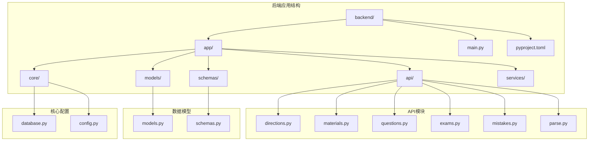
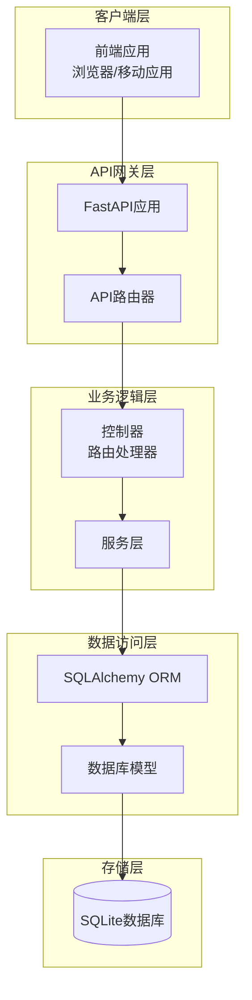
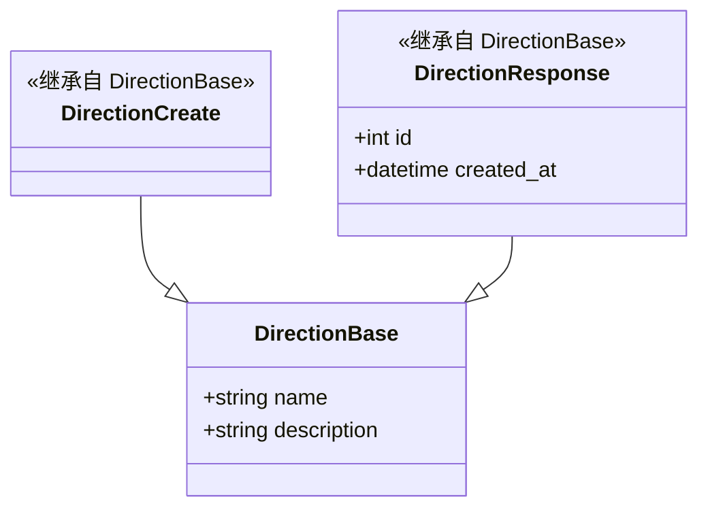
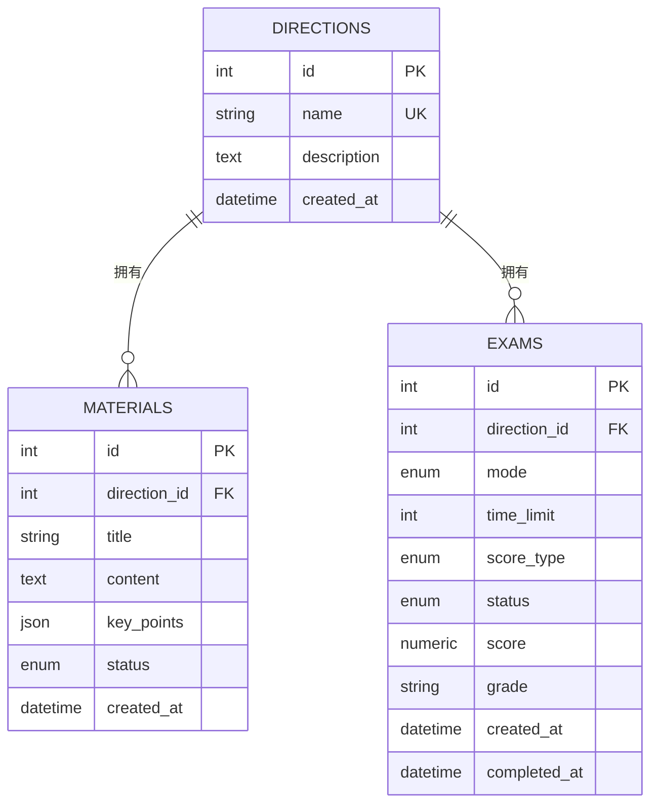
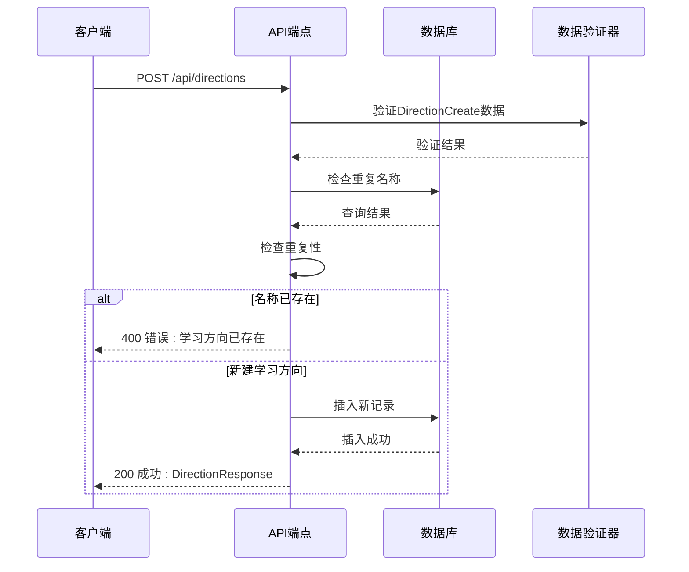
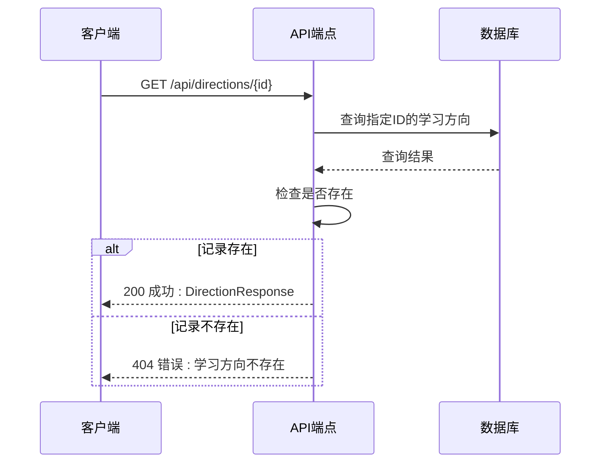
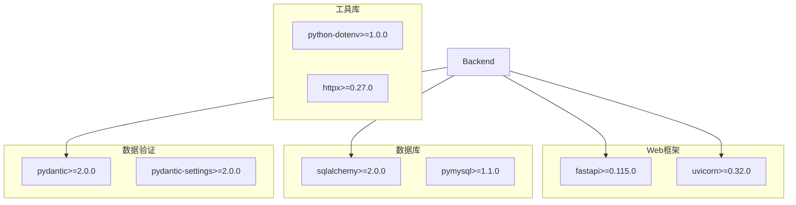
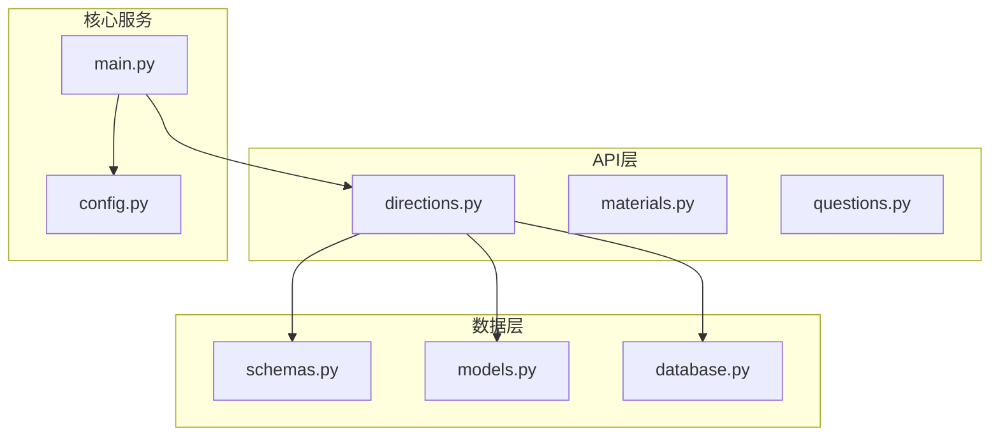

# 学习方向管理API

<cite>
**本文档引用的文件**
- [backend/app/api/directions.py](file://backend/app/api/directions.py)
- [backend/app/schemas/schemas.py](file://backend/app/schemas/schemas.py)
- [backend/app/models/models.py](file://backend/app/models/models.py)
- [backend/app/main.py](file://backend/app/main.py)
- [backend/app/api/__init__.py](file://backend/app/api/__init__.py)
- [backend/pyproject.toml](file://backend/pyproject.toml)
- [backend/app/core/config.py](file://backend/app/core/config.py)
</cite>

## 目录
1. [简介](#简介)
2. [项目结构](#项目结构)
3. [核心组件](#核心组件)
4. [架构概览](#架构概览)
5. [详细组件分析](#详细组件分析)
6. [依赖关系分析](#依赖关系分析)
7. [性能考虑](#性能考虑)
8. [故障排除指南](#故障排除指南)
9. [结论](#结论)

## 简介

学习方向管理API是个人学习管理软件后端系统的核心功能模块，基于FastAPI框架构建，提供完整的RESTful API接口用于管理学习方向。该API支持获取所有学习方向、创建新的学习方向、获取特定学习方向的详细信息以及删除学习方向等核心功能。

系统采用现代化的Python技术栈，使用SQLAlchemy作为ORM框架，Pydantic进行数据验证和序列化，实现了类型安全和自动化的API文档生成功能。

## 项目结构

后端项目采用分层架构设计，主要包含以下关键目录和文件：

**图表来源**
- [backend/app/main.py](file://backend/app/main.py#L1-L66)
- [backend/app/api/__init__.py](file://backend/app/api/__init__.py#L1-L17)

**章节来源**
- [backend/app/main.py](file://backend/app/main.py#L1-L66)
- [backend/pyproject.toml](file://backend/pyproject.toml#L1-L29)

## 核心组件

学习方向管理API的核心组件包括：

### API路由器
- **路由器前缀**: `/api/directions`
- **标签**: "学习方向"
- **HTTP方法支持**: GET、POST、DELETE

### 数据模型
系统使用三层数据模型架构：
1. **数据库模型** (models.py): 定义与数据库表结构对应的类
2. **模式定义** (schemas.py): 使用Pydantic定义数据验证规则
3. **API端点** (directions.py): 实现具体的业务逻辑

### 数据库连接
- **数据库类型**: SQLite (默认配置)
- **连接方式**: SQLAlchemy ORM
- **依赖注入**: FastAPI依赖系统

**章节来源**
- [backend/app/api/directions.py](file://backend/app/api/directions.py#L1-L51)
- [backend/app/schemas/schemas.py](file://backend/app/schemas/schemas.py#L1-L265)
- [backend/app/models/models.py](file://backend/app/models/models.py#L63-L76)

## 架构概览

学习方向管理API采用经典的MVC架构模式，结合现代Python Web开发的最佳实践：

**图表来源**
- [backend/app/main.py](file://backend/app/main.py#L36-L42)
- [backend/app/api/directions.py](file://backend/app/api/directions.py#L8-L8)

## 详细组件分析

### API端点定义

#### 获取所有学习方向
- **HTTP方法**: GET
- **URL路径**: `/api/directions`
- **响应类型**: `list[DirectionResponse]`
- **功能**: 返回数据库中所有的学习方向记录

#### 创建学习方向
- **HTTP方法**: POST
- **URL路径**: `/api/directions`
- **请求体**: `DirectionCreate`
- **响应类型**: `DirectionResponse`
- **功能**: 创建新的学习方向，包含重复性检查

#### 获取学习方向详情
- **HTTP方法**: GET
- **URL路径**: `/api/directions/{direction_id}`
- **路径参数**: `direction_id` (整数)
- **响应类型**: `DirectionResponse`
- **功能**: 根据ID获取特定的学习方向详细信息

#### 删除学习方向
- **HTTP方法**: DELETE
- **URL路径**: `/api/directions/{direction_id}`
- **路径参数**: `direction_id` (整数)
- **响应类型**: JSON对象 `{message: "删除成功"}`
- **功能**: 删除指定的学习方向及其关联数据

**章节来源**
- [backend/app/api/directions.py](file://backend/app/api/directions.py#L11-L50)

### 数据模型定义

#### DirectionBase 基础模型

**图表来源**
- [backend/app/schemas/schemas.py](file://backend/app/schemas/schemas.py#L17-L33)

#### 数据库模型映射

**图表来源**
- [backend/app/models/models.py](file://backend/app/models/models.py#L63-L76)

**章节来源**
- [backend/app/schemas/schemas.py](file://backend/app/schemas/schemas.py#L17-L33)
- [backend/app/models/models.py](file://backend/app/models/models.py#L63-L76)

### API调用流程

#### 创建学习方向流程

**图表来源**
- [backend/app/api/directions.py](file://backend/app/api/directions.py#L17-L29)

#### 获取学习方向详情流程

**图表来源**
- [backend/app/api/directions.py](file://backend/app/api/directions.py#L32-L38)

### 错误处理机制

系统实现了完善的错误处理机制：

#### 400 错误 (重复名称)
- **触发条件**: 创建学习方向时，数据库中已存在相同名称
- **错误消息**: "该学习方向已存在"
- **HTTP状态码**: 400 Bad Request

#### 404 错误 (资源不存在)
- **触发条件**: 获取或删除学习方向时，指定ID不存在
- **错误消息**: "学习方向不存在"
- **HTTP状态码**: 404 Not Found

#### 数据验证错误
- **触发条件**: 请求数据不符合Pydantic模型定义
- **处理方式**: 自动返回422 Unprocessable Entity
- **错误类型**: 字段缺失、类型不匹配、格式错误

**章节来源**
- [backend/app/api/directions.py](file://backend/app/api/directions.py#L20-L23)
- [backend/app/api/directions.py](file://backend/app/api/directions.py#L36-L37)

## 依赖关系分析

### 外部依赖
系统使用以下核心依赖包：

**图表来源**
- [backend/pyproject.toml](file://backend/pyproject.toml#L7-L22)

### 内部模块依赖

**图表来源**
- [backend/app/api/directions.py](file://backend/app/api/directions.py#L1-L8)
- [backend/app/main.py](file://backend/app/main.py#L7-L14)

**章节来源**
- [backend/pyproject.toml](file://backend/pyproject.toml#L1-L29)
- [backend/app/api/__init__.py](file://backend/app/api/__init__.py#L1-L17)

## 性能考虑

### 数据库优化
- **唯一约束**: 学习方向名称字段设置唯一约束，避免重复数据
- **索引策略**: 主键自动建立索引，查询效率高
- **批量操作**: 批量获取学习方向时使用一次性查询

### API性能特性
- **异步支持**: 基于FastAPI的异步处理能力
- **缓存机制**: 配置了LRU缓存的设置加载
- **连接池**: SQLAlchemy连接池管理数据库连接

### 最佳实践建议
1. **批量查询**: 对于大量学习方向的场景，考虑分页查询
2. **数据验证**: 始终在客户端和服务端双重验证数据
3. **错误处理**: 实现重试机制和优雅降级
4. **监控指标**: 添加API调用统计和性能监控

## 故障排除指南

### 常见问题及解决方案

#### 数据库连接问题
**症状**: 启动时出现数据库连接错误
**原因**: 数据库文件权限或路径配置问题
**解决方案**: 
- 检查数据库文件权限
- 验证数据库URL配置
- 确认数据库文件存在

#### API端点不可访问
**症状**: 404 Not Found错误
**原因**: 路由注册或URL路径配置错误
**解决方案**:
- 检查主应用中的路由注册
- 验证API前缀配置
- 确认端点装饰器正确使用

#### 数据验证失败
**症状**: 422 Unprocessable Entity错误
**原因**: 请求数据格式不符合模型定义
**解决方案**:
- 检查必填字段是否完整
- 验证数据类型和格式
- 参考模型定义修正请求体

#### 重复数据错误
**症状**: 400 Bad Request错误，提示学习方向已存在
**原因**: 尝试创建重复的学习方向名称
**解决方案**:
- 检查现有学习方向列表
- 修改学习方向名称
- 使用不同的标识符

**章节来源**
- [backend/app/api/directions.py](file://backend/app/api/directions.py#L20-L23)
- [backend/app/api/directions.py](file://backend/app/api/directions.py#L36-L37)

### 调试技巧
1. **启用调试模式**: 设置`debug=True`获取详细错误信息
2. **查看日志**: 检查服务器端日志输出
3. **使用Swagger UI**: 通过`/docs`端点测试API
4. **单元测试**: 运行测试套件验证功能完整性

## 结论

学习方向管理API提供了完整的学习方向生命周期管理功能，具有以下特点：

### 技术优势
- **类型安全**: 使用Pydantic确保数据验证和类型安全
- **自动文档**: 自动生成API文档，便于集成和测试
- **模块化设计**: 清晰的分层架构便于维护和扩展
- **错误处理**: 完善的错误处理机制提升用户体验

### 功能完整性
- 支持学习方向的基本CRUD操作
- 实现数据重复性验证
- 提供详细的错误信息
- 具备良好的扩展性

### 应用价值
该API为个人学习管理系统提供了坚实的基础，支持学习者创建和管理不同类型的学习方向，为后续的资料管理、题目生成和智能评测功能奠定了基础。通过清晰的API设计和完善的错误处理机制，确保了系统的稳定性和可用性。