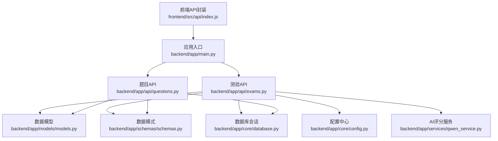
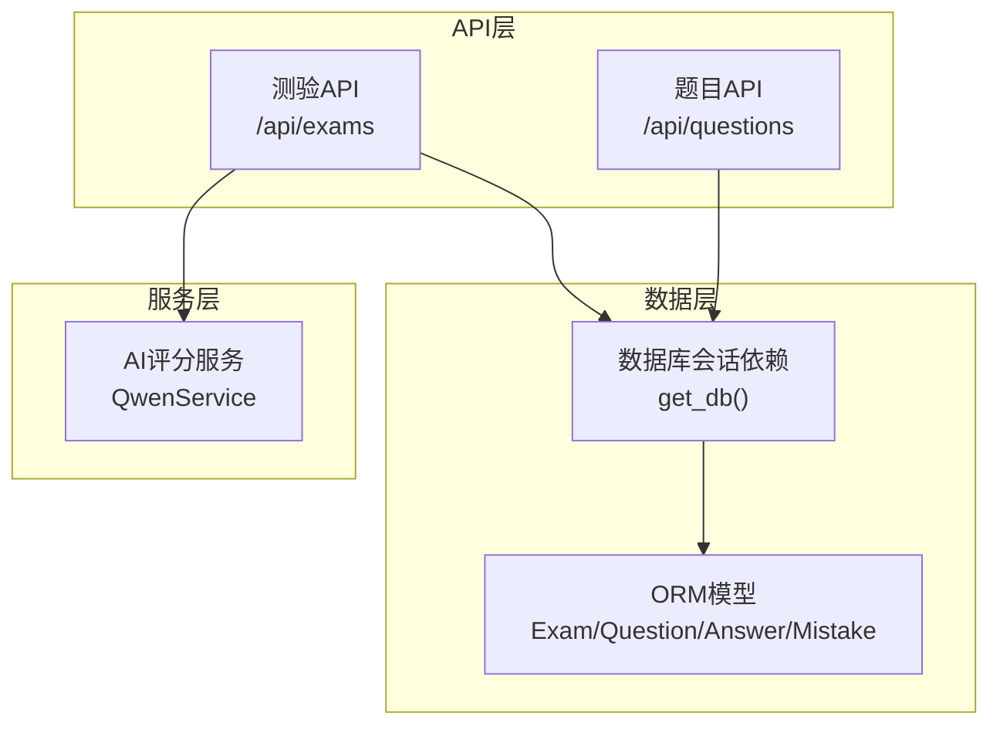
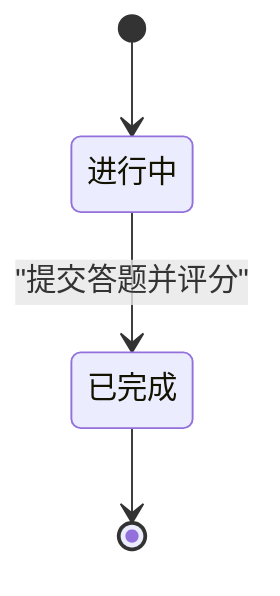
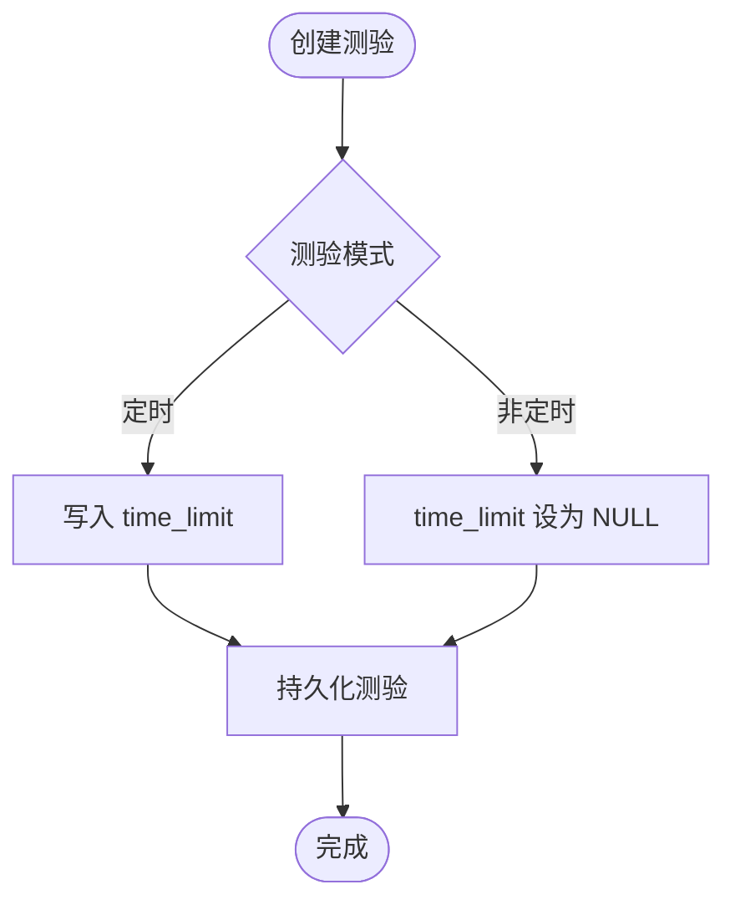
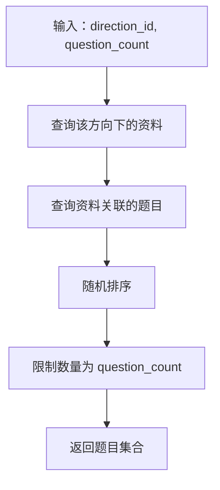
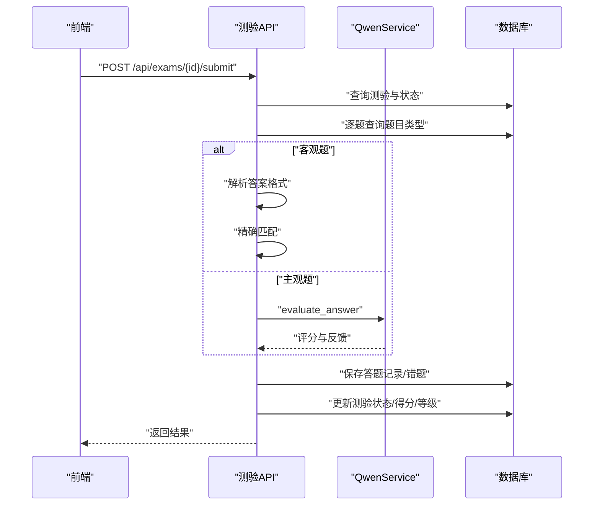
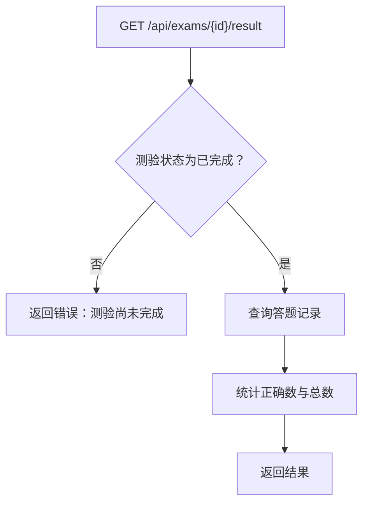
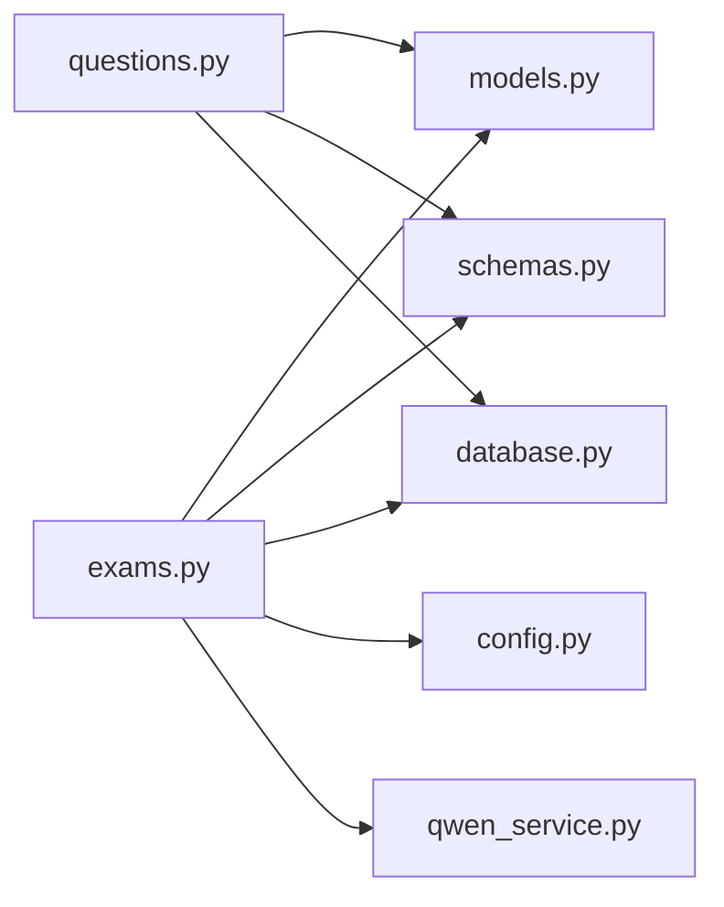

# 测验系统API

<cite>
**本文引用的文件**
- [backend/app/main.py](file://backend/app/main.py)
- [backend/app/api/exams.py](file://backend/app/api/exams.py)
- [backend/app/api/questions.py](file://backend/app/api/questions.py)
- [backend/app/models/models.py](file://backend/app/models/models.py)
- [backend/app/schemas/schemas.py](file://backend/app/schemas/schemas.py)
- [backend/app/core/database.py](file://backend/app/core/database.py)
- [backend/app/core/config.py](file://backend/app/core/config.py)
- [backend/app/services/qwen_service.py](file://backend/app/services/qwen_service.py)
- [frontend/src/api/index.js](file://frontend/src/api/index.js)
</cite>

## 更新摘要
**变更内容**
- 增强了答案评估的准确性，新增多种答案格式解析支持
- 改进了客观题评分机制，支持选项文本解析
- 优化了多选题答案处理，支持逗号分隔的多个选项
- 增强了主观题AI评分的反馈质量

## 目录
1. [简介](#简介)
2. [项目结构](#项目结构)
3. [核心组件](#核心组件)
4. [架构总览](#架构总览)
5. [详细组件分析](#详细组件分析)
6. [依赖关系分析](#依赖关系分析)
7. [性能与并发考虑](#性能与并发考虑)
8. [故障排查指南](#故障排查指南)
9. [结论](#结论)
10. [附录：API参考与示例](#附录api参考与示例)

## 简介
本文件为"测验系统API"的权威文档，覆盖测验全生命周期管理：创建、开始、答题、提交与结果查询；明确定时测验与非定时测验的差异与实现机制；说明测验模板、题目选择策略与随机化选项；给出测验状态管理（待开始、进行中、已完成）的规范；阐述答题提交、自动评分与结果分析的接口设计；并提供并发控制与防作弊机制建议、统计与报告生成的API说明及请求/响应示例。

## 项目结构
后端采用FastAPI + SQLAlchemy架构，API按功能模块划分，核心模块如下：
- 应用入口与路由注册：backend/app/main.py
- 测验API：backend/app/api/exams.py
- 题目API：backend/app/api/questions.py
- 数据模型：backend/app/models/models.py
- 数据模式（Pydantic）：backend/app/schemas/schemas.py
- 数据库与依赖注入：backend/app/core/database.py
- 配置中心：backend/app/core/config.py
- AI评分服务：backend/app/services/qwen_service.py
- 前端API封装：frontend/src/api/index.js

**图表来源**
- [backend/app/main.py](file://backend/app/main.py#L1-L66)
- [backend/app/api/exams.py](file://backend/app/api/exams.py#L1-L284)
- [backend/app/api/questions.py](file://backend/app/api/questions.py#L1-L90)
- [backend/app/models/models.py](file://backend/app/models/models.py#L1-L223)
- [backend/app/schemas/schemas.py](file://backend/app/schemas/schemas.py#L1-L265)
- [backend/app/core/database.py](file://backend/app/core/database.py#L1-L38)
- [backend/app/core/config.py](file://backend/app/core/config.py#L1-L34)
- [backend/app/services/qwen_service.py](file://backend/app/services/qwen_service.py#L1-L156)
- [frontend/src/api/index.js](file://frontend/src/api/index.js#L1-L70)

**章节来源**
- [backend/app/main.py](file://backend/app/main.py#L1-L66)

## 核心组件
- 测验API（/api/exams）
  - 列表查询、创建测验、获取测验详情、提交答题并评分、查询结果
- 题目API（/api/questions）
  - 查询题目、获取详情、更新、评价、删除
- 数据模型
  - Exam、Question、Answer、Mistake等实体及其枚举类型（ExamMode、ScoreType、ExamStatus、QuestionType等）
- 数据模式
  - Pydantic模型用于请求/响应校验与序列化
- 数据库与配置
  - SQLAlchemy会话依赖、数据库引擎、CORS、应用配置
- AI评分服务
  - 基于通义千问的主观题评分与反馈

**章节来源**
- [backend/app/api/exams.py](file://backend/app/api/exams.py#L1-L284)
- [backend/app/api/questions.py](file://backend/app/api/questions.py#L1-L90)
- [backend/app/models/models.py](file://backend/app/models/models.py#L1-L223)
- [backend/app/schemas/schemas.py](file://backend/app/schemas/schemas.py#L1-L265)
- [backend/app/core/database.py](file://backend/app/core/database.py#L1-L38)
- [backend/app/core/config.py](file://backend/app/core/config.py#L1-L34)
- [backend/app/services/qwen_service.py](file://backend/app/services/qwen_service.py#L1-L156)

## 架构总览
测验系统遵循"API层-服务层-数据层"分层设计：
- API层：FastAPI路由，负责HTTP请求/响应、参数校验与业务编排
- 服务层：调用AI服务（QwenService）进行主观题评分
- 数据层：SQLAlchemy ORM模型与数据库会话依赖

**图表来源**
- [backend/app/api/exams.py](file://backend/app/api/exams.py#L1-L284)
- [backend/app/api/questions.py](file://backend/app/api/questions.py#L1-L90)
- [backend/app/services/qwen_service.py](file://backend/app/services/qwen_service.py#L1-L156)
- [backend/app/core/database.py](file://backend/app/core/database.py#L1-L38)
- [backend/app/models/models.py](file://backend/app/models/models.py#L1-L223)

## 详细组件分析

### 测验生命周期与状态管理
- 状态枚举
  - ExamStatus：in_progress（进行中）、completed（已完成）
  - ExamMode：timed（定时）、untimed（非定时）
  - ScoreType：hundred（百分制）、grade（等级制）
- 生命周期关键节点
  - 创建测验：初始化状态为进行中，非定时模式不设置计时限制
  - 开始测验：前端发起获取测验详情，后端返回题目集合
  - 提交测验：后端对客观题精确匹配，主观题调用AI评分；更新状态为已完成
  - 查询结果：仅在已完成状态下允许查询

**图表来源**
- [backend/app/models/models.py](file://backend/app/models/models.py#L42-L46)
- [backend/app/api/exams.py](file://backend/app/api/exams.py#L127-L284)

**章节来源**
- [backend/app/models/models.py](file://backend/app/models/models.py#L30-L46)
- [backend/app/api/exams.py](file://backend/app/api/exams.py#L127-L284)

### 定时测验与非定时测验
- 区别
  - 定时测验：创建时指定time_limit（分钟），后端在创建时写入；前端可据此显示倒计时
  - 非定时测验：创建时忽略time_limit，后端统一设为NULL
- 实现机制
  - 创建接口接收mode与time_limit，非定时模式下后端将time_limit设为None
  - 结果查询与提交流程不依赖计时，仅用于前端体验

**图表来源**
- [backend/app/api/exams.py](file://backend/app/api/exams.py#L47-L115)
- [backend/app/schemas/schemas.py](file://backend/app/schemas/schemas.py#L103-L110)

**章节来源**
- [backend/app/api/exams.py](file://backend/app/api/exams.py#L47-L115)
- [backend/app/schemas/schemas.py](file://backend/app/schemas/schemas.py#L103-L110)

### 题目选择策略与随机化
- 选择策略
  - 依据学习方向（direction_id）筛选资料，再从资料关联的题目中随机抽取
  - 使用SQLAlchemy的func.random()实现随机排序，并限制数量
- 随机化选项
  - 通过limit(data.question_count)控制题目数量
  - 随机排序确保每次创建测验的题目组合不同

**图表来源**
- [backend/app/api/exams.py](file://backend/app/api/exams.py#L47-L115)

**章节来源**
- [backend/app/api/exams.py](file://backend/app/api/exams.py#L47-L115)

### 答题提交与自动评分
- 提交流程
  - 校验测验存在性与状态（已完成不可重复提交）
  - 遍历提交的答案，区分客观题与主观题
  - 客观题：字符串去空格后精确匹配，支持选项文本解析
  - 主观题：调用QwenService.evaluate_answer获取评分与反馈
  - 保存答题记录，错题加入错题本
  - 计算总分、正确数、等级（若启用等级制）
  - 更新测验状态为已完成
- 结果返回
  - 返回总题数、正确数、得分、等级、各题答题记录

**更新** 增强了答案格式解析的准确性，支持多种答案格式

**图表来源**
- [backend/app/api/exams.py](file://backend/app/api/exams.py#L155-L284)
- [backend/app/services/qwen_service.py](file://backend/app/services/qwen_service.py#L115-L151)

**章节来源**
- [backend/app/api/exams.py](file://backend/app/api/exams.py#L155-L284)
- [backend/app/services/qwen_service.py](file://backend/app/services/qwen_service.py#L115-L151)

### 答案格式解析增强
- 单选题与判断题答案解析
  - 支持选项字母格式：A、B、C、D
  - 支持带分隔符格式：A.、A、、A．、A:、A：或"A. xxx"格式
  - 自动转换为对应的选项文本
- 多选题答案解析
  - 支持逗号分隔的多个选项：A,B,C
  - 自动解析每个选项并转换为选项文本
  - 使用集合比较确保顺序无关的正确性
- 通用解析规则
  - 忽略大小写差异
  - 去除前后空格
  - 支持选项文本与选项字母的双向转换

**新增** 答案格式解析功能显著提升了评分准确性

**章节来源**
- [backend/app/api/exams.py](file://backend/app/api/exams.py#L17-L42)
- [backend/app/api/exams.py](file://backend/app/api/exams.py#L188-L200)

### 结果查询与分析
- 查询结果
  - 仅当测验状态为已完成时允许查询
  - 统计正确数，返回测验结果与各题答题记录
- 分析维度
  - 正确率、得分分布、错题分布、知识点命中情况（由AI生成题目时提供）

**图表来源**
- [backend/app/api/exams.py](file://backend/app/api/exams.py#L263-L284)

**章节来源**
- [backend/app/api/exams.py](file://backend/app/api/exams.py#L263-L284)

### 并发控制与防作弊机制
- 并发控制建议
  - 在提交接口上增加幂等键（如exam_id+用户标识）避免重复提交
  - 使用数据库事务保证评分与记录的一致性
  - 对同一测验的并发提交进行锁控制或状态检查
- 防作弊建议
  - 前端禁用右键菜单与开发者工具（仅前端体验限制）
  - 后端对提交时间异常（如极短/极长）进行审计
  - 对主观题评分结果保留AI反馈，便于复核

**章节来源**
- [backend/app/api/exams.py](file://backend/app/api/exams.py#L155-L284)

### 统计与报告生成
- 当前接口能力
  - 提供测验结果查询（正确数、得分、等级）
  - 错题本接口可用于生成复习报告（见错题API）
- 报告建议
  - 按方向/时间维度聚合得分与正确率
  - 导出错题清单与知识点掌握情况

**章节来源**
- [backend/app/api/exams.py](file://backend/app/api/exams.py#L263-L284)
- [backend/app/api/questions.py](file://backend/app/api/questions.py#L1-L90)

## 依赖关系分析
- 模块耦合
  - 测验API依赖数据模型、数据模式、数据库会话与AI服务
  - 题目API依赖数据模型与数据库会话
- 外部依赖
  - 通义千问API（QwenService）
  - SQLAlchemy（数据库访问）
  - FastAPI（路由与依赖注入）

**图表来源**
- [backend/app/api/exams.py](file://backend/app/api/exams.py#L1-L284)
- [backend/app/api/questions.py](file://backend/app/api/questions.py#L1-L90)
- [backend/app/models/models.py](file://backend/app/models/models.py#L1-L223)
- [backend/app/schemas/schemas.py](file://backend/app/schemas/schemas.py#L1-L265)
- [backend/app/core/database.py](file://backend/app/core/database.py#L1-L38)
- [backend/app/core/config.py](file://backend/app/core/config.py#L1-L34)
- [backend/app/services/qwen_service.py](file://backend/app/services/qwen_service.py#L1-L156)

**章节来源**
- [backend/app/api/exams.py](file://backend/app/api/exams.py#L1-L284)
- [backend/app/api/questions.py](file://backend/app/api/questions.py#L1-L90)
- [backend/app/models/models.py](file://backend/app/models/models.py#L1-L223)
- [backend/app/schemas/schemas.py](file://backend/app/schemas/schemas.py#L1-L265)
- [backend/app/core/database.py](file://backend/app/core/database.py#L1-L38)
- [backend/app/core/config.py](file://backend/app/core/config.py#L1-L34)
- [backend/app/services/qwen_service.py](file://backend/app/services/qwen_service.py#L1-L156)

## 性能与并发考虑
- 数据库性能
  - 随机抽题使用func.random()，在大数据量下可能成为瓶颈；建议建立索引或采用替代随机策略
  - 批量插入答题记录时使用flush减少往返
- AI评分延迟
  - 主观题评分依赖外部API，建议前端增加加载态与重试机制
- 并发与一致性
  - 提交接口需在事务内完成评分与状态更新，防止脏读
  - 对同一测验的并发提交进行状态检查或加锁

**章节来源**
- [backend/app/api/exams.py](file://backend/app/api/exams.py#L155-L284)
- [backend/app/services/qwen_service.py](file://backend/app/services/qwen_service.py#L115-L151)

## 故障排查指南
- 常见错误
  - 测验不存在：返回404
  - 测验已完成仍提交：返回400
  - 题目不存在：返回404
  - 无可用题目：创建测验时报错
- 排查步骤
  - 确认方向下是否存在资料与题目
  - 检查测验状态是否为进行中
  - 核对提交答案格式与题型
  - 检查AI服务可用性与网络连通性

**章节来源**
- [backend/app/api/exams.py](file://backend/app/api/exams.py#L155-L284)
- [backend/app/api/questions.py](file://backend/app/api/questions.py#L34-L89)

## 结论
本测验系统API提供了完整的测验生命周期管理能力，支持定时与非定时两种模式、随机题目抽取、客观与主观混合评分，并通过错题本与结果查询支撑学习分析。最新的答案格式解析增强显著提升了评分准确性，支持多种答案格式的智能识别与转换。建议在生产环境中完善并发控制与防作弊机制，优化随机抽题性能，并扩展统计与报告能力。

## 附录：API参考与示例

### 测验API
- 获取测验列表
  - 方法：GET /api/exams
  - 参数：direction_id（可选）、status（可选）
  - 响应：测验列表（ExamResponse[]）
- 创建测验
  - 方法：POST /api/exams
  - 请求体：ExamCreate
  - 响应：包含题目集合的测验详情（ExamWithQuestions）
- 获取测验详情
  - 方法：GET /api/exams/{exam_id}
  - 响应：测验详情（ExamWithQuestions）
- 提交测验并评分
  - 方法：POST /api/exams/{exam_id}/submit
  - 请求体：ExamSubmit（包含答案数组）
  - 响应：测验结果（ExamResult）
- 查询测验结果
  - 方法：GET /api/exams/{exam_id}/result
  - 响应：测验结果（ExamResult）

**章节来源**
- [backend/app/api/exams.py](file://backend/app/api/exams.py#L57-L153)
- [backend/app/api/exams.py](file://backend/app/api/exams.py#L155-L284)
- [backend/app/schemas/schemas.py](file://backend/app/schemas/schemas.py#L103-L169)

### 题目API
- 获取题目列表
  - 方法：GET /api/questions
  - 参数：material_id（可选）、direction_id（可选）、question_type（可选）
  - 响应：题目列表（QuestionResponse[]）
- 获取题目详情
  - 方法：GET /api/questions/{question_id}
  - 响应：题目详情（QuestionResponse）
- 更新题目
  - 方法：PATCH /api/questions/{question_id}
  - 请求体：QuestionUpdate
  - 响应：题目详情（QuestionResponse）
- 评价题目
  - 方法：PATCH /api/questions/{question_id}/rate
  - 请求体：QuestionRateRequest
  - 响应：题目详情（QuestionResponse）
- 删除题目
  - 方法：DELETE /api/questions/{question_id}
  - 响应：{"message": "删除成功"}

**章节来源**
- [backend/app/api/questions.py](file://backend/app/api/questions.py#L11-L89)
- [backend/app/schemas/schemas.py](file://backend/app/schemas/schemas.py#L62-L99)

### 前端调用示例
- 获取测验列表：GET /api/exams?direction_id=1&status=in_progress
- 创建测验：POST /api/exams
  - 请求体示例：{"direction_id": 1, "mode": "timed", "time_limit": 30, "score_type": "hundred", "question_count": 10}
- 获取测验详情：GET /api/exams/1
- 提交测验：POST /api/exams/1/submit
  - 请求体示例：{"answers": [{"question_id": 1, "user_answer": "示例答案"}]}
- 查询结果：GET /api/exams/1/result

**章节来源**
- [frontend/src/api/index.js](file://frontend/src/api/index.js#L35-L42)

### 答案格式解析示例
- 单选题答案格式支持
  - 选项字母：A、B、C、D
  - 带分隔符：A.、A、、A．、A:、A：或"A. xxx"格式
  - 自动转换为选项文本
- 多选题答案格式支持
  - 逗号分隔：A,B,C
  - 自动解析为选项文本集合
  - 集合比较确保顺序无关正确性

**新增** 答案格式解析示例

**章节来源**
- [backend/app/api/exams.py](file://backend/app/api/exams.py#L17-L42)
- [backend/app/api/exams.py](file://backend/app/api/exams.py#L188-L200)