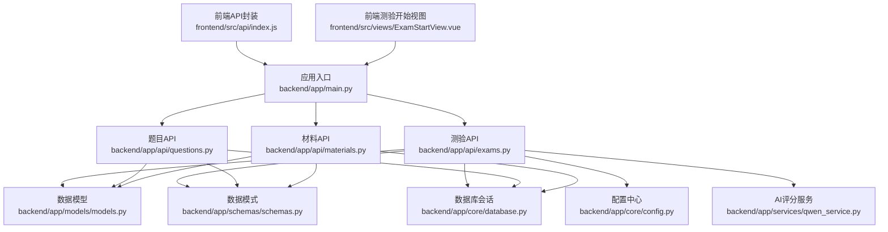
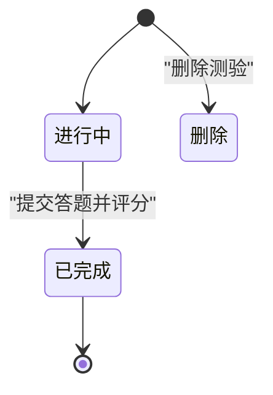
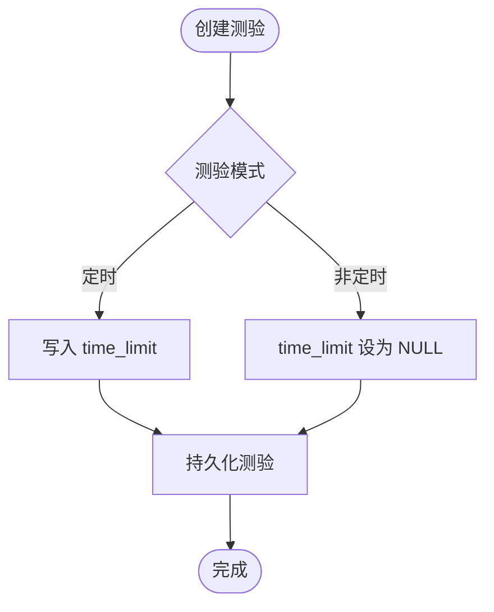
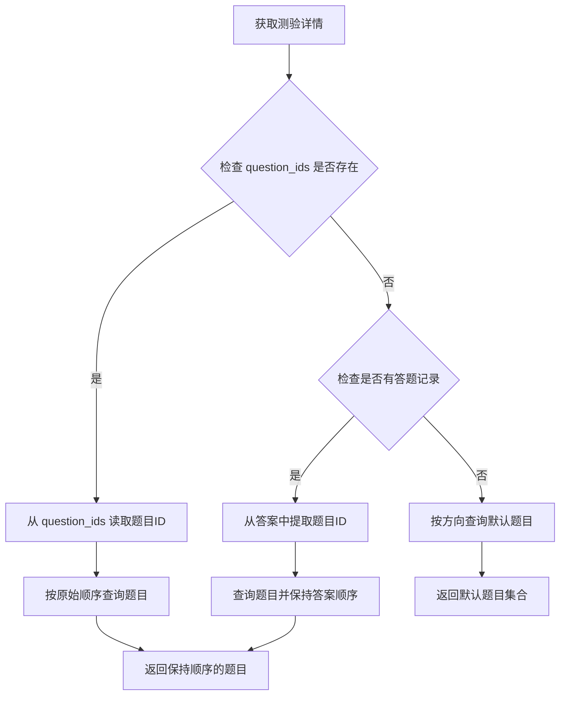
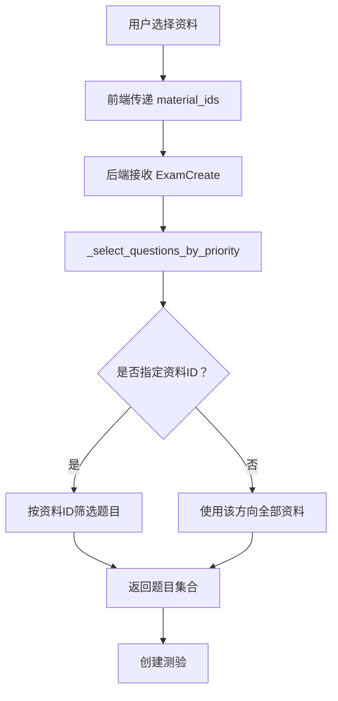
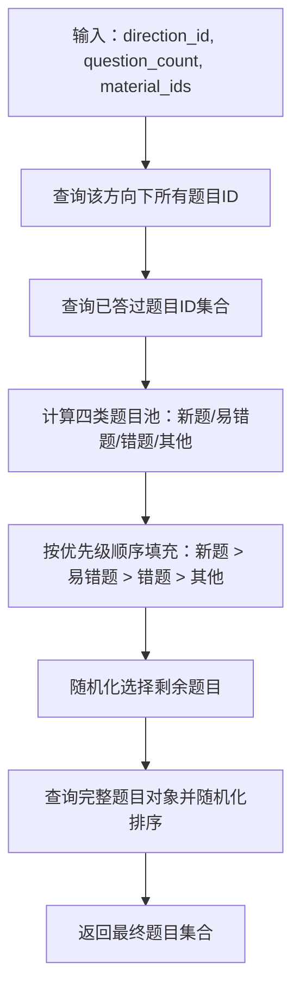
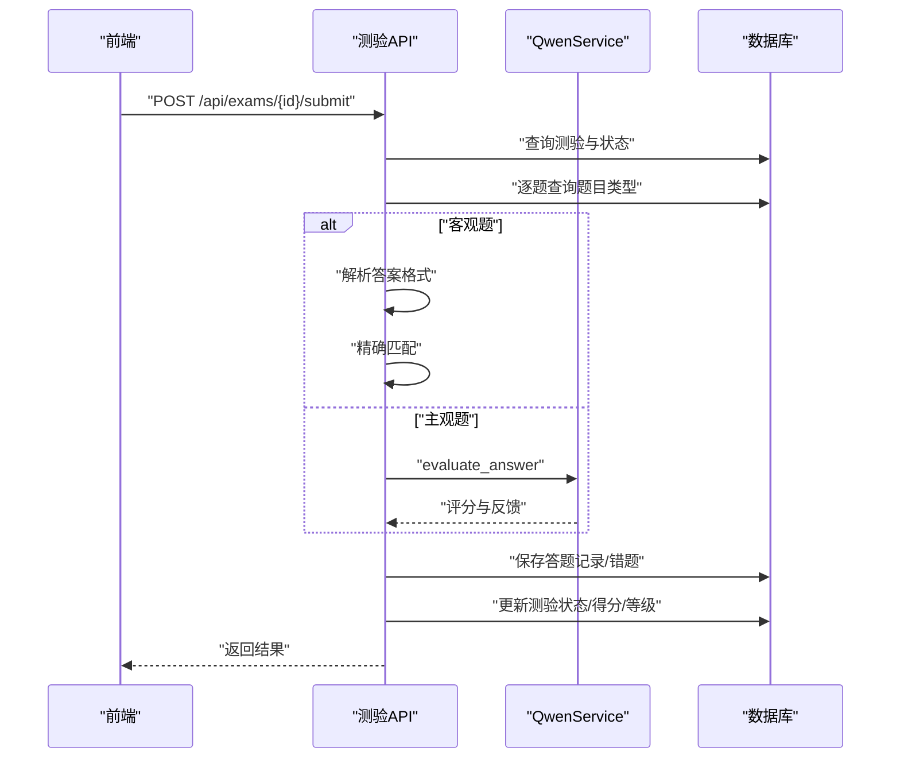
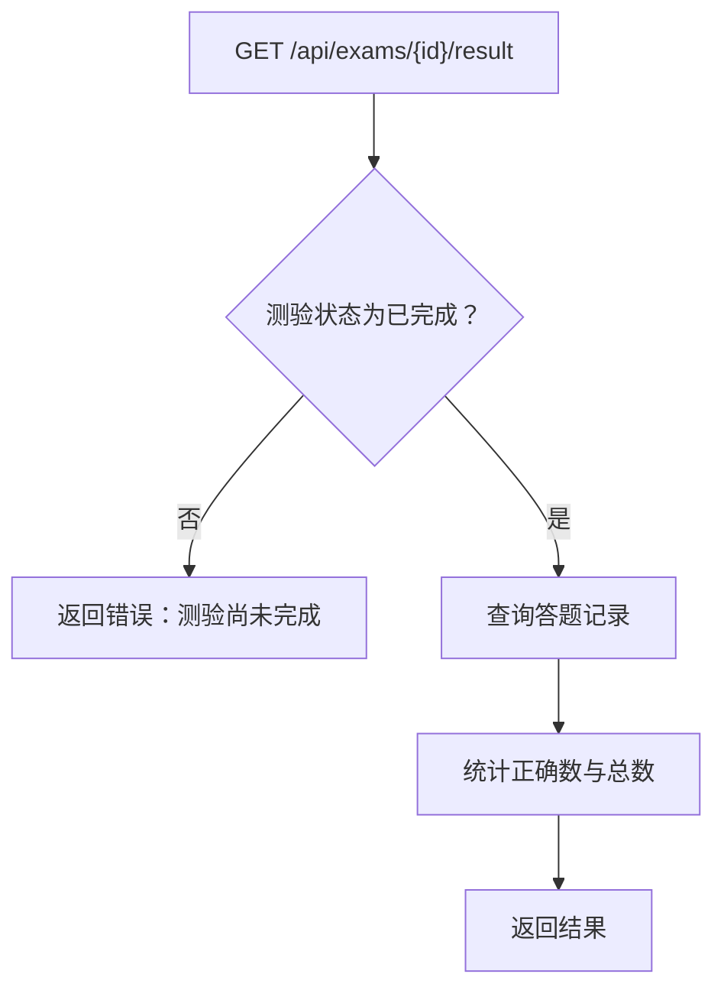
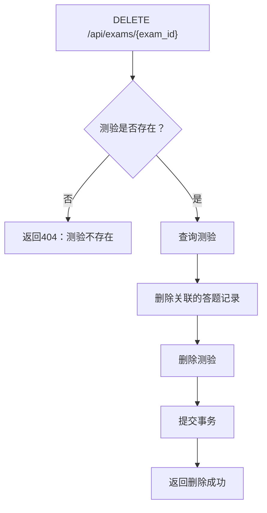
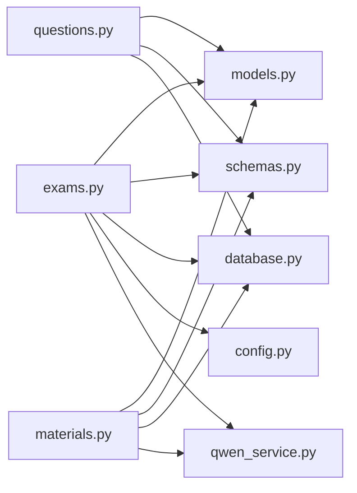

# 测验系统API

<cite>
**本文引用的文件**
- [backend/app/main.py](file://backend/app/main.py)
- [backend/app/api/exams.py](file://backend/app/api/exams.py)
- [backend/app/api/questions.py](file://backend/app/api/questions.py)
- [backend/app/api/materials.py](file://backend/app/api/materials.py)
- [backend/app/models/models.py](file://backend/app/models/models.py)
- [backend/app/schemas/schemas.py](file://backend/app/schemas/schemas.py)
- [backend/app/core/database.py](file://backend/app/core/database.py)
- [backend/app/core/config.py](file://backend/app/core/config.py)
- [backend/app/services/qwen_service.py](file://backend/app/services/qwen_service.py)
- [frontend/src/api/index.js](file://frontend/src/api/index.js)
- [frontend/src/views/ExamStartView.vue](file://frontend/src/views/ExamStartView.vue)
</cite>

## 更新摘要
**变更内容**
- 新增DELETE /exams/{exam_id}端点，支持删除测验及其关联的答题记录
- 优化_question_selection_by_priority函数，改进了优先级选题算法的实现
- 增强了删除功能的级联处理，确保数据完整性
- 改进了智能优先级选题算法，提升学习效果优化的题目选择策略
- **新增question_ids持久化机制**：在测验创建时持久化选中的题目ID，获取测验详情时优先从question_ids读取并保持原始顺序
- **新增多层数据源回退机制**：从question_ids到已有答案再到方向查询的三层回退策略
- **新增材料选择功能**：后端 ExamCreate 模型新增 material_ids 字段，前端 ExamStartView 新增材料选择功能，支持按特定资料创建测验

## 目录
1. [简介](#简介)
2. [项目结构](#项目结构)
3. [核心组件](#核心组件)
4. [架构总览](#架构总览)
5. [详细组件分析](#详细组件分析)
6. [依赖关系分析](#依赖关系分析)
7. [性能与并发考虑](#性能与并发考虑)
8. [故障排查指南](#故障排查指南)
9. [结论](#结论)
10. [附录：API参考与示例](#附录api参考与示例)

## 简介
本文件为"测验系统API"的权威文档，覆盖测验全生命周期管理：创建、开始、答题、提交与结果查询；明确定时测验与非定时测验的差异与实现机制；说明测验模板、题目选择策略与随机化选项；给出测验状态管理（待开始、进行中、已完成）的规范；阐述答题提交、自动评分与结果分析的接口设计；并提供并发控制与防作弊机制建议、统计与报告生成的API说明及请求/响应示例。

**更新** 新增智能优先级选题算法，实现学习效果优化的题目选择策略；新增测验删除功能，支持完整的数据清理；新增question_ids持久化机制，确保题目顺序一致性；新增多层数据源回退机制，增强系统可靠性；新增材料选择功能，支持按特定资料创建测验

## 项目结构
后端采用FastAPI + SQLAlchemy架构，API按功能模块划分，核心模块如下：
- 应用入口与路由注册：backend/app/main.py
- 测验API：backend/app/api/exams.py
- 题目API：backend/app/api/questions.py
- 材料API：backend/app/api/materials.py
- 数据模型：backend/app/models/models.py
- 数据模式（Pydantic）：backend/app/schemas/schemas.py
- 数据库与依赖注入：backend/app/core/database.py
- 配置中心：backend/app/core/config.py
- AI评分服务：backend/app/services/qwen_service.py
- 前端API封装：frontend/src/api/index.js

```mermaid
graph TB
A["应用入口<br/>backend/app/main.py"] --> B["测验API<br/>backend/app/api/exams.py"]
A --> C["题目API<br/>backend/app/api/questions.py"]
A --> D["材料API<br/>backend/app/api/materials.py"]
B --> E["数据模型<br/>backend/app/models/models.py"]
C --> E
D --> E
B --> F["数据模式<br/>backend/app/schemas/schemas.py"]
C --> F
D --> F
B --> G["数据库会话<br/>backend/app/core/database.py"]
C --> G
D --> G
B --> H["配置中心<br/>backend/app/core/config.py"]
B --> I["AI评分服务<br/>backend/app/services/qwen_service.py"]
J["前端API封装<br/>frontend/src/api/index.js"] --> A
K["前端测验开始视图<br/>frontend/src/views/ExamStartView.vue"] --> A
```

**图表来源**
- [backend/app/main.py](file://backend/app/main.py#L1-L66)
- [backend/app/api/exams.py](file://backend/app/api/exams.py#L1-L413)
- [backend/app/api/questions.py](file://backend/app/api/questions.py#L1-L90)
- [backend/app/api/materials.py](file://backend/app/api/materials.py#L1-L380)
- [backend/app/models/models.py](file://backend/app/models/models.py#L1-L325)
- [backend/app/schemas/schemas.py](file://backend/app/schemas/schemas.py#L1-L376)
- [backend/app/core/database.py](file://backend/app/core/database.py#L1-L38)
- [backend/app/core/config.py](file://backend/app/core/config.py#L1-L34)
- [backend/app/services/qwen_service.py](file://backend/app/services/qwen_service.py#L1-L156)
- [frontend/src/api/index.js](file://frontend/src/api/index.js#L1-L70)
- [frontend/src/views/ExamStartView.vue](file://frontend/src/views/ExamStartView.vue#L1-L509)

**章节来源**
- [backend/app/main.py](file://backend/app/main.py#L1-L66)

## 核心组件
- 测验API（/api/exams）
  - 列表查询、创建测验、获取测验详情、提交答题并评分、查询结果、删除测验
- 题目API（/api/questions）
  - 查询题目、获取详情、更新、评价、删除
- 材料API（/api/materials）
  - 上传资料、从URL创建、获取资料列表、删除资料、获取处理进度
- 数据模型
  - Exam、Question、Answer、Mistake、Material等实体及其枚举类型（ExamMode、ScoreType、ExamStatus、QuestionType、MaterialStatus等）
- 数据模式
  - Pydantic模型用于请求/响应校验与序列化
- 数据库与配置
  - SQLAlchemy会话依赖、数据库引擎、CORS、应用配置
- AI评分服务
  - 基于通义千问的主观题评分与反馈

**章节来源**
- [backend/app/api/exams.py](file://backend/app/api/exams.py#L1-L413)
- [backend/app/api/questions.py](file://backend/app/api/questions.py#L1-L90)
- [backend/app/api/materials.py](file://backend/app/api/materials.py#L1-L380)
- [backend/app/models/models.py](file://backend/app/models/models.py#L1-L325)
- [backend/app/schemas/schemas.py](file://backend/app/schemas/schemas.py#L1-L376)
- [backend/app/core/database.py](file://backend/app/core/database.py#L1-L38)
- [backend/app/core/config.py](file://backend/app/core/config.py#L1-L34)
- [backend/app/services/qwen_service.py](file://backend/app/services/qwen_service.py#L1-L156)

## 架构总览
测验系统遵循"API层-服务层-数据层"分层设计：
- API层：FastAPI路由，负责HTTP请求/响应、参数校验与业务编排
- 服务层：调用AI服务（QwenService）进行主观题评分
- 数据层：SQLAlchemy ORM模型与数据库会话依赖

```mermaid
graph TB
subgraph "API层"
EX["测验API<br/>/api/exams"]
QN["题目API<br/>/api/questions"]
MT["材料API<br/>/api/materials"]
end
subgraph "服务层"
QW["AI评分服务<br/>QwenService"]
end
subgraph "数据层"
DB["数据库会话依赖<br/>get_db()"]
MD["ORM模型<br/>Exam/Question/Answer/Mistake/Material"]
END
EX --> QW
EX --> DB
QN --> DB
MT --> DB
DB --> MD
```

**图表来源**
- [backend/app/api/exams.py](file://backend/app/api/exams.py#L1-L413)
- [backend/app/api/questions.py](file://backend/app/api/questions.py#L1-L90)
- [backend/app/api/materials.py](file://backend/app/api/materials.py#L1-L380)
- [backend/app/services/qwen_service.py](file://backend/app/services/qwen_service.py#L1-L156)
- [backend/app/core/database.py](file://backend/app/core/database.py#L1-L38)
- [backend/app/models/models.py](file://backend/app/models/models.py#L1-L325)

## 详细组件分析

### 测验生命周期与状态管理
- 状态枚举
  - ExamStatus：in_progress（进行中）、completed（已完成）
  - ExamMode：timed（定时）、untimed（非定时）
  - ScoreType：hundred（百分制）、grade（等级制）
- 生命周期关键节点
  - 创建测验：初始化状态为进行中，非定时模式不设置计时限制
  - 开始测验：前端发起获取测验详情，后端返回题目集合
  - 提交测验：后端对客观题精确匹配，主观题调用AI评分；更新状态为已完成
  - 查询结果：仅在已完成状态下允许查询
  - 删除测验：支持删除测验及其关联的答题记录，确保数据完整性

```mermaid
stateDiagram-v2
[*] --> 进行中
进行中 --> 已完成 : "提交答题并评分"
已完成 --> [*]
[*] --> 删除 : "删除测验"
```

**图表来源**
- [backend/app/models/models.py](file://backend/app/models/models.py#L42-L46)
- [backend/app/api/exams.py](file://backend/app/api/exams.py#L244-L413)

**章节来源**
- [backend/app/models/models.py](file://backend/app/models/models.py#L30-L46)
- [backend/app/api/exams.py](file://backend/app/api/exams.py#L244-L413)

### 定时测验与非定时测验
- 区别
  - 定时测验：创建时指定time_limit（分钟），后端在创建时写入；前端可据此显示倒计时
  - 非定时测验：创建时忽略time_limit，后端统一设为NULL
- 实现机制
  - 创建接口接收mode与time_limit，非定时模式下后端将time_limit设为None
  - 结果查询与提交流程不依赖计时，仅用于前端体验

```mermaid
flowchart TD
Start(["创建测验"]) --> Mode{"测验模式"}
Mode --> |定时| SetLimit["写入 time_limit"]
Mode --> |非定时| NoLimit["time_limit 设为 NULL"]
SetLimit --> Save["持久化测验"]
NoLimit --> Save
Save --> End(["完成"])
```

**图表来源**
- [backend/app/api/exams.py](file://backend/app/api/exams.py#L172-L204)
- [backend/app/schemas/schemas.py](file://backend/app/schemas/schemas.py#L104-L111)

**章节来源**
- [backend/app/api/exams.py](file://backend/app/api/exams.py#L172-L204)
- [backend/app/schemas/schemas.py](file://backend/app/schemas/schemas.py#L104-L111)

### question_ids持久化机制
**更新** 新增question_ids持久化机制，确保题目顺序一致性

- 持久化机制
  - 创建测验时：将选中的题目ID列表持久化到Exam.question_ids字段
  - 数据类型：JSON数组，存储原始选题顺序
  - 保持顺序：通过question_ids字段的顺序来维持题目的原始排列
- 获取测验详情时的多层数据源回退机制
  - 第一层：优先从持久化的question_ids读取题目，保持创建时的顺序
  - 第二层：如果question_ids为空，则从已有答案中获取题目ID
  - 第三层：最终回退到按方向查询的默认策略
- 数据一致性保障
  - 通过question_ids字段确保题目顺序的稳定性
  - 支持历史数据的兼容性处理
  - 防止因数据库查询顺序变化导致的题目顺序不一致

```mermaid
flowchart TD
A["获取测验详情"] --> B{"检查 question_ids 是否存在"}
B --> |是| C["从 question_ids 读取题目ID"]
C --> D["按原始顺序查询题目"]
D --> E["返回保持顺序的题目"]
B --> |否| F{"检查是否有答题记录"}
F --> |是| G["从答案中提取题目ID"]
G --> H["查询题目并保持答案顺序"]
H --> E
F --> |否| I["按方向查询默认题目"]
I --> J["返回默认题目集合"]
```

**图表来源**
- [backend/app/api/exams.py](file://backend/app/api/exams.py#L226-L245)
- [backend/app/models/models.py](file://backend/app/models/models.py#L128)

**章节来源**
- [backend/app/api/exams.py](file://backend/app/api/exams.py#L190-L216)
- [backend/app/api/exams.py](file://backend/app/api/exams.py#L226-L245)
- [backend/app/models/models.py](file://backend/app/models/models.py#L128)

### 材料选择功能
- 功能概述
  - 用户可以选择特定的学习资料进行测验创建
  - 支持多选资料，系统将从选中的资料中抽取题目
  - 不选择资料时，默认使用该方向下的全部资料
- 前端实现
  - ExamStartView.vue 提供资料选择界面
  - 支持复选框选择多个资料
  - 自动加载指定方向下的资料列表
- 后端实现
  - ExamCreate 模型新增 material_ids 字段
  - _select_questions_by_priority 函数支持 material_ids 参数
  - 选题算法根据资料ID列表筛选题目

```mermaid
flowchart TD
A["用户选择资料"] --> B["前端传递 material_ids"]
B --> C["后端接收 ExamCreate"]
C --> D["_select_questions_by_priority"]
D --> E{"是否指定资料ID？"}
E --> |是| F["按资料ID筛选题目"]
E --> |否| G["使用该方向全部资料"]
F --> H["返回题目集合"]
G --> H
H --> I["创建测验"]
```

**图表来源**
- [frontend/src/views/ExamStartView.vue](file://frontend/src/views/ExamStartView.vue#L14-L31)
- [backend/app/schemas/schemas.py](file://backend/app/schemas/schemas.py#L104-L111)
- [backend/app/api/exams.py](file://backend/app/api/exams.py#L84-L161)

**章节来源**
- [frontend/src/views/ExamStartView.vue](file://frontend/src/views/ExamStartView.vue#L14-L31)
- [backend/app/schemas/schemas.py](file://backend/app/schemas/schemas.py#L104-L111)
- [backend/app/api/exams.py](file://backend/app/api/exams.py#L84-L161)

### 智能优先级选题算法
**更新** 新增四层优先级选择策略，替代原有简单随机选择

- 四层优先级策略
  - 新题：从未在任何测验答题记录中出现过的题目
  - 易错题：在错题本中标记为error_prone=True且未掌握的题目
  - 错题：在错题本中但未标记为易错、未掌握的题目
  - 其他：已答过但不在错题本中，或已掌握的题目
- SQL查询逻辑
  - 通过集合运算跟踪答题记录，管理错题本状态
  - 支持复杂的数据关联查询与过滤条件
  - 实现动态权重分配与随机化选择
- 实现机制
  - 逐层填充策略：优先满足高优先级题目，不足时向下层补充
  - 随机化保证题目组合多样性
  - 支持部分题目池为空的情况处理
  - **新增** 支持按资料ID列表筛选题目

```mermaid
flowchart TD
A["输入：direction_id, question_count, material_ids"] --> B["查询该方向下所有题目ID"]
B --> C["查询已答过题目ID集合"]
C --> D["计算四类题目池：新题/易错题/错题/其他"]
D --> E["按优先级顺序填充：新题 > 易错题 > 错题 > 其他"]
E --> F["随机化选择剩余题目"]
F --> G["查询完整题目对象并随机化排序"]
G --> H["返回最终题目集合"]
```

**图表来源**
- [backend/app/api/exams.py](file://backend/app/api/exams.py#L84-L161)

**章节来源**
- [backend/app/api/exams.py](file://backend/app/api/exams.py#L84-L161)

### 答题提交与自动评分
- 提交流程
  - 校验测验存在性与状态（已完成不可重复提交）
  - 遍历提交的答案，区分客观题与主观题
  - 客观题：字符串去空格后精确匹配，支持选项文本解析
  - 主观题：调用QwenService.evaluate_answer获取评分与反馈
  - 保存答题记录，错题加入错题本
  - 计算总分、正确数、等级（若启用等级制）
  - 更新测验状态为已完成
- 结果返回
  - 返回总题数、正确数、得分、等级、各题答题记录

**更新** 增强了答案格式解析的准确性，支持多种答案格式

```mermaid
sequenceDiagram
participant FE as "前端"
participant API as "测验API"
participant SVC as "QwenService"
participant DB as "数据库"
FE->>API : "POST /api/exams/{id}/submit"
API->>DB : "查询测验与状态"
API->>DB : "逐题查询题目类型"
alt "客观题"
API->>API : "解析答案格式"
API->>API : "精确匹配"
else "主观题"
API->>SVC : "evaluate_answer"
SVC-->>API : "评分与反馈"
end
API->>DB : "保存答题记录/错题"
API->>DB : "更新测验状态/得分/等级"
API-->>FE : "返回结果"
```

**图表来源**
- [backend/app/api/exams.py](file://backend/app/api/exams.py#L254-L367)
- [backend/app/services/qwen_service.py](file://backend/app/services/qwen_service.py#L115-L151)

**章节来源**
- [backend/app/api/exams.py](file://backend/app/api/exams.py#L254-L367)
- [backend/app/services/qwen_service.py](file://backend/app/services/qwen_service.py#L115-L151)

### 答案格式解析增强
- 单选题与判断题答案解析
  - 支持选项字母格式：A、B、C、D
  - 支持带分隔符格式：A.、A、A．、A:、A：或"A. xxx"格式
  - 自动转换为对应的选项文本
- 多选题答案解析
  - 支持逗号分隔的多个选项：A,B,C
  - 自动解析每个选项并转换为选项文本
  - 使用集合比较确保顺序无关的正确性
- 通用解析规则
  - 忽略大小写差异
  - 去除前后空格
  - 支持选项文本与选项字母的双向转换

**新增** 答案格式解析功能显著提升了评分准确性

**章节来源**
- [backend/app/api/exams.py](file://backend/app/api/exams.py#L44-L69)
- [backend/app/api/exams.py](file://backend/app/api/exams.py#L277-L289)

### 结果查询与分析
- 查询结果
  - 仅当测验状态为已完成时允许查询
  - 统计正确数，返回测验结果与各题答题记录
- 分析维度
  - 正确率、得分分布、错题分布、知识点命中情况（由AI生成题目时提供）

```mermaid
flowchart TD
A["GET /api/exams/{id}/result"] --> B{"测验状态为已完成？"}
B --> |否| E["返回错误：测验尚未完成"]
B --> |是| C["查询答题记录"]
C --> D["统计正确数与总数"]
D --> F["返回结果"]
```

**图表来源**
- [backend/app/api/exams.py](file://backend/app/api/exams.py#L378-L398)

**章节来源**
- [backend/app/api/exams.py](file://backend/app/api/exams.py#L378-L398)

### 测验删除功能
- 删除接口
  - 方法：DELETE /api/exams/{exam_id}
  - 功能：删除指定的测验及其关联的所有答题记录
  - 级联处理：先删除关联的答题记录，再删除测验本身
- 数据完整性保证
  - 使用数据库事务确保删除操作的一致性
  - 防止孤儿记录的产生
  - 支持幂等删除（重复删除不会报错）

```mermaid
flowchart TD
A["DELETE /api/exams/{exam_id}"] --> B{"测验是否存在？"}
B --> |否| E["返回404：测验不存在"]
B --> |是| C["查询测验"]
C --> D["删除关联的答题记录"]
D --> F["删除测验"]
F --> G["提交事务"]
G --> H["返回删除成功"]
```

**图表来源**
- [backend/app/api/exams.py](file://backend/app/api/exams.py#L401-L412)

**章节来源**
- [backend/app/api/exams.py](file://backend/app/api/exams.py#L401-L412)

### 材料管理功能
- 材料上传
  - 支持文本、文件、URL三种方式上传资料
  - 自动生成核心知识点和题目
  - 支持SSE流式进度监控
- 材料查询
  - 按方向查询资料列表
  - 支持获取处理进度
- 材料删除
  - 删除资料及其关联的所有题目
  - 确保数据完整性

**新增** 材料管理功能完善了测验系统的资料基础

**章节来源**
- [backend/app/api/materials.py](file://backend/app/api/materials.py#L104-L380)
- [backend/app/models/models.py](file://backend/app/models/models.py#L78-L93)

### 并发控制与防作弊机制
- 并发控制建议
  - 在提交接口上增加幂等键（如exam_id+用户标识）避免重复提交
  - 使用数据库事务保证评分与记录的一致性
  - 对同一测验的并发提交进行锁控制或状态检查
- 防作弊建议
  - 前端禁用右键菜单与开发者工具（仅前端体验限制）
  - 后端对提交时间异常（如极短/极长）进行审计
  - 对主观题评分结果保留AI反馈，便于复核

**章节来源**
- [backend/app/api/exams.py](file://backend/app/api/exams.py#L254-L367)

### 统计与报告生成
- 当前接口能力
  - 提供测验结果查询（正确数、得分、等级）
  - 错题本接口可用于生成复习报告（见错题API）
  - 材料API支持资料统计与进度监控
- 报告建议
  - 按方向/时间维度聚合得分与正确率
  - 导出错题清单与知识点掌握情况
  - 按资料维度分析测验表现

**章节来源**
- [backend/app/api/exams.py](file://backend/app/api/exams.py#L378-L398)
- [backend/app/api/questions.py](file://backend/app/api/questions.py#L1-L90)
- [backend/app/api/materials.py](file://backend/app/api/materials.py#L104-L200)

## 依赖关系分析
- 模块耦合
  - 测验API依赖数据模型、数据模式、数据库会话与AI服务
  - 题目API依赖数据模型与数据库会话
  - 材料API依赖数据模型、数据库会话与AI服务
- 外部依赖
  - 通义千问API（QwenService）
  - SQLAlchemy（数据库访问）
  - FastAPI（路由与依赖注入）

```mermaid
graph LR
EX["exams.py"] --> MD["models.py"]
EX --> SC["schemas.py"]
EX --> DB["database.py"]
EX --> CFG["config.py"]
EX --> QW["qwen_service.py"]
QN["questions.py"] --> MD
QN --> SC
QN --> DB
MT["materials.py"] --> MD
MT --> SC
MT --> DB
MT --> QW
```

**图表来源**
- [backend/app/api/exams.py](file://backend/app/api/exams.py#L1-L413)
- [backend/app/api/questions.py](file://backend/app/api/questions.py#L1-L90)
- [backend/app/api/materials.py](file://backend/app/api/materials.py#L1-L380)
- [backend/app/models/models.py](file://backend/app/models/models.py#L1-L325)
- [backend/app/schemas/schemas.py](file://backend/app/schemas/schemas.py#L1-L376)
- [backend/app/core/database.py](file://backend/app/core/database.py#L1-L38)
- [backend/app/core/config.py](file://backend/app/core/config.py#L1-L34)
- [backend/app/services/qwen_service.py](file://backend/app/services/qwen_service.py#L1-L156)

**章节来源**
- [backend/app/api/exams.py](file://backend/app/api/exams.py#L1-L413)
- [backend/app/api/questions.py](file://backend/app/api/questions.py#L1-L90)
- [backend/app/api/materials.py](file://backend/app/api/materials.py#L1-L380)
- [backend/app/models/models.py](file://backend/app/models/models.py#L1-L325)
- [backend/app/schemas/schemas.py](file://backend/app/schemas/schemas.py#L1-L376)
- [backend/app/core/database.py](file://backend/app/core/database.py#L1-L38)
- [backend/app/core/config.py](file://backend/app/core/config.py#L1-L34)
- [backend/app/services/qwen_service.py](file://backend/app/services/qwen_service.py#L1-L156)

## 性能与并发考虑
- 数据库性能
  - 智能优先级选题算法通过集合运算优化查询效率
  - 随机抽题使用func.random()，在大数据量下可能成为瓶颈；建议建立索引或采用替代随机策略
  - 批量插入答题记录时使用flush减少往返
  - **新增** question_ids持久化机制通过JSON字段存储题目ID，查询时使用IN子句优化
  - **新增** 多层数据源回退机制减少不必要的查询开销
  - **新增** 材料ID筛选查询需要适当的索引优化
- AI评分延迟
  - 主观题评分依赖外部API，建议前端增加加载态与重试机制
- 并发与一致性
  - 提交接口需在事务内完成评分与状态更新，防止脏读
  - 对同一测验的并发提交进行状态检查或加锁
  - 删除接口使用数据库事务确保级联删除的一致性
  - 材料上传处理支持异步流式进度监控

**章节来源**
- [backend/app/api/exams.py](file://backend/app/api/exams.py#L84-L161)
- [backend/app/api/exams.py](file://backend/app/api/exams.py#L254-L367)
- [backend/app/api/exams.py](file://backend/app/api/exams.py#L401-L412)
- [backend/app/api/materials.py](file://backend/app/api/materials.py#L176-L200)
- [backend/app/services/qwen_service.py](file://backend/app/services/qwen_service.py#L115-L151)

## 故障排查指南
- 常见错误
  - 测验不存在：返回404
  - 测验已完成仍提交：返回400
  - 题目不存在：返回404
  - 无可用题目：创建测验时报错
  - 删除测验失败：检查是否有外键约束
  - 材料不存在：删除材料时报错
  - 方向不存在：创建材料时报错
  - **新增** question_ids字段为空：检查测验创建流程
  - **新增** 题目顺序不一致：检查question_ids字段的持久化
- 排查步骤
  - 确认方向下是否存在资料与题目
  - 检查测验状态是否为进行中
  - 核对提交答案格式与题型
  - 检查AI服务可用性与网络连通性
  - 确认删除权限与数据完整性
  - **新增** 检查材料ID列表的有效性与存在性
  - **新增** 验证question_ids字段的JSON格式正确性
  - **新增** 确认题目ID在数据库中的存在性

**章节来源**
- [backend/app/api/exams.py](file://backend/app/api/exams.py#L254-L412)
- [backend/app/api/questions.py](file://backend/app/api/questions.py#L34-L89)
- [backend/app/api/materials.py](file://backend/app/api/materials.py#L343-L358)

## 结论
本测验系统API提供了完整的测验生命周期管理能力，支持定时与非定时两种模式、智能优先级题目选择、客观与主观混合评分，并通过错题本与结果查询支撑学习分析。最新的四层优先级选题算法显著提升了学习效果，通过"新题 > 易错题 > 错题 > 其他"的策略实现个性化学习路径。答案格式解析增强进一步提升了评分准确性，支持多种答案格式的智能识别与转换。新增的测验删除功能完善了数据管理能力，确保了数据完整性。**新增的question_ids持久化机制**确保了题目顺序的一致性和可靠性，通过多层数据源回退机制增强了系统的健壮性。**新增的材料选择功能**为用户提供了更精细的学习控制，支持按特定资料创建测验，提升了学习的针对性和有效性。建议在生产环境中完善并发控制与防作弊机制，优化随机抽题性能，并扩展统计与报告能力。

## 附录：API参考与示例

### 测验API
- 获取测验列表
  - 方法：GET /api/exams
  - 参数：direction_id（可选）、status（可选）
  - 响应：测验列表（ExamResponse[]）
- 创建测验
  - 方法：POST /api/exams
  - 请求体：ExamCreate（包含 material_ids 字段）
  - 响应：包含题目集合的测验详情（ExamWithQuestions）
- 获取测验详情
  - 方法：GET /api/exams/{exam_id}
  - 响应：测验详情（ExamWithQuestions）
- 提交测验并评分
  - 方法：POST /api/exams/{exam_id}/submit
  - 请求体：ExamSubmit（包含答案数组）
  - 响应：测验结果（ExamResult）
- 查询测验结果
  - 方法：GET /api/exams/{exam_id}/result
  - 响应：测验结果（ExamResult）
- 删除测验
  - 方法：DELETE /api/exams/{exam_id}
  - 响应：{"message": "删除成功"}

**章节来源**
- [backend/app/api/exams.py](file://backend/app/api/exams.py#L164-L216)
- [backend/app/api/exams.py](file://backend/app/api/exams.py#L254-L398)
- [backend/app/api/exams.py](file://backend/app/api/exams.py#L401-L412)
- [backend/app/schemas/schemas.py](file://backend/app/schemas/schemas.py#L104-L170)

### 题目API
- 获取题目列表
  - 方法：GET /api/questions
  - 参数：material_id（可选）、direction_id（可选）、question_type（可选）
  - 响应：题目列表（QuestionResponse[]）
- 获取题目详情
  - 方法：GET /api/questions/{question_id}
  - 响应：题目详情（QuestionResponse）
- 更新题目
  - 方法：PATCH /api/questions/{question_id}
  - 请求体：QuestionUpdate
  - 响应：题目详情（QuestionResponse）
- 评价题目
  - 方法：PATCH /api/questions/{question_id}/rate
  - 请求体：QuestionRateRequest
  - 响应：题目详情（QuestionResponse）
- 删除题目
  - 方法：DELETE /api/questions/{question_id}
  - 响应：{"message": "删除成功"}

**章节来源**
- [backend/app/api/questions.py](file://backend/app/api/questions.py#L11-L89)
- [backend/app/schemas/schemas.py](file://backend/app/schemas/schemas.py#L63-L100)

### 材料API
- 获取资料列表
  - 方法：GET /api/materials
  - 参数：direction_id（可选）
  - 响应：资料列表（MaterialResponse[]）
- 上传文本资料
  - 方法：POST /api/materials
  - 请求体：MaterialCreate
  - 响应：资料详情（MaterialResponse）
- 上传文件资料
  - 方法：POST /api/materials/upload-file
  - 参数：title、direction_id、file
  - 响应：资料详情（MaterialResponse）
- 从URL创建资料
  - 方法：POST /api/materials/from-url
  - 请求体：MaterialFromUrlRequest
  - 响应：资料详情（MaterialResponse）
- 获取资料处理进度
  - 方法：GET /api/materials/{material_id}/progress
  - 响应：SSE流（进度信息）
- 删除资料
  - 方法：DELETE /api/materials/{material_id}
  - 响应：{"message": "删除成功"}

**章节来源**
- [backend/app/api/materials.py](file://backend/app/api/materials.py#L104-L380)
- [backend/app/schemas/schemas.py](file://backend/app/schemas/schemas.py#L39-L59)

### 前端调用示例
- 获取测验列表：GET /api/exams?direction_id=1&status=in_progress
- 创建测验：POST /api/exams
  - 请求体示例：{"direction_id": 1, "mode": "timed", "time_limit": 30, "score_type": "hundred", "question_count": 10, "material_ids": [1, 2, 3]}
- 获取测验详情：GET /api/exams/1
- 提交测验：POST /api/exams/1/submit
  - 请求体示例：{"answers": [{"question_id": 1, "user_answer": "示例答案"}]}
- 查询结果：GET /api/exams/1/result
- 删除测验：DELETE /api/exams/1
- 获取资料列表：GET /api/materials?direction_id=1
- 上传资料：POST /api/materials
  - 请求体示例：{"title": "示例资料", "content": "资料内容", "direction_id": 1}

**章节来源**
- [frontend/src/api/index.js](file://frontend/src/api/index.js#L35-L42)

### 答案格式解析示例
- 单选题答案格式支持
  - 选项字母：A、B、C、D
  - 带分隔符：A.、A、A．、A:、A：或"A. xxx"格式
  - 自动转换为选项文本
- 多选题答案格式支持
  - 逗号分隔：A,B,C
  - 自动解析为选项文本集合
  - 集合比较确保顺序无关正确性

**新增** 答案格式解析示例

**章节来源**
- [backend/app/api/exams.py](file://backend/app/api/exams.py#L44-L69)
- [backend/app/api/exams.py](file://backend/app/api/exams.py#L277-L289)

### question_ids持久化机制示例
- 持久化过程
  - 创建测验时：selected_ids = [q.id for q in questions]
  - 存储到数据库：question_ids=selected_ids
  - JSON格式：[1, 5, 3, 8, 2]
- 获取详情时的回退机制
  - 优先：从question_ids读取并保持原始顺序
  - 兼容：从已有答案中提取题目ID
  - 默认：按方向查询的题目集合
- 数据一致性保障
  - 通过question_ids确保题目顺序稳定
  - 支持历史数据的兼容性处理
  - 防止查询顺序变化导致的不一致

**新增** question_ids持久化机制详细说明

**章节来源**
- [backend/app/api/exams.py](file://backend/app/api/exams.py#L190-L216)
- [backend/app/api/exams.py](file://backend/app/api/exams.py#L226-L245)
- [backend/app/models/models.py](file://backend/app/models/models.py#L128)

### 智能优先级选题算法示例
- 算法流程
  - 输入：direction_id, question_count, material_ids（可选）
  - 输出：按优先级排序的题目列表
- 优先级策略
  - 新题：从未答过题目
  - 易错题：错误≥2次且未掌握
  - 错题：在错题本中但未标记为易错
  - 其他：已掌握或未答过但不在错题本中
- 实现要点
  - 使用集合运算跟踪答题记录
  - 支持动态权重分配
  - 随机化保证多样性
  - **新增** 支持按资料ID列表筛选题目

**新增** 智能选题算法详细说明

**章节来源**
- [backend/app/api/exams.py](file://backend/app/api/exams.py#L84-L161)

### 材料选择功能示例
- 前端界面
  - ExamStartView.vue 提供资料选择复选框
  - 自动加载指定方向下的资料列表
  - 支持多选资料
- 后端处理
  - ExamCreate 模型新增 material_ids 字段
  - _select_questions_by_priority 函数支持 material_ids 参数
  - 选题算法根据资料ID列表筛选题目
- 请求示例
  - 创建测验时包含 material_ids：{"direction_id": 1, "question_count": 10, "material_ids": [1, 2, 3]}
  - 不包含 material_ids 时使用该方向全部资料

**新增** 材料选择功能详细说明

**章节来源**
- [frontend/src/views/ExamStartView.vue](file://frontend/src/views/ExamStartView.vue#L14-L31)
- [backend/app/schemas/schemas.py](file://backend/app/schemas/schemas.py#L104-L111)
- [backend/app/api/exams.py](file://backend/app/api/exams.py#L84-L161)

### 测验删除功能示例
- 删除接口
  - 方法：DELETE /api/exams/{exam_id}
  - 请求：DELETE /api/exams/1
  - 响应：{"message": "删除成功"}
- 级联处理
  - 自动删除关联的答题记录
  - 确保数据完整性
  - 支持幂等删除

**新增** 测验删除功能详细说明

**章节来源**
- [backend/app/api/exams.py](file://backend/app/api/exams.py#L401-L412)