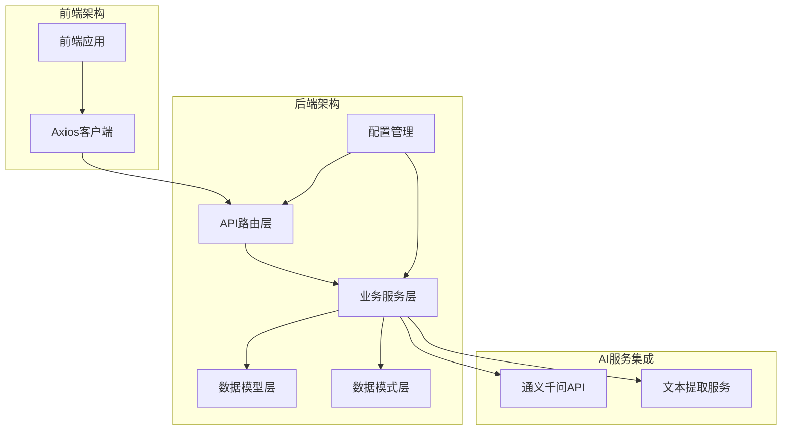
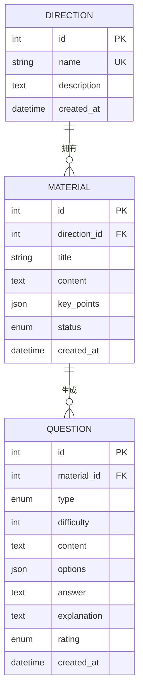
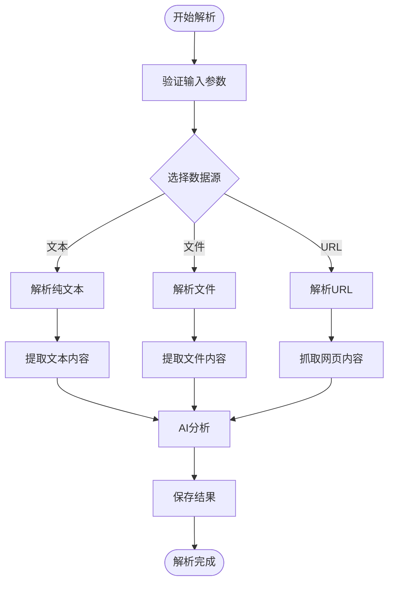
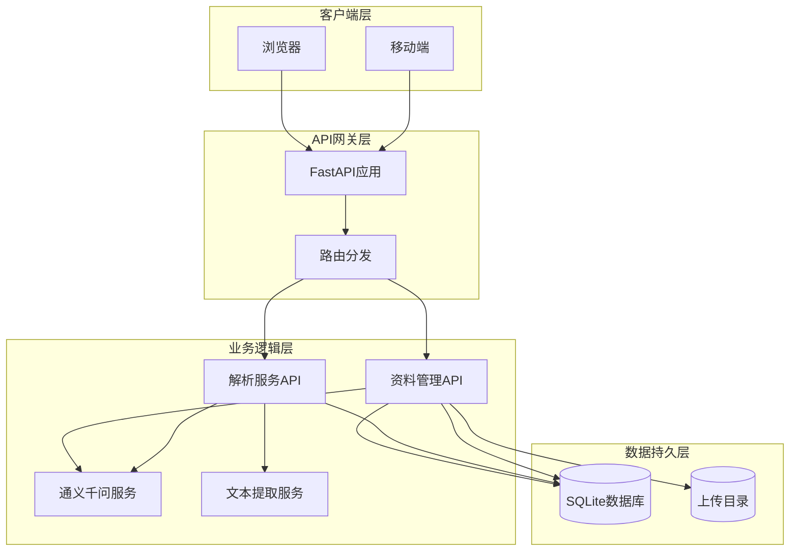
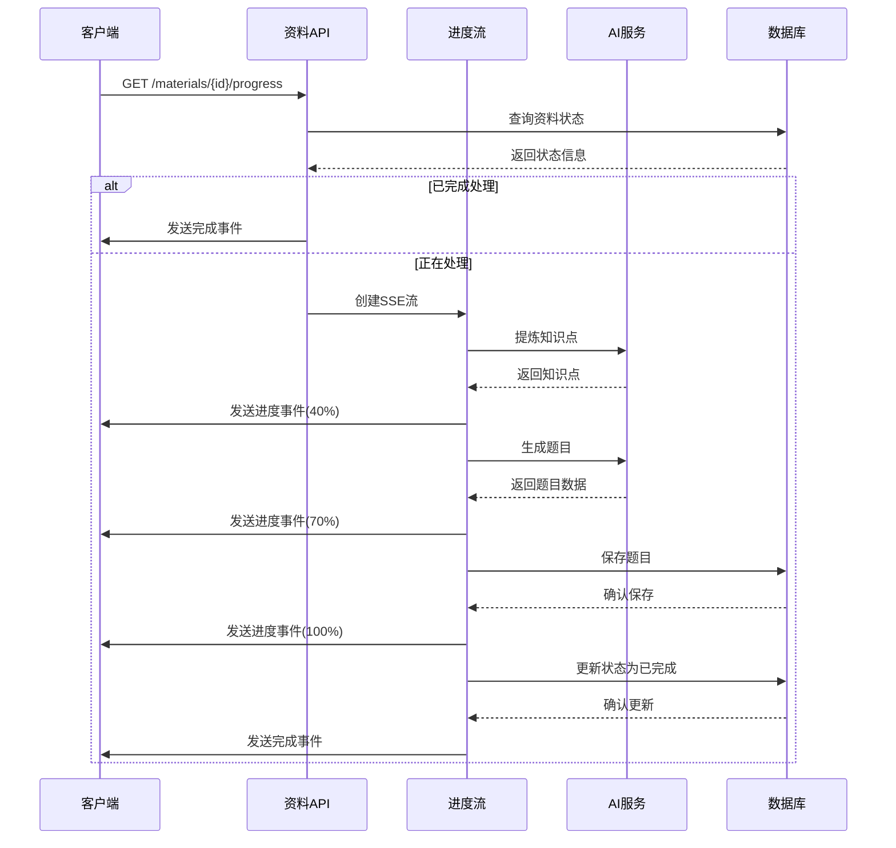
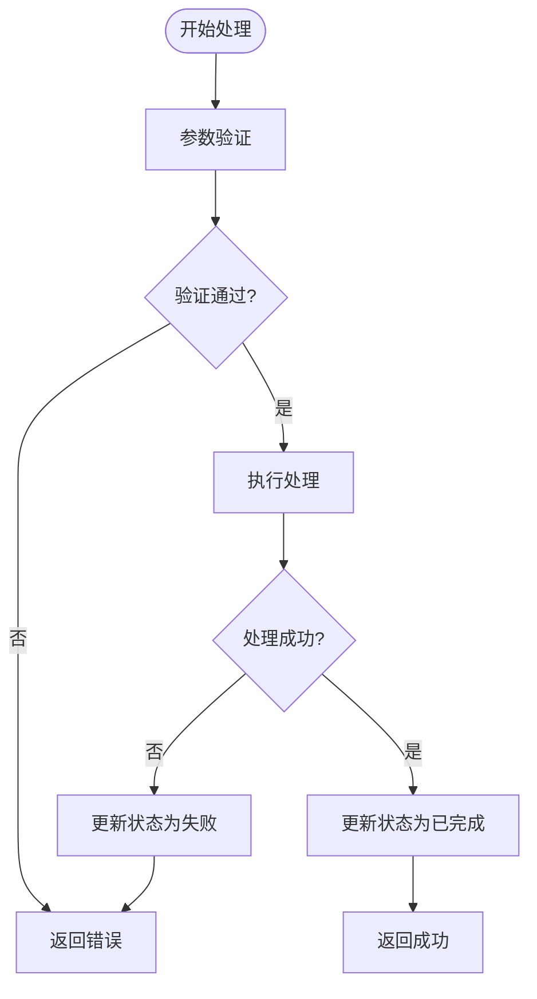
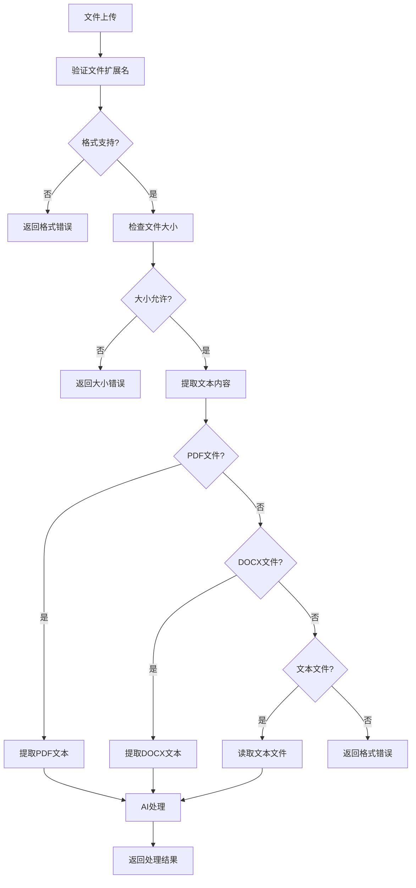
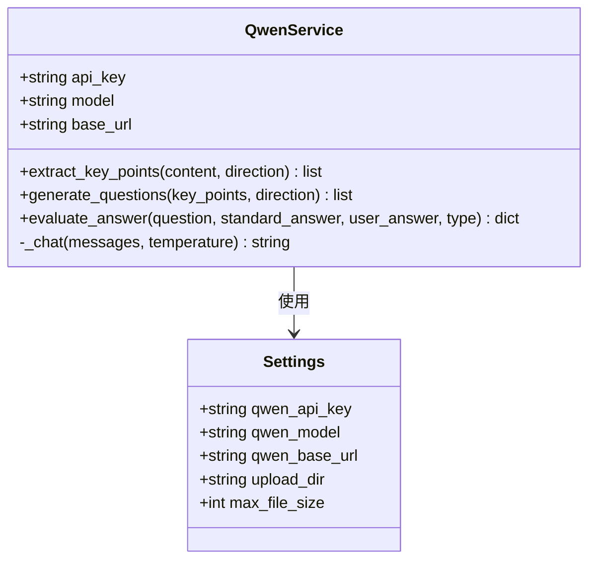
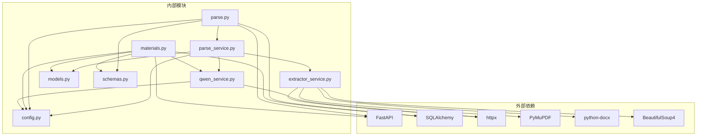

# 资料管理API

<cite>
**本文档引用的文件**
- [materials.py](file://backend/app/api/materials.py)
- [parse.py](file://backend/app/api/parse.py)
- [parse_service.py](file://backend/app/services/parse_service.py)
- [extractor_service.py](file://backend/app/services/extractor_service.py)
- [models.py](file://backend/app/models/models.py)
- [schemas.py](file://backend/app/schemas/schemas.py)
- [qwen_service.py](file://backend/app/services/qwen_service.py)
- [config.py](file://backend/app/core/config.py)
- [index.js](file://frontend/src/api/index.js)
- [test_api.py](file://backend/test_api.py)
- [test_full_flow.py](file://backend/test_full_flow.py)
</cite>

## 目录
1. [简介](#简介)
2. [项目结构](#项目结构)
3. [核心组件](#核心组件)
4. [架构概览](#架构概览)
5. [详细组件分析](#详细组件分析)
6. [依赖关系分析](#依赖关系分析)
7. [性能考虑](#性能考虑)
8. [故障排除指南](#故障排除指南)
9. [结论](#结论)

## 简介

资料管理API是个人学习管理软件的核心功能模块，提供完整的学习资料生命周期管理能力。该系统集成了AI驱动的知识点提炼、智能题目生成和实时进度监控功能，为学习者提供智能化的学习体验。

系统主要包含两大核心功能模块：
- **学习资料管理**：支持资料上传、解析、题目生成和删除
- **知识解析服务**：支持文本、文件和URL三种来源的知识解析

所有操作均采用异步处理机制，配合SSE（Server-Sent Events）实现实时进度监控，确保用户体验的流畅性和响应性。

## 项目结构

**图表来源**
- [materials.py](file://backend/app/api/materials.py#L1-L203)
- [parse.py](file://backend/app/api/parse.py#L1-L77)
- [config.py](file://backend/app/core/config.py#L1-L34)

**章节来源**
- [materials.py](file://backend/app/api/materials.py#L1-L203)
- [parse.py](file://backend/app/api/parse.py#L1-L77)
- [config.py](file://backend/app/core/config.py#L1-L34)

## 核心组件

### 学习资料管理模块

学习资料管理模块提供完整的资料生命周期管理，包括上传、解析、进度监控和删除功能。

#### 主要特性
- **多格式支持**：PDF、DOCX、MD、TXT文件解析
- **实时进度监控**：SSE流式传输处理进度
- **AI智能处理**：知识点提炼和题目生成
- **状态管理**：完整的处理状态跟踪

#### 关键数据模型

**图表来源**
- [models.py](file://backend/app/models/models.py#L78-L114)

**章节来源**
- [models.py](file://backend/app/models/models.py#L1-L223)

### 知识解析服务模块

知识解析服务模块提供统一的知识内容解析能力，支持多种数据源的标准化处理。

#### 支持的数据源
- **纯文本解析**：直接处理文本内容
- **文件解析**：支持PDF、DOCX、MD、TXT格式
- **URL解析**：抓取网页内容并提取正文

#### 解析流程

**图表来源**
- [parse_service.py](file://backend/app/services/parse_service.py#L57-L132)

**章节来源**
- [parse_service.py](file://backend/app/services/parse_service.py#L1-L163)

## 架构概览

**图表来源**
- [materials.py](file://backend/app/api/materials.py#L1-L203)
- [parse.py](file://backend/app/api/parse.py#L1-L77)
- [qwen_service.py](file://backend/app/services/qwen_service.py#L1-L156)

## 详细组件分析

### 学习资料API组件

#### 接口定义

| 方法 | 路径 | 功能 | 返回值 |
|------|------|------|--------|
| GET | `/materials` | 获取资料列表 | `List[MaterialResponse]` |
| POST | `/materials` | 上传并处理资料 | `MaterialResponse` |
| GET | `/materials/{material_id}/progress` | 获取处理进度 | `StreamingResponse` |
| DELETE | `/materials/{material_id}` | 删除资料 | `dict` |

#### SSE进度流实现

系统采用Server-Sent Events机制实现实时进度监控：

**图表来源**
- [materials.py](file://backend/app/api/materials.py#L27-L85)

#### 错误处理机制

**图表来源**
- [materials.py](file://backend/app/api/materials.py#L82-L161)

**章节来源**
- [materials.py](file://backend/app/api/materials.py#L1-L203)

### 知识解析API组件

#### 接口定义

| 方法 | 路径 | 功能 | 返回值 |
|------|------|------|--------|
| POST | `/parse/text` | 解析纯文本 | `ParseTaskResponse` |
| POST | `/parse/file` | 解析文件 | `ParseTaskResponse` |
| POST | `/parse/url` | 解析URL | `ParseTaskResponse` |
| GET | `/parse/tasks` | 获取任务列表 | `List[TaskListResponse]` |
| GET | `/parse/tasks/{task_id}` | 获取任务详情 | `ParseTaskResponse` |
| DELETE | `/parse/tasks/{task_id}` | 删除任务 | `dict` |

#### 文件上传处理

系统支持多种文件格式的智能解析：

**图表来源**
- [extractor_service.py](file://backend/app/services/extractor_service.py#L30-L56)

**章节来源**
- [parse.py](file://backend/app/api/parse.py#L1-L77)
- [extractor_service.py](file://backend/app/services/extractor_service.py#L1-L123)

### AI服务集成组件

#### 通义千问服务

系统集成了通义千问AI服务，提供智能的知识点提炼和题目生成功能：

**图表来源**
- [qwen_service.py](file://backend/app/services/qwen_service.py#L10-L156)
- [config.py](file://backend/app/core/config.py#L6-L34)

**章节来源**
- [qwen_service.py](file://backend/app/services/qwen_service.py#L1-L156)
- [config.py](file://backend/app/core/config.py#L1-L34)

## 依赖关系分析

**图表来源**
- [pyproject.toml](file://backend/pyproject.toml#L7-L22)

**章节来源**
- [pyproject.toml](file://backend/pyproject.toml#L1-L29)

## 性能考虑

### 异步处理优化

系统采用异步编程模式，充分利用现代Web框架的并发处理能力：

1. **异步文件处理**：使用异步IO进行文件读取和网络请求
2. **并发AI调用**：支持多个AI请求的并发处理
3. **流式响应**：SSE流式传输减少内存占用

### 缓存策略

- **配置缓存**：使用LRU缓存存储配置信息，避免重复读取
- **API响应缓存**：对静态数据查询结果进行缓存
- **临时文件管理**：及时清理解析过程中的临时文件

### 资源管理

- **连接池管理**：数据库连接采用连接池复用
- **文件句柄管理**：确保文件操作后的资源释放
- **内存使用控制**：限制单次处理的文件大小

## 故障排除指南

### 常见问题及解决方案

#### 1. AI服务配置问题

**症状**：API调用返回"API密钥未配置"错误

**解决方案**：
- 检查环境变量QWEN_API_KEY是否正确设置
- 验证API密钥的有效性和权限
- 确认网络连接正常

#### 2. 文件上传失败

**症状**：文件上传返回格式或大小错误

**解决方案**：
- 检查文件扩展名是否在支持列表中
- 确认文件大小不超过10MB限制
- 验证文件编码格式

#### 3. 进度监控无响应

**症状**：SSE连接建立但无进度更新

**解决方案**：
- 检查网络连接稳定性
- 确认客户端正确处理SSE事件
- 查看服务器日志获取详细错误信息

#### 4. 数据库连接问题

**症状**：CRUD操作失败

**解决方案**：
- 检查数据库文件权限
- 确认数据库连接字符串正确
- 验证数据库文件完整性

**章节来源**
- [materials.py](file://backend/app/api/materials.py#L94-L96)
- [extractor_service.py](file://backend/app/services/extractor_service.py#L35-L36)
- [config.py](file://backend/app/core/config.py#L16-L24)

## 结论

资料管理API提供了完整的智能化学习资料管理解决方案，具有以下优势：

1. **完整的功能覆盖**：从资料上传到智能解析的全流程支持
2. **实时用户体验**：SSE流式进度监控确保用户获得及时反馈
3. **强大的AI集成**：深度整合通义千问API实现智能化处理
4. **灵活的扩展性**：模块化设计便于功能扩展和维护
5. **完善的错误处理**：健壮的异常处理机制确保系统稳定性

系统通过合理的架构设计和性能优化，在保证功能完整性的同时，也为未来的功能扩展和技术升级奠定了坚实基础。