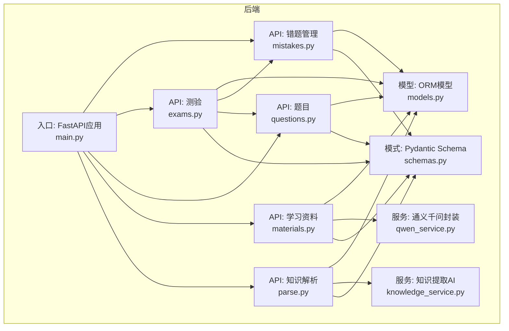
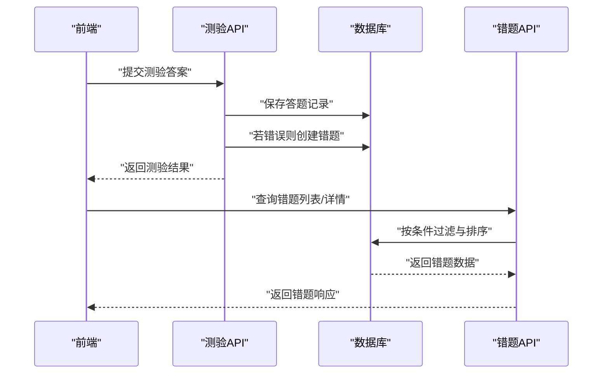
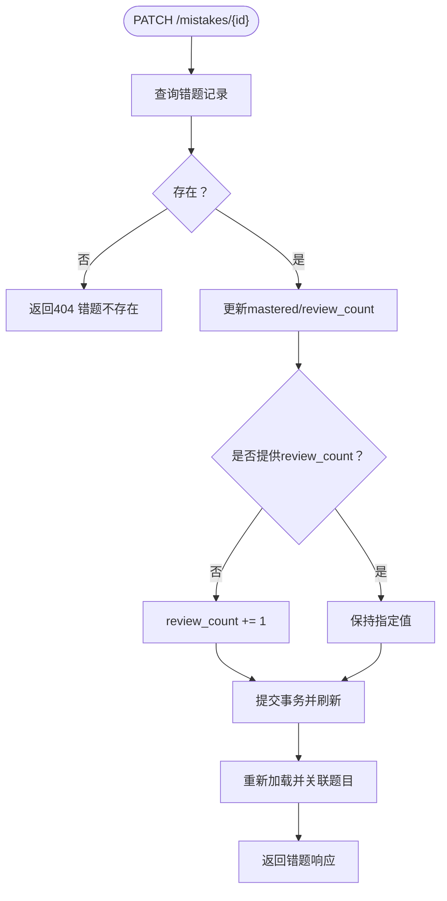
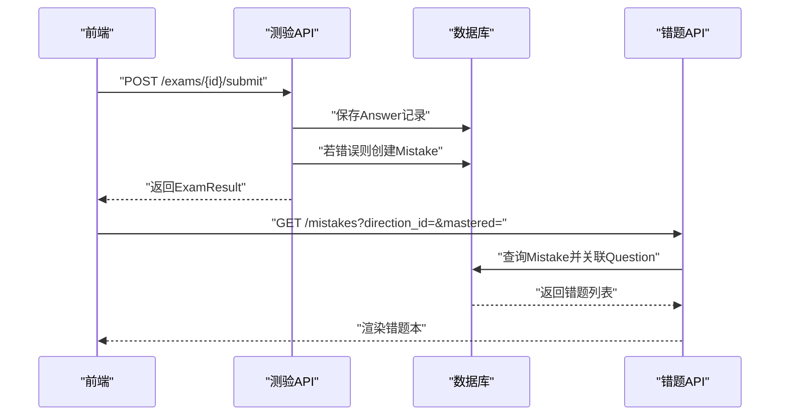
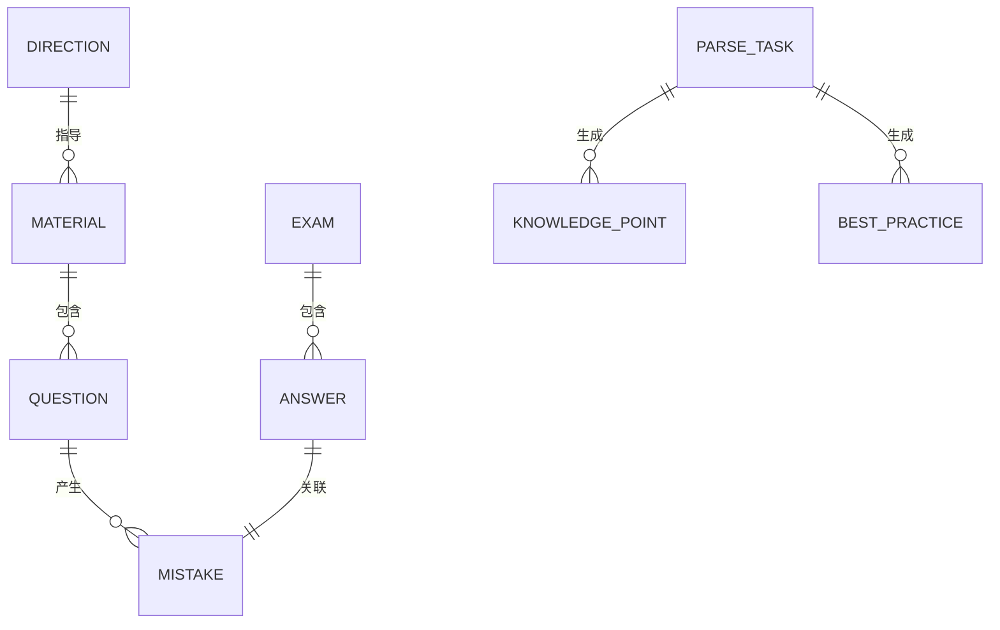
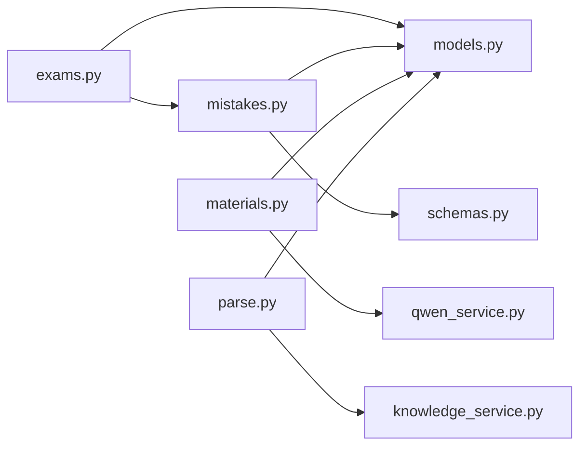

# 错题管理API

<cite>
**本文引用的文件**
- [backend/app/api/mistakes.py](file://backend/app/api/mistakes.py)
- [backend/app/models/models.py](file://backend/app/models/models.py)
- [backend/app/schemas/schemas.py](file://backend/app/schemas/schemas.py)
- [backend/app/api/exams.py](file://backend/app/api/exams.py)
- [backend/app/api/questions.py](file://backend/app/api/questions.py)
- [backend/app/api/materials.py](file://backend/app/api/materials.py)
- [backend/app/api/parse.py](file://backend/app/api/parse.py)
- [backend/app/services/qwen_service.py](file://backend/app/services/qwen_service.py)
- [backend/app/services/knowledge_service.py](file://backend/app/services/knowledge_service.py)
- [backend/app/main.py](file://backend/app/main.py)
- [frontend/src/views/MistakesView.vue](file://frontend/src/views/MistakesView.vue)
- [backend/app/core/config.py](file://backend/app/core/config.py)
</cite>

## 目录
1. [简介](#简介)
2. [项目结构](#项目结构)
3. [核心组件](#核心组件)
4. [架构总览](#架构总览)
5. [详细组件分析](#详细组件分析)
6. [依赖分析](#依赖分析)
7. [性能考虑](#性能考虑)
8. [故障排查指南](#故障排查指南)
9. [结论](#结论)
10. [附录](#附录)

## 简介
本文件为“错题管理API”的权威文档，覆盖错题的创建、查询、更新与删除的完整接口；解释错题识别机制（测验自动收录）、复习提醒与掌握追踪；说明错题分类与标签管理、批量操作能力；提供统计分析与学习进度追踪接口；阐述错题与知识点的关联关系及学习路径规划；并给出请求示例与最佳实践建议。

## 项目结构
后端采用FastAPI + SQLAlchemy架构，前端Vue3 + Vite，数据库为SQLite（可替换）。错题管理API位于后端路由模块，配合测验、题目、学习资料、知识解析等模块协同工作。

图表来源
- [backend/app/api/mistakes.py](file://backend/app/api/mistakes.py#L1-L90)
- [backend/app/api/exams.py](file://backend/app/api/exams.py#L1-L240)
- [backend/app/api/questions.py](file://backend/app/api/questions.py#L1-L90)
- [backend/app/api/materials.py](file://backend/app/api/materials.py#L1-L203)
- [backend/app/api/parse.py](file://backend/app/api/parse.py#L1-L77)
- [backend/app/services/qwen_service.py](file://backend/app/services/qwen_service.py#L1-L156)
- [backend/app/services/knowledge_service.py](file://backend/app/services/knowledge_service.py#L1-L114)
- [backend/app/models/models.py](file://backend/app/models/models.py#L1-L223)
- [backend/app/schemas/schemas.py](file://backend/app/schemas/schemas.py#L1-L265)
- [backend/app/main.py](file://backend/app/main.py#L1-L66)

章节来源
- [backend/app/main.py](file://backend/app/main.py#L1-L66)

## 核心组件
- 错题管理API：提供错题列表、详情、更新（标记掌握/复习次数+1）、删除。
- 测验API：创建测验、提交答案并自动收录错题、查询结果。
- 题目API：查询题目、更新题目、评价题目。
- 学习资料API：上传资料、同步处理（知识点提炼、题目生成）、进度流。
- 知识解析API：文本/文件/URL解析，生成任务、查询任务详情。
- 服务层：通义千问封装、知识提取AI服务。
- 模型与Schema：错题、题目、答题记录、测验、学习方向、资料等实体与数据模式。

章节来源
- [backend/app/api/mistakes.py](file://backend/app/api/mistakes.py#L1-L90)
- [backend/app/api/exams.py](file://backend/app/api/exams.py#L1-L240)
- [backend/app/api/questions.py](file://backend/app/api/questions.py#L1-L90)
- [backend/app/api/materials.py](file://backend/app/api/materials.py#L1-L203)
- [backend/app/api/parse.py](file://backend/app/api/parse.py#L1-L77)
- [backend/app/services/qwen_service.py](file://backend/app/services/qwen_service.py#L1-L156)
- [backend/app/services/knowledge_service.py](file://backend/app/services/knowledge_service.py#L1-L114)
- [backend/app/models/models.py](file://backend/app/models/models.py#L155-L169)
- [backend/app/schemas/schemas.py](file://backend/app/schemas/schemas.py#L171-L191)

## 架构总览
错题管理贯穿“测验—答题—错题收录—错题管理—学习资料/知识点”的闭环。测验提交时若用户作答错误，系统自动创建错题记录；前端可通过错题管理API进行查询、标记掌握、增加复习次数、删除错题；学习资料与知识解析模块为错题提供知识点背景，支撑学习路径规划。

图表来源
- [backend/app/api/exams.py](file://backend/app/api/exams.py#L127-L217)
- [backend/app/api/mistakes.py](file://backend/app/api/mistakes.py#L11-L90)

## 详细组件分析

### 错题管理API
- 路由前缀：/api/mistakes
- 主要接口
  - GET /mistakes：获取错题列表，支持按学习方向与掌握状态过滤，按创建时间倒序。
  - GET /mistakes/{mistake_id}：获取错题详情，关联加载题目信息。
  - PATCH /mistakes/{mistake_id}：更新错题状态，支持手动设置mastered与review_count；未显式传入时自动增加review_count。
  - DELETE /mistakes/{mistake_id}：删除错题。
- 数据模型与Schema
  - 错题模型包含question_id、answer_id、review_count、mastered、created_at。
  - 响应Schema包含错题基本信息与可选的题目详情。
- 错题识别机制
  - 在测验提交阶段，若某题作答错误，系统自动创建一条错题记录，关联对应答题记录与题目。
- 复习提醒与掌握追踪
  - 通过mastered字段表示掌握状态；review_count用于记录复习次数，便于提醒策略与进度追踪。
- 批量操作
  - 当前接口为单条更新/删除；如需批量操作，可在客户端聚合请求或扩展后端接口。

图表来源
- [backend/app/api/mistakes.py](file://backend/app/api/mistakes.py#L47-L78)

章节来源
- [backend/app/api/mistakes.py](file://backend/app/api/mistakes.py#L11-L90)
- [backend/app/schemas/schemas.py](file://backend/app/schemas/schemas.py#L171-L191)
- [backend/app/models/models.py](file://backend/app/models/models.py#L155-L169)

### 错题识别机制与自动收录
- 触发点：测验提交接口在保存答题记录后，若答案不正确，自动创建错题记录。
- 关联关系：错题记录与题目、答题记录双向关联，确保可追溯。
- 影响范围：测验完成后，前端可直接查询错题列表，实现“错题本”即时生效。

图表来源
- [backend/app/api/exams.py](file://backend/app/api/exams.py#L127-L217)
- [backend/app/api/mistakes.py](file://backend/app/api/mistakes.py#L11-L90)

章节来源
- [backend/app/api/exams.py](file://backend/app/api/exams.py#L127-L217)

### 复习提醒与掌握追踪
- 掌握追踪：通过mastered布尔值表示掌握状态；前端可据此筛选“未掌握”错题进行重点复习。
- 复习次数：review_count用于统计复习频次，可用于提醒策略（如超过N次未掌握则高亮）。
- 前端集成：前端页面支持按方向与掌握状态过滤，支持标记“已掌握/未掌握”，并记录一次复习。

章节来源
- [frontend/src/views/MistakesView.vue](file://frontend/src/views/MistakesView.vue#L1-L409)
- [backend/app/api/mistakes.py](file://backend/app/api/mistakes.py#L47-L78)

### 错题分类、标签管理与批量操作
- 分类与标签：当前Schema中未见错题专用分类/标签字段；知识点具备category字段，可作为间接参考。
- 批量操作：当前接口为单条操作；如需批量，可在客户端循环或扩展后端接口（例如新增批量更新/删除）。

章节来源
- [backend/app/schemas/schemas.py](file://backend/app/schemas/schemas.py#L208-L219)

### 统计分析与学习进度追踪
- 错题统计：可基于mastered与review_count进行统计（未掌握数量、平均复习次数等），前端可按方向过滤后汇总。
- 学习进度：结合测验结果（正确率、等级）与错题列表，形成“掌握度”指标。
- 建议：后端可新增统计接口（如按方向统计错题分布、掌握趋势），前端负责可视化展示。

章节来源
- [backend/app/api/mistakes.py](file://backend/app/api/mistakes.py#L11-L31)
- [backend/app/api/exams.py](file://backend/app/api/exams.py#L29-L45)

### 复习计划与自适应学习推荐
- 复习计划：可依据错题的review_count与mastered状态，生成优先级队列（未掌握且复习次数低的优先）。
- 自适应推荐：结合学习资料与知识点，为未掌握错题推荐相关知识点与练习题（当前API未直接暴露“推荐接口”，但可基于现有资料与知识点Schema扩展）。

章节来源
- [backend/app/api/materials.py](file://backend/app/api/materials.py#L1-L203)
- [backend/app/api/parse.py](file://backend/app/api/parse.py#L1-L77)
- [backend/app/schemas/schemas.py](file://backend/app/schemas/schemas.py#L192-L265)

### 错题与知识点的关联与学习路径
- 关联关系：错题通过题目与学习资料间接关联知识点；学习资料解析流程可生成知识点与最佳实践，为错题提供背景。
- 学习路径：基于错题→题目→学习资料→知识点的链路，构建“薄弱点→知识点→资料→巩固练习”的闭环。

图表来源
- [backend/app/models/models.py](file://backend/app/models/models.py#L78-L114)
- [backend/app/models/models.py](file://backend/app/models/models.py#L155-L169)
- [backend/app/models/models.py](file://backend/app/models/models.py#L171-L223)

章节来源
- [backend/app/models/models.py](file://backend/app/models/models.py#L78-L114)
- [backend/app/models/models.py](file://backend/app/models/models.py#L155-L169)
- [backend/app/models/models.py](file://backend/app/models/models.py#L171-L223)

## 依赖分析
- 错题API依赖数据库模型与Schema，提供查询、更新、删除能力。
- 测验API在提交阶段依赖错题模型，实现自动收录。
- 学习资料与知识解析API依赖通义千问服务，生成知识点与题目，间接支撑错题学习路径。

图表来源
- [backend/app/api/exams.py](file://backend/app/api/exams.py#L127-L217)
- [backend/app/api/mistakes.py](file://backend/app/api/mistakes.py#L1-L90)
- [backend/app/models/models.py](file://backend/app/models/models.py#L155-L169)
- [backend/app/schemas/schemas.py](file://backend/app/schemas/schemas.py#L171-L191)
- [backend/app/api/materials.py](file://backend/app/api/materials.py#L1-L203)
- [backend/app/services/qwen_service.py](file://backend/app/services/qwen_service.py#L1-L156)
- [backend/app/api/parse.py](file://backend/app/api/parse.py#L1-L77)
- [backend/app/services/knowledge_service.py](file://backend/app/services/knowledge_service.py#L1-L114)

章节来源
- [backend/app/api/exams.py](file://backend/app/api/exams.py#L127-L217)
- [backend/app/api/mistakes.py](file://backend/app/api/mistakes.py#L1-L90)
- [backend/app/api/materials.py](file://backend/app/api/materials.py#L1-L203)
- [backend/app/api/parse.py](file://backend/app/api/parse.py#L1-L77)
- [backend/app/services/qwen_service.py](file://backend/app/services/qwen_service.py#L1-L156)
- [backend/app/services/knowledge_service.py](file://backend/app/services/knowledge_service.py#L1-L114)

## 性能考虑
- 查询优化：错题列表查询使用joinedload关联题目，减少N+1查询；建议在高频过滤字段上建立索引（如direction_id、mastered）。
- 写入优化：测验提交时批量写入答题记录与错题，注意事务边界与回滚成本。
- 异步处理：学习资料处理流程可改为后台任务（Celery/异步队列），避免阻塞请求。

## 故障排查指南
- 常见错误
  - 404：错题/题目/测验不存在。
  - 400：测验已完成仍提交、方向下无题目等。
  - 500：资料处理失败、API密钥未配置。
- 排查步骤
  - 检查路由前缀与路径参数是否正确。
  - 确认数据库连接与表结构初始化。
  - 检查通义千问API配置（密钥、模型、基础URL）。
  - 查看后端日志与异常栈信息。

章节来源
- [backend/app/api/mistakes.py](file://backend/app/api/mistakes.py#L42-L44)
- [backend/app/api/questions.py](file://backend/app/api/questions.py#L36-L39)
- [backend/app/api/exams.py](file://backend/app/api/exams.py#L134-L140)
- [backend/app/api/materials.py](file://backend/app/api/materials.py#L94-L96)
- [backend/app/core/config.py](file://backend/app/core/config.py#L16-L22)

## 结论
错题管理API与测验、题目、学习资料、知识解析模块紧密协作，实现了从“错题收录—管理—复习—巩固”的完整闭环。通过mastered与review_count可实现掌握追踪与复习提醒；结合学习资料与知识点，可进一步规划学习路径。建议后续扩展批量操作、统计接口与自适应推荐能力，以提升个性化学习体验。

## 附录

### 接口清单与示例

- 获取错题列表
  - 方法与路径：GET /api/mistakes
  - 查询参数：direction_id（整数，可选）、mastered（布尔，可选）
  - 返回：错题列表（包含题目详情）
  - 示例请求：/api/mistakes?direction_id=1&mastered=false
  - 示例响应：见[响应Schema](file://backend/app/schemas/schemas.py#L171-L184)

- 获取错题详情
  - 方法与路径：GET /api/mistakes/{mistake_id}
  - 路径参数：mistake_id（整数）
  - 返回：单条错题（包含题目详情）
  - 示例请求：/api/mistakes/123

- 更新错题
  - 方法与路径：PATCH /api/mistakes/{mistake_id}
  - 路径参数：mistake_id（整数）
  - 请求体：可选mastered（布尔）、review_count（整数）
  - 行为：未提供review_count时自动+1
  - 示例请求：/api/mistakes/123（body: {} 或 {"mastered": true}）

- 删除错题
  - 方法与路径：DELETE /api/mistakes/{mistake_id}
  - 返回：删除成功消息

- 测验提交并收录错题
  - 方法与路径：POST /api/exams/{id}/submit
  - 请求体：ExamSubmit（包含答案数组）
  - 行为：保存答题记录，错误则创建错题
  - 示例请求：/api/exams/1/submit（body: {"answers": [...]}）
  - 示例响应：见[测验结果Schema](file://backend/app/schemas/schemas.py#L133-L142)

- 获取测验结果
  - 方法与路径：GET /api/exams/{id}/result
  - 返回：测验结果（包含总题数、正确数、得分、等级、答案明细）

- 学习资料处理（SSE进度）
  - 方法与路径：GET /api/materials/{material_id}/progress
  - 返回：SSE流，包含step、progress、message等字段

章节来源
- [backend/app/api/mistakes.py](file://backend/app/api/mistakes.py#L11-L90)
- [backend/app/api/exams.py](file://backend/app/api/exams.py#L127-L240)
- [backend/app/api/materials.py](file://backend/app/api/materials.py#L164-L185)
- [backend/app/schemas/schemas.py](file://backend/app/schemas/schemas.py#L133-L191)

### 最佳实践与个性化建议
- 错题管理
  - 使用mastered进行“未掌握/已掌握”二分管理，定期回顾未掌握错题。
  - 通过review_count设定复习提醒阈值，避免遗忘曲线。
- 学习路径
  - 基于错题→题目→学习资料→知识点的链路，优先补齐薄弱知识点。
  - 利用学习资料的key_points与知识解析生成的知识点，构建针对性练习。
- 批量与自动化
  - 扩展批量操作接口，支持批量标记掌握、批量删除。
  - 将学习资料处理改为后台任务，提升用户体验。
- 配置与安全
  - 正确配置通义千问API密钥与基础URL，避免500错误。
  - 前端与后端CORS配置满足跨域访问需求。

章节来源
- [backend/app/core/config.py](file://backend/app/core/config.py#L16-L22)
- [backend/app/api/materials.py](file://backend/app/api/materials.py#L94-L96)
- [frontend/src/views/MistakesView.vue](file://frontend/src/views/MistakesView.vue#L1-L409)