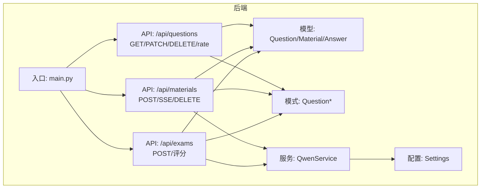
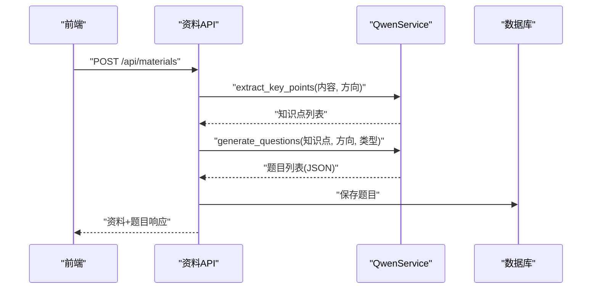
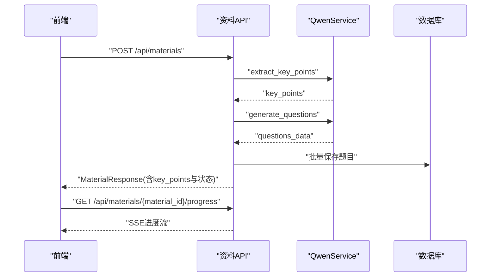
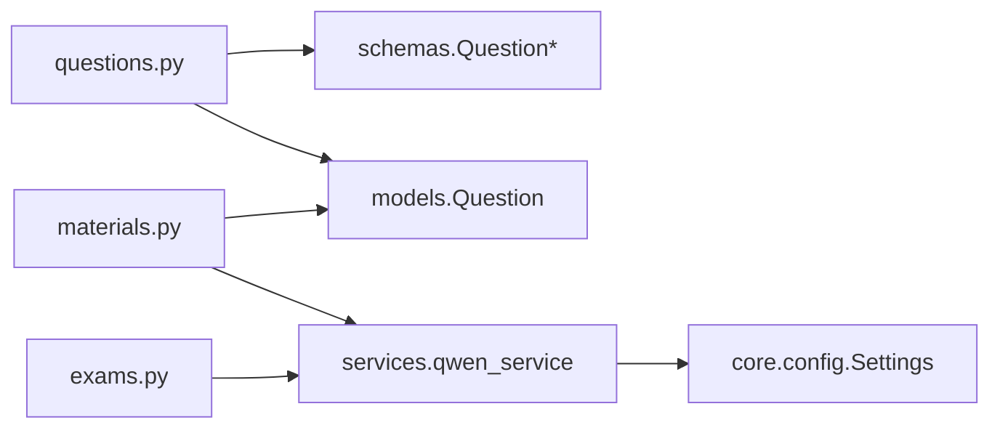

# 题目生成API

<cite>
**本文档引用的文件**
- [backend/app/api/questions.py](file://backend/app/api/questions.py)
- [backend/app/models/models.py](file://backend/app/models/models.py)
- [backend/app/schemas/schemas.py](file://backend/app/schemas/schemas.py)
- [backend/app/services/qwen_service.py](file://backend/app/services/qwen_service.py)
- [backend/app/api/materials.py](file://backend/app/api/materials.py)
- [backend/app/api/exams.py](file://backend/app/api/exams.py)
- [backend/app/core/config.py](file://backend/app/core/config.py)
- [backend/app/main.py](file://backend/app/main.py)
- [frontend/src/views/QuestionsView.vue](file://frontend/src/views/QuestionsView.vue)
</cite>

## 目录
1. [简介](#简介)
2. [项目结构](#项目结构)
3. [核心组件](#核心组件)
4. [架构总览](#架构总览)
5. [详细组件分析](#详细组件分析)
6. [依赖关系分析](#依赖关系分析)
7. [性能考虑](#性能考虑)
8. [故障排除指南](#故障排除指南)
9. [结论](#结论)
10. [附录](#附录)

## 简介
本文件为“题目生成API”的完整技术文档，覆盖题目的创建、获取、更新、删除与评价接口；详述支持的题型（单选、多选、判断、简答）及对应的数据结构；说明难度等级、知识点标签与答案验证机制；提供请求示例与批量生成流程；阐述与AI服务（通义千问）的集成方式（Prompt工程与答案生成）；并给出题目搜索、筛选与排序的查询参数说明，以及题库管理与质量控制的最佳实践。

## 项目结构
后端采用FastAPI + SQLAlchemy架构，按功能模块划分：
- API层：questions.py、materials.py、exams.py等，负责HTTP接口与路由
- 模型层：models.py，定义数据库表结构与枚举类型
- 模式层：schemas.py，定义请求/响应数据结构
- 服务层：qwen_service.py（AI服务封装）、extractor_service.py（文本提取）、knowledge_service.py（知识解析）
- 核心配置：config.py（环境变量与配置项）
- 应用入口：main.py（注册路由、CORS、启动事件）

图表来源
- [backend/app/main.py](file://backend/app/main.py#L37-L42)
- [backend/app/api/questions.py](file://backend/app/api/questions.py#L8-L9)
- [backend/app/api/materials.py](file://backend/app/api/materials.py#L12-L12)
- [backend/app/api/exams.py](file://backend/app/api/exams.py#L150-L216)
- [backend/app/models/models.py](file://backend/app/models/models.py#L95-L113)
- [backend/app/schemas/schemas.py](file://backend/app/schemas/schemas.py#L60-L100)
- [backend/app/services/qwen_service.py](file://backend/app/services/qwen_service.py#L10-L156)
- [backend/app/core/config.py](file://backend/app/core/config.py#L6-L34)

章节来源
- [backend/app/main.py](file://backend/app/main.py#L37-L42)
- [backend/app/api/questions.py](file://backend/app/api/questions.py#L8-L9)
- [backend/app/api/materials.py](file://backend/app/api/materials.py#L12-L12)
- [backend/app/api/exams.py](file://backend/app/api/exams.py#L150-L216)
- [backend/app/models/models.py](file://backend/app/models/models.py#L95-L113)
- [backend/app/schemas/schemas.py](file://backend/app/schemas/schemas.py#L60-L100)
- [backend/app/services/qwen_service.py](file://backend/app/services/qwen_service.py#L10-L156)
- [backend/app/core/config.py](file://backend/app/core/config.py#L6-L34)

## 核心组件
- 题目API：提供题目列表查询、详情查询、更新、删除与评价接口
- 题目模型：定义题型枚举、难度、选项、答案、解析、评价等字段
- 题目模式：定义创建、更新、响应的数据结构
- AI服务：封装通义千问接口，支持知识点提取、题目生成、主观题评分
- 资料API：支持资料上传、流式处理进度、自动生成题目
- 测验API：支持主观题AI评分与错题本联动

章节来源
- [backend/app/api/questions.py](file://backend/app/api/questions.py#L11-L90)
- [backend/app/models/models.py](file://backend/app/models/models.py#L16-L28)
- [backend/app/schemas/schemas.py](file://backend/app/schemas/schemas.py#L60-L100)
- [backend/app/services/qwen_service.py](file://backend/app/services/qwen_service.py#L37-L152)
- [backend/app/api/materials.py](file://backend/app/api/materials.py#L82-L161)
- [backend/app/api/exams.py](file://backend/app/api/exams.py#L150-L216)

## 架构总览
题目生成API围绕“资料 → 知识点 → 题目”的流水线工作，前端通过后端API进行交互，后端通过QwenService调用通义千问完成知识点提炼与题目生成，并持久化到数据库。

图表来源
- [backend/app/api/materials.py](file://backend/app/api/materials.py#L82-L161)
- [backend/app/services/qwen_service.py](file://backend/app/services/qwen_service.py#L37-L114)
- [backend/app/models/models.py](file://backend/app/models/models.py#L95-L113)

## 详细组件分析

### 题目API接口规范
- 获取题目列表
  - 方法：GET
  - 路径：/api/questions
  - 查询参数：
    - material_id：整数，按资料ID过滤
    - direction_id：整数，按学习方向过滤（通过资料关联）
    - question_type：字符串，按题型过滤
  - 排序：按创建时间倒序
  - 响应：题目列表（QuestionResponse[]）

- 获取题目详情
  - 方法：GET
  - 路径：/api/questions/{question_id}
  - 响应：单个题目（QuestionResponse），未找到返回404

- 更新题目
  - 方法：PATCH
  - 路径：/api/questions/{question_id}
  - 请求体：QuestionUpdate（可选字段：content、options、answer、explanation、difficulty）
  - 响应：更新后的题目（QuestionResponse）

- 评价题目
  - 方法：PATCH
  - 路径：/api/questions/{question_id}/rate
  - 请求体：QuestionRateRequest（rating：good/bad）
  - 响应：更新后的题目（QuestionResponse）

- 删除题目
  - 方法：DELETE
  - 路径：/api/questions/{question_id}
  - 响应：删除成功消息

章节来源
- [backend/app/api/questions.py](file://backend/app/api/questions.py#L11-L90)
- [backend/app/schemas/schemas.py](file://backend/app/schemas/schemas.py#L87-L99)
- [backend/app/schemas/schemas.py](file://backend/app/schemas/schemas.py#L77-L84)

### 题目数据模型与题型
- 题型枚举：single_choice、multi_choice、true_false、short_answer
- 难度：1-5整数，默认3
- 字段：
  - material_id：来源资料ID
  - type：题型
  - difficulty：难度
  - content：题目内容
  - options：选项（JSON数组，选择题使用）
  - answer：标准答案（字符串，多选答案可能为逗号分隔）
  - explanation：答案解析
  - rating：用户评价（good/bad）
  - created_at：创建时间

章节来源
- [backend/app/models/models.py](file://backend/app/models/models.py#L16-L28)
- [backend/app/models/models.py](file://backend/app/models/models.py#L95-L113)
- [backend/app/schemas/schemas.py](file://backend/app/schemas/schemas.py#L62-L84)

### 题目模式与序列化
- QuestionBase：基础字段集合
- QuestionCreate：创建时需提供material_id
- QuestionResponse：响应包含id、material_id、rating、created_at
- QuestionUpdate：可选字段用于PATCH更新
- QuestionRateRequest：评价请求体

章节来源
- [backend/app/schemas/schemas.py](file://backend/app/schemas/schemas.py#L60-L100)

### AI服务集成（通义千问）
- 知识点提取：从资料内容中提炼5-10个核心知识点，返回JSON数组
- 题目生成：基于知识点生成题目，支持题型组合，返回JSON数组
- 主观题评分：评估学生答案，返回分数、评语与命中要点
- Prompt工程：
  - 知识点提取Prompt：限定输出格式为JSON数组，包含point、description、importance
  - 题目生成Prompt：限定每知识点1-2题，题型包含单选、多选、判断、简答，难度分布均匀，选择题4个选项
  - 主观题评分Prompt：返回JSON对象，包含score、feedback、命中与遗漏要点
- 温度系数：知识点提取0.3，题目生成0.5，评分0.3

章节来源
- [backend/app/services/qwen_service.py](file://backend/app/services/qwen_service.py#L37-L152)
- [backend/app/core/config.py](file://backend/app/core/config.py#L16-L19)

### 资料到题目的完整流程
- 资料上传：POST /api/materials，同步执行知识点提取与题目生成
- 流式进度：GET /api/materials/{material_id}/progress，SSE返回处理步骤与进度
- 自动保存：将生成的题目批量写入数据库

图表来源
- [backend/app/api/materials.py](file://backend/app/api/materials.py#L82-L161)
- [backend/app/api/materials.py](file://backend/app/api/materials.py#L27-L80)
- [backend/app/services/qwen_service.py](file://backend/app/services/qwen_service.py#L37-L114)

章节来源
- [backend/app/api/materials.py](file://backend/app/api/materials.py#L82-L161)
- [backend/app/api/materials.py](file://backend/app/api/materials.py#L27-L80)

### 答案验证与评分机制
- 客观题（单选、多选、判断）：精确匹配答案，100分或0分
- 主观题（简答）：调用AI服务进行评分，返回分数、评语与要点命中情况；以≥60分为正确
- 错题本：客观题错误直接加入错题本；主观题根据AI判定加入

章节来源
- [backend/app/api/exams.py](file://backend/app/api/exams.py#L150-L216)
- [backend/app/services/qwen_service.py](file://backend/app/services/qwen_service.py#L115-L152)

### 题目搜索、筛选与排序
- GET /api/questions 支持的查询参数：
  - material_id：按资料ID筛选
  - direction_id：按学习方向筛选（通过资料关联）
  - question_type：按题型筛选
- 默认排序：created_at 降序

章节来源
- [backend/app/api/questions.py](file://backend/app/api/questions.py#L11-L30)

### 前端交互与筛选
- 前端QuestionsView支持：
  - 学习方向、资料、题型三类筛选
  - 题目难度、评价标签展示
  - 编辑、删除、评价操作

章节来源
- [frontend/src/views/QuestionsView.vue](file://frontend/src/views/QuestionsView.vue#L7-L25)
- [frontend/src/views/QuestionsView.vue](file://frontend/src/views/QuestionsView.vue#L167-L171)

## 依赖关系分析
- API依赖模型与模式：questions.py依赖Question、Material模型与QuestionResponse/QuestionUpdate/QuestionRateRequest模式
- AI服务依赖配置：QwenService依赖Settings中的API密钥、模型与基础URL
- 资料API依赖AI服务：在资料创建时同步调用QwenService进行知识点提取与题目生成
- 测验API依赖AI服务：在主观题评分时调用QwenService

图表来源
- [backend/app/api/questions.py](file://backend/app/api/questions.py#L1-L9)
- [backend/app/models/models.py](file://backend/app/models/models.py#L95-L113)
- [backend/app/schemas/schemas.py](file://backend/app/schemas/schemas.py#L60-L100)
- [backend/app/api/materials.py](file://backend/app/api/materials.py#L1-L10)
- [backend/app/services/qwen_service.py](file://backend/app/services/qwen_service.py#L1-L7)
- [backend/app/core/config.py](file://backend/app/core/config.py#L6-L34)
- [backend/app/api/exams.py](file://backend/app/api/exams.py#L150-L216)

章节来源
- [backend/app/api/questions.py](file://backend/app/api/questions.py#L1-L9)
- [backend/app/models/models.py](file://backend/app/models/models.py#L95-L113)
- [backend/app/schemas/schemas.py](file://backend/app/schemas/schemas.py#L60-L100)
- [backend/app/api/materials.py](file://backend/app/api/materials.py#L1-L10)
- [backend/app/services/qwen_service.py](file://backend/app/services/qwen_service.py#L1-L7)
- [backend/app/core/config.py](file://backend/app/core/config.py#L6-L34)
- [backend/app/api/exams.py](file://backend/app/api/exams.py#L150-L216)

## 性能考虑
- 批量保存题目：资料处理阶段将题目批量写入数据库，减少事务开销
- SSE流式进度：避免长时间阻塞，提升用户体验
- AI调用超时：QwenService使用60秒超时，防止阻塞请求
- 前端筛选：在客户端进行题型与资料筛选，减少后端查询压力

## 故障排除指南
- 404未找到：题目、资料、方向不存在时返回404
- 500内部错误：资料处理失败时更新状态为FAILED并返回错误信息
- API密钥缺失：资料创建时若未配置QWEN_API_KEY，返回500提示
- JSON解析失败：AI服务对返回的JSON进行容错处理，失败时返回默认结构或空列表

章节来源
- [backend/app/api/questions.py](file://backend/app/api/questions.py#L34-L39)
- [backend/app/api/questions.py](file://backend/app/api/questions.py#L80-L89)
- [backend/app/api/materials.py](file://backend/app/api/materials.py#L94-L96)
- [backend/app/api/materials.py](file://backend/app/api/materials.py#L144-L159)
- [backend/app/services/qwen_service.py](file://backend/app/services/qwen_service.py#L55-L64)
- [backend/app/services/qwen_service.py](file://backend/app/services/qwen_service.py#L112-L113)

## 结论
题目生成API通过“资料 → 知识点 → 题目”的自动化流水线，结合通义千问的Prompt工程能力，实现了高质量题目的批量生成与管理。配合客观题精确匹配与主观题AI评分机制，形成了完整的测评闭环。前端提供灵活的筛选与交互体验，后端具备良好的扩展性与稳定性。

## 附录

### 请求示例与最佳实践
- 创建单选题
  - 请求体字段：type=single_choice、difficulty、content、options（4个）、answer、explanation、material_id
  - 注意：options为数组，answer为字符串
- 创建多选题
  - 请求体字段：type=multi_choice、options（4个）、answer为多个正确选项的组合字符串
- 创建判断题
  - 请求体字段：type=true_false、answer为"正确"/"错误"
- 创建简答题
  - 请求体字段：type=short_answer、answer为答案要点
- 批量生成题目
  - 通过上传资料触发自动流程，或调用QwenService的generate_questions接口传入知识点列表
- 题库管理与质量控制
  - 使用direction_id与material_id进行分层管理
  - 利用rating字段收集用户反馈，定期复核低分/负面评价题目
  - 控制难度分布均匀，确保1-5分均有覆盖
  - 对主观题答案进行人工抽检与AI评分对比，持续优化Prompt

章节来源
- [backend/app/schemas/schemas.py](file://backend/app/schemas/schemas.py#L62-L84)
- [backend/app/services/qwen_service.py](file://backend/app/services/qwen_service.py#L66-L99)
- [backend/app/api/questions.py](file://backend/app/api/questions.py#L11-L30)
- [frontend/src/views/QuestionsView.vue](file://frontend/src/views/QuestionsView.vue#L7-L25)