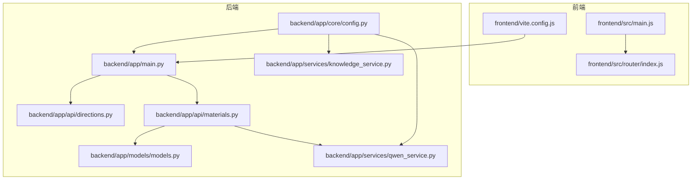
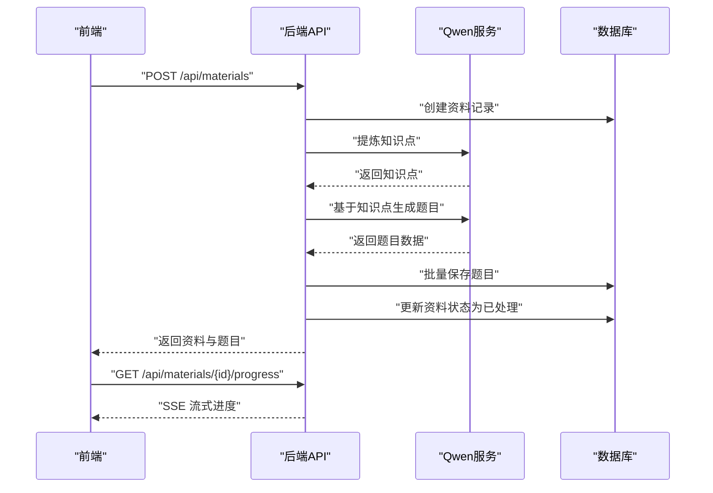
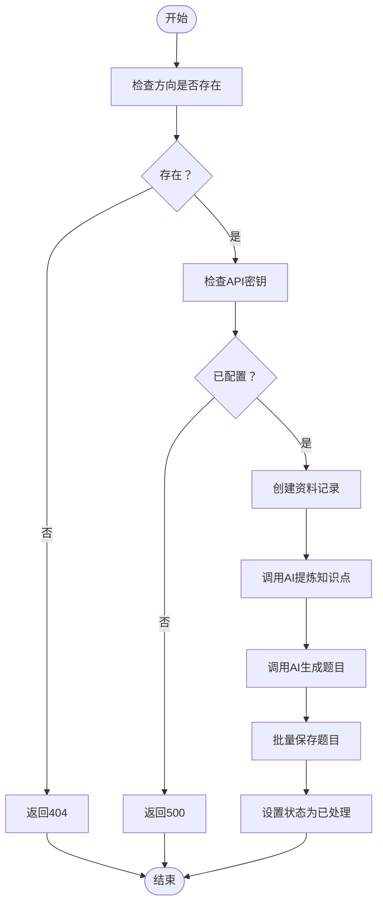
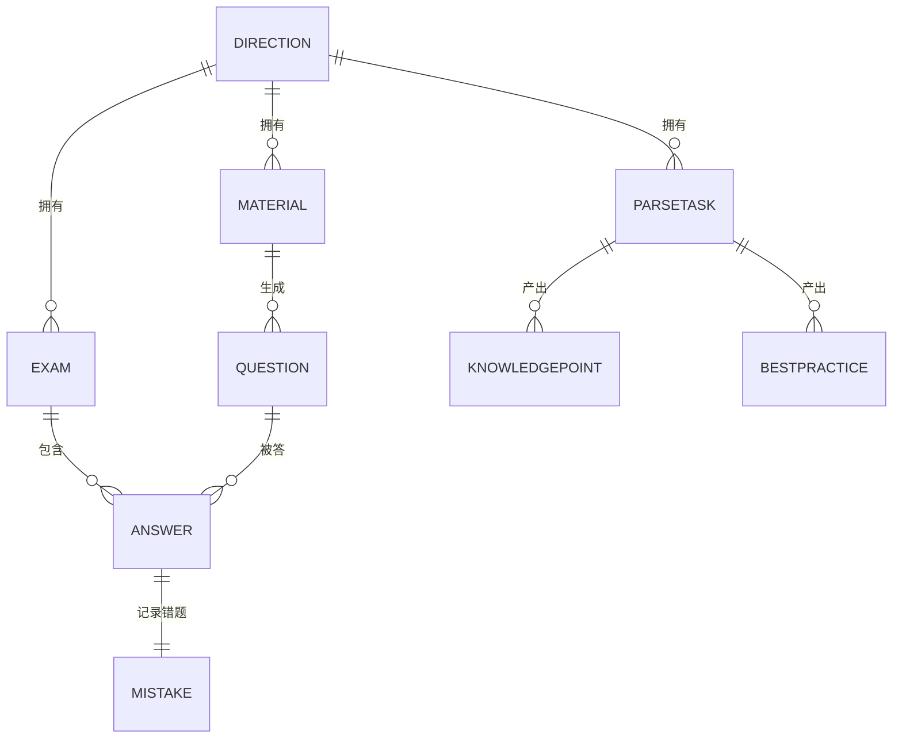
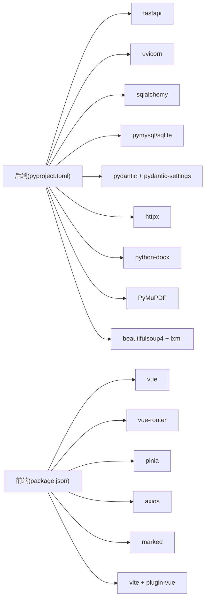

# 开发者指南

<cite>
**本文引用的文件**
- [backend/app/main.py](file://backend/app/main.py)
- [backend/app/core/config.py](file://backend/app/core/config.py)
- [backend/app/api/directions.py](file://backend/app/api/directions.py)
- [backend/app/api/materials.py](file://backend/app/api/materials.py)
- [backend/app/models/models.py](file://backend/app/models/models.py)
- [backend/app/services/qwen_service.py](file://backend/app/services/qwen_service.py)
- [backend/app/services/knowledge_service.py](file://backend/app/services/knowledge_service.py)
- [backend/pyproject.toml](file://backend/pyproject.toml)
- [frontend/package.json](file://frontend/package.json)
- [frontend/src/main.js](file://frontend/src/main.js)
- [frontend/src/router/index.js](file://frontend/src/router/index.js)
- [frontend/vite.config.js](file://frontend/vite.config.js)
- [backend/test_api.py](file://backend/test_api.py)
</cite>

## 目录
1. [简介](#简介)
2. [项目结构](#项目结构)
3. [核心组件](#核心组件)
4. [架构总览](#架构总览)
5. [详细组件分析](#详细组件分析)
6. [依赖关系分析](#依赖关系分析)
7. [性能考虑](#性能考虑)
8. [故障排查指南](#故障排查指南)
9. [结论](#结论)
10. [附录](#附录)

## 简介
本指南面向贡献者与新加入的开发者，目标是帮助你快速理解并高效扩展“个人学习管理系统”。文档覆盖代码规范与命名约定、架构原则、新功能开发流程、目录结构与模块组织、调试与性能分析、问题排查、Git 工作流与代码审查标准、第三方集成与插件扩展机制，以及常见开发场景的最佳实践与反模式。

## 项目结构
项目采用前后端分离架构：
- 后端：基于 FastAPI 的 Python 应用，使用 SQLAlchemy 进行 ORM 映射，提供 REST API 与 SSE 流式进度通知。
- 前端：基于 Vue 3 + Pinia + Vue Router 的单页应用，通过 Vite 构建，开发服务器代理到后端。
- 配置与运行：后端通过 .env 读取配置；前端通过 Vite 代理解决跨域问题；提供启动脚本与测试脚本。

图表来源
- [backend/app/main.py](file://backend/app/main.py#L1-L66)
- [backend/app/core/config.py](file://backend/app/core/config.py#L1-L34)
- [backend/app/api/directions.py](file://backend/app/api/directions.py#L1-L51)
- [backend/app/api/materials.py](file://backend/app/api/materials.py#L1-L203)
- [backend/app/models/models.py](file://backend/app/models/models.py#L1-L223)
- [backend/app/services/qwen_service.py](file://backend/app/services/qwen_service.py#L1-L156)
- [backend/app/services/knowledge_service.py](file://backend/app/services/knowledge_service.py#L1-L114)
- [frontend/src/main.js](file://frontend/src/main.js#L1-L12)
- [frontend/src/router/index.js](file://frontend/src/router/index.js#L1-L47)
- [frontend/vite.config.js](file://frontend/vite.config.js#L1-L22)

章节来源
- [backend/app/main.py](file://backend/app/main.py#L1-L66)
- [frontend/src/main.js](file://frontend/src/main.js#L1-L12)
- [frontend/src/router/index.js](file://frontend/src/router/index.js#L1-L47)
- [frontend/vite.config.js](file://frontend/vite.config.js#L1-L22)

## 核心组件
- 应用入口与路由注册：后端应用在入口文件中创建 FastAPI 实例、配置 CORS、注册各模块路由，并在启动事件中初始化数据库与上传目录。
- 配置系统：统一读取 .env，提供应用名、数据库连接、通义千问 API 参数、上传目录与文件大小限制等。
- API 层：按功能拆分为方向、资料、题目、测验、错题、解析等路由模块，职责清晰。
- 服务层：封装通义千问与知识解析服务，负责与外部模型交互与结果解析。
- 模型层：定义实体与枚举，建立方向、资料、题目、测验、答题、错题、解析任务、知识点、最佳实践等关系。
- 前端：Vue 应用，路由映射到各视图，Vite 代理到后端，使用 Axios 发起请求。

章节来源
- [backend/app/main.py](file://backend/app/main.py#L1-L66)
- [backend/app/core/config.py](file://backend/app/core/config.py#L1-L34)
- [backend/app/api/directions.py](file://backend/app/api/directions.py#L1-L51)
- [backend/app/api/materials.py](file://backend/app/api/materials.py#L1-L203)
- [backend/app/models/models.py](file://backend/app/models/models.py#L1-L223)
- [backend/app/services/qwen_service.py](file://backend/app/services/qwen_service.py#L1-L156)
- [backend/app/services/knowledge_service.py](file://backend/app/services/knowledge_service.py#L1-L114)
- [frontend/src/main.js](file://frontend/src/main.js#L1-L12)
- [frontend/src/router/index.js](file://frontend/src/router/index.js#L1-L47)

## 架构总览
系统采用“前端渲染 + 后端 API + 外部模型服务”的三层架构。前端通过 Axios 调用后端 /api 前缀接口；后端使用 SQLAlchemy 连接 SQLite 或 MySQL；资料处理流程通过 SSE 向前端流式推送进度；外部模型服务由通义千问提供。

图表来源
- [backend/app/api/materials.py](file://backend/app/api/materials.py#L82-L161)
- [backend/app/services/qwen_service.py](file://backend/app/services/qwen_service.py#L37-L114)
- [backend/app/models/models.py](file://backend/app/models/models.py#L78-L114)

## 详细组件分析

### 配置模块（Settings 与 get_settings）
- 设计要点：继承 BaseSettings，使用 LRU 缓存单例，从 .env 加载键值，集中管理应用、数据库、模型服务与上传参数。
- 命名约定：类名 Settings，函数 get_settings，常量前缀 settings。
- 扩展建议：新增配置项时，先在类中声明默认值与注释，再在 .env 中补充对应键。

章节来源
- [backend/app/core/config.py](file://backend/app/core/config.py#L1-L34)

### 应用入口与中间件（FastAPI）
- 设计要点：创建应用实例、CORS 允许所有来源（开发）、注册 /api 前缀路由、启动事件创建表与上传目录、根与健康检查端点。
- 命名约定：app 变量、startup/health 函数、include_router 使用前缀与标签。
- 扩展建议：生产环境调整 CORS 策略，确保静态资源与上传目录权限。

章节来源
- [backend/app/main.py](file://backend/app/main.py#L1-L66)

### 学习方向 API（方向 CRUD）
- 功能：列出、创建、查询、删除学习方向；创建时校验唯一性。
- 错误处理：404 表示资源不存在，400 表示重复创建。
- 命名约定：router 前缀 /directions，响应模型 DirectionResponse，创建模型 DirectionCreate。

章节来源
- [backend/app/api/directions.py](file://backend/app/api/directions.py#L1-L51)

### 学习资料 API（SSE 流式处理）
- 功能：上传资料并同步处理（提炼知识点 → 生成题目 → 保存题目），支持 SSE 进度流。
- 流程控制：PENDING/PROCESSED/FAILED 状态机；SSE 步骤 extracting/extracted/generating/generated/saving/completed/error。
- 错误处理：捕获异常并回滚状态；记录日志；返回标准化错误消息。
- 命名约定：generate_material_stream 生成器、progress 接口、MaterialStatus 枚举。

图表来源
- [backend/app/api/materials.py](file://backend/app/api/materials.py#L82-L161)

章节来源
- [backend/app/api/materials.py](file://backend/app/api/materials.py#L1-L203)

### 服务层：通义千问封装
- 设计要点：封装 chat/completions 请求，统一 JSON 解析与容错；提供知识点提炼、题目生成、主观题评分三个能力。
- 命名约定：QwenService 类，单例 qwen_service；温度参数用于控制创造性。
- 扩展建议：增加超时与重试策略、结果缓存、日志埋点。

章节来源
- [backend/app/services/qwen_service.py](file://backend/app/services/qwen_service.py#L1-L156)

### 服务层：知识解析服务
- 设计要点：面向“解析任务”抽取“知识点与最佳实践”，返回结构化 JSON；具备容错解析逻辑。
- 命名约定：KnowledgeService 类，单例 knowledge_service。
- 扩展建议：支持多模态输入、增量解析、向量化存储。

章节来源
- [backend/app/services/knowledge_service.py](file://backend/app/services/knowledge_service.py#L1-L114)

### 数据模型与关系
- 实体：Direction、Material、Question、Exam、Answer、Mistake、ParseTask、KnowledgePoint、BestPractice。
- 枚举：MaterialStatus、QuestionType、QuestionRating、ExamMode、ScoreType、ExamStatus、SourceType、TaskStatus。
- 关系：方向-资料-题目、资料-解析任务-知识点/最佳实践、测验-答题-错题等。

图表来源
- [backend/app/models/models.py](file://backend/app/models/models.py#L63-L223)

章节来源
- [backend/app/models/models.py](file://backend/app/models/models.py#L1-L223)

### 前端应用与路由
- 应用入口：创建 Vue 应用，挂载 Pinia 与路由。
- 路由：首页、资料、题目、测验（开始/作答/结果）、错题。
- 开发代理：Vite 将 /api 代理到后端 8000 端口，解决跨域。

章节来源
- [frontend/src/main.js](file://frontend/src/main.js#L1-L12)
- [frontend/src/router/index.js](file://frontend/src/router/index.js#L1-L47)
- [frontend/vite.config.js](file://frontend/vite.config.js#L1-L22)

## 依赖关系分析
- 后端依赖：FastAPI、Uvicorn、SQLAlchemy、PyMySQL/SQLite、Pydantic/Settings、httpx、PyMuPDF/docx、BeautifulSoup/lxml、Cryptography、dotenv。
- 前端依赖：Vue 3、Vue Router、Pinia、Axios、Marked、Vite 插件。

图表来源
- [backend/pyproject.toml](file://backend/pyproject.toml#L1-L29)
- [frontend/package.json](file://frontend/package.json#L1-L23)

章节来源
- [backend/pyproject.toml](file://backend/pyproject.toml#L1-L29)
- [frontend/package.json](file://frontend/package.json#L1-L23)

## 性能考虑
- 异步与并发：资料处理流程使用异步 HTTP 客户端，建议在高并发场景下引入队列与后台任务（Celery/RQ）解耦长耗时操作。
- SSE 流式：前端监听 SSE，避免一次性加载大量数据；后端按阶段推送进度，降低前端等待时间。
- 数据库：SQLite 适合本地开发；生产建议使用 MySQL/PostgreSQL 并启用索引与连接池。
- 外部模型：合理设置超时与重试；对高频调用增加本地缓存；对 JSON 解析失败进行降级处理。
- 前端构建：Vite 默认优化；生产构建开启压缩与分包；路由懒加载减少首屏体积。

## 故障排查指南
- 启动与健康检查
  - 后端启动失败：检查 .env 是否存在且键值正确；确认数据库连接串与上传目录权限。
  - 健康检查 500：查看数据库初始化日志与 CORS 配置。
- 资料处理失败
  - API 密钥未配置：后端会返回 500，需在 .env 设置 QWEN_API_KEY。
  - 处理异常：查看后端日志与资料状态是否回滚至 FAILED。
- 前端无法访问后端
  - 检查 Vite 代理配置是否指向后端地址；确认 /api 前缀一致。
- 快速自测
  - 使用测试脚本验证模型服务可用性与返回格式。

章节来源
- [backend/app/main.py](file://backend/app/main.py#L45-L66)
- [backend/app/api/materials.py](file://backend/app/api/materials.py#L94-L96)
- [backend/test_api.py](file://backend/test_api.py#L1-L30)
- [frontend/vite.config.js](file://frontend/vite.config.js#L14-L19)

## 结论
本项目以清晰的模块划分与稳定的依赖栈为基础，提供了从资料上传到题目生成的完整链路，并通过 SSE 提供良好的用户体验。建议在后续迭代中引入后台任务、缓存与监控，进一步提升可扩展性与稳定性。

## 附录

### 代码规范与命名约定
- 文件与模块
  - 后端模块按功能拆分（api、services、models、schemas、core），文件名小写加下划线。
  - 前端组件以 .vue 结尾，视图组件位于 views，路由配置在 router。
- 类与函数
  - 类名使用 PascalCase；函数/方法使用 snake_case；常量全大写。
  - 服务类统一以 Service 结尾，提供单例实例。
- 路由与响应
  - 路由前缀统一 /api；标签用于 OpenAPI 文档；响应模型与创建模型区分。
- 配置
  - 所有配置项在 Settings 中集中声明，使用 get_settings 获取单例。

### 新功能开发流程（从需求到测试）
- 需求分析：明确业务目标、数据模型变更、API 变更范围。
- 设计与建模：在 models 中新增或修改实体与枚举；编写迁移脚本（如需）。
- API 设计：在 api 下新增模块，定义路由、请求/响应模型。
- 服务层：在 services 中实现对外部服务的封装与调用。
- 控制器实现：在 API 模块中实现业务逻辑，处理异常与状态码。
- 前端对接：在 router 中新增路由，创建视图组件，发起请求并展示数据。
- 测试：编写单元测试与集成测试，覆盖关键路径与异常分支。
- 文档与审查：更新 README 与 OpenAPI 文档，提交 PR 并进行代码审查。

### Git 工作流与代码审查标准
- 分支策略：主分支保护，功能开发在 feature/* 分支，修复在 hotfix/* 分支。
- 提交规范：主题清晰、变更聚焦、附带测试与文档更新。
- 代码审查：至少一名维护者同意；关注安全性、性能、可维护性与一致性。
- 合并策略：squash 合并保持历史整洁；合并后清理分支。

### 第三方集成与插件扩展机制
- 外部模型服务：通过服务层抽象（如 QwenService），便于替换与扩展。
- 解析器扩展：新增解析器时，在 models 中扩展 ParseTask/KnowledgePoint/BestPractice 关系。
- 插件化建议：定义统一接口与配置项，通过工厂模式动态加载。

### 常见开发场景最佳实践与反模式
- 最佳实践
  - 使用 Pydantic 校验请求参数；在服务层做幂等与重试。
  - SSE 流式推送进度，前端按步骤渲染，避免阻塞。
  - 统一异常处理与状态码，保证 API 一致性。
- 反模式
  - 在路由中直接做复杂业务逻辑；忽略数据库事务与回滚。
  - 忽视外部服务超时与限流；不处理 JSON 解析异常。
  - 前端直接硬编码后端地址，未使用代理。