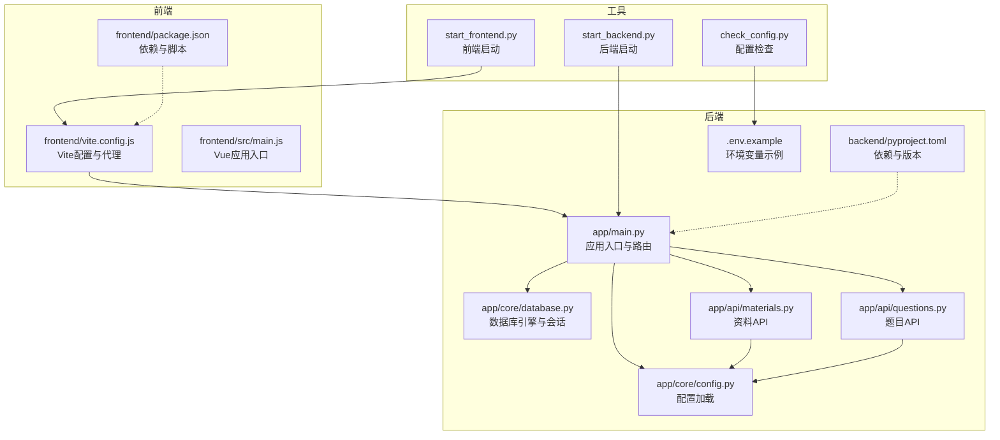
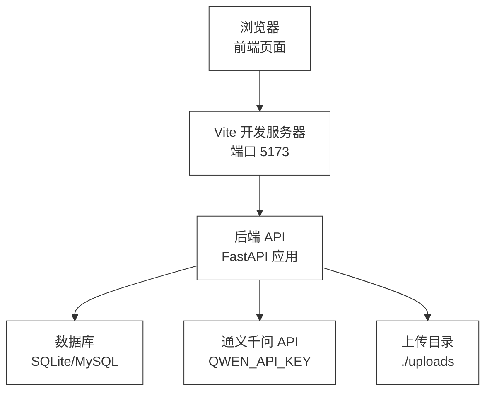
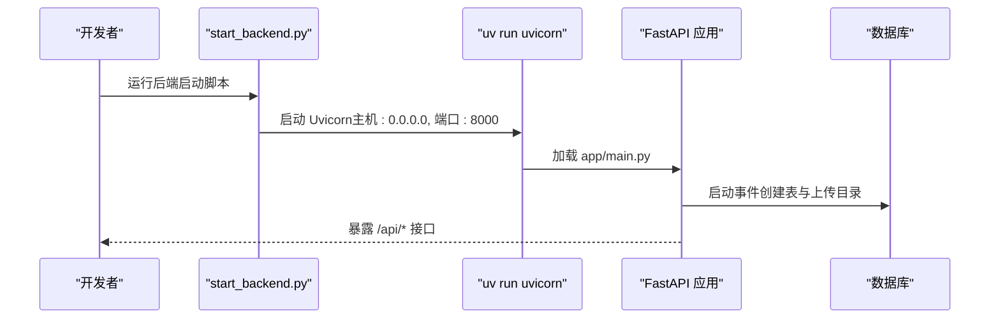
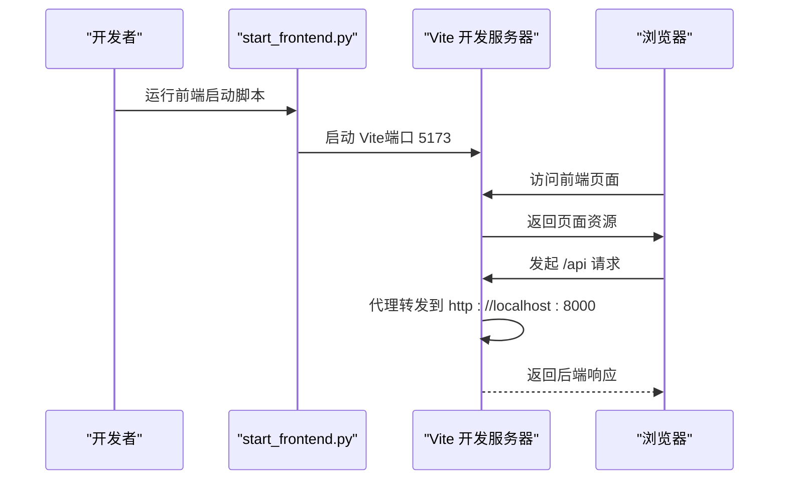
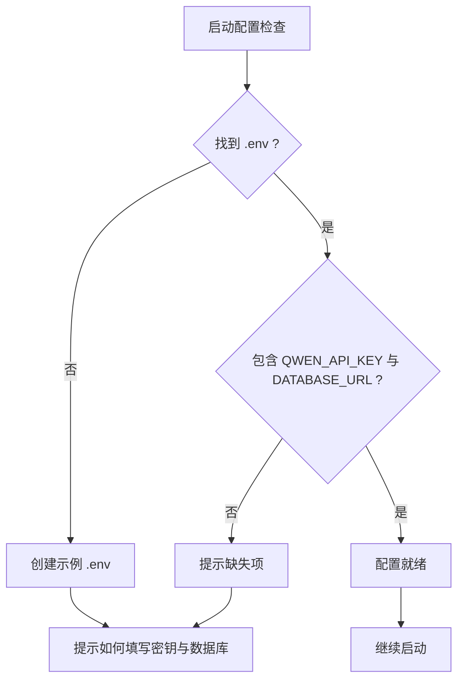
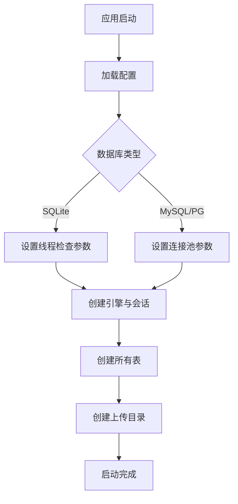
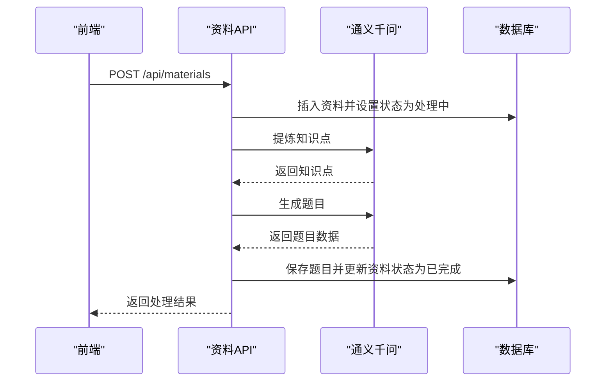
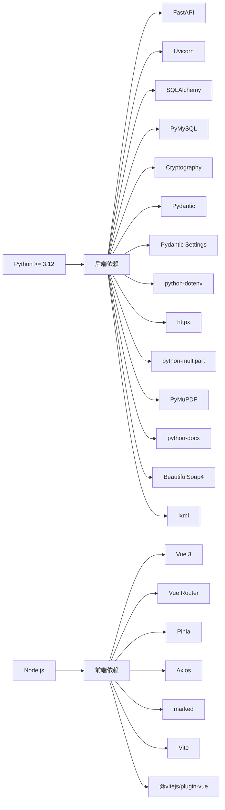

# 快速开始

<cite>
**本文引用的文件**
- [README.md](file://README.md)
- [backend/pyproject.toml](file://backend/pyproject.toml)
- [frontend/package.json](file://frontend/package.json)
- [backend/.env.example](file://backend/.env.example)
- [check_config.py](file://check_config.py)
- [start_backend.py](file://start_backend.py)
- [start_frontend.py](file://start_frontend.py)
- [backend/app/main.py](file://backend/app/main.py)
- [backend/app/core/config.py](file://backend/app/core/config.py)
- [backend/app/core/database.py](file://backend/app/core/database.py)
- [frontend/vite.config.js](file://frontend/vite.config.js)
- [frontend/src/main.js](file://frontend/src/main.js)
- [backend/app/api/materials.py](file://backend/app/api/materials.py)
- [backend/app/api/questions.py](file://backend/app/api/questions.py)
- [backend/test_api.py](file://backend/test_api.py)
- [backend/test_full_flow.py](file://backend/test_full_flow.py)
</cite>

## 目录
1. [简介](#简介)
2. [项目结构](#项目结构)
3. [核心组件](#核心组件)
4. [架构总览](#架构总览)
5. [详细组件分析](#详细组件分析)
6. [依赖关系分析](#依赖关系分析)
7. [性能注意事项](#性能注意事项)
8. [故障排除指南](#故障排除指南)
9. [结论](#结论)
10. [附录](#附录)

## 简介
本指南旨在帮助开发者在本地快速搭建并运行“个人学习管理系统”。系统采用前后端分离架构：后端基于 Python 的 FastAPI 框架，提供 REST API；前端基于 Vue 3 + Vite，提供交互界面。系统支持学习资料上传、知识点提炼、题目生成与管理等核心功能。

## 项目结构
项目采用分层组织方式，后端与前端分别位于独立目录，便于独立开发与部署。关键文件与职责如下：
- 后端
  - 应用入口与路由注册：backend/app/main.py
  - 配置与数据库：backend/app/core/config.py、backend/app/core/database.py
  - API 路由：backend/app/api/materials.py、backend/app/api/questions.py 等
  - 依赖与版本：backend/pyproject.toml
  - 环境变量示例：backend/.env.example
- 前端
  - 构建与代理：frontend/vite.config.js
  - 应用入口：frontend/src/main.js
  - 依赖与脚本：frontend/package.json
- 启动脚本
  - 后端启动：start_backend.py
  - 前端启动：start_frontend.py
- 配置检查工具：check_config.py
- 测试脚本：backend/test_api.py、backend/test_full_flow.py

图表来源
- [backend/app/main.py](file://backend/app/main.py#L1-L66)
- [backend/app/core/config.py](file://backend/app/core/config.py#L1-L34)
- [backend/app/core/database.py](file://backend/app/core/database.py#L1-L38)
- [backend/app/api/materials.py](file://backend/app/api/materials.py#L1-L203)
- [backend/app/api/questions.py](file://backend/app/api/questions.py#L1-L90)
- [frontend/vite.config.js](file://frontend/vite.config.js#L1-L22)
- [frontend/src/main.js](file://frontend/src/main.js#L1-L12)
- [backend/pyproject.toml](file://backend/pyproject.toml#L1-L29)
- [frontend/package.json](file://frontend/package.json#L1-L23)
- [backend/.env.example](file://backend/.env.example#L1-L14)
- [start_backend.py](file://start_backend.py#L1-L17)
- [start_frontend.py](file://start_frontend.py#L1-L11)
- [check_config.py](file://check_config.py#L1-L105)

章节来源
- [backend/app/main.py](file://backend/app/main.py#L1-L66)
- [frontend/vite.config.js](file://frontend/vite.config.js#L1-L22)
- [backend/pyproject.toml](file://backend/pyproject.toml#L1-L29)
- [frontend/package.json](file://frontend/package.json#L1-L23)

## 核心组件
- 后端框架与运行
  - 使用 FastAPI 提供 API，Uvicorn 作为 ASGI 服务器，默认监听 0.0.0.0:8000。
  - 通过 uv 包管理器与 uv run 启动，自动激活虚拟环境。
- 前端框架与运行
  - 使用 Vue 3 + Vite，开发服务器默认端口 5173。
  - 通过 Vite 代理将 /api 请求转发至后端 8000 端口。
- 配置与数据库
  - 配置通过 pydantic-settings 加载 .env 文件，支持 SQLite 与 MySQL。
  - 启动时自动创建数据库表与上传目录。
- AI 能力
  - 通过通义千问 API 进行知识点提炼与题目生成，需配置 QWEN_API_KEY。

章节来源
- [backend/app/main.py](file://backend/app/main.py#L1-L66)
- [backend/app/core/config.py](file://backend/app/core/config.py#L1-L34)
- [backend/app/core/database.py](file://backend/app/core/database.py#L1-L38)
- [backend/.env.example](file://backend/.env.example#L1-L14)
- [start_backend.py](file://start_backend.py#L1-L17)
- [frontend/vite.config.js](file://frontend/vite.config.js#L1-L22)

## 架构总览
系统采用前后端分离架构，前端通过代理访问后端 API。后端负责业务逻辑、数据库操作与 AI 能力调用；前端负责用户交互与展示。

图表来源
- [frontend/vite.config.js](file://frontend/vite.config.js#L14-L19)
- [backend/app/main.py](file://backend/app/main.py#L36-L42)
- [backend/app/core/database.py](file://backend/app/core/database.py#L20-L28)
- [backend/app/core/config.py](file://backend/app/core/config.py#L16-L23)
- [backend/.env.example](file://backend/.env.example#L1-L14)

## 详细组件分析

### 后端启动流程（开发模式）
- 切换到 backend 目录，使用 uv run 启动 uvicorn，开启自动重载与 0.0.0.0 监听。
- 应用启动事件中创建数据库表与上传目录。
- 注册多个 API 路由前缀为 /api，统一暴露接口。

图表来源
- [start_backend.py](file://start_backend.py#L1-L17)
- [backend/app/main.py](file://backend/app/main.py#L45-L50)

章节来源
- [start_backend.py](file://start_backend.py#L1-L17)
- [backend/app/main.py](file://backend/app/main.py#L1-L66)

### 前端启动流程（开发模式）
- 切换到 frontend 目录，使用 bunx 启动 Vite 开发服务器。
- Vite 配置了代理，将 /api 请求转发到后端 8000 端口。
- 应用入口初始化 Vue、Pinia、路由并挂载。

图表来源
- [start_frontend.py](file://start_frontend.py#L1-L11)
- [frontend/vite.config.js](file://frontend/vite.config.js#L12-L20)
- [frontend/src/main.js](file://frontend/src/main.js#L1-L12)

章节来源
- [start_frontend.py](file://start_frontend.py#L1-L11)
- [frontend/vite.config.js](file://frontend/vite.config.js#L1-L22)
- [frontend/src/main.js](file://frontend/src/main.js#L1-L12)

### 配置与环境变量
- 配置加载
  - 通过 pydantic-settings 从 .env 文件加载配置，支持应用名称、调试开关、数据库 URL、AI 模型与上传目录等。
- 环境变量示例
  - 提供 .env.example，包含通义千问 API 配置与数据库 URL（MySQL/SQLite）示例。
- 配置检查工具
  - 自动检测 .env 是否存在、关键配置项是否就绪，并可生成示例 .env 文件。

图表来源
- [check_config.py](file://check_config.py#L10-L53)
- [backend/.env.example](file://backend/.env.example#L1-L14)

章节来源
- [backend/app/core/config.py](file://backend/app/core/config.py#L1-L34)
- [backend/.env.example](file://backend/.env.example#L1-L14)
- [check_config.py](file://check_config.py#L1-L105)

### 数据库初始化与模型
- 引擎与会话
  - 根据数据库 URL 自动选择 SQLite 或 MySQL/PG 的连接参数，启用 echo（调试模式）。
- 表创建
  - 应用启动时调用 create_all 创建所有表。
- 上传目录
  - 确保上传目录存在，用于存放资料文件。

图表来源
- [backend/app/core/database.py](file://backend/app/core/database.py#L8-L28)
- [backend/app/main.py](file://backend/app/main.py#L45-L50)

章节来源
- [backend/app/core/database.py](file://backend/app/core/database.py#L1-L38)
- [backend/app/main.py](file://backend/app/main.py#L1-L66)

### API 功能概览（资料与题目）
- 资料 API
  - 支持创建资料并同步进行知识点提炼与题目生成，完成后更新状态。
  - 支持进度查询（SSE），实时反馈处理阶段与进度。
  - 支持删除资料及关联题目。
- 题目 API
  - 支持按条件筛选题目、获取详情、更新题目、评价题目、删除题目。

图表来源
- [backend/app/api/materials.py](file://backend/app/api/materials.py#L82-L161)
- [backend/app/api/questions.py](file://backend/app/api/questions.py#L11-L30)

章节来源
- [backend/app/api/materials.py](file://backend/app/api/materials.py#L1-L203)
- [backend/app/api/questions.py](file://backend/app/api/questions.py#L1-L90)

## 依赖关系分析
- 后端依赖
  - FastAPI、Uvicorn、SQLAlchemy、PyMySQL、Cryptography、Pydantic、Pydantic Settings、python-dotenv、httpx、python-multipart、PyMuPDF、python-docx、BeautifulSoup4、lxml。
- 前端依赖
  - Vue 3、Vue Router、Pinia、Axios、marked、Vite、@vitejs/plugin-vue。
- 版本要求
  - Python >= 3.12（后端 pyproject.toml）。
  - Node.js 与包管理器（Vite 默认使用 npm/yarn/bun，项目中使用 bunx 启动）。

图表来源
- [backend/pyproject.toml](file://backend/pyproject.toml#L6-L22)
- [frontend/package.json](file://frontend/package.json#L11-L21)

章节来源
- [backend/pyproject.toml](file://backend/pyproject.toml#L1-L29)
- [frontend/package.json](file://frontend/package.json#L1-L23)

## 性能注意事项
- 数据库连接池
  - MySQL/PG 场景启用 pool_pre_ping 与 pool_recycle，提升连接稳定性。
- SQLite 注意事项
  - SQLite 不建议在高并发场景使用，适合开发与小规模测试。
- 上传与解析
  - 限制最大文件大小，避免过大文件导致内存压力。
- AI 调用
  - 题目生成与知识点提炼为网络请求，注意 API 调用频率与配额。

章节来源
- [backend/app/core/database.py](file://backend/app/core/database.py#L14-L18)
- [backend/app/core/config.py](file://backend/app/core/config.py#L22-L23)

## 故障排除指南
- 缺少 .env 或关键配置
  - 使用配置检查工具自动生成示例 .env 并按提示填写 API 密钥与数据库 URL。
- 无法连接数据库
  - 确认 DATABASE_URL 正确，若使用 MySQL 需确保服务可用与账号权限。
- 通义千问 API 错误
  - 确认 QWEN_API_KEY 已正确配置，模型名称与基础地址符合预期。
- 健康检查失败
  - 后端提供 /health 接口，若返回异常，检查日志与数据库连接。
- 前端无法访问后端接口
  - 确认 Vite 代理配置指向后端 8000 端口，且后端已启动。

章节来源
- [check_config.py](file://check_config.py#L55-L82)
- [backend/.env.example](file://backend/.env.example#L1-L14)
- [backend/app/main.py](file://backend/app/main.py#L62-L65)
- [frontend/vite.config.js](file://frontend/vite.config.js#L14-L19)

## 结论
通过本指南，您可以完成环境准备、配置与依赖安装、数据库初始化以及前后端的启动与基本使用。系统提供了资料上传、知识点提炼与题目生成的核心能力，适合个人学习与教学辅助场景。如需扩展，可在现有 API 与数据库模型基础上继续开发。

## 附录

### 环境要求
- Python
  - 版本要求：>= 3.12（后端 pyproject.toml）。
- Node.js
  - 版本：推荐使用 Node.js 与 bun（项目中使用 bunx 启动 Vite）。
- 数据库
  - 支持 SQLite（默认）与 MySQL/PG（通过 DATABASE_URL 配置）。

章节来源
- [backend/pyproject.toml](file://backend/pyproject.toml#L6-L6)
- [backend/app/core/config.py](file://backend/app/core/config.py#L14-L14)
- [backend/.env.example](file://backend/.env.example#L6-L9)

### 安装与启动步骤
- 准备工作
  - 安装 Python（>= 3.12）与 Node.js。
  - 安装后端依赖管理工具（uv）与前端包管理工具（bun）。
- 后端
  - 进入项目根目录，运行后端启动脚本，自动切换到 backend 并启动 uvicorn。
- 前端
  - 进入项目根目录，运行前端启动脚本，自动切换到 frontend 并启动 Vite。
- 配置
  - 使用配置检查工具生成 .env 示例，填写 QWEN_API_KEY 与 DATABASE_URL。
- 数据库初始化
  - 后端启动时自动创建数据库表与上传目录。

章节来源
- [start_backend.py](file://start_backend.py#L1-L17)
- [start_frontend.py](file://start_frontend.py#L1-L11)
- [check_config.py](file://check_config.py#L55-L82)
- [backend/app/main.py](file://backend/app/main.py#L45-L50)

### 基本使用示例
- 启动后端与前端
  - 分别运行后端与前端启动脚本，打开浏览器访问前端页面。
- 体验资料处理
  - 在前端提交学习资料，后端将进行知识点提炼与题目生成，可通过进度接口查看处理状态。
- 查看题目
  - 在前端查看生成的题目，支持按资料或方向筛选。

章节来源
- [backend/app/api/materials.py](file://backend/app/api/materials.py#L164-L185)
- [backend/app/api/questions.py](file://backend/app/api/questions.py#L11-L30)

### 开发模式与生产模式差异
- 开发模式
  - 后端：自动重载、调试模式开启、CORS 允许所有来源。
  - 前端：Vite 开发服务器、代理到后端 8000 端口。
- 生产模式
  - 后端：关闭调试模式、严格 CORS 配置、使用生产级 WSGI 服务器（建议使用 uvicorn 的生产部署方式）。
  - 前端：构建产物部署至静态服务器，后端提供静态文件服务或通过反向代理统一对外提供服务。

章节来源
- [backend/app/main.py](file://backend/app/main.py#L19-L34)
- [frontend/vite.config.js](file://frontend/vite.config.js#L12-L20)

### 测试与验证
- 单元测试脚本
  - 提供测试脚本验证知识点提炼与题目生成流程，便于确认 AI 能力与数据处理链路正常。
- 端到端流程测试
  - 提供完整流程测试脚本，覆盖从知识点提炼到题目生成与对象创建的全过程。

章节来源
- [backend/test_api.py](file://backend/test_api.py#L1-L30)
- [backend/test_full_flow.py](file://backend/test_full_flow.py#L1-L56)