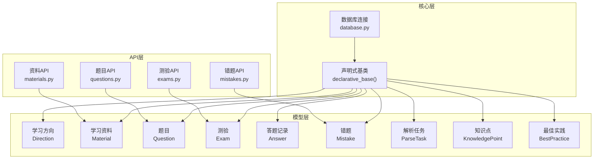
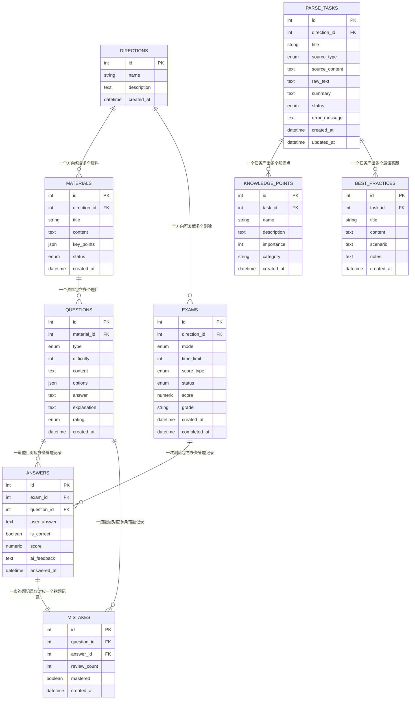
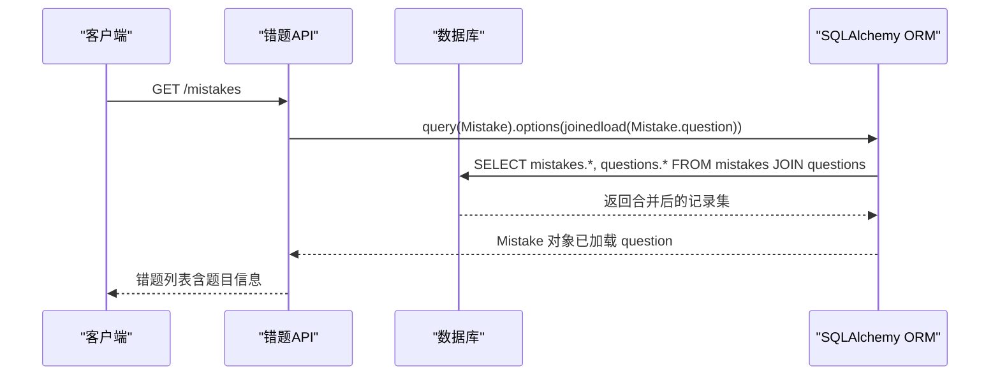
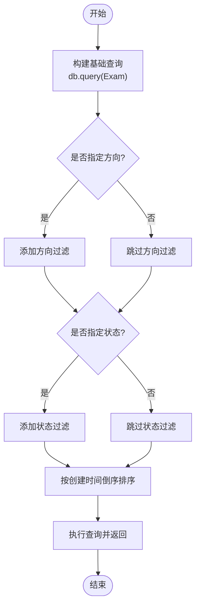
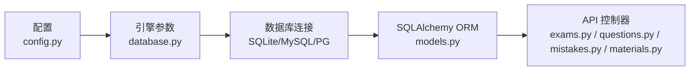

# 关系映射设计

<cite>
**本文引用的文件**
- [models.py](file://backend/app/models/models.py)
- [database.py](file://backend/app/core/database.py)
- [schemas.py](file://backend/app/schemas/schemas.py)
- [exams.py](file://backend/app/api/exams.py)
- [questions.py](file://backend/app/api/questions.py)
- [mistakes.py](file://backend/app/api/mistakes.py)
- [materials.py](file://backend/app/api/materials.py)
- [config.py](file://backend/app/core/config.py)
- [pyproject.toml](file://backend/pyproject.toml)
</cite>

## 目录
1. [简介](#简介)
2. [项目结构](#项目结构)
3. [核心组件](#核心组件)
4. [架构总览](#架构总览)
5. [详细组件分析](#详细组件分析)
6. [依赖分析](#依赖分析)
7. [性能考量](#性能考量)
8. [故障排查指南](#故障排查指南)
9. [结论](#结论)
10. [附录](#附录)

## 简介
本设计文档聚焦于数据库实体间的关系映射与关联设计，系统性阐述一对一、一对多、多对多关系在 SQLAlchemy 中的实现方式；深入解释 relationship() 函数的使用与 back_populates 参数的作用；详细说明外键约束与级联操作的配置；对比延迟加载与立即加载的性能影响；给出复杂查询与关联查询的最佳实践，并提供性能优化技巧与索引设计建议。本文所有分析均基于仓库中的实际代码实现。

## 项目结构
后端采用 FastAPI + SQLAlchemy 的分层架构，数据模型集中于 models 层，数据库连接与会话管理位于 core 层，API 控制器在 api 层，数据传输对象在 schemas 层。关系映射主要集中在 models.py 中，通过 relationship(back_populates=...) 建立双向关联，配合外键约束与级联策略实现完整的业务关系。

图表来源
- [database.py](file://backend/app/core/database.py#L1-L38)
- [models.py](file://backend/app/models/models.py#L63-L223)
- [exams.py](file://backend/app/api/exams.py#L1-L240)
- [questions.py](file://backend/app/api/questions.py#L1-L90)
- [mistakes.py](file://backend/app/api/mistakes.py#L1-L90)
- [materials.py](file://backend/app/api/materials.py#L1-L203)

章节来源
- [database.py](file://backend/app/core/database.py#L1-L38)
- [models.py](file://backend/app/models/models.py#L1-L223)

## 核心组件
本项目围绕“学习方向”作为根实体，向下派生“学习资料”、“解析任务”，再由“学习资料”派生“题目”，由“测验”关联“题目”和“学习方向”。答题记录与错题作为中间关联实体，形成闭环的学习评估体系。核心关系如下：
- 一对一：Answer 与 Mistake（一对一反向关系 uselist=False）
- 一对多：Direction → Material/Exam/ParseTask；Material → Question；Exam → Answer；ParseTask → KnowledgePoint/BestPractice
- 多对多：通过中间表 Answer 间接实现 Exam 与 Question 的多对多关联

章节来源
- [models.py](file://backend/app/models/models.py#L63-L223)

## 架构总览
下图展示实体关系与典型查询路径，体现 back_populates 在双向导航上的作用以及外键约束如何保证数据一致性。

图表来源
- [models.py](file://backend/app/models/models.py#L63-L223)

## 详细组件分析

### 实体关系与外键约束
- 外键约束
  - Material.direction_id → Directions.id
  - Question.material_id → Materials.id
  - Exam.direction_id → Directions.id
  - Answer.exam_id → Exams.id
  - Answer.question_id → Questions.id
  - Mistake.question_id → Questions.id
  - Mistake.answer_id → Answers.id
  - ParseTask.direction_id → Directions.id（ondelete="SET NULL"）
  - KnowledgePoint.task_id → ParseTasks.id
  - BestPractice.task_id → ParseTasks.id
- 级联操作
  - ParseTask.knowledge_points / best_practices：使用 cascade="all, delete-orphan"，删除任务时自动清理子项
  - Answer.mistake：uselist=False，一对一反向关系，避免重复绑定

章节来源
- [models.py](file://backend/app/models/models.py#L78-L223)

### relationship() 与 back_populates 参数
- 双向导航：通过 back_populates 在主从两端建立互指，便于从任一侧访问关联对象
- 示例
  - Question.material ←→ Material.questions
  - Exam.answers ←→ Answer.exam
  - Answer.question ←→ Question.answers
  - Mistake.answer ←→ Answer.mistake（一对一 uselist=False）

章节来源
- [models.py](file://backend/app/models/models.py#L78-L168)

### 关联查询与加载策略
- 延迟加载（默认）：访问关联属性时才触发 SQL 查询，适合按需加载，避免 N+1 查询问题
- 立即加载（joinedload/selectinload）：在主查询时一次性加载关联数据，减少往返次数，但可能带来额外的数据传输与内存占用
- 实际使用
  - 错题列表 API 使用 joinedload 加载 Question，确保返回包含题目详情
  - 测验详情 API 在有答题记录时直接按题目 ID 列表批量查询，避免不必要的 JOIN

图表来源
- [mistakes.py](file://backend/app/api/mistakes.py#L11-L30)

章节来源
- [mistakes.py](file://backend/app/api/mistakes.py#L1-L90)

### 复杂查询与最佳实践
- 多表关联查询
  - 通过 join 将 Question 与 Material 连接，按方向过滤题目
  - 在测验详情中，优先复用已存在的答题记录 ID 列表，避免重复 JOIN
- 条件筛选
  - 支持按方向、状态、类型等多维度过滤
- 批量操作
  - 资料删除时先删除其题目，避免外键约束冲突

图表来源
- [exams.py](file://backend/app/api/exams.py#L29-L44)

章节来源
- [exams.py](file://backend/app/api/exams.py#L1-L240)
- [questions.py](file://backend/app/api/questions.py#L1-L90)
- [materials.py](file://backend/app/api/materials.py#L188-L203)

### 关系映射的性能影响
- 延迟加载
  - 优点：按需加载，减少初始查询开销
  - 风险：N+1 查询问题，频繁访问关联属性时产生大量往返
- 立即加载
  - 优点：减少往返次数，提升整体吞吐
  - 风险：数据量大时增加网络与内存压力
- 最佳实践
  - 明确加载策略：对高频访问的关联使用 joinedload
  - 批量查询：利用 IN 子句或预先收集 ID 列表，避免逐条访问
  - 限制返回字段：仅选择必要列，避免 SELECT *

章节来源
- [mistakes.py](file://backend/app/api/mistakes.py#L11-L30)
- [exams.py](file://backend/app/api/exams.py#L90-L124)

## 依赖分析
- 数据库引擎与连接池
  - SQLite：禁用线程检查，适用于单线程环境
  - MySQL/PostgreSQL：启用 pool_pre_ping 与 pool_recycle，提升连接稳定性
- 版本与依赖
  - SQLAlchemy 2.x，FastAPI，Pydantic，httpx 等

图表来源
- [config.py](file://backend/app/core/config.py#L1-L34)
- [database.py](file://backend/app/core/database.py#L1-L38)
- [pyproject.toml](file://backend/pyproject.toml#L1-L29)

章节来源
- [config.py](file://backend/app/core/config.py#L1-L34)
- [database.py](file://backend/app/core/database.py#L1-L38)
- [pyproject.toml](file://backend/pyproject.toml#L1-L29)

## 性能考量
- 关系映射优化
  - 使用 back_populates 建立双向导航，避免手动 JOIN，简化查询逻辑
  - 对高频访问的关联使用 joinedload，减少往返次数
  - 对批量操作使用 IN 查询或预先收集 ID，避免 N+1
- 索引设计建议
  - 外键列（如 materials.direction_id、questions.material_id、exams.direction_id、answers.exam_id、answers.question_id、mistakes.question_id、mistakes.answer_id、parse_tasks.direction_id、knowledge_points.task_id、best_practices.task_id）应建立索引，加速 JOIN 与过滤
  - 经常用于过滤的列（如 status、mode、type、rating、mastered）建议建立复合索引或单独索引
- 缓存与批处理
  - 对静态或低频变更的数据（如方向、题目类型枚举）可考虑缓存
  - 批量写入时使用 flush/commit 合理拆分事务，避免长时间锁持有

[本节为通用性能指导，不直接分析具体文件]

## 故障排查指南
- 外键约束错误
  - 现象：删除父实体时报外键约束错误
  - 排查：确认子实体是否被删除或置空；对于可选方向的任务，使用 ondelete="SET NULL"
- N+1 查询
  - 现象：循环访问关联属性导致大量查询
  - 排查：使用 joinedload 或批量 IN 查询；避免在循环中逐条访问关联
- 级联删除异常
  - 现象：删除父实体时子实体未被清理
  - 排查：确认 cascade="all, delete-orphan" 是否正确配置；确保子实体的外键非空且指向父实体

章节来源
- [models.py](file://backend/app/models/models.py#L176-L190)
- [mistakes.py](file://backend/app/api/mistakes.py#L11-L30)

## 结论
本项目通过清晰的实体关系设计与合理的 SQLAlchemy 关系映射，实现了从“学习方向”到“资料—题目—测验—答题—错题”的完整闭环。back_populates 提供了稳定的双向导航，外键约束与级联策略保障了数据一致性。结合延迟/立即加载策略与批量查询实践，可在保证功能完整性的同时获得良好的性能表现。后续可在索引设计与缓存策略上进一步优化，以应对更大规模的数据访问场景。

[本节为总结性内容，不直接分析具体文件]

## 附录
- 关系映射清单
  - 一对一：Answer.mistake ↔ Mistake.answer
  - 一对多：Direction → Material/Exam/ParseTask；Material → Question；Exam → Answer；ParseTask → KnowledgePoint/BestPractice
  - 多对多：Exam 与 Question 通过 Answer 间接关联
- 关键配置参考
  - 外键约束与 ondelete 策略
  - cascade="all, delete-orphan" 用于解析任务的子项
  - joinedload 用于错题详情的即时加载

[本节为概览性内容，不直接分析具体文件]