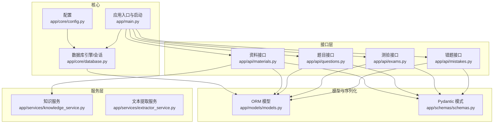
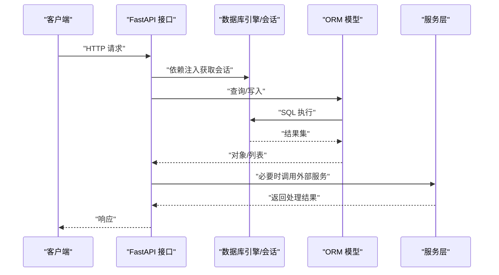
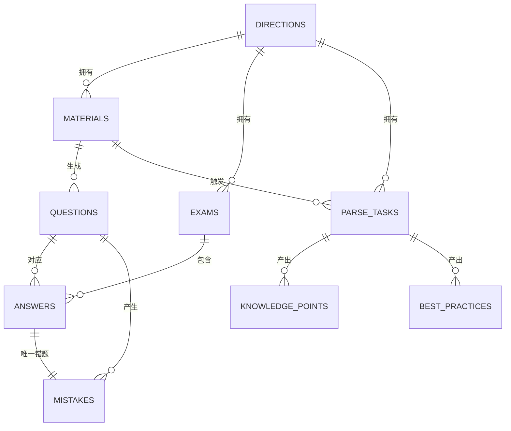
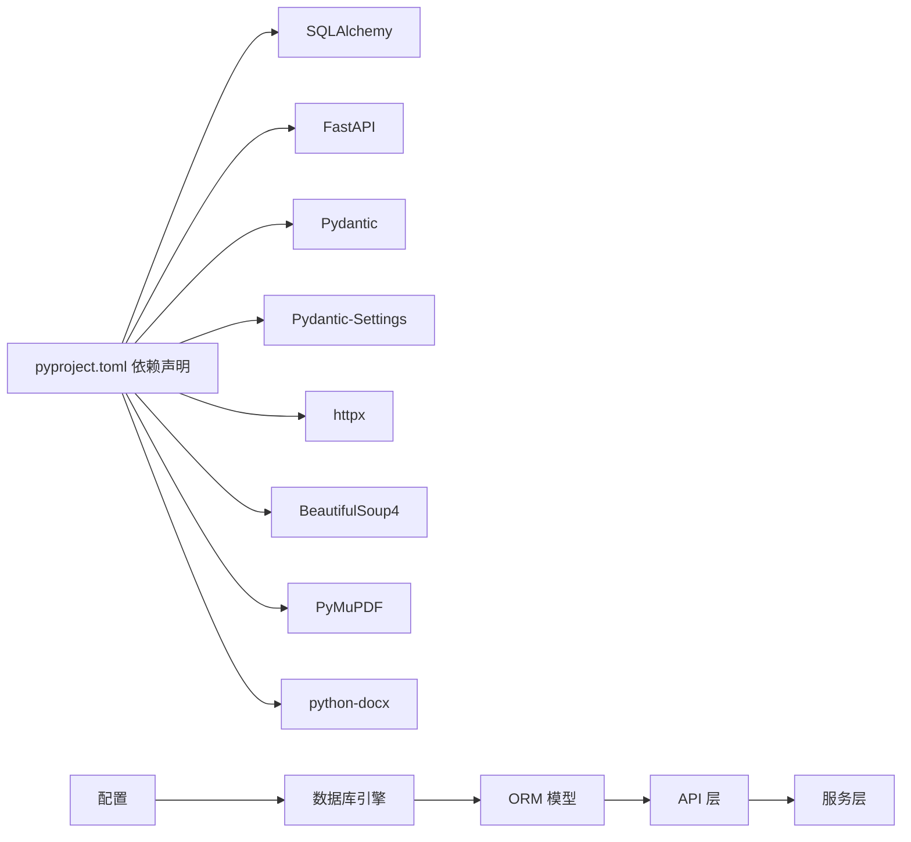

# 数据库设计

<cite>
**本文引用的文件**
- [backend/app/core/database.py](file://backend/app/core/database.py)
- [backend/app/core/config.py](file://backend/app/core/config.py)
- [backend/app/models/models.py](file://backend/app/models/models.py)
- [backend/app/schemas/schemas.py](file://backend/app/schemas/schemas.py)
- [backend/app/main.py](file://backend/app/main.py)
- [backend/app/api/materials.py](file://backend/app/api/materials.py)
- [backend/app/api/questions.py](file://backend/app/api/questions.py)
- [backend/app/api/exams.py](file://backend/app/api/exams.py)
- [backend/app/api/mistakes.py](file://backend/app/api/mistakes.py)
- [backend/app/services/knowledge_service.py](file://backend/app/services/knowledge_service.py)
- [backend/app/services/extractor_service.py](file://backend/app/services/extractor_service.py)
- [backend/check_db.py](file://backend/check_db.py)
- [backend/pyproject.toml](file://backend/pyproject.toml)
</cite>

## 目录
1. [简介](#简介)
2. [项目结构](#项目结构)
3. [核心组件](#核心组件)
4. [架构总览](#架构总览)
5. [详细组件分析](#详细组件分析)
6. [依赖分析](#依赖分析)
7. [性能考虑](#性能考虑)
8. [故障排查指南](#故障排查指南)
9. [结论](#结论)
10. [附录](#附录)

## 简介
本文件面向“个人学习管理系统”的数据库设计与实现，基于 SQLAlchemy ORM 映射与 FastAPI 接口，系统化梳理实体关系、字段定义、约束与索引、业务规则、数据访问模式、缓存策略、性能优化、数据生命周期与迁移方案，并给出 SQL 查询优化建议与常见问题排查路径。

## 项目结构
后端采用分层组织：核心配置与数据库连接、模型定义、序列化模式、API 路由、服务层、入口应用与启动初始化。数据库默认使用 SQLite 文件数据库，生产可切换为 MySQL/PostgreSQL。

图表来源
- [backend/app/core/config.py](file://backend/app/core/config.py#L1-L34)
- [backend/app/core/database.py](file://backend/app/core/database.py#L1-L38)
- [backend/app/main.py](file://backend/app/main.py#L1-L66)
- [backend/app/models/models.py](file://backend/app/models/models.py#L1-L223)
- [backend/app/schemas/schemas.py](file://backend/app/schemas/schemas.py#L1-L265)
- [backend/app/api/materials.py](file://backend/app/api/materials.py#L1-L203)
- [backend/app/api/questions.py](file://backend/app/api/questions.py#L1-L90)
- [backend/app/api/exams.py](file://backend/app/api/exams.py#L1-L240)
- [backend/app/api/mistakes.py](file://backend/app/api/mistakes.py#L1-L90)
- [backend/app/services/knowledge_service.py](file://backend/app/services/knowledge_service.py#L1-L114)
- [backend/app/services/extractor_service.py](file://backend/app/services/extractor_service.py#L1-L123)

章节来源
- [backend/app/core/config.py](file://backend/app/core/config.py#L1-L34)
- [backend/app/core/database.py](file://backend/app/core/database.py#L1-L38)
- [backend/app/main.py](file://backend/app/main.py#L1-L66)

## 核心组件
- 数据库引擎与会话：统一创建引擎、会话工厂与 Base 基类；SQLite 与 MySQL/PG 的差异化参数；依赖注入 get_db。
- ORM 模型：定义实体、枚举、字段、约束、关系与级联行为。
- Pydantic 模式：输入/输出数据结构与序列化。
- API 层：围绕实体提供 CRUD、聚合查询、评分与结果统计。
- 服务层：文本提取、知识解析与评分调用。

章节来源
- [backend/app/core/database.py](file://backend/app/core/database.py#L1-L38)
- [backend/app/models/models.py](file://backend/app/models/models.py#L1-L223)
- [backend/app/schemas/schemas.py](file://backend/app/schemas/schemas.py#L1-L265)
- [backend/app/api/materials.py](file://backend/app/api/materials.py#L1-L203)
- [backend/app/api/questions.py](file://backend/app/api/questions.py#L1-L90)
- [backend/app/api/exams.py](file://backend/app/api/exams.py#L1-L240)
- [backend/app/api/mistakes.py](file://backend/app/api/mistakes.py#L1-L90)
- [backend/app/services/knowledge_service.py](file://backend/app/services/knowledge_service.py#L1-L114)
- [backend/app/services/extractor_service.py](file://backend/app/services/extractor_service.py#L1-L123)

## 架构总览
系统采用“配置 → 引擎/会话 → 模型 → API → 服务 → 数据库”的分层架构。启动时自动建表，接口通过依赖注入获取会话，服务层负责外部调用与数据处理。

图表来源
- [backend/app/main.py](file://backend/app/main.py#L45-L50)
- [backend/app/core/database.py](file://backend/app/core/database.py#L31-L37)
- [backend/app/api/materials.py](file://backend/app/api/materials.py#L82-L161)
- [backend/app/api/questions.py](file://backend/app/api/questions.py#L11-L30)
- [backend/app/api/exams.py](file://backend/app/api/exams.py#L47-L87)
- [backend/app/api/mistakes.py](file://backend/app/api/mistakes.py#L11-L30)
- [backend/app/services/knowledge_service.py](file://backend/app/services/knowledge_service.py#L51-L109)

## 详细组件分析

### 实体关系与 ER 图
系统包含以下核心实体：学习方向、学习资料、题目、测验、答题记录、错题、解析任务、知识点、最佳实践。它们之间存在多对一、一对多与一对一关系。

图表来源
- [backend/app/models/models.py](file://backend/app/models/models.py#L63-L223)

章节来源
- [backend/app/models/models.py](file://backend/app/models/models.py#L63-L223)

### 字段定义、数据类型、约束与索引

- 学习方向（Directions）
  - 字段：id（主键）、name（非空、唯一）、description、created_at（默认当前时间）
  - 约束：name 唯一性
  - 索引：无显式索引，但唯一约束通常隐含索引
  - 关系：与资料、测验、解析任务一对多

- 学习资料（Materials）
  - 字段：id（主键）、direction_id（外键，非空）、title（非空）、content（非空）、key_points（JSON）、status（枚举，默认 pending）、created_at（默认当前时间）
  - 约束：外键指向方向；status 枚举
  - 索引：无显式索引
  - 关系：与方向、题目一对多

- 题目（Questions）
  - 字段：id（主键）、material_id（外键，非空）、type（枚举，非空）、difficulty（整数，默认3）、content（非空）、options（JSON）、answer（非空）、explanation（文本）、rating（枚举）、created_at（默认当前时间）
  - 约束：外键指向资料；type/rating 枚举
  - 索引：无显式索引
  - 关系：与资料、答题、错题一对多/一对一

- 测验（Exams）
  - 字段：id（主键）、direction_id（外键，非空）、mode（枚举，默认 untimed）、time_limit（整数，限时模式时使用）、score_type（枚举，默认 hundred）、status（枚举，默认 in_progress）、score（数值，最多5位，2位小数）、grade（字符串长度1）、created_at、completed_at
  - 约束：外键指向方向；枚举值
  - 索引：无显式索引
  - 关系：与方向、答题一对多

- 答题记录（Answers）
  - 字段：id（主键）、exam_id（外键，非空）、question_id（外键，非空）、user_answer（非空）、is_correct（布尔）、score（数值，最多5位，2位小数）、ai_feedback（文本）、answered_at（默认当前时间）
  - 约束：外键指向测验与题目
  - 索引：无显式索引
  - 关系：与测验、题目、错题一对一

- 错题（Mistakes）
  - 字段：id（主键）、question_id（外键，非空）、answer_id（外键，非空）、review_count（整数，默认0）、mastered（布尔，默认false）、created_at（默认当前时间）
  - 约束：question_id、answer_id 唯一组合（由一对一关系保证）
  - 索引：无显式索引
  - 关系：与题目、答题一对一

- 解析任务（ParseTasks）
  - 字段：id（主键）、direction_id（外键，可空，删除时置空）、title（非空）、source_type（枚举，非空）、source_content（非空）、raw_text、summary、status（枚举，默认 pending）、error_message、created_at、updated_at（默认当前时间，更新时自动更新）
  - 约束：枚举；ondelete="SET NULL"
  - 索引：无显式索引
  - 关系：与方向、知识点、最佳实践一对多（级联删除孤儿）

- 知识点（KnowledgePoints）
  - 字段：id（主键）、task_id（外键，非空）、name（非空）、description（非空）、importance（整数，默认3）、category、created_at（默认当前时间）
  - 约束：外键指向解析任务
  - 索引：无显式索引
  - 关系：与解析任务一对多

- 最佳实践（BestPractices）
  - 字段：id（主键）、task_id（外键，非空）、title（非空）、content（非空）、scenario、notes、created_at（默认当前时间）
  - 约束：外键指向解析任务
  - 索引：无显式索引
  - 关系：与解析任务一对多

章节来源
- [backend/app/models/models.py](file://backend/app/models/models.py#L63-L223)

### 主键、外键关系与表间关联模式
- 主键：各表均以自增整数 id 为主键。
- 外键：
  - Materials.direction_id → Directions.id
  - Questions.material_id → Materials.id
  - Exams.direction_id → Directions.id
  - Answers.exam_id → Exams.id
  - Answers.question_id → Questions.id
  - Mistakes.question_id → Questions.id
  - Mistakes.answer_id → Answers.id
  - KnowledgePoints.task_id → ParseTasks.id
  - BestPractices.task_id → ParseTasks.id
  - ParseTasks.direction_id → Directions.id（ondelete="SET NULL"）
- 关联模式：
  - 一对多：方向 → 资料/测验/解析任务；资料 → 题目；测验 → 答题；解析任务 → 知识点/最佳实践
  - 一对一：答题 → 错题（Mistake.answer 为 one-to-one）

章节来源
- [backend/app/models/models.py](file://backend/app/models/models.py#L63-L223)

### 数据验证规则与业务逻辑约束
- 资料处理流程：
  - 创建资料后立即触发知识点提炼与题目生成，失败时将状态置为 failed。
  - SSE 进度流用于异步展示处理阶段。
- 题目评分：
  - 客观题精确匹配；主观题通过外部服务评分并按阈值判定正确与否。
- 测验状态：
  - 未完成时可提交；完成后禁止重复提交。
  - 完成后计算总分、等级（按 score_type 决定）。
- 错题管理：
  - 答错自动加入错题本；支持手动标记掌握与增加复习次数。
- 文本解析：
  - 支持 PDF、DOCX、MD、TXT；URL 抓取正文并清洗标签。
- 知识解析：
  - 输出结构化 JSON，包含摘要、知识点与最佳实践。

章节来源
- [backend/app/api/materials.py](file://backend/app/api/materials.py#L27-L80)
- [backend/app/api/materials.py](file://backend/app/api/materials.py#L82-L161)
- [backend/app/api/exams.py](file://backend/app/api/exams.py#L127-L216)
- [backend/app/api/mistakes.py](file://backend/app/api/mistakes.py#L47-L77)
- [backend/app/services/extractor_service.py](file://backend/app/services/extractor_service.py#L30-L118)
- [backend/app/services/knowledge_service.py](file://backend/app/services/knowledge_service.py#L51-L109)

### 数据访问模式与缓存策略
- 数据访问模式：
  - 使用 SQLAlchemy ORM 查询与写入；API 层通过依赖注入获取会话。
  - 列表查询支持多条件过滤与排序；详情查询使用 join/option 加载关联。
- 缓存策略：
  - 默认未启用数据库层缓存；可在应用层引入 Redis 缓存热点数据（如方向列表、高频题目集合），注意写后失效与一致性。
  - 对于外部服务调用（知识解析、评分），可缓存结果以降低调用成本与延迟。

章节来源
- [backend/app/core/database.py](file://backend/app/core/database.py#L31-L37)
- [backend/app/api/questions.py](file://backend/app/api/questions.py#L11-L30)
- [backend/app/api/mistakes.py](file://backend/app/api/mistakes.py#L11-L30)

### 性能优化考虑
- 查询优化：
  - 在高频过滤字段（如 direction_id、status、created_at）上建立索引（见“索引设计”）。
  - 使用 joinedload 预加载关联，减少 N+1 查询。
  - 随机抽题使用 order_by(func.random())，大数据量时可考虑分页或预采样。
- 写入优化：
  - 批量插入题目时使用 flush/commit 合理拆分事务，避免超长事务锁竞争。
  - 大字段（JSON/Text）尽量惰性加载，避免一次读取过多。
- 外部服务：
  - 控制并发与超时；对失败重试与熔断保护。
- 数据库参数：
  - SQLite：禁用线程检查（多线程场景需谨慎）；生产建议使用 MySQL/PG 并开启连接池预热与回收。
  - MySQL/PG：启用 pool_pre_ping 与合理 pool_recycle。

章节来源
- [backend/app/api/questions.py](file://backend/app/api/questions.py#L24-L25)
- [backend/app/api/exams.py](file://backend/app/api/exams.py#L51-L58)
- [backend/app/core/database.py](file://backend/app/core/database.py#L12-L18)

### 数据生命周期管理、备份与迁移
- 生命周期：
  - 资料：创建 → 处理中 → 成功/失败；失败可重试。
  - 题目：随资料生成；可更新/删除。
  - 测验：创建 → 提交 → 完成；完成后不可再提交。
  - 错题：自动加入；可标记掌握与删除。
- 备份：
  - SQLite：定期复制 .db 文件；生产建议使用数据库快照或 WAL 模式。
  - MySQL/PG：使用官方备份工具（如 mysqldump/PG 备份）。
- 迁移：
  - 使用 Alembic 进行版本化迁移；新增字段建议可选并提供默认值，避免破坏现有数据。
  - 枚举变更需谨慎，建议新增值而非删除旧值，配合应用层兼容。

章节来源
- [backend/app/models/models.py](file://backend/app/models/models.py#L87-L88)
- [backend/app/api/exams.py](file://backend/app/api/exams.py#L138-L139)

### SQLAlchemy ORM 映射关系与查询优化技巧
- 映射关系：
  - 使用 relationship/back_populates 建立双向关系；one-to-one 通过 uselist=False。
  - 级联：解析任务的知识点/最佳实践使用“all, delete-orphan”，确保删除任务时清理子项。
- 查询优化技巧：
  - 使用 select_from/join 减少隐式连接开销。
  - 使用 func.random() 随机抽样时注意性能，必要时分页或预采样。
  - 使用 distinct/limit 控制结果规模。
  - 对频繁过滤字段建立索引。

章节来源
- [backend/app/models/models.py](file://backend/app/models/models.py#L90-L92)
- [backend/app/models/models.py](file://backend/app/models/models.py#L189-L190)
- [backend/app/api/exams.py](file://backend/app/api/exams.py#L51-L58)

## 依赖分析
- 外部依赖：
  - SQLAlchemy 2.x、FastAPI、Pydantic、Pydantic-Settings、httpx、BeautifulSoup、PyMuPDF、python-docx 等。
- 内部依赖：
  - 配置 → 数据库引擎；模型 → 数据库 Base；API → 模型/模式；服务 → 配置/外部接口。

图表来源
- [backend/pyproject.toml](file://backend/pyproject.toml#L7-L22)
- [backend/app/core/config.py](file://backend/app/core/config.py#L6-L28)
- [backend/app/core/database.py](file://backend/app/core/database.py#L2-L4)

章节来源
- [backend/pyproject.toml](file://backend/pyproject.toml#L1-L29)
- [backend/app/core/config.py](file://backend/app/core/config.py#L1-L34)

## 性能考虑
- 索引设计建议：
  - 在 Materials.direction_id、Questions.material_id、Exams.direction_id、Answers.exam_id、Answers.question_id、Mistakes.question_id、Mistakes.answer_id、KnowledgePoints.task_id、BestPractices.task_id 上建立索引。
  - 对高频过滤字段（如 status、created_at）建立复合索引以提升查询效率。
- 查询优化：
  - 使用 joinedload 预加载关联，避免 N+1。
  - 随机抽题时考虑分页或采样策略。
- 写入优化：
  - 批量写入时控制事务大小，避免长时间持有锁。
- 外部服务：
  - 设置合理的超时与重试；对失败进行熔断与降级。

## 故障排查指南
- 健康检查与最小验证：
  - 使用健康检查端点确认服务运行正常。
  - 使用数据库检查脚本验证基本查询。
- 常见问题：
  - SQLite 线程安全：多线程场景需谨慎；生产建议使用 MySQL/PG。
  - 外部服务失败：检查 API 密钥与网络连通性；查看日志与错误码。
  - 资料处理失败：查看状态字段与错误信息，重试或修正输入。
  - 测验重复提交：确认测验状态为 in_progress。
- 日志与追踪：
  - 接口层捕获异常并记录；服务层对 JSON 解析失败进行容错与日志记录。

章节来源
- [backend/app/main.py](file://backend/app/main.py#L62-L65)
- [backend/check_db.py](file://backend/check_db.py#L1-L8)
- [backend/app/api/materials.py](file://backend/app/api/materials.py#L144-L159)
- [backend/app/services/knowledge_service.py](file://backend/app/services/knowledge_service.py#L45-L49)

## 结论
本数据库设计围绕“学习方向—资料—题目—测验—答题—错题—解析任务—知识点/最佳实践”的完整闭环构建，通过清晰的实体关系、严格的枚举约束与合理的业务流程，支撑从资料上传到智能测评与错题巩固的全链路功能。建议后续在高频字段上补充索引、引入应用层缓存与版本化迁移工具，以进一步提升性能与可维护性。

## 附录
- 启动与建表：
  - 应用启动时自动创建所有表；确保上传目录存在。
- 数据库类型：
  - 默认 SQLite；可通过配置切换至 MySQL/PG。

章节来源
- [backend/app/main.py](file://backend/app/main.py#L45-L49)
- [backend/app/core/config.py](file://backend/app/core/config.py#L14-L14)