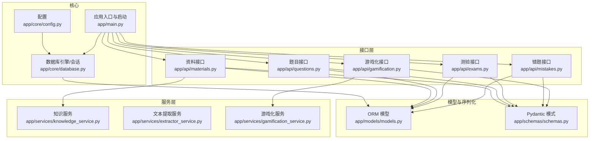
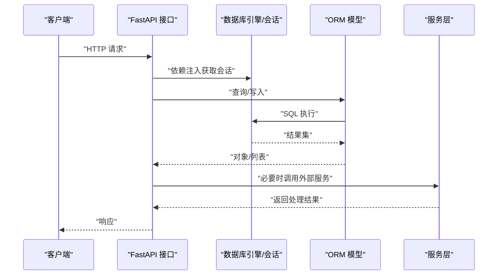
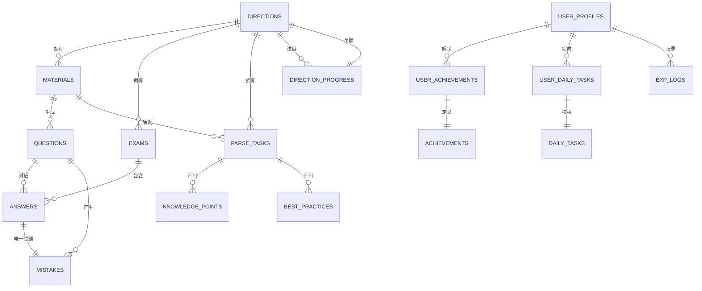
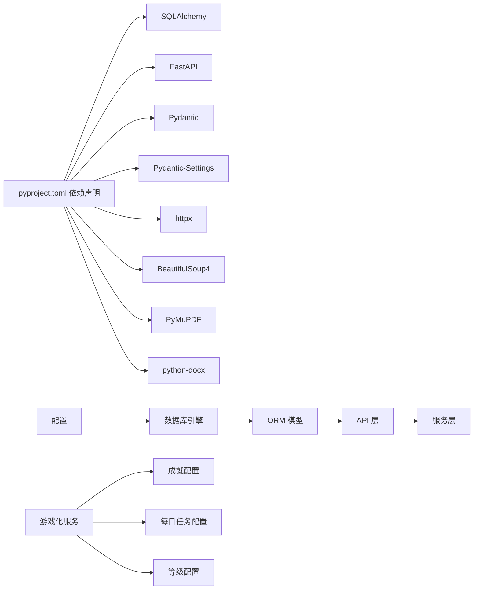

# 数据库设计

<cite>
**本文引用的文件**
- [backend/app/core/database.py](file://backend/app/core/database.py)
- [backend/app/core/config.py](file://backend/app/core/config.py)
- [backend/app/models/models.py](file://backend/app/models/models.py)
- [backend/app/schemas/schemas.py](file://backend/app/schemas/schemas.py)
- [backend/app/main.py](file://backend/app/main.py)
- [backend/app/api/materials.py](file://backend/app/api/materials.py)
- [backend/app/api/questions.py](file://backend/app/api/questions.py)
- [backend/app/api/exams.py](file://backend/app/api/exams.py)
- [backend/app/api/mistakes.py](file://backend/app/api/mistakes.py)
- [backend/app/api/gamification.py](file://backend/app/api/gamification.py)
- [backend/app/services/knowledge_service.py](file://backend/app/services/knowledge_service.py)
- [backend/app/services/extractor_service.py](file://backend/app/services/extractor_service.py)
- [backend/app/services/gamification_service.py](file://backend/app/services/gamification_service.py)
- [backend/app/core/achievements.py](file://backend/app/core/achievements.py)
- [backend/app/core/daily_tasks.py](file://backend/app/core/daily_tasks.py)
- [backend/app/core/level_config.py](file://backend/app/core/level_config.py)
- [backend/check_db.py](file://backend/check_db.py)
- [backend/pyproject.toml](file://backend/pyproject.toml)
</cite>

## 目录
1. [简介](#简介)
2. [项目结构](#项目结构)
3. [核心组件](#核心组件)
4. [架构总览](#架构总览)
5. [详细组件分析](#详细组件分析)
6. [依赖分析](#依赖分析)
7. [性能考虑](#性能考虑)
8. [故障排查指南](#故障排查指南)
9. [结论](#结论)
10. [附录](#附录)

## 简介
本文件面向"个人学习管理系统"的数据库设计与实现，基于 SQLAlchemy ORM 映射与 FastAPI 接口，系统化梳理实体关系、字段定义、约束与索引、业务规则、数据访问模式、缓存策略、性能优化、数据生命周期与迁移方案，并给出 SQL 查询优化建议与常见问题排查路径。

**更新** 新增游戏化系统模块，包含用户档案、成就系统、每日任务、经验管理和方向探索进度等核心功能。

## 项目结构
后端采用分层组织：核心配置与数据库连接、模型定义、序列化模式、API 路由、服务层、入口应用与启动初始化。数据库默认使用 SQLite 文件数据库，生产可切换为 MySQL/PostgreSQL。

```mermaid
graph TB
subgraph "核心"
CFG["配置<br/>app/core/config.py"]
DB["数据库引擎/会话<br/>app/core/database.py"]
MAIN["应用入口与启动<br/>app/main.py"]
end
subgraph "模型与序列化"
MODELS["ORM 模型<br/>app/models/models.py"]
SCHEMAS["Pydantic 模式<br/>app/schemas/schemas.py"]
end
subgraph "接口层"
MAT["资料接口<br/>app/api/materials.py"]
QUES["题目接口<br/>app/api/questions.py"]
EXAM["测验接口<br/>app/api/exams.py"]
MIST["错题接口<br/>app/api/mistakes.py"]
GAMIF["游戏化接口<br/>app/api/gamification.py"]
end
subgraph "服务层"
KNS["知识服务<br/>app/services/knowledge_service.py"]
EXT["文本提取服务<br/>app/services/extractor_service.py"]
GS["游戏化服务<br/>app/services/gamification_service.py"]
end
CFG --> DB
DB --> MODELS
MAIN --> DB
MAIN --> MAT
MAIN --> QUES
MAIN --> EXAM
MAIN --> MIST
MAIN --> GAMIF
MAT --> KNS
MAT --> MODELS
QUES --> MODELS
EXAM --> MODELS
MIST --> MODELS
GAMIF --> GS
MAT --> SCHEMAS
QUES --> SCHEMAS
EXAM --> SCHEMAS
MIST --> SCHEMAS
GAMIF --> SCHEMAS
```

**图表来源**
- [backend/app/core/config.py](file://backend/app/core/config.py#L1-L34)
- [backend/app/core/database.py](file://backend/app/core/database.py#L1-L38)
- [backend/app/main.py](file://backend/app/main.py#L1-L68)
- [backend/app/models/models.py](file://backend/app/models/models.py#L1-L321)
- [backend/app/schemas/schemas.py](file://backend/app/schemas/schemas.py#L1-L371)
- [backend/app/api/materials.py](file://backend/app/api/materials.py#L1-L203)
- [backend/app/api/questions.py](file://backend/app/api/questions.py#L1-L90)
- [backend/app/api/exams.py](file://backend/app/api/exams.py#L1-L240)
- [backend/app/api/mistakes.py](file://backend/app/api/mistakes.py#L1-L90)
- [backend/app/api/gamification.py](file://backend/app/api/gamification.py#L1-L129)
- [backend/app/services/knowledge_service.py](file://backend/app/services/knowledge_service.py#L1-L114)
- [backend/app/services/extractor_service.py](file://backend/app/services/extractor_service.py#L1-L123)
- [backend/app/services/gamification_service.py](file://backend/app/services/gamification_service.py#L1-L482)

**章节来源**
- [backend/app/core/config.py](file://backend/app/core/config.py#L1-L34)
- [backend/app/core/database.py](file://backend/app/core/database.py#L1-L38)
- [backend/app/main.py](file://backend/app/main.py#L1-L68)

## 核心组件
- 数据库引擎与会话：统一创建引擎、会话工厂与 Base 基类；SQLite 与 MySQL/PG 的差异化参数；依赖注入 get_db。
- ORM 模型：定义实体、枚举、字段、约束、关系与级联行为。
- Pydantic 模式：输入/输出数据结构与序列化。
- API 层：围绕实体提供 CRUD、聚合查询、评分与结果统计。
- 服务层：文本提取、知识解析与评分调用、游戏化系统处理。

**更新** 新增游戏化服务层，处理经验值、成就、每日任务和方向探索进度等游戏化功能。

**章节来源**
- [backend/app/core/database.py](file://backend/app/core/database.py#L1-L38)
- [backend/app/models/models.py](file://backend/app/models/models.py#L1-L321)
- [backend/app/schemas/schemas.py](file://backend/app/schemas/schemas.py#L1-L371)
- [backend/app/api/materials.py](file://backend/app/api/materials.py#L1-L203)
- [backend/app/api/questions.py](file://backend/app/api/questions.py#L1-L90)
- [backend/app/api/exams.py](file://backend/app/api/exams.py#L1-L240)
- [backend/app/api/mistakes.py](file://backend/app/api/mistakes.py#L1-L90)
- [backend/app/api/gamification.py](file://backend/app/api/gamification.py#L1-L129)
- [backend/app/services/knowledge_service.py](file://backend/app/services/knowledge_service.py#L1-L114)
- [backend/app/services/extractor_service.py](file://backend/app/services/extractor_service.py#L1-L123)
- [backend/app/services/gamification_service.py](file://backend/app/services/gamification_service.py#L1-L482)

## 架构总览
系统采用"配置 → 引擎/会话 → 模型 → API → 服务 → 数据库"的分层架构。启动时自动建表，接口通过依赖注入获取会话，服务层负责外部调用与数据处理。

```mermaid
sequenceDiagram
participant Client as "客户端"
participant API as "FastAPI 接口"
participant DB as "数据库引擎/会话"
participant Model as "ORM 模型"
participant Service as "服务层"
Client->>API : "HTTP 请求"
API->>DB : "依赖注入获取会话"
API->>Model : "查询/写入"
Model->>DB : "SQL 执行"
DB-->>Model : "结果集"
Model-->>API : "对象/列表"
API->>Service : "必要时调用外部服务"
Service-->>API : "返回处理结果"
API-->>Client : "响应"
```

**图表来源**
- [backend/app/main.py](file://backend/app/main.py#L47-L51)
- [backend/app/core/database.py](file://backend/app/core/database.py#L31-L37)
- [backend/app/api/materials.py](file://backend/app/api/materials.py#L82-L161)
- [backend/app/api/questions.py](file://backend/app/api/questions.py#L11-L30)
- [backend/app/api/exams.py](file://backend/app/api/exams.py#L47-L87)
- [backend/app/api/mistakes.py](file://backend/app/api/mistakes.py#L11-L30)
- [backend/app/api/gamification.py](file://backend/app/api/gamification.py#L24-L46)
- [backend/app/services/knowledge_service.py](file://backend/app/services/knowledge_service.py#L51-L109)
- [backend/app/services/gamification_service.py](file://backend/app/services/gamification_service.py#L21-L37)

## 详细组件分析

### 实体关系与 ER 图
系统包含以下核心实体：学习方向、学习资料、题目、测验、答题记录、错题、解析任务、知识点、最佳实践、用户档案、成就系统、每日任务、经验日志、方向进度。它们之间存在多对一、一对多与一对一关系。

```mermaid
erDiagram
DIRECTIONS ||--o{ MATERIALS : "拥有"
DIRECTIONS ||--o{ EXAMS : "拥有"
DIRECTIONS ||--o{ PARSE_TASKS : "拥有"
DIRECTIONS ||--o{ DIRECTION_PROGRESS : "进度"
MATERIALS ||--o{ QUESTIONS : "生成"
MATERIALS ||--o{ PARSE_TASKS : "触发"
EXAMS ||--o{ ANSWERS : "包含"
QUESTIONS ||--o{ ANSWERS : "对应"
QUESTIONS ||--o{ MISTAKES : "产生"
ANSWERS ||--|| MISTAKES : "唯一错题"
PARSE_TASKS ||--o{ KNOWLEDGE_POINTS : "产出"
PARSE_TASKS ||--o{ BEST_PRACTICES : "产出"
USER_PROFILES ||--o{ USER_ACHIEVEMENTS : "解锁"
USER_PROFILES ||--o{ USER_DAILY_TASKS : "完成"
USER_PROFILES ||--o{ EXP_LOGS : "记录"
USER_ACHIEVEMENTS ||--|| ACHIEVEMENTS : "定义"
USER_DAILY_TASKS ||--|| DAILY_TASKS : "模板"
DIRECTION_PROGRESS ||--|| DIRECTIONS : "关联"
```

**图表来源**
- [backend/app/models/models.py](file://backend/app/models/models.py#L63-L321)

**章节来源**
- [backend/app/models/models.py](file://backend/app/models/models.py#L63-L321)

### 字段定义、数据类型、约束与索引

#### 学习系统实体
- 学习方向（Directions）
  - 字段：id（主键）、name（非空、唯一）、description、created_at（默认当前时间）
  - 约束：name 唯一性
  - 索引：无显式索引，但唯一约束通常隐含索引
  - 关系：与资料、测验、解析任务、进度一对多

- 学习资料（Materials）
  - 字段：id（主键）、direction_id（外键，非空）、title（非空）、content（非空）、key_points（JSON）、status（枚举，默认 pending）、created_at（默认当前时间）
  - 约束：外键指向方向；status 枚举
  - 索引：无显式索引
  - 关系：与方向、题目一对多

- 题目（Questions）
  - 字段：id（主键）、material_id（外键，非空）、type（枚举，非空）、difficulty（整数，默认3）、content（非空）、options（JSON）、answer（非空）、explanation（文本）、rating（枚举）、created_at（默认当前时间）
  - 约束：外键指向资料；type/rating 枚举
  - 索引：无显式索引
  - 关系：与资料、答题、错题一对多/一对一

- 测验（Exams）
  - 字段：id（主键）、direction_id（外键，非空）、mode（枚举，默认 untimed）、time_limit（整数，限时模式时使用）、score_type（枚举，默认 hundred）、status（枚举，默认 in_progress）、score（数值，最多5位，2位小数）、grade（字符串长度1）、created_at、completed_at
  - 约束：外键指向方向；枚举值
  - 索引：无显式索引
  - 关系：与方向、答题一对多

- 答题记录（Answers）
  - 字段：id（主键）、exam_id（外键，非空）、question_id（外键，非空）、user_answer（非空）、is_correct（布尔）、score（数值，最多5位，2位小数）、ai_feedback（文本）、answered_at（默认当前时间）
  - 约束：外键指向测验与题目
  - 索引：无显式索引
  - 关系：与测验、题目、错题一对一

- 错题（Mistakes）
  - 字段：id（主键）、question_id（外键，非空）、answer_id（外键，非空）、review_count（整数，默认0）、mastered（布尔，默认false）、created_at（默认当前时间）
  - 约束：question_id、answer_id 唯一组合（由一对一关系保证）
  - 索引：无显式索引
  - 关系：与题目、答题一对一

- 解析任务（ParseTasks）
  - 字段：id（主键）、direction_id（外键，可空，删除时置空）、title（非空）、source_type（枚举，非空）、source_content（非空）、raw_text、summary、status（枚举，默认 pending）、error_message、created_at、updated_at（默认当前时间，更新时自动更新）
  - 约束：枚举；ondelete="SET NULL"
  - 索引：无显式索引
  - 关系：与方向、知识点、最佳实践一对多（级联删除孤儿）

- 知识点（KnowledgePoints）
  - 字段：id（主键）、task_id（外键，非空）、name（非空）、description（非空）、importance（整数，默认3）、category、created_at（默认当前时间）
  - 约束：外键指向解析任务
  - 索引：无显式索引
  - 关系：与解析任务一对多

- 最佳实践（BestPractices）
  - 字段：id（主键）、task_id（外键，非空）、title（非空）、content（非空）、scenario、notes、created_at（默认当前时间）
  - 约束：外键指向解析任务
  - 索引：无显式索引
  - 关系：与解析任务一对多

#### 游戏化系统实体
- 用户档案（UserProfile）
  - 字段：id（主键）、user_id（非空、唯一，默认1）、username（非空，默认"探险家"）、level（整数，默认1）、exp（整数，默认0）、total_exp（整数，默认0）、title（非空，默认"见习探险家"）、streak_days（整数，默认0）、last_login_date（日期）、created_at（默认当前时间）、updated_at（默认当前时间，更新时自动更新）
  - 约束：user_id 唯一性；单用户固定为1
  - 索引：无显式索引
  - 关系：与成就、每日任务、经验日志一对一

- 用户成就（UserAchievement）
  - 字段：id（主键）、user_id（非空，默认1）、achievement_id（非空）、unlocked_at（默认当前时间）
  - 约束：user_id、achievement_id 唯一组合
  - 索引：无显式索引
  - 关系：与成就定义一对一

- 用户每日任务（UserDailyTask）
  - 字段：id（主键）、user_id（非空，默认1）、task_id（非空）、date（非空）、target（整数）、current（整数，默认0）、completed（布尔，默认false）、exp_reward（整数）、created_at（默认当前时间）、completed_at（日期）
  - 约束：user_id、task_id、date 唯一组合
  - 索引：无显式索引
  - 关系：与每日任务模板一对一

- 经验日志（ExpLog）
  - 字段：id（主键）、user_id（非空，默认1）、exp_amount（整数）、source_type（枚举）、source_id（整数）、description（字符串）、created_at（默认当前时间）
  - 约束：无特殊约束
  - 索引：无显式索引
  - 关系：与用户档案一对一

- 方向进度（DirectionProgress）
  - 字段：id（主键）、user_id（非空，默认1）、direction_id（外键，非空）、total_questions（整数，默认0）、answered_questions（整数，默认0）、correct_questions（整数，默认0）、mastered_count（整数，默认0）、exploration_rate（数值，默认0）、last_studied_at（日期）、created_at（默认当前时间）、updated_at（默认当前时间，更新时自动更新）
  - 约束：user_id、direction_id 唯一组合
  - 索引：无显式索引
  - 关系：与方向一对一

**章节来源**
- [backend/app/models/models.py](file://backend/app/models/models.py#L63-L321)

### 主键、外键关系与表间关联模式
- 主键：各表均以自增整数 id 为主键。
- 外键：
  - Materials.direction_id → Directions.id
  - Questions.material_id → Materials.id
  - Exams.direction_id → Directions.id
  - Answers.exam_id → Exams.id
  - Answers.question_id → Questions.id
  - Mistakes.question_id → Questions.id
  - Mistakes.answer_id → Answers.id
  - KnowledgePoints.task_id → ParseTasks.id
  - BestPractices.task_id → ParseTasks.id
  - ParseTasks.direction_id → Directions.id（ondelete="SET NULL"）
  - UserDailyTask.user_id → UserProfiles.user_id
  - UserAchievement.user_id → UserProfiles.user_id
  - ExpLogs.user_id → UserProfiles.user_id
  - DirectionProgress.user_id → UserProfiles.user_id
  - DirectionProgress.direction_id → Directions.id
- 关联模式：
  - 一对多：方向 → 资料/测验/解析任务/进度；资料 → 题目；测验 → 答题；解析任务 → 知识点/最佳实践；用户档案 → 成就/每日任务/经验日志
  - 一对一：答题 → 错题（Mistake.answer 为 one-to-one）

**更新** 新增游戏化系统表间关联，包括用户档案与成就、每日任务、经验日志的一对多关系，以及方向进度与方向的一对多关系。

**章节来源**
- [backend/app/models/models.py](file://backend/app/models/models.py#L63-L321)

### 数据验证规则与业务逻辑约束
- 资料处理流程：
  - 创建资料后立即触发知识点提炼与题目生成，失败时将状态置为 failed。
  - SSE 进度流用于异步展示处理阶段。
- 题目评分：
  - 客观题精确匹配；主观题通过外部服务评分并按阈值判定正确与否。
- 测验状态：
  - 未完成时可提交；完成后禁止重复提交。
  - 完成后计算总分、等级（按 score_type 决定）。
- 错题管理：
  - 答错自动加入错题本；支持手动标记掌握与增加复习次数。
- 文本解析：
  - 支持 PDF、DOCX、MD、TXT；URL 抓取正文并清洗标签。
- 知识解析：
  - 输出结构化 JSON，包含摘要、知识点与最佳实践。
- 游戏化系统：
  - 用户档案：单用户固定机制，经验值累加，等级根据累计经验计算。
  - 成就系统：基于用户统计数据自动检测解锁条件。
  - 每日任务：随机生成，支持多种任务类型和经验奖励。
  - 经验系统：多种来源的经验值获取，支持连击奖励和成就奖励。
  - 方向进度：基于答题统计和错题掌握情况计算探索进度。

**更新** 新增游戏化系统的完整业务逻辑，包括经验值计算、成就检测、每日任务管理和方向探索进度统计。

**章节来源**
- [backend/app/api/materials.py](file://backend/app/api/materials.py#L27-L80)
- [backend/app/api/materials.py](file://backend/app/api/materials.py#L82-L161)
- [backend/app/api/exams.py](file://backend/app/api/exams.py#L127-L216)
- [backend/app/api/mistakes.py](file://backend/app/api/mistakes.py#L47-L77)
- [backend/app/services/extractor_service.py](file://backend/app/services/extractor_service.py#L30-L118)
- [backend/app/services/knowledge_service.py](file://backend/app/services/knowledge_service.py#L51-L109)
- [backend/app/services/gamification_service.py](file://backend/app/services/gamification_service.py#L42-L78)
- [backend/app/services/gamification_service.py](file://backend/app/services/gamification_service.py#L182-L206)

### 数据访问模式与缓存策略
- 数据访问模式：
  - 使用 SQLAlchemy ORM 查询与写入；API 层通过依赖注入获取会话。
  - 列表查询支持多条件过滤与排序；详情查询使用 join/option 加载关联。
- 缓存策略：
  - 默认未启用数据库层缓存；可在应用层引入 Redis 缓存热点数据（如方向列表、高频题目集合），注意写后失效与一致性。
  - 对于外部服务调用（知识解析、评分），可缓存结果以降低调用成本与延迟。
  - 游戏化系统中的成就定义和每日任务配置可缓存到内存中，减少数据库查询。

**更新** 新增游戏化系统缓存策略，包括成就配置和每日任务配置的内存缓存。

**章节来源**
- [backend/app/core/database.py](file://backend/app/core/database.py#L31-L37)
- [backend/app/api/questions.py](file://backend/app/api/questions.py#L11-L30)
- [backend/app/api/mistakes.py](file://backend/app/api/mistakes.py#L11-L30)
- [backend/app/core/achievements.py](file://backend/app/core/achievements.py#L1-L121)
- [backend/app/core/daily_tasks.py](file://backend/app/core/daily_tasks.py#L1-L53)

### 性能优化考虑
- 查询优化：
  - 在高频过滤字段（如 direction_id、status、created_at）上建立索引（见"索引设计"）。
  - 使用 joinedload 预加载关联，减少 N+1 查询。
  - 随机抽题使用 order_by(func.random())，大数据量时可考虑分页或预采样。
  - 游戏化系统中，经验日志按时间倒序查询时可考虑在 created_at 上建立索引。
- 写入优化：
  - 批量插入题目时使用 flush/commit 合理拆分事务，避免超长事务锁竞争。
  - 大字段（JSON/Text）尽量惰性加载，避免一次读取过多。
  - 游戏化系统中的批量成就检测和每日任务生成应使用批量操作。
- 外部服务：
  - 控制并发与超时；对失败重试与熔断保护。
- 数据库参数：
  - SQLite：禁用线程检查（多线程场景需谨慎）；生产建议使用 MySQL/PG 并开启连接池预热与回收。
  - MySQL/PG：启用 pool_pre_ping 与合理 pool_recycle。

**更新** 新增游戏化系统的性能优化建议，包括经验日志索引和批量操作优化。

**章节来源**
- [backend/app/api/questions.py](file://backend/app/api/questions.py#L24-L25)
- [backend/app/api/exams.py](file://backend/app/api/exams.py#L51-L58)
- [backend/app/core/database.py](file://backend/app/core/database.py#L12-L18)
- [backend/app/services/gamification_service.py](file://backend/app/services/gamification_service.py#L229-L262)

### 数据生命周期管理、备份与迁移
- 生命周期：
  - 资料：创建 → 处理中 → 成功/失败；失败可重试。
  - 题目：随资料生成；可更新/删除。
  - 测验：创建 → 提交 → 完成；完成后不可再提交。
  - 错题：自动加入；可标记掌握与删除。
  - 用户档案：系统启动时自动创建，单用户固定。
  - 成就记录：首次满足条件时创建，永久保存。
  - 每日任务：按天生成，过期自动失效。
  - 经验日志：历史记录，可按需清理。
  - 方向进度：动态更新，保留历史数据。
- 备份：
  - SQLite：定期复制 .db 文件；生产建议使用数据库快照或 WAL 模式。
  - MySQL/PG：使用官方备份工具（如 mysqldump/PG 备份）。
- 迁移：
  - 使用 Alembic 进行版本化迁移；新增字段建议可选并提供默认值，避免破坏现有数据。
  - 枚举变更需谨慎，建议新增值而非删除旧值，配合应用层兼容。
  - 游戏化系统迁移时需考虑用户数据的向后兼容性。

**更新** 新增游戏化系统的数据生命周期管理，包括用户档案、成就记录、每日任务、经验日志和方向进度的生命周期。

**章节来源**
- [backend/app/models/models.py](file://backend/app/models/models.py#L87-L88)
- [backend/app/api/exams.py](file://backend/app/api/exams.py#L138-L139)
- [backend/app/services/gamification_service.py](file://backend/app/services/gamification_service.py#L21-L37)

### SQLAlchemy ORM 映射关系与查询优化技巧
- 映射关系：
  - 使用 relationship/back_populates 建立双向关系；one-to-one 通过 uselist=False。
  - 级联：解析任务的知识点/最佳实践使用"all, delete-orphan"，确保删除任务时清理子项。
  - 游戏化系统：用户档案与成就、每日任务、经验日志使用 one-to-many 关系。
- 查询优化技巧：
  - 使用 select_from/join 减少隐式连接开销。
  - 使用 func.random() 随机抽样时注意性能，必要时分页或预采样。
  - 使用 distinct/limit 控制结果规模。
  - 对频繁过滤字段建立索引。
  - 游戏化系统中，使用批量查询优化成就检测和每日任务生成。

**更新** 新增游戏化系统的ORM映射关系和查询优化技巧。

**章节来源**
- [backend/app/models/models.py](file://backend/app/models/models.py#L90-L92)
- [backend/app/models/models.py](file://backend/app/models/models.py#L189-L190)
- [backend/app/models/models.py](file://backend/app/models/models.py#L255-L321)
- [backend/app/api/exams.py](file://backend/app/api/exams.py#L51-L58)
- [backend/app/services/gamification_service.py](file://backend/app/services/gamification_service.py#L142-L179)

## 依赖分析
- 外部依赖：
  - SQLAlchemy 2.x、FastAPI、Pydantic、Pydantic-Settings、httpx、BeautifulSoup、PyMuPDF、python-docx 等。
- 内部依赖：
  - 配置 → 数据库引擎；模型 → 数据库 Base；API → 模型/模式；服务 → 配置/外部接口；游戏化服务 → 成就配置、每日任务配置、等级配置。

```mermaid
graph LR
PY["pyproject.toml 依赖声明"] --> SA["SQLAlchemy"]
PY --> FA["FastAPI"]
PY --> PD["Pydantic"]
PY --> PS["Pydantic-Settings"]
PY --> HT["httpx"]
PY --> BS["BeautifulSoup4"]
PY --> PM["PyMuPDF"]
PY --> DX["python-docx"]
CFG["配置"] --> DB["数据库引擎"]
DB --> MODELS["ORM 模型"]
MODELS --> API["API 层"]
API --> SVC["服务层"]
GS["游戏化服务"] --> AC["成就配置"]
GS --> DT["每日任务配置"]
GS --> LC["等级配置"]
```

**图表来源**
- [backend/pyproject.toml](file://backend/pyproject.toml#L7-L22)
- [backend/app/core/config.py](file://backend/app/core/config.py#L6-L28)
- [backend/app/core/database.py](file://backend/app/core/database.py#L2-L4)
- [backend/app/services/gamification_service.py](file://backend/app/services/gamification_service.py#L7-L16)

**章节来源**
- [backend/pyproject.toml](file://backend/pyproject.toml#L1-L29)
- [backend/app/core/config.py](file://backend/app/core/config.py#L1-L34)

## 性能考虑
- 索引设计建议：
  - 在 Materials.direction_id、Questions.material_id、Exams.direction_id、Answers.exam_id、Answers.question_id、Mistakes.question_id、Mistakes.answer_id、KnowledgePoints.task_id、BestPractices.task_id 上建立索引。
  - 对高频过滤字段（如 status、created_at）建立复合索引以提升查询效率。
  - **新增**：在游戏化系统中，ExpLogs.created_at、UserDailyTasks.date、DirectionProgress.user_id、DirectionProgress.direction_id 上建立索引。
- 查询优化：
  - 使用 joinedload 预加载关联，避免 N+1。
  - 随机抽题时考虑分页或采样策略。
  - **新增**：游戏化系统中使用批量查询优化成就检测和每日任务生成。
- 写入优化：
  - 批量写入时控制事务大小，避免长时间持有锁。
  - **新增**：游戏化系统中使用批量操作处理大量成就解锁和任务进度更新。
- 外部服务：
  - 设置合理的超时与重试；对失败进行熔断与降级。

**更新** 新增游戏化系统的索引设计和性能优化建议。

## 故障排查指南
- 健康检查与最小验证：
  - 使用健康检查端点确认服务运行正常。
  - 使用数据库检查脚本验证基本查询。
- 常见问题：
  - SQLite 线程安全：多线程场景需谨慎；生产建议使用 MySQL/PG。
  - 外部服务失败：检查 API 密钥与网络连通性；查看日志与错误码。
  - 资料处理失败：查看状态字段与错误信息，重试或修正输入。
  - 测验重复提交：确认测验状态为 in_progress。
  - **新增**：游戏化系统问题：检查用户档案是否存在、成就解锁条件是否满足、每日任务是否正确生成。
- 日志与追踪：
  - 接口层捕获异常并记录；服务层对 JSON 解析失败进行容错与日志记录。
  - **新增**：游戏化服务层记录经验值发放、成就解锁、任务完成等关键操作。

**更新** 新增游戏化系统的故障排查指南。

**章节来源**
- [backend/app/main.py](file://backend/app/main.py#L64-L67)
- [backend/check_db.py](file://backend/check_db.py#L1-L8)
- [backend/app/api/materials.py](file://backend/app/api/materials.py#L144-L159)
- [backend/app/services/knowledge_service.py](file://backend/app/services/knowledge_service.py#L45-L49)
- [backend/app/services/gamification_service.py](file://backend/app/services/gamification_service.py#L388-L481)

## 结论
本数据库设计围绕"学习方向—资料—题目—测验—答题—错题—解析任务—知识点/最佳实践"和"用户档案—成就系统—每日任务—经验管理—方向探索进度"的完整闭环构建，通过清晰的实体关系、严格的枚举约束与合理的业务流程，支撑从资料上传到智能测评与错题巩固，再到游戏化激励的全链路功能。建议后续在高频字段上补充索引、引入应用层缓存与版本化迁移工具，以进一步提升性能与可维护性。

**更新** 新增游戏化系统的完整结论，强调其在学习过程中的激励作用和完整的数据模型设计。

## 附录
- 启动与建表：
  - 应用启动时自动创建所有表；确保上传目录存在。
  - **新增**：游戏化系统表在应用启动时自动创建。
- 数据库类型：
  - 默认 SQLite；可通过配置切换至 MySQL/PG。
- 游戏化系统配置：
  - **新增**：成就定义、每日任务配置、等级经验阈值等配置文件。

**更新** 新增游戏化系统的启动和配置信息。

**章节来源**
- [backend/app/main.py](file://backend/app/main.py#L47-L51)
- [backend/app/core/config.py](file://backend/app/core/config.py#L14-L14)
- [backend/app/core/achievements.py](file://backend/app/core/achievements.py#L1-L121)
- [backend/app/core/daily_tasks.py](file://backend/app/core/daily_tasks.py#L1-L53)
- [backend/app/core/level_config.py](file://backend/app/core/level_config.py#L1-L59)