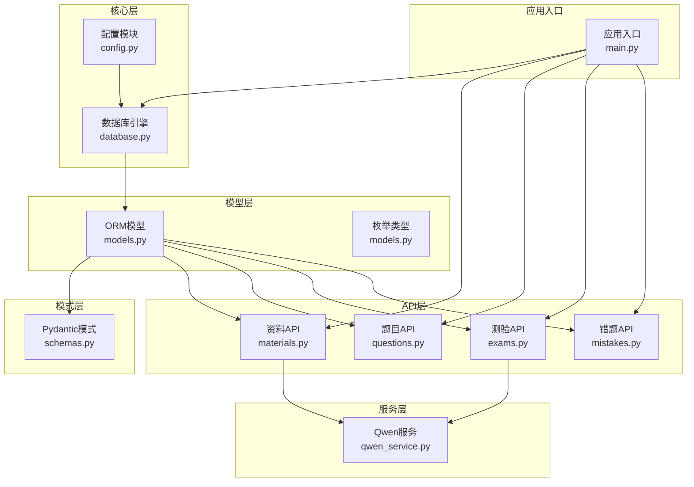
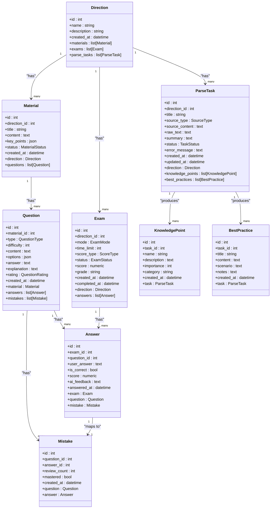
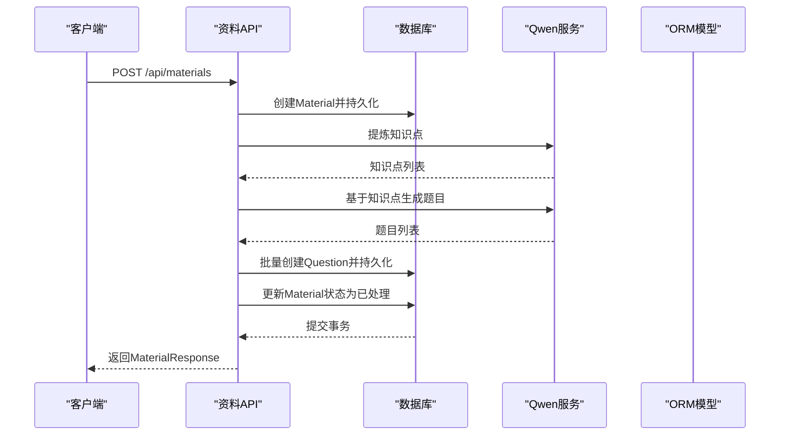
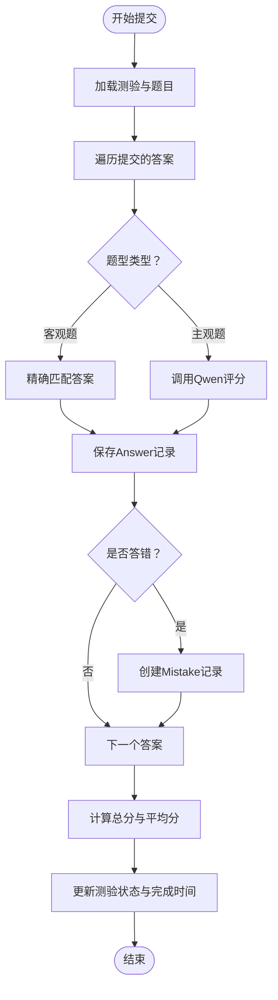
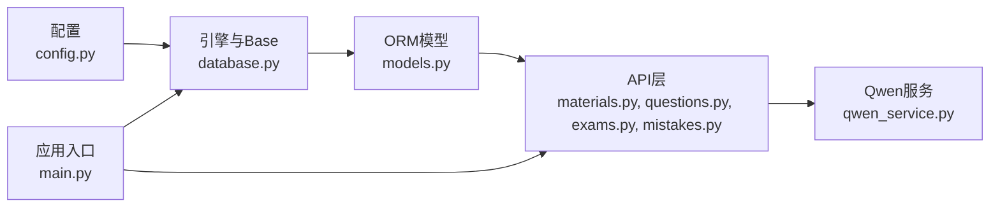

# 数据模型概览

<cite>
**本文档引用的文件**
- [models.py](file://backend/app/models/models.py)
- [database.py](file://backend/app/core/database.py)
- [schemas.py](file://backend/app/schemas/schemas.py)
- [config.py](file://backend/app/core/config.py)
- [materials.py](file://backend/app/api/materials.py)
- [questions.py](file://backend/app/api/questions.py)
- [exams.py](file://backend/app/api/exams.py)
- [mistakes.py](file://backend/app/api/mistakes.py)
- [qwen_service.py](file://backend/app/services/qwen_service.py)
- [main.py](file://backend/app/main.py)
- [pyproject.toml](file://backend/pyproject.toml)
</cite>

## 目录
1. [简介](#简介)
2. [项目结构](#项目结构)
3. [核心组件](#核心组件)
4. [架构总览](#架构总览)
5. [详细组件分析](#详细组件分析)
6. [依赖关系分析](#依赖关系分析)
7. [性能考虑](#性能考虑)
8. [故障排除指南](#故障排除指南)
9. [结论](#结论)

## 简介
本文件面向个人学习管理系统（PLM）的数据模型与ORM架构，系统性梳理了数据模型的层次结构、枚举类型与状态管理、模型间关联关系与外键约束、以及序列化/反序列化机制。文档同时提供模型使用最佳实践与性能优化建议，帮助开发者快速理解并高效扩展系统。

## 项目结构
后端采用FastAPI + SQLAlchemy ORM + Pydantic的典型分层架构：
- 核心层：数据库引擎与Base基类、配置读取
- 模型层：SQLAlchemy ORM模型与枚举类型
- 模式层：Pydantic数据模式（序列化/反序列化）
- API层：业务接口与控制器
- 服务层：外部服务集成（如通义千问）

图表来源
- [config.py](file://backend/app/core/config.py#L1-L34)
- [database.py](file://backend/app/core/database.py#L1-L38)
- [models.py](file://backend/app/models/models.py#L1-L223)
- [schemas.py](file://backend/app/schemas/schemas.py#L1-L265)
- [materials.py](file://backend/app/api/materials.py#L1-L203)
- [questions.py](file://backend/app/api/questions.py#L1-L90)
- [exams.py](file://backend/app/api/exams.py#L1-L240)
- [mistakes.py](file://backend/app/api/mistakes.py#L1-L90)
- [qwen_service.py](file://backend/app/services/qwen_service.py#L1-L156)
- [main.py](file://backend/app/main.py#L1-L66)

章节来源
- [main.py](file://backend/app/main.py#L1-L66)
- [database.py](file://backend/app/core/database.py#L1-L38)
- [config.py](file://backend/app/core/config.py#L1-L34)

## 核心组件
本系统围绕“学习方向”作为顶层概念，向下衍生“学习资料”、“题目”、“测验”、“答题记录”、“错题”、“知识解析任务”等实体。模型通过外键建立清晰的层级关系，并辅以枚举类型统一状态与类型管理。

- 枚举类型与状态管理
  - 资料处理状态：待处理、已处理、失败
  - 题目类型：单选、多选、判断、简答
  - 题目评价：好、坏
  - 测验模式：计时、非计时
  - 评分类型：百分制、等级制
  - 测验状态：进行中、已完成
  - 解析来源类型：文本、文件、URL
  - 解析任务状态：待处理、处理中、已完成、失败

- 关键模型与职责
  - Direction：学习方向，承载资料、测验、解析任务
  - Material：学习资料，关联方向与题目，支持状态流转
  - Question：题目，关联资料，支持多种题型与难度
  - Exam：测验，关联方向，管理测验模式、时间限制、评分与状态
  - Answer：答题记录，关联测验与题目，记录用户答案与评分
  - Mistake：错题，关联题目与答题记录，追踪复习与掌握状态
  - ParseTask：知识解析任务，关联方向，产出知识点与最佳实践
  - KnowledgePoint：知识点，关联解析任务
  - BestPractice：最佳实践，关联解析任务

章节来源
- [models.py](file://backend/app/models/models.py#L9-L61)
- [models.py](file://backend/app/models/models.py#L63-L223)

## 架构总览
系统采用“模型-模式-API”的清晰分层，ORM模型负责持久化与关系映射，Pydantic模式负责输入输出的序列化/反序列化，API层协调业务流程与外部服务。

图表来源
- [models.py](file://backend/app/models/models.py#L63-L223)

## 详细组件分析

### 数据模型与枚举体系
- 枚举类型定义集中在模型文件中，统一使用Python原生枚举，便于在ORM列与Pydantic模式中复用。
- 状态管理贯穿资料处理、解析任务、测验全流程，确保业务状态可追踪、可审计。
- 字段注释明确，便于生成文档与前端展示。

章节来源
- [models.py](file://backend/app/models/models.py#L9-L61)

### 关系映射与外键约束
- 方向-资料：一对多，资料通过外键指向方向；方向删除时，资料外键设为空（解析任务的外键约束为SET NULL）。
- 资料-题目：一对多，题目通过外键指向资料。
- 题目-答题：一对多，答题记录通过外键指向题目。
- 题目-错题：一对多，错题通过外键指向题目。
- 测验-答题：一对多，答题记录通过外键指向测验。
- 解析任务-知识点/最佳实践：一对多，级联删除孤儿项，保证数据一致性。
- 错题-答题：一对一关联，用于记录错题对应的答题记录。

章节来源
- [models.py](file://backend/app/models/models.py#L78-L223)

### 序列化与反序列化机制
- ORM模型通过Pydantic模式进行序列化/反序列化，模式中使用from_attributes=True以支持ORM对象直接转为Pydantic模型。
- API层接收Pydantic请求体，内部转换为ORM模型进行持久化；查询结果通过Pydantic响应模式返回给客户端。
- 典型流程：请求体（Pydantic）→ ORM模型 → 数据库；查询结果（ORM）→ Pydantic响应模式 → 响应体。

章节来源
- [schemas.py](file://backend/app/schemas/schemas.py#L1-L265)
- [materials.py](file://backend/app/api/materials.py#L82-L161)
- [exams.py](file://backend/app/api/exams.py#L127-L216)

### API工作流示例（资料处理）

图表来源
- [materials.py](file://backend/app/api/materials.py#L82-L161)
- [qwen_service.py](file://backend/app/services/qwen_service.py#L37-L114)
- [models.py](file://backend/app/models/models.py#L78-L114)

### 测验评分与错题管理

图表来源
- [exams.py](file://backend/app/api/exams.py#L127-L216)
- [qwen_service.py](file://backend/app/services/qwen_service.py#L115-L151)
- [models.py](file://backend/app/models/models.py#L116-L152)

## 依赖关系分析
- 数据库连接：通过配置模块读取数据库URL，按SQLite/MySQL/PostgreSQL分别设置连接参数与连接池策略。
- 引擎与Base：全局声明式Base用于统一元数据管理，应用启动时自动建表。
- 外部服务：Qwen服务通过异步HTTP客户端调用，支持知识点提炼、题目生成、主观题评分。

图表来源
- [config.py](file://backend/app/core/config.py#L1-L34)
- [database.py](file://backend/app/core/database.py#L1-L38)
- [main.py](file://backend/app/main.py#L1-L66)

章节来源
- [database.py](file://backend/app/core/database.py#L1-L38)
- [config.py](file://backend/app/core/config.py#L1-L34)
- [main.py](file://backend/app/main.py#L45-L49)

## 性能考虑
- 连接池与线程安全
  - SQLite：禁用同线程校验，适合单进程开发环境
  - MySQL/PostgreSQL：启用pre_ping与回收策略，提升连接稳定性
- 查询优化
  - 使用joinedload预加载关联，减少N+1查询
  - 条件过滤优先使用索引字段（如方向ID、状态、创建时间）
- 写入优化
  - 批量插入题目时使用flush而非commit，降低锁竞争
  - 状态更新与事务合并，减少数据库往返
- 序列化开销
  - Pydantic from_attributes=True可直接从ORM对象构建，避免重复转换
  - 大对象（JSON字段）尽量延迟序列化或分页传输
- 外部服务
  - Qwen调用设置合理超时，避免阻塞主线程
  - 对返回结果进行严格解析与容错，防止异常传播

章节来源
- [database.py](file://backend/app/core/database.py#L12-L24)
- [exams.py](file://backend/app/api/exams.py#L172-L181)
- [mistakes.py](file://backend/app/api/mistakes.py#L18-L30)

## 故障排除指南
- 资料处理失败
  - 现象：资料状态变为失败，API返回错误
  - 排查：确认Qwen API密钥配置、网络连通性、输入内容格式
  - 处理：重试或手动修正后重新处理
- 测验提交异常
  - 现象：重复提交、题目不存在、评分异常
  - 排查：检查测验状态、答案完整性、题型匹配
  - 处理：清理无效答案、重新提交或回滚
- 错题状态不一致
  - 现象：错题未随答题更新
  - 排查：确认答题记录与错题关联是否正确创建
  - 处理：手动修复或触发重新生成
- 数据库连接问题
  - 现象：连接超时、连接池耗尽
  - 排查：检查数据库URL、连接池参数、并发访问
  - 处理：调整连接池配置、优化查询与事务

章节来源
- [materials.py](file://backend/app/api/materials.py#L74-L80)
- [exams.py](file://backend/app/api/exams.py#L134-L140)
- [mistakes.py](file://backend/app/api/mistakes.py#L54-L66)
- [database.py](file://backend/app/core/database.py#L12-L24)

## 结论
本系统通过清晰的模型分层、严谨的枚举与状态管理、完善的关联关系与外键约束，构建了可扩展的学习管理数据架构。配合Pydantic的序列化/反序列化机制与FastAPI的高性能特性，能够支撑从资料解析、题目生成到智能测验与错题管理的完整闭环。建议在生产环境中进一步完善索引策略、监控与日志体系，并持续优化外部服务调用的稳定性与性能。