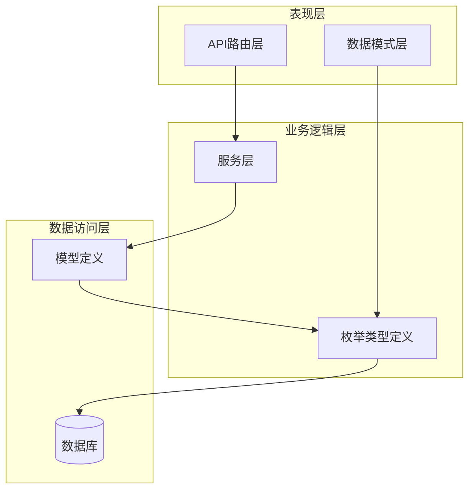
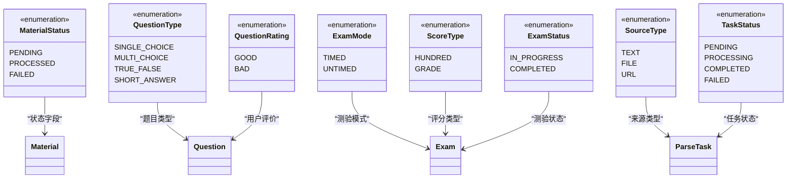
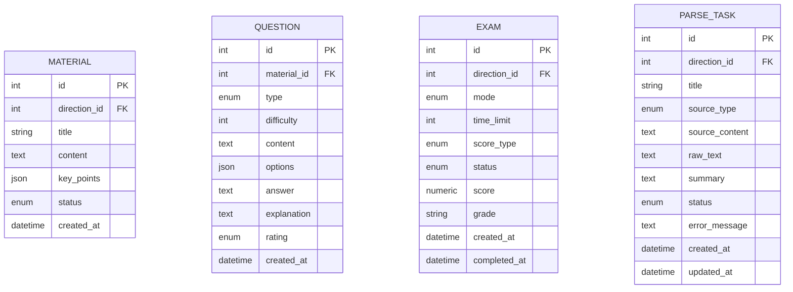
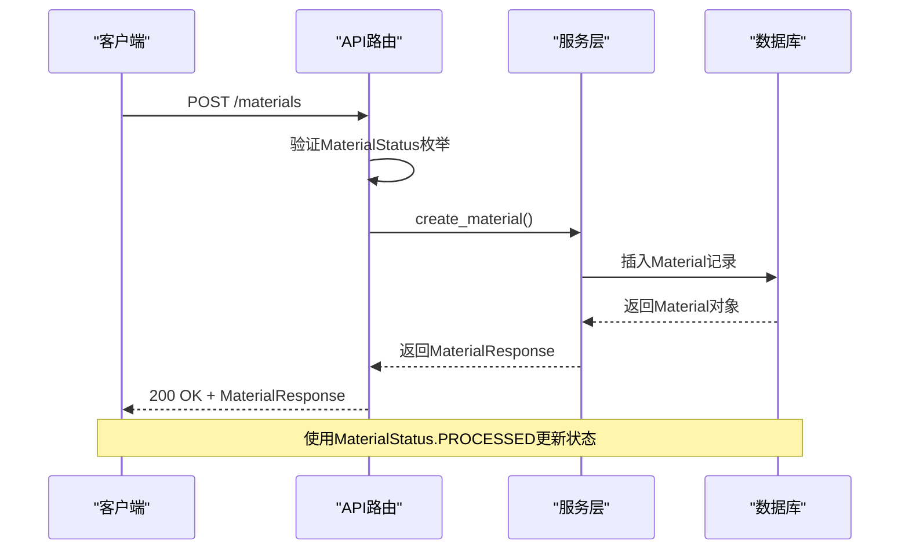
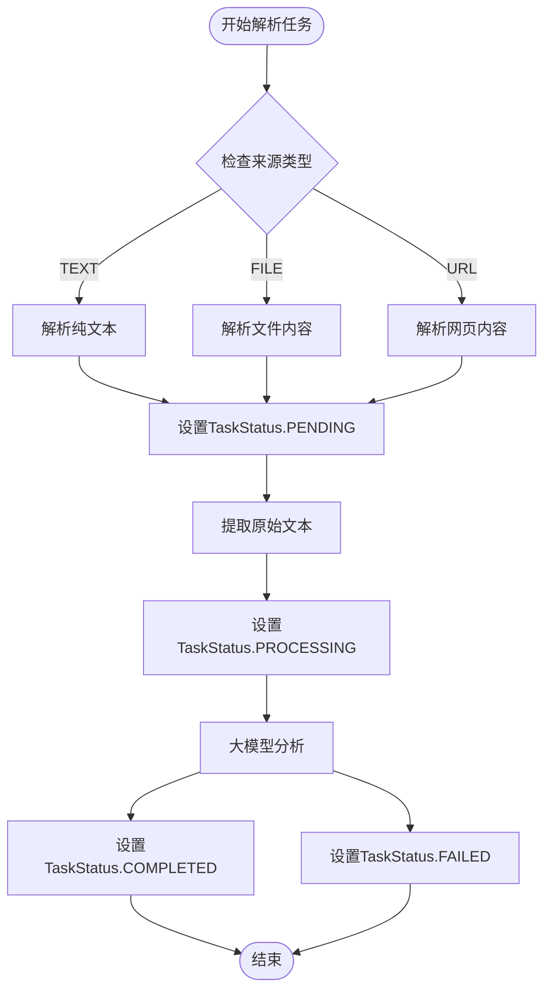
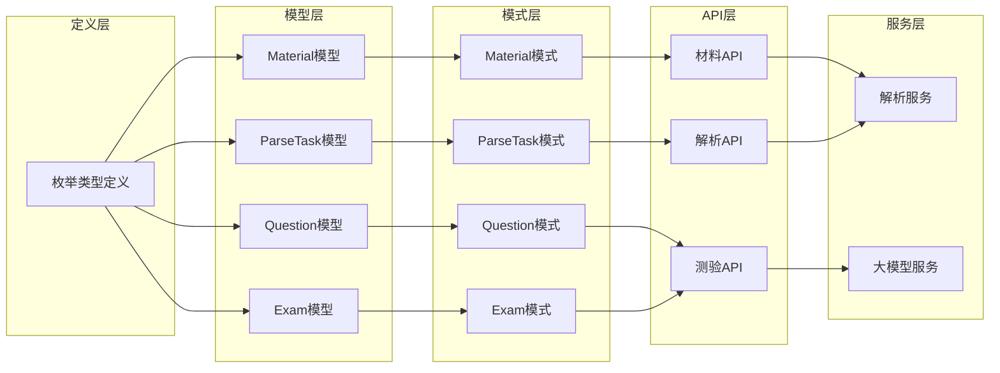

# 枚举类型定义

<cite>
**本文档引用的文件**
- [models.py](file://backend/app/models/models.py)
- [schemas.py](file://backend/app/schemas/schemas.py)
- [exams.py](file://backend/app/api/exams.py)
- [materials.py](file://backend/app/api/materials.py)
- [parse_service.py](file://backend/app/services/parse_service.py)
- [parse.py](file://backend/app/api/parse.py)
- [database.py](file://backend/app/core/database.py)
</cite>

## 目录
1. [简介](#简介)
2. [项目结构](#项目结构)
3. [核心组件](#核心组件)
4. [架构概览](#架构概览)
5. [详细组件分析](#详细组件分析)
6. [依赖关系分析](#依赖关系分析)
7. [性能考虑](#性能考虑)
8. [故障排除指南](#故障排除指南)
9. [结论](#结论)

## 简介

本文档详细说明个人学习管理系统中使用的所有枚举类型定义。系统采用Python原生枚举类型，通过SQLAlchemy映射到数据库，确保类型安全和数据一致性。所有枚举均继承自str类型，便于序列化和数据库存储。

## 项目结构

系统采用分层架构设计，枚举类型定义位于数据模型层，通过API层、服务层进行使用：



**图表来源**
- [models.py](file://backend/app/models/models.py#L1-L60)
- [schemas.py](file://backend/app/schemas/schemas.py#L1-L20)
- [database.py](file://backend/app/core/database.py#L1-L38)

## 核心组件

### 材料状态枚举 (MaterialStatus)
定义学习资料的处理状态，用于跟踪资料从上传到处理完成的整个生命周期。

**枚举值定义：**
- PENDING: "pending" - 待处理状态，资料刚上传时的状态
- PROCESSED: "processed" - 已处理状态，资料处理完成
- FAILED: "failed" - 处理失败状态，资料处理过程中发生错误

**使用场景：**
- 资料上传后初始状态设置
- 处理流程中的状态跟踪
- 前端进度显示的状态标识

**数据库映射：** 通过SQLAlchemy的Enum类型映射到数据库，存储为字符串类型

**章节来源**
- [models.py](file://backend/app/models/models.py#L9-L13)

### 题目类型枚举 (QuestionType)
定义系统支持的各种题目类型，用于区分不同类型的题目和相应的评分策略。

**枚举值定义：**
- SINGLE_CHOICE: "single_choice" - 单选题，标准答案唯一
- MULTI_CHOICE: "multi_choice" - 多选题，标准答案可为多个
- TRUE_FALSE: "true_false" - 判断题，答案为真或假
- SHORT_ANSWER: "short_answer" - 简答题，需要主观评分

**使用场景：**
- 题目创建时指定题目类型
- 评分算法的选择依据
- 前端界面的差异化展示

**数据库映射：** 字符串类型存储，便于人类可读和调试

**章节来源**
- [models.py](file://backend/app/models/models.py#L16-L21)

### 题目评价枚举 (QuestionRating)
用于记录用户对题目的评价，帮助改进题目质量。

**枚举值定义：**
- GOOD: "good" - 好评，表示题目质量良好
- BAD: "bad" - 差评，表示题目存在问题

**使用场景：**
- 用户对题目的质量反馈
- 题目质量统计分析
- 题目筛选和优化依据

**数据库映射：** 可空字符串类型，允许题目评价为空

**章节来源**
- [models.py](file://backend/app/models/models.py#L24-L27)

### 测验模式枚举 (ExamMode)
定义测验的不同模式，影响测验的组织和用户体验。

**枚举值定义：**
- TIMED: "timed" - 限时测验，有时间限制
- UNTIMED: "untimed" - 不限时测验，无时间限制

**使用场景：**
- 测验创建时选择测验模式
- 前端界面的时间控制逻辑
- 测验统计分析的分类依据

**数据库映射：** 默认值为UNTIMED，符合大多数学习场景

**章节来源**
- [models.py](file://backend/app/models/models.py#L30-L33)

### 评分类型枚举 (ScoreType)
定义测验的评分方式，支持不同的成绩表示方法。

**枚举值定义：**
- HUNDRED: "hundred" - 百分制，分数范围0-100
- GRADE: "grade" - 等级制，使用A/B/C/D等字母等级

**使用场景：**
- 测验创建时指定评分方式
- 成绩转换和等级计算
- 统计分析的数据格式化

**数据库映射：** 默认值为HUNDRED，便于直观的成绩展示

**章节来源**
- [models.py](file://backend/app/models/models.py#L36-L39)

### 测验状态枚举 (ExamStatus)
跟踪测验的完整生命周期状态。

**枚举值定义：**
- IN_PROGRESS: "in_progress" - 进行中，测验已创建但未完成
- COMPLETED: "completed" - 已完成，测验所有题目都已作答

**使用场景：**
- 测验创建后的初始状态
- 测验提交后的最终状态
- 测验结果查询的条件过滤

**数据库映射：** 默认值为IN_PROGRESS，符合测验的典型流程

**章节来源**
- [models.py](file://backend/app/models/models.py#L42-L45)

### 解析来源类型枚举 (SourceType)
定义知识解析任务的输入来源类型。

**枚举值定义：**
- TEXT: "text" - 文本输入，直接提供纯文本内容
- FILE: "file" - 文件输入，支持多种文件格式
- URL: "url" - 网页链接，解析网页内容

**使用场景：**
- 解析任务创建时指定输入来源
- 不同来源的预处理逻辑分支
- 任务状态跟踪和错误处理

**数据库映射：** 字符串类型，支持灵活的来源管理

**章节来源**
- [models.py](file://backend/app/models/models.py#L48-L52)

### 解析任务状态枚举 (TaskStatus)
跟踪知识解析任务的执行状态。

**枚举值定义：**
- PENDING: "pending" - 待执行，任务已创建但未开始
- PROCESSING: "processing" - 执行中，任务正在进行处理
- COMPLETED: "completed" - 已完成，任务处理成功结束
- FAILED: "failed" - 执行失败，任务处理过程中发生错误

**使用场景：**
- 解析任务的生命周期管理
- 前端进度显示和状态更新
- 错误恢复和重试机制

**数据库映射：** 支持完整的任务状态跟踪

**章节来源**
- [models.py](file://backend/app/models/models.py#L55-L60)

## 架构概览

系统中枚举类型的使用遵循统一的设计模式，确保类型安全和代码可维护性：



**图表来源**
- [models.py](file://backend/app/models/models.py#L9-L60)

## 详细组件分析

### 枚举类型在数据库中的存储方式

所有枚举类型均通过SQLAlchemy的Enum列类型进行映射，采用字符串存储方式：



**图表来源**
- [models.py](file://backend/app/models/models.py#L78-L191)

### 枚举类型在API层的使用

API层通过FastAPI的依赖注入机制使用枚举类型，确保请求参数的类型安全：



**图表来源**
- [materials.py](file://backend/app/api/materials.py#L82-L161)

**章节来源**
- [exams.py](file://backend/app/api/exams.py#L47-L87)
- [materials.py](file://backend/app/api/materials.py#L27-L79)

### 枚举类型在服务层的应用

服务层协调不同组件的工作，枚举类型确保业务逻辑的一致性：



**图表来源**
- [parse_service.py](file://backend/app/services/parse_service.py#L57-L132)

**章节来源**
- [parse_service.py](file://backend/app/services/parse_service.py#L15-L163)

## 依赖关系分析

枚举类型在整个系统中的依赖关系呈现清晰的层次结构：



**图表来源**
- [models.py](file://backend/app/models/models.py#L1-L60)
- [schemas.py](file://backend/app/schemas/schemas.py#L1-L20)

**章节来源**
- [schemas.py](file://backend/app/schemas/schemas.py#L5-L12)

## 性能考虑

### 数据库存储优化

1. **字符串存储优势**：所有枚举值存储为字符串，便于：
   - 数据库查询和过滤
   - 日志记录和调试
   - 前端显示和用户理解

2. **索引建议**：
   ```sql
   -- 为常用查询字段建立索引
   CREATE INDEX idx_materials_status ON materials(status);
   CREATE INDEX idx_questions_type ON questions(type);
   CREATE INDEX idx_exams_mode ON exams(mode);
   CREATE INDEX idx_parse_tasks_source_type ON parse_tasks(source_type);
   ```

3. **查询优化策略**：
   - 使用枚举值进行精确匹配查询
   - 在API层避免字符串比较，优先使用枚举常量
   - 对频繁查询的字段建立适当的数据库索引

### 序列化性能

1. **Pydantic集成**：枚举类型与Pydantic自动序列化兼容
2. **内存效率**：Python枚举使用单例模式，减少内存占用
3. **传输优化**：字符串形式的枚举值在网络传输中开销最小

## 故障排除指南

### 常见问题及解决方案

1. **枚举值不匹配问题**
   - 症状：数据库插入时报错，提示枚举值无效
   - 解决方案：确保使用正确的枚举常量而非原始字符串
   - 示例：使用`MaterialStatus.PROCESSED`而非`"processed"`

2. **类型转换错误**
   - 症状：API请求参数类型不匹配
   - 解决方案：在API层使用类型注解确保参数验证
   - 示例：`status: MaterialStatus`确保传入有效的枚举值

3. **默认值问题**
   - 症状：未显式设置枚举字段导致意外行为
   - 解决方案：在模型定义中明确设置合理的默认值
   - 示例：`status = Column(Enum(MaterialStatus), default=MaterialStatus.PENDING)`

**章节来源**
- [materials.py](file://backend/app/api/materials.py#L144-L159)

## 结论

个人学习管理系统的枚举类型设计体现了以下特点：

1. **类型安全**：通过Python原生枚举确保编译时类型检查
2. **数据库友好**：字符串存储方式便于数据库操作和调试
3. **扩展性强**：清晰的定义模式支持未来功能扩展
4. **使用便捷**：与SQLAlchemy和Pydantic无缝集成

这些枚举类型为系统提供了坚实的基础，确保了数据的一致性和业务逻辑的正确性。通过合理的使用模式和最佳实践，系统能够稳定可靠地运行，为用户提供优质的在线学习体验。