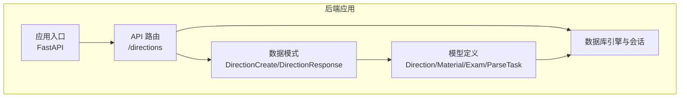
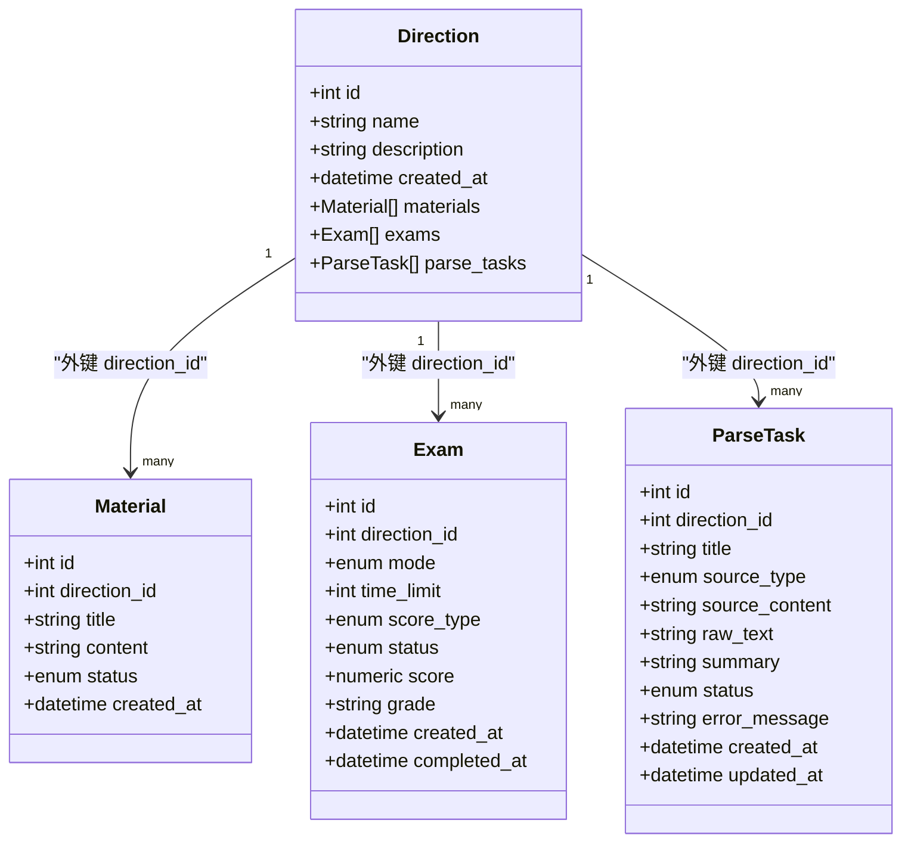
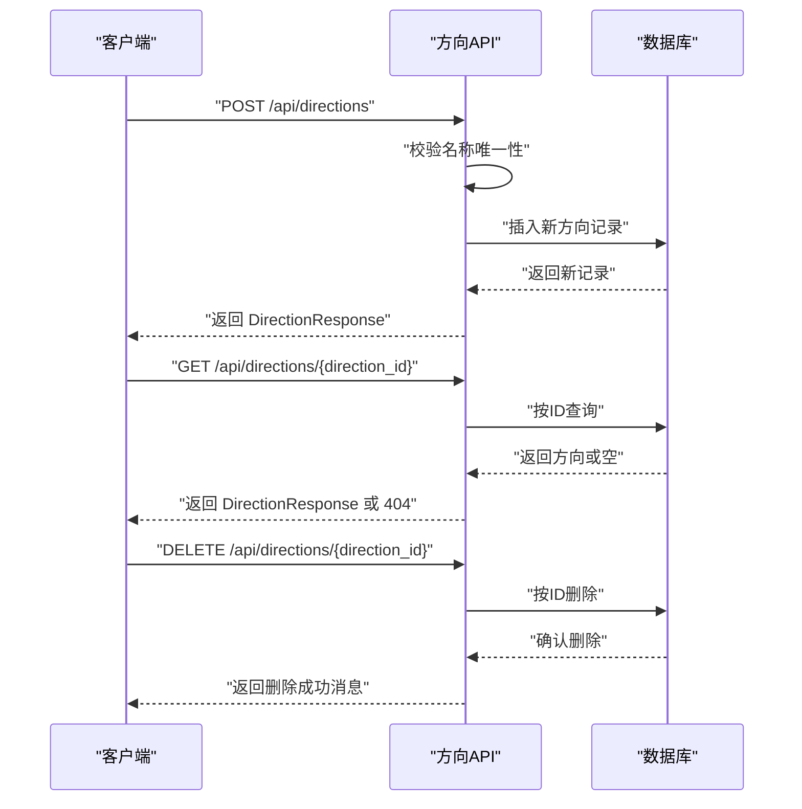
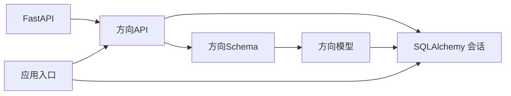

# 学习方向实体

<cite>
**本文档引用的文件**
- [backend/app/models/models.py](file://backend/app/models/models.py)
- [backend/app/schemas/schemas.py](file://backend/app/schemas/schemas.py)
- [backend/app/api/directions.py](file://backend/app/api/directions.py)
- [backend/app/core/database.py](file://backend/app/core/database.py)
- [backend/app/main.py](file://backend/app/main.py)
- [backend/pyproject.toml](file://backend/pyproject.toml)
</cite>

## 目录
1. [简介](#简介)
2. [项目结构](#项目结构)
3. [核心组件](#核心组件)
4. [架构总览](#架构总览)
5. [详细组件分析](#详细组件分析)
6. [依赖关系分析](#依赖关系分析)
7. [性能考虑](#性能考虑)
8. [故障排除指南](#故障排除指南)
9. [结论](#结论)

## 简介
学习方向（Direction）是学习管理系统中的顶层分类概念，用于对学习内容进行归类和组织。它作为学习资料（Material）、测验（Exam）和知识解析任务（ParseTask）的父级分类，承担着“主题域”的角色。每个学习方向拥有唯一标识、名称、描述和创建时间等核心字段，并通过一对多关系与上述实体建立关联。

学习方向在系统中的业务价值体现在：
- 统一的学习主题域划分，便于资源组织与检索
- 为资料、题目、测验、解析任务提供上下文归属
- 支撑后续的个性化推荐、统计分析与报表生成

## 项目结构
本项目采用分层架构：API 层负责对外接口；服务层封装业务逻辑；模型层定义数据结构与关系；数据库层负责持久化。学习方向实体位于模型层，配合 Pydantic 的 Schema 进行输入输出校验与序列化。

图表来源
- [backend/app/api/directions.py](file://backend/app/api/directions.py#L1-L51)
- [backend/app/models/models.py](file://backend/app/models/models.py#L63-L76)
- [backend/app/schemas/schemas.py](file://backend/app/schemas/schemas.py#L17-L34)
- [backend/app/core/database.py](file://backend/app/core/database.py#L1-L38)
- [backend/app/main.py](file://backend/app/main.py#L1-L66)

章节来源
- [backend/app/main.py](file://backend/app/main.py#L1-L66)
- [backend/app/core/database.py](file://backend/app/core/database.py#L1-L38)
- [backend/pyproject.toml](file://backend/pyproject.toml#L1-L29)

## 核心组件
- 实体定义（模型层）
  - Direction：学习方向实体，包含 id、name、description、created_at 字段，以及与 Material、Exam、ParseTask 的一对多关系。
- 数据模式（Schema 层）
  - DirectionBase：基础字段（name、description）
  - DirectionCreate：创建时使用的模式
  - DirectionResponse：响应时使用的模式，包含 id 和 created_at
- API 接口（API 层）
  - GET /api/directions：获取所有学习方向
  - POST /api/directions：创建学习方向
  - GET /api/directions/{direction_id}：按 ID 获取学习方向详情
  - DELETE /api/directions/{direction_id}：删除学习方向

章节来源
- [backend/app/models/models.py](file://backend/app/models/models.py#L63-L76)
- [backend/app/schemas/schemas.py](file://backend/app/schemas/schemas.py#L17-L34)
- [backend/app/api/directions.py](file://backend/app/api/directions.py#L1-L51)

## 架构总览
学习方向实体在系统中的位置与职责如下：
- 作为顶层分类，承载学习资源的主题域语义
- 与 Material、Exam、ParseTask 建立外键关联，形成清晰的层次关系
- 通过 API 提供 CRUD 能力，支撑前端与后端的数据交互

图表来源
- [backend/app/models/models.py](file://backend/app/models/models.py#L63-L191)

## 详细组件分析

### 实体定义与字段说明
- 字段定义
  - id：自增主键，唯一标识学习方向
  - name：字符串，非空且唯一，表示学习方向的名称
  - description：文本，可选，描述学习方向的内容或目标
  - created_at：时间戳，默认为当前时间，记录创建时间
- 关系映射
  - 与 Material：一对多，一个方向可包含多个资料
  - 与 Exam：一对多，一个方向可包含多个测验
  - 与 ParseTask：一对多，一个方向可包含多个解析任务

章节来源
- [backend/app/models/models.py](file://backend/app/models/models.py#L63-L76)

### 数据模式（Schema）
- DirectionBase：定义 name 和 description 的输入约束
- DirectionCreate：继承基础模式，用于创建时的输入校验
- DirectionResponse：在基础模式基础上增加 id 和 created_at，用于响应输出

章节来源
- [backend/app/schemas/schemas.py](file://backend/app/schemas/schemas.py#L17-L34)

### API 接口与业务流程
- 获取所有学习方向
  - 方法：GET /api/directions
  - 行为：查询并返回全部学习方向列表
- 创建学习方向
  - 方法：POST /api/directions
  - 行为：校验名称唯一性，创建新方向并返回完整信息
- 获取学习方向详情
  - 方法：GET /api/directions/{direction_id}
  - 行为：按 ID 查询，不存在则返回 404
- 删除学习方向
  - 方法：DELETE /api/directions/{direction_id}
  - 行为：按 ID 删除，不存在则返回 404

图表来源
- [backend/app/api/directions.py](file://backend/app/api/directions.py#L11-L51)

章节来源
- [backend/app/api/directions.py](file://backend/app/api/directions.py#L1-L51)

### 数据库与会话管理
- 引擎与会话
  - 使用 SQLAlchemy 创建引擎与会话工厂
  - 支持 SQLite/MySQL/PostgreSQL，SQLite 场景下启用线程安全参数
- 应用启动
  - 在启动事件中创建所有表结构
  - 确保上传目录存在

章节来源
- [backend/app/core/database.py](file://backend/app/core/database.py#L1-L38)
- [backend/app/main.py](file://backend/app/main.py#L45-L49)

### 依赖注入与路由注册
- 依赖注入
  - 通过 get_db 提供数据库会话，确保请求生命周期内复用同一会话
- 路由注册
  - 将方向路由挂载到 /api 前缀下，统一暴露给客户端

章节来源
- [backend/app/api/directions.py](file://backend/app/api/directions.py#L1-L8)
- [backend/app/main.py](file://backend/app/main.py#L36-L42)

## 依赖关系分析
- 模块耦合
  - API 层依赖模型层与 Schema 层，实现业务逻辑与数据校验分离
  - 模型层依赖数据库基类，定义实体与关系
  - 应用入口负责装配路由与数据库初始化
- 外部依赖
  - FastAPI：提供 Web 框架能力
  - SQLAlchemy：提供 ORM 能力与数据库抽象
  - Pydantic：提供数据模式与验证

图表来源
- [backend/app/api/directions.py](file://backend/app/api/directions.py#L1-L8)
- [backend/app/schemas/schemas.py](file://backend/app/schemas/schemas.py#L17-L34)
- [backend/app/models/models.py](file://backend/app/models/models.py#L63-L76)
- [backend/app/main.py](file://backend/app/main.py#L1-L66)

章节来源
- [backend/pyproject.toml](file://backend/pyproject.toml#L7-L22)
- [backend/app/main.py](file://backend/app/main.py#L1-L66)

## 性能考虑
- 查询优化
  - 对于高频查询，可在 name 上建立索引以提升唯一性校验效率
- 事务与会话
  - 使用短生命周期的数据库会话，避免长事务占用连接
- 批量操作
  - 如需批量创建/删除学习方向，建议使用批量接口减少往返开销

## 故障排除指南
- 400 错误：创建学习方向时名称重复
  - 现象：返回“该学习方向已存在”
  - 处理：修改名称或使用现有方向
- 404 错误：查询或删除不存在的学习方向
  - 现象：返回“学习方向不存在”
  - 处理：确认 direction_id 是否正确，或先创建再操作
- 数据库连接问题
  - 现象：启动时报连接异常
  - 处理：检查数据库 URL 配置与网络连通性

章节来源
- [backend/app/api/directions.py](file://backend/app/api/directions.py#L20-L24)
- [backend/app/api/directions.py](file://backend/app/api/directions.py#L35-L38)
- [backend/app/api/directions.py](file://backend/app/api/directions.py#L44-L46)
- [backend/app/core/database.py](file://backend/app/core/database.py#L12-L18)

## 结论
学习方向实体作为学习管理系统的顶层分类，提供了清晰的主题域划分与资源归属。通过与资料、测验、解析任务的关联，它构成了系统数据模型的核心骨架。结合简洁的 API 接口与完善的 Schema 校验，学习方向为上层功能（如题目生成、智能评分、错题管理）提供了稳定的基础支撑。未来可在此基础上扩展统计分析、个性化推荐等功能，进一步提升系统智能化水平。