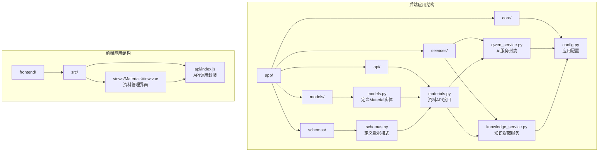
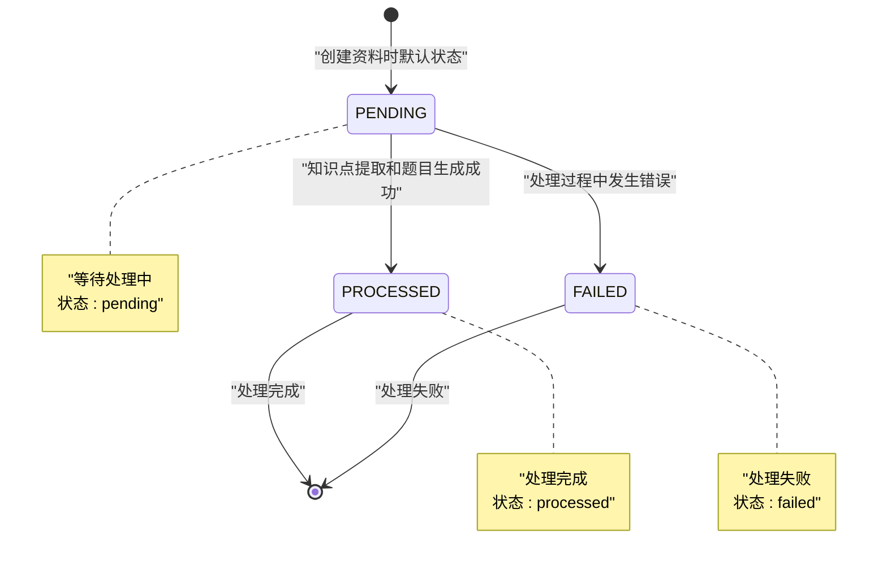
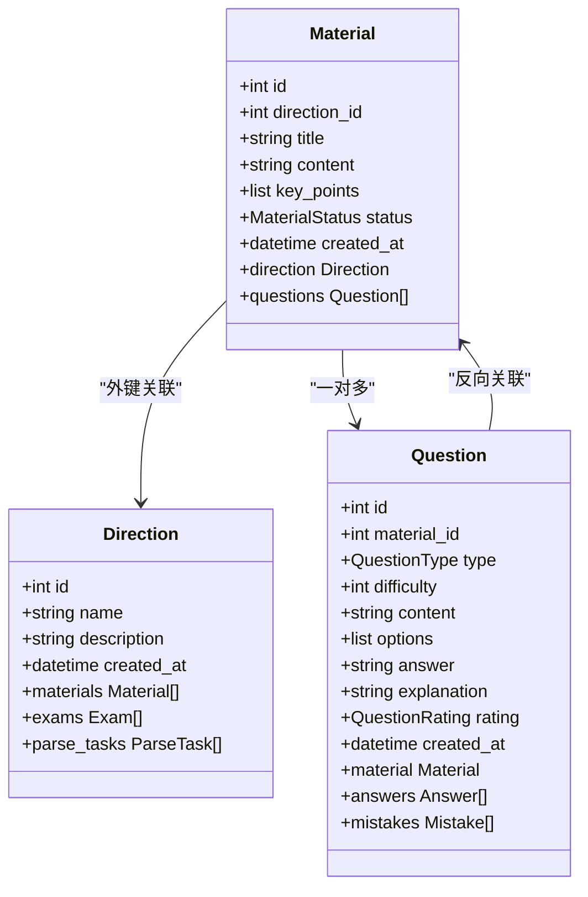
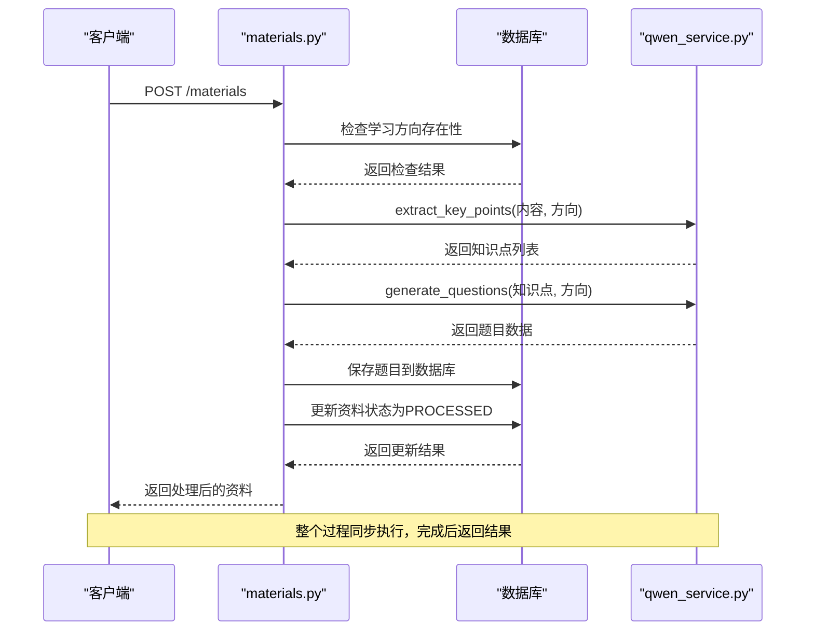
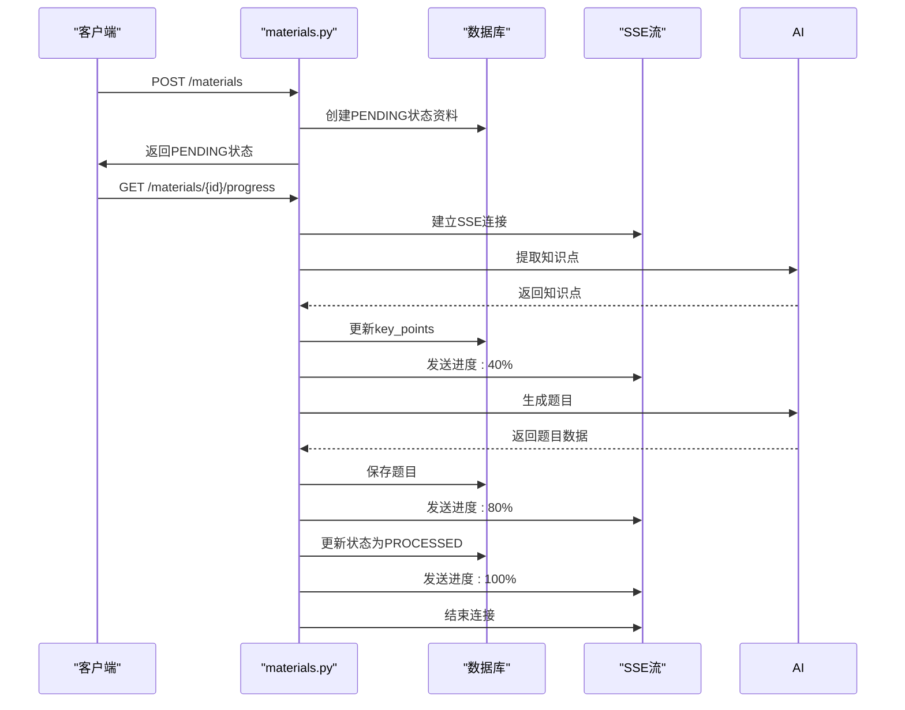
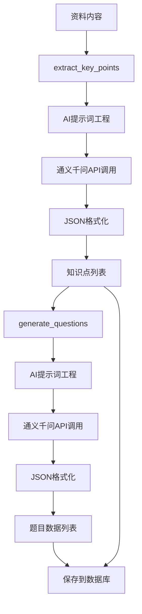
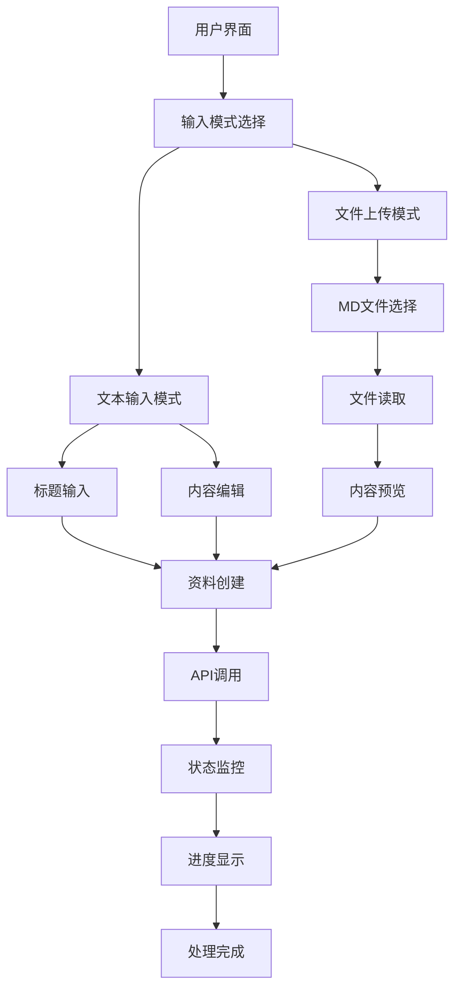
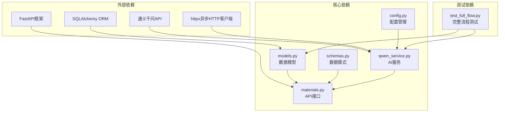

# 学习资料实体

<cite>
**本文档引用的文件**
- [models.py](file://backend/app/models/models.py)
- [schemas.py](file://backend/app/schemas/schemas.py)
- [materials.py](file://backend/app/api/materials.py)
- [qwen_service.py](file://backend/app/services/qwen_service.py)
- [knowledge_service.py](file://backend/app/services/knowledge_service.py)
- [config.py](file://backend/app/core/config.py)
- [test_full_flow.py](file://backend/test_full_flow.py)
- [MaterialsView.vue](file://frontend/src/views/MaterialsView.vue)
</cite>

## 目录
1. [简介](#简介)
2. [项目结构](#项目结构)
3. [核心组件](#核心组件)
4. [架构概览](#架构概览)
5. [详细组件分析](#详细组件分析)
6. [依赖关系分析](#依赖关系分析)
7. [性能考虑](#性能考虑)
8. [故障排除指南](#故障排除指南)
9. [结论](#结论)

## 简介

学习资料实体(Material)是个人学习管理系统的核心数据模型之一，负责存储和管理用户上传的学习资料。该实体不仅包含基本的资料信息，还集成了AI驱动的知识点提取、题目生成和状态管理功能，为整个学习系统提供了智能化的内容处理能力。

本系统采用前后端分离架构，后端使用FastAPI框架构建RESTful API，前端使用Vue.js开发用户界面。Material实体通过标准化的数据模型和API接口，实现了从资料上传到智能处理的完整业务流程。

## 项目结构

学习资料实体位于后端应用的核心模块中，与相关的模型、模式、服务和API共同构成了完整的资料管理功能体系。



**图表来源**
- [models.py](file://backend/app/models/models.py#L78-L93)
- [schemas.py](file://backend/app/schemas/schemas.py#L36-L58)
- [materials.py](file://backend/app/api/materials.py#L1-L203)

**章节来源**
- [models.py](file://backend/app/models/models.py#L1-L223)
- [schemas.py](file://backend/app/schemas/schemas.py#L1-L265)

## 核心组件

### Material实体定义

Material实体是学习资料的核心数据模型，采用SQLAlchemy ORM映射到数据库表。该实体继承自Base基类，具备完整的数据库操作能力。

#### 字段定义详解

| 字段名 | 数据类型 | 约束条件 | 描述 | 默认值 |
|--------|----------|----------|------|--------|
| id | Integer | 主键, 自增 | 资料唯一标识符 | 自动生成 |
| direction_id | Integer | 外键, 非空 | 所属学习方向ID | 必填 |
| title | String(200) | 非空 | 资料标题 | 必填 |
| content | Text | 非空 | 原始资料内容 | 必填 |
| key_points | JSON | 可选 | AI提炼的核心知识点 | None |
| status | Enum | 非空, 默认pending | 处理状态 | MaterialStatus.PENDING |
| created_at | DateTime | 默认当前时间 | 创建时间戳 | 自动生成 |

#### 关联关系

Material实体与Direction和Question建立了双向关联关系：
- 与Direction：一对多关系，一个方向可包含多个资料
- 与Question：一对多关系，一个资料可生成多道题目

**章节来源**
- [models.py](file://backend/app/models/models.py#L78-L93)

### MaterialStatus枚举类型

MaterialStatus枚举定义了学习资料的三种处理状态，用于跟踪资料的处理进度和结果。



**图表来源**
- [models.py](file://backend/app/models/models.py#L9-L13)

#### 状态含义和使用场景

1. **PENDING (待处理)**
   - **含义**：资料刚创建，尚未开始处理
   - **使用场景**：新上传资料的初始状态，表示等待AI服务处理
   - **特点**：可被进度监控，支持流式处理反馈

2. **PROCESSED (已处理)**
   - **含义**：资料处理成功完成
   - **使用场景**：知识点提取和题目生成都成功完成
   - **特点**：资料可用于学习和测试，状态不可逆

3. **FAILED (处理失败)**
   - **含义**：资料处理过程中发生错误
   - **使用场景**：AI服务调用失败、网络超时、数据格式错误等情况
   - **特点**：需要人工干预或重新处理

**章节来源**
- [models.py](file://backend/app/models/models.py#L9-L13)

## 架构概览

学习资料实体在整个系统中扮演着核心协调者的角色，连接着用户界面、AI服务和数据库存储。

```mermaid
graph TB
subgraph "用户界面层"
A[MaterialsView.vue<br/>资料管理界面]
B[用户操作<br/>上传/删除/查看]
end
subgraph "API接口层"
C[materials.py<br/>资料API路由]
D[GET /materials<br/>获取资料列表]
E[POST /materials<br/>创建资料]
F[GET /materials/{id}/progress<br/>获取处理进度]
G[DELETE /materials/{id}<br/>删除资料]
end
subgraph "业务逻辑层"
H[create_material<br/>创建并处理资料]
I[generate_material_stream<br/>流式处理资料]
J[进度监控<br/>SSE事件流]
end
subgraph "AI服务层"
K[qwen_service.py<br/>通义千问服务]
L[extract_key_points<br/>知识点提取]
M[generate_questions<br/>题目生成]
end
subgraph "数据持久层"
N[models.py<br/>Material模型]
O[数据库<br/>SQLite]
end
A --> B
B --> C
C --> D
C --> E
C --> F
C --> G
E --> H
F --> I
H --> K
I --> K
K --> L
K --> M
H --> N
I --> N
N --> O
```

**图表来源**
- [materials.py](file://backend/app/api/materials.py#L12-L203)
- [models.py](file://backend/app/models/models.py#L78-L93)
- [qwen_service.py](file://backend/app/services/qwen_service.py#L10-L156)

## 详细组件分析

### 数据模型设计

Material实体的设计遵循了数据库规范化原则，确保了数据的一致性和完整性。



**图表来源**
- [models.py](file://backend/app/models/models.py#L63-L93)
- [models.py](file://backend/app/models/models.py#L95-L114)

#### 字段约束和验证

每个字段都设置了适当的约束条件和验证规则：

1. **主键约束**：id字段作为主键，确保每条记录的唯一性
2. **外键约束**：direction_id引用Direction表，维护数据完整性
3. **非空约束**：title和content字段必须提供值
4. **默认值**：status字段默认为PENDING，created_at自动设置当前时间
5. **长度限制**：title字段限制200字符，保证数据合理性

**章节来源**
- [models.py](file://backend/app/models/models.py#L78-L93)

### API接口设计

资料管理API提供了完整的CRUD操作和特殊功能接口。



**图表来源**
- [materials.py](file://backend/app/api/materials.py#L82-L161)
- [qwen_service.py](file://backend/app/services/qwen_service.py#L37-L114)

#### 异步处理流程

对于大型资料，系统提供了异步处理能力：



**图表来源**
- [materials.py](file://backend/app/api/materials.py#L27-L80)

**章节来源**
- [materials.py](file://backend/app/api/materials.py#L15-L203)

### AI服务集成

系统集成了通义千问AI服务，实现了智能化的知识点提取和题目生成。



**图表来源**
- [qwen_service.py](file://backend/app/services/qwen_service.py#L37-L114)

#### 知识点提取算法

知识点提取过程采用多步骤策略：

1. **内容分析**：分析学习资料的主题和结构
2. **关键信息识别**：识别重要的概念、原理和实践
3. **重要程度评估**：为每个知识点分配重要程度评分
4. **格式化输出**：生成标准化的JSON格式数据

#### 题目生成策略

题目生成遵循教育学原理和AI技术：

1. **知识点匹配**：根据知识点生成相应的题目
2. **题型多样性**：包含选择题、判断题、简答题等多种类型
3. **难度分布**：合理分布1-5级难度
4. **质量控制**：确保题目的准确性和教育价值

**章节来源**
- [qwen_service.py](file://backend/app/services/qwen_service.py#L10-L156)

### 前端集成

前端界面提供了直观的资料管理体验，支持多种输入方式和实时状态反馈。



**图表来源**
- [MaterialsView.vue](file://frontend/src/views/MaterialsView.vue#L100-L156)

#### 用户交互设计

前端界面设计注重用户体验：

1. **多模式输入**：支持文本直接输入和MD文件上传两种方式
2. **实时预览**：MD文件上传后提供内容预览功能
3. **状态可视化**：通过颜色和图标直观显示资料处理状态
4. **进度反馈**：异步处理时提供详细的进度信息

**章节来源**
- [MaterialsView.vue](file://frontend/src/views/MaterialsView.vue#L1-L339)

## 依赖关系分析

学习资料实体与其他组件之间存在复杂的依赖关系，形成了清晰的分层架构。



**图表来源**
- [models.py](file://backend/app/models/models.py#L1-L6)
- [materials.py](file://backend/app/api/materials.py#L1-L11)
- [qwen_service.py](file://backend/app/services/qwen_service.py#L1-L7)

### 组件耦合度分析

系统采用了低耦合高内聚的设计原则：

1. **模型层独立**：models.py不依赖具体业务逻辑，仅负责数据定义
2. **API层薄化**：materials.py主要负责路由和参数验证
3. **服务层专注**：qwen_service.py专注于AI服务调用
4. **配置集中**：config.py统一管理所有配置项

### 循环依赖检测

经过分析，系统中不存在循环依赖关系：
- models.py只导入基础依赖，不依赖其他模块
- API模块依赖模型和服务模块
- 服务模块依赖配置模块
- 测试模块依赖API和服务模块

**章节来源**
- [models.py](file://backend/app/models/models.py#L1-L223)
- [materials.py](file://backend/app/api/materials.py#L1-L203)
- [qwen_service.py](file://backend/app/services/qwen_service.py#L1-L156)

## 性能考虑

系统在设计时充分考虑了性能优化和扩展性需求。

### 数据库性能优化

1. **索引策略**：为常用查询字段建立索引
   - direction_id：支持按方向过滤
   - created_at：支持按时间排序
   - material_id：支持按资料关联查询

2. **查询优化**：
   - 使用JOIN查询减少数据库往返
   - 支持条件过滤避免全表扫描
   - 分页查询处理大量数据

3. **连接池管理**：合理配置数据库连接池大小

### AI服务性能优化

1. **异步调用**：使用async/await避免阻塞
2. **超时控制**：设置合理的API调用超时时间
3. **错误重试**：网络异常时自动重试机制
4. **缓存策略**：对频繁访问的数据进行缓存

### 前端性能优化

1. **懒加载**：图片和复杂组件按需加载
2. **虚拟滚动**：大量资料时使用虚拟滚动
3. **状态缓存**：本地缓存用户状态和配置
4. **防抖节流**：输入框和搜索功能的性能优化

## 故障排除指南

### 常见问题及解决方案

#### API密钥配置问题

**问题现象**：创建资料时报API密钥未配置错误

**原因分析**：
- 环境变量QWEN_API_KEY未设置
- API密钥格式不正确
- 网络连接问题

**解决步骤**：
1. 检查.env文件中QWEN_API_KEY配置
2. 验证API密钥的有效性
3. 确认网络连接正常
4. 重启应用服务

**章节来源**
- [materials.py](file://backend/app/api/materials.py#L94-L96)
- [config.py](file://backend/app/core/config.py#L16-L19)

#### 资料处理失败

**问题现象**：资料状态变为FAILED

**排查步骤**：
1. 检查AI服务日志
2. 验证资料内容格式
3. 确认网络连接状态
4. 查看数据库错误信息

**恢复措施**：
1. 重新上传资料
2. 检查AI服务可用性
3. 调整资料内容格式

#### 进度监控问题

**问题现象**：无法获取资料处理进度

**解决方法**：
1. 确认SSE连接正常
2. 检查浏览器兼容性
3. 验证CORS配置
4. 查看服务器日志

**章节来源**
- [materials.py](file://backend/app/api/materials.py#L74-L80)

### 调试技巧

1. **日志分析**：查看应用日志定位问题
2. **API测试**：使用Postman测试API接口
3. **数据库检查**：直接查询数据库验证数据状态
4. **网络诊断**：检查AI服务连接状态

## 结论

学习资料实体(Material)是个人学习管理系统的核心组件，通过精心设计的数据模型、完善的API接口和智能化的AI服务集成，为用户提供了完整的资料管理解决方案。

### 主要优势

1. **完整的生命周期管理**：从创建到处理完成的全流程覆盖
2. **智能化处理**：AI驱动的知识点提取和题目生成
3. **良好的扩展性**：模块化设计便于功能扩展
4. **用户友好**：直观的前端界面和实时状态反馈

### 技术特色

1. **状态驱动**：通过MaterialStatus枚举实现清晰的状态管理
2. **异步处理**：支持流式处理大型资料
3. **错误处理**：完善的异常捕获和状态回滚机制
4. **配置管理**：集中化的配置管理和环境适配

### 未来改进方向

1. **性能优化**：进一步优化AI服务调用性能
2. **功能扩展**：支持更多格式的资料处理
3. **智能推荐**：基于学习历史的个性化推荐
4. **移动端支持**：开发移动端应用提升用户体验

该系统为个人学习管理提供了一个强大而灵活的技术平台，通过Material实体的精心设计，实现了从传统资料管理到智能化学习辅助的转变。