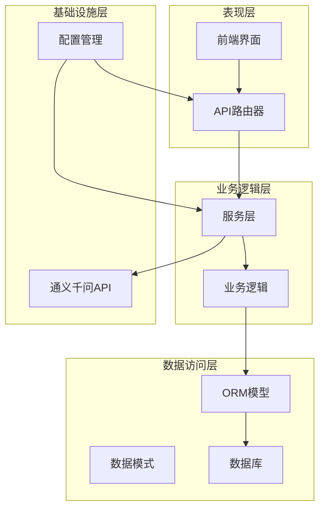
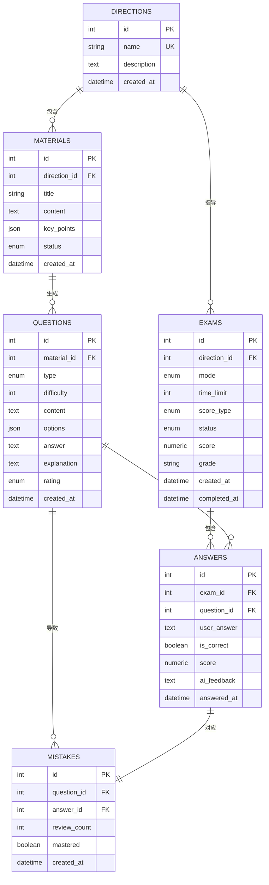
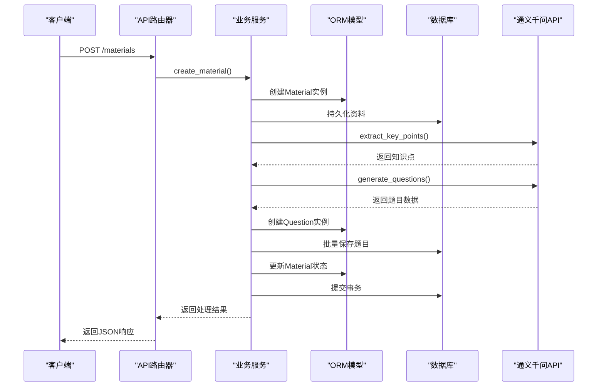
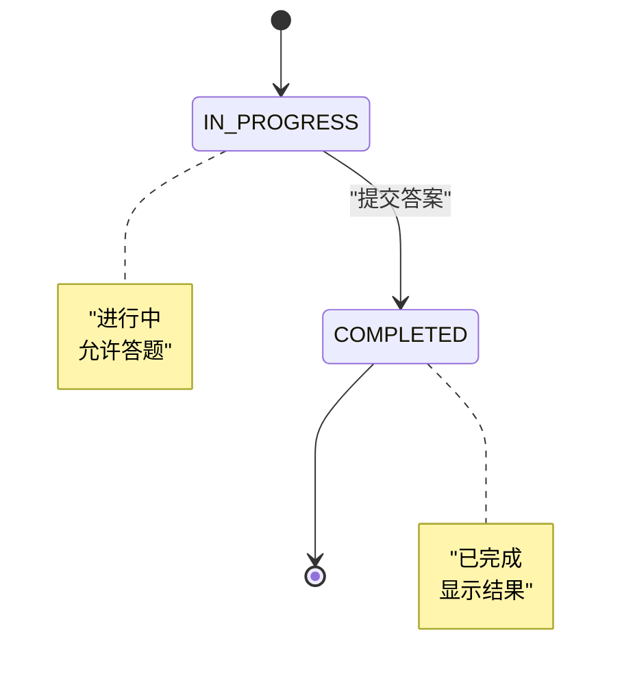
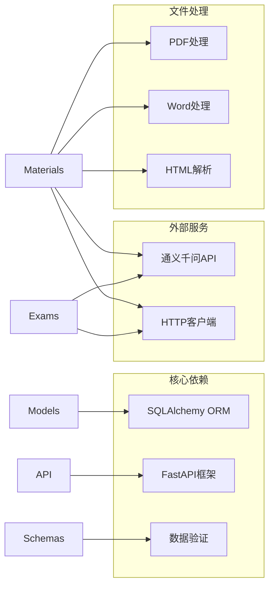
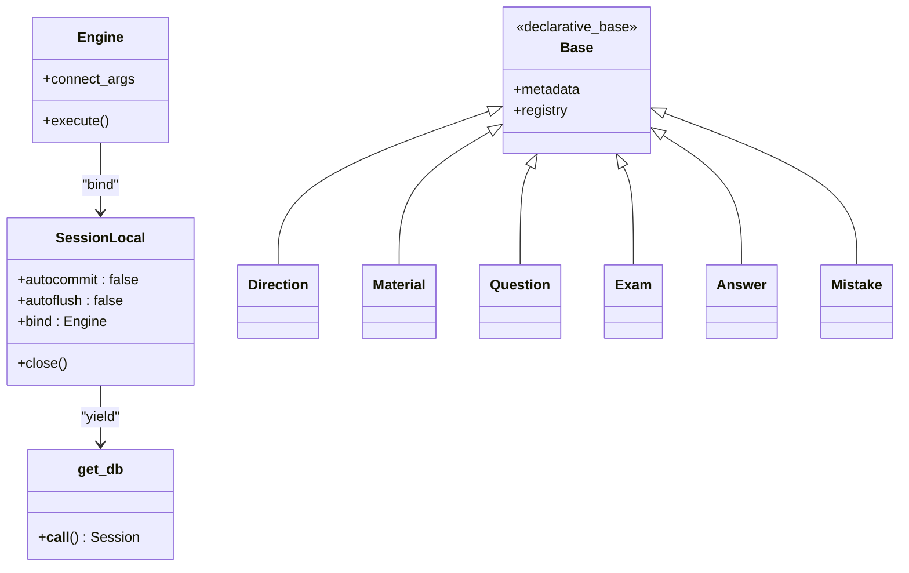
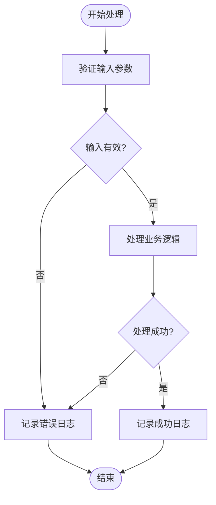

# 核心实体设计

<cite>
**本文档引用的文件**
- [models.py](file://backend/app/models/models.py)
- [schemas.py](file://backend/app/schemas/schemas.py)
- [database.py](file://backend/app/core/database.py)
- [config.py](file://backend/app/core/config.py)
- [directions.py](file://backend/app/api/directions.py)
- [materials.py](file://backend/app/api/materials.py)
- [questions.py](file://backend/app/api/questions.py)
- [exams.py](file://backend/app/api/exams.py)
- [mistakes.py](file://backend/app/api/mistakes.py)
- [qwen_service.py](file://backend/app/services/qwen_service.py)
- [pyproject.toml](file://backend/pyproject.toml)
</cite>

## 目录
1. [简介](#简介)
2. [项目结构](#项目结构)
3. [核心组件](#核心组件)
4. [架构概览](#架构概览)
5. [详细组件分析](#详细组件分析)
6. [依赖分析](#依赖分析)
7. [性能考虑](#性能考虑)
8. [故障排除指南](#故障排除指南)
9. [结论](#结论)

## 简介

个人学习管理系统是一个基于FastAPI构建的学习管理平台，专注于AI驱动的学习体验。该系统通过智能解析学习资料、自动生成题目、提供个性化测验和错题管理等功能，帮助用户高效学习和巩固知识。

系统采用现代化的技术栈，包括SQLAlchemy ORM、Pydantic数据验证、AsyncIO异步处理和通义千问大模型API集成。核心实体围绕学习方向、学习资料、题目、测验、答题记录和错题等概念构建，形成了完整的学习管理闭环。

## 项目结构

系统采用分层架构设计，主要分为以下几个层次：

**图表来源**
- [models.py](file://backend/app/models/models.py#L1-L223)
- [schemas.py](file://backend/app/schemas/schemas.py#L1-L265)
- [database.py](file://backend/app/core/database.py#L1-L38)

**章节来源**
- [models.py](file://backend/app/models/models.py#L1-L223)
- [schemas.py](file://backend/app/schemas/schemas.py#L1-L265)
- [database.py](file://backend/app/core/database.py#L1-L38)

## 核心组件

系统的核心实体包括六个主要数据模型，每个实体都有明确的职责和业务含义：

### 实体关系图

**图表来源**
- [models.py](file://backend/app/models/models.py#L63-L169)

### 枚举类型设计

系统定义了多个枚举类型来确保数据的一致性和完整性：

| 枚举类型 | 可能值 | 用途 |
|---------|--------|------|
| MaterialStatus | pending, processed, failed | 资料处理状态 |
| QuestionType | single_choice, multi_choice, true_false, short_answer | 题目类型 |
| QuestionRating | good, bad | 题目评价 |
| ExamMode | timed, untimed | 测验模式 |
| ScoreType | hundred, grade | 评分类型 |
| ExamStatus | in_progress, completed | 测验状态 |
| SourceType | text, file, url | 解析来源类型 |
| TaskStatus | pending, processing, completed, failed | 解析任务状态 |

**章节来源**
- [models.py](file://backend/app/models/models.py#L9-L61)

## 架构概览

系统采用RESTful API架构，通过FastAPI提供HTTP接口，支持异步处理和流式传输。整体架构遵循分层设计原则，确保关注点分离和代码可维护性。

**图表来源**
- [materials.py](file://backend/app/api/materials.py#L82-L161)
- [qwen_service.py](file://backend/app/services/qwen_service.py#L37-L114)

**章节来源**
- [materials.py](file://backend/app/api/materials.py#L1-L203)
- [qwen_service.py](file://backend/app/services/qwen_service.py#L1-L156)

## 详细组件分析

### 学习方向(Direction)

学习方向是系统的核心组织单元，代表学习的专业领域或主题。

#### 字段定义

| 字段名 | 数据类型 | 约束条件 | 业务含义 |
|--------|----------|----------|----------|
| id | Integer | 主键, 自增 | 方向唯一标识符 |
| name | String(50) | 非空, 唯一 | 方向名称，用于区分不同学习领域 |
| description | Text | 可空 | 方向详细描述 |
| created_at | DateTime | 默认当前时间 | 创建时间戳 |

#### 业务规则
- 名称必须唯一，防止重复创建相同方向
- 支持无限层级的嵌套学习路径
- 可作为资料、测验的组织容器

#### 关联关系
- 一对多：一个方向包含多个学习资料
- 一对多：一个方向包含多个测验
- 一对多：一个方向包含多个解析任务

**章节来源**
- [models.py](file://backend/app/models/models.py#L63-L76)

### 学习资料(Material)

学习资料是系统的基础输入单元，可以来自文本、文件或URL等多种来源。

#### 字段定义

| 字段名 | 数据类型 | 约束条件 | 业务含义 |
|--------|----------|----------|----------|
| id | Integer | 主键, 自增 | 资料唯一标识符 |
| direction_id | Integer | 外键, 非空 | 所属学习方向ID |
| title | String(200) | 非空 | 资料标题 |
| content | Text | 非空 | 原始资料内容 |
| key_points | JSON | 可空 | AI提炼的核心知识点 |
| status | Enum | 默认pending | 处理状态 |
| created_at | DateTime | 默认当前时间 | 创建时间戳 |

#### 处理流程
1. **创建阶段**: 资料创建时状态为pending
2. **处理阶段**: 异步处理中状态为processing
3. **完成阶段**: 处理成功状态为processed
4. **失败阶段**: 处理失败状态为failed

#### AI处理能力
- **知识点提炼**: 基于通义千问API提取5-10个核心知识点
- **题目生成**: 自动生成多种类型的测试题目
- **流式进度**: 支持实时显示处理进度

**章节来源**
- [models.py](file://backend/app/models/models.py#L78-L93)
- [materials.py](file://backend/app/api/materials.py#L27-L80)

### 题目(Question)

题目是系统的核心教学单元，支持多种题型和难度级别。

#### 字段定义

| 字段名 | 数据类型 | 约束条件 | 业务含义 |
|--------|----------|----------|----------|
| id | Integer | 主键, 自增 | 题目唯一标识符 |
| material_id | Integer | 外键, 非空 | 来源资料ID |
| type | Enum | 非空 | 题目类型 |
| difficulty | Integer | 默认3 | 难度级别(1-5) |
| content | Text | 非空 | 题目内容 |
| options | JSON | 可空 | 选项(选择题使用) |
| answer | Text | 非空 | 标准答案 |
| explanation | Text | 可空 | 答案解析 |
| rating | Enum | 可空 | 用户评价 |
| created_at | DateTime | 默认当前时间 | 创建时间戳 |

#### 题型支持
- **单选题**: 4个选项，标准答案
- **多选题**: 4个选项，可能有多个正确答案
- **判断题**: 正确/错误二元选择
- **简答题**: 主观题，需要AI评分

#### 难度分级
- **1级**: 基础概念理解
- **2级**: 简单应用
- **3级**: 中等难度
- **4级**: 复杂应用
- **5级**: 高级综合

**章节来源**
- [models.py](file://backend/app/models/models.py#L95-L114)
- [schemas.py](file://backend/app/schemas/schemas.py#L62-L100)

### 测验(Exam)

测验是系统的核心评估单元，支持定时和非定时两种模式。

#### 字段定义

| 字段名 | 数据类型 | 约束条件 | 业务含义 |
|--------|----------|----------|----------|
| id | Integer | 主键, 自增 | 测验唯一标识符 |
| direction_id | Integer | 外键, 非空 | 学习方向ID |
| mode | Enum | 默认untimed | 测验模式 |
| time_limit | Integer | 可空 | 限时分钟数 |
| score_type | Enum | 默认hundred | 评分类型 |
| status | Enum | 默认in_progress | 测验状态 |
| score | Numeric(5,2) | 可空 | 最终得分 |
| grade | String(1) | 可空 | 等级A/B/C/D |
| created_at | DateTime | 默认当前时间 | 创建时间戳 |
| completed_at | DateTime | 可空 | 完成时间戳 |

#### 评分机制
- **百分制**: 0-100分制
- **等级制**: A/B/C/D等级制
- **自动计算**: 基于答题结果自动计算

#### 状态转换

**图表来源**
- [models.py](file://backend/app/models/models.py#L116-L134)

**章节来源**
- [models.py](file://backend/app/models/models.py#L116-L134)
- [schemas.py](file://backend/app/schemas/schemas.py#L103-L126)

### 答题记录(Answer)

答题记录详细记录用户的每次作答情况。

#### 字段定义

| 字段名 | 数据类型 | 约束条件 | 业务含义 |
|--------|----------|----------|----------|
| id | Integer | 主键, 自增 | 答题记录唯一标识符 |
| exam_id | Integer | 外键, 非空 | 测验ID |
| question_id | Integer | 外键, 非空 | 题目ID |
| user_answer | Text | 非空 | 用户答案 |
| is_correct | Boolean | 可空 | 是否正确 |
| score | Numeric(5,2) | 可空 | 单题得分 |
| ai_feedback | Text | 可空 | AI评分反馈 |
| answered_at | DateTime | 默认当前时间 | 答题时间 |

#### 评分策略
- **客观题**: 精确匹配，100分或0分
- **主观题**: AI评分，0-100分区间
- **自动判定**: 60分及以上为及格

#### 关联关系
- 一对一：与错题记录关联
- 多对一：属于特定测验
- 多对一：对应特定题目

**章节来源**
- [models.py](file://backend/app/models/models.py#L136-L152)
- [schemas.py](file://backend/app/schemas/schemas.py#L145-L164)

### 错题(Mistake)

错题管理是系统的重要功能，帮助用户识别和巩固薄弱环节。

#### 字段定义

| 字段名 | 数据类型 | 约束条件 | 业务含义 |
|--------|----------|----------|----------|
| id | Integer | 主键, 自增 | 错题唯一标识符 |
| question_id | Integer | 外键, 非空 | 题目ID |
| answer_id | Integer | 外键, 非空 | 答题记录ID |
| review_count | Integer | 默认0 | 复习次数 |
| mastered | Boolean | 默认false | 是否已掌握 |
| created_at | DateTime | 默认当前时间 | 创建时间戳 |

#### 复习机制
- **自动统计**: 每次查看错题自动增加复习次数
- **掌握标记**: 用户确认掌握后可标记为已掌握
- **优先级排序**: 基于复习次数和错误频率排序

#### 学习效果追踪
- **遗忘曲线**: 基于复习间隔优化记忆巩固
- **掌握度评估**: 统计各知识点的掌握程度
- **个性化推荐**: 基于错题历史推荐相关题目

**章节来源**
- [models.py](file://backend/app/models/models.py#L155-L169)
- [schemas.py](file://backend/app/schemas/schemas.py#L173-L191)

## 依赖分析

系统采用模块化设计，各组件间通过清晰的接口进行通信。

**图表来源**
- [pyproject.toml](file://backend/pyproject.toml#L7-L22)

### 数据库连接管理

系统采用SQLAlchemy的声明式基类和会话管理机制：

**图表来源**
- [database.py](file://backend/app/core/database.py#L20-L38)

**章节来源**
- [database.py](file://backend/app/core/database.py#L1-L38)
- [pyproject.toml](file://backend/pyproject.toml#L1-L29)

## 性能考虑

### 数据库优化策略

1. **索引设计**: 在常用查询字段上建立索引
   - `direction_id`: 资料、题目、测验的过滤字段
   - `material_id`: 题目的来源过滤
   - `question_id`: 答题记录和错题的关联字段

2. **查询优化**: 使用JOIN操作减少N+1查询问题
   - 错题列表查询时预加载题目信息
   - 测验详情查询时批量获取题目

3. **缓存策略**: 对热点数据进行缓存
   - 学习方向列表缓存
   - 常用题目集合缓存

### 异步处理优化

1. **流式处理**: 资料处理采用流式返回进度
2. **并发控制**: 限制同时进行的AI处理任务数量
3. **超时管理**: 设置合理的API调用超时时间

### 内存管理

1. **批量处理**: 大量题目的生成采用批量保存
2. **资源清理**: 确保数据库连接在使用后正确关闭
3. **异常处理**: 捕获异常时及时释放资源

## 故障排除指南

### 常见问题及解决方案

#### 1. 资料处理失败

**问题症状**:
- 资料状态长时间保持pending
- 处理进度停留在某个步骤

**排查步骤**:
1. 检查通义千问API密钥配置
2. 验证网络连接和API可达性
3. 查看服务器日志中的异常信息

**解决方案**:
- 更新正确的API密钥
- 检查防火墙设置
- 重试处理流程

#### 2. 题目生成异常

**问题症状**:
- 题目生成返回空列表
- 生成的题目质量不佳

**排查步骤**:
1. 检查知识点提炼结果
2. 验证输入内容格式
3. 查看AI模型响应

**解决方案**:
- 优化输入内容结构
- 调整温度参数
- 重新训练模型

#### 3. 测验评分不准确

**问题症状**:
- 主观题评分与预期不符
- 评分结果波动较大

**排查步骤**:
1. 检查标准答案格式
2. 验证用户答案内容
3. 查看AI评分反馈

**解决方案**:
- 规范标准答案格式
- 提供更详细的评分标准
- 调整评分阈值

**章节来源**
- [materials.py](file://backend/app/api/materials.py#L144-L159)
- [exams.py](file://backend/app/api/exams.py#L155-L170)

### 日志监控

系统提供了完善的日志记录机制：

**图表来源**
- [materials.py](file://backend/app/api/materials.py#L146-L150)

## 结论

个人学习管理系统通过精心设计的核心实体和完整的业务流程，为用户提供了智能化的学习管理体验。系统的主要优势包括：

### 技术优势
- **模块化设计**: 清晰的分层架构便于维护和扩展
- **异步处理**: 支持流式处理和并发操作
- **AI集成**: 深度整合通义千问API实现智能化功能
- **数据一致性**: 严格的枚举类型和约束确保数据质量

### 业务价值
- **学习效率**: 通过智能题目生成和个性化测验提升学习效果
- **知识管理**: 系统化的错题管理和复习机制
- **自动化程度**: 减少人工操作，提高学习管理效率
- **可扩展性**: 支持多学习方向和持续内容扩展

### 发展建议
1. **性能优化**: 进一步优化数据库查询和缓存策略
2. **功能扩展**: 增加学习进度追踪和个性化推荐功能
3. **用户体验**: 改进前端界面和交互设计
4. **数据分析**: 添加学习行为分析和效果评估功能

该系统为个人学习管理提供了一个坚实的技术基础，通过持续的优化和扩展，有望成为优秀的AI辅助学习工具。