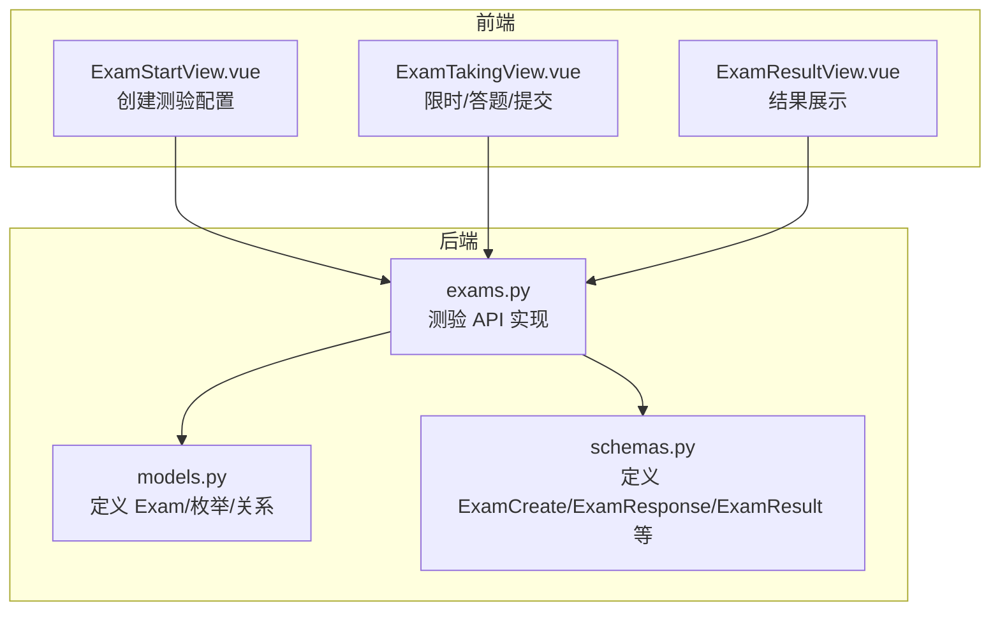
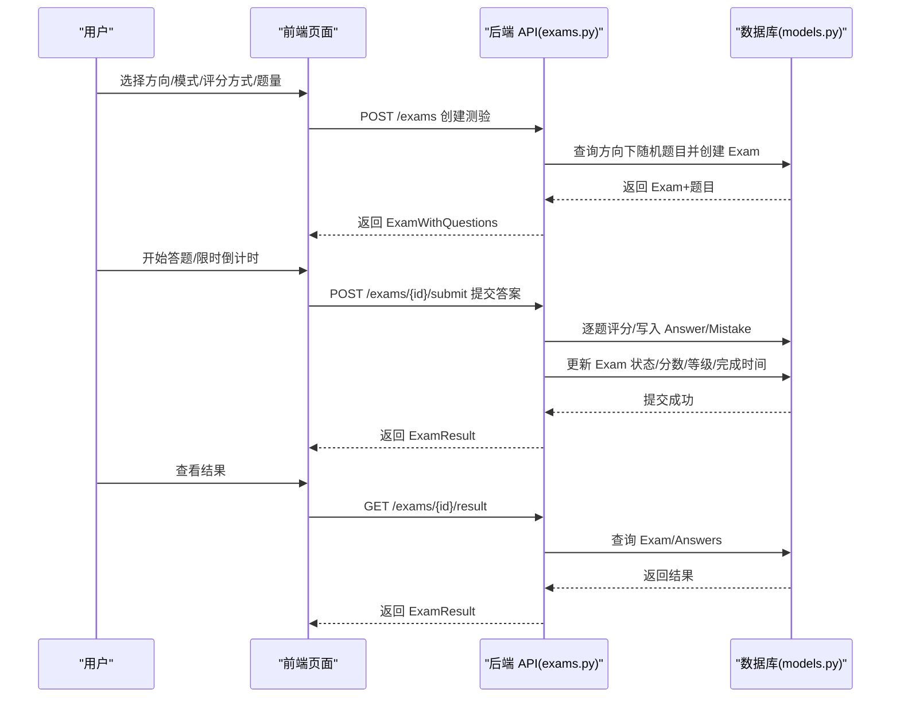
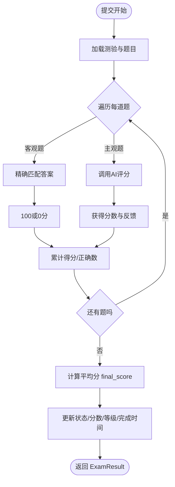
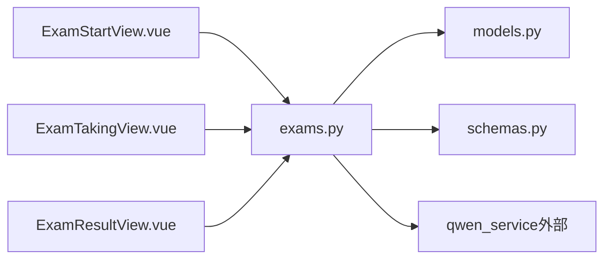

# 测验实体

<cite>
**本文引用的文件**
- [models.py](file://backend/app/models/models.py)
- [schemas.py](file://backend/app/schemas/schemas.py)
- [exams.py](file://backend/app/api/exams.py)
- [ExamStartView.vue](file://frontend/src/views/ExamStartView.vue)
- [ExamTakingView.vue](file://frontend/src/views/ExamTakingView.vue)
- [ExamResultView.vue](file://frontend/src/views/ExamResultView.vue)
</cite>

## 目录
1. [简介](#简介)
2. [项目结构](#项目结构)
3. [核心组件](#核心组件)
4. [架构总览](#架构总览)
5. [详细组件分析](#详细组件分析)
6. [依赖关系分析](#依赖关系分析)
7. [性能考量](#性能考量)
8. [故障排查指南](#故障排查指南)
9. [结论](#结论)
10. [附录](#附录)

## 简介
本文件围绕“测验实体（Exam）”展开，系统性说明其核心字段、业务含义与约束；解释测验模式（timed/untimed）、评分方式（hundred/grade）与等级制度；梳理测验状态转换流程及完成后的成绩计算逻辑；并给出创建、开始、完成等关键流程的代码示例路径，帮助开发者与产品人员快速理解与使用。

## 项目结构
后端采用 FastAPI + SQLAlchemy 的典型分层：
- models 层：定义数据库模型与枚举（Exam、ExamMode、ScoreType、ExamStatus 等）
- schemas 层：定义 Pydantic 模式（请求/响应），用于 API 输入输出校验
- api 层：定义测验相关接口（创建、取题、提交、查结果）
- 前端 Vue 单页应用：提供测验开始、答题、结果展示页面

图表来源
- [models.py](file://backend/app/models/models.py#L116-L133)
- [schemas.py](file://backend/app/schemas/schemas.py#L103-L141)
- [exams.py](file://backend/app/api/exams.py#L1-L240)
- [ExamStartView.vue](file://frontend/src/views/ExamStartView.vue#L1-L395)
- [ExamTakingView.vue](file://frontend/src/views/ExamTakingView.vue#L1-L516)
- [ExamResultView.vue](file://frontend/src/views/ExamResultView.vue#L1-L442)

章节来源
- [models.py](file://backend/app/models/models.py#L116-L133)
- [schemas.py](file://backend/app/schemas/schemas.py#L103-L141)
- [exams.py](file://backend/app/api/exams.py#L1-L240)

## 核心组件
- 测验实体（Exam）：持久化测验的基本信息与结果
- 枚举（ExamMode、ScoreType、ExamStatus）：控制测验行为与结果呈现
- Pydantic 模式（ExamCreate、ExamResponse、ExamResult）：API 输入输出规范
- API 接口（创建、取题、提交、查结果）：业务流程入口

章节来源
- [models.py](file://backend/app/models/models.py#L30-L46)
- [schemas.py](file://backend/app/schemas/schemas.py#L103-L141)
- [exams.py](file://backend/app/api/exams.py#L29-L240)

## 架构总览
从用户操作到数据库落盘，测验流程的关键节点如下：

图表来源
- [exams.py](file://backend/app/api/exams.py#L47-L87)
- [exams.py](file://backend/app/api/exams.py#L127-L216)
- [exams.py](file://backend/app/api/exams.py#L219-L239)
- [models.py](file://backend/app/models/models.py#L116-L133)

## 详细组件分析

### 测验实体（Exam）字段与业务含义
- id：自增主键，唯一标识一次测验
- direction_id：外键关联学习方向，决定题目来源范围
- mode：测验模式（timed/untimed），影响答题体验与限制
- time_limit：限时分钟数，仅在 timed 模式下生效
- score_type：评分方式（hundred/grade），影响最终分数与等级
- status：测验状态（in_progress/completed），驱动流程推进
- score：最终得分（百分制），可为空表示未完成
- grade：等级（A/B/C/D），仅在 score_type=grade 时计算
- created_at/completed_at：时间戳，用于统计与排序

章节来源
- [models.py](file://backend/app/models/models.py#L116-L129)

### 枚举与规则
- ExamMode（测验模式）
  - timed：限时测验，time_limit 必填且生效
  - untimed：不限时测验，time_limit 为空
- ScoreType（评分方式）
  - hundred：百分制显示，不计算等级
  - grade：等级制（A/B/C/D），需计算等级
- ExamStatus（测验状态）
  - in_progress：进行中
  - completed：已完成，不可重复提交

章节来源
- [models.py](file://backend/app/models/models.py#L30-L46)

### Pydantic 模式（输入/输出）
- ExamCreate：创建测验时的请求体，包含 direction_id、mode、time_limit、score_type、question_count
- ExamResponse：测验响应，包含上述字段与状态、时间戳
- ExamWithQuestions：创建后返回的完整测验详情，包含题目列表
- ExamResult：提交后返回的结果，包含总题数、正确数、最终分数与等级、答题明细

章节来源
- [schemas.py](file://backend/app/schemas/schemas.py#L103-L141)

### 前端交互与流程
- ExamStartView.vue：选择方向、模式、评分方式、题量，调用后端创建接口
- ExamTakingView.vue：按题作答，支持单选/多选/判断/简答；timed 模式下倒计时，自动提交；导航题号
- ExamResultView.vue：展示分数、等级、答题详情、AI评语与解析

章节来源
- [ExamStartView.vue](file://frontend/src/views/ExamStartView.vue#L1-L395)
- [ExamTakingView.vue](file://frontend/src/views/ExamTakingView.vue#L1-L516)
- [ExamResultView.vue](file://frontend/src/views/ExamResultView.vue#L1-L442)

### 测验状态转换与完成后的成绩计算
- 创建阶段：根据方向与题量随机抽取题目，初始化 Exam 为 in_progress
- 提交阶段：
  - 客观题（单选/多选/判断）：精确匹配，100 分或 0 分
  - 主观题（简答）：调用 AI 服务评分，≥60 分视为正确
  - 累加得分，计算平均分作为 final_score
  - 更新 Exam.status=completed、score=final_score、grade=calculate_grade(final_score)（当 score_type=grade）
  - 记录 completed_at 时间
- 结果查询：仅对 completed 的测验返回结果

图表来源
- [exams.py](file://backend/app/api/exams.py#L127-L216)

章节来源
- [exams.py](file://backend/app/api/exams.py#L17-L26)
- [exams.py](file://backend/app/api/exams.py#L127-L216)

### 评分方式与等级制度
- 百分制（hundred）
  - score_type=hundred 时，直接以百分制显示 final_score
  - 不计算 grade 字段
- 等级制（grade）
  - score_type=grade 时，按百分制计算 final_score，并映射为等级：
    - A：≥90
    - B：≥80
    - C：≥60
    - D：<60
  - grade 字段存储等级字符

章节来源
- [models.py](file://backend/app/models/models.py#L36-L39)
- [exams.py](file://backend/app/api/exams.py#L17-L26)

### 关键流程代码示例路径
- 创建测验（后端）
  - 路径：POST /exams
  - 示例：[创建测验接口](file://backend/app/api/exams.py#L47-L87)
- 获取测验详情（后端）
  - 路径：GET /exams/{exam_id}
  - 示例：[获取测验详情](file://backend/app/api/exams.py#L90-L124)
- 提交测验并评分（后端）
  - 路径：POST /exams/{id}/submit
  - 示例：[提交测验](file://backend/app/api/exams.py#L127-L216)
- 获取测验结果（后端）
  - 路径：GET /exams/{id}/result
  - 示例：[获取结果](file://backend/app/api/exams.py#L219-L239)
- 前端创建测验
  - 示例：[开始测验页面](file://frontend/src/views/ExamStartView.vue#L140-L151)
- 前端答题与提交
  - 示例：[答题页面提交逻辑](file://frontend/src/views/ExamTakingView.vue#L208-L235)

章节来源
- [exams.py](file://backend/app/api/exams.py#L47-L87)
- [exams.py](file://backend/app/api/exams.py#L90-L124)
- [exams.py](file://backend/app/api/exams.py#L127-L216)
- [exams.py](file://backend/app/api/exams.py#L219-L239)
- [ExamStartView.vue](file://frontend/src/views/ExamStartView.vue#L140-L151)
- [ExamTakingView.vue](file://frontend/src/views/ExamTakingView.vue#L208-L235)

## 依赖关系分析
- 后端模块间依赖
  - exams.py 依赖 models 中的 Exam/枚举与 Answer/Mistake 表
  - exams.py 依赖 schemas 中的 ExamCreate/ExamResponse/ExamResult/ExamSubmit
  - 前端页面依赖后端 API，形成闭环
- 外部依赖
  - AI 服务（qwen_service）用于主观题评分与反馈

图表来源
- [exams.py](file://backend/app/api/exams.py#L1-L240)
- [models.py](file://backend/app/models/models.py#L116-L133)
- [schemas.py](file://backend/app/schemas/schemas.py#L103-L141)
- [ExamStartView.vue](file://frontend/src/views/ExamStartView.vue#L1-L395)
- [ExamTakingView.vue](file://frontend/src/views/ExamTakingView.vue#L1-L516)
- [ExamResultView.vue](file://frontend/src/views/ExamResultView.vue#L1-L442)

章节来源
- [exams.py](file://backend/app/api/exams.py#L1-L240)
- [models.py](file://backend/app/models/models.py#L116-L133)
- [schemas.py](file://backend/app/schemas/schemas.py#L103-L141)

## 性能考量
- 题目抽取：使用随机排序与 limit 控制题量，避免全表扫描
- 评分批处理：逐题评分后一次性提交，减少事务开销
- 前端渲染：结果页按需加载题目详情，避免一次性传输大量数据
- 建议
  - 对高频查询（如按方向/状态过滤）建立索引
  - 限制单次题量上限，避免超大提交包
  - 主观题评分异步化，提升用户体验

## 故障排查指南
- 创建测验失败
  - 现象：提示“该方向下没有可用题目”
  - 排查：确认方向下存在资料与题目
  - 参考：[创建测验逻辑](file://backend/app/api/exams.py#L50-L62)
- 提交测验重复提交
  - 现象：提示“测验已完成”
  - 排查：检查测验状态是否为 completed
  - 参考：[提交前状态检查](file://backend/app/api/exams.py#L138-L139)
- 结果查询未完成
  - 现象：提示“测验尚未完成”
  - 排查：确认测验已完成且存在 score/grade
  - 参考：[结果查询状态检查](file://backend/app/api/exams.py#L226-L227)
- 限时测验自动提交
  - 现象：倒计时结束自动提交
  - 排查：前端定时器逻辑与提交流程
  - 参考：[限时倒计时与自动提交](file://frontend/src/views/ExamTakingView.vue#L184-L194)

章节来源
- [exams.py](file://backend/app/api/exams.py#L138-L139)
- [exams.py](file://backend/app/api/exams.py#L226-L227)
- [ExamTakingView.vue](file://frontend/src/views/ExamTakingView.vue#L184-L194)

## 结论
测验实体（Exam）通过清晰的字段与枚举约束，配合前后端协作，实现了从创建、答题到评分与结果展示的完整闭环。timed/untimed 模式满足不同场景需求；hundred/grade 评分方式兼顾直观与等级化；完善的错误处理与状态机保障了流程稳定性。建议在生产环境中进一步完善索引、异步评分与限流策略，持续优化用户体验与系统性能。

## 附录
- 测验模式与评分方式对照
  - timed：限时答题，time_limit 生效
  - untimed：不限时答题，time_limit 为空
  - hundred：百分制显示，不计算等级
  - grade：等级制（A/B/C/D），按百分制计算等级
- 关键字段默认值
  - mode 默认 untimed
  - score_type 默认 hundred
  - status 默认 in_progress
  - score/grade 初始为空，完成后填充

章节来源
- [models.py](file://backend/app/models/models.py#L122-L129)
- [schemas.py](file://backend/app/schemas/schemas.py#L106-L109)