# 知识解析实体组

<cite>
**本文档引用的文件**
- [models.py](file://backend/app/models/models.py)
- [schemas.py](file://backend/app/schemas/schemas.py)
- [parse_service.py](file://backend/app/services/parse_service.py)
- [knowledge_service.py](file://backend/app/services/knowledge_service.py)
- [extractor_service.py](file://backend/app/services/extractor_service.py)
- [parse.py](file://backend/app/api/parse.py)
- [config.py](file://backend/app/core/config.py)
- [main.py](file://backend/app/main.py)
</cite>

## 目录
1. [简介](#简介)
2. [项目结构](#项目结构)
3. [核心组件](#核心组件)
4. [架构概览](#架构概览)
5. [详细组件分析](#详细组件分析)
6. [依赖关系分析](#依赖关系分析)
7. [性能考虑](#性能考虑)
8. [故障排除指南](#故障排除指南)
9. [结论](#结论)

## 简介

本文档深入分析个人学习管理系统中的知识解析实体组，重点关注三个核心实体：ParseTask（解析任务）、KnowledgePoint（知识点）和BestPractice（最佳实践）。这些实体构成了系统知识管理的核心基础设施，实现了从原始内容到结构化知识的完整转换流程。

系统采用分层架构设计，通过专门的服务层协调不同功能模块，确保知识解析流程的可靠性和可扩展性。每个实体都经过精心设计，既满足业务需求，又保持良好的数据完整性约束。

## 项目结构

项目采用典型的三层架构模式，主要分为以下层次：

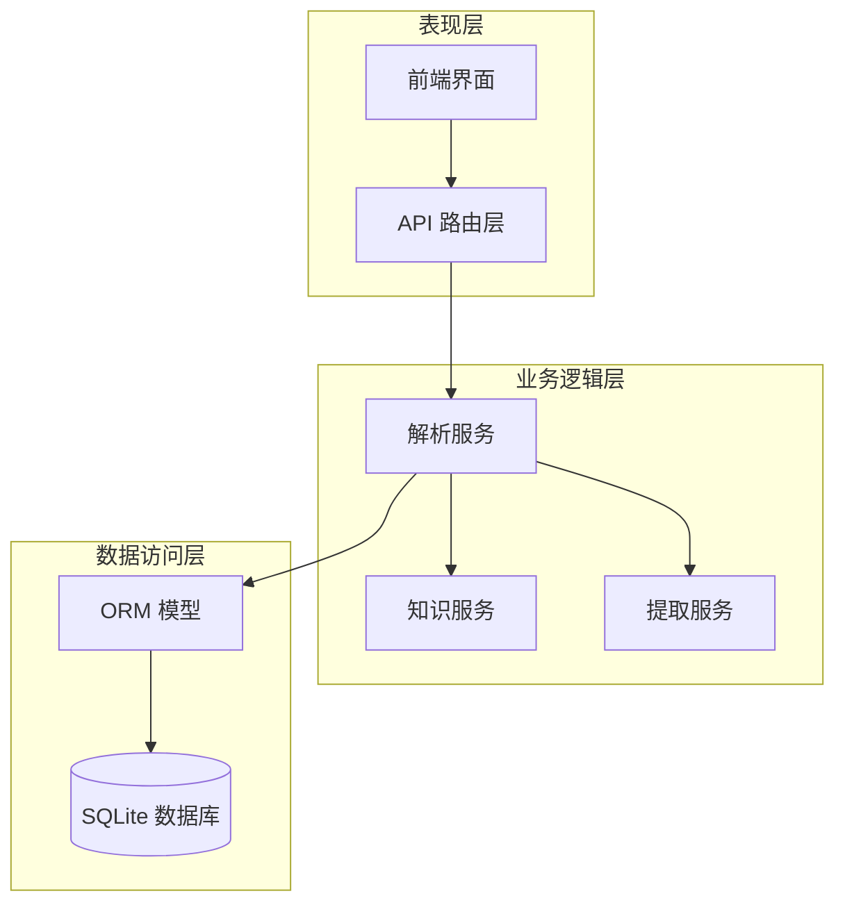

**图表来源**
- [main.py](file://backend/app/main.py#L1-L66)
- [parse.py](file://backend/app/api/parse.py#L1-L77)

**章节来源**
- [main.py](file://backend/app/main.py#L1-L66)
- [config.py](file://backend/app/core/config.py#L1-L34)

## 核心组件

### ParseTask 实体

ParseTask 是知识解析流程的核心实体，负责跟踪整个解析过程的状态和结果。

#### 字段定义

| 字段名 | 类型 | 描述 | 约束 |
|--------|------|------|------|
| id | Integer | 主键标识 | 自增 |
| direction_id | Integer | 学习方向外键 | 可空，级联设置为NULL |
| title | String(200) | 任务标题 | 必填 |
| source_type | Enum | 来源类型 | 必填，枚举值：text/file/url |
| source_content | Text | 来源内容 | 必填，存储原始来源信息 |
| raw_text | Text | 提取的原始文本 | 可空 |
| summary | Text | 内容摘要 | 可空 |
| status | Enum | 任务状态 | 默认pending，枚举值：pending/processing/completed/failed |
| error_message | Text | 错误信息 | 可空 |
| created_at | DateTime | 创建时间 | 默认当前时间 |
| updated_at | DateTime | 更新时间 | 默认当前时间，自动更新 |

#### 任务状态管理

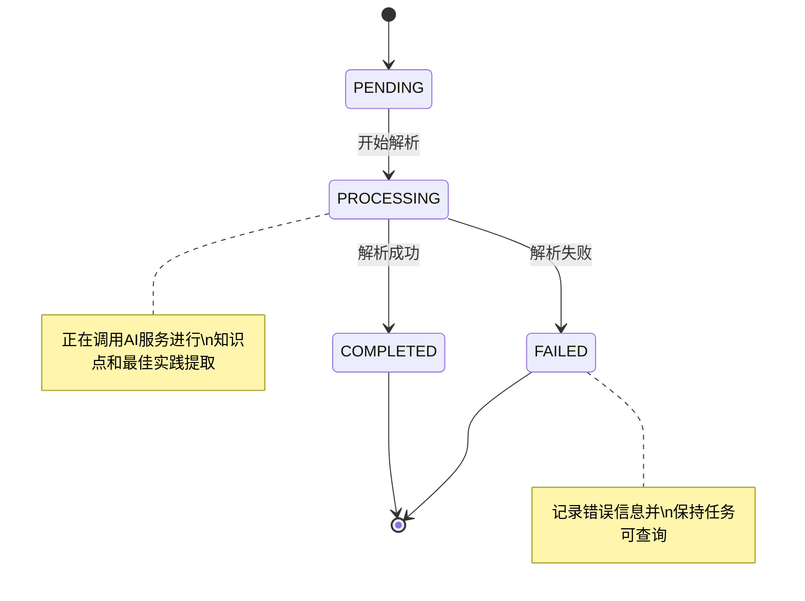

**图表来源**
- [models.py](file://backend/app/models/models.py#L55-L61)
- [parse_service.py](file://backend/app/services/parse_service.py#L18-L56)

#### 关联关系

ParseTask 与其它实体建立了一对多的关联关系：

- 与 Direction 的多对一关系：一个任务属于一个学习方向
- 与 KnowledgePoint 的一对多关系：一个任务可以包含多个知识点
- 与 BestPractice 的一对多关系：一个任务可以包含多个最佳实践

**章节来源**
- [models.py](file://backend/app/models/models.py#L171-L191)

### KnowledgePoint 实体

KnowledgePoint 负责存储从内容中提取的知识点信息。

#### 字段定义

| 字段名 | 类型 | 描述 | 约束 |
|--------|------|------|------|
| id | Integer | 主键标识 | 自增 |
| task_id | Integer | 解析任务外键 | 必填，级联删除 |
| name | String(200) | 知识点名称 | 必填 |
| description | Text | 详细描述 | 必填，100-200字符 |
| importance | Integer | 重要程度 | 1-5，默认3 |
| category | String(100) | 分类标签 | 可空 |
| created_at | DateTime | 创建时间 | 默认当前时间 |

#### 知识点重要性评估

系统采用1-5分的重要程度评估体系：
- 1分：基础概念
- 2分：基本原理
- 3分：核心知识
- 4分：高级应用
- 5分：专家级知识

**章节来源**
- [models.py](file://backend/app/models/models.py#L193-L207)

### BestPractice 实体

BestPractice 存储从内容中总结的最佳实践建议。

#### 字段定义

| 字段名 | 类型 | 描述 | 约束 |
|--------|------|------|------|
| id | Integer | 主键标识 | 自增 |
| task_id | Integer | 解析任务外键 | 必填，级联删除 |
| title | String(200) | 实践标题 | 必填 |
| content | Text | 具体内容 | 必填 |
| scenario | Text | 适用场景 | 可空 |
| notes | Text | 注意事项 | 可空 |
| created_at | DateTime | 创建时间 | 默认当前时间 |

**章节来源**
- [models.py](file://backend/app/models/models.py#L209-L223)

## 架构概览

系统采用异步架构设计，通过服务层协调各个组件的工作：

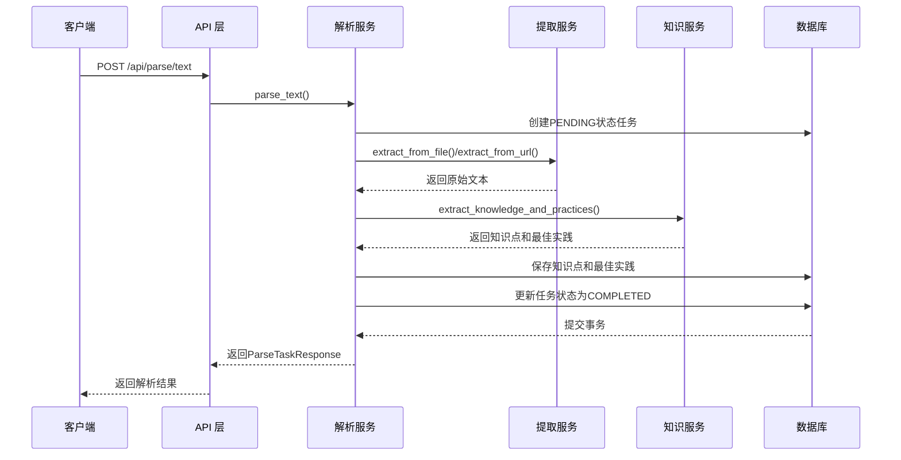

**图表来源**
- [parse.py](file://backend/app/api/parse.py#L17-L23)
- [parse_service.py](file://backend/app/services/parse_service.py#L57-L80)
- [extractor_service.py](file://backend/app/services/extractor_service.py#L30-L56)
- [knowledge_service.py](file://backend/app/services/knowledge_service.py#L51-L109)

## 详细组件分析

### 解析服务架构

解析服务是整个知识解析流程的核心协调者，负责管理任务生命周期和数据流转。

#### 服务类设计

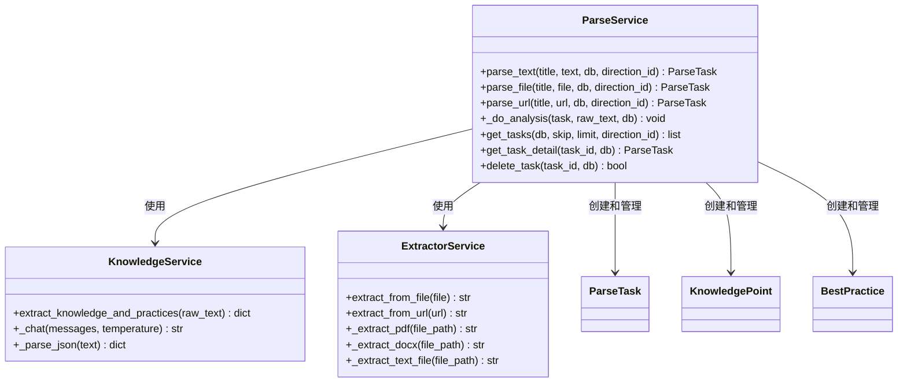

**图表来源**
- [parse_service.py](file://backend/app/services/parse_service.py#L15-L163)
- [knowledge_service.py](file://backend/app/services/knowledge_service.py#L11-L114)
- [extractor_service.py](file://backend/app/services/extractor_service.py#L20-L123)

#### 异步处理机制

系统采用异步编程模式，确保高并发场景下的性能表现：

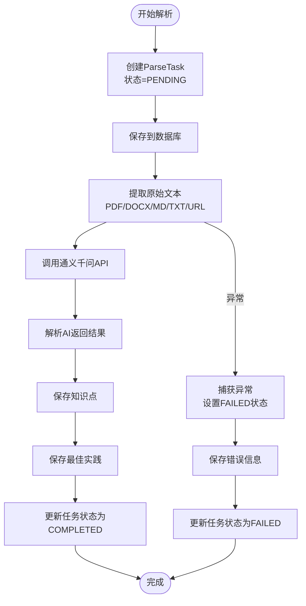

**图表来源**
- [parse_service.py](file://backend/app/services/parse_service.py#L18-L56)
- [knowledge_service.py](file://backend/app/services/knowledge_service.py#L51-L109)

**章节来源**
- [parse_service.py](file://backend/app/services/parse_service.py#L15-L163)

### 文本提取服务

文本提取服务负责从各种格式的文件和URL中提取纯文本内容。

#### 支持的文件格式

| 格式 | 扩展名 | 提取方式 |
|------|--------|----------|
| PDF文档 | .pdf | 使用PyMuPDF库提取文本 |
| Word文档 | .docx | 使用python-docx库提取文本 |
| Markdown文件 | .md | 直接读取文件内容 |
| 纯文本文件 | .txt | 直接读取文件内容 |

#### URL内容提取

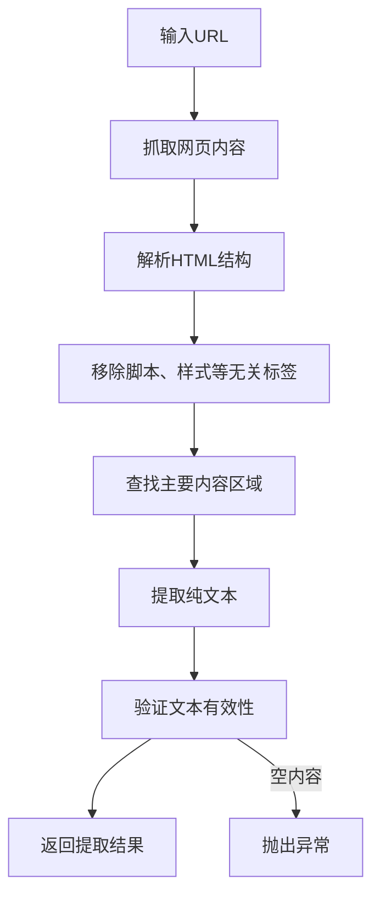

**图表来源**
- [extractor_service.py](file://backend/app/services/extractor_service.py#L93-L118)

**章节来源**
- [extractor_service.py](file://backend/app/services/extractor_service.py#L20-L123)

### 知识服务

知识服务基于通义千问API，负责从原始文本中提取知识点和最佳实践。

#### AI提示工程

系统使用精心设计的提示词模板，确保AI输出的结构化和高质量：

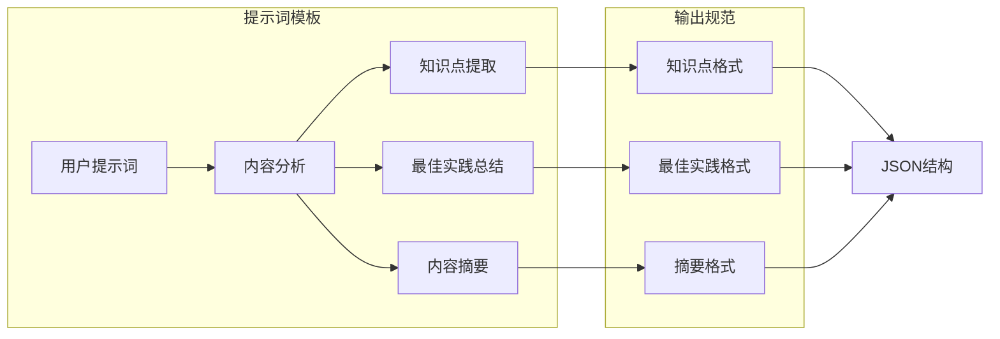

**图表来源**
- [knowledge_service.py](file://backend/app/services/knowledge_service.py#L51-L95)

#### JSON解析容错机制

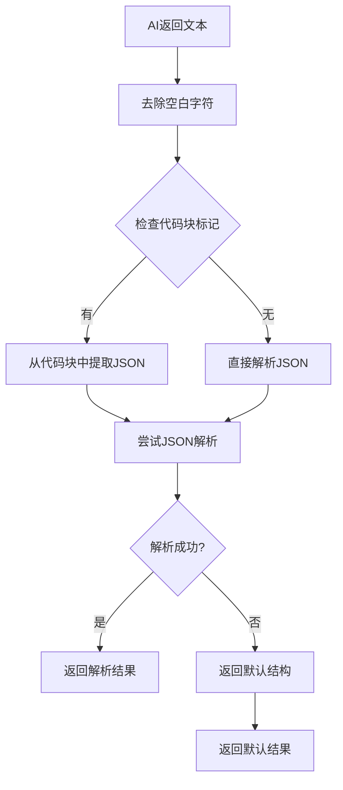

**图表来源**
- [knowledge_service.py](file://backend/app/services/knowledge_service.py#L38-L49)

**章节来源**
- [knowledge_service.py](file://backend/app/services/knowledge_service.py#L11-L114)

## 依赖关系分析

系统采用清晰的依赖层次结构，确保模块间的松耦合和高内聚。

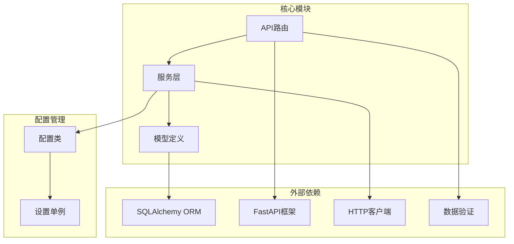

**图表来源**
- [models.py](file://backend/app/models/models.py#L1-L6)
- [parse_service.py](file://backend/app/services/parse_service.py#L1-L12)
- [parse.py](file://backend/app/api/parse.py#L1-L14)

### 数据模型关系

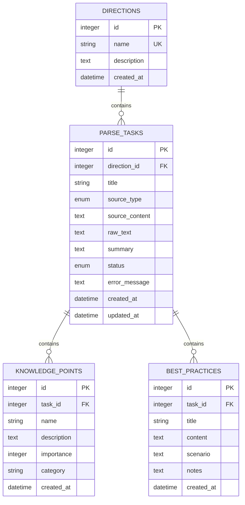

**图表来源**
- [models.py](file://backend/app/models/models.py#L63-L223)

**章节来源**
- [models.py](file://backend/app/models/models.py#L1-L223)

## 性能考虑

### 异步处理优化

系统采用异步编程模式，在I/O密集型操作中显著提升性能：

- **文件读取**：使用异步文件操作减少阻塞
- **网络请求**：使用httpx异步客户端处理API调用
- **数据库操作**：采用异步ORM操作

### 缓存策略

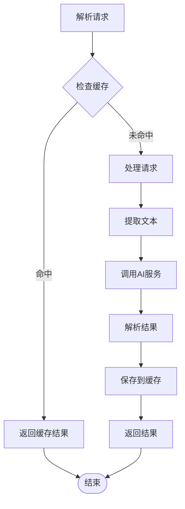

### 错误处理和重试机制

系统实现了完善的错误处理机制：

- **超时控制**：AI API调用设置120秒超时
- **异常捕获**：捕获并记录所有异常信息
- **状态回滚**：失败时自动回滚数据库事务
- **错误恢复**：提供详细的错误信息便于调试

## 故障排除指南

### 常见问题及解决方案

#### 1. 文件格式不支持

**问题症状**：上传文件时出现格式错误

**解决方法**：
- 确认文件扩展名为 .pdf、.docx、.md 或 .txt
- 检查文件是否损坏或为空
- 验证文件大小不超过10MB限制

#### 2. AI服务调用失败

**问题症状**：解析任务状态停留在PENDING或出现FAILED

**解决方法**：
- 检查通义千问API配置是否正确
- 验证API密钥和基础URL设置
- 确认网络连接正常
- 查看日志中的具体错误信息

#### 3. 数据库连接问题

**问题症状**：应用启动时数据库初始化失败

**解决方法**：
- 检查数据库URL配置
- 确认SQLite数据库文件权限
- 验证数据库文件路径存在

**章节来源**
- [extractor_service.py](file://backend/app/services/extractor_service.py#L23-L28)
- [knowledge_service.py](file://backend/app/services/knowledge_service.py#L19-L36)
- [config.py](file://backend/app/core/config.py#L13-L23)

## 结论

知识解析实体组通过精心设计的架构和严格的实现规范，为个人学习管理系统提供了强大的知识管理能力。三个核心实体各司其职，协同工作，实现了从原始内容到结构化知识的完整转换。

系统的主要优势包括：

1. **模块化设计**：清晰的职责分离和依赖关系
2. **异步处理**：高效的并发处理能力和良好的用户体验
3. **容错机制**：完善的错误处理和恢复策略
4. **扩展性强**：易于添加新的解析源和知识提取算法
5. **数据完整性**：严格的数据库约束和事务管理

通过标准化的数据模型和API接口，系统为后续的功能扩展和集成奠定了坚实的基础。无论是学术研究还是商业应用，这套知识解析实体组都能提供可靠的支撑。