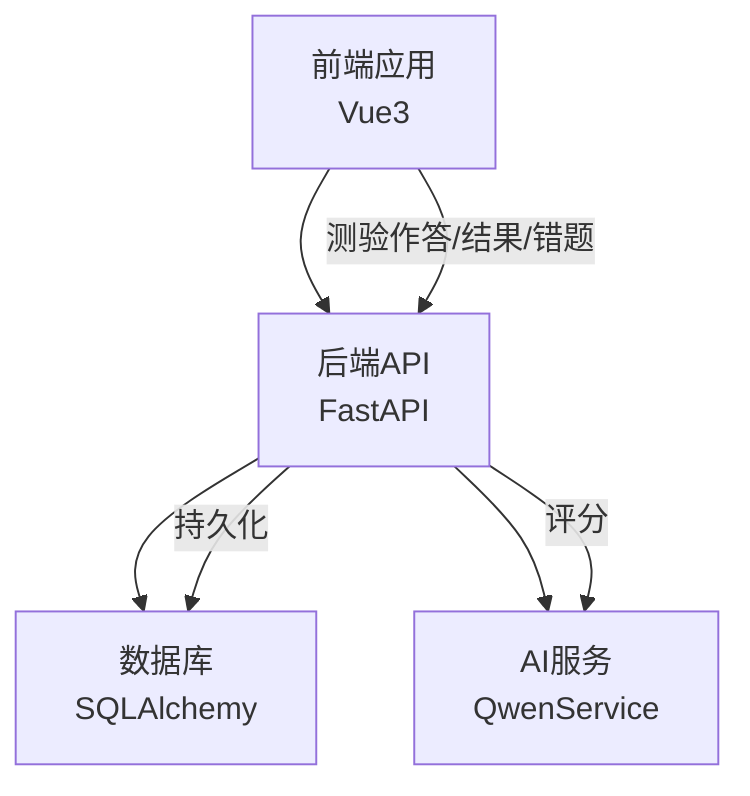
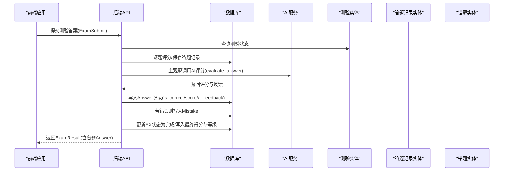
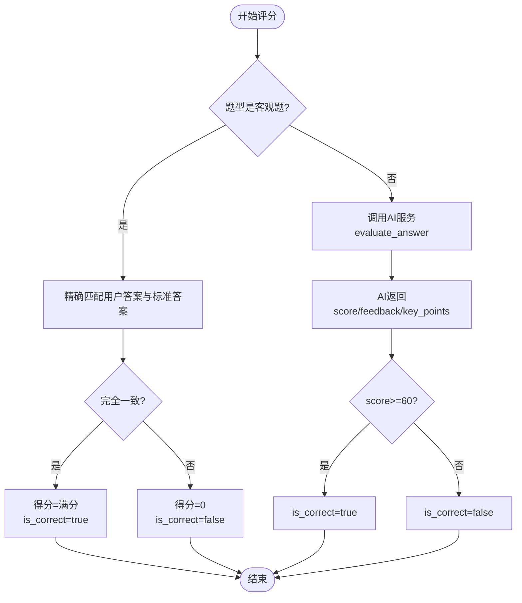
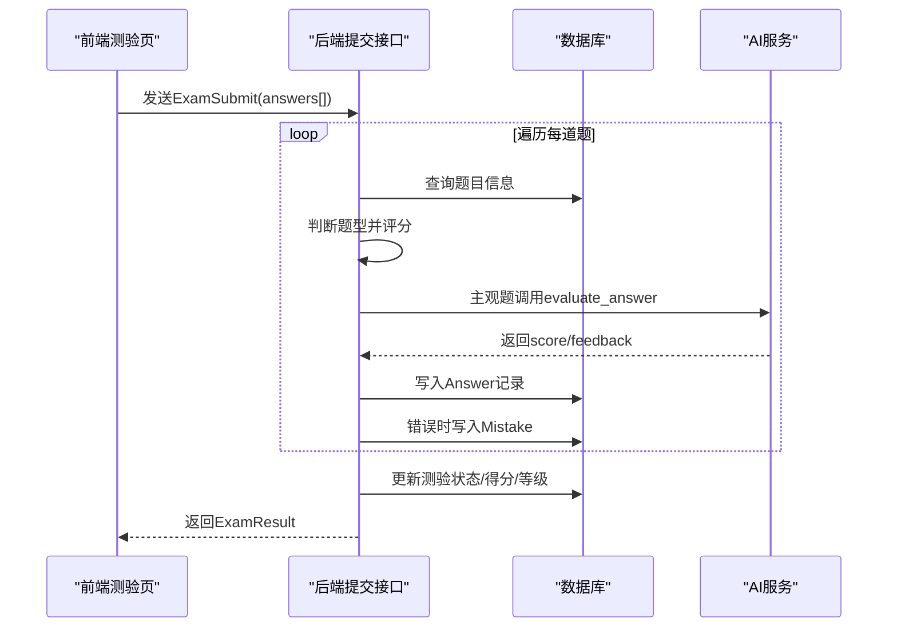
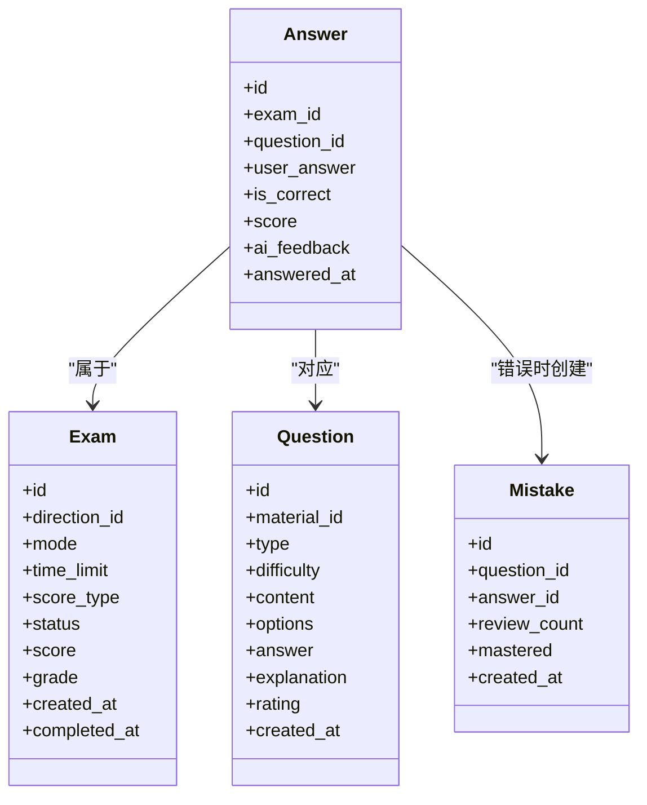

# 答题记录实体

<cite>
**本文引用的文件**
- [models.py](file://backend/app/models/models.py)
- [schemas.py](file://backend/app/schemas/schemas.py)
- [exams.py](file://backend/app/api/exams.py)
- [mistakes.py](file://backend/app/api/mistakes.py)
- [qwen_service.py](file://backend/app/services/qwen_service.py)
- [ExamTakingView.vue](file://frontend/src/views/ExamTakingView.vue)
- [ExamResultView.vue](file://frontend/src/views/ExamResultView.vue)
- [MistakesView.vue](file://frontend/src/views/MistakesView.vue)
- [main.py](file://backend/app/main.py)
</cite>

## 目录
1. [简介](#简介)
2. [项目结构](#项目结构)
3. [核心组件](#核心组件)
4. [架构总览](#架构总览)
5. [详细组件分析](#详细组件分析)
6. [依赖关系分析](#依赖关系分析)
7. [性能考虑](#性能考虑)
8. [故障排查指南](#故障排查指南)
9. [结论](#结论)

## 简介
本文件围绕“答题记录实体”Answer展开，系统性说明其字段定义、与测验和题目的关联关系、AI评分反馈生成机制与评分算法、答题提交与自动评分流程、成绩统计逻辑，以及在错题管理中的作用。文档同时提供前后端关键实现示例路径，帮助读者快速定位源码位置并理解整体工作流。

## 项目结构
后端采用FastAPI + SQLAlchemy架构，前端使用Vue3。答题记录实体位于后端模型层，API层负责接收前端提交、执行评分与统计，并通过服务层调用大模型进行主观题评分；前端提供测验作答、结果展示与错题本管理界面。

图表来源
- [main.py](file://backend/app/main.py#L36-L43)
- [exams.py](file://backend/app/api/exams.py#L127-L217)
- [qwen_service.py](file://backend/app/services/qwen_service.py#L115-L152)

章节来源
- [main.py](file://backend/app/main.py#L36-L43)

## 核心组件
- 答题记录实体 Answer：存储单次答题的关键信息，包括测验ID、题目ID、用户答案、是否正确、得分、AI反馈、答题时间等。
- 测验实体 Exam：代表一次完整的测验，包含测验模式、计分方式、状态、最终得分与等级等。
- 题目实体 Question：包含题目内容、类型、选项、标准答案、解析等。
- 错题实体 Mistake：记录错误题目及复习状态，与答题记录Answer建立一对一关联。

章节来源
- [models.py](file://backend/app/models/models.py#L136-L152)
- [models.py](file://backend/app/models/models.py#L116-L134)
- [models.py](file://backend/app/models/models.py#L95-L114)
- [models.py](file://backend/app/models/models.py#L155-L169)

## 架构总览
答题记录贯穿“前端作答—后端评分—结果统计—错题管理”的完整闭环。前端负责收集用户答案并提交；后端根据题型执行客观题精确匹配或调用AI服务进行主观题评分；评分完成后写入答题记录并更新测验状态与成绩；错误题目自动转入错题本。

图表来源
- [exams.py](file://backend/app/api/exams.py#L127-L217)
- [qwen_service.py](file://backend/app/services/qwen_service.py#L115-L152)
- [models.py](file://backend/app/models/models.py#L136-L152)
- [models.py](file://backend/app/models/models.py#L155-L169)

## 详细组件分析

### 答题记录实体字段定义与作用
- id：自增主键，唯一标识一条答题记录。
- exam_id：外键，指向所属测验。
- question_id：外键，指向对应题目。
- user_answer：用户作答内容，用于对比或交给AI评分。
- is_correct：布尔值，表示该题是否正确。客观题通过精确匹配得出；主观题由AI评分阈值判定。
- score：数值型，单题得分，百分制。
- ai_feedback：字符串，AI对主观题的答案评语与要点命中情况说明。
- answered_at：时间戳，默认当前时间，记录答题时刻。

章节来源
- [models.py](file://backend/app/models/models.py#L136-L152)

### 与测验、题目的关联关系
- Answer与Exam：一对多关系，一个测验包含多条答题记录。
- Answer与Question：一对多关系，一道题目可被多次作答形成多条记录。
- Answer与Mistake：一对一关系，错误答题记录会创建对应的错题记录。

章节来源
- [models.py](file://backend/app/models/models.py#L136-L152)
- [models.py](file://backend/app/models/models.py#L116-L134)
- [models.py](file://backend/app/models/models.py#L95-L114)

### AI评分反馈生成机制与评分算法
- 客观题（单选/多选/判断）：直接比较用户答案与标准答案，完全一致即正确，得满分；否则不得分。
- 主观题（简答题）：调用AI服务进行评分，返回包含得分、评语、命中要点与遗漏要点的结构化结果；通常以60分为及格线判定is_correct。
- 评分阈值：默认≥60分视为正确，具体阈值可在业务策略中调整。

图表来源
- [exams.py](file://backend/app/api/exams.py#L154-L170)
- [qwen_service.py](file://backend/app/services/qwen_service.py#L115-L152)

章节来源
- [exams.py](file://backend/app/api/exams.py#L154-L170)
- [qwen_service.py](file://backend/app/services/qwen_service.py#L115-L152)

### 答题提交、自动评分与成绩统计实现示例
- 前端测验作答页面：收集用户答案，组装ExamSubmit结构，提交至后端。
- 后端提交接口：遍历每道题，按题型评分，保存答题记录，若错误则写入错题；计算平均分并更新测验状态为完成。
- 结果展示：返回ExamResult，包含总题数、正确数、最终得分与等级，以及每题的答题记录。

图表来源
- [ExamTakingView.vue](file://frontend/src/views/ExamTakingView.vue#L208-L235)
- [exams.py](file://backend/app/api/exams.py#L127-L217)
- [qwen_service.py](file://backend/app/services/qwen_service.py#L115-L152)

章节来源
- [ExamTakingView.vue](file://frontend/src/views/ExamTakingView.vue#L208-L235)
- [exams.py](file://backend/app/api/exams.py#L127-L217)

### 成绩统计与等级计算
- 平均分：总分除以题数。
- 等级：根据计分方式（百分制或等级制）计算，百分制下通常以90=A、80=B、60=C等规则换算。
- 测验完成状态：提交后更新为完成，写入完成时间。

章节来源
- [exams.py](file://backend/app/api/exams.py#L17-L27)
- [exams.py](file://backend/app/api/exams.py#L197-L207)

### 错题管理中的作用
- 错误记录：当is_correct为假时，自动创建错题记录，关联题目与答题记录。
- 复习追踪：错题实体包含复习次数、是否已掌握等字段，支持后续复习与巩固。
- 展示与操作：前端错题本页面支持筛选、标记掌握状态、记录复习次数等。

章节来源
- [exams.py](file://backend/app/api/exams.py#L183-L189)
- [models.py](file://backend/app/models/models.py#L155-L169)
- [mistakes.py](file://backend/app/api/mistakes.py#L11-L31)
- [MistakesView.vue](file://frontend/src/views/MistakesView.vue#L108-L149)

## 依赖关系分析
- Answer依赖Exam与Question进行外键约束与关系映射。
- Answer与Mistake之间存在一对一关系，用于错误题目的追踪。
- API层在提交接口中依赖AI服务进行主观题评分。
- 前端通过API层与后端交互，完成答题、查看结果与错题管理。

图表来源
- [models.py](file://backend/app/models/models.py#L136-L152)
- [models.py](file://backend/app/models/models.py#L116-L134)
- [models.py](file://backend/app/models/models.py#L95-L114)
- [models.py](file://backend/app/models/models.py#L155-L169)

章节来源
- [models.py](file://backend/app/models/models.py#L136-L152)
- [models.py](file://backend/app/models/models.py#L116-L134)
- [models.py](file://backend/app/models/models.py#L95-L114)
- [models.py](file://backend/app/models/models.py#L155-L169)

## 性能考虑
- 批量评分：后端逐题评分并批量写入，建议在高并发场景下优化数据库事务与索引。
- AI评分延迟：主观题评分依赖外部服务，建议设置合理的超时与重试策略。
- 前端渲染：结果页一次性渲染大量答题卡片，建议按需分页或虚拟滚动提升体验。
- 关系查询：错题管理使用联结加载题目详情，注意避免N+1查询问题。

## 故障排查指南
- 提交后无法查看结果：确认测验状态是否为完成，且已写入最终得分与等级。
- 主观题评分异常：检查AI服务配置与网络连通性，关注返回JSON解析失败的情况。
- 错题未生成：确认is_correct为假时是否成功创建Mistake记录。
- 前端显示空白：检查API返回的数据结构与前端渲染逻辑。

章节来源
- [exams.py](file://backend/app/api/exams.py#L220-L239)
- [qwen_service.py](file://backend/app/services/qwen_service.py#L142-L151)
- [mistakes.py](file://backend/app/api/mistakes.py#L11-L31)

## 结论
答题记录实体Answer是整个测评系统的核心数据载体，承载了用户作答、评分结果与学习轨迹。通过客观题精确匹配与AI主观题评分相结合的方式，系统实现了高效、智能化的测评闭环；配合错题管理，进一步强化了个性化学习与复习巩固能力。建议在生产环境中持续优化评分阈值、AI提示词与前端渲染性能，以获得更佳的用户体验与教学效果。