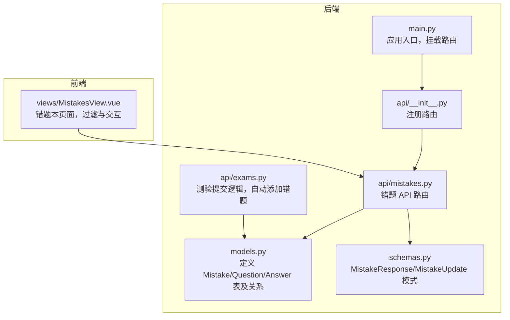
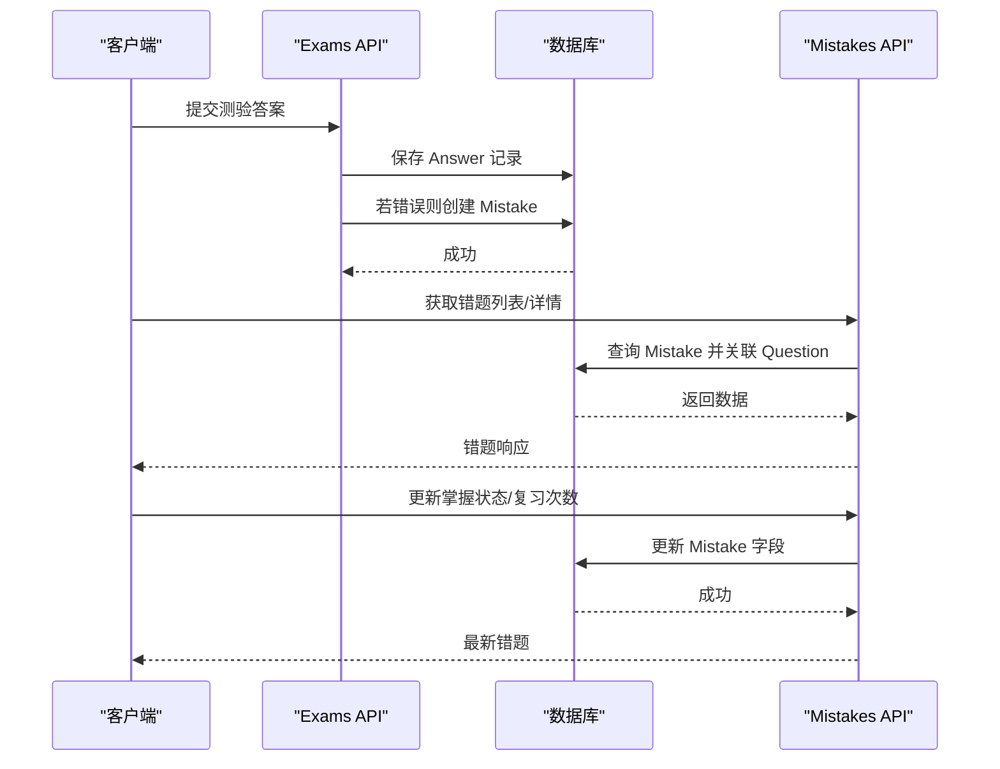
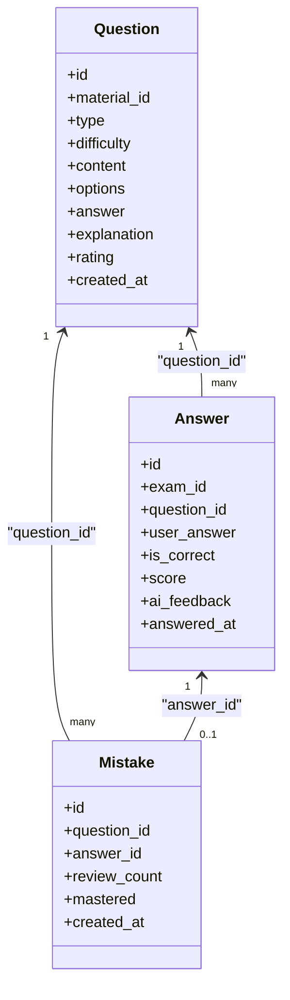
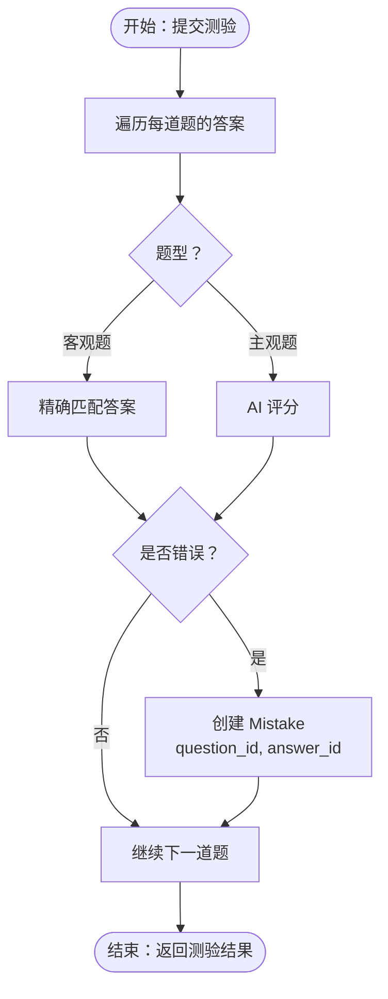
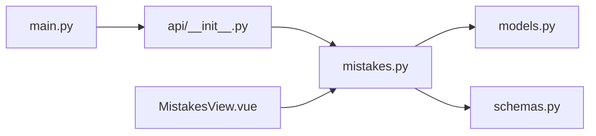

# 错题实体

<cite>
**本文引用的文件**
- [models.py](file://backend/app/models/models.py)
- [mistakes.py](file://backend/app/api/mistakes.py)
- [schemas.py](file://backend/app/schemas/schemas.py)
- [exams.py](file://backend/app/api/exams.py)
- [MistakesView.vue](file://frontend/src/views/MistakesView.vue)
- [main.py](file://backend/app/main.py)
- [__init__.py](file://backend/app/api/__init__.py)
</cite>

## 目录
1. [简介](#简介)
2. [项目结构](#项目结构)
3. [核心组件](#核心组件)
4. [架构总览](#架构总览)
5. [详细组件分析](#详细组件分析)
6. [依赖关系分析](#依赖关系分析)
7. [性能考量](#性能考量)
8. [故障排查指南](#故障排查指南)
9. [结论](#结论)

## 简介
本文件系统性阐述“错题实体”(Mistake)的设计与实现，覆盖字段定义、与题目与答题记录的关联关系、错题本管理机制（复习次数统计与掌握状态追踪）、错题识别与添加流程、复习提醒策略以及在学习效果评估中的作用。文档同时提供前后端关键实现路径，帮助开发者快速理解与扩展功能。

## 项目结构
本项目采用后端 FastAPI + SQLAlchemy ORM + 前端 Vue 的分层架构。错题实体位于后端模型层，通过 API 层暴露 CRUD 与状态更新能力，并在前端页面进行展示与交互。

图表来源
- [main.py](file://backend/app/main.py#L36-L42)
- [__init__.py](file://backend/app/api/__init__.py#L1-L17)
- [mistakes.py](file://backend/app/api/mistakes.py#L1-L90)
- [exams.py](file://backend/app/api/exams.py#L127-L216)
- [models.py](file://backend/app/models/models.py#L155-L168)
- [schemas.py](file://backend/app/schemas/schemas.py#L171-L191)
- [MistakesView.vue](file://frontend/src/views/MistakesView.vue#L108-L149)

章节来源
- [main.py](file://backend/app/main.py#L36-L42)
- [__init__.py](file://backend/app/api/__init__.py#L1-L17)

## 核心组件
- 错题实体 Mistake：持久化存储错题记录，包含题目与答题记录的外键关联、复习次数与掌握状态、创建时间等字段。
- 错题 API：提供获取列表、详情、更新（含自动递增复习次数）、删除等能力。
- 测验提交逻辑：在客观题或主观题评分后，若用户作答错误则自动创建错题记录。
- 前端错题本视图：支持按学习方向与掌握状态过滤、查看题目与解析、标记掌握状态、记录复习次数。

章节来源
- [models.py](file://backend/app/models/models.py#L155-L168)
- [mistakes.py](file://backend/app/api/mistakes.py#L11-L90)
- [exams.py](file://backend/app/api/exams.py#L183-L190)
- [MistakesView.vue](file://frontend/src/views/MistakesView.vue#L108-L149)

## 架构总览
错题实体贯穿“测验—答题—评分—错题识别—错题管理—前端展示”的完整链路。

图表来源
- [exams.py](file://backend/app/api/exams.py#L127-L216)
- [mistakes.py](file://backend/app/api/mistakes.py#L11-L77)
- [models.py](file://backend/app/models/models.py#L136-L168)

## 详细组件分析

### 错题实体字段定义与用途
- id：主键，自增，唯一标识每条错题记录。
- question_id：外键，指向题目表，用于定位错题对应的题目。
- answer_id：外键，指向答题记录表，用于定位该错题对应的答题记录。
- review_count：整型，默认 0，记录该错题被复习的次数，用于复习提醒与进度追踪。
- mastered：布尔值，默认 false，表示该错题是否已被掌握；用于错题本筛选与学习效果评估。
- created_at：时间戳，默认当前时间，记录错题创建时间，用于排序与统计。

章节来源
- [models.py](file://backend/app/models/models.py#L155-L168)

### 与题目、答题记录的关联关系
- Mistake 与 Question：一对多关系，一个题目可对应多条错题记录（不同答题情境导致的错误）。
- Mistake 与 Answer：一对一关系，每条错题记录对应一条具体的答题记录，便于回溯用户当时作答情况。
- Answer 与 Question：一对多关系，同一题目在不同测验中可能产生多条答题记录。
- Answer 与 Mistake：反向一对一关系，确保每条答题记录最多仅有一条错题记录。

图表来源
- [models.py](file://backend/app/models/models.py#L95-L113)
- [models.py](file://backend/app/models/models.py#L136-L152)
- [models.py](file://backend/app/models/models.py#L155-L168)

### 错题本管理机制
- 复习次数统计：前端点击“记录复习”，后端在未显式传入 review_count 时自动递增；也可直接设置 review_count。
- 掌握状态追踪：支持标记为已掌握/未掌握，前端以标签颜色区分；后端提供按 mastered 过滤的接口。
- 学习方向维度：支持按学习方向过滤错题，便于分组管理与复习规划。

章节来源
- [mistakes.py](file://backend/app/api/mistakes.py#L47-L77)
- [MistakesView.vue](file://frontend/src/views/MistakesView.vue#L108-L149)

### 错题识别与自动添加流程
- 在测验提交阶段，对每道题进行评分：
  - 客观题：精确匹配答案，若不正确则创建错题。
  - 主观题：调用 AI 评分，若得分低于阈值则创建错题。
- 错题创建时仅需提供 question_id 与 answer_id，其余字段使用默认值。

图表来源
- [exams.py](file://backend/app/api/exams.py#L127-L216)

章节来源
- [exams.py](file://backend/app/api/exams.py#L127-L216)

### 前端实现示例与交互
- 加载错题列表：支持按方向与掌握状态过滤，加载完成后渲染卡片列表。
- 查看答案与解析：点击按钮展开显示正确答案与解析。
- 标记掌握状态：切换 mastered 字段，后端返回最新状态。
- 记录复习：调用更新接口，未传 review_count 则自动递增。

章节来源
- [MistakesView.vue](file://frontend/src/views/MistakesView.vue#L108-L149)

### API 定义与调用示例
- 获取错题列表：支持 direction_id 与 mastered 过滤，按创建时间倒序。
- 获取错题详情：按 id 查询并关联题目信息。
- 更新错题：支持修改 mastered 与 review_count；未提供 review_count 时自动递增。
- 删除错题：按 id 删除。

章节来源
- [mistakes.py](file://backend/app/api/mistakes.py#L11-L90)
- [schemas.py](file://backend/app/schemas/schemas.py#L171-L191)

## 依赖关系分析
- 后端路由注册：应用入口统一挂载各模块路由，其中包含错题模块。
- 错题 API 依赖模型层的 Mistake/Question/Answer 关系，依赖序列化模式进行请求/响应转换。
- 前端通过 API 与后端交互，实现错题本的展示与管理。

图表来源
- [main.py](file://backend/app/main.py#L36-L42)
- [__init__.py](file://backend/app/api/__init__.py#L1-L17)
- [mistakes.py](file://backend/app/api/mistakes.py#L1-L90)
- [models.py](file://backend/app/models/models.py#L155-L168)
- [schemas.py](file://backend/app/schemas/schemas.py#L171-L191)
- [MistakesView.vue](file://frontend/src/views/MistakesView.vue#L108-L149)

章节来源
- [main.py](file://backend/app/main.py#L36-L42)
- [__init__.py](file://backend/app/api/__init__.py#L1-L17)

## 性能考量
- 查询优化：错题列表查询使用联结加载题目信息，避免 N+1 查询问题。
- 字段索引：建议为 question_id、answer_id、mastered、created_at 建立合适索引以提升过滤与排序性能。
- 批量操作：在大量测验提交场景下，注意批量插入与事务提交的性能影响，必要时分批处理。
- 前端渲染：错题卡片较多时，可考虑虚拟滚动与懒加载以提升渲染性能。

## 故障排查指南
- 错题不存在：更新或删除错题时若找不到记录，后端会抛出 404 异常，前端应提示用户刷新或检查参数。
- 无法自动添加错题：确认测验提交流程中评分逻辑与错误判定条件是否正确执行。
- 掌握状态异常：检查前端切换逻辑与后端更新接口，确保 mastered 字段更新成功并重新加载关联数据。
- 复习次数未增长：确认前端调用更新接口时未显式传入 review_count，否则不会自动递增。

章节来源
- [mistakes.py](file://backend/app/api/mistakes.py#L47-L77)

## 结论
错题实体 Mistake 作为学习过程中的关键数据载体，通过与题目与答题记录的紧密关联，实现了从“错误识别—自动收录—复习管理—掌握追踪”的闭环。结合前端的可视化与交互能力，能够有效辅助用户进行个性化复习与学习效果评估。后续可在索引优化、批量处理与提醒策略等方面进一步完善。