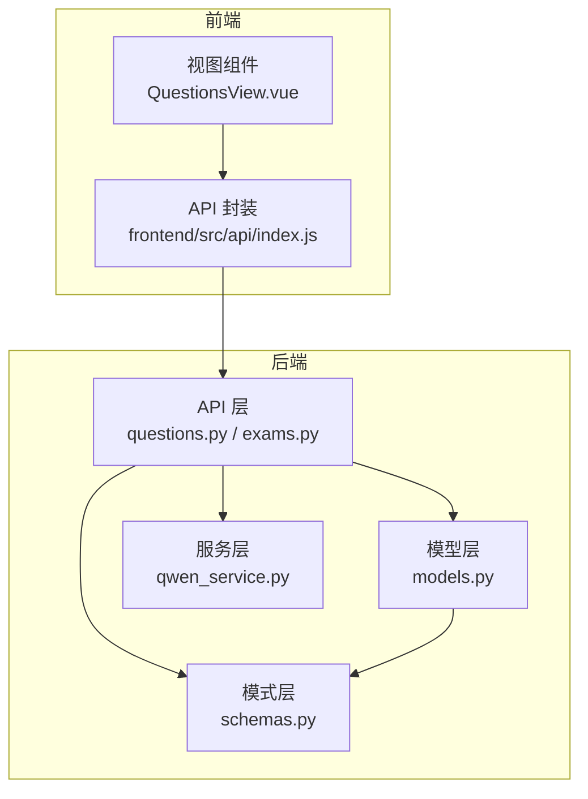
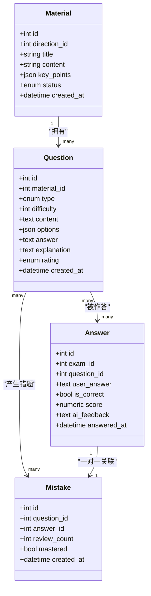
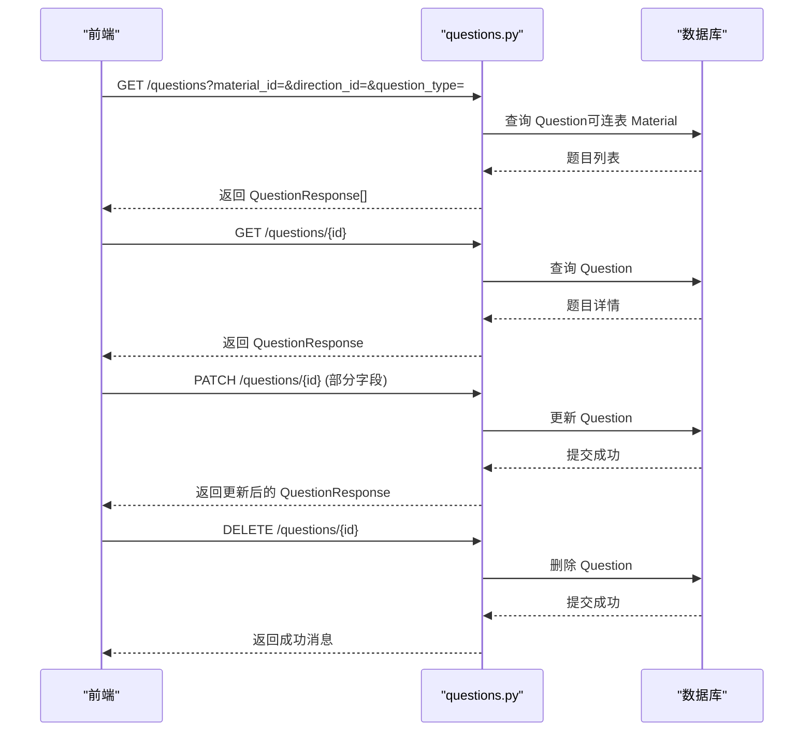
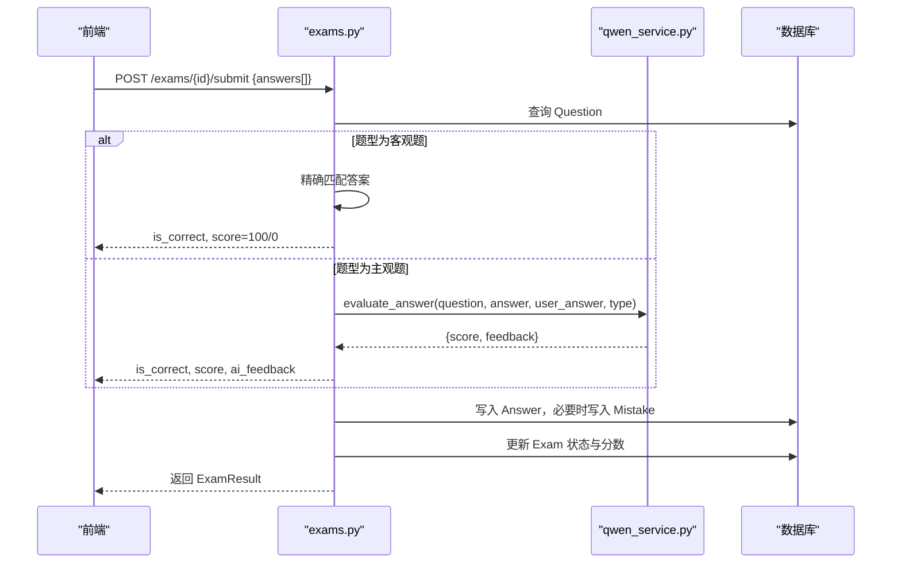
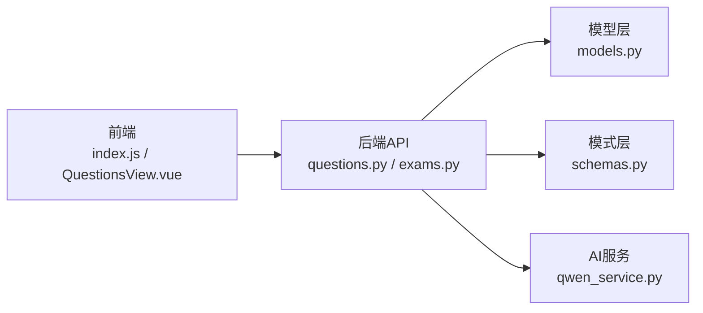

# 题目实体

<cite>
**本文引用的文件**
- [models.py](file://backend/app/models/models.py)
- [schemas.py](file://backend/app/schemas/schemas.py)
- [questions.py](file://backend/app/api/questions.py)
- [exams.py](file://backend/app/api/exams.py)
- [qwen_service.py](file://backend/app/services/qwen_service.py)
- [index.js](file://frontend/src/api/index.js)
- [QuestionsView.vue](file://frontend/src/views/QuestionsView.vue)
- [test_api.py](file://backend/test_api.py)
</cite>

## 目录
1. [简介](#简介)
2. [项目结构](#项目结构)
3. [核心组件](#核心组件)
4. [架构总览](#架构总览)
5. [详细组件分析](#详细组件分析)
6. [依赖分析](#依赖分析)
7. [性能考虑](#性能考虑)
8. [故障排除指南](#故障排除指南)
9. [结论](#结论)
10. [附录](#附录)

## 简介
本文件围绕“题目实体”进行系统化说明，覆盖以下方面：
- 题目字段定义与含义
- 题型枚举（QuestionType）及应用场景
- 难度等级与评分机制
- 题目创建、查询、评分等核心功能的实现路径
- 题目与资料、答题记录、错题之间的关联关系

## 项目结构
后端采用分层设计：模型层（ORM）、模式层（Pydantic）、API 层（FastAPI）、服务层（业务逻辑），前端通过 Axios 封装调用后端接口。

图表来源
- [models.py](file://backend/app/models/models.py#L95-L114)
- [schemas.py](file://backend/app/schemas/schemas.py#L60-L100)
- [questions.py](file://backend/app/api/questions.py#L1-L90)
- [exams.py](file://backend/app/api/exams.py#L16-L216)
- [qwen_service.py](file://backend/app/services/qwen_service.py#L81-L155)
- [index.js](file://frontend/src/api/index.js#L26-L33)
- [QuestionsView.vue](file://frontend/src/views/QuestionsView.vue#L222-L272)

章节来源
- [models.py](file://backend/app/models/models.py#L95-L114)
- [schemas.py](file://backend/app/schemas/schemas.py#L60-L100)
- [questions.py](file://backend/app/api/questions.py#L1-L90)
- [exams.py](file://backend/app/api/exams.py#L16-L216)
- [qwen_service.py](file://backend/app/services/qwen_service.py#L81-L155)
- [index.js](file://frontend/src/api/index.js#L26-L33)
- [QuestionsView.vue](file://frontend/src/views/QuestionsView.vue#L222-L272)

## 核心组件
- 题目模型（Question）
  - 字段：id、material_id、type、difficulty、content、options、answer、explanation、rating、created_at
  - 关系：属于某份资料；可产生多条答题记录；可关联错题
- 题型枚举（QuestionType）
  - single_choice、multi_choice、true_false、short_answer
- 评分机制
  - 客观题：精确匹配，100 分或 0 分
  - 主观题：由 AI 服务评分（0-100），≥60 视为正确
- 难度等级
  - 1-5 的整数，用于题目筛选与组卷

章节来源
- [models.py](file://backend/app/models/models.py#L95-L114)
- [models.py](file://backend/app/models/models.py#L16-L21)
- [exams.py](file://backend/app/api/exams.py#L154-L169)
- [qwen_service.py](file://backend/app/services/qwen_service.py#L115-L151)

## 架构总览
题目实体贯穿“资料 → 题目 → 测验答题 → 错题”的完整学习闭环。

图表来源
- [models.py](file://backend/app/models/models.py#L78-L93)
- [models.py](file://backend/app/models/models.py#L95-L114)
- [models.py](file://backend/app/models/models.py#L136-L152)
- [models.py](file://backend/app/models/models.py#L155-L168)

## 详细组件分析

### 题目字段定义与用途
- id：自增主键，唯一标识题目
- material_id：外键，指向资料（决定题目来源与所属方向）
- type：题型枚举，决定评分策略与前端渲染
- difficulty：1-5 整数，影响组卷与筛选
- content：题目正文
- options：选择题选项（JSON 数组），判断题固定为["正确","错误"]
- answer：标准答案（字符串）
- explanation：答案解析
- rating：用户对题目的评价（good/bad）
- created_at：创建时间

章节来源
- [models.py](file://backend/app/models/models.py#L95-L114)
- [schemas.py](file://backend/app/schemas/schemas.py#L62-L84)

### 题型枚举与应用场景
- single_choice（单选）
  - 特点：4 个选项，唯一正确答案
  - 应用：标准化选择题，客观评分
- multi_choice（多选）
  - 特点：多个正确选项，需满足全对才得分
  - 应用：综合类选择题，强调知识点覆盖面
- true_false（判断）
  - 特点：仅“正确/错误”两个选项
  - 应用：概念辨析与事实判断
- short_answer（简答）
  - 特点：主观题，由 AI 评分
  - 应用：知识点应用与表达能力评估

章节来源
- [models.py](file://backend/app/models/models.py#L16-L21)
- [exams.py](file://backend/app/api/exams.py#L154-L169)
- [qwen_service.py](file://backend/app/services/qwen_service.py#L115-L151)

### 难度等级与评分机制
- 难度等级
  - 1-5 的整数，默认值为 3
  - 用于题目筛选与组卷随机化
- 评分机制
  - 客观题（单选/多选/判断）：严格比对答案，100 或 0 分
  - 主观题（简答）：AI 评分，返回分数（0-100）与反馈，≥60 认为正确
  - 测验完成后计算平均分，并按需转换为等级（A/B/C/D）

章节来源
- [models.py](file://backend/app/models/models.py#L102-L102)
- [exams.py](file://backend/app/api/exams.py#L154-L169)
- [exams.py](file://backend/app/api/exams.py#L17-L26)
- [qwen_service.py](file://backend/app/services/qwen_service.py#L115-L151)

### 题目创建、查询、评分与更新流程

#### 题目创建与查询（后端 API）
- 查询题目列表：支持按资料 ID、学习方向、题型过滤
- 获取单题详情：按 ID 查询
- 更新题目：按传入字段增量更新
- 删除题目：按 ID 删除
- 评价题目：更新 rating 字段

图表来源
- [questions.py](file://backend/app/api/questions.py#L11-L31)
- [questions.py](file://backend/app/api/questions.py#L33-L39)
- [questions.py](file://backend/app/api/questions.py#L42-L61)
- [questions.py](file://backend/app/api/questions.py#L80-L89)

章节来源
- [questions.py](file://backend/app/api/questions.py#L11-L31)
- [questions.py](file://backend/app/api/questions.py#L33-L39)
- [questions.py](file://backend/app/api/questions.py#L42-L61)
- [questions.py](file://backend/app/api/questions.py#L80-L89)

#### 题目评分（测验提交）
- 客观题：严格匹配答案，100 或 0 分
- 主观题：调用 AI 服务进行评分，返回分数与反馈，≥60 正确
- 保存答题记录，并在错误时写入错题

图表来源
- [exams.py](file://backend/app/api/exams.py#L127-L216)
- [exams.py](file://backend/app/api/exams.py#L154-L169)
- [qwen_service.py](file://backend/app/services/qwen_service.py#L115-L151)

章节来源
- [exams.py](file://backend/app/api/exams.py#L127-L216)
- [exams.py](file://backend/app/api/exams.py#L154-L169)
- [qwen_service.py](file://backend/app/services/qwen_service.py#L115-L151)

### 题目与资料、答题记录、错题的关系
- 题目与资料：一对多关系，题目来源于资料
- 题目与答题记录：一对多关系，一次作答对应一条记录
- 题目与错题：一对多关系，错误作答触发错题记录
- 答题记录与错题：一对一关系，每条答题记录仅对应一个错题

章节来源
- [models.py](file://backend/app/models/models.py#L78-L93)
- [models.py](file://backend/app/models/models.py#L95-L114)
- [models.py](file://backend/app/models/models.py#L136-L152)
- [models.py](file://backend/app/models/models.py#L155-L168)

### 前端集成与使用示例
- 前端通过封装的 questionsApi 调用后端接口
- 题目列表页支持按方向、资料、题型筛选
- 支持编辑、删除、评价题目

章节来源
- [index.js](file://frontend/src/api/index.js#L26-L33)
- [QuestionsView.vue](file://frontend/src/views/QuestionsView.vue#L222-L272)

## 依赖分析
- 后端模块耦合
  - API 层依赖模型层与模式层，负责路由与业务编排
  - 评分逻辑依赖 AI 服务层
  - 前端通过统一 API 封装访问后端
- 外部依赖
  - AI 服务：用于主观题评分与题目生成
  - 数据库：SQLAlchemy ORM

图表来源
- [index.js](file://frontend/src/api/index.js#L26-L33)
- [QuestionsView.vue](file://frontend/src/views/QuestionsView.vue#L222-L272)
- [questions.py](file://backend/app/api/questions.py#L1-L90)
- [exams.py](file://backend/app/api/exams.py#L16-L216)
- [models.py](file://backend/app/models/models.py#L95-L114)
- [schemas.py](file://backend/app/schemas/schemas.py#L60-L100)
- [qwen_service.py](file://backend/app/services/qwen_service.py#L81-L155)

章节来源
- [index.js](file://frontend/src/api/index.js#L26-L33)
- [QuestionsView.vue](file://frontend/src/views/QuestionsView.vue#L222-L272)
- [questions.py](file://backend/app/api/questions.py#L1-L90)
- [exams.py](file://backend/app/api/exams.py#L16-L216)
- [models.py](file://backend/app/models/models.py#L95-L114)
- [schemas.py](file://backend/app/schemas/schemas.py#L60-L100)
- [qwen_service.py](file://backend/app/services/qwen_service.py#L81-L155)

## 性能考虑
- 题目查询支持多条件过滤，建议在高频查询字段上建立索引（如 material_id、type）
- 主观题评分依赖外部 AI 服务，建议设置合理的超时与重试策略
- 批量提交测验时注意数据库事务与 flush 策略，避免重复写入

## 故障排除指南
- 题目不存在
  - 现象：查询或更新时返回 404
  - 排查：确认 ID 是否正确、资源是否已被删除
- 题目评价失败
  - 现象：更新 rating 无效
  - 排查：确认题型与 rating 枚举值是否合法
- 主观题评分异常
  - 现象：返回空结果或默认分数
  - 排查：检查 AI 服务可用性与返回格式

章节来源
- [questions.py](file://backend/app/api/questions.py#L37-L38)
- [questions.py](file://backend/app/api/questions.py#L70-L72)
- [qwen_service.py](file://backend/app/services/qwen_service.py#L143-L151)

## 结论
题目实体是系统的核心数据模型，围绕其构建了“资料 → 题目 → 测验答题 → 错题”的完整学习闭环。通过明确的字段定义、清晰的题型与评分策略、以及前后端协同的 API 设计，实现了高效的学习与测评体验。

## 附录

### 题目字段与模式对照
- QuestionBase/QuestionResponse：定义了题目的输入输出结构
- QuestionCreate：创建时需提供 material_id 与题干信息
- QuestionUpdate：支持部分字段更新

章节来源
- [schemas.py](file://backend/app/schemas/schemas.py#L62-L100)

### 题目生成与评分测试
- 后端提供测试脚本，演示从知识点到题目的生成流程
- 可作为本地验证与集成测试的参考

章节来源
- [test_api.py](file://backend/test_api.py#L1-L30)