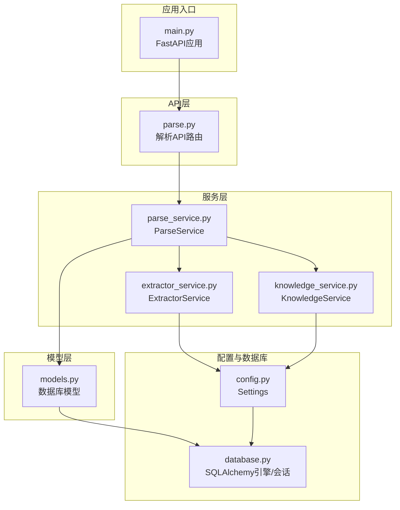
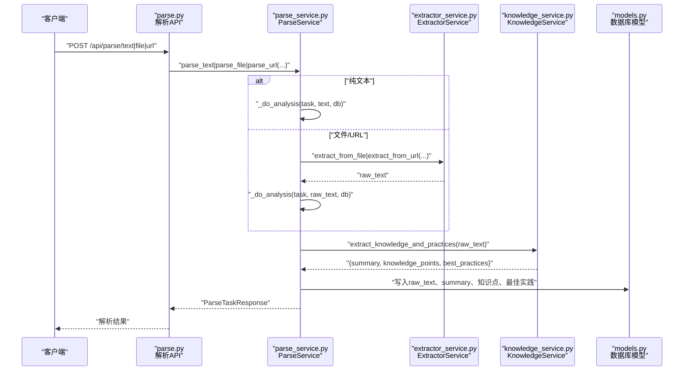
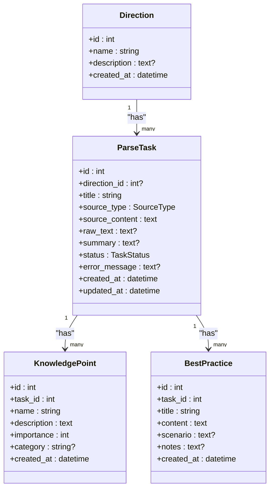
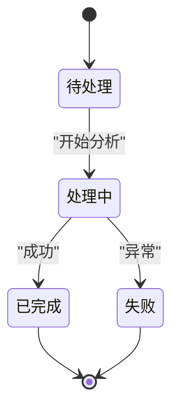
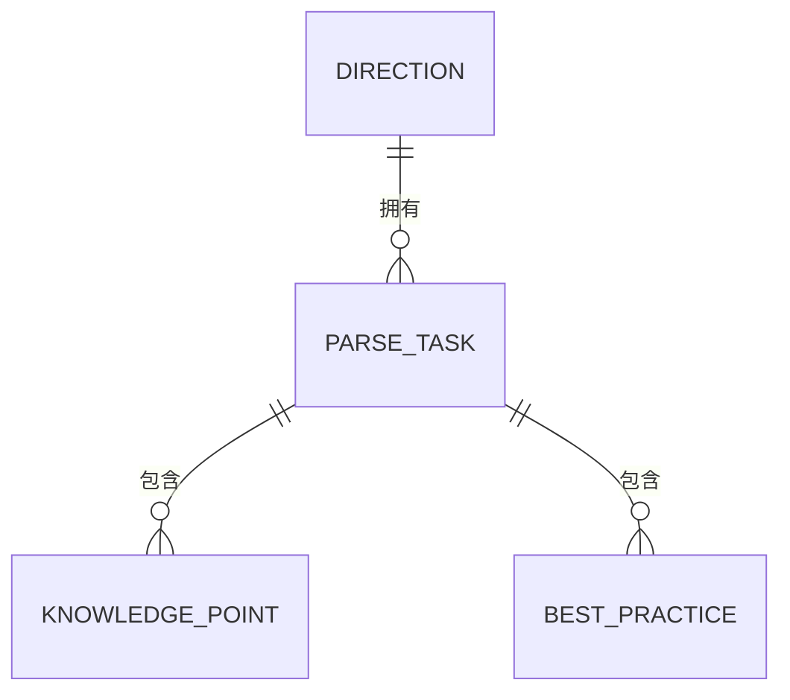
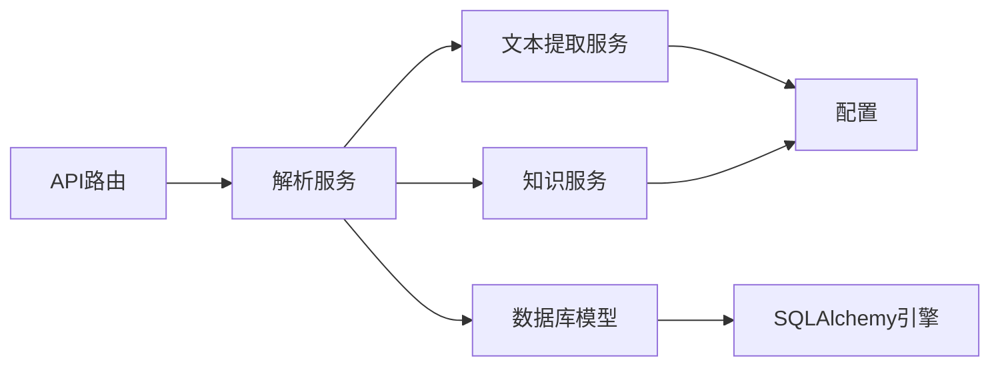

# 知识解析实体

<cite>
**本文引用的文件**
- [backend/app/models/models.py](file://backend/app/models/models.py)
- [backend/app/schemas/schemas.py](file://backend/app/schemas/schemas.py)
- [backend/app/api/parse.py](file://backend/app/api/parse.py)
- [backend/app/services/parse_service.py](file://backend/app/services/parse_service.py)
- [backend/app/services/extractor_service.py](file://backend/app/services/extractor_service.py)
- [backend/app/services/knowledge_service.py](file://backend/app/services/knowledge_service.py)
- [backend/app/core/database.py](file://backend/app/core/database.py)
- [backend/app/core/config.py](file://backend/app/core/config.py)
- [backend/app/main.py](file://backend/app/main.py)
- [backend/pyproject.toml](file://backend/pyproject.toml)
</cite>

## 目录
1. [简介](#简介)
2. [项目结构](#项目结构)
3. [核心组件](#核心组件)
4. [架构总览](#架构总览)
5. [详细组件分析](#详细组件分析)
6. [依赖分析](#依赖分析)
7. [性能考虑](#性能考虑)
8. [故障排查指南](#故障排查指南)
9. [结论](#结论)
10. [附录](#附录)

## 简介
本设计文档聚焦“知识解析实体”，围绕解析任务(ParseTask)、知识点(KnowledgePoint)、最佳实践(BestPractice)三大核心实体，阐述其在AI内容解析与知识提取中的作用与协作方式。文档详细说明任务状态管理、解析进度跟踪、结果存储机制；解释知识点的重要程度分级与分类标签系统；并提供知识解析流程的数据流转与实体关系图，帮助开发者与产品人员快速理解与使用。

## 项目结构
后端采用FastAPI + SQLAlchemy架构，按职责分层组织：API路由层负责请求入口与响应封装；服务层协调文本提取与大模型分析；模型层定义数据库实体与关系；配置与数据库层提供运行时参数与连接管理。

图表来源
- [backend/app/api/parse.py](file://backend/app/api/parse.py#L1-L77)
- [backend/app/services/parse_service.py](file://backend/app/services/parse_service.py#L1-L163)
- [backend/app/services/extractor_service.py](file://backend/app/services/extractor_service.py#L1-L123)
- [backend/app/services/knowledge_service.py](file://backend/app/services/knowledge_service.py#L1-L114)
- [backend/app/models/models.py](file://backend/app/models/models.py#L1-L223)
- [backend/app/core/config.py](file://backend/app/core/config.py#L1-L34)
- [backend/app/core/database.py](file://backend/app/core/database.py#L1-L38)
- [backend/app/main.py](file://backend/app/main.py#L1-L66)

章节来源
- [backend/app/main.py](file://backend/app/main.py#L1-L66)
- [backend/app/core/database.py](file://backend/app/core/database.py#L1-L38)
- [backend/app/core/config.py](file://backend/app/core/config.py#L1-L34)
- [backend/pyproject.toml](file://backend/pyproject.toml#L1-L29)

## 核心组件
- 解析任务(ParseTask)
  - 记录一次知识解析的元数据与状态，支持三种来源：纯文本、文件、URL。
  - 关键字段：标题、来源类型、原始内容、抽取后的纯文本、摘要、状态、错误信息、创建/更新时间。
  - 关联实体：一对多关联知识点与最佳实践，支持级联删除。
- 知识点(KnowledgePoint)
  - 表示从内容中提炼出的核心知识点，包含名称、描述、重要程度(1-5)、分类标签。
  - 与解析任务建立外键关联，形成“一个任务可产出多个知识点”的关系。
- 最佳实践(BestPractice)
  - 表示从内容中总结的最佳实践建议，包含标题、内容、适用场景、注意事项。
  - 同样与解析任务建立外键关联，形成“一个任务可产出多条实践”的关系。

章节来源
- [backend/app/models/models.py](file://backend/app/models/models.py#L171-L223)
- [backend/app/schemas/schemas.py](file://backend/app/schemas/schemas.py#L192-L265)

## 架构总览
知识解析流程从API入口开始，根据来源类型选择对应的解析路径：纯文本直接进入分析，文件与URL先经文本提取器抽取为纯文本，再交由知识服务进行大模型分析，最终将结果持久化到数据库，并通过响应模式返回给前端。

图表来源
- [backend/app/api/parse.py](file://backend/app/api/parse.py#L17-L77)
- [backend/app/services/parse_service.py](file://backend/app/services/parse_service.py#L18-L132)
- [backend/app/services/extractor_service.py](file://backend/app/services/extractor_service.py#L30-L118)
- [backend/app/services/knowledge_service.py](file://backend/app/services/knowledge_service.py#L51-L109)
- [backend/app/models/models.py](file://backend/app/models/models.py#L171-L223)

## 详细组件分析

### 解析任务实体(PARSE_TASK)
- 设计要点
  - 统一承载解析来源与状态，便于追踪与审计。
  - 与知识点、最佳实践建立一对多关系，支持任务完成后一次性查询。
  - 使用枚举类型控制来源类型与任务状态，保证数据一致性。
- 字段与约束
  - 来源类型：TEXT/FILE/URL
  - 任务状态：PENDING/PROCESSING/COMPLETED/FAILED
  - 时间戳：创建时间与更新时间，用于排序与统计
- 关系
  - 与学习方向(可空)：支持按方向归档
  - 与知识点、最佳实践：级联删除，确保任务清理时数据完整性

图表来源
- [backend/app/models/models.py](file://backend/app/models/models.py#L55-L61)
- [backend/app/models/models.py](file://backend/app/models/models.py#L171-L223)

章节来源
- [backend/app/models/models.py](file://backend/app/models/models.py#L171-L190)

### 知识点实体(KNOWLEDGE_POINT)
- 设计要点
  - 重要程度(1-5)用于后续筛选与排序，便于突出重点内容。
  - 分类标签用于知识聚合与检索，支持多维度知识管理。
  - 描述字段提供结构化知识的详细说明，利于二次加工与展示。
- 关系
  - 与解析任务建立外键关联，保证任务生命周期内知识点的可追溯性。

章节来源
- [backend/app/models/models.py](file://backend/app/models/models.py#L193-L207)

### 最佳实践实体(BEST_PRACTICE)
- 设计要点
  - 场景与注意事项帮助用户在实际应用中正确使用建议。
  - 标准化结构便于前端展示与用户操作。
- 关系
  - 同样与解析任务建立外键关联，实现与知识点一致的生命周期管理。

章节来源
- [backend/app/models/models.py](file://backend/app/models/models.py#L209-L223)

### 状态管理与进度跟踪
- 任务状态机
  - 初始：PENDING（等待执行）
  - 执行中：PROCESSING（已写入原始文本并开始分析）
  - 结束：COMPLETED（成功完成）、FAILED（异常终止）
- 进度与结果
  - 原始文本(raw_text)与摘要(summary)在分析完成后落库
  - 知识点与最佳实践批量插入，完成后刷新任务状态并更新时间戳

图表来源
- [backend/app/models/models.py](file://backend/app/models/models.py#L55-L61)
- [backend/app/services/parse_service.py](file://backend/app/services/parse_service.py#L18-L56)

章节来源
- [backend/app/services/parse_service.py](file://backend/app/services/parse_service.py#L18-L56)

### 数据流与实体关系图
- 输入来源
  - 纯文本：直接进入分析
  - 文件：先抽取为纯文本，再进入分析
  - URL：抓取正文为纯文本，再进入分析
- 输出结果
  - 任务详情包含：标题、来源类型、摘要、状态、错误信息、创建/更新时间、以及完整知识点与最佳实践列表
- 关系图

图表来源
- [backend/app/models/models.py](file://backend/app/models/models.py#L63-L76)
- [backend/app/models/models.py](file://backend/app/models/models.py#L171-L191)

## 依赖分析
- 组件耦合
  - API层仅依赖服务层接口，解耦业务逻辑与HTTP协议
  - 服务层内部通过依赖注入使用文本提取与知识服务，保持单一职责
  - 模型层通过关系映射实现实体间的一致性约束
- 外部依赖
  - 文本提取：PDF/DOCX/MD/TXT解析依赖第三方库
  - 网页抓取：BeautifulSoup + httpx
  - 大模型：通义千问API，需配置密钥与模型参数
- 配置与数据库
  - 配置集中管理，支持SQLite/MySQL/PG等不同后端
  - 数据库会话通过依赖注入提供，确保线程安全与资源释放

图表来源
- [backend/app/api/parse.py](file://backend/app/api/parse.py#L1-L77)
- [backend/app/services/parse_service.py](file://backend/app/services/parse_service.py#L1-L163)
- [backend/app/services/extractor_service.py](file://backend/app/services/extractor_service.py#L1-L123)
- [backend/app/services/knowledge_service.py](file://backend/app/services/knowledge_service.py#L1-L114)
- [backend/app/core/config.py](file://backend/app/core/config.py#L1-L34)
- [backend/app/core/database.py](file://backend/app/core/database.py#L1-L38)

章节来源
- [backend/app/core/config.py](file://backend/app/core/config.py#L16-L24)
- [backend/app/core/database.py](file://backend/app/core/database.py#L20-L38)
- [backend/pyproject.toml](file://backend/pyproject.toml#L7-L22)

## 性能考虑
- 异步处理
  - 文本提取与大模型调用均采用异步客户端，提升并发吞吐
- I/O优化
  - 文件解析使用临时文件策略，避免内存峰值过高
  - 网页抓取设置超时与跟随重定向，提高稳定性
- 数据库优化
  - 使用批量插入保存知识点与最佳实践，减少事务开销
  - 通过索引与分页查询任务列表，避免全表扫描
- 可靠性
  - 任务状态机与错误回滚，保证异常情况下的数据一致性

## 故障排查指南
- 常见问题
  - 文件格式不支持：检查扩展名是否在允许列表内
  - 文件过大：确认文件大小不超过配置的最大值
  - URL抓取失败：检查网络连通性与目标站点结构
  - 大模型返回非JSON：查看日志中的原始内容片段，修正提示词或格式要求
  - 任务状态卡在待处理：确认任务是否被正确创建与调度
- 排查步骤
  - 查看API返回的任务详情，确认状态与错误信息
  - 在数据库中核对ParseTask、KnowledgePoint、BestPractice的对应关系
  - 检查配置项：API密钥、模型名称、基础URL、上传目录与文件大小限制
  - 观察服务日志，定位异常发生的具体阶段

章节来源
- [backend/app/services/extractor_service.py](file://backend/app/services/extractor_service.py#L23-L28)
- [backend/app/services/extractor_service.py](file://backend/app/services/extractor_service.py#L35-L36)
- [backend/app/services/knowledge_service.py](file://backend/app/services/knowledge_service.py#L45-L49)
- [backend/app/services/parse_service.py](file://backend/app/services/parse_service.py#L72-L78)

## 结论
本文档系统性地梳理了知识解析实体的设计与实现，明确了解析任务、知识点与最佳实践三者的职责边界与协作关系。通过状态机与进度跟踪机制，实现了从输入到输出的闭环管理；通过重要程度分级与分类标签体系，为后续的知识检索与个性化推荐奠定了基础。整体架构清晰、职责分离、易于扩展，适合在多来源、多形态的学习内容解析场景中落地应用。

## 附录
- API端点概览
  - POST /api/parse/text：解析纯文本
  - POST /api/parse/file：解析上传文件
  - POST /api/parse/url：解析网页URL
  - GET /api/parse/tasks：获取任务列表
  - GET /api/parse/tasks/{task_id}：获取任务详情
  - DELETE /api/parse/tasks/{task_id}：删除任务
- 关键配置项
  - qwen_api_key：通义千问API密钥
  - qwen_model：模型名称
  - qwen_base_url：API基础地址
  - upload_dir：上传目录
  - max_file_size：文件大小上限
  - database_url：数据库连接串

章节来源
- [backend/app/api/parse.py](file://backend/app/api/parse.py#L17-L77)
- [backend/app/core/config.py](file://backend/app/core/config.py#L16-L24)
- [backend/app/main.py](file://backend/app/main.py#L36-L43)