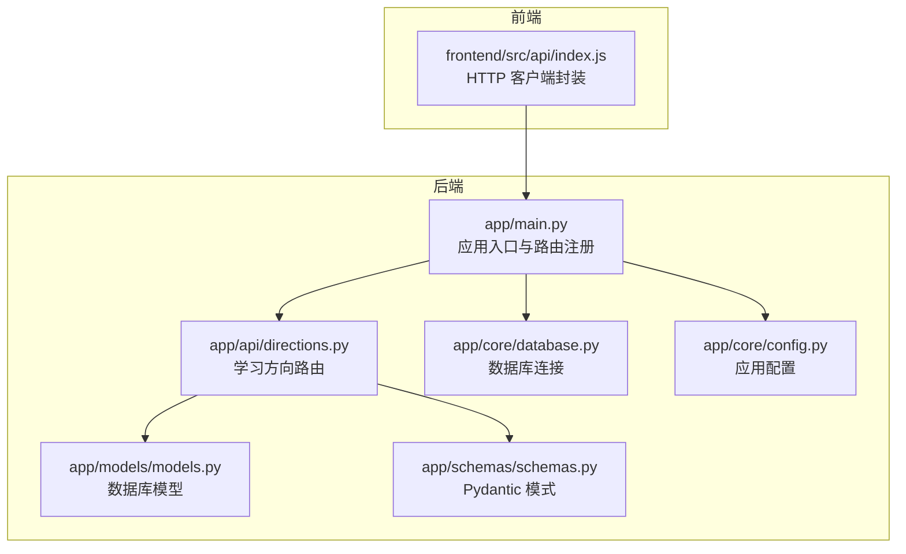
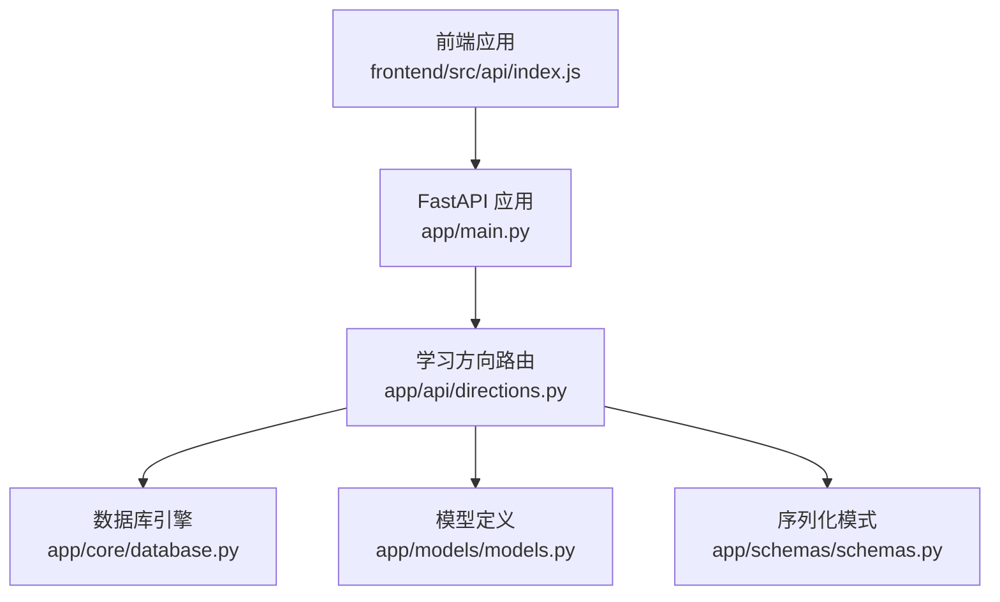
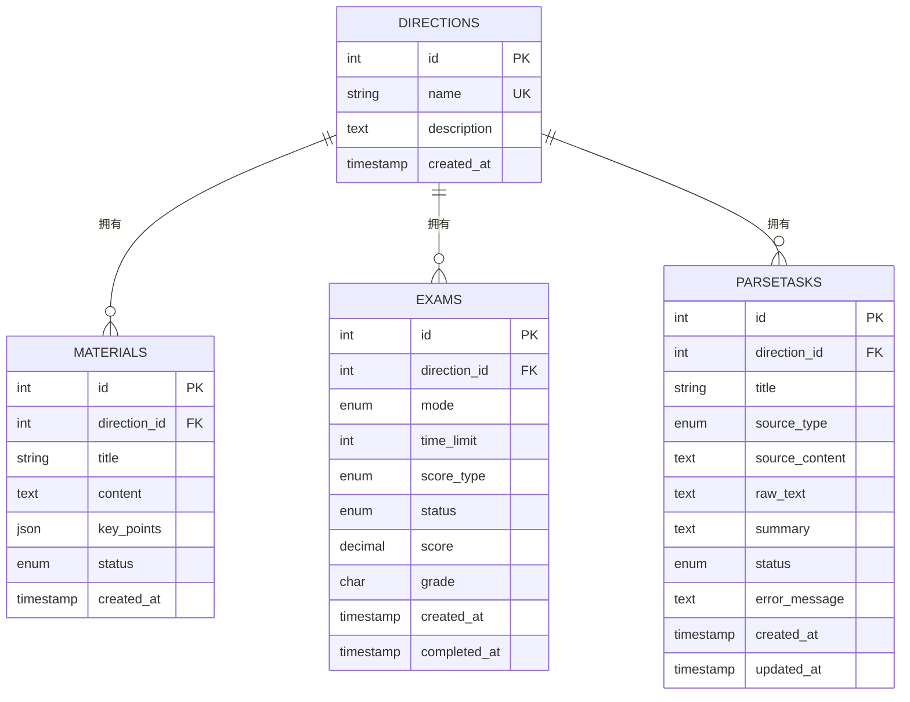
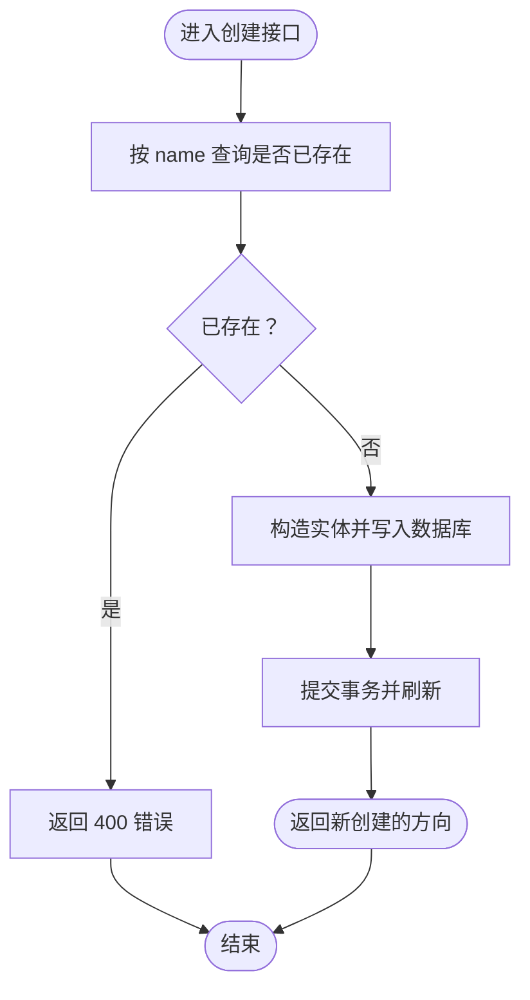
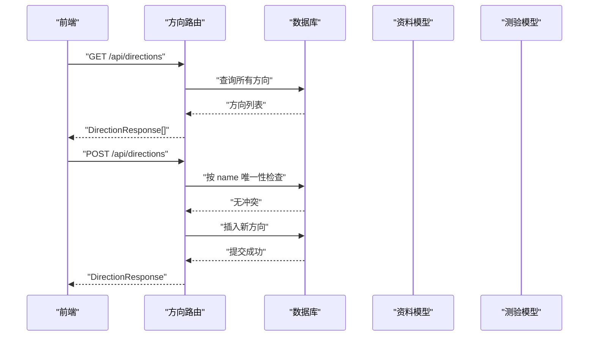
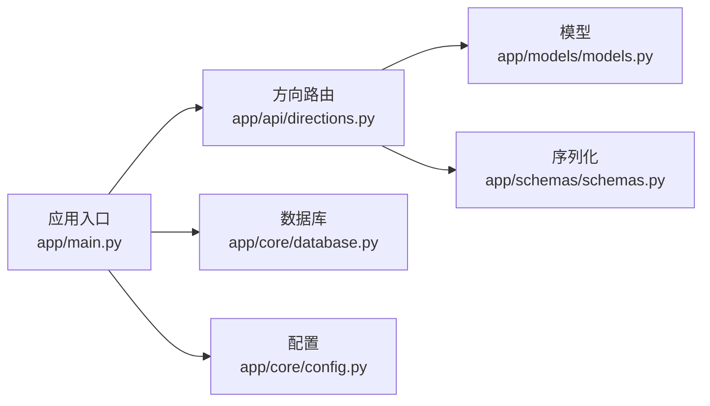

# 学习方向管理

<cite>
**本文引用的文件**
- [backend/app/api/directions.py](file://backend/app/api/directions.py)
- [backend/app/models/models.py](file://backend/app/models/models.py)
- [backend/app/schemas/schemas.py](file://backend/app/schemas/schemas.py)
- [backend/app/main.py](file://backend/app/main.py)
- [backend/app/core/database.py](file://backend/app/core/database.py)
- [backend/app/core/config.py](file://backend/app/core/config.py)
- [backend/app/api/__init__.py](file://backend/app/api/__init__.py)
- [frontend/src/api/index.js](file://frontend/src/api/index.js)
</cite>

## 目录
1. [简介](#简介)
2. [项目结构](#项目结构)
3. [核心组件](#核心组件)
4. [架构总览](#架构总览)
5. [详细组件分析](#详细组件分析)
6. [依赖关系分析](#依赖关系分析)
7. [性能考虑](#性能考虑)
8. [故障排查指南](#故障排查指南)
9. [结论](#结论)
10. [附录](#附录)

## 简介
本章节概述“学习方向管理”的概念、业务价值与整体定位。学习方向是个人学习体系中的顶层分类维度，用于组织资料、题目与测验，形成可追踪的学习路径。其核心价值在于：
- 统一学习主题边界：以方向为单位聚合资料与题目，便于检索与复用
- 支撑上层能力：为资料解析、题目生成、智能测验与错题管理提供上下文
- 可扩展性：支持未来扩展到课程编排、学习计划与进度跟踪

## 项目结构
后端采用 FastAPI + SQLAlchemy 架构，前端通过 axios 访问统一的 /api 前缀。学习方向模块位于后端 API 层，数据模型与序列化在 models 与 schemas 中定义，应用入口在 main.py 中注册路由。

图表来源
- [backend/app/main.py](file://backend/app/main.py#L1-L66)
- [backend/app/api/directions.py](file://backend/app/api/directions.py#L1-L51)
- [backend/app/models/models.py](file://backend/app/models/models.py#L63-L76)
- [backend/app/schemas/schemas.py](file://backend/app/schemas/schemas.py#L17-L34)
- [backend/app/core/database.py](file://backend/app/core/database.py#L1-L38)
- [backend/app/core/config.py](file://backend/app/core/config.py#L1-L34)
- [frontend/src/api/index.js](file://frontend/src/api/index.js#L1-L52)

章节来源
- [backend/app/main.py](file://backend/app/main.py#L1-L66)
- [backend/app/api/__init__.py](file://backend/app/api/__init__.py#L1-L17)

## 核心组件
- 路由器与控制器
  - 路由前缀：/api/directions
  - 主要接口：GET /directions、POST /directions、GET /directions/{direction_id}、DELETE /directions/{direction_id}
- 数据模型
  - 表名：directions
  - 字段：id、name（唯一）、description、created_at
  - 关系：与 Material、Exam、ParseTask 的一对多关系
- 序列化模式
  - DirectionBase：name、description
  - DirectionCreate：继承自 DirectionBase
  - DirectionResponse：在基础字段外增加 id、created_at，并启用 from_attributes

章节来源
- [backend/app/api/directions.py](file://backend/app/api/directions.py#L8-L51)
- [backend/app/models/models.py](file://backend/app/models/models.py#L63-L76)
- [backend/app/schemas/schemas.py](file://backend/app/schemas/schemas.py#L17-L34)

## 架构总览
学习方向管理在系统中的位置如下：

图表来源
- [frontend/src/api/index.js](file://frontend/src/api/index.js#L11-L16)
- [backend/app/main.py](file://backend/app/main.py#L37-L42)
- [backend/app/api/directions.py](file://backend/app/api/directions.py#L1-L51)
- [backend/app/core/database.py](file://backend/app/core/database.py#L20-L38)
- [backend/app/models/models.py](file://backend/app/models/models.py#L63-L76)
- [backend/app/schemas/schemas.py](file://backend/app/schemas/schemas.py#L17-L34)

## 详细组件分析

### 数据模型设计
- 表：directions
  - 字段与约束
    - id：主键，自增整数
    - name：字符串，非空且唯一
    - description：文本，可空
    - created_at：时间戳，默认当前时间
  - 关系映射
    - 与 Material：一对多（反向：direction.materials）
    - 与 Exam：一对多（反向：direction.exams）
    - 与 ParseTask：一对多（反向：direction.parse_tasks）

图表来源
- [backend/app/models/models.py](file://backend/app/models/models.py#L63-L76)
- [backend/app/models/models.py](file://backend/app/models/models.py#L78-L93)
- [backend/app/models/models.py](file://backend/app/models/models.py#L116-L134)
- [backend/app/models/models.py](file://backend/app/models/models.py#L171-L191)

章节来源
- [backend/app/models/models.py](file://backend/app/models/models.py#L63-L76)

### API 接口规范
- 获取学习方向列表
  - 方法与路径：GET /api/directions
  - 返回：DirectionResponse 数组
- 创建学习方向
  - 方法与路径：POST /api/directions
  - 请求体：DirectionCreate
  - 重复检查：按 name 进行唯一性校验，若存在则返回 400
  - 返回：DirectionResponse
- 获取学习方向详情
  - 方法与路径：GET /api/directions/{direction_id}
  - 参数：path direction_id:int
  - 返回：DirectionResponse
  - 未找到：返回 404
- 删除学习方向
  - 方法与路径：DELETE /api/directions/{direction_id}
  - 参数：path direction_id:int
  - 返回：{"message": "删除成功"}
  - 未找到：返回 404

章节来源
- [backend/app/api/directions.py](file://backend/app/api/directions.py#L11-L51)
- [backend/app/schemas/schemas.py](file://backend/app/schemas/schemas.py#L17-L34)

### 业务逻辑实现
- 重复检查
  - 在创建接口中，查询同名方向是否存在；若存在则抛出 HTTP 400
- 错误处理
  - 查询不到目标方向时，返回 HTTP 404
- 权限控制
  - 当前实现未包含鉴权逻辑，建议在生产环境引入 JWT 或基于角色的访问控制（RBAC）

图表来源
- [backend/app/api/directions.py](file://backend/app/api/directions.py#L17-L29)

章节来源
- [backend/app/api/directions.py](file://backend/app/api/directions.py#L17-L29)

### 与其它模块的关联关系
- 与资料管理（Material）
  - 方向与资料是一对多关系，资料通过 direction_id 关联方向
  - 前端可通过方向 ID 过滤资料列表
- 与题目生成（Question）
  - 题目来源于资料，间接受方向影响；方向为资料与题目的上下文边界
- 与测验（Exam）
  - 测验直接关联方向，便于按方向组织测验与统计

图表来源
- [frontend/src/api/index.js](file://frontend/src/api/index.js#L11-L16)
- [backend/app/api/directions.py](file://backend/app/api/directions.py#L11-L29)
- [backend/app/models/models.py](file://backend/app/models/models.py#L78-L93)
- [backend/app/models/models.py](file://backend/app/models/models.py#L116-L134)

章节来源
- [frontend/src/api/index.js](file://frontend/src/api/index.js#L11-L16)
- [backend/app/models/models.py](file://backend/app/models/models.py#L78-L93)
- [backend/app/models/models.py](file://backend/app/models/models.py#L116-L134)

### 使用场景与示例
- 场景一：新增一个“编程”方向
  - 前端调用 POST /api/directions，传入 { name: "编程", description: "后端开发入门" }
  - 后端进行重复检查，成功后返回新方向的完整信息
- 场景二：查看所有方向并筛选资料
  - 前端先 GET /api/directions 获取方向列表
  - 再调用 GET /api/materials?direction_id={id} 获取对应方向下的资料
- 场景三：删除不再使用的方向
  - 前端调用 DELETE /api/directions/{id}
  - 若方向下仍有资料或测验，需在业务层面协调删除策略（当前接口仅删除方向本身）

章节来源
- [frontend/src/api/index.js](file://frontend/src/api/index.js#L11-L16)
- [backend/app/api/directions.py](file://backend/app/api/directions.py#L11-L51)

## 依赖关系分析
- 模块耦合
  - 路由层仅依赖模型与序列化，保持低耦合
  - 数据库连接通过依赖注入提供 Session，避免全局状态
- 外部依赖
  - FastAPI、SQLAlchemy、Pydantic、dotenv 等
- 可能的循环依赖
  - 当前结构清晰，未见循环导入迹象

图表来源
- [backend/app/api/directions.py](file://backend/app/api/directions.py#L1-L51)
- [backend/app/models/models.py](file://backend/app/models/models.py#L63-L76)
- [backend/app/schemas/schemas.py](file://backend/app/schemas/schemas.py#L17-L34)
- [backend/app/main.py](file://backend/app/main.py#L37-L42)
- [backend/app/core/database.py](file://backend/app/core/database.py#L31-L38)
- [backend/app/core/config.py](file://backend/app/core/config.py#L30-L34)

章节来源
- [backend/app/api/directions.py](file://backend/app/api/directions.py#L1-L51)
- [backend/app/main.py](file://backend/app/main.py#L37-L42)
- [backend/app/core/database.py](file://backend/app/core/database.py#L31-L38)
- [backend/app/core/config.py](file://backend/app/core/config.py#L30-L34)

## 性能考虑
- 数据库索引
  - name 字段已声明唯一，建议确保数据库层具备唯一约束与索引
- 查询优化
  - 列表接口直接全表扫描，建议在方向数量增长后增加分页与排序参数
- 并发与事务
  - 创建接口在高并发下可能触发重复检查竞争，建议在数据库层利用唯一约束并捕获异常
- 前端请求
  - 建议对频繁的列表请求做缓存与去抖

## 故障排查指南
- 400 已存在
  - 现象：创建方向时报错“该学习方向已存在”
  - 处理：修改 name 或删除重复项后重试
- 404 不存在
  - 现象：查询或删除指定方向时报错“学习方向不存在”
  - 处理：确认 direction_id 是否正确，或先调用列表接口核对
- 数据库连接问题
  - 现象：启动时报数据库连接失败
  - 处理：检查 .env 中 DATABASE_URL 配置，确认数据库服务可用
- CORS 与跨域
  - 现象：浏览器报跨域错误
  - 处理：确认后端已启用 CORS 中间件，前端 baseURL 为 /api

章节来源
- [backend/app/api/directions.py](file://backend/app/api/directions.py#L20-L23)
- [backend/app/api/directions.py](file://backend/app/api/directions.py#L35-L38)
- [backend/app/core/config.py](file://backend/app/core/config.py#L13-L23)
- [backend/app/main.py](file://backend/app/main.py#L27-L34)

## 结论
学习方向管理提供了学习主题的统一入口，通过明确的数据模型与简洁的 CRUD 接口，支撑资料、题目与测验的组织。当前实现聚焦于核心业务，后续可在鉴权、分页、批量操作与级联删除策略等方面进一步完善。

## 附录
- 配置项
  - 应用名称：app_name
  - 调试模式：debug
  - 数据库地址：database_url
  - 上传目录：upload_dir
  - 最大文件大小：max_file_size
- 环境变量参考
  - QWEN_API_KEY、QWEN_MODEL、DATABASE_URL、APP_NAME、DEBUG

章节来源
- [backend/app/core/config.py](file://backend/app/core/config.py#L6-L24)
- [backend/.env.example](file://backend/.env.example#L1-L14)