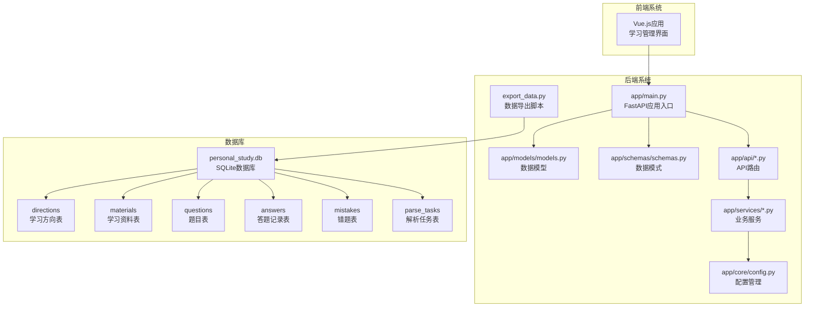
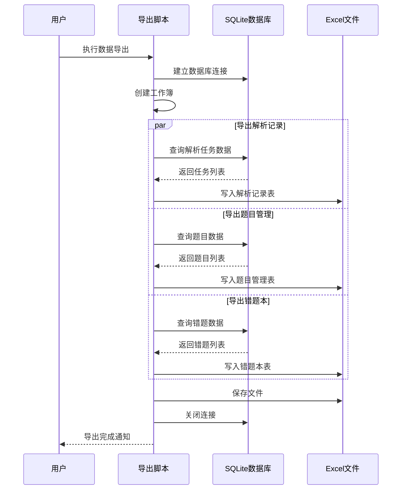
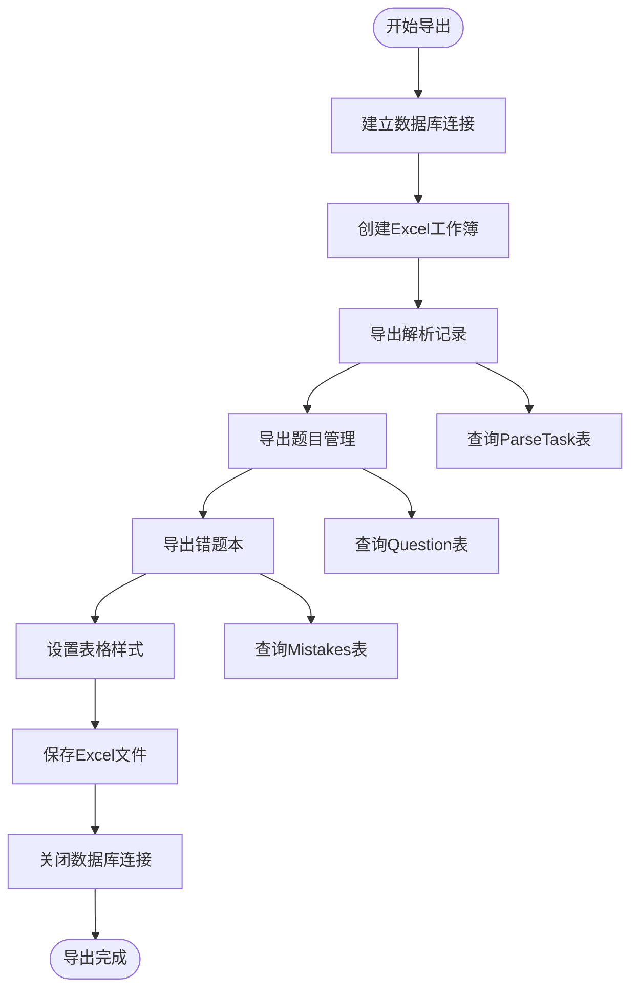
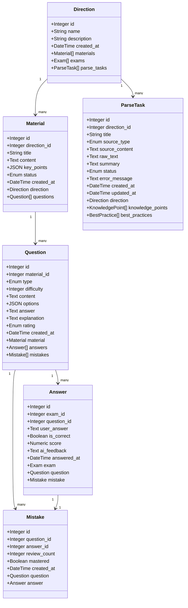
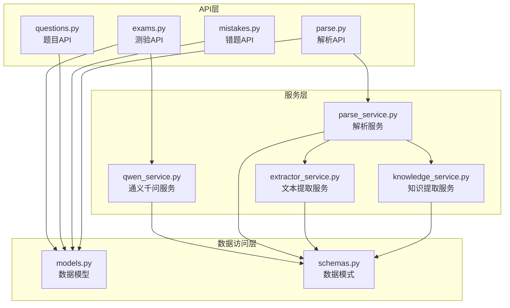
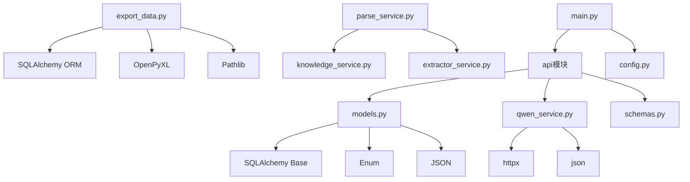

# 数据导出系统

<cite>
**本文档引用的文件**
- [export_data.py](file://backend/export_data.py)
- [models.py](file://backend/app/models/models.py)
- [schemas.py](file://backend/app/schemas/schemas.py)
- [main.py](file://backend/app/main.py)
- [config.py](file://backend/app/core/config.py)
- [qwen_service.py](file://backend/app/services/qwen_service.py)
- [parse_service.py](file://backend/app/services/parse_service.py)
- [extractor_service.py](file://backend/app/services/extractor_service.py)
- [knowledge_service.py](file://backend/app/services/knowledge_service.py)
- [exams.py](file://backend/app/api/exams.py)
- [questions.py](file://backend/app/api/questions.py)
- [mistakes.py](file://backend/app/api/mistakes.py)
- [parse.py](file://backend/app/api/parse.py)
</cite>

## 目录
1. [简介](#简介)
2. [项目结构](#项目结构)
3. [核心组件](#核心组件)
4. [架构概览](#架构概览)
5. [详细组件分析](#详细组件分析)
6. [依赖关系分析](#依赖关系分析)
7. [性能考虑](#性能考虑)
8. [故障排除指南](#故障排除指南)
9. [结论](#结论)

## 简介

数据导出系统是一个专门用于将个人学习管理系统中的数据导出为Excel格式的工具。该系统能够从SQLite数据库中提取学习方向、题目管理、错题本和解析记录等数据，并将其格式化为易于阅读的Excel表格。

系统采用模块化设计，包含数据模型定义、API接口、服务层和导出功能四个主要层次。通过统一的数据导出机制，用户可以定期备份学习数据，进行数据分析和统计。

## 项目结构

**图表来源**
- [export_data.py](file://backend/export_data.py#L1-L330)
- [main.py](file://backend/app/main.py#L1-L66)
- [models.py](file://backend/app/models/models.py#L1-L223)

**章节来源**
- [export_data.py](file://backend/export_data.py#L1-L330)
- [main.py](file://backend/app/main.py#L1-L66)

## 核心组件

### 数据导出引擎

数据导出系统的核心是`export_data.py`文件，它提供了完整的数据导出功能：

- **数据库连接管理**：使用SQLAlchemy ORM连接SQLite数据库
- **多表导出支持**：支持解析记录、题目管理、错题本等数据表
- **Excel格式化**：自动设置表头样式、列宽和行高
- **数据完整性**：确保导出数据的完整性和一致性

### 数据模型层

系统采用标准化的数据模型定义，包含以下核心实体：

- **学习方向(Direction)**：管理不同的学习领域
- **学习资料(Material)**：存储学习内容和核心知识点
- **题目(Question)**：维护各种类型的题目数据
- **答题记录(Answer)**：记录用户的答题情况
- **错题(Mistake)**：跟踪用户的错题信息
- **解析任务(ParseTask)**：管理知识解析任务

### API服务层

系统提供RESTful API接口，支持完整的CRUD操作：

- **测验管理**：创建、查询和提交测验
- **题目管理**：增删改查题目数据
- **错题管理**：维护错题本功能
- **知识解析**：支持文本、文件和URL的知识解析

**章节来源**
- [export_data.py](file://backend/export_data.py#L106-L329)
- [models.py](file://backend/app/models/models.py#L63-L223)
- [schemas.py](file://backend/app/schemas/schemas.py#L1-L265)

## 架构概览

**图表来源**
- [export_data.py](file://backend/export_data.py#L293-L329)
- [exams.py](file://backend/app/api/exams.py#L155-L260)

## 详细组件分析

### 数据导出核心流程

**图表来源**
- [export_data.py](file://backend/export_data.py#L133-L329)

### 数据模型关系图

**图表来源**
- [models.py](file://backend/app/models/models.py#L63-L223)

### API服务架构

**图表来源**
- [exams.py](file://backend/app/api/exams.py#L1-L284)
- [parse.py](file://backend/app/api/parse.py#L1-L177)

**章节来源**
- [export_data.py](file://backend/export_data.py#L133-L329)
- [models.py](file://backend/app/models/models.py#L63-L223)
- [exams.py](file://backend/app/api/exams.py#L1-L284)

## 依赖关系分析

### 外部依赖

系统依赖以下关键外部库：

- **SQLAlchemy**：ORM框架，用于数据库操作
- **OpenPyXL**：Excel文件处理库
- **FastAPI**：Web框架，提供API服务
- **httpx**：异步HTTP客户端，用于API调用
- **BeautifulSoup**：HTML解析库

### 内部模块依赖

**图表来源**
- [export_data.py](file://backend/export_data.py#L5-L10)
- [models.py](file://backend/app/models/models.py#L4-L6)
- [qwen_service.py](file://backend/app/services/qwen_service.py#L3-L5)

**章节来源**
- [export_data.py](file://backend/export_data.py#L1-L330)
- [models.py](file://backend/app/models/models.py#L1-L223)
- [qwen_service.py](file://backend/app/services/qwen_service.py#L1-L156)

## 性能考虑

### 数据库优化策略

1. **连接池管理**：使用SQLAlchemy连接池提高数据库访问效率
2. **批量查询**：采用批量查询减少数据库往返次数
3. **索引优化**：为常用查询字段建立索引
4. **内存管理**：及时释放数据库连接和Excel工作簿资源

### 导出性能优化

1. **分批处理**：对于大量数据采用分批导出策略
2. **异步处理**：支持异步文件提取和文本解析
3. **缓存机制**：缓存常用的配置和静态数据
4. **资源清理**：确保临时文件和数据库连接的及时清理

### 内存使用优化

- **流式处理**：对大文件采用流式处理方式
- **延迟加载**：使用SQLAlchemy的延迟加载特性
- **垃圾回收**：合理管理Python垃圾回收机制

## 故障排除指南

### 常见问题及解决方案

#### 数据库连接问题
- **症状**：无法连接到SQLite数据库
- **原因**：数据库文件路径错误或权限问题
- **解决**：检查数据库文件路径和文件权限

#### Excel导出异常
- **症状**：导出过程中出现异常
- **原因**：数据格式不兼容或内存不足
- **解决**：检查数据格式和系统内存使用情况

#### API调用超时
- **症状**：通义千问API调用超时
- **原因**：网络连接不稳定或API密钥配置错误
- **解决**：检查网络连接和API配置

#### 文件处理错误
- **症状**：文件解析失败
- **原因**：文件格式不支持或文件损坏
- **解决**：验证文件格式和完整性

**章节来源**
- [export_data.py](file://backend/export_data.py#L293-L329)
- [config.py](file://backend/app/core/config.py#L1-L34)

## 结论

数据导出系统为个人学习管理提供了完整的数据备份和分析能力。通过模块化的架构设计和标准化的数据处理流程，系统能够高效地将学习数据转换为Excel格式，便于用户进行进一步的数据分析和统计。

系统的主要优势包括：

1. **完整性**：支持多种数据表的导出，确保数据完整性
2. **易用性**：提供简单直观的命令行接口
3. **可扩展性**：模块化设计便于功能扩展
4. **可靠性**：完善的错误处理和异常恢复机制

未来可以考虑的功能增强包括：支持增量导出、添加数据过滤功能、提供Web界面等。