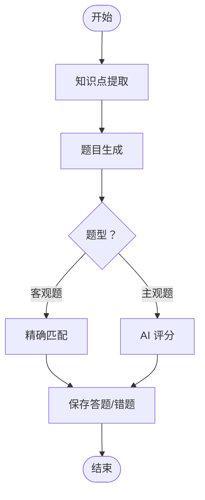

# 智能题目生成

<cite>
**本文引用的文件**
- [backend/app/main.py](file://backend/app/main.py)
- [backend/app/core/config.py](file://backend/app/core/config.py)
- [backend/app/api/directions.py](file://backend/app/api/directions.py)
- [backend/app/api/materials.py](file://backend/app/api/materials.py)
- [backend/app/api/questions.py](file://backend/app/api/questions.py)
- [backend/app/api/exams.py](file://backend/app/api/exams.py)
- [backend/app/models/models.py](file://backend/app/models/models.py)
- [backend/app/schemas/schemas.py](file://backend/app/schemas/schemas.py)
- [backend/app/services/qwen_service.py](file://backend/app/services/qwen_service.py)
- [backend/app/services/knowledge_service.py](file://backend/app/services/knowledge_service.py)
- [backend/app/services/extractor_service.py](file://backend/app/services/extractor_service.py)
- [backend/pyproject.toml](file://backend/pyproject.toml)
</cite>

## 目录
1. [简介](#简介)
2. [项目结构](#项目结构)
3. [核心组件](#核心组件)
4. [架构总览](#架构总览)
5. [详细组件分析](#详细组件分析)
6. [依赖分析](#依赖分析)
7. [性能考虑](#性能考虑)
8. [故障排查指南](#故障排查指南)
9. [结论](#结论)
10. [附录](#附录)

## 简介
本项目是一个“智能题目生成”系统，围绕“学习方向-学习资料-题目-测验”的完整闭环展开，结合通义千问大模型实现：
- 基于资料的自动知识点提炼
- 多题型题目生成（单选、多选、判断、填空）
- 主观题智能评分与反馈
- 测验创建、提交与结果统计
- 资料解析、题目管理、错题追踪

系统采用 FastAPI + SQLAlchemy 架构，前端通过 API 进行交互；后端通过服务层对接大模型，实现从“资料到题目的自动化流水线”。

## 项目结构
后端采用按功能域划分的模块化组织方式：
- 核心配置与入口：配置加载、应用启动、CORS、路由注册
- API 层：学习方向、学习资料、题目、测验、错题、解析任务等接口
- 服务层：Qwen 服务、知识服务、文本提取服务
- 模型与模式：数据库模型与 Pydantic 模式
- 依赖声明：Python 包与版本约束

图表来源
- [backend/app/main.py](file://backend/app/main.py#L1-L66)
- [backend/app/core/config.py](file://backend/app/core/config.py#L1-L34)
- [backend/app/api/directions.py](file://backend/app/api/directions.py#L1-L51)
- [backend/app/api/materials.py](file://backend/app/api/materials.py#L1-L203)
- [backend/app/api/questions.py](file://backend/app/api/questions.py#L1-L90)
- [backend/app/api/exams.py](file://backend/app/api/exams.py#L1-L240)
- [backend/app/services/qwen_service.py](file://backend/app/services/qwen_service.py#L1-L156)
- [backend/app/services/knowledge_service.py](file://backend/app/services/knowledge_service.py#L1-L114)
- [backend/app/services/extractor_service.py](file://backend/app/services/extractor_service.py#L1-L123)
- [backend/app/models/models.py](file://backend/app/models/models.py#L1-L223)
- [backend/app/schemas/schemas.py](file://backend/app/schemas/schemas.py#L1-L265)

章节来源
- [backend/app/main.py](file://backend/app/main.py#L1-L66)
- [backend/app/core/config.py](file://backend/app/core/config.py#L1-L34)

## 核心组件
- 应用入口与配置
  - 应用启动时创建数据库表与上传目录，注册各模块路由
  - 通过配置类集中管理数据库、大模型 API、文件大小等参数
- API 接口
  - 学习方向：增删查
  - 学习资料：上传、流式进度、删除
  - 题目：查询、详情、更新、评价、删除
  - 测验：创建、详情、提交、结果查询
- 服务层
  - Qwen 服务：知识点提炼、题目生成、主观题评分
  - 知识服务：更全面的知识点与最佳实践抽取
  - 文本提取服务：PDF/DOCX/MARKDOWN/TXT 与 URL 正文抽取
- 数据模型与模式
  - 定义学习方向、资料、题目、测验、答题、错题等实体及枚举
  - 使用 Pydantic 模式进行请求/响应校验与序列化

章节来源
- [backend/app/main.py](file://backend/app/main.py#L1-L66)
- [backend/app/core/config.py](file://backend/app/core/config.py#L1-L34)
- [backend/app/api/directions.py](file://backend/app/api/directions.py#L1-L51)
- [backend/app/api/materials.py](file://backend/app/api/materials.py#L1-L203)
- [backend/app/api/questions.py](file://backend/app/api/questions.py#L1-L90)
- [backend/app/api/exams.py](file://backend/app/api/exams.py#L1-L240)
- [backend/app/services/qwen_service.py](file://backend/app/services/qwen_service.py#L1-L156)
- [backend/app/services/knowledge_service.py](file://backend/app/services/knowledge_service.py#L1-L114)
- [backend/app/services/extractor_service.py](file://backend/app/services/extractor_service.py#L1-L123)
- [backend/app/models/models.py](file://backend/app/models/models.py#L1-L223)
- [backend/app/schemas/schemas.py](file://backend/app/schemas/schemas.py#L1-L265)

## 架构总览
系统采用“API 层-服务层-数据层”的分层架构，配合 SSE 流式进度返回，实现从资料上传到题目生成再到测验评分的全链路。

图表来源
- [backend/app/main.py](file://backend/app/main.py#L1-L66)
- [backend/app/api/directions.py](file://backend/app/api/directions.py#L1-L51)
- [backend/app/api/materials.py](file://backend/app/api/materials.py#L1-L203)
- [backend/app/api/questions.py](file://backend/app/api/questions.py#L1-L90)
- [backend/app/api/exams.py](file://backend/app/api/exams.py#L1-L240)
- [backend/app/services/qwen_service.py](file://backend/app/services/qwen_service.py#L1-L156)
- [backend/app/services/extractor_service.py](file://backend/app/services/extractor_service.py#L1-L123)
- [backend/app/models/models.py](file://backend/app/models/models.py#L1-L223)

## 详细组件分析

### 学习方向（方向管理）
- 功能：创建/查询/删除学习方向，用于资料与题目的分类维度
- 关键点：名称唯一性校验，防止重复

章节来源
- [backend/app/api/directions.py](file://backend/app/api/directions.py#L1-L51)
- [backend/app/models/models.py](file://backend/app/models/models.py#L63-L76)

### 学习资料（资料解析与题目生成）
- 功能：上传资料（支持多种格式与 URL），同步/异步处理，流式返回进度
- 处理流程：
  1) 校验方向与 API 密钥
  2) 调用 Qwen 服务提炼知识点
  3) 基于知识点生成题目
  4) 保存题目并更新资料状态
- SSE 流程：
  - extracting → extracted → generating → generated → saving → completed/error

图表来源
- [backend/app/api/materials.py](file://backend/app/api/materials.py#L82-L161)
- [backend/app/services/qwen_service.py](file://backend/app/services/qwen_service.py#L37-L114)
- [backend/app/models/models.py](file://backend/app/models/models.py#L78-L114)

章节来源
- [backend/app/api/materials.py](file://backend/app/api/materials.py#L1-L203)
- [backend/app/services/qwen_service.py](file://backend/app/services/qwen_service.py#L1-L156)
- [backend/app/models/models.py](file://backend/app/models/models.py#L1-L223)

### 题目管理（查询、更新、评价）
- 查询：支持按资料、方向、题型过滤，按创建时间倒序
- 更新：按需更新字段，避免覆盖
- 评价：支持“好/不好”，便于后续质量控制与推荐

章节来源
- [backend/app/api/questions.py](file://backend/app/api/questions.py#L1-L90)
- [backend/app/schemas/schemas.py](file://backend/app/schemas/schemas.py#L60-L100)
- [backend/app/models/models.py](file://backend/app/models/models.py#L95-L114)

### 测验（创建、提交、评分）
- 创建：按方向随机抽取固定数量题目
- 提交：客观题精确匹配，主观题调用 Qwen 评分
- 结果：计算总分、等级（若为等级制），记录答题与错题

图表来源
- [backend/app/api/exams.py](file://backend/app/api/exams.py#L127-L217)
- [backend/app/services/qwen_service.py](file://backend/app/services/qwen_service.py#L115-L152)
- [backend/app/models/models.py](file://backend/app/models/models.py#L116-L153)

章节来源
- [backend/app/api/exams.py](file://backend/app/api/exams.py#L1-L240)
- [backend/app/services/qwen_service.py](file://backend/app/services/qwen_service.py#L1-L156)
- [backend/app/models/models.py](file://backend/app/models/models.py#L1-L223)

### 知识点提取与题目生成（AI 驱动）
- 知识点提取：面向“学习资料”，返回结构化知识点数组（名称、描述、重要度、分类）
- 题目生成：面向“知识点”，生成多题型题目，包含难度、选项、答案、解析、对应知识点
- 主观题评分：面向“题目+标准答案+用户答案”，返回分数、评语与命中要点

图表来源
- [backend/app/services/qwen_service.py](file://backend/app/services/qwen_service.py#L37-L114)
- [backend/app/services/knowledge_service.py](file://backend/app/services/knowledge_service.py#L51-L109)
- [backend/app/api/exams.py](file://backend/app/api/exams.py#L154-L170)

章节来源
- [backend/app/services/qwen_service.py](file://backend/app/services/qwen_service.py#L1-L156)
- [backend/app/services/knowledge_service.py](file://backend/app/services/knowledge_service.py#L1-L114)

### 数据模型与枚举
- 实体关系：方向-资料-题目，方向-测验，测验-答题，答题-错题
- 枚举：题型、难度、评分类型、测验模式、状态等

图表来源
- [backend/app/models/models.py](file://backend/app/models/models.py#L63-L223)

章节来源
- [backend/app/models/models.py](file://backend/app/models/models.py#L1-L223)

## 依赖分析
- 外部依赖：FastAPI、SQLAlchemy、httpx、PyMuPDF、python-docx、BeautifulSoup4、lxml 等
- 配置依赖：Qwen API 的密钥、模型、基础地址，上传目录与文件大小限制
- 组件耦合：API 层依赖服务层；服务层依赖配置与外部 LLM；模型与模式贯穿全链路

图表来源
- [backend/pyproject.toml](file://backend/pyproject.toml#L1-L29)
- [backend/app/main.py](file://backend/app/main.py#L1-L66)
- [backend/app/core/config.py](file://backend/app/core/config.py#L1-L34)

章节来源
- [backend/pyproject.toml](file://backend/pyproject.toml#L1-L29)
- [backend/app/main.py](file://backend/app/main.py#L1-L66)
- [backend/app/core/config.py](file://backend/app/core/config.py#L1-L34)

## 性能考虑
- 异步与超时：Qwen 服务与文本提取均使用异步客户端，合理设置超时，避免阻塞
- 流式处理：资料处理通过 SSE 返回进度，提升用户体验
- 随机抽题：测验创建使用随机排序，保证多样性
- 缓存与复用：配置使用 LRU 缓存，减少重复初始化开销
- 扩展建议：
  - 引入缓存层（Redis）存储热点知识点与题目
  - 对大文件与长文本分片处理，降低单次请求压力
  - 并行化题目生成与保存，提高吞吐量
  - 引入队列（如 Celery/RQ）异步处理资料解析与题目生成

## 故障排查指南
- API 密钥未配置：资料创建时报错提示，请检查环境变量与配置
- 资料处理失败：查看日志定位异常，确认文件格式、大小与网络可达性
- 题目生成为空：检查 LLM 返回格式与 JSON 解析容错逻辑
- 测验提交异常：确认题型与答案格式，主观题评分依赖 LLM 输出稳定性
- CORS 问题：生产环境建议限定允许来源，避免 "*" 导致的安全风险

章节来源
- [backend/app/api/materials.py](file://backend/app/api/materials.py#L94-L97)
- [backend/app/api/materials.py](file://backend/app/api/materials.py#L144-L159)
- [backend/app/services/qwen_service.py](file://backend/app/services/qwen_service.py#L105-L113)
- [backend/app/main.py](file://backend/app/main.py#L27-L34)

## 结论
本系统以“资料-知识点-题目-测验”为主线，借助通义千问实现了从资料到题目的自动化与智能化。通过清晰的分层架构、完善的 API 设计与健壮的服务封装，满足了多题型生成、智能评分与学习闭环管理的需求。未来可在缓存、异步化、并发与题型扩展方面持续演进。

## 附录

### API 接口清单与说明
- 学习方向
  - GET /api/directions：获取所有方向
  - POST /api/directions：创建方向（名称唯一）
  - GET /api/directions/{direction_id}：获取方向详情
  - DELETE /api/directions/{direction_id}：删除方向
- 学习资料
  - GET /api/materials：按方向过滤资料列表
  - POST /api/materials：上传资料并同步处理（知识点提炼+题目生成）
  - GET /api/materials/{material_id}/progress：SSE 流式进度
  - DELETE /api/materials/{material_id}：删除资料及其题目
- 题目
  - GET /api/questions：按资料/方向/题型过滤，倒序查询
  - GET /api/questions/{question_id}：获取题目详情
  - PATCH /api/questions/{question_id}：更新题目（按需更新）
  - PATCH /api/questions/{question_id}/rate：评价题目（好/不好）
  - DELETE /api/questions/{question_id}：删除题目
- 测验
  - GET /api/exams：按方向/状态过滤测验列表
  - POST /api/exams：创建测验（随机抽取题目）
  - GET /api/exams/{exam_id}：获取测验详情（含题目）
  - POST /api/exams/{exam_id}/submit：提交测验并评分
  - GET /api/exams/{exam_id}/result：获取测验结果

章节来源
- [backend/app/api/directions.py](file://backend/app/api/directions.py#L1-L51)
- [backend/app/api/materials.py](file://backend/app/api/materials.py#L1-L203)
- [backend/app/api/questions.py](file://backend/app/api/questions.py#L1-L90)
- [backend/app/api/exams.py](file://backend/app/api/exams.py#L1-L240)

### 题型与生成规则
- 支持题型：单选、多选、判断、填空（简答）
- 生成规则：
  - 每个知识点生成 1-2 道题目
  - 难度均匀分布在 1-5
  - 选择题提供 4 个选项
  - 判断题选项为“正确/错误”
  - 简答题提供答案要点与解析
- 难度分配：由提示词引导均匀分布
- 答案验证：
  - 客观题：精确匹配（去空白）
  - 主观题：AI 评分，返回分数、评语与命中要点

章节来源
- [backend/app/services/qwen_service.py](file://backend/app/services/qwen_service.py#L66-L99)
- [backend/app/api/exams.py](file://backend/app/api/exams.py#L154-L170)

### 知识图谱与智能匹配（概念性说明）
- 现状：系统通过“知识点数组”驱动题目生成，未显式构建图谱
- 建议：可引入轻量图谱（如属性图）存储“知识点-关联-应用场景”，在生成阶段做“相似知识点”匹配与“跨知识点组合题”，提升题目质量与覆盖面
- 与资料管理/学习方向的集成：方向作为知识域划分，资料作为知识点来源，题目作为能力检测载体

[本节为概念性说明，不直接分析具体文件]

### 质量控制、去重与个性化推荐
- 质量控制：题目评价（好/不好）与主观题评分反馈可用于质量评估
- 去重机制：可基于“题干+答案指纹”或语义向量近似去重
- 个性化推荐：结合错题本与掌握度，按知识点重要度与难度偏好动态组卷

[本节为概念性说明，不直接分析具体文件]

### 扩展新题型的方法
- 在模型与模式中新增题型枚举与字段
- 在 Qwen 提示词中增加新题型的 JSON 字段规范
- 在题目生成与评分逻辑中补充分支处理
- 在测验评分中针对新题型制定评分策略

章节来源
- [backend/app/models/models.py](file://backend/app/models/models.py#L16-L22)
- [backend/app/schemas/schemas.py](file://backend/app/schemas/schemas.py#L60-L84)
- [backend/app/services/qwen_service.py](file://backend/app/services/qwen_service.py#L66-L99)
- [backend/app/api/exams.py](file://backend/app/api/exams.py#L154-L170)