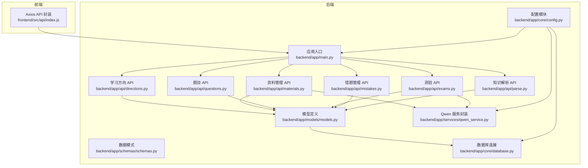
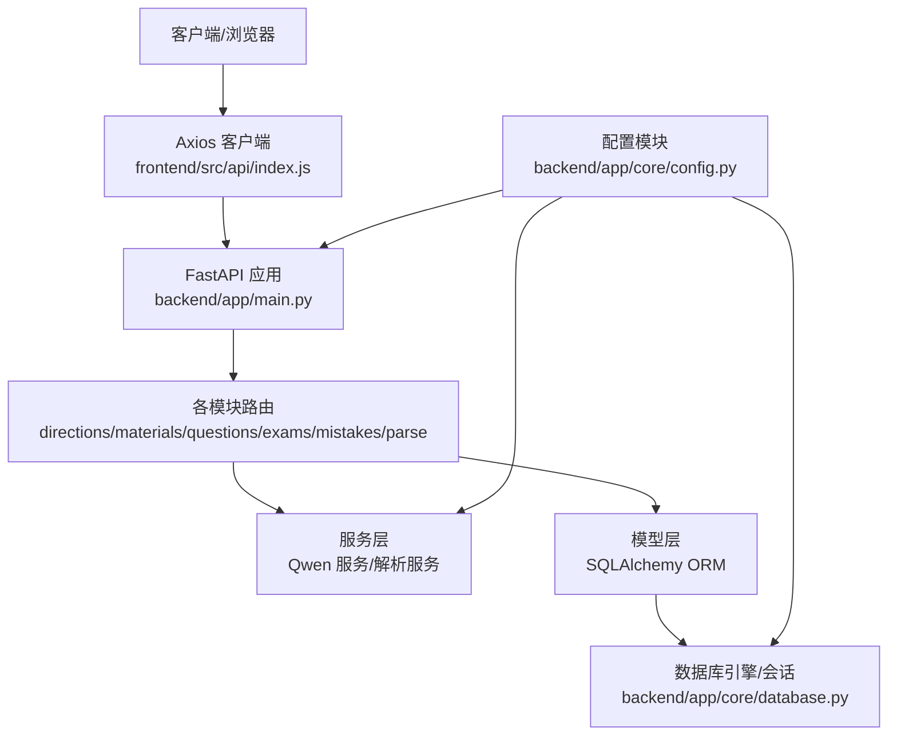
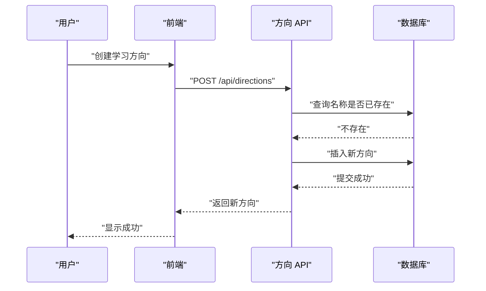
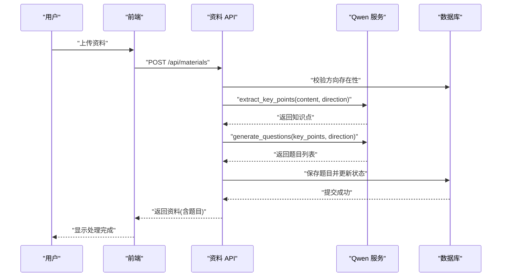
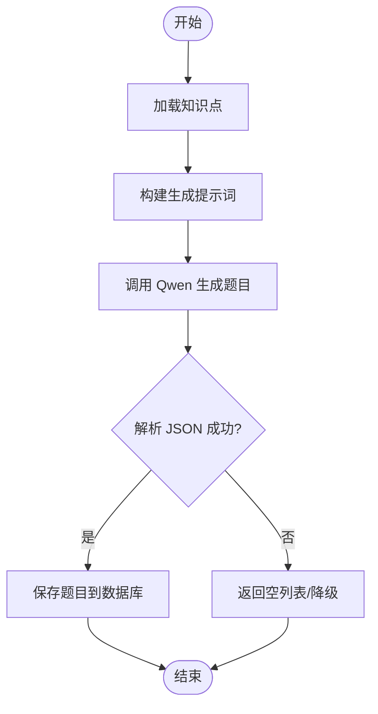
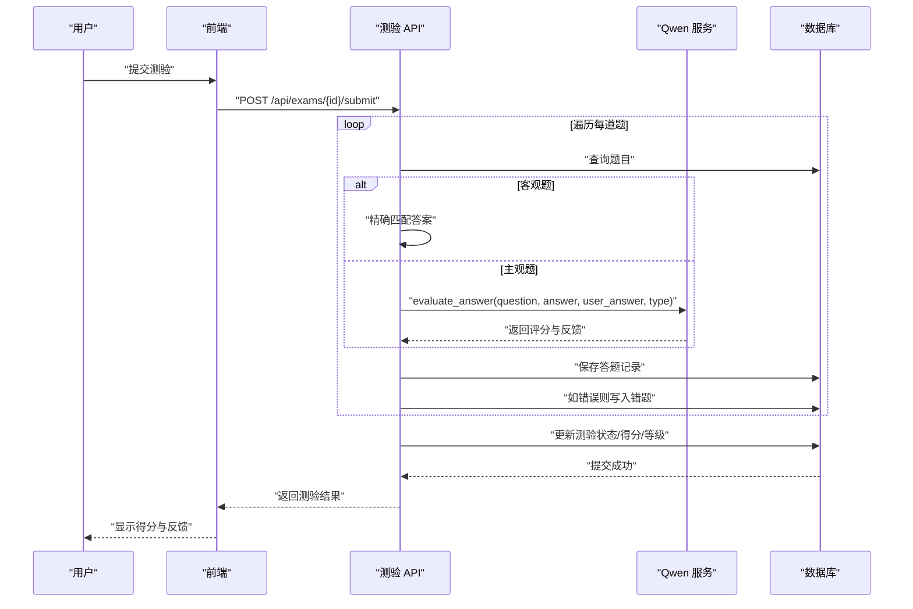
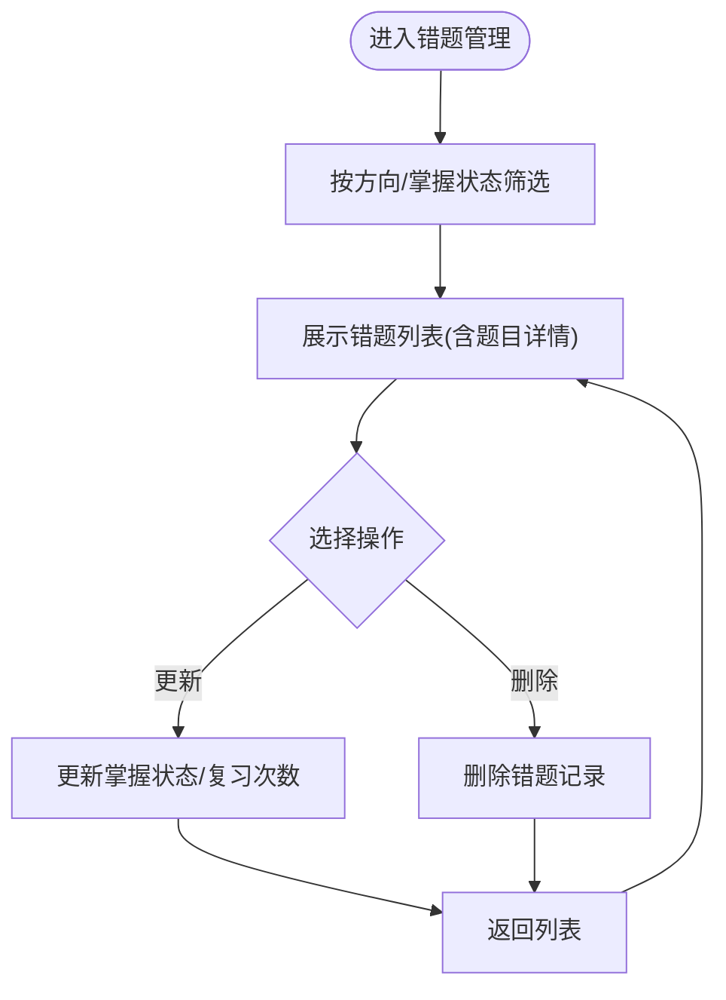
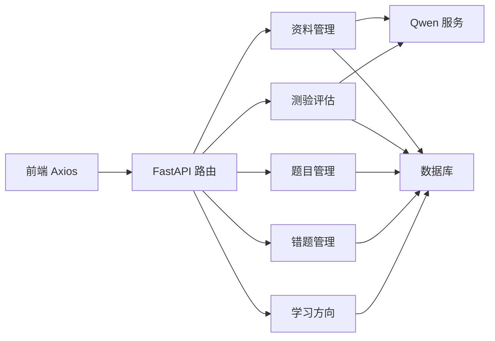
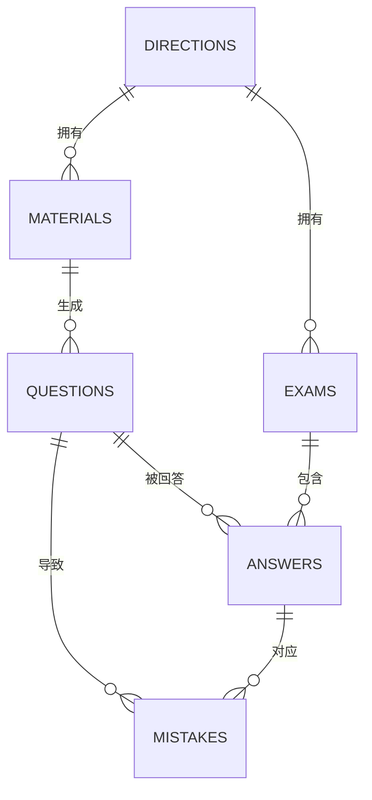

# 核心功能模块

<cite>
**本文档引用的文件**
- [backend/app/main.py](file://backend/app/main.py)
- [backend/app/api/directions.py](file://backend/app/api/directions.py)
- [backend/app/api/materials.py](file://backend/app/api/materials.py)
- [backend/app/api/questions.py](file://backend/app/api/questions.py)
- [backend/app/api/exams.py](file://backend/app/api/exams.py)
- [backend/app/api/mistakes.py](file://backend/app/api/mistakes.py)
- [backend/app/api/parse.py](file://backend/app/api/parse.py)
- [backend/app/models/models.py](file://backend/app/models/models.py)
- [backend/app/schemas/schemas.py](file://backend/app/schemas/schemas.py)
- [backend/app/services/qwen_service.py](file://backend/app/services/qwen_service.py)
- [backend/app/core/config.py](file://backend/app/core/config.py)
- [backend/app/core/database.py](file://backend/app/core/database.py)
- [frontend/src/api/index.js](file://frontend/src/api/index.js)
- [backend/pyproject.toml](file://backend/pyproject.toml)
- [backend/.env.example](file://backend/.env.example)
</cite>

## 目录
1. [简介](#简介)
2. [项目结构](#项目结构)
3. [核心组件](#核心组件)
4. [架构总览](#架构总览)
5. [详细组件分析](#详细组件分析)
6. [依赖关系分析](#依赖关系分析)
7. [性能考虑](#性能考虑)
8. [故障排除指南](#故障排除指南)
9. [结论](#结论)
10. [附录](#附录)

## 简介
本文件面向个人学习管理系统的五大核心功能模块，提供从设计理念、业务流程到技术实现的全景式文档。五大功能包括：学习方向管理、资料管理系统、智能题目生成、测验评估系统与错题管理系统。文档同时覆盖用户工作流、功能间依赖关系与数据流转、配置选项与扩展机制，并给出性能优化与错误处理建议，帮助开发者快速理解并高效扩展系统。

## 项目结构
后端采用 FastAPI + SQLAlchemy 架构，按功能模块划分 API 层、服务层、模型层与配置层；前端使用 Axios 进行 API 调用，统一前缀为 /api。系统通过环境变量进行配置，支持 SQLite 与 MySQL 等多种数据库。

图表来源
- [backend/app/main.py](file://backend/app/main.py#L1-L66)
- [frontend/src/api/index.js](file://frontend/src/api/index.js#L1-L52)

章节来源
- [backend/app/main.py](file://backend/app/main.py#L1-L66)
- [frontend/src/api/index.js](file://frontend/src/api/index.js#L1-L52)

## 核心组件
- 学习方向管理：提供方向的增删查操作，作为资料、测验等资源的组织维度。
- 资料管理系统：支持资料上传、AI 知识点提炼、题目生成与保存，提供同步处理与进度流式返回能力。
- 智能题目生成：基于 Qwen 服务，从资料中抽取知识点并生成多类型题目，支持客观题与主观题评分。
- 测验评估系统：支持定时/非定时模式，自动评分与等级计算，生成答题记录与错题。
- 错题管理系统：维护错题与复习状态，支持标记掌握与复习计数。

章节来源
- [backend/app/api/directions.py](file://backend/app/api/directions.py#L1-L51)
- [backend/app/api/materials.py](file://backend/app/api/materials.py#L1-L203)
- [backend/app/api/questions.py](file://backend/app/api/questions.py#L1-L90)
- [backend/app/api/exams.py](file://backend/app/api/exams.py#L1-L240)
- [backend/app/api/mistakes.py](file://backend/app/api/mistakes.py#L1-L90)

## 架构总览
系统采用分层架构：
- 表现层：FastAPI 路由与视图函数，负责请求处理与响应序列化。
- 业务层：各模块 API 负责参数校验、权限控制与调用服务层。
- 服务层：Qwen 服务封装外部 AI 接口；解析服务处理文本/文件/URL 的知识抽取。
- 数据访问层：SQLAlchemy ORM 映射模型，统一数据库会话管理。
- 配置层：Pydantic Settings 读取 .env 环境变量，集中管理应用配置。

图表来源
- [backend/app/main.py](file://backend/app/main.py#L1-L66)
- [frontend/src/api/index.js](file://frontend/src/api/index.js#L1-L52)
- [backend/app/core/config.py](file://backend/app/core/config.py#L1-L34)
- [backend/app/core/database.py](file://backend/app/core/database.py#L1-L38)
- [backend/app/services/qwen_service.py](file://backend/app/services/qwen_service.py#L1-L156)

## 详细组件分析

### 学习方向管理
- 设计理念：以“方向”为组织单元，贯穿资料、题目、测验与解析任务，便于知识体系化管理。
- 业务流程：
  - 新增方向：校验名称唯一性，创建并返回。
  - 查询方向：支持全量查询与按 ID 查询。
  - 删除方向：校验存在性，删除并返回成功消息。
- 用户工作流：用户在资料上传前选择或创建方向，后续资料与题目均绑定该方向。

图表来源
- [backend/app/api/directions.py](file://backend/app/api/directions.py#L11-L29)

章节来源
- [backend/app/api/directions.py](file://backend/app/api/directions.py#L1-L51)

### 资料管理系统
- 设计理念：资料是题目的源头，系统支持上传后立即进行知识点提炼与题目生成，提升学习闭环效率。
- 业务流程：
  - 上传资料：校验方向存在性与 API 密钥，创建资料记录。
  - 同步处理：调用 Qwen 服务提炼知识点，再生成题目并保存。
  - 进度查询：支持 SSE 流式返回处理进度，便于前端实时展示。
  - 删除资料：级联删除相关题目。
- 用户工作流：用户上传资料 → 查看处理进度 → 题目生成完成 → 进入题目库与测验。

图表来源
- [backend/app/api/materials.py](file://backend/app/api/materials.py#L82-L161)
- [backend/app/services/qwen_service.py](file://backend/app/services/qwen_service.py#L37-L114)

章节来源
- [backend/app/api/materials.py](file://backend/app/api/materials.py#L1-L203)
- [backend/app/services/qwen_service.py](file://backend/app/services/qwen_service.py#L1-L156)

### 智能题目生成
- 设计理念：基于 AI 从知识点生成多类型题目，覆盖单选、多选、判断与简答，满足不同学习阶段需求。
- 实现要点：
  - 题型支持：单选、多选、判断、简答。
  - 难度分布：由 AI 控制均匀分布。
  - 选项规范：选择题固定 4 个选项。
  - 答案解析：每题附带解析，便于学习回顾。
- 与资料管理联动：资料处理完成后自动触发题目生成与保存。

图表来源
- [backend/app/services/qwen_service.py](file://backend/app/services/qwen_service.py#L66-L114)

章节来源
- [backend/app/api/materials.py](file://backend/app/api/materials.py#L40-L72)
- [backend/app/services/qwen_service.py](file://backend/app/services/qwen_service.py#L66-L114)

### 测验评估系统
- 设计理念：提供灵活的测验模式（定时/非定时），支持客观题自动评分与主观题 AI 评分，形成学习反馈闭环。
- 业务流程：
  - 创建测验：按方向随机抽取指定数量题目。
  - 提交测验：逐题评分，客观题精确匹配，主观题调用 AI 评估。
  - 结果记录：保存答题记录、正确率、得分与等级。
  - 错题联动：答错题目自动加入错题本。
- 用户工作流：创建测验 → 在线作答 → 提交评分 → 查看结果与错题。

图表来源
- [backend/app/api/exams.py](file://backend/app/api/exams.py#L127-L216)
- [backend/app/services/qwen_service.py](file://backend/app/services/qwen_service.py#L115-L151)

章节来源
- [backend/app/api/exams.py](file://backend/app/api/exams.py#L1-L240)
- [backend/app/services/qwen_service.py](file://backend/app/services/qwen_service.py#L1-L156)

### 错题管理系统
- 设计理念：以错题为驱动的学习改进工具，支持标记掌握、增加复习次数与按方向筛选。
- 业务流程：
  - 查询错题：支持按方向与掌握状态过滤，支持预加载题目详情。
  - 更新错题：可手动标记掌握或调整复习次数（默认自增）。
  - 删除错题：清理不再需要的错题记录。
- 用户工作流：查看错题 → 分析错误原因 → 复习巩固 → 标记掌握 → 继续学习。

图表来源
- [backend/app/api/mistakes.py](file://backend/app/api/mistakes.py#L11-L77)

章节来源
- [backend/app/api/mistakes.py](file://backend/app/api/mistakes.py#L1-L90)

## 依赖关系分析
- 组件耦合：
  - 资料管理依赖 Qwen 服务进行知识点提炼与题目生成。
  - 测验评估依赖 Qwen 服务进行主观题评分。
  - 所有模块共享 SQLAlchemy 模型与数据库会话。
- 外部依赖：
  - 通义千问 API：用于知识点提炼、题目生成与主观题评分。
  - 数据库：SQLite/MySQL，支持异步连接参数与连接池配置。
  - 前端 Axios：统一超时与请求头配置，适配较长的 AI 处理时间。

图表来源
- [backend/app/api/materials.py](file://backend/app/api/materials.py#L8-L10)
- [backend/app/api/exams.py](file://backend/app/api/exams.py#L12-L12)
- [frontend/src/api/index.js](file://frontend/src/api/index.js#L1-L9)

章节来源
- [backend/app/services/qwen_service.py](file://backend/app/services/qwen_service.py#L1-L156)
- [backend/app/core/database.py](file://backend/app/core/database.py#L1-L38)
- [frontend/src/api/index.js](file://frontend/src/api/index.js#L1-L52)

## 性能考虑
- 异步与并发：
  - 资料处理采用异步调用 Qwen 服务，避免阻塞主线程。
  - SSE 流式返回进度，降低前端轮询开销。
- 数据库优化：
  - SQLite 使用连接参数与非阻塞线程配置；MySQL/PG 使用连接池与预热参数。
  - 查询使用 JOIN 与预加载，减少 N+1 查询问题。
- AI 调用优化：
  - 设置合理超时（前端 3 分钟，后端 HTTPX 超时 60 秒）。
  - 通过温度参数平衡生成质量与稳定性。
- 前端体验：
  - Axios 超时设置适配长耗时任务，避免页面卡顿。
  - 测验提交后即时反馈评分与等级，提升学习动机。

章节来源
- [backend/app/api/materials.py](file://backend/app/api/materials.py#L164-L185)
- [backend/app/services/qwen_service.py](file://backend/app/services/qwen_service.py#L20-L35)
- [frontend/src/api/index.js](file://frontend/src/api/index.js#L3-L9)
- [backend/app/core/database.py](file://backend/app/core/database.py#L9-L24)

## 故障排除指南
- 常见错误与处理：
  - API 密钥未配置：资料上传与题目生成会返回 500，提示设置 QWEN_API_KEY。
  - 资料处理失败：状态更新为 FAILED，前端可重试或检查内容格式。
  - 资料/方向/题目/错题不存在：返回 404，需确认 ID 与关联关系。
  - 测验重复提交：状态为已完成时拒绝提交，需创建新测验。
- 日志与追踪：
  - 后端捕获异常并记录日志，便于定位问题。
  - 建议在 .env 中开启 DEBUG，便于开发调试。
- 建议排查步骤：
  - 检查 .env 配置项是否正确。
  - 确认数据库连接与表结构初始化。
  - 验证 Qwen API 可达性与配额情况。
  - 使用 /health 健康检查确认服务运行状态。

章节来源
- [backend/app/api/materials.py](file://backend/app/api/materials.py#L94-L96)
- [backend/app/api/materials.py](file://backend/app/api/materials.py#L144-L159)
- [backend/app/api/exams.py](file://backend/app/api/exams.py#L138-L139)
- [backend/app/main.py](file://backend/app/main.py#L62-L65)
- [backend/.env.example](file://backend/.env.example#L1-L14)

## 结论
五大核心功能模块围绕“方向—资料—题目—测验—错题”的学习闭环设计，通过 AI 驱动的知识点提炼与题目生成，结合灵活的测验模式与错题管理，形成高效的学习辅助系统。系统具备清晰的分层架构、完善的错误处理与性能优化策略，适合进一步扩展至更丰富的题型、解析源与学习路径规划。

## 附录

### 数据模型概览

图表来源
- [backend/app/models/models.py](file://backend/app/models/models.py#L63-L168)

### 配置选项与扩展机制
- 配置项（来自 .env 与 Settings）：
  - 通义千问：API Key、模型名、基础 URL。
  - 数据库：URL、SQLite 线程安全参数、MySQL/PG 连接池参数。
  - 应用：应用名、调试开关、上传目录与文件大小限制。
- 扩展机制：
  - 新增题型：在枚举与 Qwen 提示词中扩展，保持与现有评分逻辑兼容。
  - 新增解析源：在解析 API 中新增路由与服务方法，复用现有任务模型。
  - 新增评分方式：在测验提交逻辑中扩展评分策略，保持与错题联动一致。

章节来源
- [backend/app/core/config.py](file://backend/app/core/config.py#L6-L27)
- [backend/.env.example](file://backend/.env.example#L1-L14)
- [backend/pyproject.toml](file://backend/pyproject.toml#L1-L29)