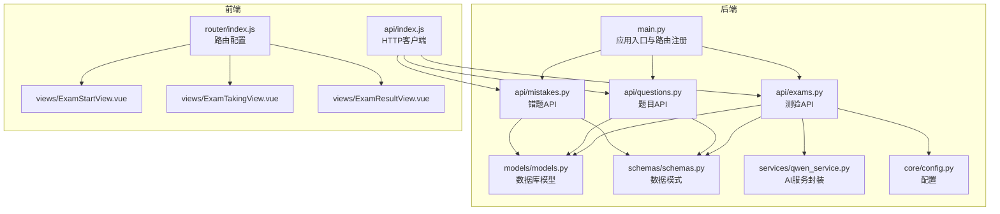
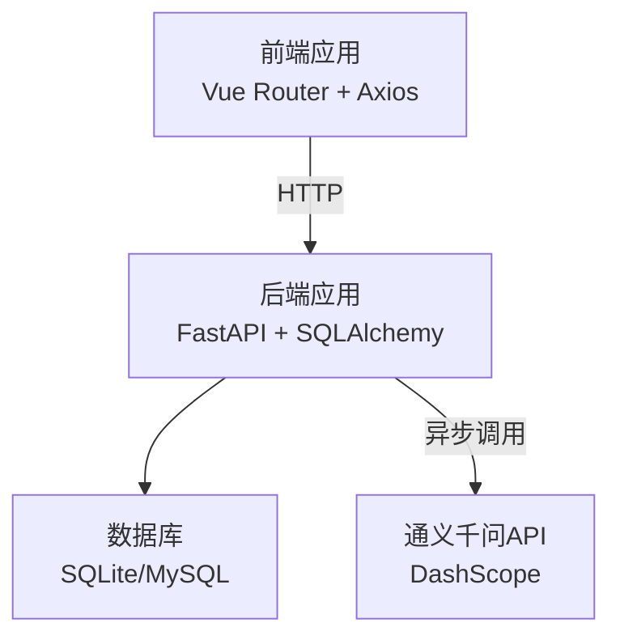
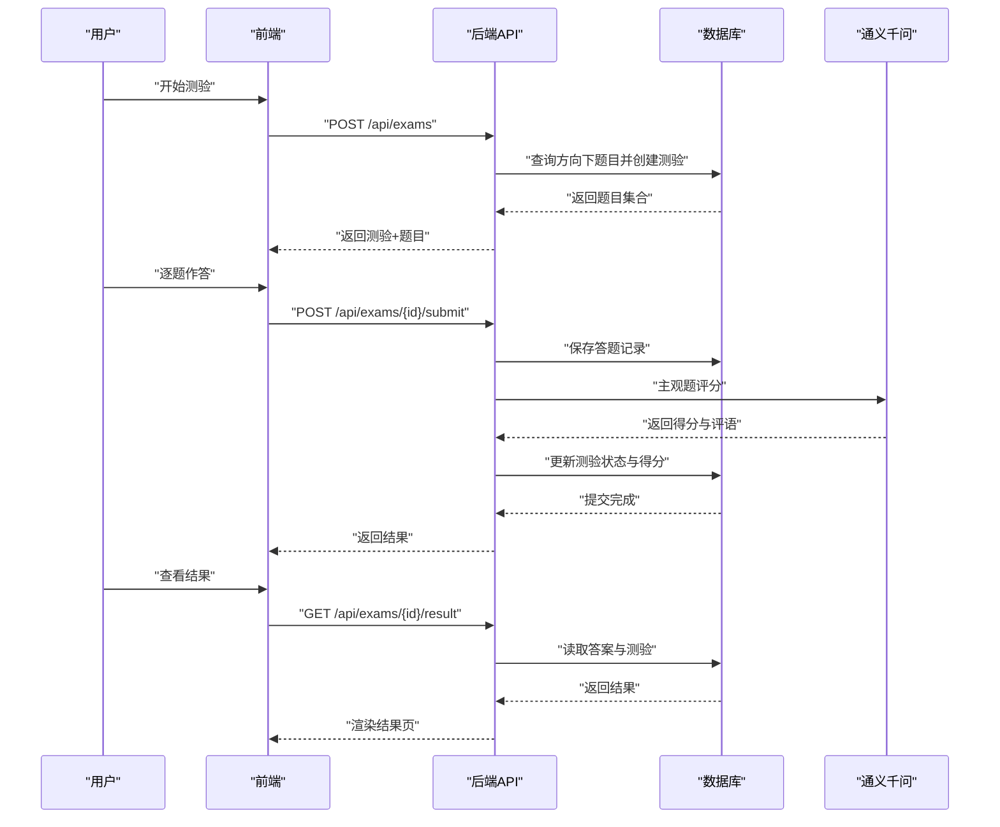
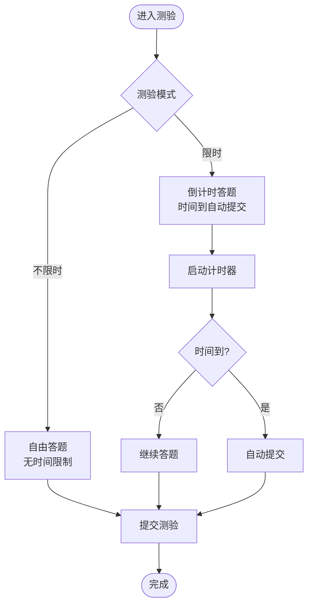
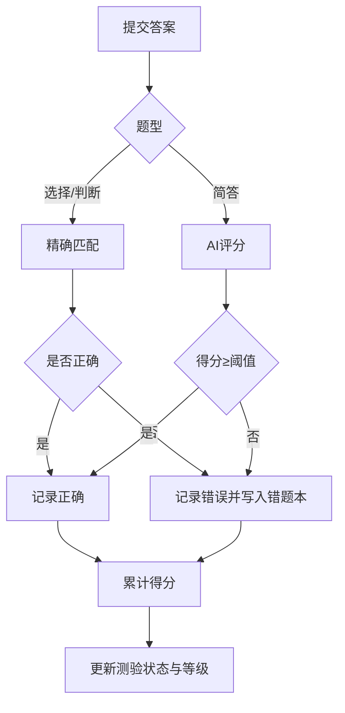
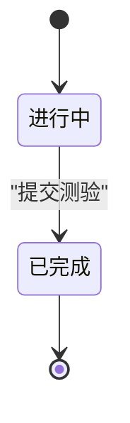
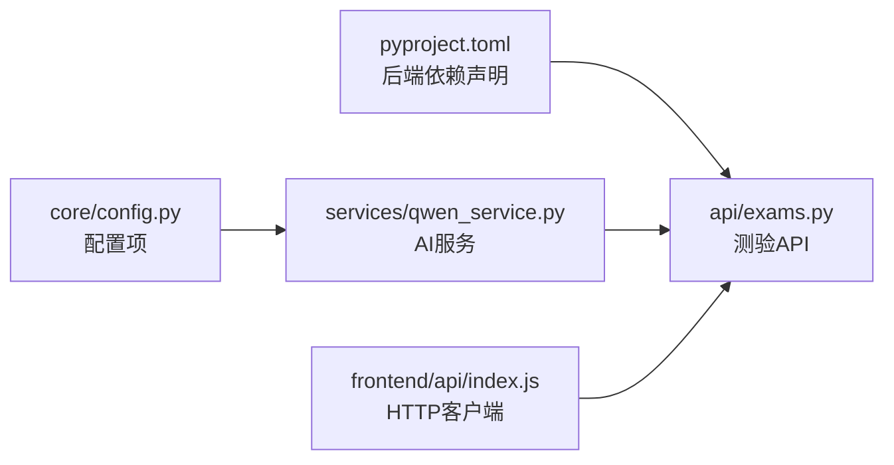
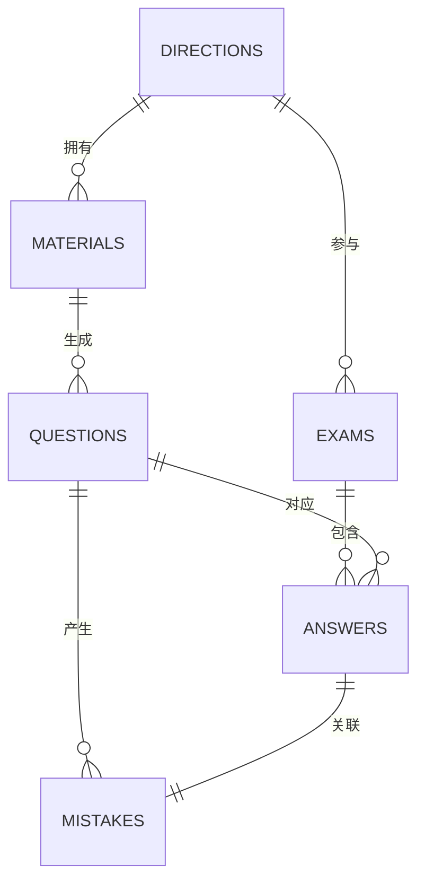

# 测验评估系统

<cite>
**本文引用的文件**
- [backend/app/main.py](file://backend/app/main.py)
- [backend/app/api/exams.py](file://backend/app/api/exams.py)
- [backend/app/api/questions.py](file://backend/app/api/questions.py)
- [backend/app/api/mistakes.py](file://backend/app/api/mistakes.py)
- [backend/app/models/models.py](file://backend/app/models/models.py)
- [backend/app/schemas/schemas.py](file://backend/app/schemas/schemas.py)
- [backend/app/services/qwen_service.py](file://backend/app/services/qwen_service.py)
- [backend/app/core/config.py](file://backend/app/core/config.py)
- [frontend/src/router/index.js](file://frontend/src/router/index.js)
- [frontend/src/views/ExamStartView.vue](file://frontend/src/views/ExamStartView.vue)
- [frontend/src/views/ExamTakingView.vue](file://frontend/src/views/ExamTakingView.vue)
- [frontend/src/views/ExamResultView.vue](file://frontend/src/views/ExamResultView.vue)
- [frontend/src/api/index.js](file://frontend/src/api/index.js)
- [backend/pyproject.toml](file://backend/pyproject.toml)
</cite>

## 目录
1. [引言](#引言)
2. [项目结构](#项目结构)
3. [核心组件](#核心组件)
4. [架构总览](#架构总览)
5. [详细组件分析](#详细组件分析)
6. [依赖分析](#依赖分析)
7. [性能考量](#性能考量)
8. [故障排查指南](#故障排查指南)
9. [结论](#结论)
10. [附录](#附录)

## 引言
本文件为“测验评估系统”的综合技术文档，覆盖在线测验的完整生命周期管理：测验创建、题目选择、实时答题、自动评分、结果展示与错题管理。系统支持定时与非定时两种模式，自动评分包含客观题精确匹配与主观题基于大模型的AI辅助评分；同时提供成绩统计、结果分析与学习报告能力。文档还包含前后端API接口说明、与题目管理及错题管理的集成关系、用户体验优化与移动端适配建议。

## 项目结构
后端采用FastAPI + SQLAlchemy架构，前端使用Vue 3 + Vue Router构建单页应用。系统按功能模块组织，后端API路由集中注册，模型与Schema清晰分离职责，服务层封装外部AI能力。

**图表来源**
- [backend/app/main.py](file://backend/app/main.py#L1-L66)
- [backend/app/api/exams.py](file://backend/app/api/exams.py#L1-L240)
- [backend/app/api/questions.py](file://backend/app/api/questions.py#L1-L90)
- [backend/app/api/mistakes.py](file://backend/app/api/mistakes.py#L1-L90)
- [backend/app/models/models.py](file://backend/app/models/models.py#L1-L223)
- [backend/app/schemas/schemas.py](file://backend/app/schemas/schemas.py#L1-L265)
- [backend/app/services/qwen_service.py](file://backend/app/services/qwen_service.py#L1-L156)
- [backend/app/core/config.py](file://backend/app/core/config.py#L1-L34)
- [frontend/src/router/index.js](file://frontend/src/router/index.js#L1-L47)
- [frontend/src/api/index.js](file://frontend/src/api/index.js#L1-L52)
- [frontend/src/views/ExamStartView.vue](file://frontend/src/views/ExamStartView.vue#L1-L395)
- [frontend/src/views/ExamTakingView.vue](file://frontend/src/views/ExamTakingView.vue#L1-L516)
- [frontend/src/views/ExamResultView.vue](file://frontend/src/views/ExamResultView.vue#L1-L442)

**章节来源**
- [backend/app/main.py](file://backend/app/main.py#L1-L66)
- [frontend/src/router/index.js](file://frontend/src/router/index.js#L1-L47)

## 核心组件
- 后端应用入口与路由注册：统一创建FastAPI实例、配置CORS、注册各模块路由并在启动时初始化数据库与上传目录。
- 测验模块：提供测验创建、详情查询、提交答题、查询结果等接口；内置自动评分与等级转换。
- 题目模块：提供题目增删改查、按方向筛选、评价功能。
- 错题模块：提供错题列表、详情、状态更新与删除。
- 数据模型：定义学习方向、资料、题目、测验、答题记录、错题、解析任务等实体及其关系。
- 数据模式：定义请求/响应的Pydantic模型，确保接口契约一致。
- AI服务：封装通义千问API，提供知识点抽取、题目生成、主观题评分能力。
- 前端视图与路由：提供测验开始、答题、结果展示页面，配合API完成完整流程。

**章节来源**
- [backend/app/main.py](file://backend/app/main.py#L1-L66)
- [backend/app/api/exams.py](file://backend/app/api/exams.py#L1-L240)
- [backend/app/api/questions.py](file://backend/app/api/questions.py#L1-L90)
- [backend/app/api/mistakes.py](file://backend/app/api/mistakes.py#L1-L90)
- [backend/app/models/models.py](file://backend/app/models/models.py#L1-L223)
- [backend/app/schemas/schemas.py](file://backend/app/schemas/schemas.py#L1-L265)
- [backend/app/services/qwen_service.py](file://backend/app/services/qwen_service.py#L1-L156)
- [frontend/src/views/ExamStartView.vue](file://frontend/src/views/ExamStartView.vue#L1-L395)
- [frontend/src/views/ExamTakingView.vue](file://frontend/src/views/ExamTakingView.vue#L1-L516)
- [frontend/src/views/ExamResultView.vue](file://frontend/src/views/ExamResultView.vue#L1-L442)

## 架构总览
系统采用前后端分离架构，后端提供RESTful API，前端通过Axios发起请求。AI评分通过异步HTTP客户端调用DashScope兼容接口，支持长耗时任务与错误处理。

**图表来源**
- [frontend/src/api/index.js](file://frontend/src/api/index.js#L1-L52)
- [backend/app/api/exams.py](file://backend/app/api/exams.py#L160-L170)
- [backend/app/services/qwen_service.py](file://backend/app/services/qwen_service.py#L18-L36)
- [backend/app/core/config.py](file://backend/app/core/config.py#L16-L22)

## 详细组件分析

### 测验生命周期与自动评分机制
- 测验创建：根据学习方向随机抽取指定数量题目，生成测验并返回题目集合。
- 实时答题：前端展示题目与选项，支持单选、多选、判断与简答；非定时模式可自由切换题目；定时模式倒计时至零自动提交。
- 提交评分：客观题精确匹配，主观题调用AI服务进行评分与反馈；记录答题、正确性、得分与AI评语；未通过自动加入错题本。
- 结果查询：完成后可查询总题数、正确数、得分与等级，以及逐题对比与解析。

**图表来源**
- [frontend/src/views/ExamStartView.vue](file://frontend/src/views/ExamStartView.vue#L140-L151)
- [frontend/src/views/ExamTakingView.vue](file://frontend/src/views/ExamTakingView.vue#L208-L235)
- [backend/app/api/exams.py](file://backend/app/api/exams.py#L47-L87)
- [backend/app/api/exams.py](file://backend/app/api/exams.py#L127-L216)
- [backend/app/api/exams.py](file://backend/app/api/exams.py#L219-L239)
- [backend/app/services/qwen_service.py](file://backend/app/services/qwen_service.py#L115-L151)

**章节来源**
- [backend/app/api/exams.py](file://backend/app/api/exams.py#L17-L27)
- [backend/app/api/exams.py](file://backend/app/api/exams.py#L47-L87)
- [backend/app/api/exams.py](file://backend/app/api/exams.py#L127-L216)
- [backend/app/api/exams.py](file://backend/app/api/exams.py#L219-L239)
- [backend/app/services/qwen_service.py](file://backend/app/services/qwen_service.py#L115-L151)

### 定时测验与非定时测验的实现差异
- 非定时测验：自由浏览题目，无时间限制，适合自测与复习。
- 定时测验：设置时长，前端倒计时，时间到自动提交；后端仅在提交时校验状态，不强制前端拦截。

**图表来源**
- [frontend/src/views/ExamStartView.vue](file://frontend/src/views/ExamStartView.vue#L18-L31)
- [frontend/src/views/ExamTakingView.vue](file://frontend/src/views/ExamTakingView.vue#L172-L194)
- [frontend/src/views/ExamTakingView.vue](file://frontend/src/views/ExamTakingView.vue#L208-L235)
- [backend/app/api/exams.py](file://backend/app/api/exams.py#L134-L140)

**章节来源**
- [frontend/src/views/ExamStartView.vue](file://frontend/src/views/ExamStartView.vue#L18-L31)
- [frontend/src/views/ExamTakingView.vue](file://frontend/src/views/ExamTakingView.vue#L172-L194)
- [frontend/src/views/ExamTakingView.vue](file://frontend/src/views/ExamTakingView.vue#L208-L235)
- [backend/app/api/exams.py](file://backend/app/api/exams.py#L134-L140)

### 自动评分机制
- 客观题：对选择题与判断题进行字符串精确匹配，满分100分。
- 主观题：调用AI服务评估，返回得分、评语与命中/遗漏要点，按阈值判定正确与否并记录AI反馈。
- 错题处理：未通过的题目自动写入错题本，便于后续复习。

**图表来源**
- [backend/app/api/exams.py](file://backend/app/api/exams.py#L154-L170)
- [backend/app/api/exams.py](file://backend/app/api/exams.py#L183-L195)
- [backend/app/services/qwen_service.py](file://backend/app/services/qwen_service.py#L115-L151)

**章节来源**
- [backend/app/api/exams.py](file://backend/app/api/exams.py#L154-L170)
- [backend/app/api/exams.py](file://backend/app/api/exams.py#L183-L195)
- [backend/app/services/qwen_service.py](file://backend/app/services/qwen_service.py#L115-L151)

### 测验状态管理与时间控制
- 状态枚举：进行中/已完成；创建时默认进行中，提交后更新为已完成并记录完成时间。
- 时间控制：非定时模式不存储time_limit；限时模式在前端倒计时，后端仅在提交时校验状态。

**图表来源**
- [backend/app/models/models.py](file://backend/app/models/models.py#L42-L46)
- [backend/app/api/exams.py](file://backend/app/api/exams.py#L201-L207)

**章节来源**
- [backend/app/models/models.py](file://backend/app/models/models.py#L42-L46)
- [backend/app/api/exams.py](file://backend/app/api/exams.py#L201-L207)

### 成绩统计、结果分析与学习报告
- 成绩统计：总题数、正确数、得分、等级（按配置启用）。
- 结果分析：逐题对比用户答案与标准答案，展示AI评语与解析。
- 学习报告：结合错题本与历史测验，形成薄弱点与复习建议（当前实现聚焦于结果页展示，报告生成可扩展）。

**章节来源**
- [backend/app/api/exams.py](file://backend/app/api/exams.py#L219-L239)
- [frontend/src/views/ExamResultView.vue](file://frontend/src/views/ExamResultView.vue#L30-L76)

### 与题目管理、错题管理的集成
- 题目来源：测验创建时按方向随机抽取题目；答题时可复用题目集合。
- 错题联动：提交后未通过的题目自动写入错题本，支持标记掌握与复习次数统计。

**章节来源**
- [backend/app/api/exams.py](file://backend/app/api/exams.py#L50-L58)
- [backend/app/api/exams.py](file://backend/app/api/exams.py#L183-L195)
- [backend/app/api/mistakes.py](file://backend/app/api/mistakes.py#L11-L30)

### 用户体验优化与移动端适配
- 响应式布局：测验开始、答题、结果页均针对小屏设备优化，按钮与导航自适应。
- 交互细节：进度条、题目导航点、计时器高亮提示，提升答题体验。
- 移动端适配：在断点内调整卡片间距、按钮宽度与字体大小，保证可读性与触控友好。

**章节来源**
- [frontend/src/views/ExamStartView.vue](file://frontend/src/views/ExamStartView.vue#L362-L394)
- [frontend/src/views/ExamTakingView.vue](file://frontend/src/views/ExamTakingView.vue#L490-L514)
- [frontend/src/views/ExamResultView.vue](file://frontend/src/views/ExamResultView.vue#L403-L441)

## 依赖分析
- 后端依赖：FastAPI、SQLAlchemy、Pydantic、Pydantic Settings、httpx、dotenv等。
- 外部服务：通义千问DashScope兼容接口，需配置API Key与模型参数。
- 前端依赖：Vue 3、Vue Router、Axios，路由与视图组件清晰分离。

**图表来源**
- [backend/pyproject.toml](file://backend/pyproject.toml#L7-L22)
- [backend/app/core/config.py](file://backend/app/core/config.py#L16-L22)
- [backend/app/services/qwen_service.py](file://backend/app/services/qwen_service.py#L13-L16)
- [frontend/src/api/index.js](file://frontend/src/api/index.js#L1-L9)

**章节来源**
- [backend/pyproject.toml](file://backend/pyproject.toml#L1-L29)
- [backend/app/core/config.py](file://backend/app/core/config.py#L1-L34)
- [backend/app/services/qwen_service.py](file://backend/app/services/qwen_service.py#L1-L156)
- [frontend/src/api/index.js](file://frontend/src/api/index.js#L1-L52)

## 性能考量
- AI评分延迟：主观题评分可能较慢，前端已设置较长超时；建议在提交前进行本地校验与确认，减少无效请求。
- 数据库并发：使用SQLAlchemy ORM，注意批量插入与事务边界；提交评分时一次性flush/commit，避免频繁IO。
- 前端渲染：结果页一次性加载题目与答案，建议在大数据量时采用分页或懒加载策略。

[本节为通用指导，无需特定文件引用]

## 故障排查指南
- AI服务异常：检查配置中的DashScope密钥与基础URL，确认网络可达；查看服务日志与异常堆栈。
- 测验提交失败：确认测验状态未完成；检查答案格式与必填字段；查看后端HTTP异常信息。
- 前端请求超时：适当提高Axios超时时间；检查后端接口耗时与AI评分耗时。
- 数据库连接问题：确认数据库URL与权限；首次启动会自动建表与创建上传目录。

**章节来源**
- [backend/app/core/config.py](file://backend/app/core/config.py#L16-L22)
- [backend/app/api/exams.py](file://backend/app/api/exams.py#L134-L140)
- [frontend/src/api/index.js](file://frontend/src/api/index.js#L3-L9)

## 结论
本系统提供了完整的在线测验生命周期管理，涵盖创建、答题、评分与结果展示，并通过AI服务实现主观题智能评分。前后端职责清晰、接口规范明确，具备良好的扩展性与移动端适配能力。建议后续增强防作弊机制、学习报告自动化与错题复习提醒等功能，进一步完善学习闭环。

[本节为总结性内容，无需特定文件引用]

## 附录

### API接口文档

- 获取测验列表
  - 方法：GET
  - 路径：/api/exams
  - 查询参数：direction_id（可选）、status（可选）
  - 响应：测验列表

- 创建测验
  - 方法：POST
  - 路径：/api/exams
  - 请求体：方向ID、模式（timed/untimed）、时长（限时时）、评分类型（hundred/grade）、题目数量
  - 响应：测验详情（含题目）

- 获取测验详情
  - 方法：GET
  - 路径：/api/exams/{exam_id}
  - 响应：测验详情（含题目）

- 提交测验
  - 方法：POST
  - 路径：/api/exams/{exam_id}/submit
  - 请求体：答案数组（包含题目ID与用户答案）
  - 响应：测验结果（总题数、正确数、得分、等级、逐题答案）

- 查询测验结果
  - 方法：GET
  - 路径：/api/exams/{exam_id}/result
  - 响应：测验结果（同上）

- 获取题目列表
  - 方法：GET
  - 路径：/api/questions
  - 查询参数：material_id（可选）、direction_id（可选）、question_type（可选）
  - 响应：题目列表

- 获取题目详情
  - 方法：GET
  - 路径：/api/questions/{question_id}
  - 响应：题目详情

- 更新题目
  - 方法：PATCH
  - 路径：/api/questions/{question_id}
  - 请求体：可选字段（内容、选项、答案、解析、难度）
  - 响应：更新后的题目

- 评价题目
  - 方法：PATCH
  - 路径：/api/questions/{question_id}/rate
  - 请求体：rating（good/bad）
  - 响应：更新后的题目

- 删除题目
  - 方法：DELETE
  - 路径：/api/questions/{question_id}
  - 响应：删除成功消息

- 获取错题列表
  - 方法：GET
  - 路径：/api/mistakes
  - 查询参数：direction_id（可选）、mastered（可选）
  - 响应：错题列表（含题目详情）

- 获取错题详情
  - 方法：GET
  - 路径：/api/mistakes/{mistake_id}
  - 响应：错题详情

- 更新错题
  - 方法：PATCH
  - 路径：/api/mistakes/{mistake_id}
  - 请求体：mastered（可选）、review_count（可选，不传则自动+1）
  - 响应：更新后的错题

- 删除错题
  - 方法：DELETE
  - 路径：/api/mistakes/{mistake_id}
  - 响应：删除成功消息

**章节来源**
- [backend/app/api/exams.py](file://backend/app/api/exams.py#L29-L44)
- [backend/app/api/exams.py](file://backend/app/api/exams.py#L47-L87)
- [backend/app/api/exams.py](file://backend/app/api/exams.py#L90-L124)
- [backend/app/api/exams.py](file://backend/app/api/exams.py#L127-L216)
- [backend/app/api/exams.py](file://backend/app/api/exams.py#L219-L239)
- [backend/app/api/questions.py](file://backend/app/api/questions.py#L11-L30)
- [backend/app/api/questions.py](file://backend/app/api/questions.py#L33-L39)
- [backend/app/api/questions.py](file://backend/app/api/questions.py#L42-L60)
- [backend/app/api/questions.py](file://backend/app/api/questions.py#L63-L77)
- [backend/app/api/questions.py](file://backend/app/api/questions.py#L80-L89)
- [backend/app/api/mistakes.py](file://backend/app/api/mistakes.py#L11-L30)
- [backend/app/api/mistakes.py](file://backend/app/api/mistakes.py#L33-L44)
- [backend/app/api/mistakes.py](file://backend/app/api/mistakes.py#L47-L77)
- [backend/app/api/mistakes.py](file://backend/app/api/mistakes.py#L80-L89)

### 数据模型关系

**图表来源**
- [backend/app/models/models.py](file://backend/app/models/models.py#L63-L168)

**章节来源**
- [backend/app/models/models.py](file://backend/app/models/models.py#L63-L168)